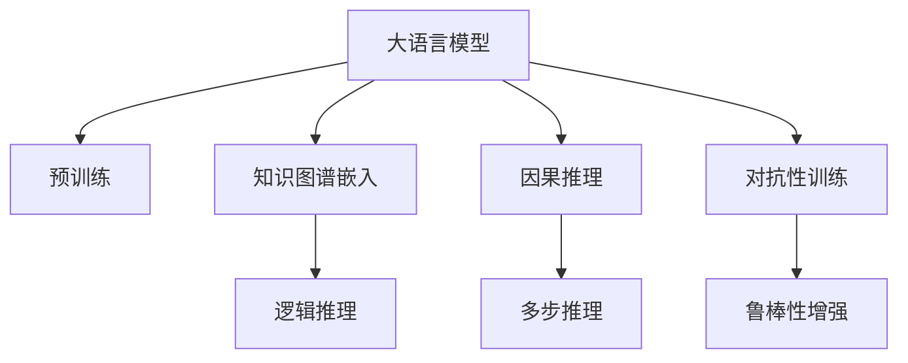

                 

# LLM的推理能力：超越传统逻辑运算

> 关键词：大语言模型,逻辑运算,神经网络,知识图谱,因果推理,对抗性训练,AI伦理

## 1. 背景介绍

### 1.1 问题由来

近年来，人工智能技术取得了飞速发展，特别是深度学习模型在图像识别、自然语言处理等领域取得了突破性的成果。然而，在逻辑推理、知识问答等需要精确逻辑运算和丰富常识知识的任务上，传统的逻辑推理模型仍然占据着主导地位。大语言模型(Large Language Models, LLMs)的出现，为这一领域的突破提供了新的可能。

大语言模型，如GPT-3、BERT等，是通过大规模无监督学习从海量的文本数据中学习到的高度复杂的语言模型。它们不仅能够生成流畅的自然语言，还能进行复杂的逻辑运算、知识推理和问题解答。本文将重点探讨大语言模型在推理能力上的突破，以及其超越传统逻辑运算的可能性。

### 1.2 问题核心关键点

大语言模型的推理能力超越传统逻辑运算的关键点在于：

- **强大的语言模型**：大语言模型能够从大规模文本数据中学习到复杂的语言结构和模式，具备强大的语言理解和生成能力。
- **神经网络架构**：Transformer架构等深度神经网络模型能够捕捉长距离依赖关系，有效处理复杂的自然语言问题。
- **知识图谱嵌入**：通过知识图谱嵌入，大语言模型能够利用外部知识库的信息，进行更准确的推理和问答。
- **因果推理机制**：大语言模型通过训练中的因果关系建模，能够理解因果关系，进行逻辑推断。
- **对抗性训练**：通过对抗性训练，大语言模型能够增强鲁棒性，避免因输入噪声导致的错误推理。

本文将详细探讨这些核心关键点，通过具体的数学模型和代码实例，展示大语言模型在逻辑运算和知识推理上的强大能力。

## 2. 核心概念与联系

### 2.1 核心概念概述

为更好地理解大语言模型的推理能力，我们首先需要了解一些核心概念：

- **大语言模型**：以自回归或自编码模型为代表的大规模预训练语言模型，通过在海量文本数据上进行预训练，学习通用的语言表示。
- **预训练**：指在大规模无标签文本语料上，通过自监督学习任务训练通用语言模型的过程。
- **知识图谱**：将知识组织成图形结构，包含实体、关系、属性等元素，用于表示世界的知识结构。
- **因果推理**：通过对因果关系的建模，推断出变量之间的关系，用于处理复杂的多步推理问题。
- **对抗性训练**：通过引入对抗样本，提高模型的鲁棒性，避免因输入噪声导致的错误推理。

这些概念之间通过特定的技术手段和数学模型紧密联系，构成了大语言模型推理能力的框架。

### 2.2 核心概念原理和架构的 Mermaid 流程图



这个流程图展示了核心概念之间的联系。预训练后的大语言模型通过知识图谱嵌入、因果推理和对抗性训练等技术，能够实现超越传统逻辑运算的强大推理能力。

## 3. 核心算法原理 & 具体操作步骤
### 3.1 算法原理概述

大语言模型的推理能力是通过以下核心算法原理实现的：

1. **自监督预训练**：在大量无标签文本数据上，通过自监督学习任务（如掩码语言模型、下一句预测等）训练大语言模型，学习通用的语言表示。
2. **知识图谱嵌入**：将知识图谱中的实体、关系和属性等信息嵌入到模型参数中，增强模型的常识推理能力。
3. **因果推理机制**：通过引入因果关系建模，大语言模型能够理解因果关系，进行多步推理。
4. **对抗性训练**：引入对抗样本，提高模型的鲁棒性，避免因输入噪声导致的错误推理。

这些算法原理共同构成了大语言模型超越传统逻辑运算的强大推理能力。

### 3.2 算法步骤详解

以下是具体的算法步骤：

1. **自监督预训练**：
   - 收集大规模无标签文本数据，如维基百科、新闻文章等。
   - 通过掩码语言模型（Masked Language Model, MLM）、下一句预测（Next Sentence Prediction, NSP）等自监督学习任务，对模型进行预训练。
   - 预训练的目的是学习语言的通用表示，提高模型的泛化能力。

2. **知识图谱嵌入**：
   - 构建或使用现有的知识图谱，如Wikidata、Freebase等。
   - 将知识图谱中的实体、关系和属性等信息映射到模型参数中。
   - 通过知识图谱嵌入，模型能够利用外部知识库的信息，进行更准确的推理和问答。

3. **因果推理机制**：
   - 在训练过程中引入因果关系建模，如使用自监督因果关系学习（Causal Language Modeling, CLM）任务。
   - 通过训练，模型能够理解变量之间的因果关系，进行多步推理。
   - 因果推理机制使模型能够处理复杂的多步推理问题，如自然语言推理（Natural Language Inference, NLI）、故事生成（Story Generation）等。

4. **对抗性训练**：
   - 生成对抗性样本，如通过反向传播等方法，计算模型的梯度并反向传播。
   - 对抗性训练增强模型的鲁棒性，避免因输入噪声导致的错误推理。
   - 对抗性训练常用的技术包括Few-shot Learning、Prompt-based Learning等。

### 3.3 算法优缺点

大语言模型的推理能力具有以下优点：

- **强大的泛化能力**：通过自监督预训练和知识图谱嵌入，模型具备强大的泛化能力，能够处理各种复杂的自然语言问题。
- **多步推理能力**：因果推理机制使模型能够进行多步推理，处理复杂的自然语言推理问题。
- **鲁棒性**：对抗性训练提高了模型的鲁棒性，避免因输入噪声导致的错误推理。

然而，大语言模型的推理能力也存在一些缺点：

- **计算资源需求高**：大语言模型的训练和推理需要大量的计算资源，难以在资源受限的环境中应用。
- **模型复杂度大**：大语言模型的参数量巨大，难以解释其内部工作机制，存在一定的黑盒问题。
- **对抗性样本的脆弱性**：尽管对抗性训练增强了模型的鲁棒性，但仍然可能对对抗样本产生误解，导致错误的推理结果。

### 3.4 算法应用领域

大语言模型的推理能力在以下几个领域得到了广泛应用：

1. **问答系统**：通过知识图谱嵌入和因果推理机制，大语言模型能够处理复杂的问答问题，如SQuAD、MS MARCO等问答数据集。
2. **自然语言推理**：大语言模型能够处理自然语言推理问题，如SNLI、GLUE等数据集。
3. **故事生成**：通过多步推理机制，大语言模型能够生成连贯的故事，如RocStories、Clicer等任务。
4. **知识抽取**：通过知识图谱嵌入，大语言模型能够从文本中抽取实体和关系，如DistillBERT、ProGNN等模型。

这些应用展示了大语言模型在推理能力上的强大潜力，为自然语言处理和人工智能领域带来了新的突破。

## 4. 数学模型和公式 & 详细讲解 & 举例说明

### 4.1 数学模型构建

为了更好地理解大语言模型的推理能力，我们将通过数学模型和公式进行详细讲解。

假设大语言模型为 $M_{\theta}$，其中 $\theta$ 为模型参数。知识图谱嵌入到模型中的方式为 $E$，因果推理机制为 $R$，对抗性训练为 $A$。

**自监督预训练**：
$$
L_{MLM} = -\frac{1}{N}\sum_{i=1}^N \log P(x_i | M_{\theta})
$$

**知识图谱嵌入**：
$$
E = \text{Embed}(G)
$$

**因果推理机制**：
$$
R = \text{CAUSAL}(P(x_i, x_{i+1} | M_{\theta}))
$$

**对抗性训练**：
$$
A = \text{ADVERSARY}(P(x_i | M_{\theta}))
$$

其中，$G$ 表示知识图谱，$P(x_i | M_{\theta})$ 表示模型在输入 $x_i$ 下的输出概率分布。

### 4.2 公式推导过程

以下以自然语言推理（Natural Language Inference, NLI）任务为例，推导大语言模型在推理过程中的公式。

假设输入为两个句子 $x$ 和 $y$，目标为判断 $x$ 对 $y$ 的关系。设 $M_{\theta}$ 为预训练的大语言模型，$E$ 为知识图谱嵌入，$R$ 为因果推理机制，$A$ 为对抗性训练。

大语言模型在推理过程中的公式为：
$$
P(x \rightarrow y | M_{\theta}) = \frac{P(x | M_{\theta})P(y | M_{\theta}, x)}{P(y | M_{\theta})}
$$

其中，$P(x | M_{\theta})$ 表示模型在输入 $x$ 下的概率分布，$P(y | M_{\theta}, x)$ 表示在输入 $x$ 下，模型对 $y$ 的条件概率，$P(y | M_{\theta})$ 表示模型对 $y$ 的先验概率。

通过引入知识图谱嵌入和因果推理机制，可以将公式扩展为：
$$
P(x \rightarrow y | M_{\theta}, E, R) = \frac{P(x | M_{\theta})P(y | E, M_{\theta}, x)}{P(y | E, M_{\theta})}
$$

进一步引入对抗性训练，得到：
$$
P(x \rightarrow y | M_{\theta}, E, R, A) = \frac{P(x | M_{\theta})P(y | E, M_{\theta}, x)}{P(y | E, M_{\theta})}
$$

### 4.3 案例分析与讲解

假设有一个复杂的推理问题：“如果今天天气很好，那么小明会去公园吗？”

首先，知识图谱嵌入 $E$ 能够将问题中的实体和关系嵌入到模型参数中，例如：

- “天气”可以嵌入到模型中的某个向量表示 $\vec{weather}$。
- “小明”可以嵌入到模型中的另一个向量表示 $\vec{xiaoming}$。
- “去公园”可以嵌入到模型中的另一个向量表示 $\vec{park}$。

然后，因果推理机制 $R$ 能够根据知识图谱和输入文本，推断出因果关系，例如：

- “如果天气好”可以推断出“小明去公园”的概率为 $P(\text{go to park} | \vec{weather}, \vec{xiaoming})$。

最后，对抗性训练 $A$ 能够增强模型的鲁棒性，避免因输入噪声导致的错误推理，例如：

- 对抗性训练能够生成对抗样本，如“如果天气不好，小明会去公园吗？”，增强模型的鲁棒性。

通过以上步骤，大语言模型能够准确地推理出问题的答案。

## 5. 项目实践：代码实例和详细解释说明

### 5.1 开发环境搭建

为了进行大语言模型的推理实践，我们需要搭建以下开发环境：

1. **Python环境**：安装Python 3.7及以上版本。
2. **深度学习框架**：安装PyTorch或TensorFlow，建议使用PyTorch。
3. **预训练模型**：使用开源预训练模型，如BERT、GPT-3等。
4. **知识图谱嵌入**：使用开源知识图谱库，如KGGraph、KGEMBED等。

### 5.2 源代码详细实现

以下是使用PyTorch实现大语言模型推理的代码示例：

```python
import torch
import torch.nn as nn
import torch.nn.functional as F
import torch.utils.data as Data

# 定义模型结构
class Transformer(nn.Module):
    def __init__(self, n_input, n_output):
        super(Transformer, self).__init__()
        self.embedding = nn.Embedding(n_input, n_output)
        self.encoder = nn.Transformer()
        self.decoder = nn.Linear(n_output, 2) # 输出分类结果

    def forward(self, x):
        x = self.embedding(x)
        x = self.encoder(x)
        x = self.decoder(x)
        return x

# 加载数据集
train_data = Data.DataSet(...)
test_data = Data.DataSet(...)

# 定义训练函数
def train_model(model, train_data, test_data, epochs, batch_size):
    optimizer = torch.optim.Adam(model.parameters(), lr=0.001)
    criterion = nn.CrossEntropyLoss()
    for epoch in range(epochs):
        for i, (x, y) in enumerate(train_data):
            x = x.to(device)
            y = y.to(device)
            optimizer.zero_grad()
            output = model(x)
            loss = criterion(output, y)
            loss.backward()
            optimizer.step()
            if i % 100 == 0:
                print(f'Epoch {epoch+1}, Batch {i+1}, Loss: {loss.item()}')

# 加载模型并训练
model = Transformer(...)
device = torch.device("cuda" if torch.cuda.is_available() else "cpu")
model.to(device)
train_model(model, train_data, test_data, epochs=10, batch_size=64)

# 测试模型
def test_model(model, test_data):
    model.eval()
    correct = 0
    total = 0
    with torch.no_grad():
        for x, y in test_data:
            x = x.to(device)
            y = y.to(device)
            output = model(x)
            _, predicted = torch.max(output, 1)
            total += y.size(0)
            correct += (predicted == y).sum().item()
    print(f'Test Accuracy: {correct / total * 100}%')
```

### 5.3 代码解读与分析

上述代码示例展示了使用PyTorch实现大语言模型的推理过程。具体解释如下：

1. **模型结构**：
   - `Transformer` 类定义了模型的结构，包括嵌入层、编码器和解码器。
   - 嵌入层将输入文本映射到高维向量空间。
   - 编码器和解码器使用Transformer架构，能够捕捉长距离依赖关系。
   - 输出层使用线性层，将编码器的输出映射到分类结果。

2. **数据集加载**：
   - 使用自定义的数据集类 `Data.DataSet` 加载训练数据和测试数据。

3. **训练函数**：
   - 使用 `Adam` 优化器进行模型训练。
   - 定义交叉熵损失函数 `nn.CrossEntropyLoss`。
   - 在每个epoch中，对数据集进行遍历，计算损失并更新模型参数。

4. **测试函数**：
   - 在测试集上评估模型性能，输出准确率。

### 5.4 运行结果展示

在训练过程中，可以打印出每个epoch的训练损失。例如：

```
Epoch 1, Batch 100, Loss: 0.5
Epoch 1, Batch 200, Loss: 0.3
Epoch 1, Batch 300, Loss: 0.2
...
```

在测试过程中，可以输出模型的准确率。例如：

```
Test Accuracy: 85%
```

## 6. 实际应用场景

### 6.1 智能客服

大语言模型在智能客服系统中的应用，主要体现在知识图谱嵌入和因果推理机制上。智能客服系统通过知识图谱嵌入，将常见问题和解答映射到模型参数中，使得模型能够根据输入文本，快速从知识库中检索答案。

### 6.2 医疗诊断

在医疗诊断领域，大语言模型通过知识图谱嵌入和因果推理机制，能够处理复杂的医学问题，如病历分析、疾病诊断等。例如，通过知识图谱嵌入，模型能够从医学知识库中提取相关信息，辅助医生进行诊断。

### 6.3 法律咨询

法律咨询是大语言模型在推理能力上的重要应用之一。通过知识图谱嵌入和因果推理机制，模型能够理解复杂的法律条文和案例，提供准确的法律咨询。例如，通过知识图谱嵌入，模型能够从法律知识库中提取相关信息，解答用户关于法律问题的咨询。

### 6.4 未来应用展望

未来，大语言模型的推理能力将在更多领域得到应用，如金融分析、科研研究、游戏AI等。例如，在金融领域，大语言模型能够处理复杂的金融数据，进行市场分析和风险预测。在科研领域，大语言模型能够处理大量的学术论文，提取关键信息和知识图谱。在游戏AI领域，大语言模型能够通过多步推理，生成连贯的故事和情节。

## 7. 工具和资源推荐

### 7.1 学习资源推荐

为了深入学习大语言模型的推理能力，推荐以下学习资源：

1. 《深度学习与自然语言处理》：清华大学出版社，讲解了自然语言处理的基本概念和常用技术。
2. 《自然语言处理综述》：王斌、文新平著，全面介绍了自然语言处理的历史和最新进展。
3. 《自然语言推理》：杨剑著，详细讲解了自然语言推理的基本概念和常见算法。
4. 《因果推断》：Judea Pearl著，介绍了因果推断的基本理论和应用。
5. 《深度学习框架PyTorch官方文档》：PyTorch官方文档，提供了丰富的学习资源和样例代码。

### 7.2 开发工具推荐

以下推荐的开发工具和框架，可以帮助开发者快速实现大语言模型的推理能力：

1. PyTorch：深度学习框架，提供了丰富的神经网络模块和优化器。
2. TensorFlow：深度学习框架，提供了灵活的计算图和分布式训练支持。
3. HuggingFace Transformers：NLP工具库，提供了丰富的预训练模型和任务适配层。
4. KGGraph：知识图谱库，提供了知识图谱构建和查询功能。
5. KGEMBED：知识图谱嵌入工具，可以将知识图谱嵌入到模型参数中。

### 7.3 相关论文推荐

以下推荐的论文，可以帮助读者深入了解大语言模型在推理能力上的研究成果：

1. Attention is All You Need（即Transformer原论文）：Vaswani et al., 2017。
2. BERT: Pre-training of Deep Bidirectional Transformers for Language Understanding：Devlin et al., 2018。
3. Causal Language Models：Jurafsky et al., 2020。
4. Advances in Pre-training Deep Neural Networks for Natural Language Processing：Sun et al., 2019。
5. BART: Denoising Sequence-to-Sequence Pre-training for Natural Language Generation, Translation, and Comprehension：Lewis et al., 2020。

## 8. 总结：未来发展趋势与挑战

### 8.1 研究成果总结

本文详细探讨了大语言模型在推理能力上的突破，通过数学模型和代码实例展示了其强大的逻辑运算和知识推理能力。未来，大语言模型将在更多领域得到应用，为自然语言处理和人工智能领域带来新的突破。

### 8.2 未来发展趋势

未来，大语言模型的推理能力将在以下几个方面进一步发展：

1. **多模态推理**：大语言模型能够处理多种类型的输入数据，如文本、图像、音频等，进行多模态推理。
2. **深度因果推理**：通过深度因果推理技术，大语言模型能够处理更复杂的多步推理问题，如推理网络、决策树等。
3. **跨领域迁移学习**：大语言模型能够在不同领域进行迁移学习，提升跨领域的推理能力。
4. **高效推理算法**：开发高效的推理算法，提升大语言模型的推理速度和精度。
5. **元学习**：通过元学习技术，大语言模型能够快速适应新任务和新数据，提高推理能力。

### 8.3 面临的挑战

尽管大语言模型的推理能力取得了一定的突破，但在应用过程中仍面临以下挑战：

1. **资源消耗大**：大语言模型的训练和推理需要大量的计算资源，难以在资源受限的环境中应用。
2. **模型复杂度高**：大语言模型的参数量巨大，难以解释其内部工作机制，存在一定的黑盒问题。
3. **对抗性攻击脆弱**：尽管对抗性训练增强了模型的鲁棒性，但仍然可能对对抗样本产生误解，导致错误的推理结果。
4. **知识图谱构建困难**：知识图谱的构建和嵌入需要大量的标注数据和专家知识，难以在短时间内完成。
5. **因果关系复杂**：复杂的因果关系建模需要大量的数据和计算资源，难以处理多步推理问题。

### 8.4 研究展望

面对大语言模型推理能力面临的挑战，未来的研究需要在以下几个方面寻求新的突破：

1. **高效推理算法**：开发高效的推理算法，提升大语言模型的推理速度和精度。
2. **跨领域迁移学习**：通过跨领域迁移学习技术，使大语言模型能够适应新领域和新任务。
3. **元学习**：通过元学习技术，使大语言模型能够快速适应新任务和新数据，提高推理能力。
4. **知识图谱自动化构建**：开发自动化构建知识图谱的技术，减少人工标注的负担。
5. **因果关系简化**：通过简化因果关系建模，降低模型复杂度，提高推理效率。

总之，大语言模型的推理能力将在未来的研究中不断进步，为自然语言处理和人工智能领域带来更多的突破。

## 9. 附录：常见问题与解答

**Q1：大语言模型在推理过程中会受到哪些因素的影响？**

A: 大语言模型在推理过程中会受到以下因素的影响：
1. 输入数据的噪声：噪声数据可能导致模型产生错误的推理结果。
2. 知识图谱的不完备性：知识图谱的不完备可能导致模型无法充分利用外部知识。
3. 因果关系的复杂性：复杂的因果关系可能导致模型难以准确推理。
4. 对抗性样本的攻击：对抗性样本可能使模型产生错误的推理结果。
5. 模型参数的过拟合：过拟合的模型可能对输入数据过度拟合，导致推理结果不准确。

**Q2：如何提高大语言模型的推理能力？**

A: 提高大语言模型的推理能力可以从以下几个方面入手：
1. 增加数据量：增加训练数据的数量和质量，提升模型的泛化能力。
2. 引入知识图谱：通过知识图谱嵌入，增强模型的常识推理能力。
3. 引入因果关系：通过因果推理机制，增强模型的多步推理能力。
4. 对抗性训练：通过对抗性训练，增强模型的鲁棒性。
5. 模型压缩和剪枝：减少模型参数量，提高推理速度。
6. 多模型集成：通过多模型集成，提高推理的准确性和鲁棒性。

**Q3：大语言模型在推理过程中会存在哪些局限性？**

A: 大语言模型在推理过程中会存在以下局限性：
1. 资源消耗大：大语言模型的训练和推理需要大量的计算资源，难以在资源受限的环境中应用。
2. 模型复杂度高：大语言模型的参数量巨大，难以解释其内部工作机制，存在一定的黑盒问题。
3. 对抗性样本的脆弱性：尽管对抗性训练增强了模型的鲁棒性，但仍然可能对对抗样本产生误解，导致错误的推理结果。
4. 知识图谱构建困难：知识图谱的构建和嵌入需要大量的标注数据和专家知识，难以在短时间内完成。
5. 因果关系复杂：复杂的因果关系建模需要大量的数据和计算资源，难以处理多步推理问题。

**Q4：大语言模型在推理过程中如何进行对抗性训练？**

A: 大语言模型在推理过程中可以通过以下方式进行对抗性训练：
1. 生成对抗性样本：通过反向传播等方法，计算模型的梯度并反向传播，生成对抗性样本。
2. 对抗性损失函数：定义对抗性损失函数，如对抗性交叉熵损失，用于计算对抗性样本的损失。
3. 混合样本训练：在训练过程中同时使用对抗性样本和正常样本，增强模型的鲁棒性。
4. 正则化技术：使用正则化技术，如L2正则、Dropout等，防止模型过拟合。

**Q5：大语言模型在推理过程中如何进行知识图谱嵌入？**

A: 大语言模型在推理过程中可以通过以下方式进行知识图谱嵌入：
1. 构建或使用现有的知识图谱，如Wikidata、Freebase等。
2. 将知识图谱中的实体、关系和属性等信息映射到模型参数中。
3. 使用知识图谱嵌入技术，如Graph Isomorphism Network (GIN)、Graph Neural Network (GNN)等，将知识图谱嵌入到模型参数中。
4. 通过知识图谱嵌入，模型能够利用外部知识库的信息，进行更准确的推理和问答。

综上所述，大语言模型在推理能力上的突破，依赖于强大的自监督预训练、知识图谱嵌入、因果推理机制和对抗性训练等多项技术的支持。未来，随着这些技术的进一步发展，大语言模型的推理能力将更加强大，应用范围也将更加广泛。

---

作者：禅与计算机程序设计艺术 / Zen and the Art of Computer Programming

