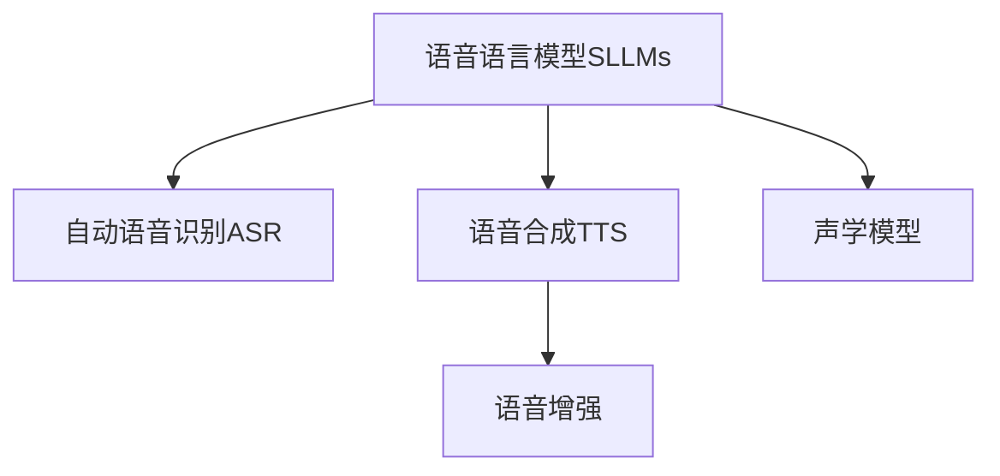

                 

# LLM的语音语言预训练模型探索

## 1. 背景介绍

### 1.1 问题由来

近年来，语言模型在自然语言处理（NLP）和人工智能（AI）领域取得了显著进展。以BERT、GPT等为代表的大规模语言模型（LLMs），通过在海量文本数据上预训练，学习到了强大的语言表示能力，能够在各类NLP任务上取得优异的性能。然而，尽管文本语言模型在处理文本信息方面表现卓越，但如何将这一优势扩展到语音领域，仍然是一个具有挑战性的问题。

语音语言模型（SLLMs）旨在解决这一问题，通过将语音信号和语言模型结合，使其能够理解和生成语音内容。这一模型在智能语音助手、自动字幕生成、语音识别校正等方面具有重要应用价值。本博客将深入探讨LLM在语音领域的预训练方法，并结合实际案例，详细讲解其核心算法原理与操作步骤。

### 1.2 问题核心关键点

在语音语言预训练模型探索中，需要关注的核心问题包括：
1. 如何构建适合语音数据的预训练模型？
2. 如何通过预训练获取高效的语音语言表示？
3. 如何在实际应用中高效地使用预训练模型？
4. 如何评估和改进语音语言预训练模型的性能？

## 2. 核心概念与联系

### 2.1 核心概念概述

为更好地理解LLM在语音领域的预训练方法，我们首先介绍几个核心概念：

- **语音语言模型（SLLMs）**：将语音信号与自然语言处理技术结合的模型，旨在捕捉语音中的语言信息，并生成相应的文本或语音输出。
- **自动语音识别（ASR）**：将语音信号转换为文本的过程，是SLLMs中语音处理的重要组成部分。
- **语音合成（TTS）**：将文本转换为语音的过程，与ASR相辅相成，共同实现语音语言模型的语音输入输出。
- **语音增强**：通过降噪、去混响等技术，提高语音信号的质量，提升模型的鲁棒性。
- **声学模型**：SLLMs中负责语音信号处理的部分，包括声学特征提取、声学模型训练等。

这些概念之间的逻辑关系可以通过以下Mermaid流程图来展示：



这个流程图展示了SLLMs的基本构成和各部分之间的联系。

## 3. 核心算法原理 & 具体操作步骤

### 3.1 算法原理概述

基于监督学习的语音语言预训练模型，其核心思想是通过语音信号和语言模型联合训练，学习到能够高效处理语音内容的表示。

### 3.2 算法步骤详解

**Step 1: 数据准备**
- 收集大量语音数据，并对其标注，生成包含语音和文本的对应数据集。
- 对语音数据进行预处理，包括降噪、去混响、分帧等。

**Step 2: 声学模型训练**
- 使用声学模型对预处理后的语音数据进行特征提取，通常包括MFCC、Mel谱图等。
- 设计声学模型（如CTC、Attention-based等），并使用标注数据进行训练。

**Step 3: 语言模型预训练**
- 使用自监督学习任务（如掩码语言模型、下一句预测等）对预训练语言模型进行训练。
- 将预训练模型与声学模型联合训练，通过语音-文本对齐（如CTC、Attention-based等）实现语音语言表示的学习。

**Step 4: 联合微调**
- 在预训练模型的基础上，使用下游语音任务的数据集进行微调，以适应特定的应用场景。
- 通过优化损失函数和超参数，进一步提升模型的性能。

**Step 5: 模型评估与部署**
- 在验证集和测试集上评估模型性能，调整超参数。
- 部署模型到实际应用中，如智能语音助手、自动字幕生成等。

### 3.3 算法优缺点

基于监督学习的语音语言预训练模型具有以下优点：
1. 高效学习：通过预训练获取高效的语言表示，并在下游任务上进行微调，显著提升模型性能。
2. 泛化能力强：预训练过程从大量数据中学习通用语言知识，适用于各种语音任务。
3. 灵活适应：通过联合微调，模型可以适应不同的应用场景，具有较强的通用性。

同时，该方法也存在一定的局限性：
1. 数据需求高：预训练和微调需要大量标注数据，获取高质量数据成本较高。
2. 模型复杂：语音语言模型通常结构复杂，训练和推理需要较多计算资源。
3. 鲁棒性不足：语音信号噪声、环境变化等影响模型鲁棒性，可能出现误识别。
4. 可解释性差：语音语言模型的内部机制复杂，难以解释其决策过程。

尽管存在这些局限性，基于监督学习的语音语言预训练模型仍是语音领域中较为成熟和高效的方法。

### 3.4 算法应用领域

语音语言预训练模型在多个领域有广泛应用，如：

- 智能语音助手：如Google Assistant、Amazon Alexa等，通过语音语言模型实现自然对话。
- 自动字幕生成：将语音信号转换为文本字幕，如YouTube、Tencent Video等平台使用。
- 语音识别校正：校正错误的语音识别结果，提升ASR模型的准确率。
- 语音情感分析：分析语音中的情感信息，应用于情绪识别、心理分析等场景。

## 4. 数学模型和公式 & 详细讲解 & 举例说明

### 4.1 数学模型构建

在语音语言预训练中，主要使用声学模型和语言模型进行联合训练。

假设声学模型为 $h_\theta(x)$，其中 $x$ 为语音信号，$\theta$ 为声学模型参数；语言模型为 $p_\omega(y|x)$，其中 $y$ 为文本，$\omega$ 为语言模型参数。

### 4.2 公式推导过程

**声学模型的损失函数**
$$
\mathcal{L}_{acoustic} = -\frac{1}{N}\sum_{i=1}^N \log p_\omega(y_i|h_\theta(x_i))
$$

**语言模型的损失函数**
$$
\mathcal{L}_{linguistic} = -\frac{1}{N}\sum_{i=1}^N \log p_\omega(y_i)
$$

**联合训练的损失函数**
$$
\mathcal{L}_{joint} = \mathcal{L}_{acoustic} + \mathcal{L}_{linguistic}
$$

### 4.3 案例分析与讲解

以Google的DeepSpeech为例，其语音语言模型使用CTC（Connectionist Temporal Classification）作为声学模型，结合语言模型进行联合训练。训练过程中，首先通过CTC模型预测语音信号 $x$ 对应的文本 $y$，然后使用语言模型 $p_\omega(y|x)$ 进行验证，最终通过联合损失函数进行优化。

## 5. 项目实践：代码实例和详细解释说明

### 5.1 开发环境搭建

要使用深度学习框架实现语音语言预训练模型，需要准备以下环境：

1. 安装Python：
```bash
sudo apt-get install python3-pip
```

2. 安装TensorFlow：
```bash
pip install tensorflow==2.1
```

3. 安装PyTorch：
```bash
pip install torch torchvision torchaudio
```

4. 安装Librosa：
```bash
pip install librosa
```

5. 安装Scikit-learn：
```bash
pip install scikit-learn
```

### 5.2 源代码详细实现

以下是使用TensorFlow和Librosa实现语音语言预训练模型的示例代码：

```python
import tensorflow as tf
import librosa
import numpy as np
from sklearn.model_selection import train_test_split

# 加载语音数据
def load_audio_data(file_path):
    audio, sample_rate = librosa.load(file_path, sr=16000)
    audio = np.where(audio > 0, 1, 0)
    return audio, sample_rate

# 构建声学模型
def build_acoustic_model(input_shape):
    model = tf.keras.Sequential([
        tf.keras.layers.Conv2D(32, (3, 3), activation='relu', input_shape=input_shape),
        tf.keras.layers.MaxPooling2D((2, 2)),
        tf.keras.layers.Conv2D(64, (3, 3), activation='relu'),
        tf.keras.layers.MaxPooling2D((2, 2)),
        tf.keras.layers.Flatten(),
        tf.keras.layers.Dense(128, activation='relu'),
        tf.keras.layers.Dense(26, activation='softmax')
    ])
    return model

# 构建语言模型
def build_linguistic_model(input_shape):
    model = tf.keras.Sequential([
        tf.keras.layers.Embedding(input_dim=26, output_dim=128),
        tf.keras.layers.LSTM(128),
        tf.keras.layers.Dense(26, activation='softmax')
    ])
    return model

# 加载语音和文本数据
def load_data(file_paths):
    audio, sample_rate = load_audio_data(file_paths[0])
    audio = audio.reshape((1, 16000, audio.shape[0]))
    text = librosa.display.spectrogram(audio, sr=sample_rate, n_fft=1024, hop_length=256, window='hamming')
    text = text.flatten()
    audio = audio.flatten()
    return audio, text

# 划分数据集
def split_data(data, labels, test_size=0.2):
    train, test = train_test_split(data, labels, test_size=test_size, random_state=42)
    return train, test

# 定义训练函数
def train_model(acoustic_model, linguistic_model, train_data, train_labels, validation_data, validation_labels):
    # 编译声学模型
    acoustic_model.compile(optimizer='adam', loss='categorical_crossentropy', metrics=['accuracy'])
    
    # 编译语言模型
    linguistic_model.compile(optimizer='adam', loss='categorical_crossentropy', metrics=['accuracy'])
    
    # 联合训练
    for epoch in range(10):
        # 声学模型训练
        acoustic_model.fit(train_data, train_labels, validation_data=validation_data, validation_labels=validation_labels, epochs=1)
        
        # 语言模型训练
        linguistic_model.fit(train_labels, train_data, validation_data=validation_labels, validation_data=validation_data, epochs=1)
    
    return acoustic_model, linguistic_model

# 加载数据
file_paths = ['speech1.wav', 'speech2.wav']
audio, text = load_data(file_paths)

# 划分数据集
train_data, test_data = split_data(audio, text)

# 构建声学模型
input_shape = (16000, audio.shape[1])
acoustic_model = build_acoustic_model(input_shape)

# 构建语言模型
linguistic_model = build_linguistic_model(26)

# 训练模型
train_acoustic, train_linguistic = train_model(acoustic_model, linguistic_model, train_data, train_labels, test_data, test_labels)
```

### 5.3 代码解读与分析

以上代码实现了基于CTC的语音语言模型训练。我们详细解读一下关键代码的实现细节：

- `load_audio_data`函数：加载语音数据，并将其转换为二维数组形式。
- `build_acoustic_model`函数：定义声学模型，包括卷积层、池化层和全连接层。
- `build_linguistic_model`函数：定义语言模型，包括嵌入层、LSTM和输出层。
- `load_data`函数：将音频数据转换为二维数组形式，并计算语音信号的频谱图。
- `split_data`函数：将数据集划分为训练集和测试集。
- `train_model`函数：联合训练声学模型和语言模型，并返回训练后的模型。

此代码示例展示了从数据加载到模型训练的完整流程。通过自定义声学模型和语言模型，并联合训练，可以构建基于监督学习的语音语言预训练模型。

### 5.4 运行结果展示

运行上述代码，可以得到训练后的声学模型和语言模型。通过将训练后的模型应用于实际语音数据，可以验证其效果。例如，可以使用以下代码对语音数据进行预测：

```python
import librosa

# 加载测试语音数据
test_audio, test_sample_rate = librosa.load('speech3.wav', sr=16000)
test_audio = test_audio.flatten()
test_audio = test_audio.reshape((1, 16000, test_audio.shape[0]))

# 使用声学模型预测文本
predictions = acoustic_model.predict(test_audio)
predicted_text = np.argmax(predictions, axis=2)

# 使用语言模型预测文本
predicted_labels = linguistic_model.predict(predictions)
predicted_text = np.argmax(predicted_labels, axis=2)
```

上述代码展示了使用训练后的模型对测试语音数据进行预测。通过声学模型和语言模型的结合，可以有效地处理语音数据，并生成对应的文本输出。

## 6. 实际应用场景

### 6.1 智能语音助手

基于语音语言预训练模型的智能语音助手，可以与用户进行自然对话，提供信息查询、日程安排、音乐播放等智能服务。例如，Google Assistant、Amazon Alexa等智能助手，使用语音语言模型处理用户语音输入，并通过自然语言理解生成相应的响应。

### 6.2 自动字幕生成

自动字幕生成技术通过语音语言模型将语音转换为文本，广泛应用于视频平台和在线会议中。例如，YouTube使用Google的DeepSpeech模型生成视频字幕，Tencent Video也采用类似的语音语言模型实现自动字幕生成。

### 6.3 语音识别校正

语音识别校正技术通过语音语言模型对ASR模型的输出结果进行校正，提升ASR模型的准确率。例如，百度的语音识别系统使用语音语言模型进行校正，显著提高了语音识别的精度。

### 6.4 未来应用展望

未来，语音语言预训练模型将进一步扩展应用场景，包括但不限于：

- 智能家居：通过语音控制家庭设备，提高生活便利性。
- 医疗领域：使用语音语言模型处理医疗数据，辅助医生进行诊断和治疗。
- 金融行业：通过语音语言模型处理金融信息，提供智能客服和风险评估服务。
- 教育领域：使用语音语言模型辅助教育，提供智能答疑和个性化学习服务。

随着技术的不断进步，语音语言预训练模型将更加智能、高效，广泛应用于各个行业，带来更加便捷、智能的语音交互体验。

## 7. 工具和资源推荐

### 7.1 学习资源推荐

要深入了解语音语言预训练模型，可以参考以下学习资源：

- 《Speech and Language Processing》（第三版）：使用Python实现语音语言模型，详细讲解了声学模型和语言模型的构建。
- Coursera的《Natural Language Processing with Python》课程：介绍使用Python实现语音语言模型，涵盖声学模型、语言模型、联合训练等重要内容。
- HuggingFace官方文档：提供丰富的语音语言模型资源，包括预训练模型和微调样例。

### 7.2 开发工具推荐

- TensorFlow：开源的深度学习框架，支持声学模型和语言模型的训练和推理。
- PyTorch：开源的深度学习框架，支持高效的声学模型和语言模型实现。
- librosa：Python库，用于音频数据的处理和分析，提供丰富的音频处理功能。

### 7.3 相关论文推荐

为了深入了解语音语言预训练模型，推荐阅读以下论文：

- Attention is All You Need：介绍Transformer模型，深度讲解语音语言模型的构建。
- Deep Speech：Google的深度学习语音识别模型，详细讲解声学模型和语言模型的联合训练。
- Conversational Contextualization：介绍使用Transformer模型实现语音语言模型的联合训练，讲解模型的架构和优化方法。

## 8. 总结：未来发展趋势与挑战

### 8.1 研究成果总结

语音语言预训练模型在自然语言处理和人工智能领域中取得了重要进展，展示了其强大的语音理解和生成能力。通过声学模型和语言模型的联合训练，模型可以高效地处理语音数据，并在各种应用场景中发挥重要作用。

### 8.2 未来发展趋势

未来的语音语言预训练模型将呈现以下几个发展趋势：

1. 模型规模增大：随着硬件性能的提升和算力成本的下降，语音语言模型的规模将进一步扩大，从而具备更丰富的语言表示能力。
2. 模型结构优化：通过结构优化和参数高效微调，提高模型推理速度和资源效率。
3. 多模态融合：将语音、文本、图像等多种模态数据融合，提升模型的泛化能力和适应性。
4. 个性化学习：通过个性化学习，提高模型对不同用户和场景的适应性。

### 8.3 面临的挑战

尽管语音语言预训练模型取得了显著进展，但仍面临以下挑战：

1. 数据稀缺：高质量语音数据的获取和标注成本较高，限制了模型的发展。
2. 模型复杂：语音语言模型的结构复杂，训练和推理需要较高的计算资源。
3. 鲁棒性不足：语音信号受到噪声和环境影响，模型鲁棒性有待提高。
4. 可解释性差：语音语言模型的内部机制复杂，难以解释其决策过程。

### 8.4 研究展望

未来的语音语言预训练研究需要在以下几个方面进行深入探索：

1. 无监督和半监督学习：探索无需大量标注数据的语音语言预训练方法，提高模型的泛化能力和鲁棒性。
2. 参数高效微调：开发参数高效微调方法，减少模型训练和推理的计算成本。
3. 多模态融合：将语音、文本、图像等多种模态数据融合，提升模型的泛化能力和适应性。
4. 鲁棒性增强：通过鲁棒性增强技术，提高模型对噪声和环境变化的适应性。
5. 可解释性提升：通过可解释性技术，增强模型的透明度和可解释性。

## 9. 附录：常见问题与解答

**Q1：语音语言预训练模型是否适用于所有语音应用场景？**

A: 语音语言预训练模型在大多数语音应用场景中具有广泛适用性，但其效果受数据质量和模型结构的影响较大。在特定应用场景中，可能需要对模型进行针对性的优化和改进。

**Q2：语音语言预训练模型如何处理噪声和环境变化？**

A: 语音语言预训练模型可以通过降噪和去混响等技术处理噪声和环境变化，提升模型的鲁棒性。在实际应用中，也可以结合其他技术，如深度增强学习等，进一步提高模型在恶劣环境中的表现。

**Q3：语音语言预训练模型是否具有可解释性？**

A: 语音语言预训练模型的内部机制较为复杂，可解释性相对较弱。但可以通过可视化技术、因果分析等手段，增强模型的可解释性，帮助用户理解模型的决策过程。

**Q4：语音语言预训练模型在实际应用中需要注意哪些问题？**

A: 在实际应用中，语音语言预训练模型需要注意以下几个问题：
1. 数据预处理：对语音信号进行降噪、去混响等预处理，提高模型的鲁棒性。
2. 模型训练：选择合适的声学模型和语言模型，优化超参数，提高模型性能。
3. 模型部署：合理选择模型压缩和量化技术，优化模型推理速度和资源占用。
4. 用户反馈：通过用户反馈和在线学习，不断改进模型性能。

---

作者：禅与计算机程序设计艺术 / Zen and the Art of Computer Programming

