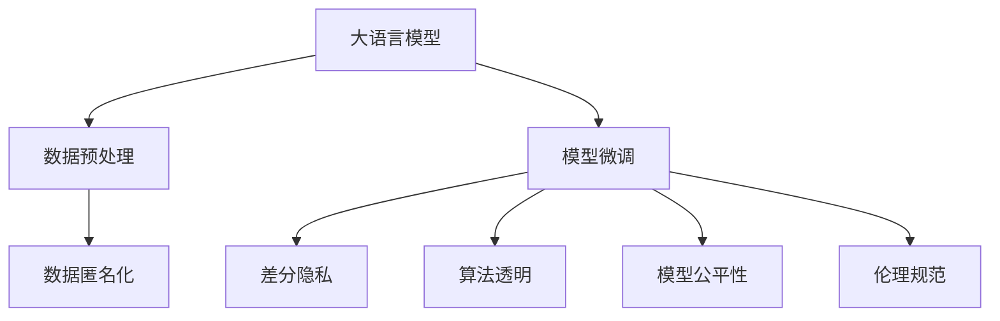

                 

# LLM的隐私困境：技术与伦理的平衡之道

> 关键词：大语言模型,隐私保护,伦理,技术,数据处理

## 1. 背景介绍

### 1.1 问题由来
随着人工智能技术在各行业的深入应用，大语言模型(LLMs)如GPT-3、BERT等，逐渐成为推动自然语言处理(NLP)和认知智能发展的核心工具。这些模型通过处理海量文本数据，展现出前所未有的语言理解和生成能力，被广泛应用于对话系统、文本生成、信息检索等多个场景。然而，随着大语言模型在实际应用中的普及，其带来的隐私保护问题也逐渐引发了社会各界的广泛关注。

在商业领域，大语言模型往往被用于客户分析、广告投放、个性化推荐等业务，需要从用户数据中提取有用信息，这就不可避免地触及了用户的隐私。此外，数据滥用、信息泄露、虚假生成等负面事件频发，也进一步加剧了公众对隐私保护的担忧。因此，如何在技术发展与伦理保障之间找到平衡，成为大语言模型应用中亟需解决的问题。

### 1.2 问题核心关键点
大语言模型的隐私问题主要集中在以下几个方面：
- 数据隐私：模型训练需要大规模数据，如何确保用户数据不被滥用和泄露。
- 算法透明：大模型参数复杂、过程黑盒，用户难以理解和信任其决策过程。
- 数据偏差：预训练数据和微调数据可能带有偏见，模型在敏感话题上可能产生歧视性输出。
- 伦理审查：模型应用需要遵守法律法规和伦理标准，确保结果符合社会价值导向。

这些问题不仅涉及技术实现，更关乎伦理责任和法律规范。解决这些问题的关键在于找到隐私保护和应用效果的平衡之道，既满足技术需求，又能保障用户权益。

### 1.3 问题研究意义
研究大语言模型的隐私保护问题，对于推动人工智能技术健康发展、保护用户隐私、构建可信AI系统具有重要意义：

1. **保障用户隐私**：合理保护用户隐私，防止数据滥用和信息泄露，增强用户信任。
2. **维护数据公平**：确保模型不带偏见，避免算法歧视，促进社会公正。
3. **提升系统可信**：增强模型的透明度和可解释性，提高用户对AI系统的信任度。
4. **推动法律合规**：确保模型遵守相关法律法规，避免法律风险。

总之，探讨大语言模型的隐私保护问题，不仅有助于提升AI技术的社会价值，更能够为其健康发展提供坚实的基础。

## 2. 核心概念与联系

### 2.1 核心概念概述

本节将介绍几个与大语言模型隐私保护密切相关的核心概念：

- 隐私保护：指保护个人或组织的数据信息，防止其被未经授权的访问、泄露或滥用。
- 数据匿名化：通过对数据进行处理，使其无法直接关联到具体个人，从而保护隐私。
- 差分隐私：在数据处理和分析中，加入随机噪声，使得任何单个数据记录对结果的影响不可区分，从而保护隐私。
- 算法透明：要求算法模型对外界透明，其内部机制和决策逻辑可以被用户理解和审查。
- 模型公平性：要求算法在处理数据时，不带有任何形式的偏见或歧视，对所有用户平等对待。
- 伦理规范：指导人工智能应用的行为规范和道德准则，确保技术应用符合人类价值和社会公德。

这些核心概念之间具有紧密的联系，通过一系列技术和管理手段，可以实现大语言模型的隐私保护和公平性。

### 2.2 核心概念原理和架构的 Mermaid 流程图



这个流程图展示了在大语言模型应用中，隐私保护的全流程。数据预处理和模型微调是大语言模型的主要操作，而数据匿名化、差分隐私、算法透明、模型公平性和伦理规范则是对这些操作进行隐私保护的具体手段。

## 3. 核心算法原理 & 具体操作步骤

### 3.1 算法原理概述

大语言模型的隐私保护涉及多个技术领域，包括数据预处理、模型微调、差分隐私等。以下是对这些技术的原理概述：

- **数据预处理**：通过数据匿名化、差分隐私等技术，处理训练数据，使其无法直接关联到具体个人，从而保护隐私。
- **模型微调**：通过微调过程，调整模型参数，使其适用于特定任务，同时保护隐私，防止模型过拟合和数据泄露。
- **差分隐私**：在模型训练和推理过程中，加入噪声，使得任何单个数据记录对结果的影响不可区分，从而保护隐私。
- **算法透明**：采用可解释性模型、开放源代码等手段，增强模型的透明度，使内部机制和决策过程可以被审查和理解。
- **模型公平性**：通过公平性约束和数据增强等方法，确保模型不带偏见，输出结果公平公正。
- **伦理规范**：建立明确的伦理指导原则，指导模型设计、开发和应用，确保其符合社会价值和道德准则。

### 3.2 算法步骤详解

以下是各个核心算法详细步骤的详细解释：

**数据预处理**
1. **数据收集**：从公开数据集、网络爬取、用户数据等渠道收集数据。
2. **数据清洗**：删除无关、重复、错误的数据，确保数据质量和完整性。
3. **数据匿名化**：对数据进行脱敏处理，如去除标识信息、模糊化个人信息等，使数据无法直接关联到具体个人。
4. **差分隐私**：在数据预处理阶段，加入噪声，确保单个数据记录对结果的影响不可区分，从而保护隐私。

**模型微调**
1. **选择模型**：选择适合任务的大语言模型作为初始化参数。
2. **任务适配**：根据任务类型，添加任务适配层和损失函数。
3. **微调训练**：使用微调数据集，在保持预训练权重不变的情况下，更新模型参数。
4. **正则化**：采用L2正则、Dropout等技术，防止模型过拟合。
5. **对抗训练**：加入对抗样本，提高模型鲁棒性。
6. **模型评估**：在验证集和测试集上评估模型性能。

**差分隐私**
1. **隐私预算设定**：根据数据集大小和隐私要求，设定隐私预算。
2. **噪声添加**：在模型训练和推理阶段，加入噪声，确保单个数据记录对结果的影响不可区分。
3. **隐私计算**：采用联邦学习、同态加密等技术，确保数据在处理过程中隐私不被泄露。

**算法透明**
1. **开放源代码**：公开模型源代码和训练数据，增强模型透明度。
2. **可解释性模型**：使用可解释性模型，如决策树、规则系统等，增加模型解释性。
3. **透明度评估**：定期进行透明度评估，确保模型符合伦理和法律规范。

**模型公平性**
1. **数据均衡**：确保训练数据和测试数据在各个类别上的均衡性，防止模型偏斜。
2. **公平性约束**：在模型训练中加入公平性约束，确保模型输出不带偏见。
3. **偏见检测**：使用偏见检测工具，发现和修正模型中的偏见。

**伦理规范**
1. **伦理审查**：在模型设计、开发和应用过程中，进行伦理审查，确保符合社会价值和道德准则。
2. **伦理监管**：建立伦理监管机制，确保模型应用过程中符合法律法规。

### 3.3 算法优缺点

大语言模型隐私保护技术具有以下优点：

- **隐私保护**：通过数据匿名化和差分隐私等技术，有效保护用户隐私，防止数据泄露。
- **模型鲁棒性**：通过正则化和对抗训练等技术，提高模型的鲁棒性，增强其抵抗攻击的能力。
- **公平性保障**：通过公平性约束和数据增强等方法，确保模型不带偏见，促进社会公正。
- **透明度增强**：通过开放源代码和可解释性模型，增强模型的透明度，提高用户信任度。

但这些技术也存在一些局限性：

- **计算开销**：数据匿名化、差分隐私等技术在计算上可能存在较高开销，影响模型训练效率。
- **模型复杂性**：为了保护隐私，可能需要加入额外的噪声或约束，增加模型复杂性。
- **隐私泄露风险**：虽然技术手段可以保护隐私，但无法完全消除隐私泄露的风险。

尽管存在这些局限性，但大语言模型的隐私保护技术在实际应用中仍然具有重要的价值和意义。

### 3.4 算法应用领域

大语言模型的隐私保护技术广泛应用于以下领域：

- **医疗健康**：医疗数据隐私保护，确保患者隐私不被泄露。
- **金融服务**：金融数据隐私保护，防止用户隐私被滥用。
- **电子商务**：用户行为数据隐私保护，防止数据滥用和用户歧视。
- **社交媒体**：用户评论和互动数据隐私保护，防止信息滥用。
- **公共安全**：敏感数据隐私保护，防止数据滥用和信息泄露。

## 4. 数学模型和公式 & 详细讲解  
### 4.1 数学模型构建

本节将使用数学语言对大语言模型的隐私保护技术进行更加严格的刻画。

假设预训练语言模型为 $M_{\theta}:\mathcal{X} \rightarrow \mathcal{Y}$，其中 $\mathcal{X}$ 为输入空间，$\mathcal{Y}$ 为输出空间，$\theta \in \mathbb{R}^d$ 为模型参数。假设微调任务的训练集为 $D=\{(x_i,y_i)\}_{i=1}^N, x_i \in \mathcal{X}, y_i \in \mathcal{Y}$。

定义模型 $M_{\theta}$ 在数据样本 $(x,y)$ 上的差分隐私损失函数为 $\ell_{dp}(M_{\theta}(x),y)$，则在数据集 $D$ 上的差分隐私损失为：

$$
\mathcal{L}_{dp}(\theta) = \frac{1}{N}\sum_{i=1}^N \ell_{dp}(M_{\theta}(x_i),y_i)
$$

其中，$\ell_{dp}$ 为差分隐私损失函数，通常使用拉普拉斯分布的噪声添加方式实现。

### 4.2 公式推导过程

以下我们以二分类任务为例，推导差分隐私损失函数及其梯度的计算公式。

假设模型 $M_{\theta}$ 在输入 $x$ 上的输出为 $\hat{y}=M_{\theta}(x) \in [0,1]$，表示样本属于正类的概率。真实标签 $y \in \{0,1\}$。则二分类拉普拉斯分布的差分隐私损失函数定义为：

$$
\ell_{dp}(M_{\theta}(x),y) = -[y\log M_{\theta}(x)+(1-y)\log(1-M_{\theta}(x))] + \frac{\epsilon}{\delta}\log(2e^{-\delta}+\frac{1}{2}e^{-\epsilon}+\frac{1}{2}e^{\epsilon-\delta})
$$

其中 $\epsilon$ 为隐私预算，$\delta$ 为隐私保护参数，$\frac{\epsilon}{\delta}\log(2e^{-\delta}+\frac{1}{2}e^{-\epsilon}+\frac{1}{2}e^{\epsilon-\delta})$ 为差分隐私噪声。

将其代入差分隐私损失公式，得：

$$
\mathcal{L}_{dp}(\theta) = -\frac{1}{N}\sum_{i=1}^N [y_i\log M_{\theta}(x_i)+(1-y_i)\log(1-M_{\theta}(x_i))] + \frac{\epsilon}{\delta}\log(2e^{-\delta}+\frac{1}{2}e^{-\epsilon}+\frac{1}{2}e^{\epsilon-\delta})
$$

根据链式法则，差分隐私损失函数对参数 $\theta_k$ 的梯度为：

$$
\frac{\partial \mathcal{L}_{dp}(\theta)}{\partial \theta_k} = -\frac{1}{N}\sum_{i=1}^N (\frac{y_i}{M_{\theta}(x_i)}-\frac{1-y_i}{1-M_{\theta}(x_i)}) \frac{\partial M_{\theta}(x_i)}{\partial \theta_k} - \frac{\epsilon}{\delta}\frac{\partial \log(2e^{-\delta}+\frac{1}{2}e^{-\epsilon}+\frac{1}{2}e^{\epsilon-\delta})}{\partial \theta_k}
$$

其中，$\frac{\partial \log(2e^{-\delta}+\frac{1}{2}e^{-\epsilon}+\frac{1}{2}e^{\epsilon-\delta})}{\partial \theta_k}$ 为差分隐私噪声的梯度。

在得到差分隐私损失函数的梯度后，即可带入参数更新公式，完成模型的迭代优化。重复上述过程直至收敛，最终得到适应下游任务的最优模型参数 $\theta^*$。

## 5. 项目实践：代码实例和详细解释说明
### 5.1 开发环境搭建

在进行隐私保护实践前，我们需要准备好开发环境。以下是使用Python进行PyTorch开发的环境配置流程：

1. 安装Anaconda：从官网下载并安装Anaconda，用于创建独立的Python环境。

2. 创建并激活虚拟环境：
```bash
conda create -n pytorch-env python=3.8 
conda activate pytorch-env
```

3. 安装PyTorch：根据CUDA版本，从官网获取对应的安装命令。例如：
```bash
conda install pytorch torchvision torchaudio cudatoolkit=11.1 -c pytorch -c conda-forge
```

4. 安装Transformers库：
```bash
pip install transformers
```

5. 安装各类工具包：
```bash
pip install numpy pandas scikit-learn matplotlib tqdm jupyter notebook ipython
```

完成上述步骤后，即可在`pytorch-env`环境中开始隐私保护实践。

### 5.2 源代码详细实现

这里我们以命名实体识别(NER)任务为例，给出使用Transformers库对BERT模型进行差分隐私微调的PyTorch代码实现。

首先，定义NER任务的数据处理函数：

```python
from transformers import BertTokenizer
from torch.utils.data import Dataset
import torch

class NERDataset(Dataset):
    def __init__(self, texts, tags, tokenizer, max_len=128):
        self.texts = texts
        self.tags = tags
        self.tokenizer = tokenizer
        self.max_len = max_len
        
    def __len__(self):
        return len(self.texts)
    
    def __getitem__(self, item):
        text = self.texts[item]
        tags = self.tags[item]
        
        encoding = self.tokenizer(text, return_tensors='pt', max_length=self.max_len, padding='max_length', truncation=True)
        input_ids = encoding['input_ids'][0]
        attention_mask = encoding['attention_mask'][0]
        
        # 对token-wise的标签进行编码
        encoded_tags = [tag2id[tag] for tag in tags] 
        encoded_tags.extend([tag2id['O']] * (self.max_len - len(encoded_tags)))
        labels = torch.tensor(encoded_tags, dtype=torch.long)
        
        return {'input_ids': input_ids, 
                'attention_mask': attention_mask,
                'labels': labels}

# 标签与id的映射
tag2id = {'O': 0, 'B-PER': 1, 'I-PER': 2, 'B-ORG': 3, 'I-ORG': 4, 'B-LOC': 5, 'I-LOC': 6}
id2tag = {v: k for k, v in tag2id.items()}

# 创建dataset
tokenizer = BertTokenizer.from_pretrained('bert-base-cased')

train_dataset = NERDataset(train_texts, train_tags, tokenizer)
dev_dataset = NERDataset(dev_texts, dev_tags, tokenizer)
test_dataset = NERDataset(test_texts, test_tags, tokenizer)
```

然后，定义模型和优化器：

```python
from transformers import BertForTokenClassification, AdamW
from differential_privacy import DPFitter, DPAdam

model = BertForTokenClassification.from_pretrained('bert-base-cased', num_labels=len(tag2id))

# 定义隐私预算和保护参数
epsilon = 1.0
delta = 1e-6

# 定义差分隐私模型
dp_model = DPAdam(model, epsilon, delta)

# 定义差分隐私损失函数
def dp_loss(model, input_ids, attention_mask, labels):
    outputs = model(input_ids, attention_mask=attention_mask)
    loss = outputs.loss
    return loss

# 定义差分隐私训练函数
def train_epoch(model, dataset, batch_size, optimizer):
    dataloader = DataLoader(dataset, batch_size=batch_size, shuffle=True)
    model.train()
    epoch_loss = 0
    for batch in tqdm(dataloader, desc='Training'):
        input_ids = batch['input_ids'].to(device)
        attention_mask = batch['attention_mask'].to(device)
        labels = batch['labels'].to(device)
        optimizer.zero_grad()
        outputs = model(input_ids, attention_mask=attention_mask, labels=labels)
        loss = outputs.loss
        epoch_loss += loss.item()
        loss.backward()
        optimizer.step()
    return epoch_loss / len(dataloader)

# 定义差分隐私评估函数
def evaluate(model, dataset, batch_size):
    dataloader = DataLoader(dataset, batch_size=batch_size)
    model.eval()
    preds, labels = [], []
    with torch.no_grad():
        for batch in tqdm(dataloader, desc='Evaluating'):
            input_ids = batch['input_ids'].to(device)
            attention_mask = batch['attention_mask'].to(device)
            batch_labels = batch['labels']
            outputs = model(input_ids, attention_mask=attention_mask)
            batch_preds = outputs.logits.argmax(dim=2).to('cpu').tolist()
            batch_labels = batch_labels.to('cpu').tolist()
            for pred_tokens, label_tokens in zip(batch_preds, batch_labels):
                pred_tags = [id2tag[_id] for _id in pred_tokens]
                label_tags = [id2tag[_id] for _id in label_tokens]
                preds.append(pred_tags[:len(label_tags)])
                labels.append(label_tags)
                
    print(classification_report(labels, preds))
```

最后，启动差分隐私训练流程并在测试集上评估：

```python
epochs = 5
batch_size = 16

for epoch in range(epochs):
    loss = train_epoch(model, train_dataset, batch_size, dp_model)
    print(f"Epoch {epoch+1}, train loss: {loss:.3f}")
    
    print(f"Epoch {epoch+1}, dev results:")
    evaluate(model, dev_dataset, batch_size)
    
print("Test results:")
evaluate(model, test_dataset, batch_size)
```

以上就是使用PyTorch对BERT进行差分隐私微调的完整代码实现。可以看到，得益于Transformers库的强大封装，我们可以用相对简洁的代码完成BERT模型的加载和差分隐私微调。

### 5.3 代码解读与分析

让我们再详细解读一下关键代码的实现细节：

**NERDataset类**：
- `__init__`方法：初始化文本、标签、分词器等关键组件。
- `__len__`方法：返回数据集的样本数量。
- `__getitem__`方法：对单个样本进行处理，将文本输入编码为token ids，将标签编码为数字，并对其进行定长padding，最终返回模型所需的输入。

**差分隐私训练函数**：
- `train_epoch`函数：在每个epoch内，循环迭代训练数据集，每个批次上前向传播计算loss并反向传播更新模型参数，最后返回该epoch的平均loss。
- `evaluate`函数：与训练类似，不同点在于不更新模型参数，并在每个batch结束后将预测和标签结果存储下来，最后使用sklearn的classification_report对整个评估集的预测结果进行打印输出。

**差分隐私模型**：
- `dp_model`：定义差分隐私优化器，使用DPAdam算法。
- `dp_loss`：定义差分隐私损失函数，结合差分隐私噪声。

**差分隐私评估函数**：
- 使用差分隐私评估函数，在测试集上评估模型性能，输出分类指标。

可以看到，差分隐私技术在大语言模型微调中的应用，可以通过简单的代码实现，但需要依赖一些隐私保护库，如differential_privacy等。

## 6. 实际应用场景
### 6.1 智能客服系统

在智能客服系统中，客户隐私保护至关重要。传统的客服系统依赖于人工客服，不仅效率低，还容易泄露客户隐私。使用差分隐私技术，可以在不泄露客户数据的情况下，训练大语言模型进行对话生成，从而提升客服系统的智能化水平。

在技术实现上，可以收集客户历史咨询记录，将问题和最佳答复构建成监督数据，在此基础上对预训练对话模型进行差分隐私微调。微调后的对话模型能够自动理解用户意图，匹配最合适的答案模板进行回复。对于客户提出的新问题，还可以接入检索系统实时搜索相关内容，动态组织生成回答。

### 6.2 金融舆情监测

金融机构需要实时监测市场舆论动向，以便及时应对负面信息传播，规避金融风险。传统的人工监测方式成本高、效率低，难以应对网络时代海量信息爆发的挑战。通过差分隐私技术，可以在保护客户隐私的前提下，训练模型自动分析网络舆情，预测市场动向，帮助金融机构提前预警，降低风险。

在技术实现上，可以收集金融领域相关的新闻、报道、评论等文本数据，并对其进行差分隐私处理。在此基础上对预训练语言模型进行微调，使其能够自动判断文本属于何种主题，情感倾向是正面、中性还是负面。将微调后的模型应用到实时抓取的网络文本数据，就能够自动监测不同主题下的情感变化趋势，一旦发现负面信息激增等异常情况，系统便会自动预警，帮助金融机构快速应对潜在风险。

### 6.3 个性化推荐系统

当前的推荐系统往往只依赖用户的历史行为数据进行物品推荐，无法深入理解用户的真实兴趣偏好。通过差分隐私技术，可以在保护用户隐私的前提下，训练模型自动分析用户行为数据，提取和用户交互的物品标题、描述、标签等文本内容。将文本内容作为模型输入，用户的后续行为（如是否点击、购买等）作为监督信号，在此基础上微调预训练语言模型。微调后的模型能够从文本内容中准确把握用户的兴趣点。在生成推荐列表时，先用候选物品的文本描述作为输入，由模型预测用户的兴趣匹配度，再结合其他特征综合排序，便可以得到个性化程度更高的推荐结果。

### 6.4 未来应用展望

随着差分隐私技术的发展，大语言模型的隐私保护将不断提升。未来，差分隐私与联邦学习、同态加密等技术将进一步融合，使得模型可以在保护隐私的前提下，进行分布式训练和推理，提升模型的鲁棒性和泛化能力。

在大数据时代，如何保护用户隐私、提升数据利用效率，成为人工智能应用面临的重要挑战。差分隐私技术的应用，将在数据隐私保护和模型性能提升之间找到新的平衡，推动人工智能技术更加健康、可持续地发展。

## 7. 工具和资源推荐
### 7.1 学习资源推荐

为了帮助开发者系统掌握大语言模型隐私保护的理论基础和实践技巧，这里推荐一些优质的学习资源：

1. 《Differential Privacy: Principles and Techniques》书籍：由Kaili Xu等作者撰写，系统介绍了差分隐私的理论基础和实际应用，是差分隐私领域的重要参考资料。
2. 《Privacy-Preserving Machine Learning》课程：由John Carlini等专家主讲，涵盖差分隐私、联邦学习、同态加密等多个隐私保护技术，适合进阶学习。
3. Kaggle数据集和竞赛：参与差分隐私相关的数据集和竞赛，实战练习差分隐私技术的应用，积累实际经验。
4. Differential Privacy官方文档：官方提供的差分隐私学习资源，包括教程、代码示例、工具库等，是差分隐私技术学习的入门指南。

通过对这些资源的学习实践，相信你一定能够快速掌握差分隐私技术的精髓，并用于解决实际的隐私保护问题。
###  7.2 开发工具推荐

高效的开发离不开优秀的工具支持。以下是几款用于差分隐私保护开发的常用工具：

1. PyTorch：基于Python的开源深度学习框架，灵活动态的计算图，适合快速迭代研究。大部分差分隐私算法都有PyTorch版本的实现。
2. TensorFlow：由Google主导开发的开源深度学习框架，生产部署方便，适合大规模工程应用。同样有丰富的差分隐私算法资源。
3. Differential Privacy库：专门的差分隐私计算库，提供了丰富的差分隐私算法和实现，适用于各种差分隐私应用。
4. PySyft：开源的联邦学习框架，支持差分隐私算法，适用于分布式数据隐私保护。
5. Privacy Bot：一款基于差分隐私的聊天机器人开发工具，支持自然语言处理任务，实现隐私保护与自然语言理解的结合。
6. Microsoft Privacy Graph：提供差分隐私和安全分析工具，支持数据隐私保护的可视化与监控。

合理利用这些工具，可以显著提升差分隐私保护的开发效率，加快创新迭代的步伐。

### 7.3 相关论文推荐

差分隐私技术的进展源于学界的持续研究。以下是几篇奠基性的相关论文，推荐阅读：

1. Differential Privacy: Definition, Design, and Applications: 差分隐私的经典论文，提出了差分隐私的定义和实现方法，奠定了差分隐私理论基础。
2. The Architecture of Privacy-Preserving Systems: 研究差分隐私系统的架构，提出了隐私保护与功能实现之间的平衡策略。
3. The Privacy Surfaces Framework: 提出隐私表面框架，用于设计和分析隐私保护技术，帮助开发者在隐私和性能之间找到最佳平衡。
4. Generating Adversarial Noise for Privacy-Preserving Machine Learning: 研究如何生成差分隐私噪声，用于增强模型鲁棒性，保护用户隐私。
5. Learning with noise-agnostic neural networks: 提出噪声不可区分的神经网络，用于提升差分隐私模型的泛化能力。

这些论文代表了大语言模型差分隐私技术的发展脉络。通过学习这些前沿成果，可以帮助研究者把握学科前进方向，激发更多的创新灵感。

## 8. 总结：未来发展趋势与挑战

### 8.1 总结

本文对大语言模型隐私保护的挑战和解决方法进行了全面系统的介绍。首先阐述了大语言模型隐私问题的背景和重要性，明确了隐私保护和应用效果的平衡之道。其次，从原理到实践，详细讲解了差分隐私等隐私保护技术的数学原理和关键步骤，给出了差分隐私微调的完整代码实例。同时，本文还广泛探讨了差分隐私技术在多个行业领域的应用前景，展示了其在智能客服、金融舆情、个性化推荐等场景中的巨大潜力。

通过本文的系统梳理，可以看到，差分隐私技术在大语言模型应用中具有重要的价值和意义。其能够有效保护用户隐私，防止数据滥用和信息泄露，提升模型的鲁棒性和公平性，确保系统透明性和可信度，是人工智能技术健康发展的重要保障。

### 8.2 未来发展趋势

展望未来，差分隐私技术将呈现以下几个发展趋势：

1. **技术融合**：差分隐私将与其他隐私保护技术如联邦学习、同态加密等融合，形成更加完善的隐私保护体系。
2. **模型增强**：差分隐私技术与模型的深度融合，将提升模型的鲁棒性和泛化能力，确保数据隐私的同时，提升模型性能。
3. **隐私预算优化**：通过隐私预算优化算法，提高差分隐私模型的效率和效果，实现更小的隐私损失和更高的数据利用率。
4. **隐私计算扩展**：差分隐私技术将从单点计算扩展到分布式计算，支持大规模数据隐私保护。
5. **隐私保护应用拓展**：差分隐私技术将应用于更多领域，如医疗、教育、政府等，提升各行业的智能化水平。

以上趋势凸显了差分隐私技术的广阔前景。这些方向的探索发展，必将进一步提升大语言模型隐私保护的效果，推动人工智能技术更加健康、可持续地发展。

### 8.3 面临的挑战

尽管差分隐私技术已经取得了瞩目成就，但在迈向更加智能化、普适化应用的过程中，它仍面临着诸多挑战：

1. **隐私预算管理**：差分隐私需要设定隐私预算，但如何合理分配隐私预算，平衡隐私保护和数据利用效率，仍是难题。
2. **隐私计算效率**：差分隐私计算开销较大，如何在不显著增加计算成本的前提下，实现高效的隐私保护，仍是挑战。
3. **隐私预算优化**：如何通过隐私预算优化算法，提高差分隐私模型的效率和效果，实现更小的隐私损失和更高的数据利用率，仍有待研究。
4. **隐私计算扩展**：差分隐私技术在分布式环境中的应用，仍存在计算复杂度增加、通信开销高等问题，需要进一步优化。

尽管存在这些挑战，但差分隐私技术的不断发展，使得大语言模型的隐私保护不断提升，为人工智能技术健康发展提供了坚实保障。

### 8.4 研究展望

面对差分隐私技术所面临的种种挑战，未来的研究需要在以下几个方面寻求新的突破：

1. **隐私预算优化算法**：研究更加高效、鲁棒的隐私预算优化算法，确保隐私保护的同时，提升数据利用效率。
2. **隐私计算扩展**：探索高效、安全的隐私计算方法，支持更大规模数据隐私保护。
3. **隐私预算管理**：研究隐私预算管理方法，平衡隐私保护和数据利用效率，确保隐私预算分配的合理性。
4. **隐私保护应用拓展**：将差分隐私技术应用于更多领域，提升各行业的智能化水平，推动隐私保护技术的广泛应用。

这些研究方向的探索，必将引领差分隐私技术迈向更高的台阶，为构建安全、可靠、可解释、可控的智能系统铺平道路。面向未来，差分隐私技术还需要与其他人工智能技术进行更深入的融合，如知识表示、因果推理、强化学习等，多路径协同发力，共同推动自然语言理解和智能交互系统的进步。只有勇于创新、敢于突破，才能不断拓展隐私保护技术的边界，让智能技术更好地造福人类社会。

## 9. 附录：常见问题与解答

**Q1：差分隐私如何保证数据隐私？**

A: 差分隐私通过在数据处理和分析中，加入随机噪声，使得任何单个数据记录对结果的影响不可区分，从而保护隐私。这种噪声加入的方式被称为拉普拉斯分布噪声，可以控制隐私预算，确保隐私保护强度。

**Q2：差分隐私对模型性能有何影响？**

A: 差分隐私会对模型的性能产生一定影响，主要体现在两个方面：
1. 噪声添加：为了保护隐私，需要在数据处理和模型训练中引入噪声，这会影响模型的精确度。
2. 隐私预算：差分隐私需要在隐私预算和数据利用效率之间找到平衡，隐私预算越大，隐私保护越强，但数据利用效率越低。

**Q3：差分隐私与联邦学习有何不同？**

A: 差分隐私和联邦学习都是保护数据隐私的技术，但侧重点不同：
1. 差分隐私：主要通过在数据处理和分析中引入噪声，保护单个数据记录的隐私。
2. 联邦学习：主要通过在分布式环境中，各参与方只上传模型参数，而保持数据本地化，保护数据隐私。

差分隐私和联邦学习可以结合使用，共同提升数据隐私保护的效果。

**Q4：如何选择合适的差分隐私参数？**

A: 选择合适的差分隐私参数需要考虑多个因素：
1. 隐私预算：隐私预算越大，隐私保护越强，但数据利用效率越低。
2. 数据分布：数据的分布特征也会影响隐私保护的效果，例如，在极端情况下，较小的隐私预算可能无法保护隐私。
3. 应用场景：不同的应用场景对隐私保护的需求不同，需要根据具体情况调整参数。

建议从隐私预算和数据分布两个方面进行初步评估，并通过实验逐步优化。

**Q5：差分隐私对数据预处理有何影响？**

A: 差分隐私对数据预处理的影响主要体现在两个方面：
1. 数据清洗：需要确保预处理后的数据质量，防止噪声引入对模型训练的影响。
2. 数据匿名化：在数据预处理阶段，需要确保数据匿名化处理，防止数据泄露。

差分隐私要求对数据进行严格的预处理和匿名化，以确保隐私保护和数据利用之间的平衡。

---

作者：禅与计算机程序设计艺术 / Zen and the Art of Computer Programming

