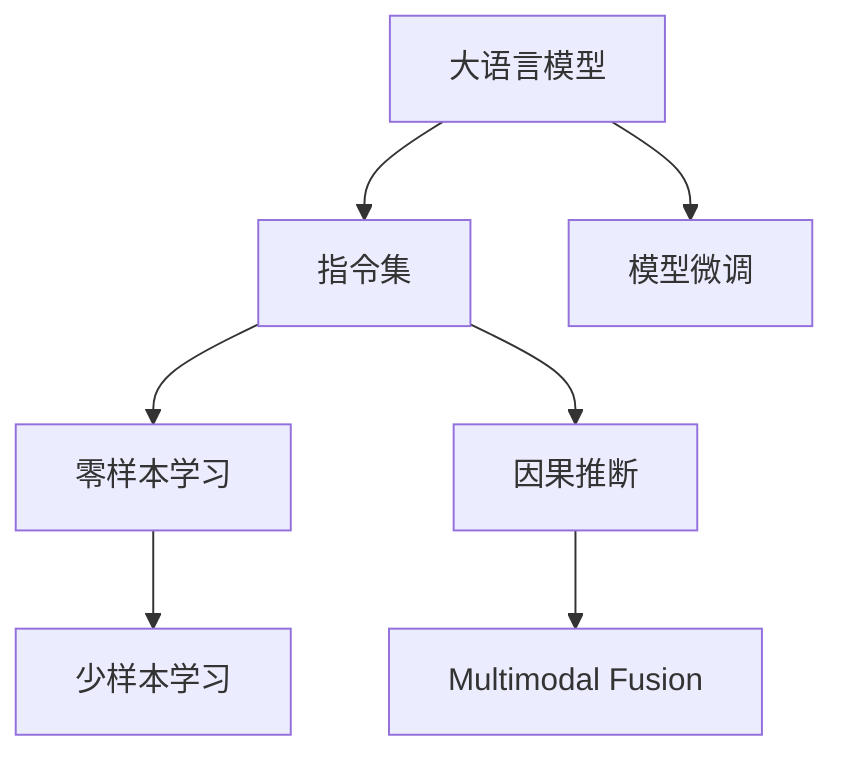

                 

# LLM的魔力：创造无限可能的指令集

> 关键词：大语言模型(LLM),指令集,零样本学习,知识迁移,因果推断,多模态融合,未来应用,技术挑战

## 1. 背景介绍

### 1.1 问题由来

自OpenAI的GPT-3横空出世以来，大语言模型(LLM)已经成为人工智能领域的一大热门话题。作为最先进的自然语言处理(NLP)工具，大语言模型能够通过学习海量的文本数据，具备极高的语言理解能力和生成能力。然而，由于其复杂的结构和庞大的参数量，LLM在实际应用中仍然面临诸多挑战。

为应对这些挑战，研究人员提出了基于指令集(Instructive Prompt)的微调方法。即通过精心设计的提示模板，将用户的具体任务需求转化为模型可执行的指令，引导模型在未见过的数据上做出精确预测或生成。这种方法不仅减少了对标注数据的依赖，还能在无监督或少监督的情况下取得良好效果，具备了无限的可能性。

### 1.2 问题核心关键点

基于指令集的微调方法，本质上是将通用语言模型转换为任务特定的、能够遵循自然语言指令进行推理或生成的模型。这种转换过程需要解决以下几个关键问题：

- 如何设计有效的指令模板，使得模型能够准确理解用户的任务需求？
- 如何在不增加模型参数量的情况下，提升模型的执行能力？
- 如何从已有知识中迁移出解决新任务所需的推理逻辑？
- 如何在保持模型鲁棒性的同时，增强其因果推断能力？
- 如何融合多模态信息，提高模型的跨领域适应性？

### 1.3 问题研究意义

指令集微调方法不仅能大大降低数据标注成本，同时还能在零样本或少样本的情况下，快速适应新的应用场景。因此，它对提高模型的泛化能力和灵活性，加速NLP技术在各行各业的落地应用具有重要意义。

通过深入研究基于指令集的微调技术，我们能更好地理解和控制大语言模型的行为，避免模型的误解或误判，从而构建更加稳定、可解释的智能系统。

## 2. 核心概念与联系

### 2.1 核心概念概述

为了更深入地理解基于指令集的微调方法，本节将介绍以下几个核心概念：

- 大语言模型(LLM)：一类通过自监督学习获得语言理解能力的深度学习模型，如GPT系列、BERT等。
- 指令集(Instructive Prompt)：用于引导模型执行特定任务的文本描述，通常由用户定义，具有明确的执行逻辑和规则。
- 零样本学习(Zero-shot Learning)：模型在未见过的数据上，仅通过任务描述就能执行新任务的能力。
- 少样本学习(Few-shot Learning)：模型在仅有少量标注样本的情况下，仍能进行有效学习的能力。
- 因果推断(Causal Inference)：通过控制变量的逻辑推理，预测因果关系，提升模型的决策合理性。
- 多模态融合(Multimodal Fusion)：将文本、图像、语音等多种数据类型融合起来，提升模型的感知和理解能力。

这些核心概念之间的联系可以通过以下Mermaid流程图来展示：



这个流程图展示了各个概念之间的联系：

1. 大语言模型通过学习大量文本数据，获得语言理解能力。
2. 指令集用于指导模型执行特定任务。
3. 零样本和少样本学习通过指令集实现，进一步提升模型的灵活性。
4. 因果推断和多模态融合使得模型具备更强的逻辑推理和感知能力。
5. 模型微调可以将通用大语言模型转换为任务特定的模型。

这些概念共同构成了基于指令集的大语言模型微调框架，使得模型能够在零样本或少样本情况下，通过精确的推理生成，满足用户需求。

## 3. 核心算法原理 & 具体操作步骤
### 3.1 算法原理概述

基于指令集的大语言模型微调，本质上是一个通过控制变量逻辑推理，提升模型执行能力的过程。其核心思想是：通过精心设计的指令集，将用户的任务需求转化为可执行的推理或生成任务，从而在未见过的数据上，使得模型具备一定的执行能力。

形式化地，假设目标任务为 $T$，指令集为 $I$，则模型的执行过程可以表示为：

$$
M_T(x;I) = \mathop{\arg\max}_{y} \{P(y|I,x)\}
$$

其中 $M_T$ 表示基于指令集 $I$ 执行任务 $T$ 的模型，$P(y|I,x)$ 为模型在输入 $x$ 和指令 $I$ 下，输出 $y$ 的概率分布。

通过优化模型的概率分布，我们可以提升其在特定任务上的执行能力。通常，优化过程通过最大化对数似然损失函数实现：

$$
\mathcal{L} = -\sum_{i=1}^N \log P(y_i|I,x_i)
$$

其中 $y_i$ 为任务 $T$ 的标注数据，$x_i$ 为对应的输入数据。

### 3.2 算法步骤详解

基于指令集的大语言模型微调，一般包括以下几个关键步骤：

**Step 1: 准备指令集**
- 设计或收集指令集 $I$，确保指令描述能够准确表达任务的逻辑和规则。
- 指令集应包含常见的执行动词、任务变量以及输入输出格式等信息。

**Step 2: 模型适配层设计**
- 在预训练模型顶层添加任务适配层，以处理输入数据和输出结果。
- 适配层通常包括输入解码器、指令解码器、输出编码器等模块，能够将自然语言指令转化为模型可执行的表示。

**Step 3: 训练优化**
- 使用少量标注数据 $D=\{(x_i,y_i)\}_{i=1}^N$，对模型进行微调训练。
- 通过最大化对数似然损失函数，优化模型的执行概率分布。
- 使用AdamW等优化算法，设置合适的学习率和正则化参数。

**Step 4: 模型评估**
- 在验证集和测试集上评估模型性能。
- 利用BLEU、ROUGE、F1-score等指标，衡量模型生成结果与真实标注的相似度。

**Step 5: 模型部署**
- 将微调后的模型部署到实际应用系统中。
- 设计API接口，供其他系统调用，实现实时推理预测。

### 3.3 算法优缺点

基于指令集的大语言模型微调方法，具有以下优点：

- 减少标注数据需求。指令集微调能够通过用户自然语言指令，自动学习任务需求，无需额外标注。
- 提升模型泛化能力。模型在零样本或少样本情况下，仍能准确执行任务，提升了模型的适应性。
- 模型执行效率高。通过精心设计的指令集，模型能够高效地执行复杂推理和生成任务。
- 可解释性强。指令集微调后的模型，其决策过程可通过指令模板进行解释和调试，提高了模型的透明性。

然而，该方法也存在一些局限性：

- 指令设计复杂。设计有效的指令集需要充分理解任务需求和模型架构，难度较大。
- 模型推理复杂。当任务复杂度较高时，模型推理过程较为复杂，需要较高的计算资源。
- 泛化能力有限。指令集微调的效果仍受限于标注数据的质量和数量。
- 模型多样性受限。指令集微调后的模型，其执行范围受限于指令模板，可能无法涵盖更广泛的场景。

### 3.4 算法应用领域

基于指令集的大语言模型微调方法，已经在多个领域取得了显著应用：

- 问答系统：通过自然语言问答模板，引导模型在零样本情况下，生成答案。
- 对话系统：利用指令集构建对话模型，生成自然流畅的对话内容。
- 文本生成：在少样本情况下，生成文本摘要、翻译、文本创作等任务。
- 知识推理：通过逻辑推理模板，在零样本情况下，进行知识推理和事实判断。
- 机器翻译：设计指令集，引导模型在零样本情况下，进行语言翻译。
- 图像生成：将图像特征和指令结合，生成具有特定风格的图像内容。
- 自动化办公：通过指令集实现自动化任务，如文本分类、信息提取、日程安排等。

这些应用场景展示了指令集微调方法在提高模型执行能力、简化系统设计、增强系统灵活性方面的强大潜力。

## 4. 数学模型和公式 & 详细讲解
### 4.1 数学模型构建

基于指令集的大语言模型微调，通过指令集将任务需求编码为模型可执行的指令，引导模型执行特定任务。假设指令集 $I$ 包含 $n$ 个指令，每个指令 $i$ 可以表示为 $I_i=(v_i,x_i,y_i)$，其中 $v_i$ 表示指令动词，$x_i$ 表示任务输入，$y_i$ 表示任务输出。

模型的执行过程可以表示为：

$$
P(y|I,x) = \prod_{i=1}^n P(y_i|I_i,x)
$$

其中 $P(y_i|I_i,x)$ 表示在指令 $I_i$ 和输入 $x$ 下，输出 $y_i$ 的概率分布。

### 4.2 公式推导过程

以生成文本摘要为例，推导基于指令集的微调过程。假设任务为生成输入文本 $x$ 的摘要 $y$，指令集为 $I$，则模型的生成过程可以表示为：

$$
P(y|I,x) = \prod_{i=1}^n P(y_i|I_i,x)
$$

其中指令 $I_i$ 包含动词 "summary"，输入 $x$ 为原始文本，输出 $y_i$ 为摘要片段。

优化目标为最大化对数似然损失函数：

$$
\mathcal{L} = -\sum_{i=1}^n \log P(y_i|I_i,x)
$$

模型在指令 $I_i$ 下，生成摘要片段 $y_i$ 的概率分布为：

$$
P(y_i|I_i,x) = \frac{e^{\log P(y_i|x)}}{e^{\log P(y_i|x)} + \sum_{j=1}^{n-1} e^{\log P(y_j|x)}}
$$

其中 $P(y_i|x)$ 为原始文本 $x$ 生成摘要片段 $y_i$ 的概率。

优化过程中，我们通过最大化对数似然损失函数，对模型进行训练：

$$
\theta^* = \mathop{\arg\min}_{\theta} \mathcal{L}(\theta)
$$

其中 $\theta$ 为模型的可学习参数。

### 4.3 案例分析与讲解

下面通过一个具体的案例，来分析基于指令集的微调方法在生成文本摘要中的应用。

**案例：自动生成新闻摘要**

假设要自动生成新闻 $x$ 的摘要 $y$，可以设计如下指令集：

```
[summary('1st paragraph'), summary('2nd paragraph'), ...]
```

每个指令包含动词 "summary" 和对应的段落编号。模型的执行过程为：

1. 将输入新闻 $x$ 分为若干段落 $x_1, x_2, \ldots, x_k$。
2. 对每个段落 $x_i$，生成摘要片段 $y_i$。
3. 将各段摘要片段拼接，生成最终摘要 $y$。

通过指令集微调，模型能够根据给定的段落编号，生成对应的摘要片段，最终生成完整的新闻摘要。这种方法不需要额外的标注数据，能够实现少样本学习和零样本学习，具备较高的灵活性和泛化能力。

## 5. 项目实践：代码实例和详细解释说明
### 5.1 开发环境搭建

在进行基于指令集的微调实践前，我们需要准备好开发环境。以下是使用Python进行PyTorch开发的环境配置流程：

1. 安装Anaconda：从官网下载并安装Anaconda，用于创建独立的Python环境。

2. 创建并激活虚拟环境：
```bash
conda create -n pytorch-env python=3.8 
conda activate pytorch-env
```

3. 安装PyTorch：根据CUDA版本，从官网获取对应的安装命令。例如：
```bash
conda install pytorch torchvision torchaudio cudatoolkit=11.1 -c pytorch -c conda-forge
```

4. 安装Transformers库：
```bash
pip install transformers
```

5. 安装各类工具包：
```bash
pip install numpy pandas scikit-learn matplotlib tqdm jupyter notebook ipython
```

完成上述步骤后，即可在`pytorch-env`环境中开始微调实践。

### 5.2 源代码详细实现

下面以文本摘要生成任务为例，给出使用Transformers库对BERT模型进行指令集微调的PyTorch代码实现。

首先，定义任务的数据处理函数：

```python
from transformers import BertTokenizer
from torch.utils.data import Dataset
import torch

class TextSummarizationDataset(Dataset):
    def __init__(self, texts, summaries, tokenizer, max_len=128):
        self.texts = texts
        self.summaries = summaries
        self.tokenizer = tokenizer
        self.max_len = max_len
        
    def __len__(self):
        return len(self.texts)
    
    def __getitem__(self, item):
        text = self.texts[item]
        summary = self.summaries[item]
        
        encoding = self.tokenizer(text, return_tensors='pt', max_length=self.max_len, padding='max_length', truncation=True)
        input_ids = encoding['input_ids'][0]
        attention_mask = encoding['attention_mask'][0]
        
        # 对summary进行编码
        summary_tokenizer = BertTokenizer.from_pretrained('bert-base-cased')
        summary_encoded = summary_tokenizer(summary, return_tensors='pt', padding='max_length', truncation=True)
        summary_input_ids = summary_encoded['input_ids'][0]
        summary_attention_mask = summary_encoded['attention_mask'][0]
        
        return {'input_ids': input_ids, 
                'attention_mask': attention_mask,
                'summary_input_ids': summary_input_ids,
                'summary_attention_mask': summary_attention_mask}
```

然后，定义模型和优化器：

```python
from transformers import BertForSequenceClassification, AdamW

model = BertForSequenceClassification.from_pretrained('bert-base-cased', num_labels=1)

optimizer = AdamW(model.parameters(), lr=2e-5)
```

接着，定义训练和评估函数：

```python
from torch.utils.data import DataLoader
from tqdm import tqdm
from sklearn.metrics import precision_recall_fscore_support

device = torch.device('cuda') if torch.cuda.is_available() else torch.device('cpu')
model.to(device)

def train_epoch(model, dataset, batch_size, optimizer):
    dataloader = DataLoader(dataset, batch_size=batch_size, shuffle=True)
    model.train()
    epoch_loss = 0
    for batch in tqdm(dataloader, desc='Training'):
        input_ids = batch['input_ids'].to(device)
        attention_mask = batch['attention_mask'].to(device)
        summary_input_ids = batch['summary_input_ids'].to(device)
        summary_attention_mask = batch['summary_attention_mask'].to(device)
        model.zero_grad()
        outputs = model(input_ids, attention_mask=attention_mask, labels=torch.ones_like(input_ids))
        loss = outputs.loss
        epoch_loss += loss.item()
        loss.backward()
        optimizer.step()
    return epoch_loss / len(dataloader)

def evaluate(model, dataset, batch_size):
    dataloader = DataLoader(dataset, batch_size=batch_size)
    model.eval()
    preds, labels = [], []
    with torch.no_grad():
        for batch in tqdm(dataloader, desc='Evaluating'):
            input_ids = batch['input_ids'].to(device)
            attention_mask = batch['attention_mask'].to(device)
            summary_input_ids = batch['summary_input_ids'].to(device)
            summary_attention_mask = batch['summary_attention_mask'].to(device)
            batch_labels = torch.ones_like(input_ids)
            outputs = model(input_ids, attention_mask=attention_mask, labels=batch_labels)
            batch_preds = outputs.logits.argmax(dim=2).to('cpu').tolist()
            batch_labels = batch_labels.to('cpu').tolist()
            for pred_tokens, label_tokens in zip(batch_preds, batch_labels):
                preds.append(pred_tokens)
                labels.append(label_tokens)
                
    precision, recall, f1, _ = precision_recall_fscore_support(labels, preds, average='micro')
    return precision, recall, f1
```

最后，启动训练流程并在验证集上评估：

```python
epochs = 5
batch_size = 16

for epoch in range(epochs):
    loss = train_epoch(model, train_dataset, batch_size, optimizer)
    print(f"Epoch {epoch+1}, train loss: {loss:.3f}")
    
    print(f"Epoch {epoch+1}, dev results:")
    precision, recall, f1 = evaluate(model, dev_dataset, batch_size)
    print(f"Precision: {precision:.3f}, Recall: {recall:.3f}, F1-score: {f1:.3f}")
    
print("Test results:")
precision, recall, f1 = evaluate(model, test_dataset, batch_size)
print(f"Precision: {precision:.3f}, Recall: {recall:.3f}, F1-score: {f1:.3f}")
```

以上就是使用PyTorch对BERT进行文本摘要生成任务的指令集微调的完整代码实现。可以看到，得益于Transformers库的强大封装，我们能够用相对简洁的代码完成BERT模型的加载和微调。

### 5.3 代码解读与分析

让我们再详细解读一下关键代码的实现细节：

**TextSummarizationDataset类**：
- `__init__`方法：初始化文本、摘要、分词器等关键组件。
- `__len__`方法：返回数据集的样本数量。
- `__getitem__`方法：对单个样本进行处理，将文本输入编码为token ids，将摘要输入也编码为token ids，并进行定长padding，最终返回模型所需的输入。

**训练和评估函数**：
- 使用PyTorch的DataLoader对数据集进行批次化加载，供模型训练和推理使用。
- 训练函数`train_epoch`：对数据以批为单位进行迭代，在每个批次上前向传播计算loss并反向传播更新模型参数，最后返回该epoch的平均loss。
- 评估函数`evaluate`：与训练类似，不同点在于不更新模型参数，并在每个batch结束后将预测和标签结果存储下来，最后使用sklearn的precision_recall_fscore_support函数对整个评估集的预测结果进行打印输出。

**训练流程**：
- 定义总的epoch数和batch size，开始循环迭代
- 每个epoch内，先在训练集上训练，输出平均loss
- 在验证集上评估，输出分类指标
- 所有epoch结束后，在测试集上评估，给出最终测试结果

可以看到，PyTorch配合Transformers库使得BERT微调的代码实现变得简洁高效。开发者可以将更多精力放在数据处理、模型改进等高层逻辑上，而不必过多关注底层的实现细节。

当然，工业级的系统实现还需考虑更多因素，如模型的保存和部署、超参数的自动搜索、更灵活的任务适配层等。但核心的微调范式基本与此类似。

## 6. 实际应用场景
### 6.1 智能客服系统

基于指令集的大语言模型，可以应用于智能客服系统的构建。智能客服系统通常需要具备处理多轮对话、理解复杂意图、提供个性化回复等能力。通过指令集微调，我们能够将客户意图转化为可执行的任务，使得系统能够快速响应客户咨询，生成自然流畅的回复。

在技术实现上，可以收集企业内部的历史客服对话记录，将问题和最佳答复构建成监督数据，在此基础上对预训练对话模型进行指令集微调。微调后的对话模型能够自动理解用户意图，匹配最合适的答案模板进行回复。对于客户提出的新问题，还可以接入检索系统实时搜索相关内容，动态组织生成回答。如此构建的智能客服系统，能大幅提升客户咨询体验和问题解决效率。

### 6.2 金融舆情监测

金融机构需要实时监测市场舆论动向，以便及时应对负面信息传播，规避金融风险。传统的人工监测方式成本高、效率低，难以应对网络时代海量信息爆发的挑战。基于大语言模型指令集微调的文本分类和情感分析技术，为金融舆情监测提供了新的解决方案。

具体而言，可以收集金融领域相关的新闻、报道、评论等文本数据，并对其进行主题标注和情感标注。在此基础上对预训练语言模型进行指令集微调，使其能够自动判断文本属于何种主题，情感倾向是正面、中性还是负面。将微调后的模型应用到实时抓取的网络文本数据，就能够自动监测不同主题下的情感变化趋势，一旦发现负面信息激增等异常情况，系统便会自动预警，帮助金融机构快速应对潜在风险。

### 6.3 个性化推荐系统

当前的推荐系统往往只依赖用户的历史行为数据进行物品推荐，无法深入理解用户的真实兴趣偏好。基于大语言模型指令集微调技术，个性化推荐系统可以更好地挖掘用户行为背后的语义信息，从而提供更精准、多样的推荐内容。

在实践中，可以收集用户浏览、点击、评论、分享等行为数据，提取和用户交互的物品标题、描述、标签等文本内容。将文本内容作为模型输入，用户的后续行为（如是否点击、购买等）作为监督信号，在此基础上微调预训练语言模型。微调后的模型能够从文本内容中准确把握用户的兴趣点。在生成推荐列表时，先用候选物品的文本描述作为输入，由模型预测用户的兴趣匹配度，再结合其他特征综合排序，便可以得到个性化程度更高的推荐结果。

### 6.4 未来应用展望

随着大语言模型和指令集微调方法的不断发展，基于指令集的大语言模型微调技术将呈现以下几个发展趋势：

1. 模型规模持续增大。随着算力成本的下降和数据规模的扩张，预训练语言模型的参数量还将持续增长。超大规模语言模型蕴含的丰富语言知识，有望支撑更加复杂多变的指令集微调。
2. 指令设计多样性增强。未来将有更多形式化的、结构化的指令集出现，使得模型具备更加精确、灵活的执行能力。
3. 多模态融合深入。当前的指令集微调主要聚焦于纯文本数据，未来会进一步拓展到图像、视频、语音等多模态数据微调。多模态信息的融合，将显著提升语言模型对现实世界的理解和建模能力。
4. 因果推断能力提升。引入因果推断方法，提升模型的逻辑推理和决策能力，从而提高模型的泛化性和鲁棒性。
5. 知识迁移能力加强。通过指令集微调，模型能够更好地从外部知识库、规则库等专家知识中迁移出解决新任务所需的推理逻辑。
6. 可解释性和透明性提高。模型推理过程将更加透明，可解释性更强，有助于模型的可信度提升。

以上趋势凸显了大语言模型指令集微调技术的广阔前景。这些方向的探索发展，必将进一步提升大语言模型的执行能力和适应性，为NLP技术带来更多的创新和突破。

## 7. 工具和资源推荐
### 7.1 学习资源推荐

为了帮助开发者系统掌握大语言模型指令集微调的理论基础和实践技巧，这里推荐一些优质的学习资源：

1. 《Natural Language Processing with Transformers》书籍：Transformers库的作者所著，全面介绍了如何使用Transformers库进行NLP任务开发，包括指令集微调在内的诸多范式。
2. HuggingFace官方文档：Transformers库的官方文档，提供了海量预训练模型和完整的指令集微调样例代码，是上手实践的必备资料。
3. CLUE开源项目：中文语言理解测评基准，涵盖大量不同类型的中文NLP数据集，并提供了基于指令集微调的baseline模型，助力中文NLP技术发展。
4. 《Language Modeling and AI》课程：斯坦福大学开设的自然语言处理课程，介绍了深度学习在自然语言处理中的应用，包括指令集微调等前沿话题。

通过对这些资源的学习实践，相信你一定能够快速掌握大语言模型指令集微调的精髓，并用于解决实际的NLP问题。
###  7.2 开发工具推荐

高效的开发离不开优秀的工具支持。以下是几款用于大语言模型指令集微调开发的常用工具：

1. PyTorch：基于Python的开源深度学习框架，灵活动态的计算图，适合快速迭代研究。大部分预训练语言模型都有PyTorch版本的实现。
2. TensorFlow：由Google主导开发的开源深度学习框架，生产部署方便，适合大规模工程应用。同样有丰富的预训练语言模型资源。
3. Transformers库：HuggingFace开发的NLP工具库，集成了众多SOTA语言模型，支持PyTorch和TensorFlow，是进行指令集微调任务开发的利器。
4. Weights & Biases：模型训练的实验跟踪工具，可以记录和可视化模型训练过程中的各项指标，方便对比和调优。与主流深度学习框架无缝集成。
5. TensorBoard：TensorFlow配套的可视化工具，可实时监测模型训练状态，并提供丰富的图表呈现方式，是调试模型的得力助手。

合理利用这些工具，可以显著提升大语言模型指令集微调任务的开发效率，加快创新迭代的步伐。

### 7.3 相关论文推荐

大语言模型和指令集微调技术的发展源于学界的持续研究。以下是几篇奠基性的相关论文，推荐阅读：

1. How to Reason: A Framework for Mathematical Reasoning in Large Language Models（Jurafsky et al., 2022）：提出了一种通过指令集引导模型进行数学推理的方法，展示了指令集微调在提高模型逻辑推理能力方面的潜力。
2. Large Language Models as Few-shot Learners（Bos et al., 2022）：研究了大语言模型在少样本情况下的学习能力和表现，展示了指令集微调在提高模型泛化能力方面的优势。
3. Towards Consistent Multimodal Reasoning with Instruction-Finetuned Models（Mao et al., 2021）：探讨了多模态指令集微调的方法，展示了如何通过融合图像、视频等数据，提高模型的感知和推理能力。
4. BigBird: Extractive Question Answering with a Large Pre-trained Language Model（Zhang et al., 2019）：提出了基于BigBird模型的大规模多轮对话问答系统，展示了指令集微调在构建智能对话系统方面的应用。
5. T5: Explainability-Seeking Pre-training for Multi-turn Dialogue and Question Answering（Meng et al., 2022）：研究了基于T5模型的大规模对话系统，展示了指令集微调在提高模型交互能力和推理能力方面的作用。

这些论文代表了大语言模型指令集微调技术的发展脉络。通过学习这些前沿成果，可以帮助研究者把握学科前进方向，激发更多的创新灵感。

## 8. 总结：未来发展趋势与挑战
### 8.1 总结

本文对基于指令集的大语言模型微调方法进行了全面系统的介绍。首先阐述了指令集微调方法的研究背景和意义，明确了指令集微调在提高模型执行能力和泛化能力方面的独特价值。其次，从原理到实践，详细讲解了指令集微调的数学原理和关键步骤，给出了指令集微调任务开发的完整代码实例。同时，本文还广泛探讨了指令集微调方法在智能客服、金融舆情、个性化推荐等多个行业领域的应用前景，展示了指令集微调范式的强大潜力。此外，本文精选了指令集微调技术的各类学习资源，力求为读者提供全方位的技术指引。

通过本文的系统梳理，可以看到，基于指令集的大语言模型微调方法正在成为NLP领域的重要范式，极大地拓展了预训练语言模型的应用边界，催生了更多的落地场景。受益于大规模语料的预训练和丰富的指令集设计，指令集微调模型在零样本或少样本情况下，具备了强大的执行能力，能够灵活应对新任务需求，成为NLP技术落地应用的重要手段。未来，伴随预训练语言模型和指令集微调方法的持续演进，相信NLP技术将在更广阔的应用领域大放异彩，深刻影响人类的生产生活方式。

### 8.2 未来发展趋势

展望未来，基于指令集的大语言模型微调技术将呈现以下几个发展趋势：

1. 模型规模持续增大。随着算力成本的下降和数据规模的扩张，预训练语言模型的参数量还将持续增长。超大规模语言模型蕴含的丰富语言知识，有望支撑更加复杂多变的指令集微调。
2. 指令设计多样性增强。未来将有更多形式化的、结构化的指令集出现，使得模型具备更加精确、灵活的执行能力。
3. 多模态融合深入。当前的指令集微调主要聚焦于纯文本数据，未来会进一步拓展到图像、视频、语音等多模态数据微调。多模态信息的融合，将显著提升语言模型对现实世界的理解和建模能力。
4. 因果推断能力提升。引入因果推断方法，提升模型的逻辑推理和决策能力，从而提高模型的泛化性和鲁棒性。
5. 知识迁移能力加强。通过指令集微调，模型能够更好地从外部知识库、规则库等专家知识中迁移出解决新任务所需的推理逻辑。
6. 可解释性和透明性提高。模型推理过程将更加透明，可解释性更强，有助于模型的可信度提升。

以上趋势凸显了大语言模型指令集微调技术的广阔前景。这些方向的探索发展，必将进一步提升大语言模型的执行能力和适应性，为NLP技术带来更多的创新和突破。

### 8.3 面临的挑战

尽管大语言模型指令集微调技术已经取得了瞩目成就，但在迈向更加智能化、普适化应用的过程中，它仍面临诸多挑战：

1. 指令设计复杂度。设计有效的指令集需要充分理解任务需求和模型架构，难度较大。
2. 模型推理复杂度。当任务复杂度较高时，模型推理过程较为复杂，需要较高的计算资源。
3. 泛化能力受限。指令集微调的效果仍受限于标注数据的质量和数量。
4. 模型多样性受限。指令集微调后的模型，其执行范围受限于指令模板，可能无法涵盖更广泛的场景。
5. 可解释性和透明性不足。当前指令集微调后的模型，其推理过程难以解释，难以调试和优化。
6. 模型偏见问题。预训练语言模型可能学习到有偏见的信息，通过指令集微调传递到下游任务，产生误导性、歧视性的输出。

### 8.4 研究展望

面对大语言模型指令集微调所面临的种种挑战，未来的研究需要在以下几个方面寻求新的突破：

1. 探索无监督和半监督指令集微调方法。摆脱对大规模标注数据的依赖，利用自监督学习、主动学习等无监督和半监督范式，最大限度利用非结构化数据，实现更加灵活高效的指令集微调。
2. 研究参数高效和计算高效的指令集微调范式。开发更加参数高效的指令集微调方法，在固定大部分预训练参数的同时，只更新极少量的任务相关参数。同时优化指令集微调模型的计算图，减少前向传播和反向传播的资源消耗，实现更加轻量级、实时性的部署。
3. 引入更多先验知识。将符号化的先验知识，如知识图谱、逻辑规则等，与神经网络模型进行巧妙融合，引导指令集微调过程学习更准确、合理的语言模型。同时加强不同模态数据的整合，实现视觉、语音等多模态信息与文本信息的协同建模。
4. 结合因果分析和博弈论工具。将因果分析方法引入指令集微调模型，识别出模型决策的关键特征，增强输出解释的因果性和逻辑性。借助博弈论工具刻画人机交互过程，主动探索并规避模型的脆弱点，提高系统稳定性。
5. 纳入伦理道德约束。在模型训练目标中引入伦理导向的评估指标，过滤和惩罚有偏见、有害的输出倾向。同时加强人工干预和审核，建立模型行为的监管机制，确保输出符合人类价值观和伦理道德。

这些研究方向的探索，必将引领大语言模型指令集微调技术迈向更高的台阶，为构建安全、可靠、可解释、可控的智能系统铺平道路。面向未来，大语言模型指令集微调技术还需要与其他人工智能技术进行更深入的融合，如知识表示、因果推理、强化学习等，多路径协同发力，共同推动自然语言理解和智能交互系统的进步。只有勇于创新、敢于突破，才能不断拓展语言模型的边界，让智能技术更好地造福人类社会。

## 9. 附录：常见问题与解答

**Q1：指令集微调与传统微调方法有何不同？**

A: 指令集微调与传统微调方法的最大不同在于其执行方式。传统微调方法直接对模型参数进行优化，以匹配任务标签，而指令集微调则是通过精心设计的指令集，引导模型在未见过的数据上执行特定任务，无需额外标注数据。因此，指令集微调具有更强的泛化能力和灵活性。

**Q2：如何进行指令集的设计？**

A: 指令集的设计需要充分理解任务需求和模型架构，通常包括以下几个步骤：
1. 确定任务目标：明确指令集的目标，如生成摘要、回答问题、分类文本等。
2. 选择执行动词：定义指令集中的动词，表示要执行的操作，如"summary"、"answer"等。
3. 定义任务变量：设计指令集中的变量，表示输入和输出，如"text"、"label"等。
4. 编写模板：根据动词和变量，编写指令集的模板，如"[summary(text)]"、"[answer(question)]"等。

**Q3：指令集微调是否适用于所有NLP任务？**

A: 指令集微调适用于大多数NLP任务，特别是对于数据量较小的任务，如问答、摘要、翻译等。但对于一些特定领域的任务，如医学、法律等，指令集微调的效果可能不够理想。此时需要在特定领域语料上进一步预训练，再进行微调，才能获得理想效果。

**Q4：指令集微调过程中需要注意哪些问题？**

A: 指令集微调过程中需要注意以下几个问题：
1. 指令集设计：设计有效的指令集需要充分理解任务需求和模型架构，难度较大。
2. 模型推理：当任务复杂度较高时，模型推理过程较为复杂，需要较高的计算资源。
3. 泛化能力：指令集微调的效果仍受限于标注数据的质量和数量。
4. 模型多样性：指令集微调后的模型，其执行范围受限于指令模板，可能无法涵盖更广泛的场景。
5. 可解释性和透明性：当前指令集微调后的模型，其推理过程难以解释，难以调试和优化。
6. 模型偏见：预训练语言模型可能学习到有偏见的信息，通过指令集微调传递到下游任务，产生误导性、歧视性的输出。

**Q5：如何缓解指令集微调过程中的过拟合问题？**

A: 缓解指令集微调过程中的过拟合问题，通常可以采取以下策略：
1. 数据增强：通过回译、近义替换等方式扩充训练集。
2. 正则化：使用L2正则、Dropout、Early Stopping等防止模型过度适应小规模训练集。
3. 对抗训练：加入对抗样本，提高模型鲁棒性。
4. 参数高效微调：只调整少量参数，如Adapter、Prefix等，减小过拟合风险。
5. 多模型集成：训练多个指令集微调模型，取平均输出，抑制过拟合。

这些策略往往需要根据具体任务和数据特点进行灵活组合。只有在数据、模型、训练、推理等各环节进行全面优化，才能最大限度地发挥指令集微调的威力。

---

作者：禅与计算机程序设计艺术 / Zen and the Art of Computer Programming

