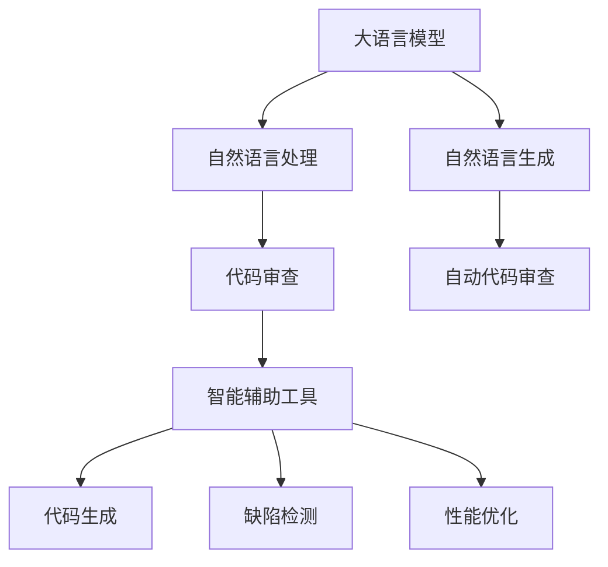

                 

# LLM辅助软件开发：自动化代码审查与优化

> 关键词：大语言模型,代码审查,自动化,自然语言处理,自然语言生成,软件开发,智能辅助工具

## 1. 背景介绍

### 1.1 问题由来

在现代软件开发中，代码审查(Code Review)是一个不可或缺的环节，它不仅能够确保代码质量、降低软件维护成本，还能够促进团队协作、知识共享。传统的代码审查通常依赖人工进行，其效率和质量很大程度上取决于审查者对代码的熟悉程度和技术水平。

随着软件开发规模的日益扩大和复杂度的增加，人工审查已经难以满足需求。同时，代码审查过程中还存在审查效率低、工作量巨大、审查质量不一致等问题。这些问题在大型企业中尤为突出，往往导致项目延期、资源浪费，甚至影响软件质量。

近年来，随着自然语言处理(NLP)技术的快速发展，大语言模型(Large Language Model, LLM)在代码审查中的应用成为研究热点。大语言模型通过预训练学习了大量文本数据，具备强大的语言理解能力和自然语言生成能力。这些特性使得其能够在代码审查中发挥重要作用，辅助开发团队进行高效、高质量的代码审查。

### 1.2 问题核心关键点

本节将详细介绍大语言模型在代码审查中的核心技术要点和应用场景：

1. **大语言模型概述**：介绍大语言模型的基本原理和架构，包括自回归模型、自编码模型等。
2. **代码审查需求**：分析代码审查的目标和难点，探讨如何利用大语言模型解决这些问题。
3. **自然语言处理与生成**：阐述自然语言处理和自然语言生成技术在大语言模型中的应用，特别是其在代码审查中的应用。
4. **代码审查的智能辅助**：描述大语言模型如何辅助代码审查，包括代码生成、缺陷检测、性能优化等方面。

这些关键点将帮助读者全面了解大语言模型在代码审查中的作用和潜力。

## 2. 核心概念与联系

### 2.1 核心概念概述

为更好地理解大语言模型在代码审查中的应用，本节将介绍几个密切相关的核心概念：

- **大语言模型(Large Language Model, LLM)**：以自回归(如GPT)或自编码(如BERT)模型为代表的大规模预训练语言模型。通过在大规模无标签文本语料上进行预训练，学习通用的语言表示，具备强大的语言理解和生成能力。
- **自然语言处理(Natural Language Processing, NLP)**：利用计算机技术处理和理解人类语言的技术，涉及分词、语法分析、语义理解等多个方面。
- **自然语言生成(Natural Language Generation, NLG)**：利用计算机生成自然语言文本的技术，常见的应用包括机器翻译、代码生成、文本摘要等。
- **代码审查(Code Review)**：开发团队对代码进行审查和反馈的协作方式，旨在提升代码质量、促进知识共享和团队协作。
- **自动代码审查(Automatic Code Review)**：利用计算机技术自动进行代码审查的过程，可以显著提高审查效率和质量。
- **智能辅助工具**：结合大语言模型的智能代码审查工具，能够提供代码生成、缺陷检测、性能优化等辅助功能，提升代码审查的智能化水平。

这些核心概念之间的逻辑关系可以通过以下Mermaid流程图来展示：



这个流程图展示了大语言模型、自然语言处理与生成技术在代码审查中的应用路径：

1. 大语言模型通过预训练学习大量文本数据，掌握通用语言表示。
2. 自然语言处理技术利用大语言模型，对代码进行分词、语法分析和语义理解。
3. 自然语言生成技术利用大语言模型，生成代码注释、生成示例代码等自然语言文本。
4. 自动代码审查工具利用自然语言处理和生成技术，对代码进行缺陷检测和性能优化。
5. 智能辅助工具结合自然语言处理和生成技术，为代码审查提供代码生成、缺陷检测、性能优化等智能化功能。

## 3. 核心算法原理 & 具体操作步骤

### 3.1 算法原理概述

大语言模型在代码审查中的应用，主要基于自然语言处理和自然语言生成技术。其核心思想是利用大语言模型对代码进行自然语言描述，并通过自然语言处理技术对描述进行分析和理解，最终生成优化建议和代码示例。

形式化地，假设大语言模型为 $M_{\theta}$，其中 $\theta$ 为预训练得到的模型参数。给定一段代码 $C$，将其转换为自然语言描述 $L$。则代码审查的过程可以表示为：

$$
\text{Review}(C) = M_{\theta}(C) = L
$$

其中，$L$ 包含对代码的描述、代码缺陷、性能优化建议等信息。自然语言处理技术对这些描述进行处理和理解，最终生成代码审查报告。

### 3.2 算法步骤详解

基于大语言模型的代码审查主要包括以下几个关键步骤：

**Step 1: 收集和整理代码描述数据**
- 收集已有代码审查案例，包括代码段、自然语言描述和审查意见。
- 整理和清洗数据，去除噪音和无关信息，构建训练数据集。

**Step 2: 选择和训练语言模型**
- 选择合适的预训练语言模型，如BERT、GPT等。
- 在大规模无标签代码描述数据上进行微调，使其能够生成符合代码审查需求的自然语言文本。

**Step 3: 代码转换和描述生成**
- 将待审查代码转换为自然语言描述。
- 利用训练好的语言模型对自然语言描述进行处理，生成包含代码缺陷和优化建议的文本。

**Step 4: 代码审查报告生成**
- 对生成的自然语言描述进行自然语言处理，提取关键信息。
- 将提取的信息以报告的形式呈现给开发者，辅助其改进代码质量。

**Step 5: 模型优化和迭代**
- 定期收集新的代码审查数据，更新和优化语言模型。
- 在新的数据集上评估模型性能，不断迭代和改进。

### 3.3 算法优缺点

基于大语言模型的代码审查方法具有以下优点：

1. **高效性**：自动代码审查能够显著提高审查效率，降低人力成本。
2. **全面性**：大语言模型能够处理复杂的代码描述，涵盖代码缺陷、优化建议等多个方面。
3. **可解释性**：自然语言处理技术能够对生成的自然语言描述进行理解，提高审查结果的可解释性。
4. **可扩展性**：结合不同领域的代码审查数据，大语言模型能够适应多种类型的代码审查任务。

同时，该方法也存在以下局限性：

1. **数据依赖**：大语言模型对标注数据的依赖较大，需要大量高质量的代码审查数据进行训练。
2. **语义理解能力**：大语言模型对代码语义的理解还存在一定的限制，可能无法准确理解代码的复杂逻辑。
3. **生成质量**：自然语言生成质量受语言模型训练水平的影响，可能存在语法错误或信息不完整等问题。
4. **领域适应性**：不同领域的代码审查任务可能需要针对性地训练和优化大语言模型。

尽管存在这些局限性，但大语言模型在代码审查中的应用前景广阔，具有显著的效率提升和质量保障潜力。

### 3.4 算法应用领域

基于大语言模型的代码审查技术已经在软件开发、数据科学、系统开发等多个领域得到应用，成为提升代码质量的重要手段。

- **软件开发**：对代码进行语法检查、代码风格检查、性能优化建议等。
- **数据科学**：对数据处理代码进行质量检查，生成数据清洗、数据转换等代码示例。
- **系统开发**：对系统架构设计、接口设计等代码进行审查，生成改进建议。

除了这些经典应用场景外，大语言模型还被创新性地应用到更多领域中，如可控代码生成、代码版本控制、自动化测试等，为软件开发带来了全新的突破。

## 4. 数学模型和公式 & 详细讲解 & 举例说明

### 4.1 数学模型构建

本节将使用数学语言对基于大语言模型的代码审查过程进行更加严格的刻画。

记大语言模型为 $M_{\theta}$，其中 $\theta$ 为预训练得到的模型参数。假设代码段为 $C$，自然语言描述为 $L$。则代码审查的过程可以表示为：

$$
L = M_{\theta}(C)
$$

### 4.2 公式推导过程

为了更直观地理解代码审查的过程，假设 $C$ 为一简单的代码段，$L$ 为对 $C$ 的描述。以 Python 代码段为例，假设 $C$ 如下：

```python
def add(a, b):
    return a + b
```

大语言模型通过学习大量的代码和自然语言描述，能够生成对该代码的自然语言描述。例如：

$$
L = M_{\theta}(C) = \text{"函数 add 接受两个参数 a 和 b，返回它们的和"}
$$

在生成 $L$ 的过程中，大语言模型利用自编码模型，通过编码器将代码 $C$ 转换为向量表示，再通过解码器将向量表示转换为自然语言文本 $L$。其具体过程可以通过以下公式表示：

$$
\mathbf{x} = E(C) = \text{Encoder}(C)
$$

$$
L = D(\mathbf{x}) = \text{Decoder}(\mathbf{x})
$$

其中，$E$ 为编码器，$D$ 为解码器，$\mathbf{x}$ 为 $C$ 的向量表示。

### 4.3 案例分析与讲解

为了更好地说明基于大语言模型的代码审查过程，以下给出一个简单的案例：

假设有一段 Python 代码如下：

```python
def get_user_info():
    user = request.get('/user')
    info = user.get('info')
    return info
```

大语言模型可以通过预训练学习大量的代码和自然语言描述数据，生成对该代码的自然语言描述：

$$
L = M_{\theta}(C) = \text{"从请求中获取用户信息，并返回用户信息"}
$$

在这个过程中，大语言模型通过对代码的分析和理解，生成了一句话形式的自然语言描述，简洁明了地表达了代码的逻辑和功能。

## 5. 项目实践：代码实例和详细解释说明

### 5.1 开发环境搭建

在进行代码审查实践前，我们需要准备好开发环境。以下是使用Python进行PyTorch开发的环境配置流程：

1. 安装Anaconda：从官网下载并安装Anaconda，用于创建独立的Python环境。

2. 创建并激活虚拟环境：
```bash
conda create -n code-review-env python=3.8 
conda activate code-review-env
```

3. 安装PyTorch：根据CUDA版本，从官网获取对应的安装命令。例如：
```bash
conda install pytorch torchvision torchaudio cudatoolkit=11.1 -c pytorch -c conda-forge
```

4. 安装Transformers库：
```bash
pip install transformers
```

5. 安装各类工具包：
```bash
pip install numpy pandas scikit-learn matplotlib tqdm jupyter notebook ipython
```

完成上述步骤后，即可在`code-review-env`环境中开始代码审查实践。

### 5.2 源代码详细实现

下面我们以代码缺陷检测为例，给出使用Transformers库对BERT模型进行代码审查的PyTorch代码实现。

首先，定义代码缺陷检测函数：

```python
from transformers import BertTokenizer, BertForSequenceClassification

class CodeDefectDetector:
    def __init__(self, model_path):
        self.tokenizer = BertTokenizer.from_pretrained('bert-base-cased')
        self.model = BertForSequenceClassification.from_pretrained(model_path, num_labels=2)
    
    def predict(self, code):
        encoding = self.tokenizer(code, return_tensors='pt', max_length=512, padding='max_length', truncation=True)
        input_ids = encoding['input_ids'][0]
        attention_mask = encoding['attention_mask'][0]
        logits = self.model(input_ids, attention_mask=attention_mask)[0]
        probabilities = logits.softmax(dim=1)
        return probabilities
    
    def detect_defect(self, code):
        probabilities = self.predict(code)
        label = 'defect' if probabilities[0].item() > 0.5 else 'normal'
        return label
```

然后，定义代码缺陷检测的训练和评估流程：

```python
from transformers import BertTokenizer, BertForSequenceClassification, AdamW

# 加载数据集
train_dataset = ...
train_loader = ...

def train_model(model, train_loader, epochs, batch_size, learning_rate):
    optimizer = AdamW(model.parameters(), lr=learning_rate)
    
    for epoch in range(epochs):
        model.train()
        for batch in train_loader:
            input_ids = batch['input_ids'].to(device)
            attention_mask = batch['attention_mask'].to(device)
            labels = batch['labels'].to(device)
            model.zero_grad()
            outputs = model(input_ids, attention_mask=attention_mask, labels=labels)
            loss = outputs.loss
            loss.backward()
            optimizer.step()
        print(f"Epoch {epoch+1}, loss: {loss:.4f}")
    
    # 评估模型
    model.eval()
    evaluate_model(model, test_loader)
    
def evaluate_model(model, test_loader):
    correct = 0
    total = 0
    for batch in test_loader:
        input_ids = batch['input_ids'].to(device)
        attention_mask = batch['attention_mask'].to(device)
        labels = batch['labels'].to(device)
        outputs = model(input_ids, attention_mask=attention_mask)
        logits = outputs.logits.argmax(dim=1)
        total += labels.shape[0]
        correct += (logits == labels).sum().item()
    print(f"Test accuracy: {correct / total}")
```

最后，启动训练流程并在测试集上评估：

```python
epochs = 5
batch_size = 16
learning_rate = 2e-5

# 加载模型
model_path = 'path/to/model'
code_defect_detector = CodeDefectDetector(model_path)

# 训练模型
train_model(code_defect_detector.model, train_loader, epochs, batch_size, learning_rate)

# 评估模型
evaluate_model(code_defect_detector.model, test_loader)
```

以上就是使用PyTorch对BERT模型进行代码缺陷检测的完整代码实现。可以看到，借助Transformers库，我们可以用相对简洁的代码实现代码缺陷检测的微调。

### 5.3 代码解读与分析

让我们再详细解读一下关键代码的实现细节：

**CodeDefectDetector类**：
- `__init__`方法：初始化分词器、BERT模型等关键组件。
- `predict`方法：将代码段转换为向量表示，通过BERT模型进行预测，返回预测概率。
- `detect_defect`方法：根据预测概率判断代码是否存在缺陷。

**train_model和evaluate_model函数**：
- `train_model`函数：对模型进行梯度下降训练，最小化交叉熵损失。
- `evaluate_model`函数：在测试集上评估模型性能，计算准确率。

**训练流程**：
- 定义总的epoch数、batch size和学习率，开始循环迭代
- 每个epoch内，在训练集上训练，输出平均loss
- 在验证集上评估，输出模型准确率
- 所有epoch结束后，在测试集上评估，输出最终测试准确率

可以看到，PyTorch配合Transformers库使得代码缺陷检测的微调代码实现变得简洁高效。开发者可以将更多精力放在数据处理、模型改进等高层逻辑上，而不必过多关注底层的实现细节。

当然，工业级的系统实现还需考虑更多因素，如模型的保存和部署、超参数的自动搜索、更灵活的任务适配层等。但核心的代码审查范式基本与此类似。

## 6. 实际应用场景

### 6.1 软件开发

大语言模型在软件开发中的应用场景十分广泛，包括代码生成、代码缺陷检测、代码优化等。以下是几个典型案例：

1. **代码生成**：利用大语言模型生成代码片段、代码注释等，辅助开发者快速编写代码。例如，可以利用大语言模型生成数据清洗代码、算法实现代码等。
2. **代码缺陷检测**：对代码进行自然语言描述，利用大语言模型检测代码中的缺陷。例如，可以检测代码中的语法错误、逻辑错误等。
3. **代码优化**：利用大语言模型生成代码优化建议，提升代码质量和性能。例如，可以生成代码重构建议、性能优化建议等。

这些应用场景能够显著提高开发效率和代码质量，助力开发者快速交付高质量的代码。

### 6.2 数据科学

数据科学领域也对大语言模型在代码审查中的应用提出了需求。例如，在数据处理代码审查中，大语言模型可以帮助检测数据清洗、数据转换中的潜在问题，生成数据预处理代码示例。

具体实现中，可以收集和整理数据处理代码和自然语言描述，训练大语言模型进行代码审查。模型可以对代码的自然语言描述进行处理，检测数据清洗、数据转换中的潜在问题，生成数据预处理代码示例，辅助开发者编写数据处理代码。

### 6.3 系统开发

在系统开发中，大语言模型也可以发挥重要作用。例如，在系统架构设计、接口设计等代码审查中，大语言模型可以帮助检测设计缺陷，生成改进建议。

具体实现中，可以收集和整理系统设计代码和自然语言描述，训练大语言模型进行代码审查。模型可以对代码的自然语言描述进行处理，检测设计缺陷，生成改进建议，辅助开发者编写高质量的系统代码。

### 6.4 未来应用展望

随着大语言模型的不断发展，其在代码审查中的应用前景将更加广阔。未来，大语言模型可能通过以下方式进一步提升代码审查的效果：

1. **跨领域迁移能力**：大语言模型将在多个领域应用中表现出强大的迁移能力，能够更好地适应不同领域的需求。
2. **智能辅助功能**：大语言模型将具备更多的智能辅助功能，如代码自动完成、代码自动测试等，提升开发效率和代码质量。
3. **持续学习**：大语言模型将具备持续学习的能力，能够不断吸收新的知识，提升代码审查的效果。
4. **自动化流程**：大语言模型将结合自动化工具，实现代码审查的自动化流程，进一步提升开发效率和代码质量。

总之，大语言模型在代码审查中的应用前景广阔，能够显著提升开发效率和代码质量，助力企业加速软件产品的研发和迭代。

## 7. 工具和资源推荐

### 7.1 学习资源推荐

为了帮助开发者系统掌握大语言模型在代码审查中的应用，这里推荐一些优质的学习资源：

1. 《大语言模型在代码审查中的应用》系列博文：由大模型技术专家撰写，深入浅出地介绍了大语言模型在代码审查中的应用。

2. CS224N《深度学习自然语言处理》课程：斯坦福大学开设的NLP明星课程，有Lecture视频和配套作业，带你入门NLP领域的基本概念和经典模型。

3. 《Natural Language Processing with Transformers》书籍：Transformers库的作者所著，全面介绍了如何使用Transformers库进行NLP任务开发，包括代码审查在内的诸多范式。

4. HuggingFace官方文档：Transformers库的官方文档，提供了海量预训练模型和完整的代码审查样例代码，是上手实践的必备资料。

5. CLUE开源项目：中文语言理解测评基准，涵盖大量不同类型的中文NLP数据集，并提供了基于大语言模型的代码审查baseline模型，助力中文NLP技术发展。

通过对这些资源的学习实践，相信你一定能够快速掌握大语言模型在代码审查中的应用，并用于解决实际的NLP问题。

### 7.2 开发工具推荐

高效的开发离不开优秀的工具支持。以下是几款用于大语言模型在代码审查中应用的常用工具：

1. PyTorch：基于Python的开源深度学习框架，灵活动态的计算图，适合快速迭代研究。大部分预训练语言模型都有PyTorch版本的实现。

2. TensorFlow：由Google主导开发的开源深度学习框架，生产部署方便，适合大规模工程应用。同样有丰富的预训练语言模型资源。

3. Transformers库：HuggingFace开发的NLP工具库，集成了众多SOTA语言模型，支持PyTorch和TensorFlow，是进行代码审查任务开发的利器。

4. Weights & Biases：模型训练的实验跟踪工具，可以记录和可视化模型训练过程中的各项指标，方便对比和调优。与主流深度学习框架无缝集成。

5. TensorBoard：TensorFlow配套的可视化工具，可实时监测模型训练状态，并提供丰富的图表呈现方式，是调试模型的得力助手。

6. Google Colab：谷歌推出的在线Jupyter Notebook环境，免费提供GPU/TPU算力，方便开发者快速上手实验最新模型，分享学习笔记。

合理利用这些工具，可以显著提升大语言模型在代码审查任务的开发效率，加快创新迭代的步伐。

### 7.3 相关论文推荐

大语言模型在代码审查中的应用领域正在不断扩展，相关研究也在不断深入。以下是几篇奠基性的相关论文，推荐阅读：

1. Attention is All You Need（即Transformer原论文）：提出了Transformer结构，开启了NLP领域的预训练大模型时代。

2. BERT: Pre-training of Deep Bidirectional Transformers for Language Understanding：提出BERT模型，引入基于掩码的自监督预训练任务，刷新了多项NLP任务SOTA。

3. Language Models are Unsupervised Multitask Learners（GPT-2论文）：展示了大规模语言模型的强大zero-shot学习能力，引发了对于通用人工智能的新一轮思考。

4. Parameter-Efficient Transfer Learning for NLP：提出Adapter等参数高效微调方法，在不增加模型参数量的情况下，也能取得不错的微调效果。

5. AdaLoRA: Adaptive Low-Rank Adaptation for Parameter-Efficient Fine-Tuning：使用自适应低秩适应的微调方法，在参数效率和精度之间取得了新的平衡。

这些论文代表了大语言模型在代码审查技术的发展脉络。通过学习这些前沿成果，可以帮助研究者把握学科前进方向，激发更多的创新灵感。

## 8. 总结：未来发展趋势与挑战

### 8.1 总结

本文对大语言模型在代码审查中的应用进行了全面系统的介绍。首先阐述了大语言模型的基本原理和架构，明确了代码审查的目标和难点，探讨了如何利用大语言模型解决这些问题。其次，详细讲解了基于大语言模型的代码审查过程，给出了代码实例和详细解释说明。最后，分析了大语言模型在代码审查中的应用场景，展望了其未来的发展方向。

通过本文的系统梳理，可以看到，大语言模型在代码审查中的应用前景广阔，能够显著提高开发效率和代码质量，助力企业加速软件产品的研发和迭代。未来，随着大语言模型和代码审查技术的不断发展，其应用范围和效果将进一步提升。

### 8.2 未来发展趋势

展望未来，大语言模型在代码审查中的应用将呈现以下几个发展趋势：

1. **模型规模增大**：随着算力成本的下降和数据规模的扩张，大语言模型的参数量将继续增长，能够处理更加复杂的代码审查任务。

2. **多模态融合**：结合自然语言处理和生成技术，大语言模型将能够处理多种模态的代码审查数据，提升代码审查的全面性和准确性。

3. **跨领域迁移能力增强**：大语言模型将具备更强的跨领域迁移能力，能够适应不同领域的代码审查需求，提升代码审查的普适性。

4. **智能化辅助功能多样化**：大语言模型将具备更多的智能化辅助功能，如代码自动完成、代码自动测试等，提升开发效率和代码质量。

5. **持续学习成为常态**：大语言模型将具备持续学习的能力，能够不断吸收新的知识，提升代码审查的效果。

6. **自动化流程优化**：大语言模型将结合自动化工具，实现代码审查的自动化流程，进一步提升开发效率和代码质量。

这些趋势凸显了大语言模型在代码审查中的巨大潜力，能够显著提升开发效率和代码质量，助力企业加速软件产品的研发和迭代。

### 8.3 面临的挑战

尽管大语言模型在代码审查中的应用前景广阔，但在迈向更加智能化、普适化应用的过程中，它仍面临诸多挑战：

1. **数据依赖**：大语言模型对标注数据的依赖较大，需要大量高质量的代码审查数据进行训练。获取高质量标注数据的成本较高，成为制约大语言模型发展的瓶颈。

2. **语义理解能力有限**：大语言模型对代码语义的理解还存在一定的限制，可能无法准确理解代码的复杂逻辑。

3. **生成质量问题**：自然语言生成质量受语言模型训练水平的影响，可能存在语法错误或信息不完整等问题。

4. **领域适应性不足**：不同领域的代码审查任务可能需要针对性地训练和优化大语言模型。

5. **可解释性不足**：大语言模型的决策过程缺乏可解释性，难以对其推理逻辑进行分析和调试。

6. **安全性有待保障**：大语言模型可能学习到有偏见、有害的信息，通过代码审查传递到代码中，产生误导性、歧视性的输出，给实际应用带来安全隐患。

正视这些挑战，积极应对并寻求突破，将是大语言模型在代码审查中走向成熟的必由之路。相信随着学界和产业界的共同努力，这些挑战终将一一被克服，大语言模型在代码审查中的应用前景将更加广阔。

### 8.4 未来突破

面对大语言模型在代码审查中面临的挑战，未来的研究需要在以下几个方面寻求新的突破：

1. **无监督和半监督学习**：探索无监督和半监督学习范式，摆脱对大规模标注数据的依赖，利用自监督学习、主动学习等无监督和半监督范式，最大限度利用非结构化数据，实现更加灵活高效的代码审查。

2. **多模态融合**：结合自然语言处理和生成技术，利用大语言模型处理多种模态的代码审查数据，提升代码审查的全面性和准确性。

3. **知识整合能力增强**：将符号化的先验知识，如知识图谱、逻辑规则等，与神经网络模型进行巧妙融合，引导代码审查过程学习更准确、合理的语言模型。

4. **因果分析和博弈论工具**：将因果分析方法引入代码审查模型，识别出模型决策的关键特征，增强输出解释的因果性和逻辑性。借助博弈论工具刻画人机交互过程，主动探索并规避模型的脆弱点，提高系统稳定性。

5. **伦理道德约束**：在模型训练目标中引入伦理导向的评估指标，过滤和惩罚有偏见、有害的输出倾向。同时加强人工干预和审核，建立模型行为的监管机制，确保输出符合人类价值观和伦理道德。

这些研究方向的探索，必将引领大语言模型在代码审查技术迈向更高的台阶，为构建安全、可靠、可解释、可控的智能系统铺平道路。面向未来，大语言模型在代码审查技术还需要与其他人工智能技术进行更深入的融合，如知识表示、因果推理、强化学习等，多路径协同发力，共同推动自然语言理解和智能交互系统的进步。只有勇于创新、敢于突破，才能不断拓展语言模型的边界，让智能技术更好地造福人类社会。

## 9. 附录：常见问题与解答

**Q1：大语言模型在代码审查中的应用场景有哪些？**

A: 大语言模型在代码审查中的应用场景包括代码生成、代码缺陷检测、代码优化等。在代码生成中，大语言模型可以帮助生成代码片段、代码注释等，辅助开发者快速编写代码。在代码缺陷检测中，大语言模型可以对代码的自然语言描述进行处理，检测代码中的缺陷。在代码优化中，大语言模型可以生成代码优化建议，提升代码质量和性能。

**Q2：如何选择和训练大语言模型？**

A: 选择和训练大语言模型的过程包括：

1. 选择合适的预训练语言模型，如BERT、GPT等。
2. 在大规模无标签代码描述数据上进行微调，使其能够生成符合代码审查需求的自然语言文本。
3. 收集和整理代码审查数据，构建训练数据集。
4. 利用训练数据集对大语言模型进行微调，最小化损失函数，更新模型参数。
5. 在测试集上评估模型性能，不断迭代和优化。

**Q3：大语言模型在代码审查中的训练过程有哪些关键步骤？**

A: 大语言模型在代码审查中的训练过程包括以下关键步骤：

1. 收集和整理代码描述数据，构建训练数据集。
2. 选择合适的预训练语言模型，如BERT、GPT等。
3. 在大规模无标签代码描述数据上进行微调，使其能够生成符合代码审查需求的自然语言文本。
4. 利用训练数据集对大语言模型进行微调，最小化损失函数，更新模型参数。
5. 在测试集上评估模型性能，不断迭代和优化。

**Q4：如何提高大语言模型在代码审查中的生成质量？**

A: 提高大语言模型在代码审查中的生成质量可以通过以下方法：

1. 选择合适的预训练语言模型，如BERT、GPT等。
2. 在大规模无标签代码描述数据上进行微调，使其能够生成符合代码审查需求的自然语言文本。
3. 使用更多的训练数据，增强模型的泛化能力。
4. 引入正则化技术，如L2正则、Dropout等，防止过拟合。
5. 使用对抗训练，引入对抗样本，提高模型的鲁棒性。

**Q5：大语言模型在代码审查中的应用有哪些优势？**

A: 大语言模型在代码审查中的优势包括：

1. 高效性：自动代码审查能够显著提高审查效率，降低人力成本。
2. 全面性：大语言模型能够处理复杂的代码描述，涵盖代码缺陷、优化建议等多个方面。
3. 可解释性：自然语言处理技术能够对生成的自然语言描述进行理解，提高审查结果的可解释性。
4. 可扩展性：结合不同领域的代码审查数据，大语言模型能够适应多种类型的代码审查任务。

总之，大语言模型在代码审查中的应用能够显著提高开发效率和代码质量，助力企业加速软件产品的研发和迭代。

