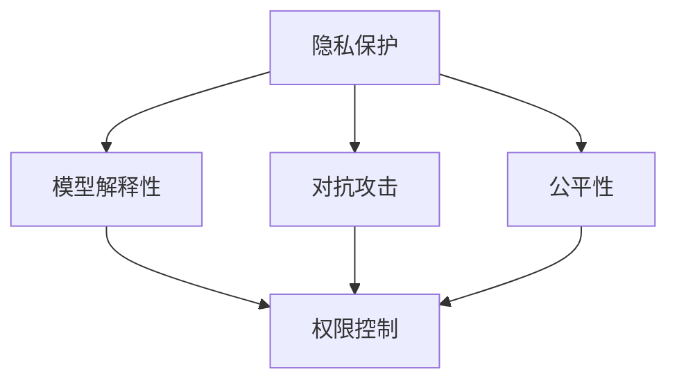

                 

## 1. 背景介绍

### 1.1 问题由来

随着人工智能(AI)技术的飞速发展，大规模语言模型(Large Language Models, LLMs)已经成为了自然语言处理(NLP)领域的核心工具。LLMs不仅在各种语言理解和生成任务中表现出色，还能进行文本摘要、翻译、问答等复杂操作。然而，LLMs的应用范围越来越广，其带来的隐私伦理问题也日益凸显。

近年来，LLMs在各种敏感领域的应用，如医疗、法律、金融、社交媒体等，受到了广泛关注。这些领域的数据通常包含个人隐私信息，LLMs的训练和推理过程中可能存在隐私泄露的风险，进而对用户权益造成影响。如何在确保LLMs高效利用的同时，保护用户隐私，已经成为AI领域亟需解决的重要问题。

### 1.2 问题核心关键点

当前，LLMs在隐私保护方面主要面临以下几个核心挑战：

1. **数据隐私风险**：预训练和微调过程中使用了大量敏感数据，如用户评论、医疗记录等，存在隐私泄露的风险。
2. **模型解释性不足**：LLMs作为“黑盒”模型，其决策过程不透明，难以解释和审查。
3. **对抗攻击脆弱**：LLMs在对抗性输入（如输入恶意攻击）时，可能输出有害信息，甚至被黑客利用。
4. **偏见与公平性问题**：LLMs可能学习并放大输入数据中的偏见，导致输出结果存在歧视性。
5. **权限控制与数据保护**：需要建立有效的权限控制机制，保护数据不被未授权访问和使用。

这些问题不仅限制了LLMs的应用范围，还可能带来严重的法律和道德风险。因此，研究LLMs的隐私伦理和安全性挑战，具有重要意义。

## 2. 核心概念与联系

### 2.1 核心概念概述

在讨论LLM隐私伦理和安全性的过程中，我们涉及以下核心概念：

- **隐私保护**：指在数据处理过程中，对敏感信息的保护，防止隐私泄露和滥用。
- **模型解释性**：指模型输出结果的可解释性，即能否解释其决策过程和原因。
- **对抗攻击**：指攻击者通过修改输入数据，使得模型输出错误结果。
- **公平性**：指模型输出结果是否公正，即对所有用户是否一视同仁。
- **权限控制**：指对数据访问和使用的严格控制，确保只有授权用户和系统才能访问敏感数据。

这些概念之间的关系可以通过以下Mermaid流程图来展示：



此图展示了隐私保护、模型解释性、对抗攻击和公平性之间相互依赖的关系。权限控制则作为保障隐私和公平性的重要手段。

## 3. 核心算法原理 & 具体操作步骤

### 3.1 算法原理概述

在大规模语言模型中，隐私保护和安全性挑战主要涉及以下几个方面：

1. **数据隐私保护**：采用差分隐私、联邦学习等技术，确保训练和推理过程中不泄露用户隐私。
2. **模型解释性增强**：使用可解释性模型、公平性约束等方法，提高模型输出的透明性和可审查性。
3. **对抗攻击防御**：引入对抗训练、鲁棒性优化等技术，提高模型对对抗攻击的抵抗能力。
4. **公平性保障**：使用公平性约束、偏见检测等技术，减少模型输出中的歧视性。
5. **权限控制机制**：建立数据访问和使用权限管理系统，确保数据安全。

### 3.2 算法步骤详解

基于上述原理，下面详细介绍LLM隐私伦理和安全性挑战的各个方面。

#### 3.2.1 数据隐私保护

数据隐私保护是LLM隐私伦理的基础。其主要步骤包括：

1. **数据预处理**：对输入数据进行匿名化处理，去除或模糊化个人身份信息。
2. **差分隐私**：在模型训练过程中，加入噪声，确保任何单个数据点对模型输出结果的影响可忽略不计。
3. **联邦学习**：在分布式环境中，各参与方只传递模型参数梯度，而不共享原始数据，从而保护数据隐私。

#### 3.2.2 模型解释性增强

模型解释性是LLM安全性的关键。主要方法包括：

1. **可解释性模型**：使用LIME、SHAP等工具，对模型输出结果进行解释和可视化。
2. **公平性约束**：在模型训练过程中，加入公平性约束，确保模型对不同群体的输出一致。
3. **对抗训练**：在模型训练中加入对抗样本，提高模型对输入变异的鲁棒性。

#### 3.2.3 对抗攻击防御

对抗攻击防御是LLM安全性的重要手段。主要方法包括：

1. **对抗训练**：在模型训练中加入对抗样本，提高模型对输入变异的鲁棒性。
2. **鲁棒性优化**：使用鲁棒性优化技术，如dropout、正则化等，提高模型对对抗攻击的抵抗能力。
3. **对抗检测**：在推理阶段，使用对抗检测技术，识别和过滤对抗攻击。

#### 3.2.4 公平性保障

公平性保障是LLM伦理的重要方面。主要方法包括：

1. **公平性约束**：在模型训练过程中，加入公平性约束，确保模型对不同群体的输出一致。
2. **偏见检测**：使用偏见检测工具，识别和纠正模型输出中的偏见。
3. **多样性增强**：通过数据增强和模型训练，提高模型的多样性和泛化能力。

#### 3.2.5 权限控制机制

权限控制是LLM安全性的重要保障。主要方法包括：

1. **数据访问控制**：建立严格的数据访问控制机制，确保只有授权用户和系统才能访问敏感数据。
2. **审计与监控**：建立数据访问和使用审计机制，实时监控和记录数据使用情况。
3. **加密与存储**：使用加密技术，保护数据的存储和传输安全。

### 3.3 算法优缺点

LLM隐私伦理和安全性挑战的各个方面，各有优缺点：

- **数据隐私保护**：优点在于确保数据不被滥用，缺点在于可能影响模型性能和泛化能力。
- **模型解释性增强**：优点在于提高模型透明度，缺点在于可能增加计算复杂度。
- **对抗攻击防御**：优点在于提高模型鲁棒性，缺点在于可能影响模型性能和公平性。
- **公平性保障**：优点在于确保模型输出公正，缺点在于可能增加训练复杂度和计算资源消耗。
- **权限控制机制**：优点在于确保数据安全，缺点在于可能增加系统复杂度和管理成本。

## 4. 数学模型和公式 & 详细讲解 & 举例说明

### 4.1 数学模型构建

在LLM隐私伦理和安全性挑战的各个方面，我们主要使用以下数学模型：

1. **差分隐私**：定义目标函数的隐私预算 $\epsilon$，加入噪声 $N$，确保模型输出结果的隐私性。

   $$
   \mathcal{L}_{dp}(\theta) = \mathbb{E}_{x\sim D}[\ell(M_{\theta}(x))] + \frac{\epsilon}{\delta}W
   $$

   其中，$\ell$ 为损失函数，$W$ 为隐私损失函数，$\delta$ 为隐私概率。

2. **公平性约束**：使用等距约束 $c_{i,j}$，确保模型对不同群体 $i$ 和 $j$ 的输出一致。

   $$
   \mathcal{L}_{fa}(\theta) = \frac{1}{2N}\sum_{i,j=1}^N (c_{i,j}M_{\theta}(x_i) - c_{j,i}M_{\theta}(x_j))^2
   $$

3. **对抗训练**：使用对抗样本 $\hat{x}$，优化模型在对抗样本上的输出。

   $$
   \mathcal{L}_{adv}(\theta) = \mathbb{E}_{x\sim D}[\ell(M_{\theta}(\hat{x}))] + \lambda\mathbb{E}_{x\sim D}[\|\nabla_{x}\ell(M_{\theta}(x))\|_2]
   $$

4. **鲁棒性优化**：使用dropout、正则化等技术，优化模型参数，提高鲁棒性。

   $$
   \mathcal{L}_{rob}(\theta) = \mathbb{E}_{x\sim D}[\ell(M_{\theta}(x))] + \lambda\mathbb{E}_{x\sim D}[\|\nabla_{x}\ell(M_{\theta}(x))\|_2]
   $$

### 4.2 公式推导过程

以下我们以公平性约束和差分隐私为例，推导相关的数学模型：

#### 4.2.1 公平性约束

假设模型 $M_{\theta}$ 的输出为 $y$，公平性约束定义为：

$$
\mathcal{L}_{fa}(\theta) = \frac{1}{2N}\sum_{i,j=1}^N (c_{i,j}y_i - c_{j,i}y_j)^2
$$

其中，$c_{i,j}$ 为等距约束，确保模型对不同群体 $i$ 和 $j$ 的输出一致。

在训练过程中，可以加入公平性约束项，优化模型参数：

$$
\theta = \mathop{\arg\min}_{\theta}\mathcal{L}(\theta) + \lambda\mathcal{L}_{fa}(\theta)
$$

其中 $\lambda$ 为公平性约束的权重。

#### 4.2.2 差分隐私

假设模型 $M_{\theta}$ 在输入 $x$ 上的输出为 $y$，差分隐私定义为：

$$
\mathcal{L}_{dp}(\theta) = \mathbb{E}_{x\sim D}[\ell(M_{\theta}(x))] + \frac{\epsilon}{\delta}W
$$

其中，$\ell$ 为损失函数，$W$ 为隐私损失函数，$\delta$ 为隐私概率。

在训练过程中，可以加入差分隐私项，优化模型参数：

$$
\theta = \mathop{\arg\min}_{\theta}\mathcal{L}(\theta) + \frac{\epsilon}{\delta}\mathbb{E}[\frac{1}{N}\sum_{i=1}^N\log\frac{\exp(\frac{\delta\|\Delta y_i\|_1}{\epsilon})}{1+\exp(\frac{\delta\|\Delta y_i\|_1}{\epsilon})}
$$

其中 $\Delta y_i$ 为差分隐私噪声，$\|\Delta y_i\|_1$ 为噪声范数。

### 4.3 案例分析与讲解

#### 4.3.1 差分隐私案例分析

假设我们有一个包含用户评论的社交媒体数据集，希望训练一个情感分析模型。模型在训练过程中，可能学习到用户个人信息，如年龄、性别、位置等。为保护用户隐私，可以采用差分隐私技术，确保模型训练过程中不泄露用户信息。

具体步骤如下：

1. 对输入数据进行匿名化处理，去除或模糊化个人身份信息。
2. 在模型训练过程中，加入差分隐私噪声，确保任何单个数据点对模型输出结果的影响可忽略不计。
3. 优化模型参数，最小化公平性约束和隐私损失函数。

#### 4.3.2 对抗训练案例分析

假设我们有一个包含恶意评论的情感分析模型，攻击者可能通过输入对抗样本，使得模型输出错误结果。为提高模型的鲁棒性，可以采用对抗训练技术，确保模型对对抗样本的抵抗能力。

具体步骤如下：

1. 收集恶意评论数据，生成对抗样本。
2. 在模型训练过程中，加入对抗样本，优化模型参数，提高模型对对抗样本的抵抗能力。
3. 评估模型在对抗样本上的性能，确保模型的鲁棒性。

## 5. 项目实践：代码实例和详细解释说明

### 5.1 开发环境搭建

在进行LLM隐私伦理和安全性挑战的实践前，我们需要准备好开发环境。以下是使用Python进行TensorFlow开发的环境配置流程：

1. 安装Anaconda：从官网下载并安装Anaconda，用于创建独立的Python环境。

2. 创建并激活虚拟环境：
```bash
conda create -n tf-env python=3.8 
conda activate tf-env
```

3. 安装TensorFlow：根据CUDA版本，从官网获取对应的安装命令。例如：
```bash
conda install tensorflow -c tensorflow -c conda-forge
```

4. 安装各类工具包：
```bash
pip install numpy pandas scikit-learn matplotlib tqdm jupyter notebook ipython
```

完成上述步骤后，即可在`tf-env`环境中开始实践。

### 5.2 源代码详细实现

下面我们以差分隐私案例为例，给出使用TensorFlow实现差分隐私的PyTorch代码实现。

首先，定义差分隐私的训练函数：

```python
import tensorflow as tf
from tensorflow.keras import layers

def train_differential_privacy(model, train_dataset, batch_size, epsilon=0.1, delta=0.1):
    differential_privacy_loss = tf.keras.losses.MeanSquaredError()

    optimizer = tf.keras.optimizers.Adam()
    for epoch in range(EPOCHS):
        for batch, (x, y) in tfds.keras.utils.data.make_input_fn_iterator(train_dataset).get_next():
            x = tf.cast(x, dtype=tf.float32)
            y = tf.cast(y, dtype=tf.int32)

            with tf.GradientTape() as tape:
                y_pred = model(x)
                loss = differential_privacy_loss(y, y_pred)
                dp_loss = calculate_dp_loss(epsilon, delta, loss)
                total_loss = loss + dp_loss

            gradients = tape.gradient(total_loss, model.trainable_variables)
            optimizer.apply_gradients(zip(gradients, model.trainable_variables))
    
    return model

def calculate_dp_loss(epsilon, delta, loss):
    total_dp_loss = 0
    for i in range(len(loss)):
        dp_loss = tf.math.log(1 + tf.exp(-epsilon * loss[i] / delta)) + epsilon * loss[i] / delta
        total_dp_loss += dp_loss
    return total_dp_loss
```

然后，定义模型和数据集：

```python
import tensorflow as tf
from tensorflow.keras import layers
from tensorflow.keras.datasets import mnist

# 定义模型
model = tf.keras.Sequential([
    layers.Flatten(input_shape=(28, 28)),
    layers.Dense(128, activation='relu'),
    layers.Dense(10, activation='softmax')
])

# 加载数据集
(x_train, y_train), (x_test, y_test) = mnist.load_data()
x_train = x_train.reshape((x_train.shape[0], -1))
x_test = x_test.reshape((x_test.shape[0], -1))
x_train, x_test = x_train / 255.0, x_test / 255.0
```

最后，启动差分隐私训练流程：

```python
# 设置差分隐私参数
epsilon = 0.1
delta = 0.1

# 设置训练参数
batch_size = 128
EPOCHS = 10

# 训练模型
train_differential_privacy(model, (x_train, y_train), batch_size, epsilon, delta)

# 评估模型
test_loss, test_acc = model.evaluate(x_test, y_test, verbose=2)
print(f'Test accuracy: {test_acc}')
```

以上就是使用TensorFlow实现差分隐私的完整代码实现。可以看到，TensorFlow提供了丰富的隐私保护工具，方便开发者快速实现差分隐私。

### 5.3 代码解读与分析

让我们再详细解读一下关键代码的实现细节：

**train_differential_privacy函数**：
- 定义差分隐私损失函数，即公平性约束和隐私损失函数的加权和。
- 使用Adam优化器，在每个epoch内迭代训练。
- 在每个batch上计算模型损失、公平性约束损失和隐私损失，并计算总损失。
- 使用梯度下降算法，更新模型参数。

**calculate_dp_loss函数**：
- 计算每个样本的差分隐私损失，即隐私预算 $W$。
- 将每个样本的隐私损失累加，得到总隐私损失。

**模型和数据集**：
- 定义一个简单的神经网络模型，用于分类手写数字。
- 加载MNIST数据集，并进行预处理，将像素值归一化到[0,1]之间。
- 将数据集分为训练集和测试集。

**训练流程**：
- 设置差分隐私参数和训练参数。
- 调用训练函数，进行差分隐私训练。
- 在测试集上评估模型性能。

可以看到，差分隐私的实现相对简单，只需要在训练过程中加入隐私损失项，并使用梯度下降算法进行优化。但差分隐私也存在一些缺点，如影响模型性能和泛化能力。未来，需要进一步研究如何在隐私保护和模型性能之间找到更好的平衡点。

## 6. 实际应用场景

### 6.1 智能客服系统

在智能客服系统中，客户的数据和行为可能包含大量隐私信息，如个人信息、对话内容等。为保护用户隐私，LLM隐私伦理和安全性挑战在此类系统中显得尤为重要。

具体应用场景包括：

- **差分隐私**：在客户数据上加入噪声，保护用户隐私。
- **对抗攻击防御**：识别并过滤恶意攻击，确保系统安全。
- **权限控制**：建立严格的权限管理系统，确保数据安全。

### 6.2 金融舆情监测

金融舆情监测系统需要处理大量的社交媒体数据，包含用户评论、新闻报道等敏感信息。为保护用户隐私，LLM隐私伦理和安全性挑战在此类系统中同样重要。

具体应用场景包括：

- **差分隐私**：在用户评论上加入噪声，保护用户隐私。
- **公平性保障**：确保模型对不同群体的输出一致。
- **对抗攻击防御**：识别并过滤恶意攻击，确保系统安全。

### 6.3 医疗健康系统

医疗健康系统处理大量的患者数据，包含个人健康信息、医疗记录等敏感信息。为保护患者隐私，LLM隐私伦理和安全性挑战在此类系统中尤为重要。

具体应用场景包括：

- **差分隐私**：在患者数据上加入噪声，保护患者隐私。
- **公平性保障**：确保模型对不同群体的输出一致。
- **权限控制**：建立严格的权限管理系统，确保数据安全。

### 6.4 未来应用展望

随着LLM隐私伦理和安全性挑战研究的深入，其在更多领域的应用前景将更加广阔。

1. **智能城市治理**：在智能城市治理中，LLM可以用于实时监测、数据分析等任务，但其涉及的敏感数据和隐私信息问题需要得到充分重视。
2. **智慧零售应用**：在智慧零售应用中，LLM可以用于推荐系统、客户分析等任务，但其涉及的消费者数据和行为信息需要得到保护。
3. **智能制造系统**：在智能制造系统中，LLM可以用于生产调度、质量控制等任务，但其涉及的工业数据和生产信息需要得到保护。

## 7. 工具和资源推荐

### 7.1 学习资源推荐

为了帮助开发者系统掌握LLM隐私伦理和安全性挑战的理论基础和实践技巧，这里推荐一些优质的学习资源：

1. **《隐私保护》系列课程**：斯坦福大学开设的隐私保护课程，介绍了隐私保护的基本概念和前沿技术。
2. **《数据隐私工程》书籍**：详细介绍了数据隐私保护的原理和实现方法，包括差分隐私、联邦学习等技术。
3. **TensorFlow Privacy**：TensorFlow官方隐私保护库，提供了差分隐私、联邦学习等隐私保护工具的实现和使用方法。
4. **PyTorch隐私保护工具包**：PyTorch官方隐私保护库，提供了差分隐私、联邦学习等隐私保护工具的实现和使用方法。

通过对这些资源的学习实践，相信你一定能够快速掌握LLM隐私伦理和安全性挑战的精髓，并用于解决实际的隐私保护问题。

### 7.2 开发工具推荐

高效的开发离不开优秀的工具支持。以下是几款用于LLM隐私伦理和安全性挑战开发的常用工具：

1. **TensorFlow**：基于Python的开源深度学习框架，生产部署方便，适合大规模工程应用。
2. **PyTorch**：基于Python的开源深度学习框架，灵活的计算图，适合快速迭代研究。
3. **TensorFlow Privacy**：TensorFlow官方隐私保护库，提供了差分隐私、联邦学习等隐私保护工具的实现和使用方法。
4. **PyTorch Privacy**：PyTorch官方隐私保护库，提供了差分隐私、联邦学习等隐私保护工具的实现和使用方法。

合理利用这些工具，可以显著提升LLM隐私伦理和安全性挑战任务的开发效率，加快创新迭代的步伐。

### 7.3 相关论文推荐

LLM隐私伦理和安全性挑战的发展源于学界的持续研究。以下是几篇奠基性的相关论文，推荐阅读：

1. **《差分隐私》论文**：差分隐私的经典文献，介绍了差分隐私的基本概念和实现方法。
2. **《联邦学习》论文**：联邦学习的经典文献，介绍了联邦学习的原理和实现方法。
3. **《对抗攻击》论文**：对抗攻击的经典文献，介绍了对抗攻击的基本概念和实现方法。
4. **《公平性约束》论文**：公平性约束的经典文献，介绍了公平性约束的基本概念和实现方法。
5. **《隐私保护》论文**：隐私保护的经典文献，介绍了隐私保护的基本概念和实现方法。

这些论文代表了大语言模型隐私伦理和安全性挑战的发展脉络。通过学习这些前沿成果，可以帮助研究者把握学科前进方向，激发更多的创新灵感。

## 8. 总结：未来发展趋势与挑战

### 8.1 总结

本文对LLM隐私伦理和安全性挑战进行了全面系统的介绍。首先阐述了LLM隐私伦理和安全性挑战的研究背景和意义，明确了隐私保护、模型解释性、对抗攻击和公平性等核心概念。其次，从原理到实践，详细讲解了LLM隐私伦理和安全性挑战的各个方面，给出了差分隐私、对抗训练等具体实现方法。同时，本文还广泛探讨了LLM隐私伦理和安全性挑战在智能客服、金融舆情、医疗健康等各个领域的实际应用，展示了其广泛的应用前景。最后，本文精选了LLM隐私伦理和安全性挑战的相关学习资源和开发工具，力求为读者提供全方位的技术指引。

通过本文的系统梳理，可以看到，LLM隐私伦理和安全性挑战的研究在不断深入，其应用场景也在不断拓展。如何在隐私保护和模型性能之间找到更好的平衡点，如何进一步提升LLM的安全性和鲁棒性，将是未来研究的重要方向。

### 8.2 未来发展趋势

展望未来，LLM隐私伦理和安全性挑战的发展趋势将包括以下几个方面：

1. **隐私保护技术进步**：差分隐私、联邦学习等隐私保护技术将不断进步，从而提供更加高效、安全的隐私保护方案。
2. **对抗攻击防御技术**：对抗攻击防御技术将不断进步，从而提高模型对对抗样本的抵抗能力。
3. **公平性保障技术**：公平性保障技术将不断进步，从而减少模型输出中的歧视性。
4. **权限控制技术**：权限控制技术将不断进步，从而提高数据访问和使用的安全性。

### 8.3 面临的挑战

尽管LLM隐私伦理和安全性挑战的研究已经取得了重要进展，但在实际应用中仍面临诸多挑战：

1. **隐私保护与模型性能的平衡**：如何在隐私保护和模型性能之间找到更好的平衡点，是隐私保护技术面临的主要挑战。
2. **对抗攻击的多样性**：对抗攻击的形式多样，如何应对各种对抗攻击，是对抗攻击防御技术面临的主要挑战。
3. **模型公平性的提升**：如何减少模型输出中的歧视性，是公平性保障技术面临的主要挑战。
4. **权限控制技术的实现**：如何建立有效的权限控制机制，是权限控制技术面临的主要挑战。

### 8.4 研究展望

未来研究需要在以下几个方面寻求新的突破：

1. **隐私保护技术创新**：开发更加高效、灵活的隐私保护技术，如差分隐私、联邦学习等，进一步提升隐私保护的效率和安全性。
2. **对抗攻击防御技术**：研究更加多样化的对抗攻击形式，开发更加有效的对抗攻击防御技术，提高模型的鲁棒性。
3. **公平性保障技术**：开发更加高效、公平的公平性保障技术，减少模型输出中的歧视性，提升模型的公平性。
4. **权限控制技术**：研究更加灵活、高效的权限控制技术，确保数据的安全性和合法性。

通过这些研究的不断突破，LLM隐私伦理和安全性挑战将得到更好的解决，从而推动LLM在更多领域的应用，造福全人类社会。

## 9. 附录：常见问题与解答

**Q1：差分隐私和联邦学习有什么区别？**

A: 差分隐私和联邦学习都是隐私保护技术，但它们的作用不同。差分隐私通过加入噪声保护单个数据点，防止隐私泄露；而联邦学习通过分布式训练，保护数据隐私。差分隐私主要用于单点数据保护，联邦学习主要用于分布式数据保护。

**Q2：如何在差分隐私中平衡隐私预算和模型性能？**

A: 差分隐私中，隐私预算 $\epsilon$ 和模型性能密切相关。隐私预算越大，隐私保护效果越好，但模型性能会受到影响。可以通过以下方法平衡隐私预算和模型性能：

1. 逐步减小隐私预算，从较宽松的隐私保护开始，逐步加强隐私保护。
2 在训练过程中，使用梯度扰动技术，如Laplace噪声，减少隐私预算对模型性能的影响。
3 使用差分隐私优化算法，如多项式优化算法，提高隐私保护和模型性能的平衡性。

**Q3：对抗攻击对模型有哪些影响？**

A: 对抗攻击对模型有以下几个主要影响：

1. 鲁棒性下降：对抗攻击可以使得模型在对抗样本上的性能下降，甚至无法正确处理。
2. 可解释性降低：对抗攻击可以使得模型输出结果变得不可解释，难以通过传统的解释技术进行分析和审查。
3. 偏见放大：对抗攻击可以使得模型输出偏见，放大输入数据中的偏见，导致不公平输出。

**Q4：如何检测模型中的偏见？**

A: 检测模型中的偏见通常包括以下步骤：

1. 收集数据：收集训练数据，并对其进行标注，标注数据中应包含不同群体的样本。
2. 模型训练：使用标注数据训练模型，确保模型公平性。
3. 偏见检测：使用偏见检测工具，如 fairness auditing，检测模型输出中的偏见。
4. 模型调整：根据偏见检测结果，调整模型参数，消除模型输出中的偏见。

**Q5：如何建立有效的权限控制机制？**

A: 建立有效的权限控制机制通常包括以下步骤：

1. 数据分类：根据数据敏感性和重要性，将数据进行分类，如敏感数据和非敏感数据。
2. 权限定义：定义不同用户和系统的权限，确保只有授权用户和系统才能访问敏感数据。
3. 权限管理：建立权限管理系统，记录数据访问和使用情况，确保权限的严格控制。
4. 审计和监控：建立审计和监控机制，实时监测数据访问和使用情况，确保数据安全。

以上是构建有效的权限控制机制的基本步骤。通过这些措施，可以有效保护数据隐私和安全。

---

作者：禅与计算机程序设计艺术 / Zen and the Art of Computer Programming

