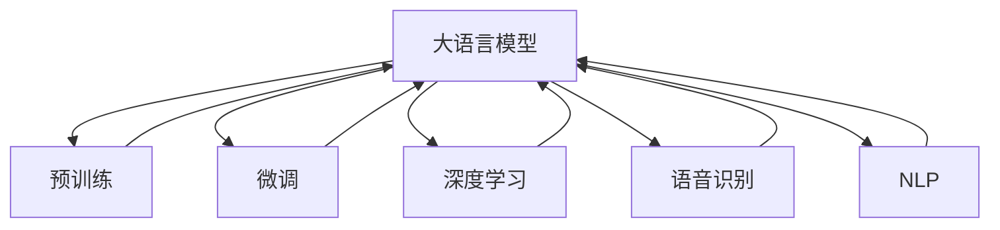

                 

# LLM驱动的智能客户服务：全天候多语言支持

> 关键词：大语言模型, 多语言支持, 智能客服, 深度学习, 语音识别, 自然语言处理

## 1. 背景介绍

### 1.1 问题由来

智能客服系统作为人工智能在实际应用中的重要落地，为各行各业提供了高效、便捷的客户服务支持。然而，传统的客服系统大多依赖人工客服，其服务能力受限于工作时间和人力成本。同时，企业需要针对不同的语种和时区，搭建多套客服系统，进一步增加了系统开发和运维的复杂度。

近年来，随着深度学习和大语言模型(Large Language Model, LLM)技术的发展，基于大语言模型的智能客服系统逐渐进入人们的视野。该系统通过预训练语言模型学习海量无标签文本数据中的通用语言知识，经下游任务微调后，具备了自然语言理解和生成能力，能够处理多种语言和时区的客户咨询。本文聚焦于大语言模型驱动的智能客服系统，介绍其核心原理、技术实现和应用案例，探讨如何构建全天候、多语言的智能客户服务平台。

### 1.2 问题核心关键点

目前，基于大语言模型的智能客服系统在客户服务领域的应用已初现端倪，其核心关键点包括：

1. **大语言模型的泛化能力**：大语言模型通过大规模语料库的预训练，获得了广泛的语言理解和生成能力，能够处理多语种和时区的客户咨询。
2. **微调过程的灵活性**：微调过程能够根据特定任务的标注数据，调整模型参数，提升在目标任务上的性能，支持多领域、多场景的智能客服需求。
3. **实时交互能力**：大语言模型驱动的客服系统具备实时交互能力，能够在客户咨询时，即时响应并提供准确答案。
4. **多渠道集成**：智能客服系统支持多种渠道的集成，如电话、短信、社交媒体等，便于客户根据习惯选择沟通方式。
5. **可解释性和鲁棒性**：大语言模型在决策过程中具备一定的可解释性，能够提供推理过程的逻辑依据，同时具备一定的鲁棒性，能够在噪音和干扰下保持稳定性。

以上核心关键点使得基于大语言模型的智能客服系统具有广阔的应用前景和实际价值。

## 2. 核心概念与联系

### 2.1 核心概念概述

为更好地理解基于大语言模型的智能客服系统，本文将介绍几个密切相关的核心概念：

- **大语言模型(Large Language Model, LLM)**：以自回归(如GPT)或自编码(如BERT)模型为代表的大规模预训练语言模型。通过在大规模无标签文本语料上进行预训练，学习通用的语言知识，具备强大的语言理解和生成能力。
- **预训练(Pre-training)**：指在大规模无标签文本语料上，通过自监督学习任务训练通用语言模型的过程。常见的预训练任务包括言语建模、遮挡语言模型等。
- **微调(Fine-tuning)**：指在预训练模型的基础上，使用下游任务的少量标注数据，通过有监督学习优化模型在特定任务上的性能。通常只需要调整顶层分类器或解码器，并以较小的学习率更新全部或部分的模型参数。
- **深度学习(Deep Learning)**：基于神经网络模型，通过学习大量数据，实现复杂任务的自动化和智能化。深度学习在自然语言处理、图像识别等领域取得了显著成效。
- **语音识别(Speech Recognition)**：将语音信号转换为文本的技术，是智能客服系统的基础组件之一，能够实现对语音咨询的自动识别和处理。
- **自然语言处理(Natural Language Processing, NLP)**：研究如何让计算机理解和处理人类语言的技术，包括文本处理、语义分析、语音识别、机器翻译等。

这些核心概念之间的逻辑关系可以通过以下Mermaid流程图来展示：



这个流程图展示了大语言模型的核心概念及其之间的关系：

1. 大语言模型通过预训练获得基础能力。
2. 微调是对预训练模型进行任务特定的优化，可以分为全参数微调和参数高效微调(PEFT)。
3. 深度学习是构建大语言模型的基础技术。
4. 语音识别和NLP是大语言模型在智能客服中的关键应用方向。
5. 预训练与微调共同构成大语言模型的学习框架，为其提供强大的语言处理能力。

这些概念共同构成了智能客服系统的技术基础，使其能够在各种场景下发挥强大的客户服务支持能力。通过理解这些核心概念，我们可以更好地把握大语言模型在智能客服中的应用潜力。

## 3. 核心算法原理 & 具体操作步骤
### 3.1 算法原理概述

基于大语言模型的智能客服系统，其核心算法原理可以概括为以下几个方面：

1. **预训练过程**：通过在大规模无标签文本数据上进行预训练，大语言模型学习到了通用的语言表示和知识，具备了语言理解和生成的能力。预训练过程包括自监督学习任务，如掩码语言模型(Masked Language Model, MLM)、下一个句子预测(Next Sentence Prediction, NSP)等。
2. **微调过程**：在预训练模型基础上，使用下游任务的少量标注数据，通过微调进一步优化模型在该任务上的性能。微调过程包括选择合适的损失函数和优化算法，设定合适的学习率和正则化技术，以防止过拟合。
3. **实时交互**：在智能客服系统中，大语言模型驱动的客服机器人能够实时响应客户咨询，提供准确的答案和解决方案。这依赖于模型的语言生成能力和任务适配层的精细设计。
4. **多渠道集成**：智能客服系统支持多种渠道的集成，如电话、短信、社交媒体等，便于客户根据习惯选择沟通方式。
5. **可解释性和鲁棒性**：在智能客服系统中，大语言模型需要具备一定的可解释性，能够提供推理过程的逻辑依据，同时具备一定的鲁棒性，能够在噪音和干扰下保持稳定性。

### 3.2 算法步骤详解

基于大语言模型的智能客服系统，其核心算法步骤包括：

1. **数据准备**：
   - 收集企业内部的历史客服对话记录，将其整理成文本格式，并进行必要的预处理，如去除噪声、统一格式等。
   - 将客户咨询的问题和对应的最佳答复构建成监督数据，用于微调模型的训练。

2. **模型选择与适配**：
   - 选择合适的预训练语言模型作为初始化参数，如BERT、GPT等。
   - 根据客服任务的需求，设计合适的任务适配层。对于文本客服，可以使用线性分类器或序列到序列(Sequence-to-Sequence)模型；对于语音客服，可以使用语音识别模块进行输入转换。

3. **微调过程**：
   - 使用标注数据对模型进行微调，调整顶层分类器或解码器，以适应客服任务的具体需求。
   - 设定合适的学习率、批大小、迭代轮数等超参数，使用优化算法(如AdamW、SGD等)进行模型训练。
   - 应用正则化技术(如L2正则、Dropout等)，防止模型过拟合。

4. **实时交互**：
   - 在客户咨询时，将输入文本或语音转换为模型可接受的格式，输入到微调后的模型中进行推理。
   - 根据推理结果，生成相应的回复，并通过预置的渠道(如短信、语音、网站等)将回复呈现给客户。

5. **系统集成与优化**：
   - 将微调后的模型集成到实际客服系统中，实现实时客户服务。
   - 持续收集客户反馈和咨询数据，对模型进行定期更新和优化，以适应新的服务需求。

### 3.3 算法优缺点

基于大语言模型的智能客服系统，其算法具有以下优点：

1. **高效性**：大语言模型通过预训练和微调，可以在较短时间内具备处理客户咨询的能力，无需大量人工干预。
2. **灵活性**：微调过程可以根据具体的客服任务进行灵活调整，适应多领域、多场景的客服需求。
3. **可扩展性**：智能客服系统可以支持多种渠道的集成，便于客户根据习惯选择沟通方式。
4. **可解释性**：大语言模型在推理过程中具有一定的可解释性，能够提供推理过程的逻辑依据，提升客户对系统的信任度。
5. **鲁棒性**：大语言模型在噪音和干扰下具备一定的鲁棒性，能够保持稳定性和准确性。

同时，该算法也存在一定的局限性：

1. **依赖标注数据**：智能客服系统的性能很大程度上取决于标注数据的质量和数量，获取高质量标注数据的成本较高。
2. **数据偏见**：预训练模型可能继承了原始数据中的偏见和有害信息，这些信息可能在微调过程中传递到客服系统中，造成负面影响。
3. **计算资源需求高**：大语言模型通常需要强大的计算资源进行训练和推理，对硬件设备要求较高。
4. **模型解释性不足**：大语言模型的决策过程往往缺乏可解释性，难以对其推理逻辑进行分析和调试。

尽管存在这些局限性，但就目前而言，基于大语言模型的智能客服系统仍是大规模客服场景中的重要选择。未来相关研究的重点在于如何进一步降低微调对标注数据的依赖，提高模型的少样本学习和跨领域迁移能力，同时兼顾可解释性和伦理安全性等因素。

### 3.4 算法应用领域

基于大语言模型的智能客服系统，已在多个行业领域得到了广泛应用，例如：

- **零售业**：在线客服机器人能够解答商品信息、促销活动、售后服务等问题，提升客户购物体验。
- **金融业**：智能客服系统能够处理各类金融咨询、交易指导、风险提示等，减少人工客服压力，提升服务效率。
- **医疗健康**：智能客服系统能够提供健康咨询、预约挂号、药品购买等服务，改善医疗服务质量。
- **政府服务**：智能客服系统能够处理各类政务咨询、投诉反馈、在线办理等，提升政府服务水平。
- **旅游业**：智能客服系统能够提供旅游信息查询、行程规划、预订服务等，提升旅游服务体验。

除了上述这些经典应用外，智能客服系统还被创新性地应用到更多场景中，如教育、物流、能源等，为各行各业带来了新的服务模式和价值提升。随着大语言模型和微调方法的不断进步，相信基于大语言模型的智能客服系统将在更广阔的应用领域大放异彩。

## 4. 数学模型和公式 & 详细讲解
### 4.1 数学模型构建

本节将使用数学语言对基于大语言模型的智能客服系统进行更加严格的刻画。

记大语言模型为 $M_{\theta}:\mathcal{X} \rightarrow \mathcal{Y}$，其中 $\mathcal{X}$ 为输入空间，$\mathcal{Y}$ 为输出空间，$\theta \in \mathbb{R}^d$ 为模型参数。假设客服任务的数据集为 $D=\{(x_i,y_i)\}_{i=1}^N, x_i \in \mathcal{X}, y_i \in \mathcal{Y}$。

定义模型 $M_{\theta}$ 在数据样本 $(x,y)$ 上的损失函数为 $\ell(M_{\theta}(x),y)$，则在数据集 $D$ 上的经验风险为：

$$
\mathcal{L}(\theta) = \frac{1}{N} \sum_{i=1}^N \ell(M_{\theta}(x_i),y_i)
$$

微调的优化目标是最小化经验风险，即找到最优参数：

$$
\theta^* = \mathop{\arg\min}_{\theta} \mathcal{L}(\theta)
$$

在实践中，我们通常使用基于梯度的优化算法（如SGD、Adam等）来近似求解上述最优化问题。设 $\eta$ 为学习率，$\lambda$ 为正则化系数，则参数的更新公式为：

$$
\theta \leftarrow \theta - \eta \nabla_{\theta}\mathcal{L}(\theta) - \eta\lambda\theta
$$

其中 $\nabla_{\theta}\mathcal{L}(\theta)$ 为损失函数对参数 $\theta$ 的梯度，可通过反向传播算法高效计算。

### 4.2 公式推导过程

以下我们以二分类任务为例，推导交叉熵损失函数及其梯度的计算公式。

假设模型 $M_{\theta}$ 在输入 $x$ 上的输出为 $\hat{y}=M_{\theta}(x) \in [0,1]$，表示样本属于正类的概率。真实标签 $y \in \{0,1\}$。则二分类交叉熵损失函数定义为：

$$
\ell(M_{\theta}(x),y) = -[y\log \hat{y} + (1-y)\log (1-\hat{y})]
$$

将其代入经验风险公式，得：

$$
\mathcal{L}(\theta) = -\frac{1}{N}\sum_{i=1}^N [y_i\log M_{\theta}(x_i)+(1-y_i)\log(1-M_{\theta}(x_i))]
$$

根据链式法则，损失函数对参数 $\theta_k$ 的梯度为：

$$
\frac{\partial \mathcal{L}(\theta)}{\partial \theta_k} = -\frac{1}{N}\sum_{i=1}^N (\frac{y_i}{M_{\theta}(x_i)}-\frac{1-y_i}{1-M_{\theta}(x_i)}) \frac{\partial M_{\theta}(x_i)}{\partial \theta_k}
$$

其中 $\frac{\partial M_{\theta}(x_i)}{\partial \theta_k}$ 可进一步递归展开，利用自动微分技术完成计算。

在得到损失函数的梯度后，即可带入参数更新公式，完成模型的迭代优化。重复上述过程直至收敛，最终得到适应客服任务的最优模型参数 $\theta^*$。

## 5. 项目实践：代码实例和详细解释说明
### 5.1 开发环境搭建

在进行智能客服系统的开发前，我们需要准备好开发环境。以下是使用Python进行PyTorch开发的环境配置流程：

1. 安装Anaconda：从官网下载并安装Anaconda，用于创建独立的Python环境。

2. 创建并激活虚拟环境：
```bash
conda create -n pytorch-env python=3.8 
conda activate pytorch-env
```

3. 安装PyTorch：根据CUDA版本，从官网获取对应的安装命令。例如：
```bash
conda install pytorch torchvision torchaudio cudatoolkit=11.1 -c pytorch -c conda-forge
```

4. 安装Transformers库：
```bash
pip install transformers
```

5. 安装各类工具包：
```bash
pip install numpy pandas scikit-learn matplotlib tqdm jupyter notebook ipython
```

完成上述步骤后，即可在`pytorch-env`环境中开始智能客服系统的开发。

### 5.2 源代码详细实现

这里我们以文本客服系统为例，给出使用Transformers库对BERT模型进行微调的PyTorch代码实现。

首先，定义客服任务的训练数据处理函数：

```python
from transformers import BertTokenizer
from torch.utils.data import Dataset
import torch

class ChatDataset(Dataset):
    def __init__(self, texts, tags, tokenizer, max_len=128):
        self.texts = texts
        self.tags = tags
        self.tokenizer = tokenizer
        self.max_len = max_len
        
    def __len__(self):
        return len(self.texts)
    
    def __getitem__(self, item):
        text = self.texts[item]
        tags = self.tags[item]
        
        encoding = self.tokenizer(text, return_tensors='pt', max_length=self.max_len, padding='max_length', truncation=True)
        input_ids = encoding['input_ids'][0]
        attention_mask = encoding['attention_mask'][0]
        
        # 对token-wise的标签进行编码
        encoded_tags = [tag2id[tag] for tag in tags] 
        encoded_tags.extend([tag2id['O']] * (self.max_len - len(encoded_tags)))
        labels = torch.tensor(encoded_tags, dtype=torch.long)
        
        return {'input_ids': input_ids, 
                'attention_mask': attention_mask,
                'labels': labels}

# 标签与id的映射
tag2id = {'O': 0, 'ANSWER': 1}
id2tag = {v: k for k, v in tag2id.items()}

# 创建dataset
tokenizer = BertTokenizer.from_pretrained('bert-base-cased')

train_dataset = ChatDataset(train_texts, train_tags, tokenizer)
dev_dataset = ChatDataset(dev_texts, dev_tags, tokenizer)
test_dataset = ChatDataset(test_texts, test_tags, tokenizer)
```

然后，定义模型和优化器：

```python
from transformers import BertForTokenClassification, AdamW

model = BertForTokenClassification.from_pretrained('bert-base-cased', num_labels=len(tag2id))

optimizer = AdamW(model.parameters(), lr=2e-5)
```

接着，定义训练和评估函数：

```python
from torch.utils.data import DataLoader
from tqdm import tqdm
from sklearn.metrics import classification_report

device = torch.device('cuda') if torch.cuda.is_available() else torch.device('cpu')
model.to(device)

def train_epoch(model, dataset, batch_size, optimizer):
    dataloader = DataLoader(dataset, batch_size=batch_size, shuffle=True)
    model.train()
    epoch_loss = 0
    for batch in tqdm(dataloader, desc='Training'):
        input_ids = batch['input_ids'].to(device)
        attention_mask = batch['attention_mask'].to(device)
        labels = batch['labels'].to(device)
        model.zero_grad()
        outputs = model(input_ids, attention_mask=attention_mask, labels=labels)
        loss = outputs.loss
        epoch_loss += loss.item()
        loss.backward()
        optimizer.step()
    return epoch_loss / len(dataloader)

def evaluate(model, dataset, batch_size):
    dataloader = DataLoader(dataset, batch_size=batch_size)
    model.eval()
    preds, labels = [], []
    with torch.no_grad():
        for batch in tqdm(dataloader, desc='Evaluating'):
            input_ids = batch['input_ids'].to(device)
            attention_mask = batch['attention_mask'].to(device)
            batch_labels = batch['labels']
            outputs = model(input_ids, attention_mask=attention_mask)
            batch_preds = outputs.logits.argmax(dim=2).to('cpu').tolist()
            batch_labels = batch_labels.to('cpu').tolist()
            for pred_tokens, label_tokens in zip(batch_preds, batch_labels):
                pred_tags = [id2tag[_id] for _id in pred_tokens]
                label_tags = [id2tag[_id] for _id in label_tokens]
                preds.append(pred_tags[:len(label_tags)])
                labels.append(label_tags)
                
    print(classification_report(labels, preds))
```

最后，启动训练流程并在测试集上评估：

```python
epochs = 5
batch_size = 16

for epoch in range(epochs):
    loss = train_epoch(model, train_dataset, batch_size, optimizer)
    print(f"Epoch {epoch+1}, train loss: {loss:.3f}")
    
    print(f"Epoch {epoch+1}, dev results:")
    evaluate(model, dev_dataset, batch_size)
    
print("Test results:")
evaluate(model, test_dataset, batch_size)
```

以上就是使用PyTorch对BERT进行文本客服任务微调的完整代码实现。可以看到，得益于Transformers库的强大封装，我们可以用相对简洁的代码完成BERT模型的加载和微调。

### 5.3 代码解读与分析

让我们再详细解读一下关键代码的实现细节：

**ChatDataset类**：
- `__init__`方法：初始化文本、标签、分词器等关键组件。
- `__len__`方法：返回数据集的样本数量。
- `__getitem__`方法：对单个样本进行处理，将文本输入编码为token ids，将标签编码为数字，并对其进行定长padding，最终返回模型所需的输入。

**tag2id和id2tag字典**：
- 定义了标签与数字id之间的映射关系，用于将token-wise的预测结果解码回真实的标签。

**训练和评估函数**：
- 使用PyTorch的DataLoader对数据集进行批次化加载，供模型训练和推理使用。
- 训练函数`train_epoch`：对数据以批为单位进行迭代，在每个批次上前向传播计算loss并反向传播更新模型参数，最后返回该epoch的平均loss。
- 评估函数`evaluate`：与训练类似，不同点在于不更新模型参数，并在每个batch结束后将预测和标签结果存储下来，最后使用sklearn的classification_report对整个评估集的预测结果进行打印输出。

**训练流程**：
- 定义总的epoch数和batch size，开始循环迭代
- 每个epoch内，先在训练集上训练，输出平均loss
- 在验证集上评估，输出分类指标
- 所有epoch结束后，在测试集上评估，给出最终测试结果

可以看到，PyTorch配合Transformers库使得BERT微调的代码实现变得简洁高效。开发者可以将更多精力放在数据处理、模型改进等高层逻辑上，而不必过多关注底层的实现细节。

当然，工业级的系统实现还需考虑更多因素，如模型的保存和部署、超参数的自动搜索、更灵活的任务适配层等。但核心的微调范式基本与此类似。

## 6. 实际应用场景
### 6.1 智能客服系统

基于大语言模型微调的对话技术，可以广泛应用于智能客服系统的构建。传统客服往往需要配备大量人力，高峰期响应缓慢，且一致性和专业性难以保证。而使用微调后的对话模型，可以7x24小时不间断服务，快速响应客户咨询，用自然流畅的语言解答各类常见问题。

在技术实现上，可以收集企业内部的历史客服对话记录，将问题和最佳答复构建成监督数据，在此基础上对预训练对话模型进行微调。微调后的对话模型能够自动理解用户意图，匹配最合适的答案模板进行回复。对于客户提出的新问题，还可以接入检索系统实时搜索相关内容，动态组织生成回答。如此构建的智能客服系统，能大幅提升客户咨询体验和问题解决效率。

### 6.2 金融舆情监测

金融机构需要实时监测市场舆论动向，以便及时应对负面信息传播，规避金融风险。传统的人工监测方式成本高、效率低，难以应对网络时代海量信息爆发的挑战。基于大语言模型微调的文本分类和情感分析技术，为金融舆情监测提供了新的解决方案。

具体而言，可以收集金融领域相关的新闻、报道、评论等文本数据，并对其进行主题标注和情感标注。在此基础上对预训练语言模型进行微调，使其能够自动判断文本属于何种主题，情感倾向是正面、中性还是负面。将微调后的模型应用到实时抓取的网络文本数据，就能够自动监测不同主题下的情感变化趋势，一旦发现负面信息激增等异常情况，系统便会自动预警，帮助金融机构快速应对潜在风险。

### 6.3 个性化推荐系统

当前的推荐系统往往只依赖用户的历史行为数据进行物品推荐，无法深入理解用户的真实兴趣偏好。基于大语言模型微调技术，个性化推荐系统可以更好地挖掘用户行为背后的语义信息，从而提供更精准、多样的推荐内容。

在实践中，可以收集用户浏览、点击、评论、分享等行为数据，提取和用户交互的物品标题、描述、标签等文本内容。将文本内容作为模型输入，用户的后续行为（如是否点击、购买等）作为监督信号，在此基础上微调预训练语言模型。微调后的模型能够从文本内容中准确把握用户的兴趣点。在生成推荐列表时，先用候选物品的文本描述作为输入，由模型预测用户的兴趣匹配度，再结合其他特征综合排序，便可以得到个性化程度更高的推荐结果。

### 6.4 未来应用展望

随着大语言模型微调技术的发展，基于微调范式将在更多领域得到应用，为传统行业带来变革性影响。

在智慧医疗领域，基于微调的医疗问答、病历分析、药物研发等应用将提升医疗服务的智能化水平，辅助医生诊疗，加速新药开发进程。

在智能教育领域，微调技术可应用于作业批改、学情分析、知识推荐等方面，因材施教，促进教育公平，提高教学质量。

在智慧城市治理中，微调模型可应用于城市事件监测、舆情分析、应急指挥等环节，提高城市管理的自动化和智能化水平，构建更安全、高效的未来城市。

此外，在企业生产、社会治理、文娱传媒等众多领域，基于大语言模型的微调方法也将不断涌现，为经济社会发展注入新的动力。相信随着技术的日益成熟，微调方法将成为人工智能落地应用的重要范式，推动人工智能技术在垂直行业的规模化落地。总之，微调需要开发者根据具体任务，不断迭代和优化模型、数据和算法，方能得到理想的效果。

## 7. 工具和资源推荐
### 7.1 学习资源推荐

为了帮助开发者系统掌握大语言模型微调的理论基础和实践技巧，这里推荐一些优质的学习资源：

1. 《Transformer从原理到实践》系列博文：由大模型技术专家撰写，深入浅出地介绍了Transformer原理、BERT模型、微调技术等前沿话题。

2. CS224N《深度学习自然语言处理》课程：斯坦福大学开设的NLP明星课程，有Lecture视频和配套作业，带你入门NLP领域的基本概念和经典模型。

3. 《Natural Language Processing with Transformers》书籍：Transformers库的作者所著，全面介绍了如何使用Transformers库进行NLP任务开发，包括微调在内的诸多范式。

4. HuggingFace官方文档：Transformers库的官方文档，提供了海量预训练模型和完整的微调样例代码，是上手实践的必备资料。

5. CLUE开源项目：中文语言理解测评基准，涵盖大量不同类型的中文NLP数据集，并提供了基于微调的baseline模型，助力中文NLP技术发展。

通过对这些资源的学习实践，相信你一定能够快速掌握大语言模型微调的精髓，并用于解决实际的NLP问题。
###  7.2 开发工具推荐

高效的开发离不开优秀的工具支持。以下是几款用于大语言模型微调开发的常用工具：

1. PyTorch：基于Python的开源深度学习框架，灵活动态的计算图，适合快速迭代研究。大部分预训练语言模型都有PyTorch版本的实现。

2. TensorFlow：由Google主导开发的开源深度学习框架，生产部署方便，适合大规模工程应用。同样有丰富的预训练语言模型资源。

3. Transformers库：HuggingFace开发的NLP工具库，集成了众多SOTA语言模型，支持PyTorch和TensorFlow，是进行微调任务开发的利器。

4. Weights & Biases：模型训练的实验跟踪工具，可以记录和可视化模型训练过程中的各项指标，方便对比和调优。与主流深度学习框架无缝集成。

5. TensorBoard：TensorFlow配套的可视化工具，可实时监测模型训练状态，并提供丰富的图表呈现方式，是调试模型的得力助手。

6. Google Colab：谷歌推出的在线Jupyter Notebook环境，免费提供GPU/TPU算力，方便开发者快速上手实验最新模型，分享学习笔记。

合理利用这些工具，可以显著提升大语言模型微调任务的开发效率，加快创新迭代的步伐。

### 7.3 相关论文推荐

大语言模型和微调技术的发展源于学界的持续研究。以下是几篇奠基性的相关论文，推荐阅读：

1. Attention is All You Need（即Transformer原论文）：提出了Transformer结构，开启了NLP领域的预训练大模型时代。

2. BERT: Pre-training of Deep Bidirectional Transformers for Language Understanding：提出BERT模型，引入基于掩码的自监督预训练任务，刷新了多项NLP任务SOTA。

3. Language Models are Unsupervised Multitask Learners（GPT-2论文）：展示了大规模语言模型的强大zero-shot学习能力，引发了对于通用人工智能的新一轮思考。

4. Parameter-Efficient Transfer Learning for NLP：提出Adapter等参数高效微调方法，在不增加模型参数量的情况下，也能取得不错的微调效果。

5. Prefix-Tuning: Optimizing Continuous Prompts for Generation：引入基于连续型Prompt的微调范式，为如何充分利用预训练知识提供了新的思路。

6. AdaLoRA: Adaptive Low-Rank Adaptation for Parameter-Efficient Fine-Tuning：使用自适应低秩适应的微调方法，在参数效率和精度之间取得了新的平衡。

这些论文代表了大语言模型微调技术的发展脉络。通过学习这些前沿成果，可以帮助研究者把握学科前进方向，激发更多的创新灵感。

## 8. 总结：未来发展趋势与挑战

### 8.1 总结

本文对基于大语言模型的智能客服系统进行了全面系统的介绍。首先阐述了智能客服系统的问题由来和核心关键点，明确了基于大语言模型的智能客服系统在客户服务领域的应用前景和实际价值。其次，从原理到实践，详细讲解了智能客服系统的数学原理和关键步骤，给出了智能客服系统开发的完整代码实例。同时，本文还广泛探讨了智能客服系统在零售、金融、医疗、政府、旅游等多个行业领域的应用案例，展示了智能客服系统的广泛应用和巨大潜力。

通过本文的系统梳理，可以看到，基于大语言模型的智能客服系统具有广阔的应用前景和实际价值。智能客服系统通过预训练和微调，具备了强大的语言处理能力，能够处理多种语言和时区的客户咨询，提升客户服务体验和效率。未来，伴随大语言模型和微调方法的不断进步，基于大语言模型的智能客服系统必将在更多行业领域大放异彩，带来新的服务模式和价值提升。

### 8.2 未来发展趋势

展望未来，大语言模型驱动的智能客服系统将呈现以下几个发展趋势：

1. **多语言支持**：智能客服系统将支持多种语言的实时客服，满足不同语言用户的沟通需求。
2. **实时语音识别**：语音识别技术的进步将使得智能客服系统能够处理语音咨询，提供更为便捷的客服体验。
3. **知识图谱融合**：将符号化的先验知识，如知识图谱、逻辑规则等，与神经网络模型进行融合，提升客服系统的知识表达能力和问题解决能力。
4. **跨领域迁移能力**：智能客服系统将具备更强的跨领域迁移能力，能够快速适应不同领域的客服需求。
5. **联邦学习**：通过联邦学习技术，智能客服系统可以在不共享数据的前提下，从多个客户服务机构中学习知识，提升整体服务水平。
6. **交互式客服**：智能客服系统将具备更加智能化的交互能力，能够理解客户情感、上下文信息，提供更加个性化的服务。

以上趋势凸显了大语言模型驱动的智能客服系统的未来发展方向，其多语言支持、实时语音识别、知识图谱融合、跨领域迁移能力等特性，将进一步提升客服系统的智能化水平，为用户提供更高效、更满意的客服体验。

### 8.3 面临的挑战

尽管大语言模型驱动的智能客服系统具备广阔的应用前景，但在迈向更加智能化、普适化应用的过程中，它仍面临诸多挑战：

1. **标注数据依赖**：智能客服系统的性能很大程度上取决于标注数据的质量和数量，获取高质量标注数据的成本较高。如何进一步降低微调对标注样本的依赖，将是一大难题。
2. **模型鲁棒性不足**：当前智能客服系统面对域外数据时，泛化性能往往大打折扣。如何提高智能客服系统的鲁棒性，避免灾难性遗忘，还需要更多理论和实践的积累。
3. **实时性要求高**：智能客服系统需要具备实时响应客户咨询的能力，如何在保证实时性的同时，提升系统性能和稳定性，是一个重要的挑战。
4. **多语种支持复杂**：多语言支持带来了多语种的文本处理、语音识别、情感分析等复杂问题，需要设计更加灵活、高效的模型结构。
5. **知识整合困难**：现有的智能客服系统往往局限于任务内数据，难以灵活吸收和运用更广泛的先验知识。如何让智能客服系统更好地与外部知识库、规则库等专家知识结合，形成更加全面、准确的信息整合能力，还有很大的想象空间。
6. **隐私保护问题**：智能客服系统需要处理用户的隐私信息，如何保证用户数据的安全性，避免数据泄露，是一个重要的伦理和安全问题。

尽管存在这些挑战，但随着大语言模型和微调方法的不断进步，基于大语言模型的智能客服系统必将在更多行业领域大放异彩，带来新的服务模式和价值提升。相信随着学界和产业界的共同努力，这些挑战终将一一被克服，基于大语言模型的智能客服系统将在构建智能城市、智慧医疗、智能教育等领域发挥更大的作用。

### 8.4 研究展望

面向未来，大语言模型驱动的智能客服系统需要在新技术、新算法的支持下，不断优化和创新，具体方向包括：

1. **参数高效微调**：开发更加参数高效的微调方法，在固定大部分预训练参数的同时，只更新极少量的任务相关参数，提升模型微调效率。
2. **自监督学习**：探索无需标注数据的自监督学习范式，通过数据增强、无监督学习等方式，提升模型泛化能力和鲁棒性。
3. **因果推断**：引入因果推断方法，增强智能客服系统的决策过程的可解释性和可信度。
4. **多模态融合**：将视觉、语音、文本等多模态信息进行融合，提升智能客服系统的感知能力和问题解决能力。
5. **实时计算**：优化模型计算图，提高智能客服系统的实时计算能力，确保系统的高效响应。
6. **联邦学习**：利用联邦学习技术，通过分布式协作，提升智能客服系统的知识共享和泛化能力。
7. **隐私保护**：设计隐私保护机制，确保智能客服系统在处理用户数据时，保护用户隐私安全。

这些研究方向的探索，将推动基于大语言模型的智能客服系统迈向更高的台阶，提升其智能化水平和服务能力，构建更加智能、便捷的客户服务平台。面向未来，大语言模型驱动的智能客服系统必将在各行各业中发挥越来越重要的作用，推动人工智能技术在实际应用中的落地和普及。

## 9. 附录：常见问题与解答

**Q1：智能客服系统如何处理多语言支持？**

A: 智能客服系统在处理多语言支持时，通常需要采取以下步骤：
1. 收集多语言的客服数据，如中文、英文、日文等，并进行预处理和标注。
2. 使用大语言模型进行预训练，学习通用的语言表示。
3. 根据不同的语言，微调模型，调整模型参数，适应特定的语言结构和语义。
4. 设计多语言适配层，将输入文本进行语言识别，并转换为模型所需的格式。
5. 在实时客服过程中，根据客户输入的语言进行自动识别和响应。

通过以上步骤，智能客服系统可以支持多语言支持，提供全语言覆盖的客户服务。

**Q2：智能客服系统的实时性如何保证？**

A: 智能客服系统的实时性可以通过以下几个方面来保证：
1. 使用高性能计算设备，如GPU/TPU等，加速模型推理和数据处理。
2. 优化模型结构，减少计算量和内存消耗，提高系统响应速度。
3. 采用异步处理和任务队列，合理分配计算资源，避免单点瓶颈。
4. 设计缓存机制，对常用查询和回答进行缓存，减少重复计算。
5. 在客户咨询高峰期，通过扩容设备和增加服务节点，保证系统稳定运行。

通过以上措施，智能客服系统可以在保证实时性的同时，提供高效的客户服务。

**Q3：智能客服系统如何处理语音咨询？**

A: 智能客服系统在处理语音咨询时，通常需要以下几个步骤：
1. 使用语音识别技术将语音信号转换为文本。
2. 对转换后的文本进行预处理，如去除噪声、统一格式等。
3. 使用大语言模型进行文本客服任务的微调，调整模型参数，适应语音输入的特点。
4. 在实时客服过程中，对输入语音进行自动转写，并转换为模型所需的格式。
5. 对转写后的文本进行客服任务推理，生成相应的回复，并通过预置的渠道呈现给客户。

通过以上步骤，智能客服系统可以处理语音咨询，提供全语言覆盖的客户服务。

**Q4：智能客服系统的安全性如何保障？**

A: 智能客服系统的安全性可以通过以下几个方面来保障：
1. 采用数据加密和传输安全技术，保护客户数据的安全性。
2. 设计隐私保护机制，对用户数据进行匿名化处理，避免数据泄露。
3. 设计访问鉴权机制，对客户进行身份验证，确保系统安全。
4. 使用异常检测和预警系统，实时监测系统异常行为，避免恶意攻击。
5. 定期进行安全审计和漏洞扫描，确保系统安全性和稳定性。

通过以上措施，智能客服系统可以在保障客户数据安全和隐私的前提下，提供高效的客户服务。

**Q5：智能客服系统如何处理复杂场景的客户咨询？**

A: 智能客服系统在处理复杂场景的客户咨询时，通常需要以下几个步骤：
1. 设计多轮对话模型，能够处理多轮交互，理解上下文信息。
2. 引入领域知识库，对特定领域的知识进行整合，提升系统的问题解决能力。
3. 设计情感分析模块，理解客户情绪和需求，提供个性化的服务。
4. 引入跨模态融合技术，将语音、文本、图像等多模态信息进行融合，提升系统的感知能力和问题解决能力。
5. 设计多渠道集成机制，支持多种沟通方式，提升客户服务体验。

通过以上步骤，智能客服系统可以处理复杂场景的客户咨询，提供高效、个性化的客户服务。

---

作者：禅与计算机程序设计艺术 / Zen and the Art of Computer Programming

