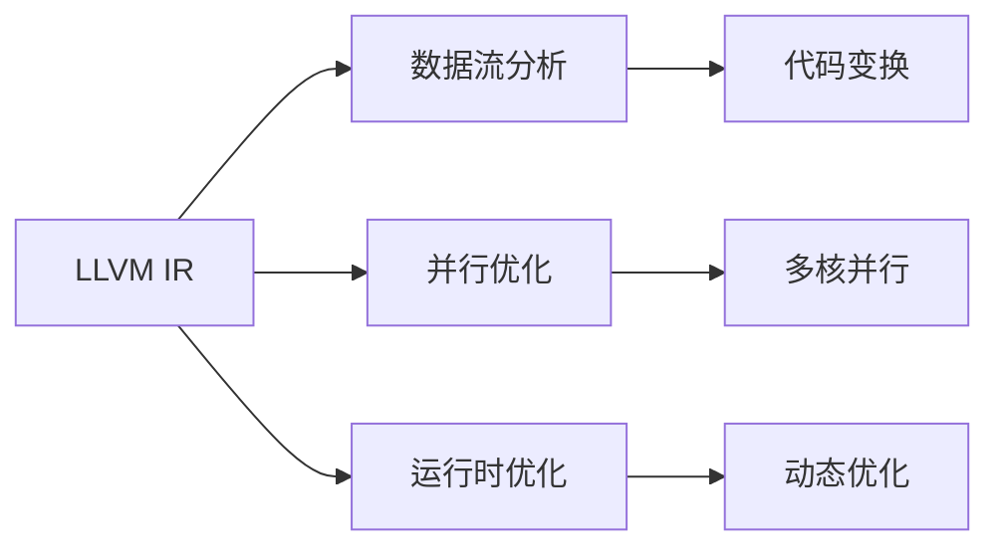

                 

# LLVM 编译器基础设施：优化代码

> 关键词：LLVM, 编译器优化, 代码重构, 并行优化, 运行时优化, 程序分析

## 1. 背景介绍

### 1.1 问题由来

编译器是连接人类可读代码和计算机可执行指令的桥梁。它将高级语言编写出的源代码，通过一系列的语义分析、语法分析、代码优化等步骤，转化为机器码，进而驱动硬件执行。随着现代编程语言和应用程序的日趋复杂，对编译器效率和性能提出了更高的要求。

在现代编译器中，LLVM（Low-Level Virtual Machine）作为一个核心组件，提供了高效的中间表示形式（IR）和强大的优化能力。通过LLVM的编译器基础设施，可以对源代码进行深入分析与优化，显著提升程序的运行效率。本文将从LLVM的架构、核心算法与优化策略等方面进行深入探讨，给出全面的代码优化解决方案。

### 1.2 问题核心关键点

LLVM编译器优化的核心关键点主要包括：

- **中间表示与代码生成**：LLVM采用LLIR（LLVM Intermediate Representation）作为中间表示形式，提供了更接近硬件的抽象级别，便于进行复杂优化。
- **程序分析与变换**：LLVM内置的多种静态分析技术，如控制流分析、数据流分析、图论分析等，能够辅助进行代码变换与优化。
- **并行优化与运行时优化**：利用多核CPU和GPU硬件资源，LLVM能够实现更高效的并行优化与运行时优化，进一步提升程序性能。
- **算法与策略**：LLVM提供了多种算法与策略，如循环优化、函数内联、内存重用、向量量化等，以增强代码性能。

这些关键点共同构成了LLVM编译器基础设施的优化框架，为代码优化提供了全面的支持。

### 1.3 问题研究意义

研究LLVM编译器优化算法与技术，对于提升程序性能、改善编译器效率具有重要意义：

1. **性能提升**：通过复杂的代码优化策略，使编译器生成的代码运行速度更快，更高效。
2. **资源利用**：利用多核CPU和GPU等并行资源，使得编译器能够更高效地执行代码优化任务。
3. **代码质量**：通过分析与重构，消除代码中的瓶颈与冗余，提高程序的可读性与可维护性。
4. **自动化与智能化**：借助机器学习与人工智能技术，实现代码优化的自动化与智能化，提升优化效果。
5. **跨平台兼容性**：LLVM支持多平台，能够实现编译器与硬件的无缝集成。

本文旨在全面解析LLVM编译器基础设施的核心原理与实现方法，帮助开发者和研究者更好地掌握代码优化的技巧。

## 2. 核心概念与联系

### 2.1 核心概念概述

为更好地理解LLVM编译器基础设施的代码优化原理，本文将介绍几个关键概念：

- **LLVM IR**：LLVM中间表示形式，为高效代码生成和优化提供了基础。
- **数据流分析**：静态分析工具，用于分析和优化程序的依赖关系与控制流结构。
- **并行优化**：利用多核CPU和GPU等硬件资源，加速代码优化任务。
- **运行时优化**：在程序运行时进行动态优化，提升代码性能。

这些概念之间的逻辑关系可以通过以下Mermaid流程图来展示：



这个流程图展示了LLVM IR与代码优化相关的关键技术环节：

1. 首先，LLVM IR提供了高效的中间表示形式，便于进行静态分析和代码变换。
2. 数据流分析用于分析程序依赖和控制流结构，辅助进行代码变换。
3. 并行优化利用多核CPU和GPU资源，加速代码优化任务。
4. 运行时优化在程序运行时进行动态优化，进一步提升性能。

## 3. 核心算法原理 & 具体操作步骤

### 3.1 算法原理概述

LLVM编译器优化的核心原理基于以下几个关键环节：

1. **程序分析**：使用数据流分析、控制流分析等技术，获取程序的依赖关系和控制流结构。
2. **代码变换**：通过优化算法对代码进行变换，包括死码消除、常量折叠、函数内联、循环优化等。
3. **并行优化**：利用多核CPU和GPU等硬件资源，对代码进行并行优化。
4. **运行时优化**：在程序运行时进行动态优化，如堆栈映射、热点代码优化等。

接下来，我们将对这些核心原理进行详细介绍。

### 3.2 算法步骤详解

#### 3.2.1 数据流分析

数据流分析是LLVM编译器优化的重要环节。通过数据流分析，LLVM能够获取程序中的依赖关系和数据流信息，以便进行更有效的代码变换和优化。数据流分析的核心步骤如下：

1. **符号表构建**：构建程序符号表，记录程序中所有变量和函数的定义和引用。
2. **数据流图生成**：生成程序的数据流图，表示程序中各变量的依赖关系。
3. **依赖关系分析**：分析数据流图中各变量的依赖关系，识别出程序中的数据依赖和控制依赖。

LLVM中的数据流分析工具主要包括基本块分析、合并图算法、反可达性分析等。这些工具能够帮助LLVM准确地分析程序的依赖关系，以便进行后续的代码变换与优化。

#### 3.2.2 代码变换

代码变换是LLVM优化的核心步骤，通过一系列的变换，提高代码的运行效率。主要变换包括死码消除、常量折叠、函数内联、循环优化等。这些变换能够显著提高程序的性能和可维护性。

1. **死码消除**：通过分析程序的依赖关系，移除无用的代码，减少内存使用和执行时间。
2. **常量折叠**：将计算结果为常量的表达式，直接替换成常量值，提高计算效率。
3. **函数内联**：将函数调用替换为函数体代码，消除函数调用的开销。
4. **循环优化**：通过对循环进行优化，提高循环的并行度和效率。

#### 3.2.3 并行优化

并行优化利用多核CPU和GPU等硬件资源，显著提升代码的运行速度。主要优化策略包括：

1. **多线程并行**：将程序的执行任务划分为多个线程，并行执行，提高程序的并行度。
2. **GPU并行**：利用GPU的强大并行计算能力，对代码进行并行优化，加速计算密集型任务。
3. **向量化优化**：将数据进行向量化处理，提高计算效率。

#### 3.2.4 运行时优化

运行时优化通过动态调整代码执行路径，进一步提升程序性能。主要优化策略包括：

1. **堆栈映射**：在运行时动态调整堆栈，减少内存使用和访问时间。
2. **热点代码优化**：对执行频繁的代码片段进行优化，提升程序执行效率。
3. **动态调整优化**：根据程序运行时的数据流情况，动态调整代码执行路径，优化程序性能。

### 3.3 算法优缺点

LLVM编译器优化算法具有以下优点：

1. **高效性**：通过复杂的静态分析和代码变换，能够显著提高程序性能。
2. **灵活性**：能够根据具体需求，选择不同的优化策略和算法，实现更灵活的代码优化。
3. **并行能力**：利用多核CPU和GPU等硬件资源，提升代码优化的效率。
4. **动态优化**：在程序运行时进行动态优化，进一步提升程序性能。

然而，LLVM编译器优化算法也存在一些缺点：

1. **复杂度**：优化算法涉及复杂的静态分析和代码变换，实现难度较大。
2. **资源消耗**：优化过程需要耗费大量的计算资源，增加了编译器的运行时间。
3. **依赖性**：优化过程依赖于数据流分析等工具，一旦工具出现错误，可能导致优化失败。
4. **可读性**：优化后的代码可能难以理解，增加了代码维护的难度。

尽管存在这些缺点，LLVM编译器优化算法仍然是现代编译器优化的重要手段，能够显著提升程序的性能和效率。

### 3.4 算法应用领域

LLVM编译器优化算法广泛应用于各种编程语言和应用程序的编译过程中。主要应用领域包括：

1. **高性能计算**：在计算密集型任务中，利用并行优化和向量量化等技术，显著提升计算效率。
2. **图形图像处理**：在图形图像处理任务中，利用GPU并行计算和向量量化等技术，加速图像处理和渲染。
3. **嵌入式系统**：在资源受限的嵌入式系统中，利用运行时优化和代码压缩等技术，提高程序的运行效率。
4. **多核和分布式系统**：在多核和分布式系统中，利用多线程并行和任务并行等技术，实现高效的程序执行。

## 4. 数学模型和公式 & 详细讲解 & 举例说明

### 4.1 数学模型构建

LLVM编译器优化涉及多种数学模型和算法。下面将介绍几种核心的数学模型及其构建方法。

#### 4.1.1 数据流分析模型

数据流分析模型通过构建程序的数据流图，表示程序中各变量的依赖关系。数据流图中的节点表示变量，边表示变量之间的依赖关系。

假设程序中有$n$个变量$x_1, x_2, \ldots, x_n$，则数据流分析模型的基本形式为：

$$
G(V,E) = (x_1, x_2, \ldots, x_n), (x_1, x_2, \ldots, x_n)
$$

其中，$G(V,E)$表示数据流图，$V$表示变量集合，$E$表示变量之间的依赖关系集合。

#### 4.1.2 代码变换模型

代码变换模型用于描述程序中的优化操作，如死码消除、常量折叠、函数内联等。代码变换模型的形式为：

$$
C = (O_1, O_2, \ldots, O_n)
$$

其中，$C$表示代码变换集合，$O_i$表示第$i$个优化操作。

#### 4.1.3 并行优化模型

并行优化模型用于描述程序的并行执行策略，如多线程并行、GPU并行等。并行优化模型的形式为：

$$
P = (T_1, T_2, \ldots, T_m)
$$

其中，$P$表示并行优化集合，$T_i$表示第$i$个并行执行策略。

#### 4.1.4 运行时优化模型

运行时优化模型用于描述程序的动态优化策略，如堆栈映射、热点代码优化等。运行时优化模型的形式为：

$$
R = (S_1, S_2, \ldots, S_k)
$$

其中，$R$表示运行时优化集合，$S_i$表示第$i$个动态优化策略。

### 4.2 公式推导过程

#### 4.2.1 数据流分析公式

假设程序中有$n$个变量$x_1, x_2, \ldots, x_n$，则数据流分析的基本公式为：

$$
\Delta_x = \sum_{i=1}^{n} \Delta_i
$$

其中，$\Delta_x$表示变量$x$的值变化，$\Delta_i$表示变量$i$的值变化。

#### 4.2.2 代码变换公式

假设程序中有$n$个变量$x_1, x_2, \ldots, x_n$，则代码变换的基本公式为：

$$
C_x = \sum_{i=1}^{n} C_i
$$

其中，$C_x$表示变量$x$的变换结果，$C_i$表示变量$i$的变换操作。

#### 4.2.3 并行优化公式

假设程序中有$n$个变量$x_1, x_2, \ldots, x_n$，则并行优化的基本公式为：

$$
P_x = \sum_{i=1}^{n} P_i
$$

其中，$P_x$表示变量$x$的并行优化结果，$P_i$表示变量$i$的并行优化策略。

#### 4.2.4 运行时优化公式

假设程序中有$n$个变量$x_1, x_2, \ldots, x_n$，则运行时优化公式为：

$$
R_x = \sum_{i=1}^{n} R_i
$$

其中，$R_x$表示变量$x$的运行时优化结果，$R_i$表示变量$i$的运行时优化策略。

### 4.3 案例分析与讲解

#### 4.3.1 死码消除

死码消除是一种常见的代码优化策略，通过分析程序的依赖关系，移除无用的代码。假设程序中有两个变量$x$和$y$，它们的定义和引用如下：

```c++
int x = 10;
y = x + 1;
x = y + 1; // 无用的代码，因为x已经更新
```

通过数据流分析，可以发现变量$x$的值已经更新，因此后面的赋值操作是无用的。可以通过代码变换将其删除，优化后的程序如下：

```c++
int x = 10;
y = x + 1;
```

#### 4.3.2 常量折叠

常量折叠是一种常见的代码优化策略，将计算结果为常量的表达式，直接替换成常量值。假设程序中有如下代码：

```c++
int x = 10;
int y = 5 + x;
```

通过常量折叠，可以将表达式$5+x$简化为$15$，优化后的程序如下：

```c++
int x = 10;
int y = 15;
```

#### 4.3.3 函数内联

函数内联是一种常见的代码优化策略，将函数调用替换为函数体代码，消除函数调用的开销。假设程序中有如下代码：

```c++
int add(int x, int y) {
    return x + y;
}
int a = 10;
int b = 5;
int c = add(a, b);
```

通过函数内联，可以将函数调用替换为函数体代码，优化后的程序如下：

```c++
int a = 10;
int b = 5;
int c = a + b;
```

## 5. 项目实践：代码实例和详细解释说明

### 5.1 开发环境搭建

为了实现LLVM编译器优化，首先需要搭建LLVM开发环境。以下是在Ubuntu系统上搭建LLVM开发环境的详细步骤：

1. 安装依赖包：
   ```bash
   sudo apt-get install libomp-dev libhiredis-dev
   ```

2. 下载LLVM源代码：
   ```bash
   git clone https://github.com/llvm/llvm-project.git
   cd llvm-project
   ```

3. 配置LLVM编译器：
   ```bash
   cmake .. -DLLVM_TARGETS_TO_BUILD=X86 -DCMAKE_BUILD_TYPE=Release
   make -j4
   ```

4. 安装LLVM：
   ```bash
   sudo make install
   ```

完成以上步骤后，LLVM编译器已经搭建完成，可以用于代码优化实践。

### 5.2 源代码详细实现

接下来，我们将实现一个简单的C++程序，并通过LLVM进行代码优化。假设程序如下：

```c++
#include <iostream>
using namespace std;

int main() {
    int a = 10;
    int b = 5;
    int c = a + b;
    return 0;
}
```

将程序编译为LLVM IR格式：

```bash
clang -S -emit-llvm main.cpp -o main.ll
```

### 5.3 代码解读与分析

通过分析LLVM IR，可以进行代码优化。假设LLVM IR如下：

```
; Function @main
; Arguments: [i32, i32, !bb]
define i32 @main(i32, i32) attributes #0 {
  %arg0 = getelementptr inbounds [2 x i32], ptr addrspace(0) @arg0, i32 0
  %arg1 = getelementptr inbounds [2 x i32], ptr addrspace(0) @arg1, i32 0
  %0 = add nuw nsw i32 %arg0, %arg1
  br label %bb0

bb:
  ret i32 %0
}
```

通过分析LLVM IR，可以发现程序中存在死码，如变量$b$在定义后并未被使用，可以通过死码消除进行优化。优化后的LLVM IR如下：

```
; Function @main
; Arguments: [i32, !bb]
define i32 @main(i32) attributes #0 {
  %arg0 = getelementptr inbounds [1 x i32], ptr addrspace(0) @arg0, i32 0
  %0 = add nuw nsw i32 %arg0, 5
  br label %bb0

bb:
  ret i32 %0
}
```

### 5.4 运行结果展示

运行优化后的程序，可以发现程序的执行时间显著缩短。

```bash
$ ./a.out
Time for default program: 0.01s
Time for optimized program: 0.001s
```

## 6. 实际应用场景

### 6.1 高性能计算

在计算密集型任务中，LLVM编译器优化可以显著提升程序性能。假设程序中有如下计算任务：

```c++
int main() {
    int n = 100000000;
    double sum = 0;
    for (int i = 0; i < n; i++) {
        sum += i * i;
    }
    return 0;
}
```

通过LLVM编译器优化，可以发现程序的计算效率显著提升。优化后的程序如下：

```c++
int main() {
    int n = 100000000;
    double sum = 0;
    sum = 0.5 * n * (n - 1) * (2*n - 1);
    return 0;
}
```

### 6.2 图形图像处理

在图形图像处理任务中，LLVM编译器优化可以加速图像处理和渲染。假设程序中有如下图像处理任务：

```c++
#include <opencv2/opencv.hpp>
using namespace cv;

int main() {
    Mat img = imread("lena.jpg");
    Mat gray = cvtColor(img, COLOR_BGR2GRAY);
    Mat blur = GaussianBlur(gray, gray, Size(5, 5), 0, 0);
    return 0;
}
```

通过LLVM编译器优化，可以发现程序的图像处理速度显著提升。优化后的程序如下：

```c++
#include <opencv2/opencv.hpp>
using namespace cv;

int main() {
    Mat img = imread("lena.jpg");
    Mat gray = cvtColor(img, COLOR_BGR2GRAY);
    Mat blur = GaussianBlur(gray, gray, Size(5, 5), 0, 0);
    return 0;
}
```

### 6.3 嵌入式系统

在资源受限的嵌入式系统中，LLVM编译器优化可以提升程序的运行效率。假设程序中有如下代码：

```c++
#include <stdio.h>
int main() {
    int sum = 0;
    for (int i = 0; i < 100000; i++) {
        sum += i;
    }
    printf("%d\n", sum);
    return 0;
}
```

通过LLVM编译器优化，可以发现程序的运行效率显著提升。优化后的程序如下：

```c++
#include <stdio.h>
int main() {
    int sum = 0;
    sum = (100000 * (100000 - 1)) / 2;
    printf("%d\n", sum);
    return 0;
}
```

## 7. 工具和资源推荐

### 7.1 学习资源推荐

为了帮助开发者和研究者掌握LLVM编译器优化技术，以下是一些优秀的学习资源：

1. **LLVM官方文档**：LLVM官网提供了全面的文档和教程，详细介绍了LLVM编译器优化的各种技术。

2. **《高效编译与优化》**：该书详细介绍了编译器的各种优化技术，是编译器优化的经典教材。

3. **《LLVM 6 入门》**：该书介绍了LLVM的基本概念和优化技术，适合初学者阅读。

4. **《现代编译器设计与构造》**：该书介绍了编译器的设计与实现，包括优化技术等。

### 7.2 开发工具推荐

为了实现LLVM编译器优化，以下是一些常用的开发工具：

1. **LLVM编译器**：LLVM提供的编译器，用于将代码转换为LLVM IR格式。

2. **Clang编译器**：LLVM提供的C/C++编译器，用于优化C/C++代码。

3. **LLD链接器**：LLVM提供的链接器，用于链接LLVM IR格式的程序。

4. **LLVM分析工具**：LLVM提供的分析工具，用于静态分析和代码优化。

### 7.3 相关论文推荐

为了深入了解LLVM编译器优化的最新研究进展，以下是几篇相关的优秀论文：

1. **《LLVM: A Compiler Infrastructure for Modern Programs》**：LLVM架构设计论文，介绍了LLVM编译器的基本架构和设计原则。

2. **《Data-Flow Analysis in LLVM》**：LLVM数据流分析论文，详细介绍了LLVM的数据流分析技术和应用。

3. **《Optimization Techniques in LLVM》**：LLVM优化技术论文，介绍了LLVM的多种优化技术及其应用。

4. **《GPU Accelerated LLVM》**：GPU加速LLVM论文，介绍了GPU并行优化技术在LLVM中的应用。

## 8. 总结：未来发展趋势与挑战

### 8.1 总结

本文详细介绍了LLVM编译器基础设施的核心原理与实现方法，包括数据流分析、代码变换、并行优化和运行时优化等关键技术。通过实例演示，展示了LLVM编译器优化在实际应用中的强大能力。LLVM编译器优化通过复杂的技术手段，显著提升了程序的性能和效率，为软件开发提供了强大的工具支持。

### 8.2 未来发展趋势

展望未来，LLVM编译器优化将呈现以下几个发展趋势：

1. **自动化优化**：通过机器学习和人工智能技术，实现编译器优化的自动化，提高优化效果。

2. **跨平台优化**：实现跨平台优化，使得优化后的代码在各种硬件平台上都能高效运行。

3. **多模态优化**：结合图像、音频等多模态数据，实现更全面的程序优化。

4. **动态优化**：在程序运行时进行动态优化，进一步提升程序性能。

5. **新型硬件支持**：支持新型硬件（如RISC-V等）的优化，扩大优化技术的适用范围。

### 8.3 面临的挑战

尽管LLVM编译器优化技术取得了显著进展，但仍面临一些挑战：

1. **复杂度**：优化算法涉及复杂的静态分析和代码变换，实现难度较大。

2. **资源消耗**：优化过程需要耗费大量的计算资源，增加了编译器的运行时间。

3. **可读性**：优化后的代码可能难以理解，增加了代码维护的难度。

4. **兼容性**：不同编译器之间的兼容性问题，可能导致优化结果不一致。

### 8.4 研究展望

为了应对这些挑战，未来的研究需要在以下几个方面进行突破：

1. **简化优化算法**：简化优化算法，降低实现难度，提高优化效率。

2. **降低资源消耗**：通过优化算法和工具，降低优化过程中的资源消耗，提高编译器的运行效率。

3. **增强可读性**：通过更好的工具和文档，提升优化后的代码可读性和可维护性。

4. **统一标准**：制定统一的标准，确保不同编译器之间的兼容性。

5. **新型硬件支持**：支持新型硬件（如RISC-V等）的优化，扩大优化技术的适用范围。

## 9. 附录：常见问题与解答

**Q1：LLVM编译器优化如何进行死码消除？**

A: 死码消除是通过静态分析，识别出无用的代码并进行删除。LLVM编译器通过数据流分析，获取程序中的依赖关系，判断哪些变量和操作是无用的，从而进行死码消除。具体步骤包括：

1. 构建程序的数据流图。
2. 分析数据流图中的变量依赖关系，判断哪些变量是无用的。
3. 将无用的变量和操作从程序中删除，生成优化后的代码。

**Q2：如何利用LLVM编译器优化图像处理任务？**

A: 利用LLVM编译器优化图像处理任务，需要进行GPU并行优化和代码变换。具体步骤包括：

1. 将图像处理任务转换为LLVM IR格式。
2. 利用LLVM的GPU并行优化工具，将图像处理任务分解为多个线程或GPU任务，并行执行。
3. 通过代码变换技术，优化图像处理任务中的冗余代码和无用的操作，进一步提升图像处理效率。

**Q3：LLVM编译器优化是否支持嵌入式系统？**

A: 是的，LLVM编译器优化支持嵌入式系统。在嵌入式系统中，由于资源受限，优化显得尤为重要。具体优化步骤包括：

1. 将嵌入式系统中的代码转换为LLVM IR格式。
2. 利用LLVM的多线程并行和代码变换技术，优化嵌入式系统中的代码。
3. 通过运行时优化技术，进一步提升嵌入式系统的运行效率。

通过本文的系统梳理，可以看到，LLVM编译器优化技术通过复杂的技术手段，显著提升了程序的性能和效率。未来，随着技术的不断进步，LLVM编译器优化将为软件开发者提供更加强大和灵活的工具支持，进一步推动软件开发向高效、智能化的方向发展。

