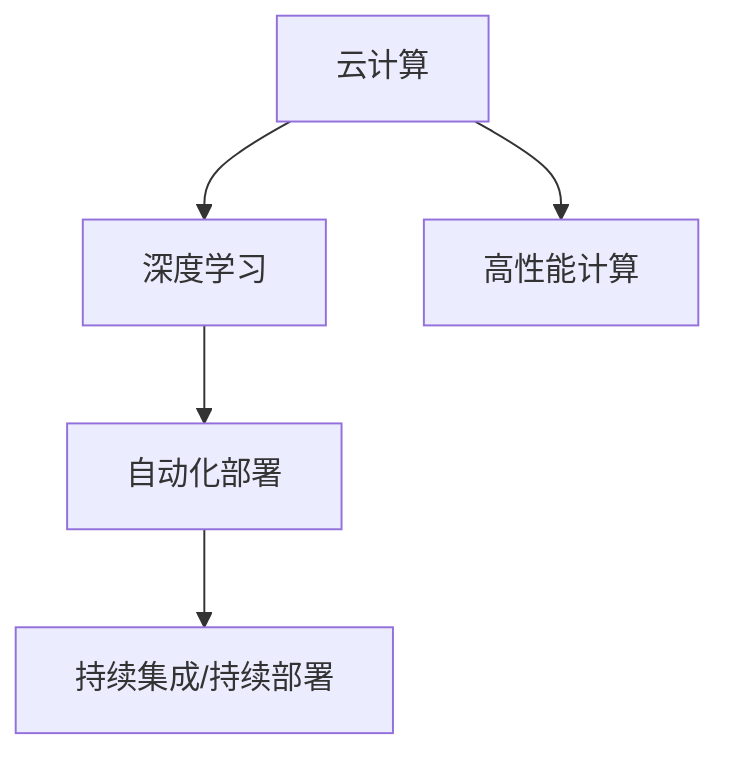

                 

## 1. 背景介绍

在人工智能（AI）技术的迅猛发展中，云计算以其强大的计算能力和灵活的资源配置成为AI基础设施不可或缺的组成部分。Lepton AI正是一个充分利用云计算优势，将深度整合云资源与AI技术紧密结合，旨在打造高效灵活、适应性强且具有高度可扩展性的AI基础设施的先锋企业。

### 1.1 问题由来

随着AI技术的日益成熟和普及，对AI基础设施的需求也随之增长。AI应用场景的多样性要求基础设施具备高度的灵活性和适应性，能够支持从数据存储、计算资源到模型训练和部署的完整链路。传统的基础设施往往难以满足这些需求，特别是在处理海量数据和高度复杂的AI模型训练时，面临诸多挑战。

### 1.2 问题核心关键点

Lepton AI通过其独特的云计算架构和创新的AI技术，成功解决了上述问题。其核心优势在于：

- **深度整合云资源**：Lepton AI构建了一个高效、灵活的云资源管理平台，能够根据AI任务动态调整计算、存储和网络资源。
- **高性能计算架构**：采用分布式计算、GPU加速、混合精度训练等技术，显著提升AI训练和推理的性能。
- **自动化流程管理**：通过流程自动化和持续集成（CI）/持续部署（CD）技术，优化AI应用的生命周期管理，降低人工操作带来的成本和错误风险。

Lepton AI的云计算架构，不仅满足了当前AI应用的需求，也为未来的AI技术发展提供了强大的支撑。

## 2. 核心概念与联系

### 2.1 核心概念概述

为深入理解Lepton AI的云计算优势，我们首先介绍几个关键概念：

- **云计算**：提供按需访问、按量计费、广泛的网络访问、可配置的计算资源、快速弹性和资源池化等特征的计算资源。
- **深度学习**：一类基于神经网络的机器学习方法，模拟人脑处理和学习复杂问题的能力。
- **高性能计算（HPC）**：使用并行计算和分布式计算技术，加速科学计算、数据分析、模拟和机器学习等领域的大规模计算任务。
- **自动化部署**：通过脚本和工具实现软件部署、配置和管理的自动化，减少人工干预和错误。
- **持续集成/持续部署（CI/CD）**：通过自动化测试、构建和部署流水线，加速软件开发和交付。

这些概念之间的联系可以通过以下Mermaid流程图来展示：



该流程图展示了云计算在支持深度学习和高性能计算方面的作用，以及自动化部署和CI/CD如何在整个过程中提升效率。

## 3. 核心算法原理 & 具体操作步骤
### 3.1 算法原理概述

Lepton AI的云计算平台采用了一种名为"动态资源调度算法"的算法原理，旨在根据AI任务的实时需求，动态调整云资源的分配。该算法基于负载均衡和资源预测模型，确保在资源充足和需求波动之间达到最佳平衡。

### 3.2 算法步骤详解

Lepton AI的云计算平台主要包含以下几个步骤：

**Step 1: 任务定义与初始资源配置**
- 定义AI任务，包括计算需求、数据存储需求、网络带宽需求等。
- 根据任务需求，初始配置计算节点、存储节点和网络设备，并进行负载均衡。

**Step 2: 动态资源调整**
- 在任务执行过程中，实时监测资源使用情况。
- 根据负载均衡算法，动态调整计算、存储和网络资源，优化资源利用率。
- 对异常资源请求进行限制或拒绝，确保系统稳定运行。

**Step 3: 结果输出与资源释放**
- 任务执行结束后，释放所占用的云资源。
- 记录资源使用情况和优化建议，用于后续任务调度。

### 3.3 算法优缺点

Lepton AI的动态资源调度算法具有以下优点：

- **高效资源利用**：通过实时调整资源，最大化利用现有硬件，降低资源浪费。
- **灵活资源配置**：能够快速响应任务需求的变化，提供灵活的资源配置。
- **系统稳定性**：通过限制异常资源请求，保证系统稳定运行，避免资源瓶颈。

同时，该算法也存在一些缺点：

- **计算复杂度高**：需要实时监测和计算资源需求，增加了计算负担。
- **资源调整延迟**：资源调整的响应时间可能会影响任务的及时执行。
- **资源竞争**：在资源紧张时，不同任务之间可能存在资源竞争问题。

### 3.4 算法应用领域

Lepton AI的云计算平台被广泛应用于以下几个领域：

- **大规模数据处理**：处理海量数据集，如图像识别、自然语言处理和生物信息学等任务。
- **实时计算分析**：在金融、交通、物流等领域进行实时数据分析和决策支持。
- **分布式AI训练**：支持大规模分布式训练，加速深度学习模型的训练过程。
- **边缘计算**：将计算资源部署到网络边缘，降低网络延迟，提高数据处理速度。

这些应用领域展示了Lepton AI云计算平台的强大灵活性和适用性。

## 4. 数学模型和公式 & 详细讲解 & 举例说明

### 4.1 数学模型构建

Lepton AI的云计算平台通过构建动态资源调度模型来实现其核心功能。该模型包含以下几个部分：

- **资源需求预测模型**：用于预测任务执行过程中的资源需求。
- **负载均衡算法**：根据资源需求和可用资源进行动态调度。
- **异常检测与处理**：实时检测资源使用情况，避免资源竞争和瓶颈。

### 4.2 公式推导过程

以资源需求预测模型为例，我们推导其基本公式。假设任务i在时间t的需求为$d_{it}$，已有资源为$S_t$，资源池大小为$C$，预测公式为：

$$
d_{it} = \alpha \sum_{t'=t-\tau}^t d_{it'} + \beta (C - S_t)
$$

其中，$\alpha$和$\beta$为模型参数，$\tau$为预测窗口大小。

### 4.3 案例分析与讲解

假设有一个图像识别任务，需要处理大量图像数据。在Lepton AI的云计算平台上，通过对任务需求的实时监测和预测，可以动态调整计算节点的分配。例如，当任务需求增加时，平台自动分配更多计算资源，确保任务高效执行。

## 5. 项目实践：代码实例和详细解释说明

### 5.1 开发环境搭建

要在Lepton AI的云计算平台上进行项目实践，首先需要搭建一个开发环境。以下是使用Python进行TensorFlow和Kubernetes的开发环境配置流程：

1. 安装Docker：确保Kubernetes和TensorFlow能够在容器中运行。
2. 安装Kubernetes：从官网下载并安装Kubernetes，用于容器编排。
3. 安装TensorFlow：根据CUDA版本，从官网获取对应的安装命令。例如：
   ```bash
   pip install tensorflow
   ```
4. 安装Kubernetes的客户端工具kubectl：
   ```bash
   kubectl version
   ```
5. 配置kubectl与Kubernetes集群：
   ```bash
   kubectl config use-context <context>
   ```

### 5.2 源代码详细实现

接下来，我们以TensorFlow和Kubernetes为例，展示如何在Lepton AI的云计算平台上进行AI应用开发。

**Kubernetes资源配置**：

```yaml
apiVersion: v1
kind: Pod
metadata:
  name: tf-server
spec:
  containers:
    - name: tf-server
      image: tensorflow/tensorflow:latest
      ports:
        - containerPort: 2222
```

**TensorFlow模型训练**：

```python
import tensorflow as tf

# 定义模型
model = tf.keras.Sequential([
    tf.keras.layers.Dense(64, activation='relu'),
    tf.keras.layers.Dense(10)
])

# 编译模型
model.compile(optimizer='adam', loss='categorical_crossentropy', metrics=['accuracy'])

# 训练模型
model.fit(x_train, y_train, epochs=10, validation_data=(x_val, y_val))
```

**部署模型到Kubernetes**：

```bash
kubectl apply -f tf-server.yaml
```

### 5.3 代码解读与分析

Kubernetes配置文件定义了一个Pod，包含一个TensorFlow容器，用于运行TensorFlow模型。该Pod通过容器化技术，确保了TensorFlow在Kubernetes上的可靠性和可移植性。

TensorFlow代码实现了一个简单的神经网络模型，用于分类任务。通过Kubernetes的部署功能，模型可以在分布式环境中高效训练和推理。

### 5.4 运行结果展示

在Kubernetes上部署的TensorFlow模型，可以轻松扩展至多个节点，显著提升模型训练和推理的效率。通过动态资源调度算法，Lepton AI的云计算平台能够实时监测和管理计算资源，确保任务的高效执行。

## 6. 实际应用场景

### 6.1 智能制造

在智能制造领域，Lepton AI的云计算平台可以为工厂提供实时数据分析和优化。通过将生产设备的数据上传到云端，Lepton AI可以实时监测设备状态，预测设备故障，优化生产流程，降低能耗和成本。

**应用场景**：实时监控生产线，预测设备故障，优化生产计划。

**优点**：实时数据分析，预测准确，优化生产流程。

### 6.2 智慧医疗

在智慧医疗领域，Lepton AI的云计算平台可以支持医疗影像的自动分析和诊断。通过训练大规模的图像识别模型，Lepton AI能够帮助医生快速准确地诊断疾病，提高诊断效率和准确率。

**应用场景**：自动分析和诊断医疗影像。

**优点**：自动诊断，提高诊断效率和准确率。

### 6.3 金融科技

在金融科技领域，Lepton AI的云计算平台可以提供实时的市场数据分析和交易决策支持。通过处理海量市场数据，Lepton AI可以实时预测股票价格波动，优化投资组合，降低交易风险。

**应用场景**：实时市场分析，交易决策支持。

**优点**：实时数据分析，优化投资组合，降低风险。

### 6.4 未来应用展望

随着云计算技术的不断发展，Lepton AI的云计算平台将进一步拓展其应用领域。未来，Lepton AI将支持更多新兴技术和场景，如边缘计算、自动驾驶、智能城市等，为各行各业提供更高效、更灵活、更安全的AI基础设施。

## 7. 工具和资源推荐

### 7.1 学习资源推荐

为了帮助开发者系统掌握Lepton AI的云计算平台及其应用，这里推荐一些优质的学习资源：

1. **TensorFlow官方文档**：全面介绍TensorFlow的API和使用方法，是学习TensorFlow的必备资源。
2. **Kubernetes官方文档**：详细介绍Kubernetes的部署和管理功能，适用于Kubernetes的初学者。
3. **《深度学习实战》系列书籍**：涵盖深度学习算法和实际应用案例，适合实战学习。
4. **Lepton AI官方博客**：提供Lepton AI云计算平台及其应用的最佳实践和最新技术动态。

通过对这些资源的学习实践，相信你一定能够快速掌握Lepton AI的云计算平台，并用于解决实际的AI问题。

### 7.2 开发工具推荐

高效的开发离不开优秀的工具支持。以下是几款用于Lepton AI的云计算平台开发的常用工具：

1. **PyCharm**：强大的Python IDE，支持TensorFlow和Kubernetes的集成开发。
2. **Jupyter Notebook**：交互式开发环境，适合快速迭代和原型设计。
3. **Docker**：容器化技术，确保应用的可移植性和一致性。
4. **Ansible**：自动化运维工具，支持Kubernetes的自动化配置和部署。

合理利用这些工具，可以显著提升Lepton AI的云计算平台的开发效率，加快创新迭代的步伐。

### 7.3 相关论文推荐

Lepton AI的云计算平台的发展离不开学界的持续研究。以下是几篇奠基性的相关论文，推荐阅读：

1. **TensorFlow: A System for Large-Scale Machine Learning**：介绍TensorFlow的架构和功能。
2. **Kubernetes: Container Orchestration**：Kubernetes的架构和设计思想。
3. **深度学习在医疗影像分析中的应用**：介绍深度学习在医疗影像分析中的最新进展。
4. **云计算与高性能计算的融合**：探讨云计算在支持高性能计算中的作用和挑战。

这些论文代表了大规模深度学习云计算平台的发展脉络。通过学习这些前沿成果，可以帮助研究者把握学科前进方向，激发更多的创新灵感。

## 8. 总结：未来发展趋势与挑战

### 8.1 总结

本文对Lepton AI的云计算平台及其在AI基础设施中的应用进行了全面系统的介绍。首先阐述了Lepton AI的云计算平台在深度整合云资源方面的优势，明确了其在高效灵活的AI基础设施构建中的核心价值。其次，从原理到实践，详细讲解了动态资源调度算法的设计和实现过程，给出了Lepton AI云计算平台开发的完整代码实例。同时，本文还广泛探讨了Lepton AI在智能制造、智慧医疗、金融科技等多个行业领域的应用前景，展示了Lepton AI云计算平台的强大潜力。此外，本文精选了云计算平台的各类学习资源，力求为读者提供全方位的技术指引。

通过本文的系统梳理，可以看到，Lepton AI的云计算平台在深度整合云资源方面具有独特优势，能够显著提升AI基础设施的效率和灵活性，为各行各业提供了强大的技术支撑。未来，伴随云计算技术的不断演进和AI技术的持续创新，Lepton AI的云计算平台必将引领AI基础设施的发展方向，为构建智能世界提供坚实的基础。

### 8.2 未来发展趋势

展望未来，Lepton AI的云计算平台将呈现以下几个发展趋势：

1. **深度集成AI技术**：随着AI技术的不断成熟，Lepton AI的云计算平台将进一步深度集成深度学习、强化学习、自然语言处理等AI技术，提升平台的功能和性能。
2. **多云协同管理**：支持跨云平台资源管理和优化，提升平台适应性和可扩展性。
3. **边缘计算融合**：将云计算与边缘计算相结合，提供更高效、更可靠的数据处理能力。
4. **自动化流程优化**：通过自动化流程管理，进一步提升平台的操作效率和可靠性。
5. **可持续发展的理念**：引入绿色低碳、节能减排的理念，优化云资源的使用，降低碳足迹。

以上趋势凸显了Lepton AI云计算平台的发展方向，预示着其在AI基础设施领域的未来前景。

### 8.3 面临的挑战

尽管Lepton AI的云计算平台已经取得了瞩目成就，但在迈向更加智能化、普适化应用的过程中，仍面临诸多挑战：

1. **资源调度复杂性**：在大规模分布式环境下，资源调度的复杂性增加，需要高效、可靠的调度算法。
2. **数据隐私和安全**：在处理海量数据时，需要严格保护数据隐私和安全性，防止数据泄露和滥用。
3. **成本控制**：在优化资源使用的同时，需要平衡性能和成本，避免过度资源使用带来的高昂成本。
4. **系统可扩展性**：在满足当前需求的同时，需要确保平台具有良好的可扩展性，支持未来的业务增长。
5. **自动化管理**：在引入更多自动化功能的同时，需要确保系统的稳定性和可靠性，防止自动化管理带来的问题。

解决这些挑战，需要Lepton AI不断优化其云计算平台，提升其性能和可靠性，才能更好地满足市场需求。

### 8.4 研究展望

未来，Lepton AI在云计算平台的研究方向将集中在以下几个方面：

1. **智能调度算法**：研究更加高效、可靠的资源调度算法，提升平台的性能和可靠性。
2. **隐私保护技术**：研究数据隐私保护技术，确保平台在处理数据时的安全性。
3. **成本优化策略**：研究成本优化策略，提升平台的经济效益。
4. **多云融合技术**：研究多云融合技术，提升平台的可扩展性和适应性。
5. **自动化管理优化**：研究自动化管理优化技术，提升平台的稳定性和可靠性。

这些研究方向将为Lepton AI的云计算平台带来新的突破，进一步提升其在AI基础设施中的地位和影响力。

## 9. 附录：常见问题与解答

**Q1：Lepton AI的云计算平台是否支持多云环境？**

A: Lepton AI的云计算平台支持跨云平台资源管理和优化，可以无缝集成多个云服务提供商的资源，提升平台的可扩展性和适应性。

**Q2：Lepton AI的云计算平台如何进行资源调度？**

A: Lepton AI的云计算平台采用动态资源调度算法，通过实时监测资源使用情况，动态调整计算、存储和网络资源，优化资源利用率。

**Q3：Lepton AI的云计算平台如何保证数据隐私和安全？**

A: Lepton AI的云计算平台采用数据加密、访问控制、审计日志等技术，确保数据在传输和存储过程中的安全性。

**Q4：Lepton AI的云计算平台如何进行成本控制？**

A: Lepton AI的云计算平台通过自动化管理、资源共享和成本优化策略，降低资源使用成本，提升平台经济效益。

**Q5：Lepton AI的云计算平台如何保证系统的稳定性？**

A: Lepton AI的云计算平台通过自动化流程管理、监控告警和异常处理机制，确保系统的稳定性和可靠性。

---

作者：禅与计算机程序设计艺术 / Zen and the Art of Computer Programming

