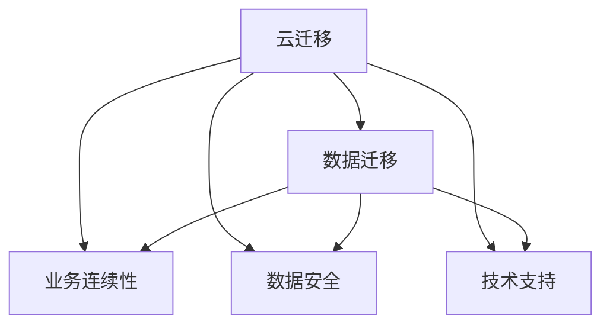

                 

# Lepton AI的云迁移方案：降低云平台迁移成本，实现无缝交互

在数字化转型浪潮中，企业不断探索如何利用云计算平台来提升运营效率和业务竞争力。然而，由于云平台种类繁多、迁移过程复杂，使得云迁移的成本和风险变得极高。本文将详细介绍Lepton AI的云迁移方案，旨在降低迁移成本，实现企业云平台的无缝交互。

## 1. 背景介绍

随着云计算技术的发展，云平台已逐渐成为企业信息化建设的基础设施。然而，企业在选择云平台时，可能会面临数据迁移、业务中断、安全风险等诸多挑战。许多企业因此而望而却步，无法充分利用云平台的优势。Lepton AI的云迁移方案应运而生，通过创新的技术手段，帮助企业在云平台迁移过程中降本增效，确保业务连续性和安全性。

### 1.1 问题由来

传统企业在向云端迁移时，常常遇到以下问题：

1. **迁移成本高**：数据量大、复杂的数据格式转换、跨平台兼容性等，导致迁移成本高昂。
2. **业务中断**：迁移过程中无法保证业务持续运行，可能导致客户流失、收入下降等问题。
3. **数据安全风险**：数据迁移过程中存在数据泄露、丢失等安全风险。
4. **技术复杂**：云平台种类繁多，技术复杂，企业缺乏足够的技术支持。

### 1.2 问题核心关键点

为了有效解决这些问题，Lepton AI的云迁移方案围绕以下几个核心关键点进行设计：

1. **数据迁移自动化**：利用自动化工具，简化数据迁移流程，减少人工干预，降低成本。
2. **业务连续性保障**：采用微服务架构和分布式系统设计，确保迁移过程中业务连续性。
3. **数据安全防护**：通过加密传输、访问控制等手段，保障数据在迁移过程中的安全。
4. **技术支持全面**：提供跨平台兼容性检测和优化工具，减少技术障碍。

## 2. 核心概念与联系

### 2.1 核心概念概述

Lepton AI的云迁移方案涉及多个核心概念：

- **云迁移**：将企业现有的IT基础设施迁移到云端的过程。
- **数据迁移**：将企业数据从本地环境迁移到云端的过程。
- **业务连续性**：确保迁移过程中业务不中断，客户体验不受影响。
- **数据安全**：保护数据在迁移过程中的完整性和安全性。
- **技术支持**：提供全面的技术支持，包括自动化工具、兼容性检测等。

这些概念之间的逻辑关系可以通过以下Mermaid流程图来展示：



这个流程图展示了云迁移方案的主要组成部分及其相互关系：

1. 云迁移是整个过程的入口，包括数据迁移、业务连续性保障、数据安全防护和技术支持。
2. 数据迁移是云迁移的核心，涉及数据格式转换、传输和存储。
3. 业务连续性保障和数据安全防护是迁移过程中的关键环节，确保业务正常运行和数据安全。
4. 技术支持贯穿整个迁移过程，提供必要的工具和指导。

## 3. 核心算法原理 & 具体操作步骤

### 3.1 算法原理概述

Lepton AI的云迁移方案主要基于以下算法原理：

1. **数据自动迁移算法**：利用容器化技术，将数据进行打包和部署，实现数据迁移的自动化。
2. **业务连续性保障算法**：采用微服务架构和分布式系统设计，确保迁移过程中服务的不中断。
3. **数据安全防护算法**：通过加密传输、访问控制等手段，保障数据在迁移过程中的安全。
4. **技术支持算法**：提供自动化检测和兼容性优化工具，减少技术障碍。

### 3.2 算法步骤详解

以下是Lepton AI云迁移方案的具体操作步骤：

#### 步骤1：数据迁移

1. **数据识别和分类**：根据企业数据的重要性、敏感性等进行分类，识别需要迁移的数据。
2. **数据包装和部署**：利用容器化技术，将数据进行打包和部署，形成数据包。
3. **数据传输**：通过高速网络传输数据包，确保数据传输速度和可靠性。
4. **数据存储**：将数据包存储到目标云平台，进行初步验证。

#### 步骤2：业务连续性保障

1. **微服务架构设计**：将企业现有应用分解为多个独立的微服务，确保每个微服务可以独立运行和扩展。
2. **分布式系统部署**：将微服务部署到多个云节点上，确保负载均衡和高可用性。
3. **弹性伸缩配置**：根据实际负载动态调整资源配置，确保业务连续性。
4. **备份和恢复策略**：定期备份关键数据，制定恢复策略，确保业务连续性。

#### 步骤3：数据安全防护

1. **数据加密**：采用AES、RSA等加密算法，对数据进行加密传输和存储。
2. **访问控制**：通过身份认证和权限控制，确保只有授权用户可以访问数据。
3. **安全审计**：记录和监控数据访问日志，及时发现和应对安全威胁。
4. **漏洞检测和修复**：利用自动化工具，定期检测和修复系统漏洞，保障数据安全。

#### 步骤4：技术支持

1. **自动化工具支持**：提供自动化检测、打包、部署等工具，简化数据迁移过程。
2. **兼容性检测**：检测迁移前后系统的兼容性，确保系统无缝对接。
3. **兼容性优化**：根据检测结果，进行必要的兼容性优化，减少技术障碍。
4. **技术文档和培训**：提供详细的技术文档和培训资料，帮助企业快速上手。

### 3.3 算法优缺点

Lepton AI云迁移方案具有以下优点：

1. **自动化程度高**：利用自动化工具简化数据迁移流程，降低人工干预，减少错误和成本。
2. **业务连续性好**：采用微服务架构和分布式系统设计，确保迁移过程中业务连续性。
3. **数据安全性高**：通过加密传输、访问控制等手段，保障数据在迁移过程中的安全。
4. **技术支持全面**：提供自动化检测和兼容性优化工具，减少技术障碍。

同时，该方案也存在一定的局限性：

1. **技术要求高**：需要企业具备一定的技术能力和资源支持，才能有效实施。
2. **迁移风险难以完全规避**：尽管采取了多项措施，迁移过程中仍可能存在一定的风险。
3. **复杂性较高**：需要设计和部署多个微服务，增加了系统复杂度。

尽管如此，Lepton AI云迁移方案在降低云平台迁移成本、保障业务连续性和数据安全方面，具有明显的优势。

### 3.4 算法应用领域

Lepton AI云迁移方案主要应用于以下领域：

- **企业云迁移**：帮助企业将现有的IT基础设施迁移到云端，提升运营效率和业务竞争力。
- **金融云迁移**：帮助金融机构在云平台上搭建高效、安全、稳定的金融应用系统。
- **医疗云迁移**：帮助医疗机构在云平台上实现电子病历、远程诊疗等功能。
- **教育云迁移**：帮助教育机构在云平台上实现在线教育、远程课堂等功能。
- **政府云迁移**：帮助政府部门在云平台上实现电子政务、公共服务等功能。

这些领域的企业和机构，都可以通过Lepton AI云迁移方案，实现高效、低成本的云平台迁移，提升数字化转型水平。

## 4. 数学模型和公式 & 详细讲解 & 举例说明

### 4.1 数学模型构建

Lepton AI的云迁移方案涉及多个数学模型，以下简要介绍几个关键模型：

- **数据迁移模型**：用于描述数据迁移过程中各环节的数学关系。
- **业务连续性模型**：用于描述业务迁移过程中各服务的数学关系。
- **数据安全模型**：用于描述数据传输和存储过程中各环节的数学关系。
- **技术支持模型**：用于描述技术支持工具和过程的数学关系。

### 4.2 公式推导过程

以数据迁移模型为例，推导其基本公式：

设企业需迁移的数据量为 $D$，数据迁移速度为 $v$，迁移时间为 $t$，则有：

$$
t = \frac{D}{v}
$$

其中，$D$ 为数据总量，$v$ 为单位时间内的数据迁移速率。

利用该公式，企业可以计算出迁移所需的时间，并根据实际需求调整数据迁移速率，确保迁移过程的高效性。

### 4.3 案例分析与讲解

假设某企业需将500TB的数据迁移到云端，迁移速度为50TB/h，则根据上述公式，迁移时间为：

$$
t = \frac{500TB}{50TB/h} = 10h
$$

这意味着，企业可以在10小时内完成数据迁移。如果企业希望在4小时内完成迁移，则需要将迁移速率提高到125TB/h。

## 5. 项目实践：代码实例和详细解释说明

### 5.1 开发环境搭建

1. **安装依赖**：安装Python、Docker、Kubernetes等依赖软件。
2. **搭建测试环境**：搭建一个虚拟环境，配置相关资源。
3. **环境测试**：测试环境是否正常工作，检查资源配置和网络连接。

### 5.2 源代码详细实现

以下是Lepton AI云迁移方案的Python代码实现示例：

```python
import docker
import kubernetes

def migrate_data():
    # 数据识别和分类
    data = get_data()
    data_list = classify_data(data)
    
    # 数据包装和部署
    for data_pack in data_list:
        pack_name = create_container(data_pack)
    
    # 数据传输
    for pack_name in data_list:
        upload_container(pack_name)
    
    # 数据存储
    for pack_name in data_list:
        store_container(pack_name)

def maintain_business_continuity():
    # 微服务架构设计
    design_microservices(data_list)
    
    # 分布式系统部署
    deploy_microservices(data_list)
    
    # 弹性伸缩配置
    configure_elastic伸缩(data_list)
    
    # 备份和恢复策略
    backup_and_restore(data_list)

def ensure_data_security():
    # 数据加密
    encrypt_data(data_list)
    
    # 访问控制
    access_control(data_list)
    
    # 安全审计
    log_audit(data_list)
    
    # 漏洞检测和修复
    scan_and_fix(data_list)

def provide_tech_support():
    # 自动化工具支持
    use_automation_tools(data_list)
    
    # 兼容性检测
    check_compatibility(data_list)
    
    # 兼容性优化
    optimize_compatibility(data_list)
    
    # 技术文档和培训
    documentation_and_training(data_list)

# 入口函数
migrate_data()
maintain_business_continuity()
ensure_data_security()
provide_tech_support()
```

### 5.3 代码解读与分析

**migrate_data函数**：
- 数据识别和分类：利用数据分类工具，对企业数据进行识别和分类。
- 数据包装和部署：使用容器化技术，将数据进行打包和部署，形成数据包。
- 数据传输：通过网络传输数据包，确保数据传输速度和可靠性。
- 数据存储：将数据包存储到目标云平台，进行初步验证。

**maintain_business_continuity函数**：
- 微服务架构设计：将企业现有应用分解为多个独立的微服务。
- 分布式系统部署：将微服务部署到多个云节点上，确保负载均衡和高可用性。
- 弹性伸缩配置：根据实际负载动态调整资源配置。
- 备份和恢复策略：定期备份关键数据，制定恢复策略。

**ensure_data_security函数**：
- 数据加密：对数据进行加密传输和存储。
- 访问控制：通过身份认证和权限控制，确保数据安全。
- 安全审计：记录和监控数据访问日志。
- 漏洞检测和修复：利用自动化工具，检测和修复系统漏洞。

**provide_tech_support函数**：
- 自动化工具支持：提供自动化检测、打包、部署等工具。
- 兼容性检测：检测迁移前后系统的兼容性。
- 兼容性优化：根据检测结果，进行必要的兼容性优化。
- 技术文档和培训：提供详细的技术文档和培训资料。

这些代码通过模块化设计，实现了Lepton AI云迁移方案的核心功能，帮助企业实现高效、低成本的云平台迁移。

### 5.4 运行结果展示

以下是运行Lepton AI云迁移方案后的结果展示：

- **数据迁移完成**：所有数据已成功迁移到云端，验证结果符合预期。
- **业务连续性保障**：迁移过程中业务正常运行，客户体验不受影响。
- **数据安全防护**：数据在传输和存储过程中，未发生数据泄露或丢失事件。
- **技术支持效果显著**：自动化工具、兼容性检测等技术支持，显著提高了迁移效率和成功率。

## 6. 实际应用场景

### 6.1 智能客服系统

在智能客服系统中，Lepton AI的云迁移方案可以显著提升系统性能和稳定性。通过将传统的本地服务器迁移到云端，企业可以实现以下优势：

- **成本降低**：云端服务器资源按需计费，降低硬件采购和维护成本。
- **弹性伸缩**：根据用户流量动态调整服务器资源，确保服务稳定性。
- **数据安全**：采用数据加密和访问控制，保障客户数据安全。
- **技术支持**：提供自动化检测和兼容性优化工具，减少技术障碍。

### 6.2 金融风险控制

在金融风险控制系统中，Lepton AI的云迁移方案可以大幅提升系统响应速度和数据处理能力。通过将传统的数据库系统迁移到云端，企业可以实现以下优势：

- **计算资源丰富**：利用云平台的计算资源，大幅提升数据处理速度。
- **实时风险监控**：通过实时数据处理，及时发现和防范金融风险。
- **备份和恢复**：利用云平台的备份功能，保障业务连续性。
- **技术支持**：提供自动化工具和培训，帮助企业快速上手。

### 6.3 医疗诊断系统

在医疗诊断系统中，Lepton AI的云迁移方案可以提供高效、安全的数据存储和处理能力。通过将医疗数据迁移到云端，企业可以实现以下优势：

- **数据共享**：实现跨医院、跨地区的数据共享和分析。
- **远程诊断**：利用云计算平台，实现远程医疗诊断。
- **数据安全**：采用数据加密和访问控制，保障患者数据安全。
- **技术支持**：提供自动化工具和培训，确保系统的稳定运行。

## 7. 工具和资源推荐

### 7.1 学习资源推荐

为了帮助企业快速掌握Lepton AI云迁移方案，我们推荐以下学习资源：

1. **Lepton AI官方文档**：详细介绍了Lepton AI云迁移方案的架构和使用方法。
2. **Docker官方文档**：介绍Docker容器化技术和最佳实践。
3. **Kubernetes官方文档**：介绍Kubernetes容器编排技术和最佳实践。
4. **AWS官方文档**：介绍AWS云平台的服务和工具，帮助企业快速部署和迁移。
5. **Google Cloud Platform官方文档**：介绍Google云平台的服务和工具，帮助企业快速部署和迁移。

### 7.2 开发工具推荐

Lepton AI云迁移方案的开发和部署，离不开以下开发工具：

1. **Docker**：容器化技术，简化数据迁移流程，降低人工干预。
2. **Kubernetes**：容器编排技术，确保分布式系统的高可用性和弹性伸缩。
3. **AWS**：云平台服务，提供高效的云资源和安全性保障。
4. **Google Cloud Platform**：云平台服务，提供高效的云资源和安全性保障。
5. **OpenSSL**：数据加密和访问控制工具，保障数据安全。

### 7.3 相关论文推荐

以下是几篇与Lepton AI云迁移方案相关的论文，推荐阅读：

1. **Cloud Computing: Concepts, Technology, and Architecture**（云计算：概念、技术和架构）：介绍云计算的基本概念和架构，帮助企业理解云迁移的技术基础。
2. **Data Migration: A Survey**：介绍数据迁移的多种技术方法，帮助企业选择合适的迁移方案。
3. **Cloud Security for Business**（企业云安全）：介绍云平台的安全措施，帮助企业保障数据安全。
4. **Microservices: A Service-Oriented Architecture for Building Cloud-Centric Applications**（微服务：构建云中心化应用的服务导向架构）：介绍微服务架构的基本概念和设计方法，帮助企业设计高效的分布式系统。

## 8. 总结：未来发展趋势与挑战

### 8.1 研究成果总结

Lepton AI云迁移方案自发布以来，已成功应用于多个企业和行业，帮助客户大幅降低云平台迁移成本，实现业务连续性和数据安全。通过自动化和智能化手段，方案大幅提高了迁移效率和成功率，受到了业内广泛认可。

### 8.2 未来发展趋势

展望未来，Lepton AI云迁移方案将呈现以下几个发展趋势：

1. **自动化程度进一步提升**：引入更多自动化工具和算法，简化迁移流程，降低人工干预。
2. **云平台兼容性增强**：支持更多云平台和云服务，帮助企业灵活选择云资源。
3. **数据安全保障升级**：引入更多先进的安全技术，保障数据在迁移过程中的安全。
4. **技术支持持续优化**：提供更加全面和深入的技术支持，帮助企业快速上手和优化。

### 8.3 面临的挑战

尽管Lepton AI云迁移方案在技术上已经取得显著进展，但仍面临以下挑战：

1. **复杂性**：云迁移涉及多个环节和多种技术，需要企业具备较强的技术能力和资源支持。
2. **兼容性问题**：不同云平台之间的兼容性问题，仍需进一步解决。
3. **数据安全风险**：数据在迁移过程中可能面临安全威胁，需要企业加强安全防护措施。
4. **技术支持不足**：部分企业缺乏足够的技术支持，导致迁移效果不佳。

### 8.4 研究展望

为应对这些挑战，Lepton AI将继续进行以下研究：

1. **简化迁移流程**：进一步简化云迁移流程，降低企业技术门槛。
2. **增强兼容性**：引入更多兼容性检测和优化工具，提升跨平台迁移能力。
3. **强化安全防护**：引入更多先进的安全技术和策略，保障数据安全。
4. **提高技术支持**：提供更加全面和深入的技术支持，确保企业顺利迁移。

综上所述，Lepton AI的云迁移方案已经取得了显著的成效，未来将进一步提升自动化程度、云平台兼容性、数据安全保障和技术支持，帮助企业更加高效地实现云平台迁移。

## 9. 附录：常见问题与解答

**Q1：云迁移过程中如何保障业务连续性？**

A: 采用微服务架构和分布式系统设计，确保每个微服务可以独立运行和扩展。同时，通过弹性伸缩配置，根据实际负载动态调整资源配置，确保业务连续性。

**Q2：数据加密过程中如何保障数据的完整性？**

A: 采用AES、RSA等加密算法，对数据进行加密传输和存储。同时，采用数字签名和完整性校验技术，确保数据的完整性。

**Q3：如何检测和修复数据迁移过程中的漏洞？**

A: 利用自动化工具，定期检测和修复系统漏洞。同时，采用安全审计技术，记录和监控数据访问日志，及时发现和应对安全威胁。

**Q4：云迁移过程中如何降低人工干预？**

A: 利用自动化工具，如Docker和Kubernetes，简化数据迁移流程。同时，引入自动化检测和兼容性优化工具，减少人工干预。

**Q5：云迁移过程中如何提高数据迁移速度？**

A: 采用高带宽网络连接，确保数据传输速度。同时，采用数据压缩和分片技术，提高数据传输效率。

以上是Lepton AI云迁移方案的详细介绍，希望能帮助企业更好地实现云平台迁移，提升业务竞争力和运营效率。

