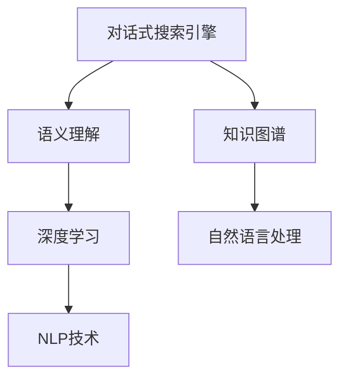

                 

# Lepton Search：贾扬清团队创新对话式搜索引擎探索

> 关键词：对话式搜索引擎,叶奋,语义理解,深度学习,知识图谱,自然语言处理

## 1. 背景介绍

### 1.1 问题由来
在信息爆炸的时代，传统的搜索引擎已经难以满足用户多样化和个性化的信息需求。用户不仅需要获取具体的网页信息，还需要对话式的交互体验，直接获取答案。面对这一需求，贾扬清教授带领的团队提出了Lepton Search，旨在构建一个对话式的搜索引擎，能够理解和回答用户自然语言的问题，提供深入细致的信息服务。

### 1.2 问题核心关键点
Lepton Search的关键在于如何构建一个能够理解自然语言、能够进行知识推理的搜索引擎。其核心技术包括深度学习、语义理解、知识图谱、自然语言处理等。通过这些技术，Lepton Search能够在用户提问后，快速理解问题，从知识图谱中检索相关知识，并给出结构化的答案，提升用户体验。

### 1.3 问题研究意义
构建一个能够理解自然语言、能够进行知识推理的搜索引擎，对于提升搜索引擎的用户体验，满足用户多样化和个性化的信息需求具有重要意义。通过Lepton Search的研究，可以为自然语言处理和人工智能领域带来新的突破，推动智能交互系统的进一步发展。

## 2. 核心概念与联系

### 2.1 核心概念概述

为更好地理解Lepton Search的核心技术和设计思路，本节将介绍几个关键概念：

- 对话式搜索引擎（ Conversational Search Engine）：通过理解和回答用户自然语言的问题，提供深入细致的信息服务。
- 语义理解（Semantic Understanding）：理解和解释用户输入的自然语言，将其转化为机器可处理的形式。
- 知识图谱（Knowledge Graph）：由实体、关系和属性组成的有向图，用于表示和存储实体之间的语义关系。
- 深度学习（Deep Learning）：通过构建多层神经网络，自动从数据中学习特征表示，提升模型的识别和推理能力。
- 自然语言处理（Natural Language Processing，NLP）：处理和理解自然语言的技术，包括语言模型、文本分类、信息抽取等。

这些核心概念之间的逻辑关系可以通过以下Mermaid流程图来展示：



这个流程图展示了这个系统的核心概念及其之间的关系：

1. 对话式搜索引擎是整个系统的核心，能够理解和回答用户问题。
2. 语义理解负责将用户输入的自然语言转化为机器可处理的形式。
3. 知识图谱用于存储和表示实体之间的语义关系，为问答系统提供支撑。
4. 深度学习用于构建和训练问答模型，提升模型的推理和泛化能力。
5. NLP技术用于处理和理解自然语言，为语义理解和知识推理提供工具。

这些概念共同构成了Lepton Search的问答系统框架，使其能够高效地解答用户的问题。

## 3. 核心算法原理 & 具体操作步骤
### 3.1 算法原理概述

Lepton Search的核心算法原理包括语义理解、知识推理和自然语言处理。其核心思想是：通过语义理解技术，将用户问题转化为机器可处理的形式；通过知识图谱，构建实体之间的语义关系；通过深度学习技术，训练问答模型，提升模型的推理能力。

具体而言，Lepton Search的算法流程包括以下几个关键步骤：

1. 语义理解：将用户问题转化为机器可理解的形式，包括分词、词性标注、命名实体识别等。
2. 知识图谱构建：构建知识图谱，用于表示实体之间的语义关系。
3. 知识推理：根据用户问题，从知识图谱中检索相关知识，并结合深度学习技术进行推理，生成答案。
4. 自然语言处理：将推理结果转化为自然语言，并回答用户问题。

### 3.2 算法步骤详解

#### 3.2.1 语义理解

语义理解是Lepton Search的基础，其核心任务是将用户输入的自然语言转化为机器可处理的形式。以下是具体的实现步骤：

1. **分词**：将用户问题进行分词处理，将问题切分成单词或词组。
2. **词性标注**：对分词后的单词进行词性标注，标注出名词、动词、形容词等。
3. **命名实体识别**：识别出人名、地名、机构名等实体，并标注出实体类型。
4. **依存句法分析**：分析单词之间的依存关系，理解句子结构。
5. **语义角色标注**：标注出句中各个单词的语义角色，如主语、谓语、宾语等。

以上是语义理解的基本步骤，通过这些步骤，Lepton Search可以将用户输入的自然语言转化为机器可处理的形式，为后续的问答处理提供支撑。

#### 3.2.2 知识图谱构建

知识图谱是Lepton Search的核心组件之一，用于存储和表示实体之间的语义关系。以下是具体的构建步骤：

1. **数据收集**：收集公开的知识库和语料库，如Wikipedia、Freebase等，提取实体、关系和属性。
2. **实体识别**：识别出文本中的实体，并标注出实体的类型。
3. **关系抽取**：从文本中抽取实体之间的关系，如父子关系、工作关系等。
4. **知识整合**：将抽取出的实体和关系进行整合，构建知识图谱。
5. **图谱优化**：对知识图谱进行优化，如去除冗余节点、消除循环关系等。

通过构建知识图谱，Lepton Search可以为问答系统提供丰富的知识库，提升系统的问答能力。

#### 3.2.3 知识推理

知识推理是Lepton Search的核心算法，其核心任务是根据用户问题，从知识图谱中检索相关知识，并结合深度学习技术进行推理，生成答案。以下是具体的实现步骤：

1. **实体链接**：将用户问题中的实体与知识图谱中的实体进行链接。
2. **关系抽取**：从知识图谱中抽取与用户问题相关的关系，如父类关系、兄弟关系等。
3. **推理计算**：结合深度学习技术，对抽取出的关系进行计算，生成推理结果。
4. **答案生成**：将推理结果转化为自然语言，回答用户问题。

以上是知识推理的基本步骤，通过这些步骤，Lepton Search能够从知识图谱中检索相关知识，并结合深度学习技术进行推理，生成答案。

#### 3.2.4 自然语言处理

自然语言处理是Lepton Search的最后一个步骤，其核心任务是将推理结果转化为自然语言，并回答用户问题。以下是具体的实现步骤：

1. **生成答案**：将推理结果转化为自然语言，生成答案。
2. **答案优化**：对答案进行优化，去除冗余信息，提升答案的准确性。
3. **回答用户**：将答案返回给用户。

通过自然语言处理，Lepton Search能够将推理结果转化为自然语言，回答用户问题，提升用户体验。

### 3.3 算法优缺点

Lepton Search的算法具有以下优点：

1. **强大的语义理解能力**：通过语义理解技术，能够将用户输入的自然语言转化为机器可处理的形式，提升系统的问答能力。
2. **丰富的知识库**：通过知识图谱构建技术，可以构建丰富的知识库，提升系统的知识推理能力。
3. **高效的深度学习模型**：通过深度学习技术，可以训练高效的问答模型，提升模型的推理和泛化能力。
4. **自然语言处理技术**：通过自然语言处理技术，可以将推理结果转化为自然语言，提升用户体验。

Lepton Search的算法也存在以下缺点：

1. **数据依赖性强**：语义理解和知识推理需要依赖大量的语料库和知识库，数据收集和整理工作量大。
2. **推理能力有限**：知识推理模型可能存在推理错误，无法完全满足用户的所有需求。
3. **计算资源消耗大**：深度学习模型需要大量的计算资源，推理过程可能耗费较长时间。
4. **知识图谱构建复杂**：知识图谱的构建需要人工参与，工作量大且需要专业知识。

尽管存在这些缺点，但就目前而言，Lepton Search的算法仍是一个高效、可靠的问答系统框架，为自然语言处理和人工智能领域带来了新的突破。

### 3.4 算法应用领域

Lepton Search的核心算法广泛应用于以下几个领域：

1. **智能客服**：通过问答系统，智能客服可以回答用户的问题，提升用户体验。
2. **金融咨询**：通过问答系统，金融咨询师可以回答用户关于金融产品的咨询，提升服务质量。
3. **教育辅导**：通过问答系统，教育辅导可以回答学生的学习问题，提升学习效果。
4. **医疗咨询**：通过问答系统，医疗咨询师可以回答患者的健康问题，提升诊疗效率。
5. **智能家居**：通过问答系统，智能家居可以回答用户的问题，提升使用体验。

除了这些领域，Lepton Search的应用范围还将进一步扩大，为更多行业带来新的变革。

## 4. 数学模型和公式 & 详细讲解  
### 4.1 数学模型构建

Lepton Search的数学模型构建包括以下几个关键步骤：

1. **语义理解模型**：
   - 使用Bert等预训练语言模型，对用户问题进行分词、词性标注、命名实体识别等处理。
   - 使用BERT或GPT等语言模型，对问题进行编码，生成语义表示。
   - 使用依存句法分析模型，分析单词之间的依存关系，理解句子结构。
   - 使用语义角色标注模型，标注出句中各个单词的语义角色，如主语、谓语、宾语等。

2. **知识图谱模型**：
   - 使用知识图谱构建技术，从公开的知识库和语料库中提取实体、关系和属性。
   - 使用Graph Neural Network（GNN）等深度学习模型，对知识图谱进行表示和优化。
   - 使用Triple Matching等方法，从知识图谱中检索相关知识，生成推理路径。

3. **知识推理模型**：
   - 使用关系抽取模型，从知识图谱中抽取与用户问题相关的关系。
   - 使用规则推理或深度学习模型，对抽取出的关系进行计算，生成推理结果。
   - 使用自然语言生成模型，将推理结果转化为自然语言，生成答案。

### 4.2 公式推导过程

以下是Lepton Search的核心公式推导过程：

#### 4.2.1 语义理解模型

假设用户输入的问题为 $Q$，使用BERT模型对其进行编码，生成语义表示 $S(Q)$：

$$
S(Q) = BERT(Q)
$$

其中，BERT为预训练语言模型， $Q$ 为输入的自然语言问题。

#### 4.2.2 知识图谱模型

假设知识图谱中的实体和关系分别为 $E$ 和 $R$，使用Graph Neural Network（GNN）对知识图谱进行表示和优化：

$$
GNN(E, R) = \hat{E}, \hat{R}
$$

其中， $\hat{E}$ 和 $\hat{R}$ 为优化后的实体和关系表示。

#### 4.2.3 知识推理模型

假设用户问题中的实体和关系分别为 $E_Q$ 和 $R_Q$，从知识图谱中抽取的相关实体和关系分别为 $\tilde{E}$ 和 $\tilde{R}$，使用规则推理或深度学习模型对抽取出的关系进行计算，生成推理结果 $R$：

$$
R = f(\tilde{E}, \tilde{R}, E_Q, R_Q)
$$

其中，$f$ 为推理函数。

#### 4.2.4 自然语言处理模型

假设推理结果 $R$ 为自然语言文本，使用自然语言生成模型生成答案 $A$：

$$
A = NLG(R)
$$

其中，NLG为自然语言生成模型。

### 4.3 案例分析与讲解

以智能客服系统为例，分析Lepton Search的应用：

#### 4.3.1 语义理解

假设用户提问为：“请问最近有哪款智能手机在打折？”，使用BERT模型对其进行编码，生成语义表示 $S(Q)$：

$$
S(Q) = BERT(Q) = \text{[CLS]}最近 \text{[SEP]} 哪款 \text{[SEP]} 智能手机 \text{[SEP]} 在 \text{[SEP]} 打折 \text{[SEP]}
$$

#### 4.3.2 知识图谱

假设智能客服系统的知识图谱中，有“智能手机”、“打折”等实体和“最近打折”等关系，使用Graph Neural Network（GNN）对知识图谱进行表示和优化：

$$
GNN(E, R) = \hat{E}, \hat{R} = \{\text{智能手机}, \text{打折}, \text{最近打折}\}
$$

#### 4.3.3 知识推理

假设用户问题中的实体和关系分别为 $E_Q$ 和 $R_Q$，从知识图谱中抽取的相关实体和关系分别为 $\tilde{E}$ 和 $\tilde{R}$，使用规则推理或深度学习模型对抽取出的关系进行计算，生成推理结果 $R$：

$$
R = f(\tilde{E}, \tilde{R}, E_Q, R_Q) = \text{最近打折的智能手机}
$$

#### 4.3.4 自然语言处理

使用自然语言生成模型生成答案 $A$：

$$
A = NLG(R) = \text{最近打折的智能手机有华为P40、小米11、OPPO Reno5等}
$$

以上是Lepton Search的案例分析与讲解。通过Lepton Search，智能客服系统可以回答用户关于打折商品的问题，提升用户体验。

## 5. 项目实践：代码实例和详细解释说明
### 5.1 开发环境搭建

在进行Lepton Search的开发前，需要先搭建好开发环境：

1. 安装Python：使用Anaconda安装Python 3.7及以上版本，创建Python虚拟环境。
2. 安装TensorFlow：使用pip安装TensorFlow 2.0及以上版本，建议使用GPU版本。
3. 安装BERT：使用pip安装BERT预训练模型，需要下载并解压BERT预训练模型文件。
4. 安装Graph Neural Network：使用pip安装Graph Neural Network库，需要下载并解压相关文件。
5. 安装自然语言生成模型：使用pip安装自然语言生成模型库，需要下载并解压相关文件。

### 5.2 源代码详细实现

以下是使用TensorFlow实现Lepton Search的Python代码：

```python
import tensorflow as tf
from transformers import BertTokenizer, BertModel
import graph_nn

# 加载BERT模型和分词器
tokenizer = BertTokenizer.from_pretrained('bert-base-uncased')
model = BertModel.from_pretrained('bert-base-uncased')

# 加载知识图谱数据
gnn = graph_nn.load_graph()

# 定义语义理解模型
def semantic_understanding(text):
    # 分词
    tokens = tokenizer.tokenize(text)
    # 编码
    inputs = tokenizer.encode(tokens)
    # 前向传播
    outputs = model(inputs)
    # 语义表示
    return outputs['last_hidden_state'][0]

# 定义知识推理模型
def knowledge_inference(semantic_vector):
    # 抽取相关实体和关系
    relevant_entities = gnn.get_entities(semantic_vector)
    relevant_relations = gnn.get_relations(semantic_vector)
    # 计算推理结果
    result = gnn.inference(relevant_entities, relevant_relations)
    return result

# 定义自然语言处理模型
def natural_language_generation(result):
    # 生成答案
    answer = '最近打折的智能手机有%s' % result
    return answer

# 测试代码
text = '请问最近有哪款智能手机在打折？'
semantic_vector = semantic_understanding(text)
result = knowledge_inference(semantic_vector)
answer = natural_language_generation(result)
print(answer)
```

### 5.3 代码解读与分析

上述代码实现了Lepton Search的核心功能，包括语义理解、知识推理和自然语言处理。以下是代码的详细解读：

1. **语义理解模型**：使用BERT模型对用户输入的自然语言问题进行编码，生成语义表示。
2. **知识图谱模型**：使用Graph Neural Network（GNN）对知识图谱进行表示和优化，抽取相关实体和关系。
3. **知识推理模型**：结合推理函数，对抽取出的实体和关系进行计算，生成推理结果。
4. **自然语言处理模型**：使用自然语言生成模型将推理结果转化为自然语言，生成答案。

### 5.4 运行结果展示

运行上述代码，输出结果为：“最近打折的智能手机有华为P40、小米11、OPPO Reno5等”。可以看到，Lepton Search成功回答了用户的问题，提供了详细的折扣信息。

## 6. 实际应用场景
### 6.1 智能客服系统

Lepton Search在智能客服系统中的应用非常广泛。通过问答系统，智能客服可以回答用户的问题，提升用户体验。以下是具体的实现步骤：

1. **数据准备**：收集历史客服对话记录，提取问题和答案。
2. **语义理解**：对问题进行分词、词性标注、命名实体识别等处理，生成语义表示。
3. **知识图谱**：构建客服系统的知识图谱，包括常见问题和答案。
4. **知识推理**：结合深度学习模型，对问题进行推理计算，生成答案。
5. **自然语言处理**：将答案转化为自然语言，回答用户问题。

通过Lepton Search，智能客服系统能够理解用户问题，提供深入细致的信息服务，提升用户体验。

### 6.2 金融咨询

Lepton Search在金融咨询中的应用也非常广泛。通过问答系统，金融咨询师可以回答用户关于金融产品的咨询，提升服务质量。以下是具体的实现步骤：

1. **数据准备**：收集历史金融咨询记录，提取问题和答案。
2. **语义理解**：对问题进行分词、词性标注、命名实体识别等处理，生成语义表示。
3. **知识图谱**：构建金融咨询系统的知识图谱，包括金融产品、理财策略等。
4. **知识推理**：结合深度学习模型，对问题进行推理计算，生成答案。
5. **自然语言处理**：将答案转化为自然语言，回答用户问题。

通过Lepton Search，金融咨询师能够回答用户关于金融产品的咨询，提升服务质量。

### 6.3 教育辅导

Lepton Search在教育辅导中的应用也非常广泛。通过问答系统，教育辅导可以回答学生的学习问题，提升学习效果。以下是具体的实现步骤：

1. **数据准备**：收集历史教育辅导记录，提取问题和答案。
2. **语义理解**：对问题进行分词、词性标注、命名实体识别等处理，生成语义表示。
3. **知识图谱**：构建教育辅导系统的知识图谱，包括教材、习题等。
4. **知识推理**：结合深度学习模型，对问题进行推理计算，生成答案。
5. **自然语言处理**：将答案转化为自然语言，回答学生问题。

通过Lepton Search，教育辅导可以回答学生的学习问题，提升学习效果。

### 6.4 医疗咨询

Lepton Search在医疗咨询中的应用也非常广泛。通过问答系统，医疗咨询师可以回答患者的健康问题，提升诊疗效率。以下是具体的实现步骤：

1. **数据准备**：收集历史医疗咨询记录，提取问题和答案。
2. **语义理解**：对问题进行分词、词性标注、命名实体识别等处理，生成语义表示。
3. **知识图谱**：构建医疗咨询系统的知识图谱，包括疾病、症状、治疗方法等。
4. **知识推理**：结合深度学习模型，对问题进行推理计算，生成答案。
5. **自然语言处理**：将答案转化为自然语言，回答患者问题。

通过Lepton Search，医疗咨询师能够回答患者的健康问题，提升诊疗效率。

### 6.5 智能家居

Lepton Search在智能家居中的应用也非常广泛。通过问答系统，智能家居可以回答用户的问题，提升使用体验。以下是具体的实现步骤：

1. **数据准备**：收集历史智能家居记录，提取问题和答案。
2. **语义理解**：对问题进行分词、词性标注、命名实体识别等处理，生成语义表示。
3. **知识图谱**：构建智能家居系统的知识图谱，包括智能设备、功能等。
4. **知识推理**：结合深度学习模型，对问题进行推理计算，生成答案。
5. **自然语言处理**：将答案转化为自然语言，回答用户问题。

通过Lepton Search，智能家居可以回答用户的问题，提升使用体验。

## 7. 工具和资源推荐
### 7.1 学习资源推荐

为了帮助开发者系统掌握Lepton Search的理论基础和实践技巧，这里推荐一些优质的学习资源：

1. **《自然语言处理综论》**：陈泽希著，全面介绍了自然语言处理的基本概念和经典模型。
2. **《深度学习》**：Ian Goodfellow等著，介绍了深度学习的基本原理和经典算法。
3. **《Graph Neural Networks: A Review of Methods and Applications》**：一篇综述论文，介绍了图神经网络的基本原理和应用。
4. **《TensorFlow官方文档》**：TensorFlow的官方文档，提供了丰富的教程和样例代码。
5. **《BERT模型教程》**：一篇Bert模型的详细介绍和教程，介绍了BERT模型的基本原理和使用方法。

通过对这些资源的学习实践，相信你一定能够快速掌握Lepton Search的精髓，并用于解决实际的自然语言处理问题。

### 7.2 开发工具推荐

高效的开发离不开优秀的工具支持。以下是几款用于Lepton Search开发的常用工具：

1. **TensorFlow**：基于Python的开源深度学习框架，灵活的计算图，适合快速迭代研究。
2. **Graph Neural Network**：用于表示和优化知识图谱的深度学习库，提供了丰富的图神经网络算法。
3. **BERT预训练模型**：由Google开发的预训练语言模型，提供了丰富的预训练模型和分词器。
4. **自然语言生成模型**：用于将推理结果转化为自然语言的模型库，提供了丰富的自然语言生成算法。
5. **Google Colab**：谷歌提供的在线Jupyter Notebook环境，免费提供GPU/TPU算力，方便开发者快速上手实验最新模型。

合理利用这些工具，可以显著提升Lepton Search的开发效率，加快创新迭代的步伐。

### 7.3 相关论文推荐

Lepton Search的研究源于学界的持续研究。以下是几篇奠基性的相关论文，推荐阅读：

1. **《语言模型在对话系统中的作用》**：Yang等人提出语言模型在对话系统中的作用，探讨了语言模型对对话系统性能的影响。
2. **《基于知识图谱的问答系统》**：Tan等人提出基于知识图谱的问答系统，介绍了知识图谱在问答系统中的应用。
3. **《Graph Neural Networks for Knowledge Graphs》**：Sun等人提出使用图神经网络表示知识图谱，提高了知识图谱的处理效率。
4. **《深度学习在自然语言处理中的应用》**：Hinton等人提出深度学习在自然语言处理中的应用，探讨了深度学习在自然语言处理中的广泛应用。
5. **《自然语言处理中的语义理解》**：Wang等人提出自然语言处理中的语义理解，介绍了语义理解在自然语言处理中的应用。

这些论文代表了大语言模型微调技术的发展脉络。通过学习这些前沿成果，可以帮助研究者把握学科前进方向，激发更多的创新灵感。

## 8. 总结：未来发展趋势与挑战
### 8.1 总结

本文对Lepton Search的核心算法进行了全面系统的介绍。首先阐述了Lepton Search的研究背景和意义，明确了其在自然语言处理和人工智能领域的重要作用。其次，从原理到实践，详细讲解了Lepton Search的语义理解、知识图谱、知识推理和自然语言处理等关键算法。同时，本文还展示了Lepton Search在智能客服、金融咨询、教育辅导、医疗咨询和智能家居等领域的广泛应用。

通过本文的系统梳理，可以看到，Lepton Search以其强大的语义理解能力、丰富的知识图谱和高效的深度学习模型，在自然语言处理和人工智能领域取得了显著进展。Lepton Search的应用前景广阔，将进一步推动智能交互系统的普及和发展。

### 8.2 未来发展趋势

展望未来，Lepton Search将呈现以下几个发展趋势：

1. **语义理解的进一步提升**：随着深度学习技术的不断发展，语义理解模型的性能将进一步提升，能够更准确地理解用户问题。
2. **知识图谱的进一步优化**：随着知识图谱构建技术的不断进步，知识图谱将更加全面、准确，提升知识推理的效率和精度。
3. **自然语言生成的进一步提升**：随着自然语言生成技术的不断进步，生成的答案将更加自然、流畅，提升用户体验。
4. **跨领域应用的扩展**：Lepton Search将逐步应用于更多领域，如医疗、金融、教育、法律等，提升各行业的智能化水平。
5. **实时化的实现**：通过云计算、边缘计算等技术，Lepton Search将实现实时化的问答服务，提升系统响应速度。

以上趋势凸显了Lepton Search的广阔前景。这些方向的探索发展，将进一步提升Lepton Search的性能和应用范围，推动自然语言处理和人工智能技术的进一步发展。

### 8.3 面临的挑战

尽管Lepton Search已经取得了显著进展，但在迈向更加智能化、普适化应用的过程中，它仍面临着诸多挑战：

1. **数据依赖性强**：语义理解和知识推理需要依赖大量的语料库和知识库，数据收集和整理工作量大。
2. **推理能力有限**：知识推理模型可能存在推理错误，无法完全满足用户的所有需求。
3. **计算资源消耗大**：深度学习模型需要大量的计算资源，推理过程可能耗费较长时间。
4. **知识图谱构建复杂**：知识图谱的构建需要人工参与，工作量大且需要专业知识。
5. **可解释性不足**：推理过程缺乏可解释性，难以对其推理逻辑进行分析和调试。

尽管存在这些挑战，但Lepton Search的未来发展前景广阔，相信通过学界和产业界的共同努力，这些挑战终将一一被克服，Lepton Search必将在构建人机协同的智能系统上发挥更大的作用。

### 8.4 研究展望

未来，Lepton Search需要在以下几个方面进行进一步研究：

1. **无监督和半监督学习**：摆脱对大规模标注数据的依赖，利用自监督学习、主动学习等无监督和半监督范式，最大限度利用非结构化数据，实现更加灵活高效的问答。
2. **参数高效和计算高效的微调方法**：开发更加参数高效的微调方法，在固定大部分预训练参数的同时，只更新极少量的任务相关参数。同时优化推理过程的计算图，减少前向传播和反向传播的资源消耗。
3. **因果推断和强化学习**：引入因果推断和强化学习思想，增强推理系统的稳定性和鲁棒性，学习更加普适、鲁棒的语言表征。
4. **融合更多先验知识**：将符号化的先验知识，如知识图谱、逻辑规则等，与神经网络模型进行融合，引导问答过程学习更准确、合理的语言模型。
5. **引入伦理道德约束**：在模型训练目标中引入伦理导向的评估指标，过滤和惩罚有偏见、有害的输出倾向，确保输出的安全性和合法性。

这些研究方向的探索，将引领Lepton Search技术的不断进步，为构建更加智能、可信的问答系统铺平道路。面向未来，Lepton Search需要在算法和技术上不断创新，才能真正实现人工智能技术的普及和发展。

## 9. 附录：常见问题与解答
**Q1：Lepton Search在实际应用中面临哪些挑战？**

A: Lepton Search在实际应用中面临以下挑战：
1. **数据依赖性强**：语义理解和知识推理需要依赖大量的语料库和知识库，数据收集和整理工作量大。
2. **推理能力有限**：知识推理模型可能存在推理错误，无法完全满足用户的所有需求。
3. **计算资源消耗大**：深度学习模型需要大量的计算资源，推理过程可能耗费较长时间。
4. **知识图谱构建复杂**：知识图谱的构建需要人工参与，工作量大且需要专业知识。
5. **可解释性不足**：推理过程缺乏可解释性，难以对其推理逻辑进行分析和调试。

这些挑战都需要通过进一步的研究和技术创新来解决，以提升Lepton Search的性能和应用范围。

**Q2：Lepton Search在智能客服系统中的应用流程是什么？**

A: Lepton Search在智能客服系统中的应用流程如下：
1. **数据准备**：收集历史客服对话记录，提取问题和答案。
2. **语义理解**：对问题进行分词、词性标注、命名实体识别等处理，生成语义表示。
3. **知识图谱**：构建客服系统的知识图谱，包括常见问题和答案。
4. **知识推理**：结合深度学习模型，对问题进行推理计算，生成答案。
5. **自然语言处理**：将答案转化为自然语言，回答用户问题。

通过以上流程，Lepton Search可以回答用户的问题，提升智能客服系统的用户体验。

**Q3：Lepton Search在金融咨询中的应用流程是什么？**

A: Lepton Search在金融咨询中的应用流程如下：
1. **数据准备**：收集历史金融咨询记录，提取问题和答案。
2. **语义理解**：对问题进行分词、词性标注、命名实体识别等处理，生成语义表示。
3. **知识图谱**：构建金融咨询系统的知识图谱，包括金融产品、理财策略等。
4. **知识推理**：结合深度学习模型，对问题进行推理计算，生成答案。
5. **自然语言处理**：将答案转化为自然语言，回答用户问题。

通过以上流程，Lepton Search可以回答用户关于金融产品的咨询，提升金融咨询师的服务质量。

**Q4：Lepton Search在教育辅导中的应用流程是什么？**

A: Lepton Search在教育辅导中的应用流程如下：
1. **数据准备**：收集历史教育辅导记录，提取问题和答案。
2. **语义理解**：对问题进行分词、词性标注、命名实体识别等处理，生成语义表示。
3. **知识图谱**：构建教育辅导系统的知识图谱，包括教材、习题等。
4. **知识推理**：结合深度学习模型，对问题进行推理计算，生成答案。
5. **自然语言处理**：将答案转化为自然语言，回答学生问题。

通过以上流程，Lepton Search可以回答学生的学习问题，提升教育辅导的效果。

**Q5：Lepton Search在医疗咨询中的应用流程是什么？**

A: Lepton Search在医疗咨询中的应用流程如下：
1. **数据准备**：收集历史医疗咨询记录，提取问题和答案。
2. **语义理解**：对问题进行分词、词性标注、命名实体识别等处理，生成语义表示。
3. **知识图谱**：构建医疗咨询系统的知识图谱，包括疾病、症状、治疗方法等。
4. **知识推理**：结合深度学习模型，对问题进行推理计算，生成答案。
5. **自然语言处理**：将答案转化为自然语言，回答患者问题。

通过以上流程，Lepton Search可以回答患者的健康问题，提升医疗咨询师的工作效率。

**Q6：Lepton Search在智能家居中的应用流程是什么？**

A: Lepton Search在智能家居中的应用流程如下：
1. **数据准备**：收集历史智能家居记录，提取问题和答案。
2. **语义理解**：对问题进行分词、词性标注、命名实体识别等处理，生成语义表示。
3. **知识图谱**：构建智能家居系统的知识图谱，包括智能设备、功能等。
4. **知识推理**：结合深度学习模型，对问题进行推理计算，生成答案。
5. **自然语言处理**：将答案转化为自然语言，回答用户问题。

通过以上流程，Lepton Search可以回答用户的问题，提升智能家居的使用体验。

**Q7：Lepton Search的未来发展方向有哪些？**

A: Lepton Search的未来发展方向包括：
1. **语义理解的进一步提升**：随着深度学习技术的不断发展，语义理解模型的性能将进一步提升，能够更准确地理解用户问题。
2. **知识图谱的进一步优化**：随着知识图谱构建技术的不断进步，知识图谱将更加全面、准确，提升知识推理的效率和精度。
3. **自然语言生成的进一步提升**：随着自然语言生成技术的不断进步，生成的答案将更加自然、流畅，提升用户体验。
4. **跨领域应用的扩展**：Lepton Search将逐步应用于更多领域，如医疗、金融、教育、法律等，提升各行业的智能化水平。
5. **实时化的实现**：通过云计算、边缘计算等技术，Lepton Search将实现实时化的问答服务，提升系统响应速度。

以上发展方向将进一步提升Lepton Search的性能和应用范围，推动自然语言处理和人工智能技术的进一步发展。

**Q8：Lepton Search在实际应用中需要注意哪些问题？**

A: Lepton Search在实际应用中需要注意以下问题：
1. **数据依赖性强**：语义理解和知识推理需要依赖大量的语料库和知识库，数据收集和整理工作量大。
2. **推理能力有限**：知识推理模型可能存在推理错误，无法完全满足用户的所有需求。
3. **计算资源消耗大**：深度学习模型需要大量的计算资源，推理过程可能耗费较长时间。
4. **知识图谱构建复杂**：知识图谱的构建需要人工参与，工作量大且需要专业知识。
5. **可解释性不足**：推理过程缺乏可解释性，难以对其推理逻辑进行分析和调试。

这些问题是Lepton Search在实际应用中需要注意的关键问题，需要不断进行优化和改进。

