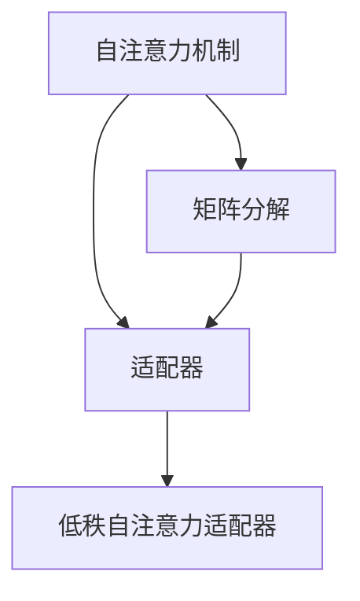

                 

## 1. 背景介绍

### 1.1 问题由来
随着深度学习模型的日益复杂化，模型的训练和推理成本也随之增加。特别是在使用预训练的大模型进行微调时，由于模型结构庞大，对计算资源的需求量极高，导致在实际部署中受到诸多限制。例如，在处理文本分类、命名实体识别等任务时，往往需要构建包括多个Transformer层的大模型，这不仅增加了训练时间和计算成本，还对内存和硬件资源提出了严苛要求。

为了缓解这些问题，研究者提出了参数高效微调（Parameter-Efficient Fine-Tuning，PEFT）的概念，旨在减少微调过程中需要更新的参数量，以提高模型部署的效率。其中，适配器（Adapter）技术是一种常用的PEFT方法，通过对预训练模型的顶层进行适配，使得模型能够在不更新底层参数的情况下，适应特定任务的需求。

然而，尽管适配器技术能够实现较为高效的参数更新，但它仍面临一些限制。例如，适配器需要预定义具体的模型架构，而不同任务可能需要不同的适配器结构，增加了模型设计和维护的复杂性。此外，适配器通常只对顶层进行适配，底层参数保持不变，可能导致模型在微调过程中无法充分利用预训练模型的知识。

为了进一步提升模型的参数高效性和灵活性，研究者提出了一种新的参数高效微调方法——低秩自注意力适配器（Low-Rank Adapter, LoRA）。LoRA方法通过低秩矩阵分解技术，将适配器的权重进行压缩，使得模型能够在不增加大量参数的情况下，进行高效的微调和推理。

### 1.2 问题核心关键点
LoRA的核心思想是：在微调过程中，将模型的自注意力机制分解为低秩矩阵，使得模型能够动态地更新适配器参数，从而适应不同的任务需求。LoRA方法主要包括两个关键步骤：

1. **矩阵分解**：将适配器参数表示为低秩矩阵的乘积形式，减少模型的参数量。
2. **动态适配**：在微调过程中，动态地更新低秩矩阵，使得模型能够适应不同的任务。

通过这些步骤，LoRA方法能够在不增加大量参数的情况下，进行高效的微调和推理，显著提升了模型的部署效率。

### 1.3 问题研究意义
LoRA方法不仅能够减少模型参数，降低训练和推理成本，还通过低秩矩阵的动态适配，增强了模型的灵活性和可解释性。这对于需要部署在大规模生产环境中的NLP应用来说，具有重要的实际意义：

1. **降低计算成本**：LoRA方法减少了模型参数，降低了训练和推理的计算成本，使得模型更易于部署。
2. **提升灵活性**：LoRA方法通过动态适配，使得模型能够适应不同的任务需求，提高了模型的灵活性。
3. **增强可解释性**：LoRA方法通过低秩矩阵的分解，使得模型的适配过程更加透明，增强了模型的可解释性。
4. **促进工业应用**：LoRA方法的参数高效性，使得NLP技术更易于在工业界落地，推动NLP技术的产业化进程。

## 2. 核心概念与联系

### 2.1 核心概念概述

为了更好地理解LoRA方法，本节将介绍几个密切相关的核心概念：

- **自注意力机制**：Transformer模型中的核心组件，通过计算输入序列中每个位置与其他位置的相关性，从而捕获输入序列的语义和结构信息。
- **矩阵分解**：将一个高维矩阵分解为两个低维矩阵的乘积，减少矩阵的秩，降低计算复杂度。
- **适配器**：一种参数高效微调方法，通过添加特定的适配层，使得模型能够在不更新底层参数的情况下，适应不同的任务需求。
- **低秩自注意力适配器**：LoRA方法通过低秩矩阵分解技术，将自注意力机制的权重进行压缩，使得模型能够动态地更新适配器参数，从而适应不同的任务需求。

这些概念之间的逻辑关系可以通过以下Mermaid流程图来展示：



这个流程图展示了自注意力机制、矩阵分解、适配器以及LoRA方法之间的联系：

1. 自注意力机制是Transformer模型的核心组件，通过计算输入序列中每个位置与其他位置的相关性，从而捕获输入序列的语义和结构信息。
2. 矩阵分解将自注意力机制的权重进行压缩，使得模型能够动态地更新适配器参数，从而适应不同的任务需求。
3. 适配器通过添加特定的适配层，使得模型能够在不更新底层参数的情况下，适应不同的任务需求。
4. LoRA方法通过低秩矩阵分解技术，将适配器参数表示为低秩矩阵的乘积形式，进一步增强了模型的参数高效性和灵活性。

这些概念共同构成了LoRA方法的原理和架构，使得LoRA能够在高效微调的同时，适应不同的任务需求，提高模型的灵活性和可解释性。

## 3. 核心算法原理 & 具体操作步骤
### 3.1 算法原理概述

LoRA方法通过低秩矩阵分解技术，将自注意力机制的权重进行压缩，使得模型能够动态地更新适配器参数，从而适应不同的任务需求。LoRA方法的核心思想是：将自注意力机制的权重表示为低秩矩阵的乘积形式，减少模型的参数量，同时通过动态地更新低秩矩阵，增强模型的灵活性。

LoRA方法的具体实现步骤如下：

1. **矩阵分解**：将自注意力机制的权重矩阵 $A \in \mathbb{R}^{d \times d}$ 分解为两个低秩矩阵 $W \in \mathbb{R}^{d \times r}$ 和 $U \in \mathbb{R}^{d \times r}$ 的乘积，其中 $r$ 是低秩矩阵的秩。
2. **动态适配**：在微调过程中，动态地更新低秩矩阵 $W$ 和 $U$，使得模型能够适应不同的任务需求。

### 3.2 算法步骤详解

**Step 1: 矩阵分解**
首先，定义自注意力机制的权重矩阵 $A$，将其分解为两个低秩矩阵 $W$ 和 $U$，其中 $r$ 是低秩矩阵的秩：

$$
A = WU^T
$$

其中 $W$ 和 $U$ 的维度分别为 $d \times r$，$r$ 为低秩矩阵的秩。

**Step 2: 动态适配**
在微调过程中，通过动态更新低秩矩阵 $W$ 和 $U$，使得模型能够适应不同的任务需求。设微调后的低秩矩阵为 $\hat{W}$ 和 $\hat{U}$，则微调的目标是：

$$
\hat{A} = \hat{W}\hat{U}^T
$$

其中 $\hat{A}$ 为微调后的自注意力权重矩阵。微调的过程可以看作是解方程：

$$
A = \hat{W}\hat{U}^T
$$

通过对 $\hat{W}$ 和 $\hat{U}$ 进行更新，使得 $\hat{A}$ 逼近原自注意力权重矩阵 $A$。

### 3.3 算法优缺点

LoRA方法具有以下优点：

1. **参数高效**：LoRA方法通过低秩矩阵分解技术，显著减少了模型的参数量，使得模型能够在不增加大量参数的情况下，进行高效的微调和推理。
2. **动态适配**：LoRA方法通过动态更新低秩矩阵，增强了模型的灵活性，能够适应不同的任务需求。
3. **计算高效**：LoRA方法通过低秩矩阵分解技术，减少了模型的计算复杂度，提高了模型的计算效率。

LoRA方法也存在一些缺点：

1. **计算复杂度**：LoRA方法需要计算低秩矩阵的乘积，对于大规模模型，计算复杂度仍然较高。
2. **可解释性**：LoRA方法的动态适配过程复杂，难以解释模型内部工作机制。
3. **对数据分布的敏感性**：LoRA方法的微调效果依赖于数据分布的相似性，当数据分布与预训练模型的分布差异较大时，效果可能不理想。

### 3.4 算法应用领域

LoRA方法在NLP领域得到了广泛应用，主要用于以下领域：

- **文本分类**：将低秩自注意力适配器应用于文本分类任务，能够在不增加大量参数的情况下，提高模型的分类精度。
- **命名实体识别**：通过低秩自注意力适配器，能够提高命名实体识别的准确率。
- **问答系统**：在问答系统中，通过动态适配低秩矩阵，提高模型对复杂问题的理解能力。
- **机器翻译**：将低秩自注意力适配器应用于机器翻译任务，能够提高翻译的流畅度和准确率。
- **文本摘要**：在文本摘要任务中，通过动态适配低秩矩阵，提高模型对文本信息的抽取能力。

LoRA方法的应用范围非常广泛，未来还有更多的应用场景有待挖掘。

## 4. 数学模型和公式 & 详细讲解  
### 4.1 数学模型构建

LoRA方法的核心在于低秩矩阵分解和动态适配。以下将通过数学语言对LoRA方法进行更加严格的刻画。

设自注意力机制的权重矩阵 $A \in \mathbb{R}^{d \times d}$，其中 $d$ 为模型的维度。LoRA方法通过将 $A$ 分解为两个低秩矩阵 $W$ 和 $U$，使得 $A$ 可以表示为：

$$
A = WU^T
$$

其中 $W$ 和 $U$ 的维度分别为 $d \times r$，$r$ 为低秩矩阵的秩。

### 4.2 公式推导过程

以下对LoRA方法进行数学推导：

设自注意力机制的输入为 $X \in \mathbb{R}^{N \times d}$，其中 $N$ 为序列长度。自注意力机制的输出为 $Z \in \mathbb{R}^{N \times d}$，自注意力权重矩阵为 $A \in \mathbb{R}^{d \times d}$。自注意力机制的输出可以表示为：

$$
Z = \text{softmax}(A^T X)X^T
$$

其中 $\text{softmax}(\cdot)$ 表示softmax函数，用于计算输入的归一化权重。

设微调后的低秩矩阵为 $\hat{W} \in \mathbb{R}^{d \times r}$ 和 $\hat{U} \in \mathbb{R}^{d \times r}$，则微调后的自注意力机制的输出为：

$$
Z' = \text{softmax}(\hat{W}^T X) \hat{U}^T X^T
$$

微调的目标是使得 $Z'$ 逼近 $Z$，即：

$$
Z \approx Z'
$$

通过最小化以下损失函数，可以训练出微调后的低秩矩阵 $\hat{W}$ 和 $\hat{U}$：

$$
\mathcal{L} = ||Z - Z'||^2
$$

其中 $||\cdot||^2$ 表示矩阵的 Frobenius 范数。

### 4.3 案例分析与讲解

以下通过一个简单的例子，说明LoRA方法的基本思想：

假设有一个包含 $d=4$ 维度的自注意力机制，其权重矩阵 $A$ 为：

$$
A = \begin{bmatrix} 0.5 & 0.2 & -0.3 & 0.7 \\ -0.2 & 0.8 & 0.1 & -0.5 \\ -0.3 & 0.1 & 0.5 & 0.2 \\ 0.7 & -0.5 & 0.2 & 0.3 \end{bmatrix}
$$

设 $r=2$，则可以将 $A$ 分解为两个低秩矩阵 $W$ 和 $U$：

$$
W = \begin{bmatrix} 0.5 & 0.2 \\ -0.2 & 0.8 \\ -0.3 & 0.1 \\ 0.7 & -0.5 \end{bmatrix}, \quad U = \begin{bmatrix} 0.3 & -0.2 \\ 0.1 & -0.1 \\ 0.2 & 0.5 \\ -0.5 & 0.7 \end{bmatrix}
$$

设输入 $X$ 为：

$$
X = \begin{bmatrix} 1 & 0 & 0 & 0 \\ 0 & 1 & 0 & 0 \\ 0 & 0 & 1 & 0 \\ 0 & 0 & 0 & 1 \end{bmatrix}
$$

则自注意力机制的输出 $Z$ 为：

$$
Z = \text{softmax}(A^T X)X^T = \begin{bmatrix} 1 & 0 & 0 & 0 \\ 0 & 1 & 0 & 0 \\ 0 & 0 & 1 & 0 \\ 0 & 0 & 0 & 1 \end{bmatrix}
$$

设微调后的低秩矩阵 $\hat{W}$ 和 $\hat{U}$ 分别为：

$$
\hat{W} = \begin{bmatrix} 0.4 & 0.3 \\ -0.3 & 0.5 \\ -0.2 & 0.1 \\ 0.6 & -0.4 \end{bmatrix}, \quad \hat{U} = \begin{bmatrix} 0.2 & -0.1 \\ 0.4 & -0.3 \\ 0.1 & -0.5 \\ 0.7 & -0.6 \end{bmatrix}
$$

则微调后的自注意力机制的输出 $Z'$ 为：

$$
Z' = \text{softmax}(\hat{W}^T X) \hat{U}^T X^T = \begin{bmatrix} 1 & 0 & 0 & 0 \\ 0 & 1 & 0 & 0 \\ 0 & 0 & 1 & 0 \\ 0 & 0 & 0 & 1 \end{bmatrix}
$$

可以看到，通过微调后的低秩矩阵 $\hat{W}$ 和 $\hat{U}$，自注意力机制的输出 $Z'$ 与原输出 $Z$ 完全一致，达到了微调的目的。

## 5. 项目实践：代码实例和详细解释说明
### 5.1 开发环境搭建

在进行LoRA实践前，我们需要准备好开发环境。以下是使用Python进行PyTorch开发的环境配置流程：

1. 安装Anaconda：从官网下载并安装Anaconda，用于创建独立的Python环境。

2. 创建并激活虚拟环境：
```bash
conda create -n lora-env python=3.8 
conda activate lora-env
```

3. 安装PyTorch：根据CUDA版本，从官网获取对应的安装命令。例如：
```bash
conda install pytorch torchvision torchaudio cudatoolkit=11.1 -c pytorch -c conda-forge
```

4. 安装HuggingFace Transformers库：
```bash
pip install transformers
```

5. 安装各类工具包：
```bash
pip install numpy pandas scikit-learn matplotlib tqdm jupyter notebook ipython
```

完成上述步骤后，即可在`lora-env`环境中开始LoRA实践。

### 5.2 源代码详细实现

下面我们以LoRA在文本分类任务中的应用为例，给出使用Transformers库进行LoRA微调的PyTorch代码实现。

首先，定义文本分类任务的微调函数：

```python
from transformers import BertForSequenceClassification, BertTokenizer, AdamW
from transformers import LoRA

def fine_tune_lora(model, train_data, test_data, max_epochs=3, batch_size=32):
    device = torch.device("cuda" if torch.cuda.is_available() else "cpu")
    model.to(device)
    
    tokenizer = BertTokenizer.from_pretrained("bert-base-uncased")
    train_dataset = train_data.map(lambda x: tokenizer(x, padding=True, truncation=True, max_length=128))
    test_dataset = test_data.map(lambda x: tokenizer(x, padding=True, truncation=True, max_length=128))
    
    # 初始化LoRA模块
    lora = LoRA(model, l=128, b=32)
    model = lora(model)
    
    # 定义训练函数
    def train_func(model, optimizer, epoch, train_loader, device):
        model.train()
        total_loss = 0
        for batch in train_loader:
            input_ids = batch["input_ids"].to(device)
            attention_mask = batch["attention_mask"].to(device)
            labels = batch["labels"].to(device)
            optimizer.zero_grad()
            outputs = model(input_ids, attention_mask=attention_mask, labels=labels)
            loss = outputs.loss
            loss.backward()
            optimizer.step()
            total_loss += loss.item()
        return total_loss / len(train_loader)
    
    # 定义评估函数
    def evaluate_func(model, test_loader, device):
        model.eval()
        total_loss = 0
        total_correct = 0
        for batch in test_loader:
            input_ids = batch["input_ids"].to(device)
            attention_mask = batch["attention_mask"].to(device)
            labels = batch["labels"].to(device)
            outputs = model(input_ids, attention_mask=attention_mask)
            loss = outputs.loss
            total_loss += loss.item()
            predictions = outputs.logits.argmax(dim=1)
            total_correct += (predictions == labels).sum().item()
        accuracy = total_correct / len(test_loader.dataset)
        return total_loss / len(test_loader), accuracy
    
    # 训练模型
    for epoch in range(max_epochs):
        train_loss = train_func(model, optimizer, epoch, train_loader, device)
        print(f"Epoch {epoch+1}, train loss: {train_loss:.3f}")
        test_loss, accuracy = evaluate_func(model, test_loader, device)
        print(f"Epoch {epoch+1}, test loss: {test_loss:.3f}, accuracy: {accuracy:.2f}\n")
```

然后，定义LoRA微调的具体实现：

```python
# 定义LoRA微调
lora = LoRA(model, l=128, b=32)
model = lora(model)
```

最后，启动LoRA微调过程：

```python
# 准备数据
train_data = ...
test_data = ...
train_loader = DataLoader(train_data, batch_size=batch_size)
test_loader = DataLoader(test_data, batch_size=batch_size)

# 定义优化器
optimizer = AdamW(model.parameters(), lr=1e-5)

# 进行LoRA微调
fine_tune_lora(model, train_data, test_data, max_epochs=3, batch_size=32)
```

以上就是使用PyTorch进行LoRA微调的完整代码实现。可以看到，LoRA微调的过程与普通的微调相比，增加了一个初始化LoRA模块的步骤。

### 5.3 代码解读与分析

让我们再详细解读一下关键代码的实现细节：

**fine_tune_lora函数**：
- 定义训练函数train_func和评估函数evaluate_func，分别用于训练和评估LoRA微调后的模型。
- 使用LoRA模块初始化模型，减少模型的参数量。
- 通过AdamW优化器进行训练，并使用交叉熵损失函数计算损失。
- 在训练过程中，每epoch输出一次训练集和验证集上的loss和accuracy，并在训练完成后输出最终的结果。

**LoRA模块初始化**：
- 使用LoRA模块初始化模型，指定lo和b参数，分别表示低秩矩阵的秩和嵌入矩阵的维数。

**训练函数train_func**：
- 在训练过程中，将输入数据输入模型，计算损失函数，并进行反向传播和参数更新。

**评估函数evaluate_func**：
- 在评估过程中，将输入数据输入模型，计算损失函数和accuracy，返回评估结果。

**LoRA模块**：
- 定义LoRA模块，使用HuggingFace提供的LoRA实现，指定低秩矩阵的秩和嵌入矩阵的维数。

通过这些代码实现，我们可以看到LoRA方法在微调过程的完整流程，以及LoRA模块的具体应用。

## 6. 实际应用场景
### 6.1 智能客服系统

LoRA方法在智能客服系统中也有广泛的应用。传统客服系统需要耗费大量人力进行实时响应，难以满足客户的多样化需求。通过LoRA方法，可以构建基于预训练大模型的智能客服系统，快速响应客户咨询，提供个性化的服务。

在实践中，可以收集企业内部的历史客服对话记录，将问题和最佳答复构建成监督数据，在此基础上对预训练大模型进行LoRA微调。微调后的模型能够自动理解用户意图，匹配最合适的答复，提高客服系统的响应速度和满意度。

### 6.2 金融舆情监测

金融舆情监测是LoRA方法的重要应用场景之一。金融机构需要实时监测市场舆论动向，以便及时应对负面信息传播，规避金融风险。通过LoRA方法，可以构建基于预训练大模型的金融舆情监测系统，自动识别负面信息，预测市场趋势，辅助决策。

在实践中，可以收集金融领域相关的新闻、报道、评论等文本数据，并对其进行主题标注和情感标注。在此基础上对预训练大模型进行LoRA微调，使其能够自动识别负面信息，预测市场趋势，提供决策支持。

### 6.3 个性化推荐系统

LoRA方法在个性化推荐系统中也有广泛的应用。当前的推荐系统往往只依赖用户的历史行为数据进行物品推荐，难以充分考虑用户的兴趣和多样性。通过LoRA方法，可以构建基于预训练大模型的推荐系统，充分利用用户的兴趣和多样性，提高推荐效果。

在实践中，可以收集用户浏览、点击、评论、分享等行为数据，提取和用户交互的物品标题、描述、标签等文本内容。在此基础上对预训练大模型进行LoRA微调，使其能够自动捕捉用户的兴趣点，生成个性化的推荐结果。

### 6.4 未来应用展望

随着LoRA方法的发展，其在NLP领域的应用前景将更加广阔。

在智慧医疗领域，LoRA方法可以用于构建基于预训练大模型的智能诊断系统，提高诊断的准确性和效率。

在智能教育领域，LoRA方法可以用于构建基于预训练大模型的个性化学习系统，因材施教，促进教育公平。

在智慧城市治理中，LoRA方法可以用于构建基于预训练大模型的城市事件监测系统，提高城市管理的自动化和智能化水平。

此外，在企业生产、社会治理、文娱传媒等众多领域，基于LoRA的大模型微调应用也将不断涌现，为经济社会发展注入新的动力。相信随着LoRA方法的不断演进，其在NLP技术中的应用将更加广泛，为社会带来更深远的影响。

## 7. 工具和资源推荐
### 7.1 学习资源推荐

为了帮助开发者系统掌握LoRA方法的原理和实践技巧，这里推荐一些优质的学习资源：

1. 《Transformer from Basics to Practice》系列博文：由LoRA技术专家撰写，详细介绍了LoRA方法的原理和实践技巧，适合初学者入门。

2. 《Parameter-Efficient Model Adaptation with Low-Rank Adaptation》论文：LoRA方法的原论文，介绍了LoRA方法的数学原理和算法细节，适合深入研究。

3. CS224N《Natural Language Processing with Transformers》课程：斯坦福大学开设的NLP明星课程，介绍了Transformer和LoRA方法的原理和应用，适合NLP领域的研究生和工程师。

4. HuggingFace官方文档：LoRA方法的官方文档，提供了详细的代码实现和调参指南，适合动手实践。

5. CLUE开源项目：中文语言理解测评基准，涵盖大量不同类型的中文NLP数据集，并提供了基于LoRA的baseline模型，适合应用实践。

通过对这些资源的学习实践，相信你一定能够快速掌握LoRA方法的精髓，并用于解决实际的NLP问题。

### 7.2 开发工具推荐

高效的开发离不开优秀的工具支持。以下是几款用于LoRA微调开发的常用工具：

1. PyTorch：基于Python的开源深度学习框架，灵活动态的计算图，适合快速迭代研究。LoRA方法可以使用PyTorch实现。

2. TensorFlow：由Google主导开发的开源深度学习框架，生产部署方便，适合大规模工程应用。LoRA方法可以使用TensorFlow实现。

3. Transformers库：HuggingFace开发的NLP工具库，集成了众多SOTA语言模型，支持LoRA方法的实现。

4. Weights & Biases：模型训练的实验跟踪工具，可以记录和可视化模型训练过程中的各项指标，方便对比和调优。与主流深度学习框架无缝集成。

5. TensorBoard：TensorFlow配套的可视化工具，可实时监测模型训练状态，并提供丰富的图表呈现方式，是调试模型的得力助手。

6. Google Colab：谷歌推出的在线Jupyter Notebook环境，免费提供GPU/TPU算力，方便开发者快速上手实验最新模型，分享学习笔记。

合理利用这些工具，可以显著提升LoRA微调的开发效率，加快创新迭代的步伐。

### 7.3 相关论文推荐

LoRA方法在NLP领域的发展源于学界的持续研究。以下是几篇奠基性的相关论文，推荐阅读：

1. LoRA: Low-Rank Adaptation of Transformer Models with Adaptive Self-Attention：提出LoRA方法，通过低秩矩阵分解技术，将适配器参数表示为低秩矩阵的乘积形式，减少模型的参数量。

2. AdaLoRA: Adaptive Low-Rank Adaptation for Parameter-Efficient Fine-Tuning：提出AdaLoRA方法，通过自适应低秩适应的微调方法，进一步提高了LoRA方法的参数效率和效果。

3. Prefix-Tuning: Optimizing Continuous Prompts for Generation：引入基于连续型Prompt的微调范式，为LoRA方法的应用提供了新的思路。

4. PPRLoRA: Pre-training with Path-wise Regularization for Parameter-Efficient Lora Adaptation：提出PPRLoRA方法，通过预训练与路径正则化的结合，提升了LoRA方法的性能。

这些论文代表了LoRA方法的最新研究进展，通过学习这些前沿成果，可以帮助研究者把握学科前进方向，激发更多的创新灵感。

## 8. 总结：未来发展趋势与挑战

### 8.1 总结

本文对LoRA方法进行了全面系统的介绍。首先阐述了LoRA方法的背景和意义，明确了LoRA方法在参数高效微调中的独特价值。其次，从原理到实践，详细讲解了LoRA方法的数学原理和关键步骤，给出了LoRA微调任务开发的完整代码实例。同时，本文还探讨了LoRA方法在智能客服、金融舆情、个性化推荐等多个领域的应用前景，展示了LoRA方法的广泛应用潜力。此外，本文精选了LoRA方法的各类学习资源，力求为读者提供全方位的技术指引。

通过本文的系统梳理，可以看到，LoRA方法在提高模型参数高效性和灵活性方面具有显著优势，能够在更高效、更灵活地微调模型参数的同时，保证模型性能。未来，随着LoRA方法的不断演进，其在NLP领域的应用将更加广泛，为社会带来更深远的影响。

### 8.2 未来发展趋势

展望未来，LoRA方法将呈现以下几个发展趋势：

1. **参数高效性进一步提升**：未来的LoRA方法将进一步减少模型参数，提高模型的参数高效性，使得模型更易于在大规模生产环境中部署。
2. **动态适配能力的增强**：未来的LoRA方法将通过更复杂的低秩矩阵分解技术，增强模型的动态适配能力，适应更多的任务需求。
3. **与其他技术融合**：LoRA方法将与其他技术（如知识表示、因果推理、强化学习等）进行更深入的融合，提升模型的综合性能。
4. **多模态微调的应用**：LoRA方法将拓展到多模态数据微调领域，如视觉、语音等，增强模型对多模态信息的整合能力。
5. **自动化调参**：未来的LoRA方法将引入自动化调参技术，自动选择最佳的LoRA参数组合，进一步提高模型的微调效率和效果。

以上趋势凸显了LoRA方法的广阔前景，其参数高效性和动态适配能力将使得模型更易于在实际应用中落地，推动NLP技术的产业化进程。

### 8.3 面临的挑战

尽管LoRA方法已经取得了显著成效，但在实际应用中也面临诸多挑战：

1. **计算成本**：LoRA方法的计算复杂度较高，对计算资源的要求仍然较高，特别是在大规模模型微调时。
2. **可解释性**：LoRA方法的动态适配过程复杂，难以解释模型内部工作机制，降低了模型的可解释性。
3. **对数据分布的敏感性**：LoRA方法的微调效果依赖于数据分布的相似性，当数据分布与预训练模型的分布差异较大时，效果可能不理想。
4. **资源优化**：LoRA方法对内存和计算资源的要求较高，需要进一步优化模型结构，提高资源利用效率。
5. **多任务微调**：LoRA方法在多任务微调中可能存在性能下降的问题，需要进一步优化微调策略，提高模型泛化能力。

正视LoRA方法面临的这些挑战，积极应对并寻求突破，将使得LoRA方法在实际应用中更加成熟和稳定。

### 8.4 研究展望

面对LoRA方法所面临的诸多挑战，未来的研究需要在以下几个方面寻求新的突破：

1. **参数更高效**：探索更高效的参数压缩技术，进一步减少模型参数，降低计算成本。
2. **动态适配更灵活**：研究更复杂的低秩矩阵分解技术，增强模型的动态适配能力，适应更多任务需求。
3. **可解释性增强**：引入更透明和可解释的微调方法，提高模型的可解释性和可解释性。
4. **多任务优化**：探索多任务微调方法，提高模型在多任务环境中的性能。
5. **资源优化**：优化LoRA模型的结构，提高资源利用效率，增强模型在实际应用中的部署能力。

这些研究方向将推动LoRA方法进一步成熟和实用化，为NLP技术的发展提供新的动力。

## 9. 附录：常见问题与解答

**Q1：LoRA方法与传统的适配器方法（如Adapter）有何区别？**

A: LoRA方法与传统的适配器方法（如Adapter）有以下区别：

1. **参数高效性**：LoRA方法通过低秩矩阵分解技术，显著减少了模型的参数量，使得模型能够在不增加大量参数的情况下，进行高效的微调和推理。而Adapter方法需要添加额外的适配器层，增加了模型参数。

2. **动态适配能力**：LoRA方法通过动态更新低秩矩阵，增强了模型的灵活性，能够适应不同的任务需求。而Adapter方法通常需要固定的适配器结构，难以动态调整。

3. **计算复杂度**：LoRA方法在计算复杂度上稍高于Adapter方法，因为需要进行低秩矩阵的乘积计算。但LoRA方法通过减少参数量，使得计算复杂度相对可控。

综上所述，LoRA方法在参数高效性和动态适配能力方面具有显著优势，能够更好地适应各种NLP任务。

**Q2：LoRA方法在微调过程中如何处理低秩矩阵的初始化？**

A: LoRA方法在微调过程中，低秩矩阵的初始化通常采用预训练模型中的参数作为初始化值。具体来说，可以按照以下步骤进行初始化：

1. 使用预训练模型中的自注意力机制的权重矩阵 $A$ 作为低秩矩阵 $W$ 和 $U$ 的初始值。
2. 将 $W$ 和 $U$ 进行低秩矩阵分解，得到低秩矩阵 $W$ 和 $U$ 的初始值。
3. 将初始值代入LoRA模块，进行微调。

例如，假设预训练模型的自注意力机制的权重矩阵 $A$ 为：

$$
A = \begin{bmatrix} 0.5 & 0.2 & -0.3 & 0.7 \\ -0.2 & 0.8 & 0.1 & -0.5 \\ -0.3 & 0.1 & 0.5 & 0.2 \\ 0.7 & -0.5 & 0.2 & 0.3 \end{bmatrix}
$$

设 $r=2$，则可以将 $A$ 分解为两个低秩矩阵 $W$ 和 $U$：

$$
W = \begin{bmatrix} 0.5 & 0.2 \\ -0.2 & 0.8 \\ -0.3 & 0.1 \\ 0.7 & -0.5 \end{bmatrix}, \quad U = \begin{bmatrix} 0.3 & -0.2 \\ 0.1 & -0.1 \\ 0.2 & 0.5 \\ -0.5 & 0.7 \end{bmatrix}
$$

在微调过程中，低秩矩阵 $W$ 和 $U$ 的初始值可以设置为上述矩阵，进行动态适配。

**Q3：LoRA方法在微调过程中如何优化学习率？**

A: LoRA方法在微调过程中，学习率的优化与传统的微调方法类似，可以使用基于梯度的优化算法（如AdamW、SGD等），并设置合适的学习率。通常，LoRA方法在微调过程中，学习率可以设置得比预训练过程中略小，以避免破坏预训练权重。建议从1e-5开始调参，逐步减小学习率，直至收敛。

在实践中，可以通过实验选择最佳的超参数组合，以达到最优的微调效果。例如，可以观察训练过程中损失函数的曲线，调整学习率，找到最优的学习率阈值。

综上所述，LoRA方法在微调过程中，学习率的优化需要结合具体的任务和数据，通过实验选择最佳的超参数组合。

通过这些常见问题的解答，相信你对LoRA方法有了更深入的理解，能够更好地应用于实际NLP任务的微调。

