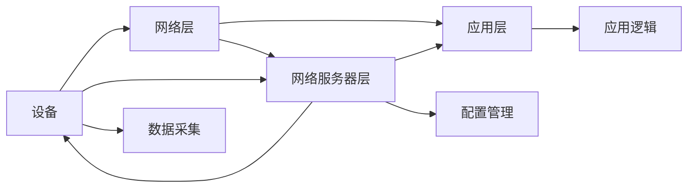

                 

# LoRaWAN：低功耗广域网络在IoT中的应用

> 关键词：LoRaWAN, 低功耗广域网络, Internet of Things (IoT), 物联网, 无线传感器网络, 数据传输, 安全与隐私保护, 智能城市

## 1. 背景介绍

随着物联网(IoT)技术的发展，越来越多的设备开始联网，数据传输成为提升IoT应用效率和效益的关键。然而，传统蜂窝网络在低功耗、广覆盖方面存在一定局限性，难以适应大量低功耗设备的需求。LoRaWAN（Long Range Wide Area Network）是一种基于LoRa（Long Range）无线通信技术的新型低功耗广域网络，能够在低功耗设备间进行长距离、远距离的数据传输。

LoRaWAN由LoRa联盟发起并推广，支持从几百米到几千米的距离，特别适用于环境监测、智能农业、工业控制、智慧城市等需要大规模部署低功耗设备的场景。LoRaWAN网络的构建基于分层架构，分为网络层、网络服务器层、应用层，各层之间通过协议实现互联互通。

LoRaWAN在保持低功耗特性的同时，具备良好的网络扩展性、高可靠性、数据传输速率较高等优点。相比传统蜂窝网络，LoRaWAN在覆盖范围、成本和功耗方面具备显著优势，使得其在IoT领域得到广泛应用。

## 2. 核心概念与联系

### 2.1 核心概念概述

为了更好地理解LoRaWAN在IoT中的应用，首先需要了解LoRaWAN的核心理念和关键技术。

- **LoRaWAN**：一种基于LoRa（Long Range）无线通信技术的网络协议，通过构建星型网络结构实现长距离、低功耗的设备数据传输。

- **网络层**：LoRaWAN架构的基础，负责在设备间建立网络连接，通过设备加入、离开、更新、数据传输等操作进行网络管理。

- **网络服务器层**：在网络层之上，负责与网络层交换信息，执行网络配置、设备管理、安全认证等任务。

- **应用层**：与具体业务需求结合，实现各种IoT应用功能，如环境监测、设备控制、数据管理等。

### 2.2 核心概念原理和架构的 Mermaid 流程图



此图展示了LoRaWAN架构的概览。设备通过网络层加入网络，网络层与网络服务器层交换信息，应用层提供具体应用服务。网络层和网络服务器层通过协议进行数据传输和网络管理，应用层根据需求执行具体业务逻辑。

## 3. 核心算法原理 & 具体操作步骤

### 3.1 算法原理概述

LoRaWAN的核心算法原理基于LoRa（Long Range）技术，通过调整信号调制参数实现远距离通信。LoRaWAN网络构建通过网络层、网络服务器层和应用层协同完成，主要算法原理包括：

1. **物理层（PHY）**：LoRaWAN的物理层使用扩频技术实现传输。通过调整信号带宽、功率和调制方式等参数，优化信号传播特性，增强信号的可靠性和穿透力。

2. **MAC层**：LoRaWAN的MAC（Medium Access Control）层采用CSMA/CA机制实现竞争接入和数据传输。通过动态调整传输窗口大小、重发机制等参数，提高网络吞吐量和公平性。

3. **网络层**：LoRaWAN的网络层支持多种路由协议，如星型网、Mesh网、StarMesh网等，通过构建网络拓扑，实现数据传输的路由和转发。

4. **安全与隐私保护**：LoRaWAN支持多种安全机制，如AES加密、认证密钥（SKY Key）、设备认证等，保障数据传输的安全性。

### 3.2 算法步骤详解

以下是LoRaWAN网络构建和操作的详细步骤：

**Step 1: 设备接入和配置**

- 设备通过LoRa模块加入网络，初始化设备参数，包括节点号、网络ID、广播地址等。
- 设备发送Join Request请求加入网络，并广播节点信息。
- 网络服务器层接收Join Request，验证节点合法性，并发送Join Accept响应，完成设备接入。

**Step 2: 网络管理和数据传输**

- 设备加入网络后，网络服务器层为其分配网络地址、子节点列表、父节点列表等配置信息。
- 网络层通过CSMA/CA机制管理设备间的通信，数据以广播或组播方式传输。
- 应用层根据具体业务需求，通过网络层和网络服务器层实现数据采集、控制、管理等功能。

**Step 3: 网络维护和优化**

- 网络服务器层定期监测网络状态，调整网络配置和参数，优化网络性能。
- 应用层根据业务需求和数据质量，实时调整传输频率和编码方式，提高数据传输效率。

### 3.3 算法优缺点

**优点**

1. **低功耗**：LoRaWAN的物理层设计使用窄带调制，支持低功耗设备间的数据传输。
2. **广覆盖**：LoRaWAN的传播距离可达几千米，特别适用于偏远地区和低网络密度场景。
3. **高可靠性**：LoRaWAN的网络层和应用层设计确保了数据传输的可靠性。
4. **数据速率较高**：LoRaWAN的网络服务器层和应用层支持多种数据速率，适应不同场景需求。

**缺点**

1. **带宽有限**：LoRaWAN物理层带宽窄，数据传输速率较低，可能不适合数据密集型应用。
2. **延迟较高**：LoRaWAN的网络层和应用层设计存在一定延迟，不适合对实时性要求较高的场景。
3. **安全性较低**：LoRaWAN的加密和认证机制相对简单，可能存在安全隐患。

### 3.4 算法应用领域

LoRaWAN适用于多种IoT应用场景，主要包括：

1. **环境监测**：LoRaWAN网络可以部署大量传感器节点，实时监测空气质量、水质、温度、湿度等环境参数，广泛应用于智能城市、工业监测等领域。
2. **农业**：LoRaWAN网络可以监测土壤湿度、温度、光照等农作参数，提升农业生产效率和农作物品质。
3. **工业控制**：LoRaWAN网络可以部署传感器节点，实时监控生产线状态、设备状态、物料流动等，优化工业生产流程。
4. **智能家居**：LoRaWAN网络可以连接各种智能设备，实现家居自动化控制和安防监控。
5. **智慧医疗**：LoRaWAN网络可以实时监测患者生命体征，保障医疗服务质量。

LoRaWAN的低功耗、广覆盖特性，使其在IoT领域具有广泛的应用前景。随着LoRaWAN技术的不断成熟，其在实际应用中的效果将更加明显。

## 4. 数学模型和公式 & 详细讲解

### 4.1 数学模型构建

LoRaWAN的网络层和应用层设计涉及多种数学模型和算法，以下以网络层和数据传输为例进行讲解。

### 4.2 公式推导过程

LoRaWAN网络层设计使用CSMA/CA机制进行数据传输。CSMA/CA机制通过以下公式计算传输窗口大小：

$$
w_{\text{min}} = 16 + \frac{4 \times E_{\text{ele}}}{B_{\text{min}}}
$$

其中 $w_{\text{min}}$ 表示最小传输窗口大小，$E_{\text{ele}}$ 表示能量消耗，$B_{\text{min}}$ 表示最小带宽。通过计算得到最小传输窗口大小，网络层可以动态调整传输窗口大小，优化网络性能。

### 4.3 案例分析与讲解

假设某LoRaWAN网络需要传输100字节的数据，网络层和应用层根据公式计算得到最小传输窗口大小为64，发送数据前需要等待的最小时间间隔为63us。根据网络层和应用层的设计，数据传输过程可以分为以下几个步骤：

1. 发送设备通过CSMA/CA机制随机选择传输时间，避免碰撞。
2. 设备发送包含数据长度、目的地地址、源地址等信息的Join Request请求。
3. 网络服务器层接收Join Request，验证设备合法性，并发送Join Accept响应。
4. 设备接收到Join Accept后，加入网络，开始数据传输。
5. 设备发送100字节数据，接收设备通过解码验证数据完整性。

## 5. 项目实践：代码实例和详细解释说明

### 5.1 开发环境搭建

LoRaWAN的开发环境需要LoRa模块和LoRaWAN网络服务器。以下是搭建开发环境的步骤：

1. 获取LoRa模块，连接PC和SIM卡。
2. 安装LoRaWAN网络服务器软件，并进行配置。
3. 连接设备到网络服务器，完成设备接入。

### 5.2 源代码详细实现

以下是一个简单的LoRaWAN网络开发示例代码，包括设备接入和数据传输：

```python
from lora import LoraNode

# 设备节点号
node_id = 0
# 网络ID
network_id = "your_network_id"
# 广播地址
broadcast_addr = "0x00000000"

# 创建LoRaNode对象
lora_node = LoraNode(node_id, network_id, broadcast_addr)

# 加入网络
lora_node.join()

# 数据传输
data = b"hello, world"
lora_node.send(data)

# 接收数据
received_data = lora_node.receive()
print(received_data)
```

### 5.3 代码解读与分析

LoRaWAN网络开发的核心在于LoRa模块和LoRaWAN网络服务器的配置和操作。代码中，LoRaNode对象表示一个LoRaWAN节点，包含设备节点号、网络ID、广播地址等信息。通过调用join()方法，设备可以加入LoRaWAN网络。发送数据时，调用send()方法，设备将数据发送到网络。接收数据时，调用receive()方法，设备接收网络发送的数据。

## 6. 实际应用场景

### 6.1 环境监测

LoRaWAN网络可以部署大量传感器节点，实时监测空气质量、水质、温度、湿度等环境参数，广泛应用于智能城市、工业监测等领域。通过LoRaWAN网络，环境监测设备可以实现数据实时上传，监测中心进行数据分析和预警。

### 6.2 农业

LoRaWAN网络可以监测土壤湿度、温度、光照等农作参数，提升农业生产效率和农作物品质。通过LoRaWAN网络，农业设备可以实现数据实时上传，农业专家进行数据分析和决策，优化农业生产过程。

### 6.3 工业控制

LoRaWAN网络可以部署传感器节点，实时监控生产线状态、设备状态、物料流动等，优化工业生产流程。通过LoRaWAN网络，工业设备可以实现数据实时上传，工业管理系统进行数据分析和调度，优化生产资源配置。

### 6.4 智能家居

LoRaWAN网络可以连接各种智能设备，实现家居自动化控制和安防监控。通过LoRaWAN网络，智能设备可以实现数据实时上传，智能家居系统进行数据分析和决策，提升家居生活品质和安全性。

### 6.5 智慧医疗

LoRaWAN网络可以实时监测患者生命体征，保障医疗服务质量。通过LoRaWAN网络，医疗设备可以实现数据实时上传，医疗管理系统进行数据分析和决策，优化医疗服务流程。

## 7. 工具和资源推荐

### 7.1 学习资源推荐

为了更好地学习和理解LoRaWAN技术，推荐以下学习资源：

1. LoRaWAN官方文档：LoRaWAN官方文档详细介绍了LoRaWAN网络协议和架构，是学习LoRaWAN技术的必备资料。
2. LoRaWAN教程：LoRaWAN社区提供的在线教程，涵盖了LoRaWAN开发环境的搭建和应用场景的实现，适合入门学习和实践。
3. 《LoRaWAN技术详解》书籍：该书详细介绍了LoRaWAN网络协议和应用场景，适合深入学习和研究。

### 7.2 开发工具推荐

LoRaWAN开发工具包括LoRa模块和LoRaWAN网络服务器。以下是推荐的工具：

1. LoRa模块：LoRa模块支持多种接口和协议，方便与LoRaWAN网络服务器连接。
2. LoRaWAN网络服务器：LoRaWAN网络服务器提供完整的LoRaWAN网络协议和应用功能，支持设备的接入和管理。

### 7.3 相关论文推荐

LoRaWAN技术的发展离不开学界的持续研究。以下是几篇相关论文，推荐阅读：

1. LoRaWAN: The World's First Long Range Low Power Wide Area Network for Internet of Things: 该论文介绍了LoRaWAN的架构和设计思想，奠定了LoRaWAN技术的基础。
2. LoRaWAN Networks: A Survey: 该论文对LoRaWAN技术进行了全面综述，包括网络协议、应用场景和未来发展方向。
3. LoRaWAN in Industry: 该论文介绍了LoRaWAN技术在工业领域的实际应用，展示了LoRaWAN技术的强大能力。

## 8. 总结：未来发展趋势与挑战

### 8.1 总结

LoRaWAN作为一种低功耗广域网络，具备广覆盖、低功耗、高可靠性等优点，在IoT领域具有广泛应用前景。LoRaWAN技术的发展需要依赖LoRa模块和LoRaWAN网络服务器的持续优化，以及LoRaWAN应用场景的不断拓展。

### 8.2 未来发展趋势

LoRaWAN技术的发展趋势包括以下几个方面：

1. **网络层优化**：随着网络规模的扩大，LoRaWAN网络层的优化需求日益凸显。未来LoRaWAN网络层将引入更多路由协议和网络优化算法，提升网络性能和可靠性。
2. **应用层创新**：LoRaWAN应用层的创新和扩展是LoRaWAN技术的重要发展方向。未来LoRaWAN应用层将结合云计算、人工智能等技术，提供更智能、更高效的数据分析和处理能力。
3. **安全性和隐私保护**：LoRaWAN技术在应用过程中需要面对更多安全性和隐私保护问题。未来LoRaWAN网络将引入更多加密和认证机制，保障数据传输的安全性和隐私性。

### 8.3 面临的挑战

LoRaWAN技术在发展过程中仍面临一些挑战：

1. **带宽和延迟问题**：LoRaWAN带宽有限、延迟较高，可能不适合数据密集型应用。如何提升LoRaWAN网络带宽和降低延迟，是未来需要解决的重要问题。
2. **标准化和兼容性问题**：LoRaWAN技术需要与其他IoT技术进行标准化和兼容，以实现更广泛的应用。如何推动LoRaWAN技术的标准化和兼容性，是未来的重要课题。
3. **功耗和设备成本问题**：LoRaWAN技术的低功耗特性是其优势之一，但如何进一步降低设备成本，使其更易大规模部署，也是未来的挑战。

### 8.4 研究展望

LoRaWAN技术的未来研究将集中在以下几个方面：

1. **网络层优化**：引入更多路由协议和网络优化算法，提升LoRaWAN网络的性能和可靠性。
2. **应用层创新**：结合云计算、人工智能等技术，提供更智能、更高效的数据分析和处理能力。
3. **安全性和隐私保护**：引入更多加密和认证机制，保障LoRaWAN网络的安全性和隐私性。
4. **标准化和兼容性**：推动LoRaWAN技术的标准化和兼容性，实现与其他IoT技术的互联互通。

LoRaWAN技术的不断发展，将进一步拓展IoT应用场景，推动IoT技术的规模化和应用化。未来，LoRaWAN技术将与其他IoT技术协同发力，共同构建更智能、更高效、更安全的IoT生态系统。

## 9. 附录：常见问题与解答

**Q1：LoRaWAN和LoRa有什么区别？**

A: LoRaWAN是一种基于LoRa无线通信技术的低功耗广域网络协议，而LoRa是一种物理层技术，主要应用于物联网领域。LoRaWAN使用LoRa技术作为其物理层，支持星型、Mesh型等多种网络拓扑，具备更强的网络扩展性和数据传输能力。

**Q2：LoRaWAN和蜂窝网络相比，有哪些优势？**

A: LoRaWAN相较于蜂窝网络，具有以下优势：
1. 低功耗：LoRaWAN支持低功耗设备间的数据传输，延长设备电池寿命。
2. 广覆盖：LoRaWAN的传播距离可达几千米，特别适用于偏远地区和低网络密度场景。
3. 数据速率较高：LoRaWAN的网络服务器层和应用层支持多种数据速率，适应不同场景需求。
4. 成本较低：LoRaWAN设备的生产成本较低，易于大规模部署。

**Q3：LoRaWAN的网络安全性如何保障？**

A: LoRaWAN的网络安全性保障主要通过以下方式实现：
1. 加密机制：LoRaWAN网络使用AES加密技术，保障数据传输的安全性。
2. 认证机制：LoRaWAN网络支持设备认证和认证密钥管理，确保设备的合法性。
3. 访问控制：LoRaWAN网络使用ACL（Access Control List）机制，限制设备的网络访问权限。

**Q4：LoRaWAN在实际应用中，如何解决网络延迟问题？**

A: LoRaWAN网络延迟较高，主要原因在于网络层和应用层的复杂性。为了解决网络延迟问题，可以采用以下方法：
1. 优化路由算法：优化LoRaWAN网络层中的路由算法，提高数据传输效率。
2. 增加数据缓存：在网络服务器层增加数据缓存，减少数据传输延迟。
3. 采用低功耗节点：使用低功耗节点，减少数据传输和处理过程的延迟。

**Q5：LoRaWAN在工业控制中的应用，需要注意哪些问题？**

A: LoRaWAN在工业控制中的应用，需要注意以下几个问题：
1. 数据精度：工业控制对数据精度要求较高，LoRaWAN网络需要提供高精度的传感器数据。
2. 数据实时性：工业控制对数据实时性要求较高，LoRaWAN网络需要保证数据的实时传输。
3. 设备可靠性：工业控制设备需要具备高可靠性，LoRaWAN网络需要提供可靠的设备和通信协议。

---

作者：禅与计算机程序设计艺术 / Zen and the Art of Computer Programming

