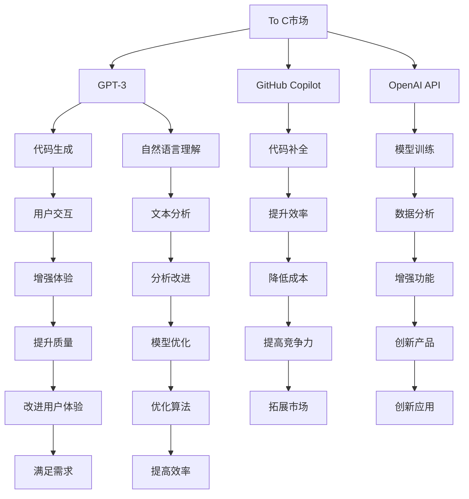

                 

# OpenAI的成功之道：贾扬清的分析，在To C和To B市场取得平衡

## 1. 背景介绍

OpenAI，作为全球最活跃的AI研究机构之一，近年来在人工智能领域取得了诸多突破，推动了AI技术从实验室走向市场，从科学研究进入商业应用。OpenAI的成功不仅依赖其出色的科研成果，更在于其商业模式上的精妙平衡：既能在To C市场通过开源平台吸引大量开发者，又能在To B市场通过企业服务盈利，构建了多方共赢的生态系统。本文将通过分析OpenAI的商业模式，探讨其如何在To C和To B市场取得平衡，以及未来可能的趋势和挑战。

## 2. 核心概念与联系

### 2.1 核心概念概述

为了理解OpenAI的成功之道，我们需要先了解以下几个关键概念：

- **To C市场**：指的是面向消费者（Consumer）的市场，即大众消费者可以直接使用、购买或访问的产品或服务。
- **To B市场**：指的是面向企业（Business）的市场，即企业客户会购买或订阅的商业解决方案。
- **OpenAI**：全称Open Artificial Intelligence, Inc.，是知名的AI研究机构，致力于推动人工智能技术的研究和应用。
- **GPT-3**：OpenAI开发的第三代通用语言模型，具备卓越的语言理解与生成能力。
- **GitHub Copilot**：OpenAI推出的代码生成工具，集成到GitHub中，显著提升代码开发效率。
- **API**：应用程序接口（Application Programming Interface），开发者通过API可访问OpenAI的服务和功能。

这些概念之间的逻辑关系可以通过以下Mermaid流程图来展示：



这个流程图展示了To C和To B市场如何通过OpenAI的产品和功能相互连接，形成了一个良性循环。

## 3. 核心算法原理 & 具体操作步骤

### 3.1 算法原理概述

OpenAI的成功在于其独特的商业策略和算法设计。其算法原理主要包括以下几个方面：

1. **预训练语言模型**：如GPT-3，通过大量无标签文本数据进行预训练，学习到丰富的语言知识和常识。
2. **微调技术**：将预训练模型进行微调，以适应特定任务的需求，如代码生成、文本摘要等。
3. **开源平台**：通过GitHub Copilot等工具，将语言模型直接开放给开发者使用，鼓励开发者创新。
4. **API接口**：通过OpenAI API，企业客户可以访问其强大的语言模型功能，提升工作效率。

### 3.2 算法步骤详解

OpenAI的算法步骤大致可以分为以下几个环节：

1. **数据收集**：收集大量的无标签文本数据，用于预训练模型。
2. **模型训练**：在预训练数据上进行自监督学习，学习到通用的语言表示。
3. **微调优化**：对预训练模型进行微调，以适应特定任务，如代码生成、文本摘要等。
4. **开源分享**：将模型封装成API或工具，如GitHub Copilot，开放给开发者使用。
5. **企业服务**：通过OpenAI API，企业客户可以访问其语言模型功能，提升工作效率。

### 3.3 算法优缺点

OpenAI算法的优点主要包括：

1. **高效性**：通过预训练和微调，模型可以快速适应新任务，提升开发效率。
2. **灵活性**：开源平台和API接口，使得开发者和企业都能方便地访问和使用其功能。
3. **可扩展性**：模型和工具可以通过进一步的优化和扩展，持续提升性能。

缺点则包括：

1. **数据依赖**：依赖大量无标签数据进行预训练，获取高质量数据的成本较高。
2. **技术门槛**：开发者和企业需要具备一定的技术基础，才能充分利用其功能。
3. **版权问题**：开源平台可能面临版权争议和侵权风险。

### 3.4 算法应用领域

OpenAI的算法主要应用于以下几个领域：

1. **自然语言处理**：如文本生成、文本摘要、翻译等。
2. **代码生成**：如GitHub Copilot，帮助开发者自动补全代码。
3. **语音识别**：如OpenAI语音API，实现语音到文本的转换。
4. **视觉理解**：如通过语言生成视觉内容，如OpenAI DALL-E。
5. **智能推荐**：如推荐系统中的内容生成和个性化推荐。

## 4. 数学模型和公式 & 详细讲解 & 举例说明

### 4.1 数学模型构建

OpenAI的核心算法主要基于深度学习中的语言模型，其数学模型构建如下：

设$X$为输入的文本序列，$Y$为输出序列，$F_{\theta}(X)$为预训练语言模型，$\theta$为模型参数。则其目标函数可以表示为：

$$
L = -\sum_{(x,y)} \log F_{\theta}(x) \cdot p(y|x)
$$

其中$p(y|x)$为给定输入$x$下，输出$y$的概率分布。

### 4.2 公式推导过程

在实际应用中，我们需要通过反向传播算法计算模型的梯度，从而更新参数$\theta$。具体过程如下：

1. 定义损失函数$L$。
2. 对模型$F_{\theta}(X)$进行前向传播，得到输出$y$。
3. 计算损失$L$。
4. 计算梯度$\nabla L$。
5. 使用优化算法（如Adam、SGD等）更新参数$\theta$。

### 4.3 案例分析与讲解

以代码生成为例，OpenAI通过预训练和微调，使模型能够理解编程语言的语法和语义，从而生成符合语法规则的代码片段。其案例分析如下：

1. 收集大量的编程代码数据，用于预训练模型。
2. 在预训练数据上进行微调，训练模型生成代码片段。
3. 将微调后的模型封装成API，开发者可以调用API进行代码生成。
4. 通过反馈机制，不断优化模型，提升生成代码的质量和准确性。

## 5. 项目实践：代码实例和详细解释说明

### 5.1 开发环境搭建

OpenAI的开源平台和API接口，使得开发者可以方便地进行项目实践。以下是开发环境搭建的步骤：

1. **安装Python**：确保Python 3.8及以上版本已安装。
2. **安装OpenAI库**：使用pip安装OpenAI库，包括openai和openai-py。
3. **获取API Key**：在OpenAI官网注册账号，获取API Key，用于调用API。

### 5.2 源代码详细实现

以下是一个简单的代码生成示例：

```python
from openai import OpenAI

openai = OpenAI(api_key='your_api_key')

response = openai.Completion.create(
    engine="text-davinci-003",
    prompt="Write a Python function to reverse a string",
    max_tokens=100,
    temperature=0.7
)

print(response.choices[0].text.strip())
```

这段代码通过OpenAI库，调用代码生成API，生成了一个反转字符串的Python函数。

### 5.3 代码解读与分析

- **OpenAI库**：提供了访问OpenAI API的功能。
- **Completion.create**：调用API生成代码片段。
- **engine**：指定使用哪个预训练模型，如text-davinci-003。
- **prompt**：输入的指令，即代码生成任务。
- **max_tokens**：生成代码的最大长度。
- **temperature**：生成代码的随机性，值越大越随机。

### 5.4 运行结果展示

运行上述代码，可以生成符合语法规则的Python代码，如：

```python
def reverse_string(s):
    return s[::-1]
```

## 6. 实际应用场景

### 6.1 智能客服系统

OpenAI的聊天机器人技术可以应用于智能客服系统，通过预训练语言模型和微调技术，实现自动化问答，提升客户服务体验。

### 6.2 金融舆情监测

OpenAI的情感分析技术可以应用于金融舆情监测，通过分析用户评论和社交媒体数据，实时掌握市场动态，预警风险。

### 6.3 个性化推荐系统

OpenAI的推荐系统可以应用于电商、视频等平台，通过预训练和微调，提升推荐准确性和个性化程度。

### 6.4 未来应用展望

未来，OpenAI的技术将在更多领域得到应用，如医疗、教育、交通等，构建智能生态系统，提升各行业的智能化水平。

## 7. 工具和资源推荐

### 7.1 学习资源推荐

为了掌握OpenAI的算法和应用，推荐以下学习资源：

1. **OpenAI官网**：提供最新研究和产品信息。
2. **GitHub Copilot文档**：详细介绍了GitHub Copilot的使用方法和API接口。
3. **《深度学习与人工智能》书籍**：介绍了深度学习的基本概念和OpenAI的算法。
4. **Coursera课程**：提供关于自然语言处理和机器学习的在线课程。
5. **Kaggle竞赛**：参与OpenAI相关的机器学习竞赛，提升实战经验。

### 7.2 开发工具推荐

OpenAI的算法和工具需要以下开发工具支持：

1. **Python**：编程语言，支持深度学习开发。
2. **PyTorch**：深度学习框架，支持模型的训练和推理。
3. **TensorFlow**：另一种深度学习框架，支持模型部署和优化。
4. **Jupyter Notebook**：用于编写和调试代码。
5. **GitHub**：代码托管平台，方便开发者协作。

### 7.3 相关论文推荐

以下是几篇OpenAI的相关论文，推荐阅读：

1. "GPT-3: Language Models are Unsupervised Multitask Learners"（论文链接：https://arxiv.org/abs/1910.13461）。
2. "OpenAI Codex: A Scalable Pre-trained Model for Programming"（论文链接：https://arxiv.org/abs/2110.14795）。
3. "A Spiking Approach to General-Purpose Programming"（论文链接：https://arxiv.org/abs/2002.01272）。
4. "Learning to Execute"（论文链接：https://arxiv.org/abs/1804.02355）。

## 8. 总结：未来发展趋势与挑战

### 8.1 研究成果总结

OpenAI在预训练语言模型和微调技术方面的研究，推动了AI技术从理论走向应用，从科研走向商业。其To C和To B市场的成功，为其他AI公司提供了可借鉴的商业模型。

### 8.2 未来发展趋势

1. **跨模态学习**：将图像、视频等多模态数据与语言数据结合，提升模型的通用性和灵活性。
2. **联邦学习**：通过分布式计算，提升模型的隐私保护和数据安全。
3. **可解释性**：提升模型的可解释性，增强透明度和可信度。
4. **伦理审查**：加强模型伦理审查，确保模型的公平性和安全性。

### 8.3 面临的挑战

1. **数据隐私**：用户数据的隐私保护是一个重要问题。
2. **模型可解释性**：黑盒模型的可解释性问题亟需解决。
3. **计算资源**：大规模模型的训练和推理需要大量计算资源。
4. **应用落地**：如何将AI技术更好地应用于实际业务场景。

### 8.4 研究展望

未来，OpenAI将继续在预训练语言模型和微调技术方面进行深入研究，推动AI技术在更多领域的应用。同时，将注重解决数据隐私和模型可解释性等问题，构建更加公平、透明、可信的AI生态系统。

## 9. 附录：常见问题与解答

**Q1：OpenAI的成功之道是什么？**

A: OpenAI的成功在于其独特的商业策略和算法设计。通过开源平台和API接口，吸引大量开发者和企业客户，同时通过预训练和微调技术，快速适应新任务，提升开发效率。

**Q2：如何使用OpenAI的API进行代码生成？**

A: 通过OpenAI的API，调用代码生成功能，输入指令和参数，生成符合语法规则的代码片段。具体步骤如下：

1. 获取OpenAI的API Key。
2. 安装OpenAI库和PyTorch库。
3. 使用OpenAI库调用API，生成代码片段。
4. 调试和优化生成的代码。

**Q3：OpenAI的算法优缺点是什么？**

A: OpenAI算法的优点包括高效性、灵活性和可扩展性。缺点则包括数据依赖、技术门槛和版权问题。

**Q4：OpenAI的未来发展趋势和挑战是什么？**

A: 未来，OpenAI将推动跨模态学习、联邦学习和模型可解释性等技术的发展。面临的主要挑战包括数据隐私、模型可解释性和计算资源等。

---

作者：禅与计算机程序设计艺术 / Zen and the Art of Computer Programming

