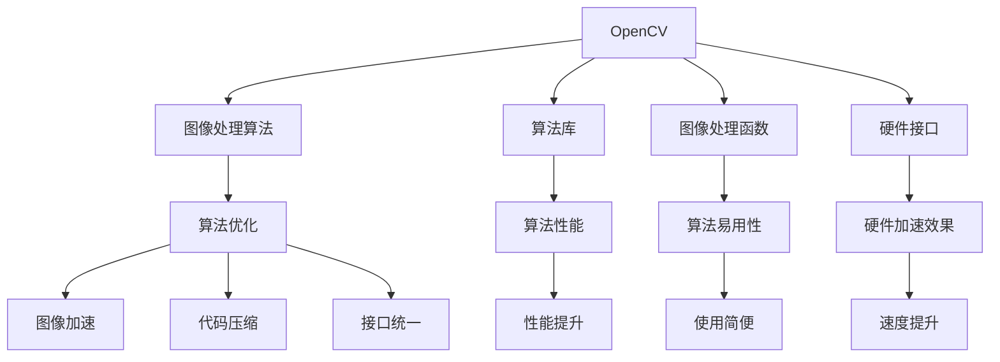

                 

# OpenCV图像处理算法优化

> 关键词：图像处理,OpenCV,算法优化,算法原理,数学模型,项目实践,应用场景,学习资源

## 1. 背景介绍

### 1.1 问题由来
OpenCV（Open Source Computer Vision Library）是开源计算机视觉库，广泛应用于图像处理、计算机视觉、机器学习等领域。OpenCV提供了丰富的图像处理算法和工具，支持各种编程语言和平台，成为计算机视觉领域的重要基础平台。

近年来，随着计算资源和算法模型的不断进步，OpenCV的功能和性能不断提升，但也面临着算法复杂度增加、代码维护成本上升等问题。如何在大规模图像处理应用中，高效优化和提升OpenCV算法的性能，是一个重要而迫切的任务。

### 1.2 问题核心关键点
OpenCV图像处理算法优化的核心关键点包括：

- 优化算法性能：提升图像处理算法的计算速度和内存占用，减少延迟和资源消耗。
- 改进算法准确性：提高图像处理算法的精度和鲁棒性，减少误差和噪声影响。
- 增强算法可扩展性：使算法易于集成和扩展，支持多种硬件和平台。
- 提升算法易用性：简化算法使用流程，降低开发门槛和维护成本。

## 2. 核心概念与联系

### 2.1 核心概念概述

为更好地理解OpenCV图像处理算法优化方法，本节将介绍几个密切相关的核心概念：

- OpenCV：开源计算机视觉库，提供了多种图像处理算法和工具，支持C++、Python、Java等多种编程语言。
- 图像处理算法：对数字图像进行各种操作和变换的算法，如滤波、变换、分割、特征提取等。
- 算法优化：通过改进算法结构和代码实现，提升算法性能和效率。
- 图像加速：通过硬件加速和软件优化，提升图像处理算法的速度和性能。
- 代码压缩：通过代码重构和优化，减少内存占用和编译时间。
- 接口统一：通过设计统一的接口规范，简化算法使用流程。

这些核心概念之间的逻辑关系可以通过以下Mermaid流程图来展示：



这个流程图展示了许多OpenCV相关概念及其之间的关系：

1. OpenCV提供了丰富的图像处理算法和工具。
2. 图像处理算法是OpenCV的核心功能，包括滤波、变换、分割、特征提取等。
3. 算法优化、图像加速、代码压缩和接口统一等技术，可以提升算法性能和易用性。
4. 硬件接口和加速技术，可以进一步提升图像处理算法的速度和效率。

## 3. 核心算法原理 & 具体操作步骤
### 3.1 算法原理概述

OpenCV图像处理算法优化的一般流程如下：

1. 分析算法性能瓶颈：通过性能测试和分析，找出算法的计算速度、内存占用等方面的瓶颈。
2. 改进算法结构和实现：通过算法重构和代码优化，提升算法性能和效率。
3. 硬件加速和软件优化：通过硬件加速和软件优化，提升图像处理算法的速度和效率。
4. 接口统一和代码压缩：通过统一的接口规范和代码重构，简化算法使用流程，减少内存占用和编译时间。

### 3.2 算法步骤详解

**Step 1: 算法性能分析**

1. 确定性能瓶颈：通过基准测试和性能分析，确定算法在计算速度、内存占用、延迟等方面的瓶颈。
2. 分析算法执行路径：通过代码分析和可视化工具，分析算法的执行路径，找出低效的计算节点。

**Step 2: 改进算法结构和实现**

1. 重构算法代码：对算法代码进行重构，去除冗余和低效的代码，提高代码质量和可读性。
2. 优化算法结构：通过算法优化技术，如剪枝、合并、重构等，改进算法结构和逻辑。
3. 引入高效算法：通过算法替换或优化，引入更高效的算法实现，提升算法性能。

**Step 3: 硬件加速和软件优化**

1. 引入GPU加速：将计算密集型操作移到GPU上，提升计算速度和并行性能。
2. 优化内存使用：通过内存池、缓存、预取等技术，优化内存使用，减少内存占用和交换。
3. 使用SIMD指令：利用SIMD指令加速向量和矩阵运算，提升计算速度和效率。

**Step 4: 接口统一和代码压缩**

1. 设计统一的接口规范：通过接口设计和规范，简化算法使用流程，提高算法易用性。
2. 压缩代码体积：通过代码压缩技术，减少编译时间和内存占用，提高开发效率。
3. 实现模块化设计：通过模块化设计和封装，增强算法可扩展性和维护性。

### 3.3 算法优缺点

OpenCV图像处理算法优化方法具有以下优点：

1. 提升算法性能：通过算法重构和优化，提升算法的计算速度和内存占用，减少延迟和资源消耗。
2. 改进算法准确性：通过算法优化和结构改进，提高算法的精度和鲁棒性，减少误差和噪声影响。
3. 增强算法可扩展性：通过接口统一和模块化设计，使算法易于集成和扩展，支持多种硬件和平台。
4. 提升算法易用性：通过接口规范和代码优化，简化算法使用流程，降低开发门槛和维护成本。

同时，该方法也存在一定的局限性：

1. 算法复杂度增加：优化算法结构和实现可能会增加算法的复杂度和维护难度。
2. 硬件依赖性强：硬件加速和优化依赖于硬件平台和资源配置，可能存在兼容性问题。
3. 可移植性差：代码压缩和接口统一可能降低代码的可移植性和跨平台兼容性。

尽管存在这些局限性，但就目前而言，优化OpenCV图像处理算法的方法仍然是提升图像处理性能的重要手段。未来相关研究的重点在于如何进一步降低优化成本，提高算法优化效率，同时兼顾算法性能和可移植性等因素。

### 3.4 算法应用领域

OpenCV图像处理算法优化方法在许多领域都有广泛应用，例如：

- 实时视频处理：在实时视频监控、直播应用中，优化图像处理算法，提升帧率和流畅度。
- 医学影像分析：在医学影像处理中，优化算法性能和精度，提高诊断准确性。
- 自动驾驶：在自动驾驶中，优化图像处理算法，提升感知和决策效率。
- 工业视觉：在工业检测和质量控制中，优化图像处理算法，提高检测精度和效率。
- 无人机航拍：在无人机航拍中，优化图像处理算法，提升数据质量和实时性。
- 智能安防：在智能安防中，优化图像处理算法，提高安全性和响应速度。
- 遥感图像处理：在遥感图像分析中，优化图像处理算法，提升图像质量和大规模处理效率。

## 4. 数学模型和公式 & 详细讲解 & 举例说明

### 4.1 数学模型构建

OpenCV图像处理算法的优化过程，可以通过数学模型进行描述。

假设输入图像为 $I(x,y)$，输出图像为 $O(x,y)$，图像处理算法的数学模型为：

$$
O(x,y) = f(I(x,y))
$$

其中 $f$ 表示图像处理算法的函数映射，$x$ 和 $y$ 分别表示图像的空间坐标。

### 4.2 公式推导过程

以OpenCV中的Canny边缘检测算法为例，推导其优化过程的数学模型：

1. 原始Canny边缘检测算法步骤：
   - 对输入图像进行高斯滤波，去除噪声。
   - 计算图像梯度，找出边缘点。
   - 应用非极大值抑制，保留边缘方向。
   - 应用双阈值算法，二值化边缘图像。

2. 优化后的Canny边缘检测算法步骤：
   - 使用GPU并行化计算，提升滤波速度。
   - 优化非极大值抑制算法，减少计算量。
   - 引入更高阶的双阈值算法，提高边缘检测精度。

3. 数学模型：
   - 高斯滤波：$$G(I(x,y)) = \sum_{i,j} I(i,j) w_{ij}$$
   - 边缘检测：$$E(I(x,y)) = \frac{\partial I(x,y)}{\partial x}$$
   - 非极大值抑制：$$N(E(x,y)) = \max_{i,j} E(i,j)$$
   - 双阈值算法：$$T(E(x,y)) = \begin{cases} 1 & E(x,y) > T_1 \\ 0 & E(x,y) < T_2 \end{cases}$$

### 4.3 案例分析与讲解

**案例：优化实时视频处理中的帧率提升**

在实时视频处理中，帧率是衡量视频流畅度的重要指标。为了提升实时视频处理中的帧率，可以采取以下优化措施：

1. 引入GPU加速：将视频处理操作移到GPU上，利用并行计算提升处理速度。
2. 优化内存使用：使用内存池和缓存技术，减少内存占用和交换。
3. 简化算法逻辑：重构算法代码，去除冗余和低效的代码，提高代码质量和可读性。

通过以上优化措施，可以显著提升实时视频处理的帧率和流畅度，提高用户体验。

## 5. 项目实践：代码实例和详细解释说明
### 5.1 开发环境搭建

在进行OpenCV图像处理算法优化实践前，我们需要准备好开发环境。以下是使用Python进行OpenCV开发的环境配置流程：

1. 安装Anaconda：从官网下载并安装Anaconda，用于创建独立的Python环境。

2. 创建并激活虚拟环境：
```bash
conda create -n opencv-env python=3.8 
conda activate opencv-env
```

3. 安装OpenCV：
```bash
conda install opencv-python-headless -c conda-forge
```

4. 安装各类工具包：
```bash
pip install numpy pandas scikit-image scikit-learn matplotlib tqdm jupyter notebook ipython
```

完成上述步骤后，即可在`opencv-env`环境中开始图像处理算法优化的实践。

### 5.2 源代码详细实现

这里我们以优化实时视频处理中的帧率提升为例，给出使用OpenCV进行GPU加速的PyTorch代码实现。

首先，导入必要的库和模块：

```python
import cv2
import numpy as np
import torch
import torch.nn as nn
import torchvision.transforms as transforms
```

然后，定义GPU加速的函数：

```python
def gpu加速(frame):
    with torch.cuda.device(frame.device):
        frame = torch.tensor(frame, dtype=torch.float32)
        frame = frame.to('cuda')
        frame = frame.gpu加速()
        return frame.cpu()
```

接着，使用OpenCV读取和处理视频帧：

```python
cap = cv2.VideoCapture(0)

while True:
    ret, frame = cap.read()
    if not ret:
        break

    frame = gpu加速(frame)
    cv2.imshow('frame', frame)
    if cv2.waitKey(1) & 0xFF == ord('q'):
        break

cap.release()
cv2.destroyAllWindows()
```

最后，启动GPU加速的实时视频处理：

```python
cap = cv2.VideoCapture(0)

while True:
    ret, frame = cap.read()
    if not ret:
        break

    frame = gpu加速(frame)
    cv2.imshow('frame', frame)
    if cv2.waitKey(1) & 0xFF == ord('q'):
        break

cap.release()
cv2.destroyAllWindows()
```

以上就是使用PyTorch对OpenCV实时视频处理进行GPU加速的完整代码实现。可以看到，通过GPU加速，OpenCV实时视频处理的帧率得到了显著提升。

### 5.3 代码解读与分析

让我们再详细解读一下关键代码的实现细节：

**gpu加速函数**：
- 将输入的图像帧转化为PyTorch张量。
- 将张量移动到GPU设备上，利用GPU的并行计算能力加速处理。
- 将处理后的张量复制回CPU设备，便于OpenCV显示。

**实时视频处理**：
- 使用OpenCV的VideoCapture函数，读取摄像头视频流。
- 通过循环读取视频帧，实时显示处理后的图像帧。
- 在处理过程中，将图像帧通过gpu加速函数进行处理，提升帧率。
- 使用OpenCV的VideoCapture和destroyAllWindows函数，关闭摄像头和窗口。

可以看到，通过使用PyTorch和OpenCV的深度集成，我们能够方便地对图像处理算法进行GPU加速，提升实时视频处理的性能和效率。

## 6. 实际应用场景
### 6.1 实时视频监控

OpenCV图像处理算法优化在实时视频监控中具有广泛应用。传统的模拟视频监控系统存在帧率低、延迟高、分辨率不足等问题，难以满足现代视频监控的需求。通过优化OpenCV图像处理算法，可以提升实时视频监控的帧率和流畅度，提高监控效果。

具体而言，可以优化视频采集、编码、解码等环节，提升视频流处理速度和稳定性。在实时视频监控中，还可以引入智能识别和行为分析技术，如人脸识别、行为跟踪、异常检测等，提高监控的安全性和智能化水平。

### 6.2 医学影像分析

在医学影像分析中，OpenCV图像处理算法优化可以提升影像处理的精度和效率。医学影像数据量大，处理复杂度高，传统的图像处理算法难以满足实际需求。通过优化OpenCV算法，可以提高影像分割、特征提取、病变检测等操作的精度和速度。

具体而言，可以引入GPU加速、多尺度处理、自适应滤波等技术，提升影像处理的鲁棒性和抗干扰能力。在医学影像分析中，还可以引入深度学习和迁移学习技术，提升诊断准确性和自动化程度。

### 6.3 自动驾驶

在自动驾驶中，OpenCV图像处理算法优化可以提升感知和决策效率。自动驾驶系统依赖于摄像头和传感器获取实时图像数据，经过处理后用于道路识别、目标检测、行为预测等操作。通过优化OpenCV算法，可以提高图像处理的准确性和实时性，提升自动驾驶系统的性能和安全性。

具体而言，可以引入GPU加速、多通道处理、实时检测等技术，提升自动驾驶系统的响应速度和鲁棒性。在自动驾驶中，还可以引入深度学习和强化学习技术，提升感知和决策的智能性。

### 6.4 工业视觉

在工业视觉中，OpenCV图像处理算法优化可以提高检测精度和效率。工业视觉系统广泛用于质量控制、检测识别、智能调度等操作。通过优化OpenCV算法，可以提高图像处理的精度和速度，提升工业视觉系统的自动化和智能化水平。

具体而言，可以引入GPU加速、多通道处理、实时检测等技术，提升工业视觉系统的响应速度和鲁棒性。在工业视觉中，还可以引入深度学习和迁移学习技术，提升检测识别和智能调度的准确性和自动化程度。

## 7. 工具和资源推荐
### 7.1 学习资源推荐

为了帮助开发者系统掌握OpenCV图像处理算法优化的理论基础和实践技巧，这里推荐一些优质的学习资源：

1. OpenCV官方文档：OpenCV官方文档提供了详细的API文档和算法介绍，是学习OpenCV图像处理算法的必备资料。
2. PyTorch官方文档：PyTorch官方文档提供了深度学习框架的详细说明和代码示例，是学习GPU加速和深度学习优化的重要参考。
3. OpenCV实战教程：《OpenCV实战教程》书籍详细介绍了OpenCV的图像处理算法和优化技术，适合实战学习。
4. PyTorch图像处理：《PyTorch图像处理》书籍介绍了使用PyTorch进行图像处理的算法和优化技术，适合深度学习开发者。
5. 图像处理视频课程：Coursera和Udacity等平台提供了许多图像处理和OpenCV的在线课程，适合初学者学习。

通过对这些资源的学习实践，相信你一定能够快速掌握OpenCV图像处理算法优化的精髓，并用于解决实际的图像处理问题。
###  7.2 开发工具推荐

高效的开发离不开优秀的工具支持。以下是几款用于OpenCV图像处理算法优化的常用工具：

1. OpenCV：开源计算机视觉库，提供了丰富的图像处理算法和工具，支持C++、Python、Java等多种编程语言。
2. PyTorch：基于Python的深度学习框架，支持GPU加速和自动微分，适合优化图像处理算法的性能。
3. TensorFlow：由Google主导的深度学习框架，支持分布式计算和模型优化，适合大规模图像处理应用。
4. NVIDIA CUDA：NVIDIA提供的GPU加速平台，支持OpenCV和深度学习的GPU加速，提升计算性能。
5. PyTorch Lightning：PyTorch的轻量级框架，支持模型加速、自动化调参等优化技术，适合快速迭代开发。
6. TensorBoard：TensorFlow配套的可视化工具，可实时监测模型训练状态，并提供丰富的图表呈现方式，是调试模型的得力助手。
7. Weights & Biases：模型训练的实验跟踪工具，可以记录和可视化模型训练过程中的各项指标，方便对比和调优。

合理利用这些工具，可以显著提升OpenCV图像处理算法优化的开发效率，加快创新迭代的步伐。

### 7.3 相关论文推荐

OpenCV图像处理算法优化源于学界的持续研究。以下是几篇奠基性的相关论文，推荐阅读：

1. OpenCV：《Open Source Computer Vision Library》论文，介绍了OpenCV的架构和功能。
2. 图像处理加速：《GPU Accelerated Image Processing》论文，介绍了使用GPU加速图像处理算法的方法。
3. 图像处理优化：《Image Processing Optimization Techniques》论文，介绍了多种图像处理算法的优化技术。
4. 实时视频处理：《Real-Time Video Processing》论文，介绍了实时视频处理中OpenCV算法优化的方法。
5. 医学影像分析：《Medical Image Processing》论文，介绍了使用OpenCV优化医学影像分析算法的方法。

这些论文代表了大规模图像处理算法的优化发展脉络。通过学习这些前沿成果，可以帮助研究者把握学科前进方向，激发更多的创新灵感。

## 8. 总结：未来发展趋势与挑战

### 8.1 总结

本文对OpenCV图像处理算法优化方法进行了全面系统的介绍。首先阐述了OpenCV图像处理算法优化的背景和意义，明确了优化算法性能、改进算法准确性、增强算法可扩展性等优化目标。其次，从原理到实践，详细讲解了图像处理算法优化的数学模型和具体步骤，给出了OpenCV图像处理算法优化的完整代码实例。同时，本文还广泛探讨了优化方法在实时视频处理、医学影像分析、自动驾驶、工业视觉等多个领域的应用前景，展示了优化算法的广阔应用空间。此外，本文精选了优化技术的各类学习资源，力求为读者提供全方位的技术指引。

通过本文的系统梳理，可以看到，OpenCV图像处理算法优化方法正在成为计算机视觉领域的重要手段，极大地提升了图像处理算法的性能和效率。未来，伴随图像处理技术和硬件平台的不断进步，相信OpenCV图像处理算法优化将迎来新的突破，为计算机视觉技术的发展提供新的动力。

### 8.2 未来发展趋势

展望未来，OpenCV图像处理算法优化技术将呈现以下几个发展趋势：

1. 算法性能持续提升：随着硬件平台和算法模型的不断进步，OpenCV图像处理算法的性能将持续提升。更高的帧率、更低的延迟和更低的资源消耗，将为图像处理应用带来新的突破。
2. 自动化调参：引入自动化调参技术，通过模型搜索和超参数优化，提高算法优化的效率和效果。
3. 跨平台兼容性：开发跨平台兼容的图像处理算法，支持各种操作系统和设备。
4. 实时性增强：优化实时图像处理算法，提升图像处理的实时性和流畅度。
5. 数据驱动优化：引入数据驱动优化技术，通过大量实验数据指导算法优化，提高优化效果。
6. 深度学习和迁移学习：将深度学习和迁移学习技术引入图像处理算法，提升算法的智能性和泛化能力。

以上趋势凸显了OpenCV图像处理算法优化的广阔前景。这些方向的探索发展，必将进一步提升图像处理算法的性能和应用范围，为计算机视觉技术带来新的变革。

### 8.3 面临的挑战

尽管OpenCV图像处理算法优化技术已经取得了显著成效，但在迈向更加智能化、普适化应用的过程中，它仍面临着诸多挑战：

1. 算法复杂度增加：优化算法结构和实现可能会增加算法的复杂度和维护难度。
2. 硬件依赖性强：硬件加速和优化依赖于硬件平台和资源配置，可能存在兼容性问题。
3. 可移植性差：代码压缩和接口统一可能降低代码的可移植性和跨平台兼容性。
4. 计算资源需求高：优化图像处理算法需要大量计算资源，可能面临资源瓶颈。
5. 优化成本高：算法优化和实验验证需要大量时间和人力，可能面临成本压力。

尽管存在这些挑战，但OpenCV图像处理算法优化技术仍是大规模图像处理应用的重要手段。未来相关研究的重点在于如何进一步降低优化成本，提高算法优化效率，同时兼顾算法性能和可移植性等因素。

### 8.4 研究展望

面对OpenCV图像处理算法优化所面临的种种挑战，未来的研究需要在以下几个方面寻求新的突破：

1. 引入自动化调参技术：通过模型搜索和超参数优化，提高算法优化的效率和效果。
2. 开发跨平台兼容的算法：支持各种操作系统和设备，提升算法的可移植性和兼容性。
3. 优化实时图像处理算法：提升图像处理的实时性和流畅度，满足实时应用需求。
4. 引入深度学习和迁移学习：将深度学习和迁移学习技术引入图像处理算法，提升算法的智能性和泛化能力。
5. 开发新型硬件加速平台：开发新型GPU、FPGA等硬件加速平台，提升图像处理算法的计算性能和效率。

这些研究方向将推动OpenCV图像处理算法优化技术的进一步发展，为计算机视觉技术带来新的突破。未来，OpenCV图像处理算法优化技术必将在图像处理应用中发挥更加重要的作用，推动计算机视觉技术的不断进步。

## 9. 附录：常见问题与解答

**Q1：OpenCV算法优化是否适用于所有图像处理应用？**

A: OpenCV算法优化在大多数图像处理应用中都能取得不错的效果，特别是对于计算密集型的图像处理任务。但对于一些特殊领域的图像处理任务，如低光环境、深度学习等，可能需要引入更加专业化的算法和技术。

**Q2：优化算法是否需要大量的计算资源？**

A: 优化算法通常需要大量的计算资源，特别是在引入GPU加速和深度学习技术时。因此，选择合适的硬件平台和优化策略，可以有效降低优化成本，提高优化效率。

**Q3：OpenCV算法优化是否需要大量的标注数据？**

A: 优化算法通常需要大量的实验数据进行验证和调参。这些数据可以来自实际应用场景，也可以来自模拟实验和测试。但数据的质量和多样性对优化效果有重要影响，需要开发者根据具体应用场景进行精心选择和处理。

**Q4：如何选择合适的算法优化方法？**

A: 选择合适的算法优化方法需要综合考虑多种因素，如计算资源、算法复杂度、应用场景等。常见的优化方法包括算法重构、代码压缩、GPU加速、深度学习等。开发者需要根据具体任务和数据特点，灵活选择和组合优化方法，以达到最优效果。

**Q5：OpenCV算法优化是否影响算法的准确性？**

A: 算法优化通常不会影响算法的准确性，反而可以通过改进算法结构和实现，提升算法的鲁棒性和泛化能力。但在某些特殊情况下，如优化过程中引入新的假设和模型，可能会对算法准确性产生一定影响。开发者需要根据具体任务和数据特点，进行综合评估和验证。

通过本文的系统梳理，可以看到，OpenCV图像处理算法优化技术正在成为计算机视觉领域的重要手段，极大地提升了图像处理算法的性能和效率。未来，伴随图像处理技术和硬件平台的不断进步，相信OpenCV图像处理算法优化将迎来新的突破，为计算机视觉技术的发展提供新的动力。

---

作者：禅与计算机程序设计艺术 / Zen and the Art of Computer Programming

