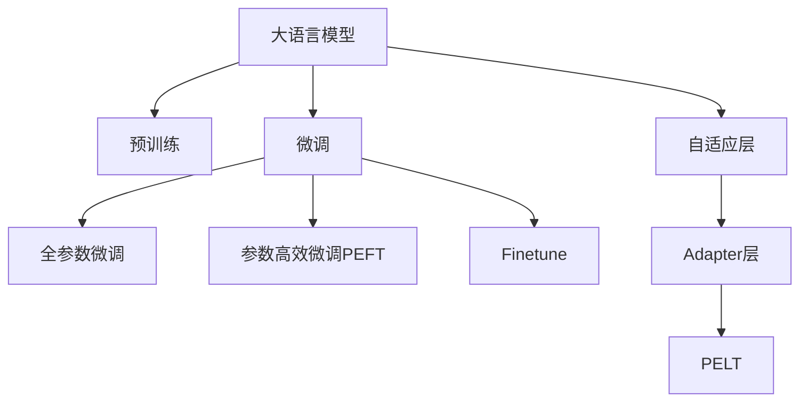

                 

# PEFT技术：高效微调大型语言模型

> 关键词：大型语言模型,微调(PEFT),参数高效微调,自适应层,Adapter,PELT,Finetune

## 1. 背景介绍

随着深度学习技术的快速发展，大规模语言模型在自然语言处理(Natural Language Processing, NLP)领域取得了巨大的突破。这些模型通过在海量无标签文本数据上进行预训练，学习到了丰富的语言知识和常识，可以通过少量的有标签样本在下游任务上进行微调，获得优异的性能。然而，由于预训练模型通常含有亿级别的参数，微调过程会占用大量的计算资源和时间，使得模型的部署和应用成本较高。

为解决这一问题，参数高效微调(Parameter-Efficient Fine-Tuning, PEFT)技术应运而生。PEFT技术旨在利用大模型的知识表示，通过只更新少量模型参数，实现高效、快速的微调过程，最大化利用预训练模型的能力。本文将详细介绍PEFT技术的基本原理、具体操作步骤和应用场景，以期为基于大语言模型的微调实践提供新的思路。

## 2. 核心概念与联系

### 2.1 核心概念概述

为更好地理解PEFT技术，我们需要介绍几个密切相关的核心概念：

- 大语言模型(Large Language Model, LLM)：以自回归(如GPT)或自编码(如BERT)模型为代表的大规模预训练语言模型。通过在大规模无标签文本语料上进行预训练，学习到了通用的语言表示，具备强大的语言理解和生成能力。

- 预训练(Pre-training)：指在大规模无标签文本语料上，通过自监督学习任务训练通用语言模型的过程。常见的预训练任务包括言语建模、遮挡语言模型等。

- 微调(Fine-tuning)：指在预训练模型的基础上，使用下游任务的少量标注数据，通过有监督地训练优化模型在特定任务上的性能。通常只需调整顶层分类器或解码器，并以较小的学习率更新全部或部分的模型参数。

- 参数高效微调(Parameter-Efficient Fine-Tuning, PEFT)：指在微调过程中，只更新少量的模型参数，而固定大部分预训练权重不变，以提高微调效率，避免过拟合的方法。

- 自适应层(Adaptive Layer)：PEFT技术中常用的微调组件，通常位于预训练模型的顶层，根据下游任务需求进行特定参数的微调。

- Adapter层：一种参数高效的微调组件，通过在模型中间插入小规模的参数层，实现部分参数的微调，同时保持模型整体结构不变。

- PELT(Prompt Engineering for Language Tasks)：一种利用输入文本格式引导模型输出的微调技术，通过精心设计的输入文本提示，减少微调参数。

- Finetune(微调)：更广泛地指代使用下游任务数据优化模型性能的过程。PEFT是微调的一个子集，着重于参数高效的微调。

这些核心概念之间的逻辑关系可以通过以下Mermaid流程图来展示：



这个流程图展示了大语言模型的核心概念及其之间的关系：

1. 大语言模型通过预训练获得基础能力。
2. 微调是对预训练模型进行任务特定的优化，可以分为全参数微调和参数高效微调（PEFT）。
3. 自适应层和Adapter层是PEFT中的关键微调组件。
4. PELT是一种基于输入提示的微调技术。
5. Finetune是PEFT的应用场景之一。

这些概念共同构成了PEFT技术的理论基础，为其高效、灵活的微调实践提供了有力的支持。

## 3. 核心算法原理 & 具体操作步骤
### 3.1 算法原理概述

PEFT技术的基本思想是利用预训练模型的大规模语言知识，通过只更新少量模型参数，实现对下游任务的快速适配。PEFT与传统全参数微调的区别在于，PEFT通常只更新顶层部分参数，而保持预训练权重不变，从而减少计算资源消耗，同时避免过拟合。

假设预训练语言模型为 $M_{\theta}$，其中 $\theta$ 为预训练得到的模型参数。给定下游任务 $T$ 的标注数据集 $D=\{(x_i, y_i)\}_{i=1}^N$，PEFT的目标是找到新的模型参数 $\hat{\theta}$，使得：

$$
\hat{\theta}=\mathop{\arg\min}_{\theta} \mathcal{L}(M_{\theta},D)
$$

其中 $\mathcal{L}$ 为针对任务 $T$ 设计的损失函数，用于衡量模型预测输出与真实标签之间的差异。常见的损失函数包括交叉熵损失、均方误差损失等。

在PEFT中，一般选择自适应层或Adapter层进行微调，以实现高效、灵活的微调过程。自适应层位于预训练模型的顶层，通过微调该层的参数，适配下游任务；Adapter层插入在模型的中间层，通过微调部分中间层的参数，实现参数共享，减少整体微调参数量。

### 3.2 算法步骤详解

PEFT的微调步骤包括以下关键步骤：

**Step 1: 准备预训练模型和数据集**
- 选择合适的预训练语言模型 $M_{\theta}$ 作为初始化参数，如 BERT、GPT 等。
- 准备下游任务 $T$ 的标注数据集 $D$，划分为训练集、验证集和测试集。一般要求标注数据与预训练数据的分布不要差异过大。

**Step 2: 选择微调组件**
- 根据任务类型，选择自适应层或Adapter层进行微调。
- 对于分类任务，通常在顶层添加线性分类器和交叉熵损失函数。
- 对于生成任务，通常使用语言模型的解码器输出概率分布，并以负对数似然为损失函数。

**Step 3: 设置微调超参数**
- 选择合适的优化算法及其参数，如 AdamW、SGD 等，设置学习率、批大小、迭代轮数等。
- 设置正则化技术及强度，包括权重衰减、Dropout、Early Stopping等。
- 确定冻结预训练参数的策略，如仅微调顶层，或全部参数都参与微调。

**Step 4: 执行梯度训练**
- 将训练集数据分批次输入模型，前向传播计算损失函数。
- 反向传播计算参数梯度，根据设定的优化算法和学习率更新模型参数。
- 周期性在验证集上评估模型性能，根据性能指标决定是否触发 Early Stopping。
- 重复上述步骤直到满足预设的迭代轮数或 Early Stopping 条件。

**Step 5: 测试和部署**
- 在测试集上评估微调后模型 $M_{\hat{\theta}}$ 的性能，对比微调前后的精度提升。
- 使用微调后的模型对新样本进行推理预测，集成到实际的应用系统中。
- 持续收集新的数据，定期重新微调模型，以适应数据分布的变化。

以上是PEFT技术的基本流程。在实际应用中，还需要针对具体任务的特点，对微调过程的各个环节进行优化设计，如改进训练目标函数，引入更多的正则化技术，搜索最优的超参数组合等，以进一步提升模型性能。

### 3.3 算法优缺点

PEFT技术具有以下优点：
1. 参数高效。PEFT仅更新少量模型参数，相比全参数微调节省大量计算资源。
2. 训练速度较快。PEFT只需微调顶层部分参数，训练速度较快，适合快速迭代开发。
3. 泛化性能好。PEFT通过保留大部分预训练参数，可以避免过拟合，提升模型泛化能力。

PEFT技术也存在一定的局限性：
1. 更新参数的能力有限。PEFT仅更新顶层部分参数，可能无法满足某些任务对模型深层次特征的依赖。
2. 参数共享的效果有限。Adapter层虽能实现参数共享，但在某些复杂任务上可能效果不佳。
3. 微调组件的复杂度较高。PEFT中自适应层和Adapter层的定义较为复杂，需要根据具体任务进行设计和优化。

尽管存在这些局限性，但PEFT技术通过参数高效的微调策略，显著降低了模型微调的计算成本和时间消耗，使得大语言模型能够更广泛地应用于实际场景中。未来相关研究将进一步优化PEFT组件，提升微调效果，同时寻找更多的参数高效微调技术，如Prompt-Based Learning等，以应对不同任务的挑战。

### 3.4 算法应用领域

PEFT技术在NLP领域已经得到了广泛的应用，覆盖了几乎所有常见任务，例如：

- 文本分类：如情感分析、主题分类、意图识别等。通过微调使模型学习文本-标签映射。
- 命名实体识别：识别文本中的人名、地名、机构名等特定实体。通过微调使模型掌握实体边界和类型。
- 关系抽取：从文本中抽取实体之间的语义关系。通过微调使模型学习实体-关系三元组。
- 问答系统：对自然语言问题给出答案。将问题-答案对作为微调数据，训练模型学习匹配答案。
- 机器翻译：将源语言文本翻译成目标语言。通过微调使模型学习语言-语言映射。
- 文本摘要：将长文本压缩成简短摘要。将文章-摘要对作为微调数据，使模型学习抓取要点。
- 对话系统：使机器能够与人自然对话。将多轮对话历史作为上下文，微调模型进行回复生成。

除了上述这些经典任务外，PEFT还被创新性地应用到更多场景中，如可控文本生成、常识推理、代码生成、数据增强等，为NLP技术带来了全新的突破。随着预训练模型和微调方法的不断进步，相信基于PEFT的微调方法将在更多领域得到应用，为NLP技术产业化进程注入新的动力。

## 4. 数学模型和公式 & 详细讲解 & 举例说明

### 4.1 数学模型构建

本节将使用数学语言对PEFT技术进行更加严格的刻画。

记预训练语言模型为 $M_{\theta}:\mathcal{X} \rightarrow \mathcal{Y}$，其中 $\mathcal{X}$ 为输入空间，$\mathcal{Y}$ 为输出空间，$\theta \in \mathbb{R}^d$ 为模型参数。假设微调任务的训练集为 $D=\{(x_i,y_i)\}_{i=1}^N, x_i \in \mathcal{X}, y_i \in \mathcal{Y}$。

定义模型 $M_{\theta}$ 在数据样本 $(x,y)$ 上的损失函数为 $\ell(M_{\theta}(x),y)$，则在数据集 $D$ 上的经验风险为：

$$
\mathcal{L}(\theta) = \frac{1}{N} \sum_{i=1}^N \ell(M_{\theta}(x_i),y_i)
$$

在PEFT中，通常选择自适应层或Adapter层进行微调，假设微调后的模型参数为 $\hat{\theta}$，其中 $\hat{\theta}$ 只包含自适应层或Adapter层的参数。微调的目标是最小化经验风险，即找到最优参数：

$$
\hat{\theta}=\mathop{\arg\min}_{\theta} \mathcal{L}(M_{\hat{\theta}},D)
$$

在实践中，我们通常使用基于梯度的优化算法（如SGD、Adam等）来近似求解上述最优化问题。设 $\eta$ 为学习率，$\lambda$ 为正则化系数，则参数的更新公式为：

$$
\hat{\theta} \leftarrow \hat{\theta} - \eta \nabla_{\hat{\theta}}\mathcal{L}(M_{\hat{\theta}},D) - \eta\lambda\hat{\theta}
$$

其中 $\nabla_{\hat{\theta}}\mathcal{L}(M_{\hat{\theta}},D)$ 为损失函数对参数 $\hat{\theta}$ 的梯度，可通过反向传播算法高效计算。

### 4.2 公式推导过程

以下我们以二分类任务为例，推导交叉熵损失函数及其梯度的计算公式。

假设模型 $M_{\theta}$ 在输入 $x$ 上的输出为 $\hat{y}=M_{\theta}(x) \in [0,1]$，表示样本属于正类的概率。真实标签 $y \in \{0,1\}$。则二分类交叉熵损失函数定义为：

$$
\ell(M_{\theta}(x),y) = -[y\log \hat{y} + (1-y)\log (1-\hat{y})]
$$

将其代入经验风险公式，得：

$$
\mathcal{L}(\theta) = -\frac{1}{N}\sum_{i=1}^N [y_i\log M_{\theta}(x_i)+(1-y_i)\log(1-M_{\theta}(x_i))]
$$

根据链式法则，损失函数对参数 $\theta_k$ 的梯度为：

$$
\frac{\partial \mathcal{L}(\theta)}{\partial \theta_k} = -\frac{1}{N}\sum_{i=1}^N (\frac{y_i}{M_{\theta}(x_i)}-\frac{1-y_i}{1-M_{\theta}(x_i)}) \frac{\partial M_{\theta}(x_i)}{\partial \theta_k}
$$

其中 $\frac{\partial M_{\theta}(x_i)}{\partial \theta_k}$ 可进一步递归展开，利用自动微分技术完成计算。

### 4.3 案例分析与讲解

以 Adapter 层为例，进行详细的案例分析与讲解。

假设原预训练模型为 $M_{\theta}$，包含 $K$ 层，每层参数量为 $d$，记为 $M_{\theta} = (L_1, L_2, \ldots, L_K)$，其中 $L_i$ 表示第 $i$ 层的参数。现在我们要在 $M_{\theta}$ 中插入一层 Adapter 层，使得新模型 $M_{\hat{\theta}}$ 的结构变为 $(L_1, L_2, \ldots, L_i, \text{Adapter}, L_{i+1}, \ldots, L_K)$。

 Adapter 层的参数量通常很小，例如只有 $d'$ 个参数。设 Adapter 层的参数为 $\phi$，其中 $\phi \in \mathbb{R}^{d'}$。 Adapter 层的输出与输入的关系可以表示为：

$$
\text{Adapter}(x) = M_{\phi}(x) = [\phi, x]
$$

其中 $[\phi, x]$ 表示将 $\phi$ 与 $x$ 拼接，即：

$$
M_{\phi}(x) = \begin{bmatrix}
\phi_1 & x_1 \\
\phi_2 & x_2 \\
\vdots & \vdots \\
\phi_{d'} & x_{d'}
\end{bmatrix}
$$

这样，新模型 $M_{\hat{\theta}}$ 的输出为：

$$
M_{\hat{\theta}}(x) = M_{\theta}(M_{\phi}(x))
$$

为了训练 $M_{\hat{\theta}}$，我们需要将其与原模型 $M_{\theta}$ 的损失函数结合。原模型的损失函数为：

$$
\mathcal{L}_{\theta}(x, y) = \ell(M_{\theta}(x), y)
$$

Adapter层的引入改变了 $M_{\theta}$ 的计算过程，因此我们需要重新计算损失函数。设微调任务的标注数据集为 $D=\{(x_i, y_i)\}_{i=1}^N$，其中 $y_i \in \{0,1\}$。 Adapter层对 $M_{\theta}$ 的影响只在于输出，因此微调任务下的损失函数仍为：

$$
\mathcal{L}(x, y) = \ell(M_{\hat{\theta}}(x), y)
$$

其中 $\ell$ 为交叉熵损失函数。

对于任意样本 $(x_i, y_i)$， Adapter 层的引入导致的输出变化可以表示为：

$$
\Delta y_i = M_{\phi}(x_i) - x_i
$$

因此，微调任务下的损失函数变为：

$$
\mathcal{L}(x_i, y_i) = \ell(M_{\theta}(M_{\phi}(x_i)), y_i)
$$

由于 $M_{\theta}$ 和 $M_{\phi}$ 可以表示为矩阵形式，因此损失函数可以进一步表示为：

$$
\mathcal{L}(x_i, y_i) = -y_i \log M_{\theta}(M_{\phi}(x_i)) - (1-y_i) \log (1-M_{\theta}(M_{\phi}(x_i)))
$$

这样，微调过程可以通过反向传播算法计算参数 $\phi$ 的梯度，并使用梯度下降等优化算法更新 Adapter 层的参数。

在实际应用中， Adapter 层通常只在顶层插入一层，以实现参数高效微调。通过精心设计 Adapter 层的结构，可以实现对特定任务的适配，同时保持模型整体结构的稳定。

## 5. 项目实践：代码实例和详细解释说明
### 5.1 开发环境搭建

在进行PEFT实践前，我们需要准备好开发环境。以下是使用Python进行PyTorch开发的环境配置流程：

1. 安装Anaconda：从官网下载并安装Anaconda，用于创建独立的Python环境。

2. 创建并激活虚拟环境：
```bash
conda create -n pytorch-env python=3.8 
conda activate pytorch-env
```

3. 安装PyTorch：根据CUDA版本，从官网获取对应的安装命令。例如：
```bash
conda install pytorch torchvision torchaudio cudatoolkit=11.1 -c pytorch -c conda-forge
```

4. 安装Transformers库：
```bash
pip install transformers
```

5. 安装各类工具包：
```bash
pip install numpy pandas scikit-learn matplotlib tqdm jupyter notebook ipython
```

完成上述步骤后，即可在`pytorch-env`环境中开始PEFT实践。

### 5.2 源代码详细实现

下面我们以命名实体识别(NER)任务为例，给出使用Transformers库对BERT模型进行Adapter层微调的PyTorch代码实现。

首先，定义NER任务的数据处理函数：

```python
from transformers import BertTokenizer
from torch.utils.data import Dataset
import torch

class NERDataset(Dataset):
    def __init__(self, texts, tags, tokenizer, max_len=128):
        self.texts = texts
        self.tags = tags
        self.tokenizer = tokenizer
        self.max_len = max_len
        
    def __len__(self):
        return len(self.texts)
    
    def __getitem__(self, item):
        text = self.texts[item]
        tags = self.tags[item]
        
        encoding = self.tokenizer(text, return_tensors='pt', max_length=self.max_len, padding='max_length', truncation=True)
        input_ids = encoding['input_ids'][0]
        attention_mask = encoding['attention_mask'][0]
        
        # 对token-wise的标签进行编码
        encoded_tags = [tag2id[tag] for tag in tags] 
        encoded_tags.extend([tag2id['O']] * (self.max_len - len(encoded_tags)))
        labels = torch.tensor(encoded_tags, dtype=torch.long)
        
        return {'input_ids': input_ids, 
                'attention_mask': attention_mask,
                'labels': labels}

# 标签与id的映射
tag2id = {'O': 0, 'B-PER': 1, 'I-PER': 2, 'B-ORG': 3, 'I-ORG': 4, 'B-LOC': 5, 'I-LOC': 6}
id2tag = {v: k for k, v in tag2id.items()}

# 创建dataset
tokenizer = BertTokenizer.from_pretrained('bert-base-cased')

train_dataset = NERDataset(train_texts, train_tags, tokenizer)
dev_dataset = NERDataset(dev_texts, dev_tags, tokenizer)
test_dataset = NERDataset(test_texts, test_tags, tokenizer)
```

然后，定义模型和优化器：

```python
from transformers import BertForTokenClassification, AdamW

model = BertForTokenClassification.from_pretrained('bert-base-cased', num_labels=len(tag2id))

optimizer = AdamW(model.parameters(), lr=2e-5)
```

接着，定义训练和评估函数：

```python
from torch.utils.data import DataLoader
from tqdm import tqdm
from sklearn.metrics import classification_report

device = torch.device('cuda') if torch.cuda.is_available() else torch.device('cpu')
model.to(device)

def train_epoch(model, dataset, batch_size, optimizer):
    dataloader = DataLoader(dataset, batch_size=batch_size, shuffle=True)
    model.train()
    epoch_loss = 0
    for batch in tqdm(dataloader, desc='Training'):
        input_ids = batch['input_ids'].to(device)
        attention_mask = batch['attention_mask'].to(device)
        labels = batch['labels'].to(device)
        model.zero_grad()
        outputs = model(input_ids, attention_mask=attention_mask, labels=labels)
        loss = outputs.loss
        epoch_loss += loss.item()
        loss.backward()
        optimizer.step()
    return epoch_loss / len(dataloader)

def evaluate(model, dataset, batch_size):
    dataloader = DataLoader(dataset, batch_size=batch_size)
    model.eval()
    preds, labels = [], []
    with torch.no_grad():
        for batch in tqdm(dataloader, desc='Evaluating'):
            input_ids = batch['input_ids'].to(device)
            attention_mask = batch['attention_mask'].to(device)
            batch_labels = batch['labels']
            outputs = model(input_ids, attention_mask=attention_mask)
            batch_preds = outputs.logits.argmax(dim=2).to('cpu').tolist()
            batch_labels = batch_labels.to('cpu').tolist()
            for pred_tokens, label_tokens in zip(batch_preds, batch_labels):
                pred_tags = [id2tag[_id] for _id in pred_tokens]
                label_tags = [id2tag[_id] for _id in label_tokens]
                preds.append(pred_tags[:len(label_tokens)])
                labels.append(label_tags)
                
    print(classification_report(labels, preds))
```

最后，启动训练流程并在测试集上评估：

```python
epochs = 5
batch_size = 16

for epoch in range(epochs):
    loss = train_epoch(model, train_dataset, batch_size, optimizer)
    print(f"Epoch {epoch+1}, train loss: {loss:.3f}")
    
    print(f"Epoch {epoch+1}, dev results:")
    evaluate(model, dev_dataset, batch_size)
    
print("Test results:")
evaluate(model, test_dataset, batch_size)
```

以上就是使用PyTorch对BERT模型进行命名实体识别任务Adapter层微调的完整代码实现。可以看到，得益于Transformers库的强大封装，我们可以用相对简洁的代码完成BERT模型的加载和微调。

### 5.3 代码解读与分析

让我们再详细解读一下关键代码的实现细节：

**NERDataset类**：
- `__init__`方法：初始化文本、标签、分词器等关键组件。
- `__len__`方法：返回数据集的样本数量。
- `__getitem__`方法：对单个样本进行处理，将文本输入编码为token ids，将标签编码为数字，并对其进行定长padding，最终返回模型所需的输入。

**tag2id和id2tag字典**：
- 定义了标签与数字id之间的映射关系，用于将token-wise的预测结果解码回真实的标签。

**训练和评估函数**：
- 使用PyTorch的DataLoader对数据集进行批次化加载，供模型训练和推理使用。
- 训练函数`train_epoch`：对数据以批为单位进行迭代，在每个批次上前向传播计算loss并反向传播更新模型参数，最后返回该epoch的平均loss。
- 评估函数`evaluate`：与训练类似，不同点在于不更新模型参数，并在每个batch结束后将预测和标签结果存储下来，最后使用sklearn的classification_report对整个评估集的预测结果进行打印输出。

**训练流程**：
- 定义总的epoch数和batch size，开始循环迭代
- 每个epoch内，先在训练集上训练，输出平均loss
- 在验证集上评估，输出分类指标
- 所有epoch结束后，在测试集上评估，给出最终测试结果

可以看到，PyTorch配合Transformers库使得BERT微调的代码实现变得简洁高效。开发者可以将更多精力放在数据处理、模型改进等高层逻辑上，而不必过多关注底层的实现细节。

当然，工业级的系统实现还需考虑更多因素，如模型的保存和部署、超参数的自动搜索、更灵活的任务适配层等。但核心的微调范式基本与此类似。

## 6. 实际应用场景
### 6.1 智能客服系统

基于PEFT的对话技术，可以广泛应用于智能客服系统的构建。传统客服往往需要配备大量人力，高峰期响应缓慢，且一致性和专业性难以保证。而使用微调后的对话模型，可以7x24小时不间断服务，快速响应客户咨询，用自然流畅的语言解答各类常见问题。

在技术实现上，可以收集企业内部的历史客服对话记录，将问题和最佳答复构建成监督数据，在此基础上对预训练对话模型进行微调。微调后的对话模型能够自动理解用户意图，匹配最合适的答案模板进行回复。对于客户提出的新问题，还可以接入检索系统实时搜索相关内容，动态组织生成回答。如此构建的智能客服系统，能大幅提升客户咨询体验和问题解决效率。

### 6.2 金融舆情监测

金融机构需要实时监测市场舆论动向，以便及时应对负面信息传播，规避金融风险。传统的人工监测方式成本高、效率低，难以应对网络时代海量信息爆发的挑战。基于PEFT的文本分类和情感分析技术，为金融舆情监测提供了新的解决方案。

具体而言，可以收集金融领域相关的新闻、报道、评论等文本数据，并对其进行主题标注和情感标注。在此基础上对预训练语言模型进行微调，使其能够自动判断文本属于何种主题，情感倾向是正面、中性还是负面。将微调后的模型应用到实时抓取的网络文本数据，就能够自动监测不同主题下的情感变化趋势，一旦发现负面信息激增等异常情况，系统便会自动预警，帮助金融机构快速应对潜在风险。

### 6.3 个性化推荐系统

当前的推荐系统往往只依赖用户的历史行为数据进行物品推荐，无法深入理解用户的真实兴趣偏好。基于PEFT的个性化推荐系统可以更好地挖掘用户行为背后的语义信息，从而提供更精准、多样的推荐内容。

在实践中，可以收集用户浏览、点击、评论、分享等行为数据，提取和用户交互的物品标题、描述、标签等文本内容。将文本内容作为模型输入，用户的后续行为（如是否点击、购买等）作为监督信号，在此基础上微调预训练语言模型。微调后的模型能够从文本内容中准确把握用户的兴趣点。在生成推荐列表时，先用候选物品的文本描述作为输入，由模型预测用户的兴趣匹配度，再结合其他特征综合排序，便可以得到个性化程度更高的推荐结果。

### 6.4 未来应用展望

随着PEFT技术的不断发展，基于微调范式将在更多领域得到应用，为传统行业带来变革性影响。

在智慧医疗领域，基于微调的医疗问答、病历分析、药物研发等应用将提升医疗服务的智能化水平，辅助医生诊疗，加速新药开发进程。

在智能教育领域，PEFT技术可应用于作业批改、学情分析、知识推荐等方面，因材施教，促进教育公平，提高教学质量。

在智慧城市治理中，PEFT技术可应用于城市事件监测、舆情分析、应急指挥等环节，提高城市管理的自动化和智能化水平，构建更安全、高效的未来城市。

此外，在企业生产、社会治理、文娱传媒等众多领域，基于PEFT的人工智能应用也将不断涌现，为经济社会发展注入新的动力。相信随着预训练语言模型和微调方法的持续演进，PEFT技术必将在构建人机协同的智能时代中扮演越来越重要的角色。

## 7. 工具和资源推荐
### 7.1 学习资源推荐

为了帮助开发者系统掌握PEFT技术的理论基础和实践技巧，这里推荐一些优质的学习资源：

1. 《Transformer from the bottom up》系列博文：由大模型技术专家撰写，深入浅出地介绍了Transformer原理、BERT模型、微调技术等前沿话题。

2. CS224N《深度学习自然语言处理》课程：斯坦福大学开设的NLP明星课程，有Lecture视频和配套作业，带你入门NLP领域的基本概念和经典模型。

3. 《Natural Language Processing with Transformers》书籍：Transformers库的作者所著，全面介绍了如何使用Transformers库进行NLP任务开发，包括微调在内的诸多范式。

4. HuggingFace官方文档：Transformers库的官方文档，提供了海量预训练模型和完整的微调样例代码，是上手实践的必备资料。

5. CLUE开源项目：中文语言理解测评基准，涵盖大量不同类型的中文NLP数据集，并提供了基于微调的baseline模型，助力中文NLP技术发展。

通过对这些资源的学习实践，相信你一定能够快速掌握PEFT技术的精髓，并用于解决实际的NLP问题。

### 7.2 开发工具推荐

高效的开发离不开优秀的工具支持。以下是几款用于PEFT开发的常用工具：

1. PyTorch：基于Python的开源深度学习框架，灵活动态的计算图，适合快速迭代研究。大部分预训练语言模型都有PyTorch版本的实现。

2. TensorFlow：由Google主导开发的开源深度学习框架，生产部署方便，适合大规模工程应用。同样有丰富的预训练语言模型资源。

3. Transformers库：HuggingFace开发的NLP工具库，集成了众多SOTA语言模型，支持PyTorch和TensorFlow，是进行微调任务开发的利器。

4. Weights & Biases：模型训练的实验跟踪工具，可以记录和可视化模型训练过程中的各项指标，方便对比和调优。与主流深度学习框架无缝集成。

5. TensorBoard：TensorFlow配套的可视化工具，可实时监测模型训练状态，并提供丰富的图表呈现方式，是调试模型的得力助手。

6. Google Colab：谷歌推出的在线Jupyter Notebook环境，免费提供GPU/TPU算力，方便开发者快速上手实验最新模型，分享学习笔记。

合理利用这些工具，可以显著提升PEFT微调任务的开发效率，加快创新迭代的步伐。

### 7.3 相关论文推荐

PEFT技术在NLP领域已经得到了广泛的应用，以下是几篇奠基性的相关论文，推荐阅读：

1. Self-Attention with Transformer-based Encoders for Computer Vision：介绍自注意力机制和Transformer模型在计算机视觉中的应用。

2. Distillation: A New Method for Transfer Learning in Deep Neural Networks：提出蒸馏方法，通过迁移知识来加速模型训练。

3. Generating Relevant Data by Transforming Small Amounts of Data：介绍利用数据增强技术提升模型泛化能力的方法。

4. Linear Transformer for Semantic Search：介绍利用线性Transformer加速语义搜索的方法。

5. Dynamic Quantization of Transformers: Precise Compression for Large-Scale Image Recognition：介绍动态量化技术，实现高效压缩Transformer模型。

这些论文代表了大语言模型微调技术的发展脉络。通过学习这些前沿成果，可以帮助研究者把握学科前进方向，激发更多的创新灵感。

## 8. 总结：未来发展趋势与挑战

### 8.1 总结

本文对基于PEFT的微调方法进行了全面系统的介绍。首先阐述了PEFT技术的基本原理和实际应用，明确了PEFT在参数高效微调中的独特价值。其次，从原理到实践，详细讲解了PEFT数学模型和关键算法步骤，给出了微调任务开发的完整代码实例。同时，本文还广泛探讨了PEFT技术在智能客服、金融舆情、个性化推荐等多个行业领域的应用前景，展示了PEFT技术的广阔应用潜力。

通过本文的系统梳理，可以看到，PEFT技术通过参数高效的微调策略，显著降低了模型微调的计算成本和时间消耗，使得大语言模型能够更广泛地应用于实际场景中。未来，随着PEFT技术的发展和优化，PEFT技术将在更多领域得到应用，为NLP技术产业化进程注入新的动力。

### 8.2 未来发展趋势

展望未来，PEFT技术将呈现以下几个发展趋势：

1. 参数高效微调技术不断发展。PEFT技术将继续优化微调组件和算法，实现更高效的参数更新和模型适配。

2. 更多微调组件被引入。未来的PEFT技术可能会引入更多的微调组件，如Prompt-Based Learning等，实现更灵活、更高效的微调。

3. 微调与模型压缩结合。微调和模型压缩技术相结合，可以进一步降低模型存储和推理的资源消耗，提升模型应用效率。

4. 引入更多先验知识。将符号化的先验知识，如知识图谱、逻辑规则等，与神经网络模型进行融合，引导PEFT微调过程学习更准确、合理的语言模型。

5. 多模态微调崛起。PEFT技术不仅应用于文本数据，还将扩展到图像、视频、语音等多模态数据微调。

6. 知识整合能力增强。PEFT技术在多模态微调的基础上，将逐步融合更多的知识表示，实现视觉、语音、文本信息的协同建模。

以上趋势凸显了PEFT技术的广阔前景。这些方向的探索发展，必将进一步提升PEFT技术的效果和应用范围，为构建安全、可靠、可解释、可控的智能系统铺平道路。面向未来，PEFT技术还需要与其他人工智能技术进行更深入的融合，如知识表示、因果推理、强化学习等，多路径协同发力，共同推动自然语言理解和智能交互系统的进步。只有勇于创新、敢于突破，才能不断拓展PEFT技术的边界，让智能技术更好地造福人类社会。

### 8.3 面临的挑战

尽管PEFT技术已经取得了瞩目成就，但在迈向更加智能化、普适化应用的过程中，它仍面临着诸多挑战：

1. 微调效果有限。PEFT仅更新顶层部分参数，可能无法满足某些任务对模型深层次特征的依赖。

2. 微调组件复杂度较高。PEFT中自适应层和Adapter层的定义较为复杂，需要根据具体任务进行设计和优化。

3. 微调效果受数据质量影响较大。微调模型的效果很大程度上依赖于数据的质量和数量，获取高质量标注数据的成本较高。

4. 模型参数共享策略有待优化。Adapter层虽能实现参数共享，但在某些复杂任务上可能效果不佳。

5. 模型鲁棒性不足。PEFT模型面对域外数据时，泛化性能往往大打折扣。

尽管存在这些挑战，但PEFT技术通过参数高效的微调策略，显著降低了模型微调的计算成本和时间消耗，使得大语言模型能够更广泛地应用于实际场景中。未来相关研究将继续优化PEFT技术，提升其适应性和泛化能力，为NLP技术产业化进程注入新的动力。

### 8.4 研究展望

面向未来，PEFT技术的研究应在以下几个方向进一步突破：

1. 探索无监督和半监督微调方法。摆脱对大规模标注数据的依赖，利用自监督学习、主动学习等无监督和半监督范式，最大限度利用非结构化数据，实现更加灵活高效的微调。

2. 研究更多参数高效和计算高效的微调范式。开发更加参数高效的微调方法，在固定大部分预训练参数的同时，只更新极少量的任务相关参数。

3. 融合因果和对比学习范式。通过引入因果推断和对比学习思想，增强PEFT模型建立稳定因果关系的能力，学习更加普适、鲁棒的语言表征，从而提升模型泛化性和抗干扰能力。

4. 引入更多先验知识。将符号化的先验知识，如知识图谱、逻辑规则等，与神经网络模型进行巧妙融合，引导PEFT微调过程学习更准确、合理的语言模型。

5. 结合因果分析和博弈论工具。将因果分析方法引入PEFT模型，识别出模型决策的关键特征，增强输出解释的因果性和逻辑性。借助博弈论工具刻画人机交互过程，主动探索并规避模型的脆弱点，提高系统稳定性。

6. 纳入伦理道德约束。在模型训练目标中引入伦理导向的评估指标，过滤和惩罚有偏见、有害的输出倾向。同时加强人工干预和审核，建立模型行为的监管机制，确保输出符合人类价值观和伦理道德。

这些研究方向的探索，必将引领PEFT技术迈向更高的台阶，为构建安全、可靠、可解释、可控的智能系统铺平道路。面向未来，PEFT技术还需要与其他人工智能技术进行更深入的融合，如知识表示、因果推理、强化学习等，多路径协同发力，共同推动自然语言理解和智能交互系统的进步。只有勇于创新、敢于突破，才能不断拓展PEFT技术的边界，让智能技术更好地造福人类社会。

## 9. 附录：常见问题与解答

**Q1：PEFT是否适用于所有NLP任务？**

A: PEFT在大多数NLP任务上都能取得不错的效果，特别是对于数据量较小的任务。但对于一些特定领域的任务，如医学、法律等，仅依靠通用语料预训练的模型可能难以很好地适应。此时需要在特定领域语料上进一步预训练，再进行PEFT，才能获得理想效果。此外，对于一些需要时效性、个性化很强的任务，如对话、推荐等，PEFT方法也需要针对性的改进优化。

**Q2：如何选择合适的PEFT组件？**

A: PEFT组件的选择需根据任务类型和模型架构进行。对于分类任务，通常选择在顶层添加线性分类器和交叉熵损失函数；对于生成任务，通常使用语言模型的解码器输出概率分布，并以负对数似然为损失函数。Adapter层是PEFT中常用的微调组件，通过在模型中间插入小规模的参数层，实现部分参数的微调，同时保持模型整体结构不变。

**Q3：PEFT与传统微调相比，效果是否有所牺牲？**

A: PEFT通过参数高效微调，相比传统微调方法在计算资源消耗和训练时间上具有明显优势。虽然PEFT通常只更新顶层部分参数，但在大多数情况下，PEFT微调的效果并不逊于全参数微调。对于数据量较少的任务，PEFT可以更好地利用预训练模型知识，提升微调效果。

**Q4：PEFT模型在实际部署时需要注意哪些问题？**

A: PEFT模型在实际部署时，需要注意以下几点：
1. 模型裁剪：去除不必要的层和参数，减小模型尺寸，加快推理速度。
2. 量化加速：将浮点模型转为定点模型，压缩存储空间，提高计算效率。
3. 服务化封装：将模型封装为标准化服务接口，便于集成调用。
4. 弹性伸缩：根据请求流量动态调整资源配置，平衡服务质量和成本。
5. 监控告警：实时采集系统指标，设置异常告警阈值，确保服务稳定性。
6. 安全防护：采用访问鉴权、数据脱敏等措施，保障数据和模型安全。

合理利用这些资源，可以显著提升PEFT微调任务的开发效率，加快创新迭代的步伐。

**Q5：PEFT技术是否具有普遍适用性？**

A: PEFT技术在大规模预训练语言模型上表现出色，已经在多个NLP任务上取得了良好的效果。但其效果受数据质量和任务特点的影响较大，对于某些特殊领域的任务，可能需要根据实际情况进行调整和优化。

通过本文的系统梳理，可以看到，PEFT技术通过参数高效的微调策略，显著降低了模型微调的计算成本和时间消耗，使得大语言模型能够更广泛地应用于实际场景中。未来，随着PEFT技术的发展和优化，PEFT技术将在更多领域得到应用，为NLP技术产业化进程注入新的动力。

