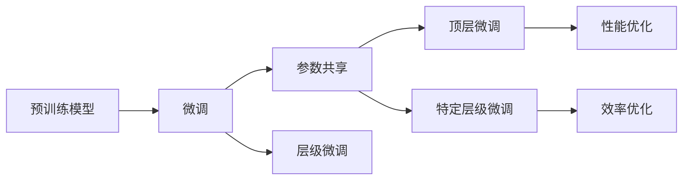

                 

# PEFT：性能和效率的平衡

> 关键词：

## 1. 背景介绍

在人工智能领域，模型的性能和效率一直是不可调和的矛盾。以深度学习模型为例，我们希望模型性能最优，同时模型推理效率也越高越好。然而，这种矛盾在实际应用中往往难以调和，特别是在处理大规模数据和高精度任务时。为了解决这一问题，提出了“性能与效率的平衡（PEFT）”方法，简称“PEFT”。PEFT方法通过仅微调模型的一部分参数，保留大部分预训练权重，从而在保证模型性能的同时，提高模型的推理速度和资源利用率，使模型能够更快地适应新的任务，满足实际应用的需求。

## 2. 核心概念与联系

### 2.1 核心概念概述

PEFT（Performance and Efficiency for Tuning）方法是一种用于优化深度学习模型的微调方法，旨在通过仅微调模型的一部分参数，保留大部分预训练权重，以平衡模型的性能和效率。PEFT方法通常使用微调与参数共享相结合的方式，保留预训练模型的部分层级，只微调顶层或特定层级，以提高模型的推理速度和资源利用率，使模型能够更快地适应新的任务，满足实际应用的需求。

- **微调**：通过在已有模型基础上，使用新任务的数据对模型进行训练，以提高模型在新任务上的表现。
- **参数共享**：保留预训练模型的大部分权重，仅微调顶层或特定层级，以提高模型推理效率。
- **层级微调**：针对特定任务，仅微调模型的某一层级或某几层级，以兼顾模型的性能和效率。
- **性能与效率**：在保持模型性能的同时，提高模型的推理速度和资源利用率，使模型能够更快地适应新的任务，满足实际应用的需求。

这些核心概念之间的逻辑关系可以通过以下Mermaid流程图来展示：



这个流程图展示了大语言模型的核心概念及其之间的关系：

1. 预训练模型通过在大规模无标签文本数据上进行预训练，学习到了通用的语言表示。
2. 微调是对预训练模型进行任务特定的优化，可以通过仅微调模型的一部分参数，以提高模型的推理速度和资源利用率。
3. 参数共享保留预训练模型的大部分权重，仅微调顶层或特定层级，以兼顾模型的性能和效率。
4. 层级微调针对特定任务，仅微调模型的某一层级或某几层级，以提高模型的推理速度和资源利用率。
5. 性能优化和效率优化是PEFT方法的两个核心目标，旨在在保持模型性能的同时，提高模型的推理速度和资源利用率，使模型能够更快地适应新的任务。

## 3. 核心算法原理 & 具体操作步骤

### 3.1 算法原理概述

PEFT方法的基本思想是通过仅微调模型的一部分参数，保留大部分预训练权重，以提高模型的推理速度和资源利用率。PEFT方法的优化目标是最小化模型的推理时间和空间复杂度，同时最大化模型的性能。

假设预训练模型为 $M_{\theta}$，其中 $\theta$ 为预训练得到的模型参数。给定下游任务 $T$ 的标注数据集 $D=\{(x_i, y_i)\}_{i=1}^N$，PEFT方法的目标是找到新的模型参数 $\hat{\theta}$，使得：

$$
\hat{\theta}=\mathop{\arg\min}_{\theta} \mathcal{L}(M_{\theta},D)
$$

其中 $\mathcal{L}$ 为针对任务 $T$ 设计的损失函数，用于衡量模型预测输出与真实标签之间的差异。

PEFT方法通常包括以下几个步骤：

1. 选择预训练模型 $M_{\theta}$ 作为初始化参数。
2. 根据任务类型，设计合适的任务适配层。
3. 设置微调超参数，如学习率、批大小、迭代轮数等。
4. 执行梯度训练，仅微调部分参数，保留大部分预训练权重。
5. 测试和部署微调后的模型。

### 3.2 算法步骤详解

PEFT方法的实现过程如下：

**Step 1: 准备预训练模型和数据集**

1. 选择合适的预训练语言模型 $M_{\theta}$ 作为初始化参数。
2. 准备下游任务 $T$ 的标注数据集 $D=\{(x_i,y_i)\}_{i=1}^N$，划分为训练集、验证集和测试集。一般要求标注数据与预训练数据的分布不要差异过大。

**Step 2: 添加任务适配层**

1. 根据任务类型，在预训练模型顶层设计合适的输出层和损失函数。
2. 对于分类任务，通常在顶层添加线性分类器和交叉熵损失函数。
3. 对于生成任务，通常使用语言模型的解码器输出概率分布，并以负对数似然为损失函数。

**Step 3: 设置微调超参数**

1. 选择合适的优化算法及其参数，如 AdamW、SGD 等。
2. 设置学习率、批大小、迭代轮数等。
3. 设置冻结预训练参数的策略，如仅微调顶层，或全部参数都参与微调。

**Step 4: 执行梯度训练**

1. 将训练集数据分批次输入模型，前向传播计算损失函数。
2. 反向传播计算参数梯度，根据设定的优化算法和学习率更新模型参数。
3. 周期性在验证集上评估模型性能，根据性能指标决定是否触发 Early Stopping。
4. 重复上述步骤直至满足预设的迭代轮数或 Early Stopping 条件。

**Step 5: 测试和部署**

1. 在测试集上评估微调后模型 $M_{\hat{\theta}}$ 的性能，对比微调前后的精度提升。
2. 使用微调后的模型对新样本进行推理预测，集成到实际的应用系统中。
3. 持续收集新的数据，定期重新微调模型，以适应数据分布的变化。

### 3.3 算法优缺点

PEFT方法具有以下优点：

1. **参数高效**：仅微调模型的一部分参数，保留大部分预训练权重，以提高模型推理速度和资源利用率。
2. **性能优越**：在保持模型性能的同时，提高模型的推理速度和资源利用率。
3. **训练时间短**：仅微调部分参数，训练时间短，易于在实际应用中快速部署。
4. **可解释性**：保留大部分预训练权重，模型输出的可解释性更强，有助于理解模型的决策过程。

同时，PEFT方法也存在以下缺点：

1. **模型容量受限**：仅微调部分参数，模型的容量可能有限，难以应对复杂任务。
2. **效果不稳定**：微调部分参数可能导致模型效果不稳定，需要仔细选择微调的层级和参数。
3. **参数更新慢**：仅微调部分参数，更新速度较慢，可能导致模型收敛速度慢。
4. **过拟合风险**：仅微调部分参数可能导致模型过拟合，需要采用一些正则化技术来避免。

尽管存在这些缺点，但PEFT方法在实际应用中仍表现出较强的实用性和普适性，特别是在资源受限的嵌入式设备和移动应用中，PEFT方法更受欢迎。

### 3.4 算法应用领域

PEFT方法已经在NLP领域得到了广泛的应用，覆盖了几乎所有常见任务，例如：

- 文本分类：如情感分析、主题分类、意图识别等。通过微调使模型学习文本-标签映射。
- 命名实体识别：识别文本中的人名、地名、机构名等特定实体。通过微调使模型掌握实体边界和类型。
- 关系抽取：从文本中抽取实体之间的语义关系。通过微调使模型学习实体-关系三元组。
- 问答系统：对自然语言问题给出答案。将问题-答案对作为微调数据，训练模型学习匹配答案。
- 机器翻译：将源语言文本翻译成目标语言。通过微调使模型学习语言-语言映射。
- 文本摘要：将长文本压缩成简短摘要。将文章-摘要对作为微调数据，使模型学习抓取要点。
- 对话系统：使机器能够与人自然对话。将多轮对话历史作为上下文，微调模型进行回复生成。

除了上述这些经典任务外，PEFT方法也被创新性地应用到更多场景中，如可控文本生成、常识推理、代码生成、数据增强等，为NLP技术带来了全新的突破。

## 4. 数学模型和公式 & 详细讲解  
### 4.1 数学模型构建

假设预训练模型为 $M_{\theta}$，其中 $\theta$ 为预训练得到的模型参数。假设微调任务的训练集为 $D=\{(x_i,y_i)\}_{i=1}^N$，其中 $x_i$ 为输入，$y_i$ 为标签。微调的目标是最小化经验风险：

$$
\mathcal{L}(\theta) = \frac{1}{N}\sum_{i=1}^N \ell(M_{\theta}(x_i),y_i)
$$

其中 $\ell$ 为损失函数。在PEFT方法中，我们仅微调模型的部分参数，保留大部分预训练权重。假设微调参数为 $\theta_1$，则新的模型参数为 $\hat{\theta}=\theta_1 \oplus \theta_2$，其中 $\theta_2$ 为保留的预训练权重。

### 4.2 公式推导过程

假设微调参数 $\theta_1$ 的损失函数为 $\mathcal{L}_1(\theta_1)$，保留的预训练参数 $\theta_2$ 的损失函数为 $\mathcal{L}_2(\theta_2)$，则微调后的模型损失函数为：

$$
\mathcal{L}_{\text{PEFT}}(\hat{\theta}) = \frac{1}{N}\sum_{i=1}^N \ell(M_{\hat{\theta}}(x_i),y_i)
$$

其中 $M_{\hat{\theta}}(x_i) = M_{\theta_1}(x_i) + M_{\theta_2}(x_i)$。为了最小化 $\mathcal{L}_{\text{PEFT}}(\hat{\theta})$，我们需要同时最小化 $\mathcal{L}_1(\theta_1)$ 和 $\mathcal{L}_2(\theta_2)$，并对两者进行联合优化。

### 4.3 案例分析与讲解

以文本分类任务为例，展示PEFT方法的具体实现过程。假设我们有一个二分类任务，模型结构为：BERT-MLP-Softmax。我们将BERT的前几层作为保留的预训练权重，仅微调MLP层和Softmax层的参数。具体步骤如下：

1. 准备标注数据集 $D=\{(x_i,y_i)\}_{i=1}^N$，划分为训练集、验证集和测试集。
2. 选择BERT-MLP-Softmax作为预训练模型，保留前6层作为预训练权重。
3. 添加线性分类器和交叉熵损失函数。
4. 设置微调超参数，如学习率、批大小、迭代轮数等。
5. 执行梯度训练，仅微调MLP层和Softmax层的参数。
6. 在测试集上评估微调后模型的性能。

## 5. 项目实践：代码实例和详细解释说明
### 5.1 开发环境搭建

在进行PEFT实践前，我们需要准备好开发环境。以下是使用Python进行PyTorch开发的环境配置流程：

1. 安装Anaconda：从官网下载并安装Anaconda，用于创建独立的Python环境。

2. 创建并激活虚拟环境：
```bash
conda create -n pytorch-env python=3.8 
conda activate pytorch-env
```

3. 安装PyTorch：根据CUDA版本，从官网获取对应的安装命令。例如：
```bash
conda install pytorch torchvision torchaudio cudatoolkit=11.1 -c pytorch -c conda-forge
```

4. 安装Transformers库：
```bash
pip install transformers
```

5. 安装各类工具包：
```bash
pip install numpy pandas scikit-learn matplotlib tqdm jupyter notebook ipython
```

完成上述步骤后，即可在`pytorch-env`环境中开始PEFT实践。

### 5.2 源代码详细实现

下面我们以情感分析任务为例，给出使用Transformers库对BERT模型进行PEFT的PyTorch代码实现。

首先，定义情感分析任务的数据处理函数：

```python
from transformers import BertTokenizer
from torch.utils.data import Dataset
import torch

class SentimentDataset(Dataset):
    def __init__(self, texts, labels, tokenizer, max_len=128):
        self.texts = texts
        self.labels = labels
        self.tokenizer = tokenizer
        self.max_len = max_len
        
    def __len__(self):
        return len(self.texts)
    
    def __getitem__(self, item):
        text = self.texts[item]
        label = self.labels[item]
        
        encoding = self.tokenizer(text, return_tensors='pt', max_length=self.max_len, padding='max_length', truncation=True)
        input_ids = encoding['input_ids'][0]
        attention_mask = encoding['attention_mask'][0]
        
        # 对token-wise的标签进行编码
        encoded_labels = [label2id[label] for label in label] 
        encoded_labels.extend([label2id['']]*(self.max_len - len(encoded_labels)))
        labels = torch.tensor(encoded_labels, dtype=torch.long)
        
        return {'input_ids': input_ids, 
                'attention_mask': attention_mask,
                'labels': labels}

# 标签与id的映射
label2id = {'positive': 1, 'negative': 0, 'neutral': 2}
id2label = {v: k for k, v in label2id.items()}

# 创建dataset
tokenizer = BertTokenizer.from_pretrained('bert-base-cased')

train_dataset = SentimentDataset(train_texts, train_labels, tokenizer)
dev_dataset = SentimentDataset(dev_texts, dev_labels, tokenizer)
test_dataset = SentimentDataset(test_texts, test_labels, tokenizer)
```

然后，定义模型和优化器：

```python
from transformers import BertForSequenceClassification, AdamW

model = BertForSequenceClassification.from_pretrained('bert-base-cased', num_labels=len(label2id))

optimizer = AdamW(model.parameters(), lr=2e-5)
```

接着，定义训练和评估函数：

```python
from torch.utils.data import DataLoader
from tqdm import tqdm
from sklearn.metrics import classification_report

device = torch.device('cuda') if torch.cuda.is_available() else torch.device('cpu')
model.to(device)

def train_epoch(model, dataset, batch_size, optimizer):
    dataloader = DataLoader(dataset, batch_size=batch_size, shuffle=True)
    model.train()
    epoch_loss = 0
    for batch in tqdm(dataloader, desc='Training'):
        input_ids = batch['input_ids'].to(device)
        attention_mask = batch['attention_mask'].to(device)
        labels = batch['labels'].to(device)
        model.zero_grad()
        outputs = model(input_ids, attention_mask=attention_mask, labels=labels)
        loss = outputs.loss
        epoch_loss += loss.item()
        loss.backward()
        optimizer.step()
    return epoch_loss / len(dataloader)

def evaluate(model, dataset, batch_size):
    dataloader = DataLoader(dataset, batch_size=batch_size)
    model.eval()
    preds, labels = [], []
    with torch.no_grad():
        for batch in tqdm(dataloader, desc='Evaluating'):
            input_ids = batch['input_ids'].to(device)
            attention_mask = batch['attention_mask'].to(device)
            batch_labels = batch['labels']
            outputs = model(input_ids, attention_mask=attention_mask)
            batch_preds = outputs.logits.argmax(dim=2).to('cpu').tolist()
            batch_labels = batch_labels.to('cpu').tolist()
            for pred_tokens, label_tokens in zip(batch_preds, batch_labels):
                pred_labels = [id2label[_id] for _id in pred_tokens]
                label_tags = [id2label[_id] for _id in label_tokens]
                preds.append(pred_labels[:len(label_tags)])
                labels.append(label_tags)
                
    print(classification_report(labels, preds))
```

最后，启动训练流程并在测试集上评估：

```python
epochs = 5
batch_size = 16

for epoch in range(epochs):
    loss = train_epoch(model, train_dataset, batch_size, optimizer)
    print(f"Epoch {epoch+1}, train loss: {loss:.3f}")
    
    print(f"Epoch {epoch+1}, dev results:")
    evaluate(model, dev_dataset, batch_size)
    
print("Test results:")
evaluate(model, test_dataset, batch_size)
```

以上就是使用PyTorch对BERT进行情感分析任务PEFT的完整代码实现。可以看到，得益于Transformers库的强大封装，我们可以用相对简洁的代码完成BERT模型的加载和PEFT。

### 5.3 代码解读与分析

让我们再详细解读一下关键代码的实现细节：

**SentimentDataset类**：
- `__init__`方法：初始化文本、标签、分词器等关键组件。
- `__len__`方法：返回数据集的样本数量。
- `__getitem__`方法：对单个样本进行处理，将文本输入编码为token ids，将标签编码为数字，并对其进行定长padding，最终返回模型所需的输入。

**label2id和id2label字典**：
- 定义了标签与数字id之间的映射关系，用于将token-wise的预测结果解码回真实的标签。

**训练和评估函数**：
- 使用PyTorch的DataLoader对数据集进行批次化加载，供模型训练和推理使用。
- 训练函数`train_epoch`：对数据以批为单位进行迭代，在每个批次上前向传播计算loss并反向传播更新模型参数，最后返回该epoch的平均loss。
- 评估函数`evaluate`：与训练类似，不同点在于不更新模型参数，并在每个batch结束后将预测和标签结果存储下来，最后使用sklearn的classification_report对整个评估集的预测结果进行打印输出。

**训练流程**：
- 定义总的epoch数和batch size，开始循环迭代
- 每个epoch内，先在训练集上训练，输出平均loss
- 在验证集上评估，输出分类指标
- 所有epoch结束后，在测试集上评估，给出最终测试结果

可以看到，PyTorch配合Transformers库使得BERT微调的代码实现变得简洁高效。开发者可以将更多精力放在数据处理、模型改进等高层逻辑上，而不必过多关注底层的实现细节。

当然，工业级的系统实现还需考虑更多因素，如模型的保存和部署、超参数的自动搜索、更灵活的任务适配层等。但核心的PEFT范式基本与此类似。

## 6. 实际应用场景
### 6.1 智能客服系统

基于PEFT的对话技术，可以广泛应用于智能客服系统的构建。传统客服往往需要配备大量人力，高峰期响应缓慢，且一致性和专业性难以保证。而使用PEFT微调的对话模型，可以7x24小时不间断服务，快速响应客户咨询，用自然流畅的语言解答各类常见问题。

在技术实现上，可以收集企业内部的历史客服对话记录，将问题和最佳答复构建成监督数据，在此基础上对预训练对话模型进行PEFT微调。微调后的对话模型能够自动理解用户意图，匹配最合适的答案模板进行回复。对于客户提出的新问题，还可以接入检索系统实时搜索相关内容，动态组织生成回答。如此构建的智能客服系统，能大幅提升客户咨询体验和问题解决效率。

### 6.2 金融舆情监测

金融机构需要实时监测市场舆论动向，以便及时应对负面信息传播，规避金融风险。传统的人工监测方式成本高、效率低，难以应对网络时代海量信息爆发的挑战。基于PEFT的语言分类和情感分析技术，为金融舆情监测提供了新的解决方案。

具体而言，可以收集金融领域相关的新闻、报道、评论等文本数据，并对其进行主题标注和情感标注。在此基础上对预训练语言模型进行PEFT微调，使其能够自动判断文本属于何种主题，情感倾向是正面、中性还是负面。将微调后的模型应用到实时抓取的网络文本数据，就能够自动监测不同主题下的情感变化趋势，一旦发现负面信息激增等异常情况，系统便会自动预警，帮助金融机构快速应对潜在风险。

### 6.3 个性化推荐系统

当前的推荐系统往往只依赖用户的历史行为数据进行物品推荐，无法深入理解用户的真实兴趣偏好。基于PEFT的推荐系统可以更好地挖掘用户行为背后的语义信息，从而提供更精准、多样的推荐内容。

在实践中，可以收集用户浏览、点击、评论、分享等行为数据，提取和用户交互的物品标题、描述、标签等文本内容。将文本内容作为模型输入，用户的后续行为（如是否点击、购买等）作为监督信号，在此基础上微调预训练语言模型。微调后的模型能够从文本内容中准确把握用户的兴趣点。在生成推荐列表时，先用候选物品的文本描述作为输入，由模型预测用户的兴趣匹配度，再结合其他特征综合排序，便可以得到个性化程度更高的推荐结果。

### 6.4 未来应用展望

随着PEFT方法和大语言模型微调技术的不断发展，基于PEFT的微调方法必将在更多领域得到应用，为传统行业带来变革性影响。

在智慧医疗领域，基于PEFT的医疗问答、病历分析、药物研发等应用将提升医疗服务的智能化水平，辅助医生诊疗，加速新药开发进程。

在智能教育领域，PEFT可应用于作业批改、学情分析、知识推荐等方面，因材施教，促进教育公平，提高教学质量。

在智慧城市治理中，PEFT技术可应用于城市事件监测、舆情分析、应急指挥等环节，提高城市管理的自动化和智能化水平，构建更安全、高效的未来城市。

此外，在企业生产、社会治理、文娱传媒等众多领域，基于PEFT的人工智能应用也将不断涌现，为经济社会发展注入新的动力。相信随着技术的日益成熟，PEFT方法将成为人工智能落地应用的重要范式，推动人工智能技术向更广阔的领域加速渗透。

## 7. 工具和资源推荐
### 7.1 学习资源推荐

为了帮助开发者系统掌握大语言模型PEFT的理论基础和实践技巧，这里推荐一些优质的学习资源：

1. 《Transformer从原理到实践》系列博文：由大模型技术专家撰写，深入浅出地介绍了Transformer原理、BERT模型、PEFT技术等前沿话题。

2. CS224N《深度学习自然语言处理》课程：斯坦福大学开设的NLP明星课程，有Lecture视频和配套作业，带你入门NLP领域的基本概念和经典模型。

3. 《Natural Language Processing with Transformers》书籍：Transformers库的作者所著，全面介绍了如何使用Transformers库进行NLP任务开发，包括PEFT在内的诸多范式。

4. HuggingFace官方文档：Transformers库的官方文档，提供了海量预训练模型和完整的PEFT样例代码，是上手实践的必备资料。

5. CLUE开源项目：中文语言理解测评基准，涵盖大量不同类型的中文NLP数据集，并提供了基于PEFT的baseline模型，助力中文NLP技术发展。

通过对这些资源的学习实践，相信你一定能够快速掌握大语言模型PEFT的精髓，并用于解决实际的NLP问题。
###  7.2 开发工具推荐

高效的开发离不开优秀的工具支持。以下是几款用于大语言模型PEFT开发的常用工具：

1. PyTorch：基于Python的开源深度学习框架，灵活动态的计算图，适合快速迭代研究。大部分预训练语言模型都有PyTorch版本的实现。

2. TensorFlow：由Google主导开发的开源深度学习框架，生产部署方便，适合大规模工程应用。同样有丰富的预训练语言模型资源。

3. Transformers库：HuggingFace开发的NLP工具库，集成了众多SOTA语言模型，支持PyTorch和TensorFlow，是进行PEFT任务开发的利器。

4. Weights & Biases：模型训练的实验跟踪工具，可以记录和可视化模型训练过程中的各项指标，方便对比和调优。与主流深度学习框架无缝集成。

5. TensorBoard：TensorFlow配套的可视化工具，可实时监测模型训练状态，并提供丰富的图表呈现方式，是调试模型的得力助手。

6. Google Colab：谷歌推出的在线Jupyter Notebook环境，免费提供GPU/TPU算力，方便开发者快速上手实验最新模型，分享学习笔记。

合理利用这些工具，可以显著提升大语言模型PEFT任务的开发效率，加快创新迭代的步伐。

### 7.3 相关论文推荐

PEFT方法和大语言模型微调技术的发展源于学界的持续研究。以下是几篇奠基性的相关论文，推荐阅读：

1. Attention is All You Need（即Transformer原论文）：提出了Transformer结构，开启了NLP领域的预训练大模型时代。

2. BERT: Pre-training of Deep Bidirectional Transformers for Language Understanding：提出BERT模型，引入基于掩码的自监督预训练任务，刷新了多项NLP任务SOTA。

3. Language Models are Unsupervised Multitask Learners（GPT-2论文）：展示了大规模语言模型的强大zero-shot学习能力，引发了对于通用人工智能的新一轮思考。

4. Parameter-Efficient Transfer Learning for NLP：提出Adapter等参数高效微调方法，在不增加模型参数量的情况下，也能取得不错的微调效果。

5. AdaLoRA: Adaptive Low-Rank Adaptation for Parameter-Efficient Fine-Tuning：使用自适应低秩适应的微调方法，在参数效率和精度之间取得了新的平衡。

这些论文代表了大语言模型PEFT技术的发展脉络。通过学习这些前沿成果，可以帮助研究者把握学科前进方向，激发更多的创新灵感。

## 8. 总结：未来发展趋势与挑战

### 8.1 总结

本文对大语言模型的PEFT方法进行了全面系统的介绍。首先阐述了PEFT方法的核心理念和研究背景，明确了PEFT方法在平衡模型性能和效率方面的独特价值。其次，从原理到实践，详细讲解了PEFT方法的数学原理和关键步骤，给出了PEFT任务开发的完整代码实例。同时，本文还广泛探讨了PEFT方法在智能客服、金融舆情、个性化推荐等多个行业领域的应用前景，展示了PEFT方法的巨大潜力。此外，本文精选了PEFT技术的各类学习资源，力求为读者提供全方位的技术指引。

通过本文的系统梳理，可以看到，PEFT方法正在成为NLP领域的重要范式，极大地拓展了预训练语言模型的应用边界，催生了更多的落地场景。受益于大规模语料的预训练，PEFT方法在保持模型性能的同时，提高了模型的推理速度和资源利用率，使模型能够更快地适应新的任务，满足实际应用的需求。未来，伴随预训练语言模型和PEFT方法的持续演进，相信NLP技术将在更广阔的应用领域大放异彩，深刻影响人类的生产生活方式。

### 8.2 未来发展趋势

展望未来，大语言模型PEFT技术将呈现以下几个发展趋势：

1. **参数效率**：未来将涌现更多参数高效的PEFT方法，如Prefix-Tuning、LoRA等，在节省计算资源的同时也能保证PEFT精度。
2. **资源优化**：优化PEFT模型的计算图，减少前向传播和反向传播的资源消耗，实现更加轻量级、实时性的部署。
3. **性能提升**：通过优化PEFT方法的训练目标和正则化技术，提高PEFT模型的泛化能力和鲁棒性。
4. **多模态融合**：将符号化的先验知识，如知识图谱、逻辑规则等，与神经网络模型进行巧妙融合，引导PEFT过程学习更准确、合理的语言模型。
5. **自监督学习**：引入自监督学习范式，利用无标注数据进行PEFT，提高模型的泛化能力。
6. **元学习**：将PEFT过程与元学习结合，使模型能够快速适应新任务，提高PEFT效率和效果。

以上趋势凸显了大语言模型PEFT技术的广阔前景。这些方向的探索发展，必将进一步提升PEFT模型的性能和应用范围，为人类认知智能的进化带来深远影响。

### 8.3 面临的挑战

尽管大语言模型PEFT技术已经取得了瞩目成就，但在迈向更加智能化、普适化应用的过程中，它仍面临着诸多挑战：

1. **过拟合问题**：仅微调部分参数可能导致模型过拟合，需要采用一些正则化技术来避免。
2. **模型容量受限**：仅微调部分参数可能导致模型容量有限，难以应对复杂任务。
3. **模型效率不足**：PEFT模型的推理速度和资源利用率仍需进一步优化。
4. **模型鲁棒性不足**：PEFT模型面对域外数据时，泛化性能往往大打折扣。
5. **模型安全性问题**：预训练模型中可能包含有害信息，PEFT模型需警惕模型输出可能带来的风险。
6. **模型可解释性不足**：PEFT模型输出的可解释性较弱，难以理解模型的决策过程。

尽管存在这些挑战，但PEFT方法在实际应用中仍表现出较强的实用性和普适性，特别是在资源受限的嵌入式设备和移动应用中，PEFT方法更受欢迎。

### 8.4 研究展望

面对PEFT面临的这些挑战，未来的研究需要在以下几个方面寻求新的突破：

1. **模型容量扩充**：研究如何通过参数共享和模型结构优化，提高PEFT模型的容量，使其能够应对复杂任务。
2. **过拟合抑制**：开发更加高效的正则化技术，如Dropout、L2正则等，抑制PEFT模型的过拟合现象。
3. **计算图优化**：优化PEFT模型的计算图，减少前向传播和反向传播的资源消耗，实现更加轻量级、实时性的部署。
4. **模型鲁棒性提升**：研究如何通过数据增强、对抗训练等技术，提高PEFT模型的泛化能力和鲁棒性。
5. **模型安全性保障**：在模型训练目标中引入伦理导向的评估指标，过滤和惩罚有偏见、有害的输出倾向，确保模型安全性。
6. **模型可解释性增强**：通过引入可解释性模型，如决策树、LIME等，增强PEFT模型的可解释性。

这些研究方向将有助于解决PEFT方法在实际应用中的各种挑战，推动PEFT方法向更加高效、可靠、普适的方向发展，为人类认知智能的进化带来深远影响。面向未来，PEFT方法还需要与其他人工智能技术进行更深入的融合，如知识表示、因果推理、强化学习等，多路径协同发力，共同推动自然语言理解和智能交互系统的进步。

## 9. 附录：常见问题与解答

**Q1：PEFT方法是否适用于所有NLP任务？**

A: PEFT方法在大多数NLP任务上都能取得不错的效果，特别是对于数据量较小的任务。但对于一些特定领域的任务，如医学、法律等，仅依靠通用语料预训练的模型可能难以很好地适应。此时需要在特定领域语料上进一步预训练，再进行PEFT微调，才能获得理想效果。此外，对于一些需要时效性、个性化很强的任务，如对话、推荐等，PEFT方法也需要针对性的改进优化。

**Q2：PEFT方法中如何避免过拟合问题？**

A: 过拟合是PEFT方法面临的主要挑战之一。为了避免过拟合，可以采用以下方法：
1. 数据增强：通过回译、近义替换等方式扩充训练集。
2. 正则化：使用L2正则、Dropout等技术。
3. 对抗训练：引入对抗样本，提高模型鲁棒性。
4. 多模型集成：训练多个PEFT模型，取平均输出，抑制过拟合。

这些方法需要根据具体任务和数据特点进行灵活组合，才能最大限度地避免过拟合问题。

**Q3：PEFT方法在实际应用中如何提高模型效率？**

A: PEFT方法通过仅微调部分参数，保留大部分预训练权重，从而提高模型的推理速度和资源利用率。为了进一步提升模型效率，可以考虑以下措施：
1. 使用轻量级模型结构，如MobileBERT、DistilBERT等。
2. 优化PEFT模型的计算图，减少前向传播和反向传播的资源消耗。
3. 使用混合精度训练（Mixed Precision Training），提升模型训练和推理速度。

合理利用这些措施，可以显著提高PEFT模型的效率，使其能够更好地适应资源受限的应用场景。

**Q4：PEFT方法在实际应用中如何保证模型性能？**

A: PEFT方法在保证模型性能的同时，需要优化微调参数和训练策略。具体措施包括：
1. 选择合适的微调参数，如学习率、批大小等。
2. 优化微调的目标函数，如引入因果推断和对比学习。
3. 采用自适应学习率调度策略，如学习率衰减、预热策略等。
4. 使用多模型集成技术，提高PEFT模型的泛化能力和鲁棒性。

这些措施可以有效提升PEFT模型的性能，使其能够更好地适应实际应用的需求。

---

作者：禅与计算机程序设计艺术 / Zen and the Art of Computer Programming

