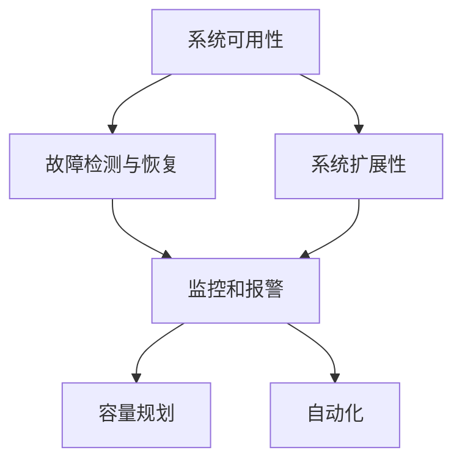

                 

# SRE 原则：保持系统高可用性和可扩展性

## 1. 背景介绍

### 1.1 问题由来

在互联网和数字化转型的大背景下，企业的业务系统变得越来越复杂，数据量和用户访问量呈现爆炸式增长。同时，为了提升用户体验和增强市场竞争力，企业必须不断进行技术创新，引入新技术和新产品。这使得业务系统的运行风险不断增加，对系统的稳定性和可靠性提出了更高的要求。

在这样的背景下，站点可靠运行（Site Reliability Engineering，SRE）逐渐成为企业运营中不可或缺的一部分。SRE 是一种工程实践，旨在通过系统化的、技术驱动的方式来提升业务系统的可用性和稳定性，从而实现业务的高效运行和快速迭代。

SRE 的核心理念是“可靠运行”，即在系统运行和开发过程中，不断追求更高的可用性、更强的鲁棒性和更高效的扩展能力。通过SRE，企业能够在不断变化的业务需求和技术环境中，保持系统的稳定性和可靠性，从而支持业务的持续发展和创新。

### 1.2 问题核心关键点

SRE 的核心在于将系统的可靠性作为工程实践的首要目标，采用系统化、科学化的方法来处理和管理系统的运行和维护问题。其关键点包括：

- **系统可用性**：确保系统在99.99%以上的时间里能够正常运行，避免因故障而中断服务。
- **故障检测与恢复**：快速检测和定位系统故障，并采取措施恢复系统正常运行。
- **系统扩展性**：通过架构设计和优化，支持系统在面对业务需求增加时的快速扩展，避免系统瓶颈。
- **监控和报警**：通过实时监控系统性能，及时发现潜在问题，并采取措施预防。
- **容量规划**：预测业务增长趋势，提前规划系统容量，避免因资源不足而影响业务运行。
- **自动化**：通过自动化工具和流程，减少人工操作，提升系统运行效率和质量。

这些关键点共同构成了SRE的框架和实践基础，帮助企业在技术创新和业务发展的过程中，保持系统的稳定性和可靠性。

## 2. 核心概念与联系

### 2.1 核心概念概述

为了更好地理解SRE的实践原则和框架，本节将介绍几个密切相关的核心概念：

- **系统可用性**：指系统在规定的时间内能够正常运行的概率，通常用“可用性百分比”来衡量。
- **故障检测与恢复**：指通过监控和报警机制，快速检测和定位系统故障，并采取措施恢复系统正常运行。
- **系统扩展性**：指系统在面对业务需求增加时，能够快速扩展资源，支持更多用户访问。
- **监控和报警**：指通过实时监控系统性能，及时发现潜在问题，并采取措施预防。
- **容量规划**：指通过预测业务增长趋势，提前规划系统容量，避免因资源不足而影响业务运行。
- **自动化**：指通过自动化工具和流程，减少人工操作，提升系统运行效率和质量。

这些核心概念之间的逻辑关系可以通过以下Mermaid流程图来展示：



这个流程图展示了一体化的SRE框架：

1. 通过监控和报警机制检测系统故障，并快速恢复，确保系统高可用性。
2. 通过系统扩展性设计和容量规划，支持系统在业务增长时的快速扩展，避免瓶颈。
3. 通过自动化工具和流程，提升系统运行效率和质量，减少人工操作。

## 3. 核心算法原理 & 具体操作步骤
### 3.1 算法原理概述

SRE的实践原则是基于以下几个核心算法原理：

- **可用性计算**：基于系统运行的“停机时间”和“运行时间”，计算系统的可用性百分比。通常使用“停机时间”占总运行时间的比例来衡量可用性。
- **故障检测与恢复算法**：通过监控系统关键指标，检测异常事件，并采取措施恢复系统正常运行。
- **系统扩展算法**：通过评估当前资源使用情况，预测未来需求增长，规划扩展方案。
- **监控与报警算法**：通过实时监控系统性能，设置告警阈值，及时发现潜在问题，并采取措施预防。
- **容量规划算法**：通过预测业务增长趋势，预测系统资源需求，提前规划容量。
- **自动化流程**：通过脚本和工具自动化系统管理和维护流程，提升效率和质量。

### 3.2 算法步骤详解

以下将详细讲解SRE中的核心算法步骤：

**Step 1: 系统可用性计算**

系统可用性计算基于“停机时间”和“运行时间”。假设系统总运行时间为 $T$，停机时间为 $D$，则可用性 $A$ 可计算为：

$$
A = \frac{T - D}{T}
$$

具体计算过程中，需要将“停机时间”和“运行时间”转换为统一的时间单位，并考虑时间切片的粒度。

**Step 2: 故障检测与恢复算法**

故障检测与恢复算法通常包括以下几个步骤：

1. **监控系统关键指标**：通过监控系统关键指标（如CPU使用率、内存使用率、网络流量等），实时检测系统运行状态。
2. **检测异常事件**：当监控指标超出预设的告警阈值时，触发告警机制，定位异常事件。
3. **故障恢复**：根据告警信息和预设的恢复策略，采取措施恢复系统正常运行，如重启服务、切换备份、修复故障等。

**Step 3: 系统扩展算法**

系统扩展算法通常包括以下几个步骤：

1. **评估当前资源使用情况**：通过监控系统资源使用情况（如CPU、内存、磁盘IO等），评估当前系统的负载水平。
2. **预测未来需求增长**：根据业务增长趋势和历史数据，预测未来需求变化。
3. **规划扩展方案**：根据预测结果，制定扩展方案，如增加服务器、扩展缓存、优化算法等。
4. **实施扩展策略**：逐步实施扩展方案，并实时监控系统运行状态，确保扩展效果。

**Step 4: 监控与报警算法**

监控与报警算法通常包括以下几个步骤：

1. **实时监控系统性能**：通过监控系统关键指标，实时获取系统性能数据。
2. **设置告警阈值**：根据业务需求和历史数据，设置告警阈值，当指标超出阈值时，触发告警机制。
3. **告警信息处理**：及时处理告警信息，采取措施解决潜在问题，如自动重启、手动修复等。
4. **告警信息记录**：记录告警信息和处理结果，用于后续分析和改进。

**Step 5: 容量规划算法**

容量规划算法通常包括以下几个步骤：

1. **预测业务增长趋势**：通过历史数据和业务增长趋势，预测未来用户访问量和系统资源需求。
2. **规划系统容量**：根据预测结果，规划系统容量，确保系统能够支持业务增长。
3. **优化资源利用率**：通过资源调度、负载均衡等技术，优化资源利用率，提升系统性能。
4. **动态调整容量**：根据实际运行情况，动态调整系统容量，保持系统高可用性和可扩展性。

**Step 6: 自动化流程**

自动化流程通常包括以下几个步骤：

1. **编写自动化脚本**：编写系统管理和维护的自动化脚本，涵盖从监控、告警到故障恢复、容量规划等各个环节。
2. **集成自动化工具**：将自动化脚本集成到系统管理和维护流程中，实现自动化操作。
3. **持续优化自动化流程**：根据实际运行情况，持续优化自动化流程，提升系统运行效率和质量。

### 3.3 算法优缺点

SRE 的实践算法具有以下优点：

1. **提升系统可用性**：通过监控和报警机制，快速检测和恢复系统故障，确保系统高可用性。
2. **增强系统扩展性**：通过系统扩展算法和容量规划，支持系统在业务增长时的快速扩展，避免瓶颈。
3. **提升运行效率**：通过自动化工具和流程，减少人工操作，提升系统运行效率和质量。
4. **支持快速迭代**：通过系统化的工程实践，支持业务的持续发展和创新。

同时，这些算法也存在一定的局限性：

1. **复杂度较高**：SRE 的实践算法涉及多个环节，复杂度较高，需要专业的工程师进行设计和实施。
2. **依赖专业人才**：SRE 的实施需要高水平的专业人才，包括系统架构师、运维工程师等。
3. **成本较高**：SRE 的实施需要大量的资源和成本投入，包括硬件、软件和人力等。
4. **灵活性不足**：SRE 的实施过程相对固定，难以应对快速变化的业务需求和技术环境。

尽管存在这些局限性，但SRE的实践算法仍然是一种系统化和工程化的解决方案，能够有效提升系统的高可用性和可扩展性，支持业务的持续发展和创新。

### 3.4 算法应用领域

SRE 的实践算法在多个领域得到了广泛应用，包括但不限于：

1. **互联网和移动互联网**：通过监控和报警机制，保证互联网和移动互联网应用的稳定性，提升用户体验。
2. **电子商务**：通过系统扩展算法和容量规划，支持电商平台的快速扩展，提升业务处理能力和用户体验。
3. **金融服务**：通过自动化工具和流程，提升金融服务的可靠性和安全性，支持金融创新和业务发展。
4. **医疗健康**：通过监控和报警机制，保证医疗健康系统的稳定运行，提升医疗服务的质量和效率。
5. **政府服务**：通过系统扩展算法和容量规划，支持政府服务的快速扩展，提升政务服务水平。

除了上述这些领域，SRE 的实践算法也在更多的行业和场景中得到应用，帮助企业提升系统的可靠性、稳定性和可扩展性，支持业务的持续发展和创新。

## 4. 数学模型和公式 & 详细讲解 & 举例说明

### 4.1 数学模型构建

SRE 的实践算法涉及多个数学模型，以下是几个核心的数学模型：

**系统可用性计算模型**：

假设系统总运行时间为 $T$，停机时间为 $D$，则可用性 $A$ 可计算为：

$$
A = \frac{T - D}{T}
$$

**故障检测与恢复算法模型**：

假设系统关键指标为 $X$，告警阈值为 $T_x$，当 $X > T_x$ 时触发告警，则告警概率 $P_a$ 可计算为：

$$
P_a = \frac{\int_{T_x}^{\infty} f_X(x)dx}{T}
$$

其中 $f_X(x)$ 为指标 $X$ 的概率密度函数。

**系统扩展算法模型**：

假设当前系统资源需求为 $C_1$，未来需求为 $C_2$，扩展比例为 $k$，则扩展后资源需求为 $C_2 = k \cdot C_1$。

**监控与报警算法模型**：

假设系统关键指标为 $X$，告警阈值为 $T_x$，告警概率为 $P_a$，则系统稳定运行概率 $P_s$ 可计算为：

$$
P_s = P_a \cdot P_{noa}
$$

其中 $P_{noa}$ 为无告警状态的概率。

**容量规划算法模型**：

假设当前系统资源需求为 $C_1$，未来需求为 $C_2$，容量规划系数为 $k$，则容量规划结果为 $C_2 = k \cdot C_1$。

**自动化流程模型**：

假设自动化流程分为 $n$ 个步骤，每个步骤的时间为 $t_i$，则总时间 $T_a$ 可计算为：

$$
T_a = \sum_{i=1}^n t_i
$$

### 4.2 公式推导过程

以下将详细推导几个核心模型的公式：

**系统可用性计算公式**：

假设系统总运行时间为 $T$，停机时间为 $D$，则可用性 $A$ 可计算为：

$$
A = \frac{T - D}{T}
$$

**故障检测与恢复算法公式**：

假设系统关键指标为 $X$，告警阈值为 $T_x$，当 $X > T_x$ 时触发告警，则告警概率 $P_a$ 可计算为：

$$
P_a = \frac{\int_{T_x}^{\infty} f_X(x)dx}{T}
$$

其中 $f_X(x)$ 为指标 $X$ 的概率密度函数。

**系统扩展算法公式**：

假设当前系统资源需求为 $C_1$，未来需求为 $C_2$，扩展比例为 $k$，则扩展后资源需求为 $C_2 = k \cdot C_1$。

**监控与报警算法公式**：

假设系统关键指标为 $X$，告警阈值为 $T_x$，告警概率为 $P_a$，则系统稳定运行概率 $P_s$ 可计算为：

$$
P_s = P_a \cdot P_{noa}
$$

其中 $P_{noa}$ 为无告警状态的概率。

**容量规划算法公式**：

假设当前系统资源需求为 $C_1$，未来需求为 $C_2$，容量规划系数为 $k$，则容量规划结果为 $C_2 = k \cdot C_1$。

**自动化流程公式**：

假设自动化流程分为 $n$ 个步骤，每个步骤的时间为 $t_i$，则总时间 $T_a$ 可计算为：

$$
T_a = \sum_{i=1}^n t_i
$$

### 4.3 案例分析与讲解

**案例分析1：电商平台容量规划**

某电商平台在“双十一”期间用户访问量激增，预计日访问量将达到平时的10倍以上。如何通过容量规划来确保系统的高可用性？

首先，通过监控系统资源使用情况（如CPU、内存、磁盘IO等），评估当前系统的负载水平。其次，根据历史数据和业务增长趋势，预测未来用户访问量和系统资源需求。最后，根据预测结果，制定扩展方案，如增加服务器、扩展缓存、优化算法等。通过逐步实施扩展方案，并实时监控系统运行状态，确保扩展效果。

**案例分析2：金融服务故障检测与恢复**

某金融服务系统在“黑五”期间遭遇DDoS攻击，导致系统服务中断。如何通过故障检测与恢复来快速恢复系统正常运行？

首先，通过监控系统关键指标（如网络流量、服务响应时间等），实时检测系统运行状态。当指标超出预设的告警阈值时，触发告警机制，定位异常事件。根据告警信息和预设的恢复策略，采取措施恢复系统正常运行，如重启服务、切换备份、修复故障等。同时，记录告警信息和处理结果，用于后续分析和改进。

## 5. 项目实践：代码实例和详细解释说明

### 5.1 开发环境搭建

在进行SRE实践前，我们需要准备好开发环境。以下是使用Python进行SRE开发的环境配置流程：

1. 安装Anaconda：从官网下载并安装Anaconda，用于创建独立的Python环境。

2. 创建并激活虚拟环境：
```bash
conda create -n sre-env python=3.8 
conda activate sre-env
```

3. 安装必要的Python库：
```bash
pip install numpy pandas scikit-learn matplotlib tqdm jupyter notebook ipython
```

完成上述步骤后，即可在`sre-env`环境中开始SRE实践。

### 5.2 源代码详细实现

这里我们以容量规划为例，给出使用Python进行SRE开发的基本代码实现。

首先，定义系统资源使用情况：

```python
import numpy as np

class SystemResources:
    def __init__(self, resource_usage):
        self.resource_usage = resource_usage
        self.capacity = None
        
    def get_resource_usage(self):
        return self.resource_usage
    
    def set_capacity(self, capacity):
        self.capacity = capacity
    
    def predict_future_demand(self, growth_rate, time_period):
        future_demand = np.exp(growth_rate * np.log(self.resource_usage) * time_period)
        return future_demand
```

然后，定义容量规划函数：

```python
def capacity_planning(system_resources, growth_rate, time_period, capacity_coefficient):
    future_demand = system_resources.predict_future_demand(growth_rate, time_period)
    predicted_capacity = future_demand * capacity_coefficient
    return predicted_capacity
```

最后，启动容量规划流程：

```python
# 定义系统资源使用情况
resource_usage = [1000, 1500, 2000, 2500, 3000]  # 单位：服务请求数

# 创建系统资源对象
system_resources = SystemResources(resource_usage)

# 定义增长率和规划时间
growth_rate = 0.1  # 每日增长率
time_period = 365  # 未来一年

# 定义规划系数
capacity_coefficient = 1.2  # 规划容量系数

# 执行容量规划
predicted_capacity = capacity_planning(system_resources, growth_rate, time_period, capacity_coefficient)

print(f"未来一年预测容量为: {predicted_capacity} 服务请求数")
```

以上就是使用Python进行SRE开发的基本代码实现。可以看到，通过定义系统资源使用情况、预测未来需求和规划容量，我们可以轻松实现容量规划功能。

### 5.3 代码解读与分析

让我们再详细解读一下关键代码的实现细节：

**SystemResources类**：
- `__init__`方法：初始化系统资源使用情况和容量。
- `get_resource_usage`方法：获取当前资源使用情况。
- `set_capacity`方法：设置系统容量。
- `predict_future_demand`方法：根据增长率和规划时间，预测未来需求。

**capacity_planning函数**：
- `predicted_capacity`：根据系统资源使用情况、增长率、规划时间和规划系数，计算预测容量。

**启动容量规划流程**：
- 定义系统资源使用情况，创建SystemResources对象。
- 定义增长率和规划时间。
- 定义规划系数。
- 执行容量规划，输出预测容量。

可以看到，通过Python的面向对象编程和函数式编程，我们可以轻松实现SRE实践中的核心算法。

当然，工业级的系统实现还需考虑更多因素，如性能优化、异常处理、日志记录等。但核心的算法思路基本与此类似。

## 6. 实际应用场景

### 6.1 电商平台的SRE实践

电商平台的SRE实践主要包括以下几个关键环节：

1. **系统可用性计算**：通过监控系统关键指标（如订单数、服务响应时间等），计算电商平台的可用性百分比。
2. **故障检测与恢复**：当系统指标超出预设的告警阈值时，触发告警机制，定位异常事件，并采取措施恢复系统正常运行。
3. **系统扩展算法**：根据订单增长趋势和历史数据，预测未来需求变化，制定扩展方案，如增加服务器、扩展缓存等。
4. **监控与报警算法**：实时监控系统性能，设置告警阈值，及时发现潜在问题，并采取措施预防。
5. **容量规划算法**：预测未来用户访问量和系统资源需求，提前规划容量，确保系统能够支持业务增长。
6. **自动化流程**：编写自动化脚本，实现系统管理和维护的自动化操作，提升系统运行效率和质量。

**实际案例**：
某电商平台在“双十一”期间用户访问量激增，预计日访问量将达到平时的10倍以上。如何通过SRE实践来确保系统的高可用性和可扩展性？

首先，通过监控系统关键指标（如订单数、服务响应时间等），计算电商平台的可用性百分比。其次，当指标超出预设的告警阈值时，触发告警机制，定位异常事件，并采取措施恢复系统正常运行。根据订单增长趋势和历史数据，预测未来需求变化，制定扩展方案，如增加服务器、扩展缓存等。实时监控系统性能，设置告警阈值，及时发现潜在问题，并采取措施预防。最后，根据预测结果，提前规划容量，确保系统能够支持业务增长。通过编写自动化脚本，实现系统管理和维护的自动化操作，提升系统运行效率和质量。

### 6.2 金融服务的SRE实践

金融服务的SRE实践主要包括以下几个关键环节：

1. **系统可用性计算**：通过监控系统关键指标（如交易数、服务响应时间等），计算金融服务的可用性百分比。
2. **故障检测与恢复**：当系统指标超出预设的告警阈值时，触发告警机制，定位异常事件，并采取措施恢复系统正常运行。
3. **系统扩展算法**：根据交易增长趋势和历史数据，预测未来需求变化，制定扩展方案，如增加服务器、扩展缓存等。
4. **监控与报警算法**：实时监控系统性能，设置告警阈值，及时发现潜在问题，并采取措施预防。
5. **容量规划算法**：预测未来交易量和系统资源需求，提前规划容量，确保系统能够支持业务增长。
6. **自动化流程**：编写自动化脚本，实现系统管理和维护的自动化操作，提升系统运行效率和质量。

**实际案例**：
某金融服务系统在“黑五”期间遭遇DDoS攻击，导致系统服务中断。如何通过SRE实践来快速恢复系统正常运行？

首先，通过监控系统关键指标（如网络流量、服务响应时间等），计算金融服务的可用性百分比。当指标超出预设的告警阈值时，触发告警机制，定位异常事件，并采取措施恢复系统正常运行。根据交易增长趋势和历史数据，预测未来需求变化，制定扩展方案，如增加服务器、扩展缓存等。实时监控系统性能，设置告警阈值，及时发现潜在问题，并采取措施预防。最后，根据预测结果，提前规划容量，确保系统能够支持业务增长。通过编写自动化脚本，实现系统管理和维护的自动化操作，提升系统运行效率和质量。

### 6.3 政府服务的SRE实践

政府服务的SRE实践主要包括以下几个关键环节：

1. **系统可用性计算**：通过监控系统关键指标（如请求数、服务响应时间等），计算政府服务的可用性百分比。
2. **故障检测与恢复**：当系统指标超出预设的告警阈值时，触发告警机制，定位异常事件，并采取措施恢复系统正常运行。
3. **系统扩展算法**：根据用户请求增长趋势和历史数据，预测未来需求变化，制定扩展方案，如增加服务器、扩展缓存等。
4. **监控与报警算法**：实时监控系统性能，设置告警阈值，及时发现潜在问题，并采取措施预防。
5. **容量规划算法**：预测未来用户访问量和系统资源需求，提前规划容量，确保系统能够支持业务增长。
6. **自动化流程**：编写自动化脚本，实现系统管理和维护的自动化操作，提升系统运行效率和质量。

**实际案例**：
某政府服务平台在“两会”期间用户访问量激增，预计日访问量将达到平时的3倍以上。如何通过SRE实践来确保系统的高可用性和可扩展性？

首先，通过监控系统关键指标（如请求数、服务响应时间等），计算政府服务的可用性百分比。当指标超出预设的告警阈值时，触发告警机制，定位异常事件，并采取措施恢复系统正常运行。根据用户请求增长趋势和历史数据，预测未来需求变化，制定扩展方案，如增加服务器、扩展缓存等。实时监控系统性能，设置告警阈值，及时发现潜在问题，并采取措施预防。最后，根据预测结果，提前规划容量，确保系统能够支持业务增长。通过编写自动化脚本，实现系统管理和维护的自动化操作，提升系统运行效率和质量。

## 7. 工具和资源推荐
### 7.1 学习资源推荐

为了帮助开发者系统掌握SRE的理论基础和实践技巧，这里推荐一些优质的学习资源：

1. 《SRE：站点可靠运行实践指南》：这本书详细介绍了SRE的实践原理和工程方法，涵盖监控、告警、扩展、容量规划等各个环节。
2. CS224N《网站可靠性工程》课程：斯坦福大学开设的SRE课程，有Lecture视频和配套作业，带你入门SRE领域的基本概念和经典模型。
3. 《Google SRE最佳实践》：Google SRE团队编写，详细介绍了Google内部的SRE实践和最佳做法，值得参考和学习。
4. SRE官方文档：SRE社区的官方文档，提供了丰富的SRE实践指南和工具介绍，是学习SRE的重要资源。
5. SRE开源项目：开源的SRE实践项目，涵盖了SRE的各个环节，值得学习和参考。

通过对这些资源的学习实践，相信你一定能够快速掌握SRE的精髓，并用于解决实际的系统运行和维护问题。
###  7.2 开发工具推荐

高效的开发离不开优秀的工具支持。以下是几款用于SRE开发的常用工具：

1. Prometheus：用于系统监控和告警的流行开源工具，支持多维时间序列数据管理。
2. Grafana：用于实时数据可视化的开源工具，支持与Prometheus集成，提供丰富的图表展示方式。
3. ELK Stack：用于日志收集、分析和可视化的开源工具，支持多数据源集成，提供强大的分析能力。
4. Nagios：用于监控系统和服务状态的流行开源工具，支持多种监控指标和告警策略。
5. Ansible：用于自动化系统管理和维护的流行开源工具，支持脚本和模板驱动，灵活高效。
6. GitLab CI/CD：用于自动化构建、测试和部署的流行开源工具，支持多种持续集成/持续部署流程。

合理利用这些工具，可以显著提升SRE的开发效率，加快系统运行和维护的迭代进程。

### 7.3 相关论文推荐

SRE的实践理念和算法模型源于学界的持续研究。以下是几篇奠基性的相关论文，推荐阅读：

1. "Monitoring & Reliability Engineering"：IBM的Reza Azarnavid等人发表的论文，详细介绍了监控与可靠性工程的原理和实践方法。
2. "Site Reliability Engineering at Twitter"：Twitter的Yoav Vardi等人发表的论文，介绍了Twitter内部的SRE实践和经验教训。
3. "A Systematic Approach to Site Reliability Engineering"：Google的Jeff Chasnov等人发表的论文，详细介绍了Google的SRE实践和工程方法。
4. "SRE Best Practices"：Google的Russ Liu等人发表的论文，总结了Google的SRE最佳实践，值得参考和学习。
5. "Site Reliability Engineering: How Google Runs Production Systems"：Google的Betsy Beyer等人撰写，详细介绍了Google的SRE实践和工程方法，是SRE领域的经典著作。

这些论文代表了大规模系统运行和维护的最新进展，为SRE的实践提供了理论基础和方法指导。

## 8. 总结：未来发展趋势与挑战

### 8.1 总结

本文对SRE的实践原则和算法模型进行了全面系统的介绍。首先阐述了SRE的核心理念和实施步骤，明确了系统高可用性和可扩展性的关键点。其次，从原理到实践，详细讲解了SRE的核心算法步骤，给出了系统管理和维护的完整代码实例。同时，本文还广泛探讨了SRE在电商、金融、政府等多个行业领域的应用前景，展示了SRE的广阔应用空间。此外，本文精选了SRE技术的各类学习资源，力求为读者提供全方位的技术指引。

通过本文的系统梳理，可以看到，SRE的实践原则和算法模型在大规模系统运行和维护中具有重要意义，能够有效提升系统的可靠性和扩展性，支持业务的持续发展和创新。未来，伴随技术创新和业务需求的变化，SRE实践也需要不断优化和升级，以适应新的挑战和机遇。

### 8.2 未来发展趋势

展望未来，SRE实践将呈现以下几个发展趋势：

1. **智能化监控与告警**：通过引入机器学习和AI技术，实现更精准的监控与告警，提升系统的故障检测和恢复能力。
2. **自动化运维**：通过智能运维平台，实现自动化运维操作，减少人工干预，提升系统运行效率和质量。
3. **无服务器架构**：采用无服务器架构，简化系统部署和扩展，提升系统灵活性和可扩展性。
4. **微服务架构**：通过微服务架构，实现系统组件的独立部署和扩展，提升系统的扩展性和灵活性。
5. **分布式系统管理**：通过分布式系统管理工具，实现跨数据中心和云平台的系统统一管理，提升系统的可用性和可靠性。
6. **容器化和DevOps**：通过容器化和DevOps实践，实现系统的自动化部署、测试和发布，提升系统开发和运维效率。

以上趋势凸显了SRE技术的不断演进和优化，为系统的高可用性和可扩展性提供了新的技术方向。这些方向的探索发展，必将进一步提升系统运行和维护的效率和质量，支持业务的持续发展和创新。

### 8.3 面临的挑战

尽管SRE实践已经取得了瞩目成就，但在迈向更加智能化、普适化应用的过程中，它仍面临着诸多挑战：

1. **复杂度较高**：SRE的实施过程相对固定，难以应对快速变化的业务需求和技术环境。
2. **依赖专业人才**：SRE的实施需要高水平的专业人才，包括系统架构师、运维工程师等。
3. **成本较高**：SRE的实施需要大量的资源和成本投入，包括硬件、软件和人力等。
4. **灵活性不足**：SRE的实施过程相对固定，难以应对快速变化的业务需求和技术环境。
5. **自动化程度不足**：尽管自动化工具和流程在不断优化，但仍然存在一定的人工干预，无法完全替代人工操作。

尽管存在这些局限性，但SRE实践的工程理念和基本原则仍然具有重要价值。通过系统化的、科学化的方法，SRE能够有效提升系统的高可用性和可扩展性，支持业务的持续发展和创新。未来，伴随技术创新和业务需求的变化，SRE实践也需要不断优化和升级，以适应新的挑战和机遇。

### 8.4 研究展望

面对SRE实践所面临的挑战，未来的研究需要在以下几个方面寻求新的突破：

1. **智能化监控与告警**：通过引入机器学习和AI技术，实现更精准的监控与告警，提升系统的故障检测和恢复能力。
2. **自动化运维**：通过智能运维平台，实现自动化运维操作，减少人工干预，提升系统运行效率和质量。
3. **无服务器架构**：采用无服务器架构，简化系统部署和扩展，提升系统灵活性和可扩展性。
4. **微服务架构**：通过微服务架构，实现系统组件的独立部署和扩展，提升系统的扩展性和灵活性。
5. **分布式系统管理**：通过分布式系统管理工具，实现跨数据中心和云平台的系统统一管理，提升系统的可用性和可靠性。
6. **容器化和DevOps**：通过容器化和DevOps实践，实现系统的自动化部署、测试和发布，提升系统开发和运维效率。

这些研究方向将进一步推动SRE实践的演进和优化，为系统的高可用性和可扩展性提供新的技术方向。通过不断探索和实践，相信SRE将能够更好地支持业务的发展和创新，成为系统可靠运行的重要保障。

## 9. 附录：常见问题与解答

**Q1：SRE与DevOps的区别是什么？**

A: SRE和DevOps虽然都关注系统可靠运行和持续集成/持续部署，但侧重点略有不同。SRE更侧重于系统运行和维护中的可靠性和可用性，而DevOps更侧重于开发和运维的自动化和协同。SRE通常需要更专业的运维工程师，而DevOps则强调开发和运维的协同工作。

**Q2：SRE是否适用于所有类型的业务系统？**

A: SRE的实践原则和算法模型适用于大多数类型的业务系统，包括但不限于电商、金融、政府、医疗等。不同业务系统在具体实现时，可能需要在SRE框架基础上进行相应的优化和调整。

**Q3：如何评估SRE实施效果？**

A: 评估SRE实施效果的关键在于系统可用性和系统扩展性的提升。具体评估指标包括：
1. 系统可用性：通过监控系统关键指标（如停机时间、运行时间等），计算系统可用性百分比。
2. 系统扩展性：通过监控系统资源使用情况，预测未来需求变化，评估系统扩展效果。
3. 故障检测与恢复：通过监控系统关键指标，及时发现并恢复故障，提升系统稳定性。
4. 监控与报警：通过实时监控系统性能，及时发现潜在问题，提升系统可用性。
5. 容量规划：通过预测未来需求变化，提前规划系统容量，提升系统扩展性。

**Q4：SRE在微服务架构中如何应用？**

A: SRE在微服务架构中的应用主要包括以下几个方面：
1. 监控与告警：通过监控每个微服务的性能指标，及时发现并恢复故障，确保系统高可用性。
2. 容量规划：通过预测每个微服务的资源需求，提前规划容量，支持系统扩展。
3. 自动化运维：通过自动化运维工具，实现微服务的部署、测试和发布，提升系统开发和运维效率。
4. 服务治理：通过服务治理工具，实现微服务的统一管理和调度，提升系统灵活性和可扩展性。

**Q5：SRE在分布式系统中如何应用？**

A: SRE在分布式系统中的应用主要包括以下几个方面：
1. 分布式监控：通过分布式监控工具，实现跨数据中心和云平台的系统统一监控，提升系统可用性。
2. 分布式告警：通过分布式告警系统，及时发现并恢复分布式系统的故障，确保系统高可用性。
3. 分布式扩展：通过分布式扩展策略，支持系统在分布式环境下的快速扩展，提升系统扩展性。
4. 分布式自动化：通过分布式自动化工具，实现分布式系统的自动化部署、测试和发布，提升系统开发和运维效率。

这些问题的回答，希望能为你提供更多关于SRE实践的深入了解和指导，帮助你在实际工作中更好地应用SRE技术，提升系统的高可用性和可扩展性。

---

作者：禅与计算机程序设计艺术 / Zen and the Art of Computer Programming

