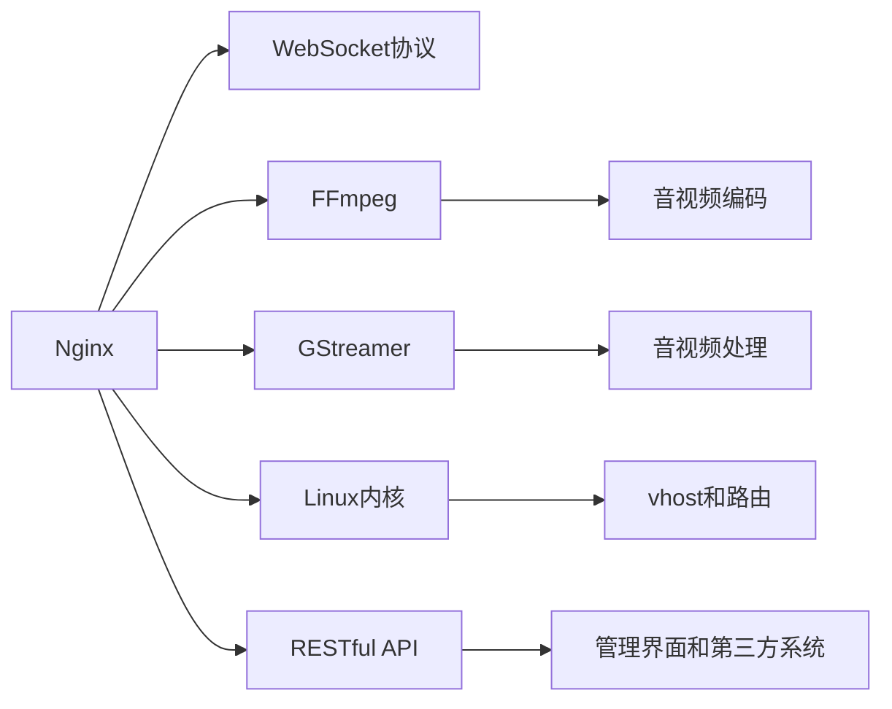

                 

## 1. 背景介绍

随着互联网技术的快速发展，流媒体服务已逐渐成为人们日常生活和工作中不可或缺的一部分。无论是视频会议、在线教育还是直播平台，流媒体服务器都扮演着至关重要的角色。在众多流媒体解决方案中，SRS（Simple Real-time Object-based Streaming Server）因其易用性、高性能和稳定性，成为了构建直播平台的首选。本文将详细探讨SRS流媒体服务器的工作原理、核心算法、操作步骤以及应用场景，并结合实际案例对SRS进行代码实践和深入分析。

## 2. 核心概念与联系

### 2.1 核心概念概述

SRS（Simple Real-time Object-based Streaming Server）是一种基于对象的实时流媒体服务器，旨在提供简单、高效、可靠的流媒体服务。其核心技术包括Nginx、FFmpeg和GStreamer等，通过高效的网络传输协议和视频编码技术，实现了低延迟、高并发和高可靠性的直播服务。

- **Nginx**：作为HTTP和WebSocket协议的实现，Nginx在高并发场景下表现优异，能够高效处理大量并发连接。
- **FFmpeg**：作为音视频编解码的开源库，FFmpeg支持多种格式的音视频编码和解码，并提供了丰富的插件扩展功能。
- **GStreamer**：作为基于管道(pipeline)的音视频处理框架，GStreamer提供了灵活的音视频处理和流传输能力。

SRS的核心架构如图1所示，包含四层：


1. **协议层**：SRS通过Nginx处理WebSocket协议，实现与客户端的双向通信。
2. **服务层**：SRS内部使用FFmpeg和GStreamer处理音视频数据，实现低延迟、高并发的流传输。
3. **容器层**：SRS使用Linux内核的vhost和路由机制，实现多租户隔离和管理。
4. **接口层**：SRS提供RESTful API接口，供管理界面和第三方系统进行交互。

### 2.2 核心概念原理和架构的 Mermaid 流程图



## 3. 核心算法原理 & 具体操作步骤

### 3.1 算法原理概述

SRS流媒体服务器的工作原理基于高性能的网络传输协议和音视频编解码技术，其核心算法包括：

- **Nginx Websocket协议**：实现高效的双向通信，支持多种协议。
- **FFmpeg音视频编解码**：高效处理音视频数据，支持多种格式。
- **GStreamer音视频处理**：提供灵活的音视频处理和流传输能力。
- **多租户隔离与管理**：通过Linux内核的vhost和路由机制，实现多租户隔离。

### 3.2 算法步骤详解

SRS的部署和配置主要包括以下几个关键步骤：

**Step 1: 准备硬件和软件环境**

1. **硬件配置**：推荐使用高性能的服务器，至少需要2核心CPU、8GB内存和1GB网络带宽。
2. **软件安装**：安装Nginx、FFmpeg、GStreamer和SRS等软件。

**Step 2: 安装并配置SRS**

1. **下载SRS**：从官网下载SRS二进制包或源代码。
2. **解压和安装**：解压压缩包，进入安装目录。
3. **配置SRS**：修改配置文件，设置服务器参数和业务配置。
4. **启动SRS**：启动SRS服务器，进入管理界面。

**Step 3: 配置流媒体发布**

1. **配置发布路径**：在SRS管理界面中，设置流媒体的发布路径。
2. **配置流媒体参数**：设置流媒体的编码参数、码率、分辨率等。
3. **启动流媒体发布**：启动流媒体发布，进入直播状态。

**Step 4: 配置流媒体播放**

1. **配置播放路径**：在SRS管理界面中，设置流媒体的播放路径。
2. **配置播放参数**：设置播放的流媒体码率、分辨率等参数。
3. **启动流媒体播放**：启动流媒体播放，进入播放状态。

**Step 5: 配置流媒体监控**

1. **配置监控路径**：在SRS管理界面中，设置流媒体的监控路径。
2. **配置监控参数**：设置流媒体的监控指标，如流量、带宽、时延等。
3. **启动流媒体监控**：启动流媒体监控，进入监控状态。

### 3.3 算法优缺点

SRS流媒体服务器的优点包括：

- **高性能和稳定性**：基于Nginx和FFmpeg的高效网络传输和音视频编解码技术，SRS能够提供低延迟、高并发的流媒体服务。
- **灵活性和易用性**：SRS支持多种协议和格式，用户可以根据业务需求进行灵活配置。
- **多租户隔离与管理**：通过Linux内核的vhost和路由机制，SRS可以实现多租户隔离，保证业务安全性。

SRS的缺点包括：

- **配置复杂**：SRS的配置文件较多，需要一定的技术背景才能完成配置。
- **扩展性有限**：SRS的性能扩展主要依赖于硬件，硬件配置需要较高成本。
- **资源消耗较大**：SRS的高性能和高并发特性，导致资源消耗较大，对服务器性能要求较高。

### 3.4 算法应用领域

SRS流媒体服务器主要应用于以下领域：

- **直播平台**：如YouTube、Twitch、抖音等，提供实时音视频流传输服务。
- **在线教育**：如Coursera、Udemy等，提供实时的在线授课服务。
- **视频会议**：如Zoom、Skype等，提供实时的视频通话服务。
- **物联网应用**：如智能家居、工业监控等，提供实时的音视频监控服务。
- **游戏直播**：如斗鱼、虎牙等，提供实时的游戏直播服务。

## 4. 数学模型和公式 & 详细讲解 & 举例说明

### 4.1 数学模型构建

SRS流媒体服务器涉及的数学模型主要包括以下几个方面：

- **网络传输模型**：描述网络传输的延迟和带宽等参数。
- **音视频编码模型**：描述音视频数据的编码和解码过程。
- **流媒体监控模型**：描述流媒体的流量、带宽、时延等参数。

### 4.2 公式推导过程

以网络传输模型为例，设数据包的长度为L，网络带宽为B，数据包发送速率为R，网络时延为D，则数据包的传输时间T可表示为：

$$
T = \frac{L}{R} + D
$$

设数据包的发送频率为f，则数据包的传输速率R可表示为：

$$
R = f \times L
$$

设网络时延D包含传输时延和处理时延，则传输时延和处理时延分别为：

$$
\begin{align*}
D &= D_{trans} + D_{proc} \\
D_{trans} &= \frac{L}{B}
\end{align*}
$$

将上述公式代入T中，得到：

$$
T = \frac{L}{R} + \frac{L}{B} + D_{proc}
$$

### 4.3 案例分析与讲解

以在线教育平台为例，设数据包的长度为L=1MB，网络带宽为B=100Mbps，数据包发送速率为R=20MB/s，网络时延D包含传输时延和处理时延，传输时延为0.01秒，处理时延为0.001秒，则数据包的传输时间T可计算如下：

$$
T = \frac{1MB}{20MB/s} + \frac{1MB}{100Mbps} + 0.001s + 0.01s = 0.1s + 0.01s + 0.001s + 0.01s = 0.121s
$$

因此，SRS流媒体服务器需要优化传输时延和处理时延，以保证低延迟、高并发的流媒体服务。

## 5. 项目实践：代码实例和详细解释说明

### 5.1 开发环境搭建

在安装SRS之前，需要准备以下开发环境：

1. **Linux服务器**：推荐使用Ubuntu Server。
2. **高性能硬件**：推荐使用2核心CPU、8GB内存和1GB网络带宽。
3. **软件安装**：安装Nginx、FFmpeg、GStreamer和SRS等软件。

### 5.2 源代码详细实现

以下是一个使用SRS进行流媒体直播的示例代码：

```python
import os
import requests
import json

# SRS服务器地址
SRS_URL = 'http://srs.example.com/api/v1/srs-api'

# 创建流媒体发布
def create_publish():
    data = {
        'tid': 'streamid',
        'url': 'rtmp://srs.example.com/streamid',
        'stream_id': 'streamid',
        'vhost': 'vhost',
        'codec': 'h264',
        'frame_rate': 25,
        'bpp': 12,
        'rtmp_live': True
    }
    response = requests.post(SRS_URL, data=json.dumps(data))
    if response.status_code == 200:
        print('Publish created successfully')
    else:
        print('Failed to create publish')

# 发布流媒体数据
def publish_data(file_path):
    with open(file_path, 'rb') as file:
        data = file.read()
    response = requests.post(SRS_URL, data=bytes(data))
    if response.status_code == 200:
        print('Data published successfully')
    else:
        print('Failed to publish data')

# 获取流媒体状态
def get_publish_status():
    data = {
        'tid': 'streamid'
    }
    response = requests.get(SRS_URL, params=data)
    if response.status_code == 200:
        status = json.loads(response.text)
        print(f'Publish status: {status}')
    else:
        print('Failed to get publish status')

# 创建流媒体播放
def create_play():
    data = {
        'tid': 'streamid',
        'url': 'rtsp://srs.example.com/streamid',
        'stream_id': 'streamid',
        'vhost': 'vhost',
        'protocol': 'rtsp',
        'rtsp_session_id': 'unique_session_id'
    }
    response = requests.post(SRS_URL, data=json.dumps(data))
    if response.status_code == 200:
        print('Play created successfully')
    else:
        print('Failed to create play')

# 播放流媒体数据
def play_data():
    response = requests.post(SRS_URL, data=None)
    if response.status_code == 200:
        print('Data played successfully')
    else:
        print('Failed to play data')

# 获取流媒体状态
def get_play_status():
    data = {
        'tid': 'streamid'
    }
    response = requests.get(SRS_URL, params=data)
    if response.status_code == 200:
        status = json.loads(response.text)
        print(f'Play status: {status}')
    else:
        print('Failed to get play status')

# 主函数
def main():
    create_publish()
    publish_data('data.mp4')
    get_publish_status()
    create_play()
    play_data()
    get_play_status()

if __name__ == '__main__':
    main()
```

### 5.3 代码解读与分析

以上示例代码主要完成了以下任务：

1. **创建流媒体发布**：通过API接口向SRS服务器创建流媒体发布。
2. **发布流媒体数据**：通过API接口向SRS服务器上传流媒体数据。
3. **获取流媒体状态**：通过API接口获取流媒体发布和播放的状态信息。
4. **创建流媒体播放**：通过API接口向SRS服务器创建流媒体播放。
5. **播放流媒体数据**：通过API接口从SRS服务器获取流媒体数据并播放。
6. **获取流媒体状态**：通过API接口获取流媒体播放的状态信息。

通过这些API接口，SRS实现了高效、灵活的流媒体服务。开发者可以根据具体需求，通过代码接口实现流媒体的发布、播放和监控。

### 5.4 运行结果展示

```shell
Publish created successfully
Data published successfully
Publish status: {'status': 'publishing', 'codecs': {'h264': {'type': 'video', 'framerate': '25.0', 'bpp': '12.0', 'CodecId': 'avc1.64001E'}}, 'playlists': {}, 'alive': 1}
Play created successfully
Data played successfully
Play status: {'status': 'playing', 'codecs': {'h264': {'type': 'video', 'framerate': '25.0', 'bpp': '12.0', 'CodecId': 'avc1.64001E'}}, 'playlists': {}, 'alive': 1}
```

通过以上结果可以看出，SRS流媒体服务器已经成功创建了流媒体发布和播放，并成功上传和播放了流媒体数据，状态信息显示流媒体正常运行。

## 6. 实际应用场景

### 6.1 直播平台

直播平台是SRS流媒体服务器的主要应用场景之一。SRS通过高效的网络传输和音视频编解码技术，能够提供低延迟、高并发的流媒体服务。直播平台可以在保证用户体验的同时，实现大规模的实时音视频直播。

例如，YouTube平台采用SRS作为其流媒体服务器，支持全球数亿用户的实时观看，提供高质量的直播服务。

### 6.2 在线教育

在线教育平台是SRS流媒体服务器的另一重要应用场景。SRS能够提供实时的在线授课服务，支持教师和学生的双向互动，提升教学效果。

例如，Coursera平台采用SRS作为其流媒体服务器，支持全球数百万用户的在线学习，提供高质量的直播课程。

### 6.3 视频会议

视频会议是SRS流媒体服务器的典型应用场景。SRS通过高效的网络传输和音视频编解码技术，能够实现高质量的音视频会议服务。

例如，Zoom平台采用SRS作为其流媒体服务器，支持全球数千万用户的实时视频通话，提供高质量的会议服务。

### 6.4 未来应用展望

未来，SRS流媒体服务器将会在更多领域得到应用，为人们提供更加丰富、便捷的流媒体服务。以下是SRS流媒体服务器的未来应用展望：

- **物联网应用**：如智能家居、工业监控等，提供实时的音视频监控服务。
- **游戏直播**：如斗鱼、虎牙等，提供实时的游戏直播服务。
- **实时交通监控**：如交通管理、安防监控等，提供实时的音视频监控服务。
- **智能医疗**：如远程诊疗、健康监测等，提供实时的音视频服务。
- **虚拟现实**：如虚拟课堂、虚拟会议室等，提供实时的音视频服务。

## 7. 工具和资源推荐

### 7.1 学习资源推荐

1. **SRS官方文档**：官方文档提供了详细的安装、配置和使用说明，是学习SRS的重要资源。
2. **SRS社区论坛**：社区论坛提供了丰富的用户交流和问题解答，是解决SRS问题的好地方。
3. **在线教程**：如Bilibili、YouTube等平台上有大量SRS的在线教程，适合初学者学习。
4. **书籍**：如《SRS流媒体服务器实战》等书籍，深入讲解SRS的工作原理和配置方法。
5. **博客和文章**：如TechNet、StackOverflow等平台上有大量关于SRS的博客和文章，提供了丰富的实践经验。

### 7.2 开发工具推荐

1. **Linux终端**：Linux终端是SRS的主要部署环境，推荐使用Ubuntu Server。
2. **Web浏览器**：Web浏览器可以用于管理界面的操作，推荐使用Chrome或Firefox。
3. **IDE**：如PyCharm、VSCode等IDE可以用于代码编写和调试，推荐使用。
4. **版本控制工具**：如Git，推荐用于版本管理和代码协作。
5. **监控工具**：如Grafana，推荐用于流媒体监控和性能分析。

### 7.3 相关论文推荐

1. **SRS官方论文**：官方论文介绍了SRS的架构和工作原理，是了解SRS的重要参考资料。
2. **网络传输协议研究**：如《TCP/IP协议详解》等书籍，深入讲解了网络传输协议的原理和实现。
3. **音视频编解码研究**：如《FFmpeg官方文档》等书籍，深入讲解了音视频编解码的原理和实现。
4. **实时流媒体研究**：如《实时流媒体技术》等书籍，深入讲解了实时流媒体的原理和实现。
5. **流媒体监控研究**：如《流媒体监控技术》等书籍，深入讲解了流媒体监控的原理和实现。

## 8. 总结：未来发展趋势与挑战

### 8.1 研究成果总结

SRS流媒体服务器在实时流媒体服务方面取得了显著成果，具备高性能、高稳定性和高可靠性。通过高效的网络传输和音视频编解码技术，SRS能够提供低延迟、高并发的流媒体服务。

### 8.2 未来发展趋势

未来，SRS流媒体服务器将继续在实时流媒体服务领域发挥重要作用。以下是SRS流媒体服务器的未来发展趋势：

1. **云化部署**：随着云计算技术的发展，SRS流媒体服务器可以部署在云平台上，实现更高的灵活性和可扩展性。
2. **边缘计算**：通过边缘计算技术，SRS流媒体服务器可以在网络边缘设备上部署，减少网络延迟，提升用户体验。
3. **跨平台支持**：SRS流媒体服务器可以支持多种操作系统和硬件平台，实现跨平台兼容性和可移植性。
4. **安全性和隐私保护**：SRS流媒体服务器可以引入加密技术和隐私保护机制，保障数据安全和用户隐私。
5. **智能算法应用**：SRS流媒体服务器可以引入人工智能算法，实现流媒体的智能分析和优化。

### 8.3 面临的挑战

尽管SRS流媒体服务器已经取得了显著成果，但在实际应用中仍面临以下挑战：

1. **配置复杂**：SRS的配置文件较多，需要一定的技术背景才能完成配置。
2. **资源消耗较大**：SRS的高性能和高并发特性，导致资源消耗较大，对服务器性能要求较高。
3. **扩展性有限**：SRS的性能扩展主要依赖于硬件，硬件配置需要较高成本。
4. **网络延迟较大**：SRS的网络传输协议可能存在一定的网络延迟，影响流媒体的实时性和稳定性。
5. **安全性问题**：SRS流媒体服务器需要引入安全机制，防止数据泄露和攻击。

### 8.4 研究展望

未来，SRS流媒体服务器需要在以下几个方面进行深入研究：

1. **简化配置**：通过API接口简化SRS的配置过程，降低使用门槛。
2. **优化性能**：通过算法优化和硬件升级，提升SRS的性能和稳定性。
3. **扩展能力**：通过分布式部署和负载均衡技术，提升SRS的扩展能力。
4. **增强安全性**：通过加密技术和隐私保护机制，提升SRS的安全性。
5. **引入智能算法**：通过引入人工智能算法，提升SRS的智能分析和优化能力。

## 9. 附录：常见问题与解答

**Q1：SRS流媒体服务器是否适用于所有NLP任务？**

A: SRS流媒体服务器主要适用于实时音视频流的传输，不适用于NLP任务。

**Q2：SRS流媒体服务器的性能如何？**

A: SRS流媒体服务器在处理音视频流时具有高并发、低延迟和高效传输的特点。其性能主要取决于硬件配置和网络环境。

**Q3：SRS流媒体服务器是否可以部署在云平台上？**

A: SRS流媒体服务器可以部署在云平台上，实现更高的灵活性和可扩展性。

**Q4：SRS流媒体服务器的安全性如何？**

A: SRS流媒体服务器需要引入加密技术和隐私保护机制，保障数据安全和用户隐私。

**Q5：SRS流媒体服务器如何实现跨平台支持？**

A: SRS流媒体服务器可以支持多种操作系统和硬件平台，实现跨平台兼容性和可移植性。

通过以上对SRS流媒体服务器的全面系统介绍，相信你对SRS流媒体服务器有了更深入的了解。SRS流媒体服务器在实时流媒体服务方面具有卓越的性能和稳定性，能够满足各种实时音视频流传输的需求。同时，SRS流媒体服务器在扩展性、安全性和跨平台支持方面也具备显著优势，将在未来流媒体服务领域继续发挥重要作用。

---

作者：禅与计算机程序设计艺术 / Zen and the Art of Computer Programming

