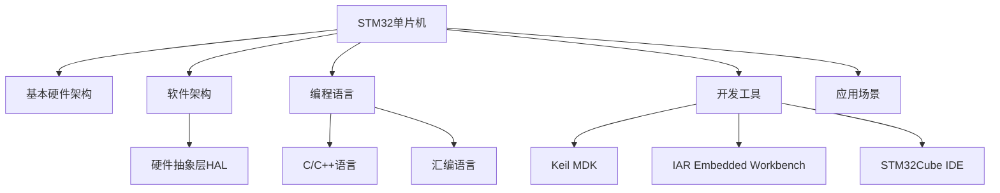

                 

# STM32单片机开发：从点亮LED到复杂控制系统

STM32单片机作为一款高性能的微控制器，近年来在嵌入式领域的应用越来越广泛。从简单的点亮LED灯，到复杂的控制系统，STM32单片机都能应对。本文将带领读者深入了解STM32单片机的开发，从基本入门到复杂系统，逐步揭秘其开发的奥秘。

## 1. 背景介绍

### 1.1 问题由来

STM32单片机是STMicroelectronics公司推出的一款基于ARM Cortex-M系列核心的微控制器，广泛应用于工业控制、物联网、智能家居等领域。近年来，随着嵌入式系统需求的不断增长，STM32单片机成为了开发者们入门嵌入式开发的首选。然而，对于初学者来说，STM32单片机的开发并不是一件容易的事情，需要掌握其基本概念和开发流程。

### 1.2 问题核心关键点

STM32单片机开发的关键在于掌握其基本硬件和软件架构，熟悉其编程语言和开发工具，以及理解其应用场景和系统设计。主要包括以下几个方面：

1. 基本硬件架构：包括CPU、存储器、I/O口、通信接口等基本硬件模块。
2. 软件架构：包括操作系统、驱动程序、中间件等软件模块。
3. 编程语言：包括C/C++语言、汇编语言等嵌入式编程语言。
4. 开发工具：包括Keil MDK、IAR Embedded Workbench、STM32Cube IDE等集成开发环境。
5. 应用场景：包括控制系统、传感器节点、智能家居等嵌入式应用场景。

## 2. 核心概念与联系

### 2.1 核心概念概述

为了更好地理解STM32单片机开发，本节将介绍几个密切相关的核心概念：

1. 单片机（MCU）：一种集成处理器、存储器、I/O口等功能的微型计算机，广泛应用于工业控制、物联网等领域。
2. STM32：STMicroelectronics公司推出的一款基于ARM Cortex-M系列核心的单片机，具有高性能、低功耗、丰富的外设等特点。
3. 嵌入式系统：由硬件和软件组成的专用于特定应用领域的计算机系统，广泛应用于消费电子、工业控制等领域。
4. 硬件抽象层（HAL）：STM32单片机的一种软件设计模式，将硬件模块和上层软件模块分离，提高软件开发的灵活性和可维护性。
5. STM32Cube IDE：STM32单片机官方提供的集成开发环境，集成了HAL库、库函数、开发工具等资源，方便开发者进行开发。

这些核心概念之间的逻辑关系可以通过以下Mermaid流程图来展示：



这个流程图展示了一些关键概念及其之间的关系：

1. STM32单片机通过硬件架构和软件架构实现其功能。
2. STM32单片机支持C/C++语言和汇编语言进行编程。
3. STM32单片机开发需要使用开发工具进行编译和调试。
4. STM32单片机可以应用于控制系统、传感器节点、智能家居等应用场景。
5. STM32单片机支持硬件抽象层设计，提高软件开发的灵活性和可维护性。

## 3. 核心算法原理 & 具体操作步骤

### 3.1 算法原理概述

STM32单片机开发的基本流程包括以下几个步骤：

1. 硬件设计：根据应用需求设计硬件电路，选择单片机型号，设计外设接口。
2. 软件开发：编写程序代码，配置外设参数，调试系统功能。
3. 系统测试：测试系统功能，调整优化程序。
4. 系统部署：将系统部署到实际应用中，进行维护和升级。

这些步骤涉及到硬件、软件、测试等多个方面，需要综合考虑，才能完成STM32单片机系统的开发。

### 3.2 算法步骤详解

下面详细介绍STM32单片机开发的各个步骤：

#### 3.2.1 硬件设计

硬件设计是STM32单片机开发的基础，包括以下几个方面：

1. 单片机选择：根据应用需求选择合适的单片机型号，如STM32F103C8T6。
2. 电路设计：根据单片机引脚和外设需求，设计电路板布局和连接。
3. 外设接口：设计外设接口，如I/O口、串口、定时器、SPI等。

#### 3.2.2 软件开发

软件开发是STM32单片机开发的核心，包括以下几个方面：

1. 编写代码：根据硬件设计，编写程序代码，使用C/C++语言或汇编语言。
2. 配置外设：配置单片机外设参数，如时钟、I/O口、定时器等。
3. 调试系统：使用调试工具进行程序调试，检查系统功能。

#### 3.2.3 系统测试

系统测试是STM32单片机开发的保障，包括以下几个方面：

1. 功能测试：测试系统功能是否正常，检查代码是否正确。
2. 性能测试：测试系统性能，如响应时间、稳定性等。
3. 故障排除：排除系统故障，优化程序性能。

#### 3.2.4 系统部署

系统部署是STM32单片机开发的最后一步，包括以下几个方面：

1. 应用部署：将系统部署到实际应用中，如物联网设备、控制系统等。
2. 系统维护：维护系统功能，升级软件版本。
3. 故障处理：处理系统故障，保障系统稳定运行。

## 4. 数学模型和公式 & 详细讲解 & 举例说明

### 4.1 数学模型构建

STM32单片机开发中，常见的数学模型包括I/O口、定时器、SPI等外设的配置和控制。下面以定时器为例，介绍STM32单片机定时器的数学模型。

假设STM32单片机内部有定时器TIM1，定时器时钟为72MHz，定时器周期为1ms，采样频率为1kHz，则定时器的数学模型为：

$$
\text{周期} = \frac{1}{72 \times 10^6} = 1.39 \text{ms}
$$

$$
\text{采样周期} = \frac{1}{1 \times 10^3} = 1 \text{ms}
$$

$$
\text{采样频率} = \frac{1}{1} = 1 \text{kHz}
$$

### 4.2 公式推导过程

定时器的数学模型推导如下：

1. 定时器周期：根据定时器时钟和计数器值，计算出定时器周期。
2. 采样周期：根据定时器周期和采样频率，计算出采样周期。
3. 采样频率：根据定时器周期和采样周期，计算出采样频率。

### 4.3 案例分析与讲解

下面以STM32单片机I/O口为例，介绍I/O口的数学模型和公式推导过程。

假设STM32单片机内部有GPIO端口，引脚为PA0，配置为输入模式，采样频率为100kHz，则I/O口的数学模型为：

$$
\text{采样周期} = \frac{1}{100 \times 10^3} = 10 \text{ms}
$$

$$
\text{采样频率} = \frac{1}{10} = 100 \text{kHz}
$$

## 5. 项目实践：代码实例和详细解释说明

### 5.1 开发环境搭建

在进行STM32单片机开发前，需要准备好开发环境，包括以下几个方面：

1. 开发板：购买STM32开发板，如STM32F103C8T6。
2. 开发软件：安装STM32Cube IDE集成开发环境。
3. 开发库：下载STM32Cube库函数，配置HAL库。

### 5.2 源代码详细实现

下面以STM32单片机I/O口为例，介绍I/O口的编程实现。

```c
#include "stm32.h"

int main(void)
{
    RCC_AHB1PeriphClockCmd(RCC_AHB1Periph_GPIOA, ENABLE);
    GPIO_InitTypeDef GPIO_InitStructure;
    GPIO_InitStructure.GPIO_Mode = GPIO_Mode_IN;
    GPIO_InitStructure.GPIO_Pin = GPIO_Pin_0;
    GPIO_InitStructure.GPIO_Speed = GPIO_Speed_50MHz;
    GPIO_InitStructure.GPIO_Owenr = GPIO_Owenr_Disable;
    GPIO_Init(GPIOA, &GPIO_InitStructure);

    while(1)
    {
        if(GPIO_ReadInputBit(GPIOA, GPIO_Pin_0))
        {
            printf("I/O input high\n");
        }
        else
        {
            printf("I/O input low\n");
        }
    }
}
```

### 5.3 代码解读与分析

上面这段代码实现了STM32单片机I/O口的读取功能。具体分析如下：

1. 初始化GPIO端口：打开GPIOA时钟，配置GPIO0为输入模式。
2. 读取I/O口状态：通过GPIO_ReadInputBit函数读取GPIO0状态，判断是否为高电平或低电平。
3. 输出结果：根据读取结果，输出I/O口状态信息。

## 6. 实际应用场景

### 6.1 智能家居控制

STM32单片机可以应用于智能家居控制系统中，实现对各种家电设备的控制。例如，通过STM32单片机读取遥控器信号，控制空调、电视等设备。

### 6.2 工业控制系统

STM32单片机可以应用于工业控制系统中，实现对各种设备的控制和监控。例如，通过STM32单片机读取传感器数据，控制机器人臂运动。

### 6.3 物联网设备

STM32单片机可以应用于物联网设备中，实现数据的采集和处理。例如，通过STM32单片机读取温度、湿度等传感器数据，上传到云端进行分析。

## 7. 工具和资源推荐

### 7.1 学习资源推荐

为了帮助开发者系统掌握STM32单片机开发的知识，这里推荐一些优质的学习资源：

1. 《STM32嵌入式开发实战》：全面介绍了STM32单片机的硬件和软件开发，包括硬件设计、编程语言、开发工具等。
2. STM32Cube官方文档：STM32单片机官方提供的文档，详细介绍了硬件和软件接口，方便开发者进行开发。
3. STM32Cube库函数：STM32单片机官方提供的库函数，方便开发者进行编程。

### 7.2 开发工具推荐

STM32单片机开发需要使用一些常用的工具，包括以下几个方面：

1. STM32Cube IDE：STM32单片机官方提供的集成开发环境，集成了HAL库、库函数、开发工具等资源。
2. Keil MDK：STM32单片机常用的编译工具，支持C/C++语言和汇编语言。
3. IAR Embedded Workbench：STM32单片机常用的开发工具，支持调试和测试功能。

### 7.3 相关论文推荐

STM32单片机开发涉及到多个领域，以下是几篇代表性的相关论文，推荐阅读：

1. "STM32单片机I/O口驱动设计"：介绍了STM32单片机I/O口的驱动设计，详细讲解了硬件和软件接口。
2. "STM32单片机定时器应用设计"：介绍了STM32单片机定时器的应用设计，详细讲解了定时器的数学模型和编程实现。
3. "STM32单片机嵌入式系统设计"：介绍了STM32单片机嵌入式系统的设计，详细讲解了系统架构和编程方法。

## 8. 总结：未来发展趋势与挑战

### 8.1 总结

本文对STM32单片机开发进行了全面系统的介绍。首先阐述了STM32单片机的背景和开发流程，明确了硬件和软件开发的关键点。其次，从原理到实践，详细讲解了STM32单片机定时器、I/O口等外设的数学模型和编程实现。最后，探讨了STM32单片机的应用场景和未来发展趋势。

通过本文的系统梳理，可以看到，STM32单片机开发不仅需要掌握硬件和软件设计，还需要进行系统的集成和优化。只有不断学习和实践，才能掌握STM32单片机的开发技能，为未来的应用打下坚实的基础。

### 8.2 未来发展趋势

展望未来，STM32单片机开发将呈现以下几个发展趋势：

1. 高精度采集：随着传感器技术的进步，STM32单片机将支持更高精度、更高频率的数据采集。
2. 低功耗设计：随着物联网设备的普及，STM32单片机将进一步优化功耗设计，延长设备使用寿命。
3. 系统集成：STM32单片机将与其他硬件和软件系统进行深度集成，提高系统的整体性能。
4. 智能控制：STM32单片机将支持更多的智能控制算法，提高系统的自动化和智能化水平。
5. 边缘计算：STM32单片机将支持边缘计算功能，提高数据处理的实时性和安全性。

以上趋势凸显了STM32单片机开发的前景广阔，STM32单片机必将在未来的嵌入式系统中扮演越来越重要的角色。

### 8.3 面临的挑战

尽管STM32单片机开发具有广泛的应用前景，但在实际应用中仍面临一些挑战：

1. 硬件设计复杂：STM32单片机硬件接口复杂，需要设计师具备丰富的硬件设计经验。
2. 软件开发难度高：STM32单片机编程语言和调试工具需要开发者具备较强的编程能力和调试经验。
3. 系统集成难度大：STM32单片机需要与其他硬件和软件系统进行深度集成，需要设计师具备较强的系统集成能力。
4. 数据处理复杂：STM32单片机需要处理大量的传感器数据，需要进行高效的数据处理和分析。

这些挑战需要开发者不断学习和实践，才能克服。

### 8.4 研究展望

未来，STM32单片机开发的研究方向主要包括以下几个方面：

1. 硬件优化设计：优化STM32单片机硬件设计，提高性能和稳定性。
2. 软件优化设计：优化STM32单片机软件设计，提高开发效率和系统性能。
3. 系统优化设计：优化STM32单片机系统设计，提高系统集成和应用水平。
4. 新材料新工艺：研究新材料和新工艺，提高STM32单片机的性能和可靠性。

这些研究方向将引领STM32单片机开发技术的不断进步，推动嵌入式系统的发展和应用。

## 9. 附录：常见问题与解答

**Q1: STM32单片机如何选择型号？**

A: STM32单片机型号的选择需要考虑多个因素，如应用需求、成本、性能等。一般建议根据应用需求选择合适型号，如处理速度、外设接口、功耗等。

**Q2: STM32单片机如何进行外设配置？**

A: STM32单片机外设配置需要根据应用需求进行，一般通过编写程序代码或使用HAL库进行配置。

**Q3: STM32单片机如何进行程序调试？**

A: STM32单片机程序调试需要借助调试工具，如STM32Cube IDE等，通过调试器进行程序调试。

**Q4: STM32单片机如何进行系统测试？**

A: STM32单片机系统测试需要设计测试方案，进行功能测试、性能测试、故障排除等，确保系统功能正常，性能稳定。

**Q5: STM32单片机如何进行系统部署？**

A: STM32单片机系统部署需要考虑实际应用场景，进行设备安装、调试、维护等工作，确保系统正常运行。

---

作者：禅与计算机程序设计艺术 / Zen and the Art of Computer Programming

