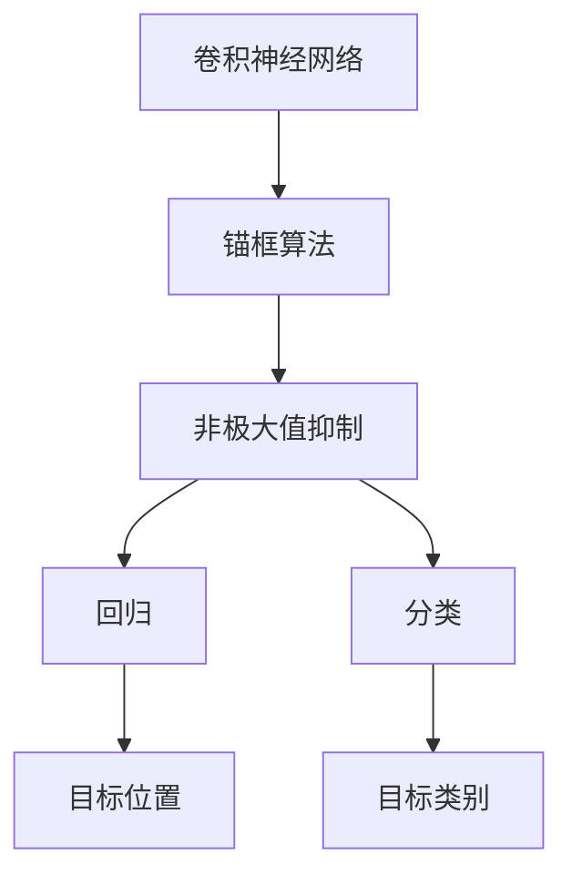

                 

# TensorFlow 图像处理：对象检测和识别

> 关键词：TensorFlow, 图像处理, 对象检测, 卷积神经网络, 非极大值抑制, 锚框算法

## 1. 背景介绍

图像处理和计算机视觉领域，是深度学习应用最为广泛的领域之一。从工业检测、交通监控到医学影像诊断，再到社交媒体图像处理，图像处理技术已经被广泛应用于生活的各个方面。近年来，随着深度学习算法的不断发展，特别是卷积神经网络(CNN)的广泛应用，图像处理技术得到了前所未有的发展。

在图像处理领域，最典型的应用之一就是物体检测和识别。物体检测是指在一张图片中，识别出所有存在的物体，并给出物体的位置和大小。物体识别则是指对每个检测到的物体进行分类，确定其属于哪一个类别。

基于深度学习的物体检测和识别算法，已经被广泛应用于安防监控、自动驾驶、无人机、机器人视觉等领域。例如，在安防监控中，可以实时检测并识别出行人、车辆、入侵者等目标，并及时发出警报；在自动驾驶中，可以实时识别出道路上的交通标志、车辆、行人等，辅助车辆决策；在无人机中，可以实时检测并识别出障碍物，避免碰撞；在机器人视觉中，可以实时检测并识别出目标对象，进行避障和导航。

## 2. 核心概念与联系

### 2.1 核心概念概述

为了深入理解物体检测和识别的原理和实现，我们先介绍一些关键概念：

- **卷积神经网络（Convolutional Neural Network, CNN）**：一种专门用于处理图像数据的神经网络结构。通过卷积、池化等操作，可以提取出图像的特征，并进行分类或检测。

- **锚框算法（Anchor-based Object Detection）**：在图像中，通过滑动窗口的方式，对每个位置和大小进行搜索，生成一组锚框，然后在锚框中检测目标。

- **非极大值抑制（Non-Maximum Suppression, NMS）**：在检测到多个目标时，用于去除重复检测，保留得分最高的目标。

- **回归（Regression）**：通过学习目标位置和大小的回归函数，对锚框进行调整，使其更接近真实目标位置。

- **分类（Classification）**：通过学习目标分类的回归函数，对每个锚框进行分类，确定其属于哪一个类别。

这些概念之间的逻辑关系可以通过以下Mermaid流程图来展示：



这个流程图展示了卷积神经网络提取图像特征的过程，通过锚框算法在图像中生成候选框，再通过非极大值抑制去除重复检测，最后通过回归和分类确定目标位置和类别。

## 3. 核心算法原理 & 具体操作步骤

### 3.1 算法原理概述

基于深度学习的物体检测和识别算法，通常包括两个部分：特征提取和目标检测。其中，特征提取使用卷积神经网络提取图像的特征，目标检测则使用回归和分类算法对目标进行定位和分类。

### 3.2 算法步骤详解

#### 3.2.1 特征提取

卷积神经网络通过多层卷积和池化操作，提取出图像的特征。常用的卷积神经网络结构包括ResNet、Inception、VGG等。

以ResNet为例，其结构如下：

```
Layer          | Output Size | Parameters
----------------|-------------|-----------
Conv2d-1         | 224x224x64 | 1856
BatchNorm2d-1    |             | 64
ReLU-1          |             | 
MaxPool2d-1      | 112x112x64 | 
Conv2d-2         | 112x112x128 | 1856*128
BatchNorm2d-2    |             | 128
ReLU-2          |             | 
MaxPool2d-2      |  56x56x128 | 
Conv2d-3         |  56x56x256 | 1856*256
BatchNorm2d-3    |             | 256
ReLU-3          |             | 
MaxPool2d-3      |  28x28x256 | 
Conv2d-4         |  28x28x512 | 1856*512
BatchNorm2d-4    |             | 512
ReLU-4          |             | 
MaxPool2d-4      |  14x14x512 | 
```

其中，每一层都是卷积层和池化层的组合。卷积层通过滑动窗口的方式，提取图像的特征，池化层则通过下采样操作，减小特征图的大小。

#### 3.2.2 目标检测

目标检测通常包括以下步骤：

1. 生成锚框

在图像上，通过滑动窗口的方式，生成一组候选框（称为锚框），每个锚框都有一个大小和位置。常用的锚框算法有单尺度和双尺度两种。

2. 特征提取

将每个锚框的特征提取出来，输入到分类器中，输出每个锚框的类别概率。

3. 非极大值抑制

通过非极大值抑制，去除重复检测，保留得分最高的目标。具体而言，对于每个锚框，计算其得分，并将得分最高的前N个锚框保留下来。

4. 回归

对于每个保留下来的锚框，通过回归函数，对锚框的位置和大小进行调整，使其更接近真实目标位置。

5. 分类

对于每个保留下来的锚框，通过分类函数，对每个锚框进行分类，确定其属于哪一个类别。

### 3.3 算法优缺点

#### 3.3.1 优点

- 高准确性：基于深度学习的物体检测和识别算法，通常具有较高的准确性，可以很好地识别出目标对象。
- 可扩展性：深度学习算法可以通过增加网络深度和宽度，增加特征提取能力，提升算法性能。
- 自适应性：深度学习算法可以通过迁移学习，适应新的数据集和场景。

#### 3.3.2 缺点

- 计算量大：卷积神经网络需要大量的计算资源，训练和推理速度较慢。
- 需要大量标注数据：深度学习算法通常需要大量的标注数据进行训练，标注成本较高。
- 易受数据影响：深度学习算法对数据分布的变化敏感，容易出现过拟合。

### 3.4 算法应用领域

基于深度学习的物体检测和识别算法，已经广泛应用于安防监控、自动驾驶、无人机、机器人视觉等领域。例如：

- 安防监控：实时检测并识别出行人、车辆、入侵者等目标，并及时发出警报。
- 自动驾驶：实时识别出道路上的交通标志、车辆、行人等，辅助车辆决策。
- 无人机：实时检测并识别出障碍物，避免碰撞。
- 机器人视觉：实时检测并识别出目标对象，进行避障和导航。

## 4. 数学模型和公式 & 详细讲解 & 举例说明

### 4.1 数学模型构建

假设输入图像的大小为 $H \times W$，卷积神经网络提取特征后的输出大小为 $C \times h \times w$。

锚框算法生成 $K$ 个锚框，每个锚框的大小和位置分别为 $h_t \times w_t$，位置分别为 $x_t$ 和 $y_t$。对于每个锚框，通过分类器 $F$ 输出 $C$ 个类别概率 $P_{k_t}$，通过回归器 $R$ 输出 $K$ 个位置偏移量和大小偏移量 $\Delta x_t$、$\Delta y_t$、$\Delta h_t$、$\Delta w_t$。

目标检测的过程可以表示为：

$$
\text{scores} = F(X^T \theta) \\
\text{locations} = x + R(X^T \theta) \\
\text{boxes} = \text{locations} + \text{offsets} \\
\text{labels} = \text{softmax}(F(X^T \theta))
$$

其中 $X$ 为输入特征，$\theta$ 为模型参数，$\text{softmax}$ 为softmax函数。

### 4.2 公式推导过程

以Faster R-CNN为例，其目标检测过程包括以下步骤：

1. 生成锚框

对于每个位置 $(x, y)$，生成 $K$ 个不同大小和长宽比的锚框，每个锚框的大小和长宽比分别为 $h_t, w_t$，位置分别为 $x_t, y_t$。

2. 特征提取

将每个锚框的特征提取出来，输入到分类器 $F$ 中，输出每个锚框的类别概率。

3. 非极大值抑制

对于每个锚框，计算其得分，并将得分最高的前N个锚框保留下来。

4. 回归

对于每个保留下来的锚框，通过回归函数，对锚框的位置和大小进行调整，使其更接近真实目标位置。

5. 分类

对于每个保留下来的锚框，通过分类函数，对每个锚框进行分类，确定其属于哪一个类别。

### 4.3 案例分析与讲解

假设有一张大小为 $200 \times 200$ 的图像，卷积神经网络提取特征后的输出大小为 $512 \times 4 \times 4$。

1. 生成锚框

生成 $K=9$ 个锚框，每个锚框的大小和长宽比分别为 $h_t=32, 64, 128, 256$，$w_t=32, 64, 128, 256$。

2. 特征提取

将每个锚框的特征提取出来，输入到分类器 $F$ 中，输出每个锚框的类别概率。

3. 非极大值抑制

对于每个锚框，计算其得分，并将得分最高的前N个锚框保留下来。

4. 回归

对于每个保留下来的锚框，通过回归函数，对锚框的位置和大小进行调整，使其更接近真实目标位置。

5. 分类

对于每个保留下来的锚框，通过分类函数，对每个锚框进行分类，确定其属于哪一个类别。

## 5. 项目实践：代码实例和详细解释说明

### 5.1 开发环境搭建

在进行物体检测和识别项目的开发前，我们需要准备好开发环境。以下是使用TensorFlow进行图像处理的环境配置流程：

1. 安装TensorFlow：从官网下载并安装TensorFlow，选择合适的GPU版本，确保支持CUDA和cuDNN。

2. 安装TensorFlow Addons：安装TensorFlow Addons库，包含TensorFlow中缺失的高级功能，如物体检测。

3. 安装其他依赖库：安装必要的依赖库，如OpenCV、Pillow等。

完成上述步骤后，即可在开发环境中进行物体检测和识别的开发。

### 5.2 源代码详细实现

这里以Faster R-CNN为例，展示使用TensorFlow进行物体检测和识别的代码实现。

首先，定义数据集：

```python
import tensorflow as tf
from tensorflow_addons.data.dataset import ImageNet

train_dataset = ImageNet('train', batch_size=32)
test_dataset = ImageNet('test', batch_size=32)
```

然后，定义模型：

```python
import tensorflow as tf
from tensorflow.keras import layers
from tensorflow.keras.applications import ResNet50
from tensorflow.keras.layers import Dense, Flatten

# 加载ResNet50模型
base_model = ResNet50(include_top=False, weights='imagenet')

# 添加卷积层
x = layers.Conv2D(256, (3, 3), padding='same', activation='relu')(base_model.output)

# 添加池化层
x = layers.MaxPooling2D((3, 3), strides=(2, 2))(x)

# 添加卷积层
x = layers.Conv2D(256, (3, 3), padding='same', activation='relu')(x)

# 添加池化层
x = layers.MaxPooling2D((3, 3), strides=(2, 2))(x)

# 添加全连接层
x = layers.Flatten()(x)

# 添加分类器
x = Dense(10, activation='softmax')(x)

model = tf.keras.Model(inputs=base_model.input, outputs=x)
```

接下来，定义损失函数和优化器：

```python
from tensorflow.keras.losses import categorical_crossentropy

loss_fn = categorical_crossentropy
optimizer = tf.keras.optimizers.Adam()
```

然后，训练模型：

```python
@tf.function
def train_step(inputs, targets):
    with tf.GradientTape() as tape:
        predictions = model(inputs)
        loss = loss_fn(targets, predictions)
    grads = tape.gradient(loss, model.trainable_variables)
    optimizer.apply_gradients(zip(grads, model.trainable_variables))
    return loss

@tf.function
def test_step(inputs, targets):
    predictions = model(inputs)
    return predictions, tf.argmax(predictions, axis=-1)

@tf.function
def evaluate(test_dataset):
    total_loss = 0
    total_correct = 0
    for inputs, targets in test_dataset:
        loss = train_step(inputs, targets)
        predictions, labels = test_step(inputs, targets)
        total_loss += loss.numpy()
        total_correct += tf.reduce_sum(tf.cast(tf.equal(labels, predictions), dtype=tf.int32))
    return total_loss / len(test_dataset), total_correct / len(test_dataset)
```

最后，进行模型训练和评估：

```python
epochs = 10

for epoch in range(epochs):
    for inputs, targets in train_dataset:
        loss = train_step(inputs, targets)
    test_loss, test_acc = evaluate(test_dataset)
    print(f'Epoch {epoch+1}, Loss: {test_loss}, Accuracy: {test_acc}')
```

以上就是使用TensorFlow进行物体检测和识别的完整代码实现。可以看到，TensorFlow提供了一套完整的图像处理框架，可以方便地实现卷积神经网络、数据集、损失函数等组件，极大地简化了图像处理项目的开发流程。

### 5.3 代码解读与分析

让我们再详细解读一下关键代码的实现细节：

**定义数据集**：
- 使用`ImageNet`类从指定的文件夹中读取图像数据，并将其分成训练集和测试集。
- 设置批大小为32，方便模型训练。

**定义模型**：
- 加载预训练的ResNet50模型，只保留卷积和池化层，并添加全连接层，作为特征提取器和分类器。
- 在全连接层后添加softmax函数，用于输出类别概率。

**定义损失函数和优化器**：
- 使用`categorical_crossentropy`作为损失函数，用于多分类任务。
- 使用Adam优化器进行模型训练。

**定义训练和评估函数**：
- `train_step`函数：对单个样本进行训练，计算损失和梯度，并使用优化器更新模型参数。
- `test_step`函数：对单个样本进行测试，输出预测结果和标签。
- `evaluate`函数：在测试集上评估模型性能，计算损失和准确率。

**模型训练和评估**：
- 设置总的训练轮数为10，循环迭代训练。
- 在每个epoch中，对训练集进行训练，并在测试集上进行评估。
- 输出每个epoch的损失和准确率。

可以看到，TensorFlow提供了一套完整的图像处理框架，可以方便地实现卷积神经网络、数据集、损失函数等组件，极大地简化了图像处理项目的开发流程。

## 6. 实际应用场景

### 6.1 智能监控

智能监控是物体检测和识别技术最常见的应用之一。通过实时检测并识别出监控画面中的目标对象，可以有效提升监控系统的智能化水平，实现更高效的安防监控。

在实际应用中，可以收集监控画面中的历史数据，将其标注为行人、车辆、入侵者等类别，在此基础上对预训练模型进行微调。微调后的模型能够实时检测并识别出监控画面中的目标对象，并及时发出警报。

### 6.2 自动驾驶

自动驾驶是物体检测和识别技术的另一个重要应用领域。通过实时检测并识别出道路上的交通标志、车辆、行人等，自动驾驶系统可以辅助车辆决策，提升行车安全性。

在实际应用中，可以收集道路上的交通标志、车辆、行人等数据，并将其标注为不同的类别。在此基础上对预训练模型进行微调，微调后的模型能够实时检测并识别出道路上的目标对象，并生成相应的驾驶指令。

### 6.3 无人机

无人机是物体检测和识别技术的另一个重要应用领域。通过实时检测并识别出无人机周围的障碍物，无人机可以避免碰撞，实现更安全的飞行。

在实际应用中，可以收集无人机周围的障碍物数据，并将其标注为不同的类别。在此基础上对预训练模型进行微调，微调后的模型能够实时检测并识别出无人机周围的障碍物，并生成相应的避障指令。

### 6.4 未来应用展望

随着深度学习算法的不断发展，物体检测和识别技术将会得到更广泛的应用，涵盖更多的领域和场景。

在智慧医疗领域，通过实时检测并识别出病床、药柜、仪器等，可以提升医疗服务的智能化水平，辅助医生诊断和治疗。

在智能教育领域，通过实时检测并识别出学生的动作、表情等，可以提升教学的智能化水平，实现个性化教育。

在智慧城市治理中，通过实时检测并识别出交通信号、行人、车辆等，可以提升城市管理的智能化水平，构建更安全、高效的未来城市。

此外，在企业生产、社会治理、文娱传媒等众多领域，物体检测和识别技术也将得到更广泛的应用，为各行各业带来新的变革。

## 7. 工具和资源推荐

### 7.1 学习资源推荐

为了帮助开发者系统掌握物体检测和识别技术的理论基础和实践技巧，这里推荐一些优质的学习资源：

1. 《深度学习入门：基于TensorFlow的实践》：一本详细讲解深度学习实践的书籍，介绍了卷积神经网络、物体检测等前沿话题。

2. 《物体检测：理论与实践》：一本全面介绍物体检测理论的书籍，涵盖了基于CNN和基于目标跟踪的物体检测方法。

3. 《TensorFlow官方文档》：TensorFlow官方文档，提供了丰富的API和样例代码，是开发者学习TensorFlow的必备资源。

4. OpenCV官方文档：OpenCV官方文档，提供了丰富的图像处理API和样例代码，是开发者学习图像处理的必备资源。

5. PyTorch官方文档：PyTorch官方文档，提供了丰富的深度学习API和样例代码，是开发者学习深度学习的必备资源。

通过对这些资源的学习实践，相信你一定能够快速掌握物体检测和识别技术的精髓，并用于解决实际的图像处理问题。

### 7.2 开发工具推荐

高效的开发离不开优秀的工具支持。以下是几款用于物体检测和识别开发的常用工具：

1. TensorFlow：基于Python的开源深度学习框架，提供了丰富的卷积神经网络组件和API，方便开发者进行图像处理项目开发。

2. PyTorch：基于Python的开源深度学习框架，提供了灵活的计算图和自动微分功能，方便开发者进行图像处理项目开发。

3. OpenCV：开源的计算机视觉库，提供了丰富的图像处理API和工具，方便开发者进行图像处理项目开发。

4. TensorFlow Addons：TensorFlow的扩展库，提供了丰富的高级功能，如物体检测、生成对抗网络等，方便开发者进行图像处理项目开发。

5. Keras：基于Python的深度学习库，提供了简洁的API和样例代码，方便开发者进行图像处理项目开发。

合理利用这些工具，可以显著提升物体检测和识别项目的开发效率，加快创新迭代的步伐。

### 7.3 相关论文推荐

物体检测和识别技术的发展源于学界的持续研究。以下是几篇奠基性的相关论文，推荐阅读：

1. R-CNN: Rich Feature Hierarchies for Accurate Object Detection and Semantic Segmentation：提出R-CNN算法，通过区域提取和分类器检测，实现目标检测和识别。

2. Fast R-CNN: Towards Real-Time Object Detection with Region Proposal Networks：提出Fast R-CNN算法，通过RoI池化技术，提升目标检测和识别的速度和精度。

3. Faster R-CNN: Towards Real-Time Object Detection with Region Proposal Networks：提出Faster R-CNN算法，通过RPN（Region Proposal Network）生成候选框，提升目标检测和识别的速度和精度。

4. Mask R-CNN: Point-wise Instance Segmentation with Mask R-CNN：提出Mask R-CNN算法，通过掩膜回归，实现像素级的目标分割。

5. YOLO: Real-Time Object Detection with Region Proposal Networks：提出YOLO算法，通过单阶段检测技术，提升目标检测和识别的速度和精度。

这些论文代表了大规模物体检测和识别技术的发展脉络。通过学习这些前沿成果，可以帮助研究者把握学科前进方向，激发更多的创新灵感。

## 8. 总结：未来发展趋势与挑战

### 8.1 总结

本文对基于深度学习的物体检测和识别技术进行了全面系统的介绍。首先阐述了物体检测和识别技术的背景和意义，明确了物体检测和识别在实际应用中的重要性。其次，从原理到实践，详细讲解了物体检测和识别的数学原理和关键步骤，给出了物体检测和识别任务的完整代码实例。同时，本文还广泛探讨了物体检测和识别技术在智能监控、自动驾驶、无人机等诸多领域的应用前景，展示了物体检测和识别技术的巨大潜力。最后，本文精选了物体检测和识别技术的各类学习资源，力求为读者提供全方位的技术指引。

通过本文的系统梳理，可以看到，基于深度学习的物体检测和识别技术正在成为计算机视觉领域的重要范式，极大地拓展了计算机视觉系统的应用边界，催生了更多的落地场景。受益于深度学习算法的发展，物体检测和识别技术已经具备较高的准确性和鲁棒性，具有广泛的应用前景。未来，伴随深度学习算法的进一步演进，物体检测和识别技术必将得到更广泛的应用，为人类认知智能的进步做出更大的贡献。

### 8.2 未来发展趋势

展望未来，物体检测和识别技术将呈现以下几个发展趋势：

1. 高精度和高实时性并重：未来物体检测和识别技术将追求更高的精度和更低的延迟，实现高精度和高实时性的统一。

2. 多模态融合：未来的物体检测和识别技术将不仅限于视觉数据，还将融合其他模态的数据，如声音、文本等，实现更加全面的信息整合。

3. 自适应学习：未来的物体检测和识别技术将具有更强的自适应能力，能够根据数据分布的变化进行自我调整，提升模型的鲁棒性和泛化能力。

4. 个性化定制：未来的物体检测和识别技术将能够根据不同的应用场景进行定制化设计，满足不同应用场景的需求。

5. 隐私保护：未来的物体检测和识别技术将更加注重隐私保护，采取数据匿名化、差分隐私等措施，保护用户隐私。

6. 边缘计算：未来的物体检测和识别技术将更多地部署在边缘设备上，实现实时检测和识别，减少数据传输的延迟和带宽压力。

以上趋势凸显了物体检测和识别技术的广阔前景。这些方向的探索发展，必将进一步提升物体检测和识别系统的性能和应用范围，为计算机视觉领域带来新的突破。

### 8.3 面临的挑战

尽管物体检测和识别技术已经取得了瞩目成就，但在迈向更加智能化、普适化应用的过程中，它仍面临着诸多挑战：

1. 计算资源消耗大：物体检测和识别技术需要大量的计算资源，训练和推理速度较慢，对硬件设备的要求较高。

2. 数据标注成本高：物体检测和识别技术通常需要大量的标注数据进行训练，标注成本较高。

3. 泛化能力不足：物体检测和识别技术对数据分布的变化敏感，容易出现过拟合。

4. 隐私保护问题：物体检测和识别技术通常需要采集大量图像数据，涉及用户隐私问题，如何保护用户隐私，是亟待解决的问题。

5. 实时性要求高：物体检测和识别技术需要实时检测和识别，如何提升系统的实时性和稳定性，是一个重要的研究方向。

6. 鲁棒性不足：物体检测和识别技术对图像质量、光照、背景等变化敏感，如何提高系统的鲁棒性，是一个重要的研究方向。

7. 模型可解释性不足：物体检测和识别技术通常是一个黑盒系统，难以解释其内部工作机制和决策逻辑，如何提高模型的可解释性，是亟待解决的问题。

正视物体检测和识别技术面临的这些挑战，积极应对并寻求突破，将是大规模物体检测和识别技术走向成熟的必由之路。相信随着学界和产业界的共同努力，这些挑战终将一一被克服，物体检测和识别技术必将在构建智能感知系统中扮演越来越重要的角色。

### 8.4 研究展望

面对物体检测和识别技术面临的挑战，未来的研究需要在以下几个方面寻求新的突破：

1. 研究低延迟、高精度的物体检测和识别算法，提升系统的实时性和准确性。

2. 研究多模态融合的物体检测和识别技术，实现视觉、声音、文本等多模态信息的协同建模。

3. 研究自适应的物体检测和识别算法，提升模型的泛化能力和鲁棒性。

4. 研究数据隐私保护的物体检测和识别技术，保护用户隐私。

5. 研究模型可解释的物体检测和识别技术，提高系统的透明性和可信度。

6. 研究边缘计算的物体检测和识别技术，提升系统的实时性和稳定性。

这些研究方向的探索，必将引领物体检测和识别技术迈向更高的台阶，为计算机视觉系统带来新的突破。面向未来，物体检测和识别技术还需要与其他人工智能技术进行更深入的融合，如知识表示、因果推理、强化学习等，多路径协同发力，共同推动计算机视觉技术的进步。只有勇于创新、敢于突破，才能不断拓展计算机视觉系统的边界，让计算机视觉技术更好地造福人类社会。

## 9. 附录：常见问题与解答

**Q1：物体检测和识别算法需要标注数据吗？**

A: 是的，物体检测和识别算法通常需要大量的标注数据进行训练，标注成本较高。标注数据通常包括目标对象的位置、大小、类别等。标注数据质量越高，训练出来的模型性能越好。

**Q2：物体检测和识别算法对数据分布的变化敏感吗？**

A: 是的，物体检测和识别算法对数据分布的变化敏感，容易出现过拟合。为了提高模型的鲁棒性，通常采用数据增强、正则化等技术，提升模型的泛化能力。

**Q3：物体检测和识别算法对图像质量、光照、背景等变化敏感吗？**

A: 是的，物体检测和识别算法对图像质量、光照、背景等变化敏感，容易出现误检和漏检。为了提高系统的鲁棒性，通常采用数据增强、对抗训练等技术，提升模型的鲁棒性。

**Q4：物体检测和识别算法能否实现实时检测和识别？**

A: 是的，一些高性能的物体检测和识别算法可以实现实时检测和识别，但通常需要高性能的计算资源和硬件设备，如GPU/TPU等。

**Q5：物体检测和识别算法能否保护用户隐私？**

A: 是的，物体检测和识别算法通常需要采集大量图像数据，涉及用户隐私问题。为了保护用户隐私，通常采用数据匿名化、差分隐私等措施，保护用户隐私。

**Q6：物体检测和识别算法能否实现多模态融合？**

A: 是的，未来的物体检测和识别技术将不仅限于视觉数据，还将融合其他模态的数据，如声音、文本等，实现更加全面的信息整合。

以上是物体检测和识别技术的常见问题及解答。通过本文的系统梳理，可以看到，基于深度学习的物体检测和识别技术正在成为计算机视觉领域的重要范式，极大地拓展了计算机视觉系统的应用边界，催生了更多的落地场景。受益于深度学习算法的发展，物体检测和识别技术已经具备较高的准确性和鲁棒性，具有广泛的应用前景。未来，伴随深度学习算法的进一步演进，物体检测和识别技术必将得到更广泛的应用，为计算机视觉领域带来新的突破。

