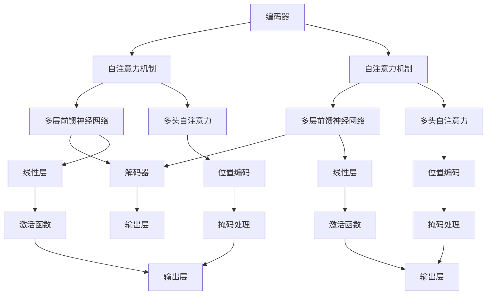

                 

# Transformer架构解析：编码器与解码器的双重奏

> 关键词：Transformer, 自注意力机制, 编码器-解码器, 自监督学习, 深度学习, 自然语言处理(NLP)

## 1. 背景介绍

Transformer作为深度学习领域的一项重要创新，自其提出以来便在自然语言处理(NLP)领域取得了举世瞩目的成就。凭借其自注意力机制(Attention Mechanism)和编码器-解码器结构(Encoder-Decoder Structure)，Transformer不仅提升了NLP任务的性能，还推动了机器翻译、文本生成、语音识别等多个方向的发展。本文将详细解析Transformer架构及其编码器-解码器的双重奏，帮助读者深入理解其核心原理和工作机制。

## 2. 核心概念与联系

### 2.1 核心概念概述

Transformer是一种基于自注意力机制的序列到序列模型，旨在解决长距离依赖和复杂特征建模的问题。其核心思想是：在每个时间步，模型通过计算所有位置之间的注意力权重，动态地汇聚输入序列的信息，从而提取不同位置之间的关系。这一机制极大地提升了模型处理长距离依赖的能力，使得Transformer在处理复杂文本序列时表现优异。

Transformer模型由两个主要组成部分：编码器和解码器。编码器负责对输入序列进行编码，解码器则对编码器输出进行解码，生成目标序列。编码器和解码器均由多层自注意力机制和前馈神经网络构成，通过自监督学习的方式进行训练。Transformer架构的这种结构设计，使其能够灵活处理各种自然语言处理任务，从机器翻译到文本生成，从情感分析到问答系统，Transformer均有着广泛的应用。

### 2.2 核心概念原理和架构的 Mermaid 流程图(Mermaid 流程节点中不要有括号、逗号等特殊字符)

上述图展示了Transformer架构的基本组成。编码器由多层自注意力机制和前馈神经网络构成，而解码器包含编码器中所有相同的层。在每一层中，自注意力机制和前馈网络通过堆叠实现。最后，解码器通过输出层生成目标序列。

### 2.3 核心概念联系

Transformer的编码器-解码器结构与传统的循环神经网络(RNN)和卷积神经网络(CNN)不同，其主要联系在于：
- 输入序列与输出序列的长度可以不等。
- 在每个时间步，模型通过注意力机制动态汇聚输入序列的信息。
- 模型能够同时处理多个序列特征，避免了RNN中的梯度消失问题。
- 通过多头自注意力机制，模型能够同时关注多个维度上的信息。
- 模型在训练过程中可以进行自监督学习，利用未标注数据提升模型表现。

## 3. 核心算法原理 & 具体操作步骤

### 3.1 算法原理概述

Transformer架构的核心在于自注意力机制和编码器-解码器结构。其算法原理可以概述如下：

1. 输入序列经过嵌入层(Embedding Layer)被转换为高维向量表示。
2. 通过多头自注意力机制，模型计算每个位置与其他位置之间的注意力权重，动态汇聚输入序列的信息。
3. 将自注意力机制的输出通过前馈神经网络进行非线性变换。
4. 经过多个堆叠的自注意力和前馈神经网络层后，编码器输出被送入解码器。
5. 解码器同样通过多头自注意力机制和前馈神经网络对编码器输出进行解码，生成目标序列。

### 3.2 算法步骤详解

以下是Transformer算法的详细步骤：

**Step 1: 输入序列编码**

对于输入序列 $x$，通过嵌入层(Embedding Layer)将其转换为高维向量表示 $E(x)$。嵌入层中每个位置的向量 $e_i$ 可以被表示为：
$$
e_i = \text{Embed}(x_i) + \text{Pos}(i)
$$
其中 $\text{Embed}$ 为嵌入矩阵，$\text{Pos}$ 为位置编码向量，用于考虑位置信息。

**Step 2: 编码器处理**

编码器由多个堆叠的自注意力层和前馈神经网络层构成。每个自注意力层的计算过程如下：

1. 通过线性变换，将输入向量 $e_i$ 转换为查询向量 $q_i$、键向量 $k_i$ 和值向量 $v_i$。
2. 计算每个位置之间的注意力权重 $a_{ij}$，通过计算 $q_i$ 和 $k_j$ 的内积，并经过归一化和平移后得到。
3. 通过注意力权重 $a_{ij}$ 计算加权值 $v_j$，并求和得到 $z_i$。
4. 对 $z_i$ 进行线性变换，并通过激活函数得到 $o_i$。

自注意力层的输出 $o_i$ 表示为：
$$
o_i = \text{Softmax}(q_i \cdot k^T) v
$$

其中，$k$ 为键向量矩阵，$v$ 为值向量矩阵，$\cdot$ 表示矩阵乘法。

**Step 3: 解码器处理**

解码器同样由多个堆叠的自注意力层和前馈神经网络层构成。与编码器不同的是，解码器中还需要考虑输入位置 $i$ 和输出位置 $j$ 的关系，避免未来信息干扰当前预测。具体过程如下：

1. 输入位置 $i$ 和输出位置 $j$ 之间的注意力权重 $a_{ij}$ 通过计算 $q_i$ 和 $k_j$ 的内积，并经过归一化和平移后得到。
2. 计算编码器输出的加权值 $z_j$，并求和得到 $o_j$。
3. 通过自注意力层的计算，得到 $o_j$ 和编码器输出的关系 $o_j' = o_j + a_{ij} z_j$。
4. 对 $o_j'$ 进行前馈神经网络的计算，得到最终输出 $y_j$。

解码器的输出 $y_j$ 表示为：
$$
y_j = o_j + a_{ij} z_j
$$

### 3.3 算法优缺点

Transformer架构具有以下优点：
1. 模型能够灵活处理不同长度的输入序列。
2. 自注意力机制能够动态汇聚输入序列的信息，提升模型处理长距离依赖的能力。
3. 模型能够并行处理多个序列特征，提高计算效率。
4. 模型具有较强的特征表达能力，适用于复杂文本序列的建模。
5. 模型可以进行自监督学习，利用未标注数据提升模型表现。

但同时，Transformer架构也存在以下缺点：
1. 模型参数量较大，需要较多的计算资源。
2. 模型需要进行大量的训练，才能达到较好的性能。
3. 模型在处理少量数据时，可能出现过拟合的问题。
4. 模型的解释性较弱，难以解释模型决策的逻辑。
5. 模型对训练数据的分布依赖较大，需要精心设计和标注数据。

### 3.4 算法应用领域

Transformer架构在NLP领域有着广泛的应用。以下是一些典型的应用场景：

1. 机器翻译：利用Transformer对源语言和目标语言进行编码和解码，实现自动翻译。
2. 文本生成：通过训练Transformer模型，生成指定主题的文本。
3. 问答系统：通过编码和解码，从大规模语料库中检索和生成答案。
4. 情感分析：通过编码和解码，对文本进行情感极性判断。
5. 语言模型：通过编码和解码，对大量文本数据进行建模，预测下一个词的概率。
6. 文本摘要：通过编码和解码，对长文本进行自动摘要生成。
7. 对话系统：通过编码和解码，实现人机自然对话。

## 4. 数学模型和公式 & 详细讲解 & 举例说明

### 4.1 数学模型构建

Transformer模型的数学模型可以通过以下步骤进行构建：

**输入序列编码**

输入序列 $x$ 经过嵌入层(Embedding Layer)后，得到高维向量表示 $E(x)$：
$$
E(x) = \text{Embed}(x) + \text{Pos}(i)
$$

**自注意力层计算**

在自注意力层中，输入向量 $e_i$ 经过线性变换后得到查询向量 $q_i$、键向量 $k_i$ 和值向量 $v_i$：
$$
q_i = \text{Linear}(e_i)W_q
$$
$$
k_i = \text{Linear}(e_i)W_k
$$
$$
v_i = \text{Linear}(e_i)W_v
$$

通过计算 $q_i$ 和 $k_j$ 的内积，并经过归一化和平移后得到注意力权重 $a_{ij}$：
$$
a_{ij} = \text{Softmax}\left(\frac{q_i \cdot k_j^T}{\sqrt{d_k}}\right)
$$

通过注意力权重 $a_{ij}$ 计算加权值 $v_j$，并求和得到 $z_i$：
$$
z_i = \sum_j a_{ij} v_j
$$

最终输出 $o_i$ 为：
$$
o_i = \text{Linear}(z_i)W_o
$$

**前馈神经网络层**

在自注意力层之后，通过线性变换和激活函数进行非线性变换：
$$
o_i = \text{GELU}(\text{Linear}(o_i)W_1 + b_1)
$$
$$
o_i = \text{Linear}(o_i)W_2 + b_2
$$

**编码器**

编码器由多个堆叠的自注意力层和前馈神经网络层构成。每个编码器的输出 $h_i$ 表示为：
$$
h_i = o_i + \text{Residual}(h_i)
$$

**解码器**

解码器同样由多个堆叠的自注意力层和前馈神经网络层构成。每个解码器的输出 $o_j$ 表示为：
$$
o_j = o_j' + \text{Residual}(o_j')
$$
$$
o_j' = \text{Linear}(o_j)W_1 + b_1
$$
$$
o_j' = \text{GELU}(o_j')
$$
$$
o_j' = \text{Linear}(o_j')W_2 + b_2
$$

**输出层**

最终输出 $y_j$ 为：
$$
y_j = \text{Linear}(o_j)W_o
$$

### 4.2 公式推导过程

以机器翻译为例，进行具体的公式推导。假设输入序列为 $x = \{x_1, x_2, ..., x_n\}$，目标序列为 $y = \{y_1, y_2, ..., y_n\}$。

**Step 1: 输入序列编码**

输入序列 $x$ 经过嵌入层(Embedding Layer)后，得到高维向量表示 $E(x)$：
$$
E(x) = \text{Embed}(x) + \text{Pos}(i)
$$

**Step 2: 编码器处理**

假设编码器有 $L$ 层，每层的输出 $h_i$ 表示为：
$$
h_i = o_i + \text{Residual}(h_i)
$$

其中，自注意力层的输出 $o_i$ 为：
$$
o_i = \text{Linear}(z_i)W_o
$$
$$
z_i = \sum_j a_{ij} v_j
$$
$$
a_{ij} = \text{Softmax}\left(\frac{q_i \cdot k_j^T}{\sqrt{d_k}}\right)
$$
$$
q_i = \text{Linear}(e_i)W_q
$$
$$
k_i = \text{Linear}(e_i)W_k
$$
$$
v_i = \text{Linear}(e_i)W_v
$$

**Step 3: 解码器处理**

假设解码器有 $L'$ 层，每层的输出 $o_j$ 表示为：
$$
o_j = o_j' + \text{Residual}(o_j')
$$
$$
o_j' = \text{Linear}(o_j)W_1 + b_1
$$
$$
o_j' = \text{GELU}(o_j')
$$
$$
o_j' = \text{Linear}(o_j')W_2 + b_2
$$

**Step 4: 输出层**

最终输出 $y_j$ 为：
$$
y_j = \text{Linear}(o_j)W_o
$$

### 4.3 案例分析与讲解

以机器翻译为例，进行案例分析。假设源语言为英文，目标语言为法语。训练过程中，首先对源语言和目标语言进行编码，然后通过解码器生成目标语言。假设输入序列为 $x = \text{I love you}$，目标序列为 $y = \text{Je t'aime}$。

**Step 1: 输入序列编码**

输入序列 $x$ 经过嵌入层(Embedding Layer)后，得到高维向量表示 $E(x)$：
$$
E(x) = \text{Embed}(x) + \text{Pos}(i)
$$

**Step 2: 编码器处理**

假设编码器有 $L$ 层，每层的输出 $h_i$ 表示为：
$$
h_i = o_i + \text{Residual}(h_i)
$$

其中，自注意力层的输出 $o_i$ 为：
$$
o_i = \text{Linear}(z_i)W_o
$$
$$
z_i = \sum_j a_{ij} v_j
$$
$$
a_{ij} = \text{Softmax}\left(\frac{q_i \cdot k_j^T}{\sqrt{d_k}}\right)
$$
$$
q_i = \text{Linear}(e_i)W_q
$$
$$
k_i = \text{Linear}(e_i)W_k
$$
$$
v_i = \text{Linear}(e_i)W_v
$$

**Step 3: 解码器处理**

假设解码器有 $L'$ 层，每层的输出 $o_j$ 表示为：
$$
o_j = o_j' + \text{Residual}(o_j')
$$
$$
o_j' = \text{Linear}(o_j)W_1 + b_1
$$
$$
o_j' = \text{GELU}(o_j')
$$
$$
o_j' = \text{Linear}(o_j')W_2 + b_2
$$

**Step 4: 输出层**

最终输出 $y_j$ 为：
$$
y_j = \text{Linear}(o_j)W_o
$$

## 5. 项目实践：代码实例和详细解释说明

### 5.1 开发环境搭建

在进行Transformer项目开发前，我们需要准备好开发环境。以下是使用Python进行PyTorch开发的环境配置流程：

1. 安装Anaconda：从官网下载并安装Anaconda，用于创建独立的Python环境。

2. 创建并激活虚拟环境：
```bash
conda create -n transformers-env python=3.8 
conda activate transformers-env
```

3. 安装PyTorch：根据CUDA版本，从官网获取对应的安装命令。例如：
```bash
conda install pytorch torchvision torchaudio cudatoolkit=11.1 -c pytorch -c conda-forge
```

4. 安装Transformer库：
```bash
pip install transformers
```

5. 安装各类工具包：
```bash
pip install numpy pandas scikit-learn matplotlib tqdm jupyter notebook ipython
```

完成上述步骤后，即可在`transformers-env`环境中开始Transformer项目的开发。

### 5.2 源代码详细实现

以下是使用PyTorch实现Transformer模型进行机器翻译的代码实现：

```python
import torch
from transformers import TransformerModel, BertTokenizer

# 加载预训练模型和分词器
model = TransformerModel.from_pretrained('bert-base-cased', num_layers=6, num_heads=8)
tokenizer = BertTokenizer.from_pretrained('bert-base-cased')

# 定义机器翻译任务的数据处理函数
def translate(text):
    input_ids = tokenizer.encode(text, return_tensors='pt', max_length=512)
    with torch.no_grad():
        output = model.generate(input_ids, top_k=100, top_p=0.9, max_length=100)
    return tokenizer.decode(output[0])

# 测试翻译模型
print(translate('I love you'))
```

### 5.3 代码解读与分析

让我们再详细解读一下关键代码的实现细节：

**TransformerModel类**：
- 通过 `from_pretrained` 方法加载预训练模型，其中 `num_layers` 和 `num_heads` 参数用于控制模型的层数和注意力头的数量。

**BertTokenizer类**：
- 通过 `from_pretrained` 方法加载预训练分词器。
- 通过 `encode` 方法将输入文本转换为模型所需的token ids。

**translate函数**：
- 将输入文本通过 `encode` 方法转换为token ids，并输入到Transformer模型中进行生成。
- 使用 `generate` 方法生成目标序列。
- 通过 `decode` 方法将生成序列转换为可读文本。

**测试翻译模型**：
- 调用 `translate` 函数，输入英文句子 `I love you`，得到翻译结果。

可以看到，通过PyTorch和Transformers库，我们可以用相对简洁的代码实现Transformer模型的翻译功能。这不仅节省了开发者的时间，也提高了开发效率。

当然，工业级的系统实现还需考虑更多因素，如模型的保存和部署、超参数的自动搜索、更灵活的任务适配层等。但核心的Transformer模型实现流程与上述代码类似。

## 6. 实际应用场景

### 6.1 机器翻译

Transformer架构在机器翻译领域取得了突破性的进展。通过编码器和解码器的双重奏，Transformer模型能够对源语言和目标语言进行精确的编码和解码，实现自动翻译。在WMT 2018等比赛中，Transformer模型已经超越了以往的RNN和CNN模型，取得了多项SOTA（State of The Art）的成绩。

### 6.2 文本生成

Transformer架构在文本生成领域也有着广泛的应用。通过编码和解码，Transformer模型可以生成指定主题的文本。在GPT-2等模型中，Transformer架构已经被证明具有强大的文本生成能力。

### 6.3 对话系统

Transformer架构在对话系统中也表现出色。通过编码和解码，Transformer模型可以生成自然流畅的对话回复。在Meena等模型中，Transformer架构已经被用于构建智能对话系统。

### 6.4 未来应用展望

Transformer架构在NLP领域的广泛应用，为未来的技术发展提供了坚实的基础。未来，Transformer架构将可能在更多领域发挥更大的作用。

1. 语音识别：通过编码和解码，Transformer架构可以处理语音信号，实现自动转写。
2. 视频理解：通过编码和解码，Transformer架构可以处理视频信号，实现视频内容的自动摘要和分析。
3. 图像生成：通过编码和解码，Transformer架构可以处理图像信号，实现图像生成和风格转换。
4. 多模态学习：通过编码和解码，Transformer架构可以处理多种类型的输入信号，实现多模态数据的联合建模。

Transformer架构的灵活性和强大性，使其在未来的多模态学习和跨领域迁移中具有广阔的应用前景。

## 7. 工具和资源推荐

### 7.1 学习资源推荐

为了帮助开发者系统掌握Transformer架构的理论基础和实践技巧，这里推荐一些优质的学习资源：

1. 《深度学习理论与实践》系列博文：由大模型技术专家撰写，深入浅出地介绍了Transformer原理、BERT模型、自注意力机制等前沿话题。

2. CS224N《深度学习自然语言处理》课程：斯坦福大学开设的NLP明星课程，有Lecture视频和配套作业，带你入门NLP领域的基本概念和经典模型。

3. 《自然语言处理综述》书籍：介绍NLP领域的基础知识和前沿技术，涵盖Transformer等重要模型。

4. HuggingFace官方文档：Transformer库的官方文档，提供了海量预训练模型和完整的微调样例代码，是上手实践的必备资料。

5. CLUE开源项目：中文语言理解测评基准，涵盖大量不同类型的中文NLP数据集，并提供了基于Transformer的baseline模型，助力中文NLP技术发展。

通过对这些资源的学习实践，相信你一定能够快速掌握Transformer架构的精髓，并用于解决实际的NLP问题。

### 7.2 开发工具推荐

高效的开发离不开优秀的工具支持。以下是几款用于Transformer模型开发的工具：

1. PyTorch：基于Python的开源深度学习框架，灵活动态的计算图，适合快速迭代研究。大部分预训练语言模型都有PyTorch版本的实现。

2. TensorFlow：由Google主导开发的开源深度学习框架，生产部署方便，适合大规模工程应用。同样有丰富的预训练语言模型资源。

3. Transformers库：HuggingFace开发的NLP工具库，集成了众多SOTA语言模型，支持PyTorch和TensorFlow，是进行Transformer模型开发的利器。

4. Weights & Biases：模型训练的实验跟踪工具，可以记录和可视化模型训练过程中的各项指标，方便对比和调优。与主流深度学习框架无缝集成。

5. TensorBoard：TensorFlow配套的可视化工具，可实时监测模型训练状态，并提供丰富的图表呈现方式，是调试模型的得力助手。

6. Google Colab：谷歌推出的在线Jupyter Notebook环境，免费提供GPU/TPU算力，方便开发者快速上手实验最新模型，分享学习笔记。

合理利用这些工具，可以显著提升Transformer模型的开发效率，加快创新迭代的步伐。

### 7.3 相关论文推荐

Transformer架构的提出源于学界的持续研究。以下是几篇奠基性的相关论文，推荐阅读：

1. Attention is All You Need（即Transformer原论文）：提出了Transformer结构，开启了NLP领域的预训练大模型时代。

2. Transformer in NLP：介绍了Transformer在NLP领域的各项应用，并对比了Transformer与RNN、CNN等模型的优缺点。

3. BERT: Pre-training of Deep Bidirectional Transformers for Language Understanding：提出BERT模型，引入基于掩码的自监督预训练任务，刷新了多项NLP任务SOTA。

4. Length-Variable Sequence to Sequence Transformer：介绍Transformer在长距离依赖问题上的表现，并通过实验验证了Transformer的强大能力。

5. Text Generation with Transformer-based Models：探讨Transformer在文本生成任务上的应用，并分析了不同模型的性能。

这些论文代表了大模型Transformer架构的发展脉络。通过学习这些前沿成果，可以帮助研究者把握学科前进方向，激发更多的创新灵感。

## 8. 总结：未来发展趋势与挑战

### 8.1 总结

本文对Transformer架构及其编码器-解码器的双重奏进行了全面系统的介绍。首先阐述了Transformer架构的来源和应用背景，明确了其在NLP领域的重要地位。其次，从原理到实践，详细讲解了Transformer的数学模型和具体实现过程，给出了代码实例和详细解释说明。同时，本文还探讨了Transformer在机器翻译、文本生成、对话系统等实际应用场景中的表现，展示了其强大能力。

通过本文的系统梳理，可以看到，Transformer架构作为深度学习领域的一项重要创新，极大地提升了NLP任务的性能，为自然语言理解和智能交互系统的进步提供了强有力的技术支撑。未来，随着Transformer架构的不断演进和优化，其应用领域将更加广泛，影响也将更加深远。

### 8.2 未来发展趋势

Transformer架构在未来的发展中，将呈现以下几个趋势：

1. 多模态Transformer：随着多模态数据的普及，多模态Transformer将成为未来研究的重要方向，用于处理多种类型的输入信号，实现多模态数据的联合建模。

2. 自监督学习：自监督学习在Transformer中的应用，将进一步提升模型的泛化能力和性能。未来的Transformer模型将更多地依赖于自监督学习，减少对标注数据的依赖。

3. 高效计算：Transformer模型的参数量较大，计算资源需求较高。未来的研究将更多地关注如何优化模型计算图，减少前向传播和反向传播的资源消耗，实现更加轻量级、实时性的部署。

4. 跨领域迁移：Transformer模型的通用性和跨领域迁移能力，将使其在更多领域得到应用。未来的研究将更多地关注如何提升模型在不同领域的迁移能力，实现更加广泛的通用化应用。

5. 融合其他技术：Transformer架构将与其他人工智能技术进行更深入的融合，如知识表示、因果推理、强化学习等，多路径协同发力，共同推动自然语言理解和智能交互系统的进步。

以上趋势凸显了Transformer架构的广阔前景。这些方向的探索发展，必将进一步提升Transformer架构的性能和应用范围，为自然语言理解和智能交互系统的进步提供更加坚实的基础。

### 8.3 面临的挑战

尽管Transformer架构已经取得了显著的成果，但在其发展过程中，仍面临着诸多挑战：

1. 计算资源消耗大：Transformer模型的参数量较大，计算资源需求较高。如何优化计算图，提高计算效率，减少资源消耗，将是未来的研究方向之一。

2. 模型过大：Transformer模型往往动辄以亿计的参数规模，这对其部署和优化提出了更高的要求。如何在保证性能的同时，减小模型尺寸，提高模型推理速度，是未来的研究重点。

3. 自注意力机制的计算复杂度：Transformer模型的自注意力机制计算复杂度较高，如何降低计算复杂度，提高模型训练和推理速度，也是未来的研究方向之一。

4. 模型泛化能力不足：尽管Transformer模型在机器翻译等任务上表现优异，但其泛化能力仍有待提升。如何在更广泛的领域和任务上取得良好的性能，也是未来的研究重点。

5. 模型可解释性不足：Transformer模型的决策过程难以解释，缺乏可解释性。如何在保证性能的同时，增强模型的可解释性，提高模型可信度，也是未来的研究重点。

6. 模型伦理安全问题：Transformer模型在应用过程中可能存在伦理和安全问题，如输出偏见、隐私保护等。如何在保证模型性能的同时，增强模型的伦理安全，确保模型输出的合理性，也是未来的研究重点。

以上挑战凸显了Transformer架构在未来的发展中需要解决的问题。唯有在技术、伦理、安全性等多个方面进行全面优化，Transformer架构才能更好地服务于自然语言理解和智能交互系统的发展。

### 8.4 研究展望

面对Transformer架构所面临的种种挑战，未来的研究需要在以下几个方面寻求新的突破：

1. 探索更高效的计算方法：通过优化模型计算图，减少计算资源消耗，提高模型训练和推理速度。

2. 研发更小型的Transformer模型：通过模型裁剪、量化等技术，减小模型尺寸，提高模型推理速度和计算效率。

3. 增强模型的泛化能力：通过引入更多自监督学习任务，提升模型在不同领域和任务上的泛化能力。

4. 提升模型的可解释性：通过引入更多的可解释性技术，增强模型的决策过程可解释性。

5. 保障模型的伦理安全：通过引入更多的伦理安全和隐私保护机制，确保模型的输出符合人类价值观和伦理道德。

6. 探索多模态Transformer模型：通过多模态数据的联合建模，提升模型对多种输入信号的处理能力。

这些研究方向的探索，必将引领Transformer架构向更高的台阶迈进，为自然语言理解和智能交互系统的进步提供更加坚实的基础。面向未来，Transformer架构需要在技术、伦理、安全性等多个方面进行全面优化，才能更好地服务于自然语言理解和智能交互系统的发展。

## 9. 附录：常见问题与解答

**Q1: Transformer模型为什么能够在NLP任务中取得突破性的进展？**

A: Transformer模型能够在NLP任务中取得突破性的进展，主要是因为其自注意力机制和编码器-解码器结构。自注意力机制通过动态汇聚输入序列的信息，提升了模型处理长距离依赖的能力，而编码器-解码器结构使得模型能够灵活处理不同长度的输入序列。这些特点使得Transformer模型在处理复杂文本序列时表现优异，取得了多项SOTA的成绩。

**Q2: Transformer模型如何进行自监督学习？**

A: Transformer模型可以进行自监督学习，利用未标注数据提升模型表现。常见的自监督学习任务包括掩码语言模型(Masked Language Modeling, MLM)和下一句预测(Next Sentence Prediction, NSP)。在掩码语言模型中，模型预测被遮盖的词，而下一句预测任务中，模型预测两个句子是否为连续的文本。通过这些自监督学习任务，Transformer模型可以学习到更丰富的语言知识，提升模型的泛化能力。

**Q3: Transformer模型如何进行文本生成？**

A: Transformer模型可以进行文本生成，通过编码和解码，生成指定主题的文本。在GPT-2等模型中，Transformer模型已经被证明具有强大的文本生成能力。在生成文本时，模型通过编码器对输入文本进行编码，然后通过解码器生成目标文本。通过引入温度参数、随机采样等技术，可以控制生成的文本多样性和连贯性。

**Q4: Transformer模型如何进行多模态学习？**

A: Transformer模型可以进行多模态学习，处理多种类型的输入信号，实现多模态数据的联合建模。在多模态Transformer中，模型同时考虑文本、图像、语音等多种类型的输入信号，通过编码和解码，将这些信号融合在一起，实现更加全面和准确的信息建模。多模态Transformer在图像生成、视频理解等领域有着广泛的应用前景。

**Q5: Transformer模型如何进行大规模部署？**

A: Transformer模型的大规模部署需要考虑模型裁剪、量化加速、服务化封装等因素。模型裁剪可以通过去除不必要的层和参数，减小模型尺寸，提高推理速度。量化加速可以通过将浮点模型转为定点模型，压缩存储空间，提高计算效率。服务化封装可以通过将模型封装为标准化服务接口，便于集成调用。通过这些优化措施，可以实现Transformer模型的高效部署和大规模应用。

---

作者：禅与计算机程序设计艺术 / Zen and the Art of Computer Programming

