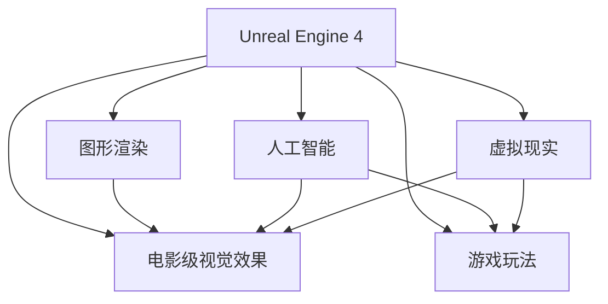

                 

# Unreal Engine 4 游戏开发：电影级的视觉效果和游戏玩法

> 关键词：Unreal Engine 4, 游戏开发, 电影级视觉效果, 游戏玩法, 引擎优化, 图形渲染, 人工智能, 虚拟现实

## 1. 背景介绍

在当今游戏市场，高度逼真的视觉效果和令人沉醉的游戏玩法已经成为了用户关注的焦点。为了满足这一需求，游戏引擎开发逐渐成为游戏行业的重要组成部分。Unreal Engine 4（UE4），由Epic Games开发的一款高度集成的游戏引擎，以其强大的图形渲染能力和灵活的开发环境，成为了行业中的翘楚。本文章将深入介绍UE4在游戏开发中的应用，并探讨其在实现电影级的视觉效果和游戏玩法中的关键技术。

## 2. 核心概念与联系

### 2.1 核心概念概述

为了帮助读者快速进入主题，本节将概述Unreal Engine 4的核心概念及其在实现电影级视觉效果和游戏玩法中的应用：

- **Unreal Engine 4 (UE4)**：由Epic Games开发的游戏引擎，提供高度集成的图形渲染、物理模拟、人工智能、网络通信等功能，适用于各种类型的游戏和应用程序。

- **电影级视觉效果**：通过精细的建模、材质、照明和后期处理技术，使游戏场景、角色和动画等视觉元素达到电影般的品质。

- **游戏玩法**：包括AI交互、物理模拟、角色行为和世界构建等，通过一系列的规则、机制和互动，为玩家提供沉浸式的游戏体验。

- **图形渲染**：使用先进的渲染引擎和算法，如Physically Based Rendering (PBR)、HDR Lighting，实现真实、细腻的视觉体验。

- **人工智能**：集成如行为树、机器学习、自然语言处理等技术，为游戏角色和环境提供智能化的行为和互动。

- **虚拟现实 (VR)**：通过UE4的VR开发支持，创建沉浸式的虚拟环境，提供更真实的交互体验。

这些核心概念构成了Unreal Engine 4在游戏开发中的基础架构，各组件相互协作，共同实现高质量的视觉效果和玩法。

### 2.2 核心概念原理和架构的 Mermaid 流程图



该图展示了Unreal Engine 4核心组件之间的联系。图形渲染、人工智能和虚拟现实技术的应用，是实现电影级视觉效果和游戏玩法的关键技术基础。游戏玩法的实现则依赖于这些技术的支撑。

## 3. 核心算法原理 & 具体操作步骤

### 3.1 算法原理概述

Unreal Engine 4的强大之处在于其集成的高性能图形渲染引擎，支持电影级视觉效果和实时游戏场景的呈现。其核心算法包括：

- **Physically Based Rendering (PBR)技术**：PBR是一种光物理渲染技术，通过模拟实际光照模型，如双向反射分布函数（BRDF）和反射率函数，提高图像的真实感。

- **HDR Lighting**：高动态范围光照，通过扩展色彩范围，使场景更接近真实世界的光照效果，提升图像的对比度、细节和层次感。

- **环境光遮蔽（Ambient Occlusion, AO）**：通过计算场景中各个点与周围环境之间的遮挡关系，模拟实际光线的衰减，增强场景的真实感。

- **全局光照（Global Illumination, GI）**：利用预计算和近似算法，将场景中所有光源照射到每个表面上的光量进行全局整合，从而获得更加真实的光照效果。

- **光线追踪（Ray Tracing）**：使用光线追踪算法，通过计算光线从场景中每一面物体反射的情况，生成高质量的阴影和反射效果。

### 3.2 算法步骤详解

下面将详细介绍Unreal Engine 4实现电影级视觉效果和游戏玩法的关键步骤：

1. **建模和材质**：使用UE4的建模工具，创建精细的3D模型，并应用高精度的材质贴图和光照贴图，实现逼真的渲染效果。

2. **物理模拟和交互**：利用UE4内置的物理引擎，进行刚体和软体的物理模拟，如碰撞检测、摩擦、弹性等，确保角色和环境在互动时真实可信。

3. **光影处理**：使用PBR和HDR光照技术，计算场景中的全局光照、环境光遮蔽和光线追踪，增强场景的真实感和细节。

4. **细节渲染**：应用如屏幕空间反射、动态阴影等技术，提升场景的视觉复杂度，增加细节和层次感。

5. **后期处理**：在渲染完成后，使用UE4的后期处理功能，如色调映射、色彩分级、后期合成等，调整色彩和对比度，增强视觉效果。

6. **AI和行为树**：使用行为树系统，控制角色和环境的行为逻辑，模拟智能化的互动和决策，提升游戏玩法的深度和复杂度。

7. **网络同步和优化**：针对多人在线游戏的特点，优化网络传输和同步机制，确保流畅的游戏体验。

### 3.3 算法优缺点

**优点**：

- **高度集成**：UE4提供了一站式的开发工具链，涵盖了从建模、动画到渲染、物理模拟和AI等多种技术，减少了开发者的集成成本和时间。

- **灵活性高**：支持丰富的插件和扩展，开发者可以灵活定制功能，满足特定的游戏需求。

- **性能优异**：UE4的图形渲染和物理模拟技术，能够在主流硬件上实现高帧率和高质量的视觉效果。

- **跨平台支持**：支持PC、Xbox、PlayStation等多种平台，开发者可以轻松部署和测试游戏。

**缺点**：

- **学习曲线陡峭**：UE4的学习曲线相对较陡，需要开发者具备一定的图形渲染和编程基础。

- **资源密集**：图形渲染和物理模拟技术对硬件要求较高，特别是对图形处理器（GPU）的性能要求，可能限制低配平台的游戏表现。

- **调试复杂**：开发过程中遇到的问题较多，调试工具和流程相对复杂，对开发者的经验要求较高。

### 3.4 算法应用领域

Unreal Engine 4在游戏开发中的应用领域广泛，包括但不限于：

- **PC和主机游戏**：支持各种类型的游戏，如第一人称射击、角色扮演、开放世界冒险等。

- **虚拟现实游戏**：支持VR硬件和设备，提供沉浸式的交互体验，适用于虚拟现实应用。

- **电影和动画**：UE4的渲染技术和后期处理功能，使其也适用于电影和动画制作，支持高质量的视觉效果。

- **跨平台应用**：支持PC、Xbox、PlayStation、移动设备等多种平台，支持跨平台开发和部署。

## 4. 数学模型和公式 & 详细讲解

### 4.1 数学模型构建

Unreal Engine 4的渲染和计算过程涉及复杂的数学模型，其中PBR和HDR光照是最核心的技术。PBR模型的核心在于计算反射率、粗糙度、金属度和清透度等属性，这些属性可以通过数学模型计算得到。

- **反射率 (R)**：表示物体的反射程度，取值范围为0到1。

- **粗糙度 (G)**：表示物体的光滑程度，取值范围为0到1。

- **金属度 (B)**：表示物体的金属特性，取值范围为0到1。

- **清透度 (T)**：表示物体的透明程度，取值范围为0到1。

PBR模型通常使用双向反射分布函数（BRDF）来计算每个像素的反射值，公式如下：

$$ F(\omega_i, \omega_r, \phi) = F_0(\phi) + \frac{F_0(\phi) F_d(\omega_i, \omega_r, \phi)}{4 \pi (n_i n_r \cos \theta_i \cos \theta_r + \varepsilon) } $$

其中，$\omega_i$ 和 $\omega_r$ 分别是入射光和反射光的方向向量，$\phi$ 是入射角度，$n_i$ 和 $n_r$ 分别是入射和反射面的法线方向，$\varepsilon$ 是一个小常数，用于避免分母为0。

### 4.2 公式推导过程

HDR光照则涉及对场景中全局光照的计算，其核心在于对色彩范围的扩展。在LDR光照下，场景中任何物体或光源的光强都可能超过白色（255），无法准确表示。而HDR光照通过扩展色彩范围，使光强可以超过255，更接近真实世界的光照效果。

HDR光照的计算过程可以分解为多个步骤：

1. **预计算光强**：将场景中的所有光源信息收集，计算它们对每个像素的光强贡献。

2. **计算反射光**：使用BRDF模型计算每个像素的反射光，并添加到预计算光强中。

3. **计算间接光**：使用全局光照技术，计算场景中所有表面反射到其他表面的间接光，并添加到预计算光强中。

4. **归一化**：将预计算光强归一化到0到1的范围内，进行渲染。

HDR光照的核心公式为：

$$ L_e(x) = \frac{L_d(x)}{\pi \sqrt{F_x(x)}} + \sum_k L_k(x) \frac{n_x(x)}{\pi} $$

其中，$L_d(x)$ 是直接光源对像素的贡献，$L_k(x)$ 是场景中所有表面对像素的贡献，$F_x(x)$ 是像素的反射率，$n_x(x)$ 是像素的法向量。

### 4.3 案例分析与讲解

以下是一个简单的案例，展示如何使用UE4实现电影级的视觉效果：

**场景设置**：创建一个森林场景，使用高精度纹理和照明贴图，模拟真实的自然光照和阴影效果。

**建模和材质**：

1. 在UE4中导入3D模型，应用高精度纹理，如树叶、树干和地面的纹理。

2. 使用UE4的材质编辑器，为模型添加复杂的材质，如反射、折射和透明效果。

**光影处理**：

1. 设置光源，如太阳光和环境光。

2. 使用PBR和HDR光照技术，计算全局光照、环境光遮蔽和光线追踪，增强场景的真实感。

**细节渲染**：

1. 应用如屏幕空间反射、动态阴影等技术，提升场景的视觉复杂度，增加细节和层次感。

**后期处理**：

1. 在渲染完成后，使用UE4的后期处理功能，如色调映射、色彩分级、后期合成等，调整色彩和对比度，增强视觉效果。

## 5. 项目实践：代码实例和详细解释说明

### 5.1 开发环境搭建

在Unreal Engine 4中开发项目，需要以下开发环境：

1. **安装Unreal Engine 4**：下载并安装UE4，创建新的开发项目。

2. **配置开发环境**：确保计算机满足UE4的硬件要求，安装必要的插件和扩展。

3. **配置开发工具**：安装必要的编辑器插件，如VR支持、物理模拟、动画等。

### 5.2 源代码详细实现

以下是一个简单的代码实例，展示如何在UE4中实现一个简单的角色动画：

1. **创建角色**：在UE4中导入角色模型，如人物模型，并创建动画资产。

2. **动画绑定**：将角色模型绑定到动画资产中，定义关键帧和骨骼动画。

3. **动画播放**：在场景中添加角色，设置动画播放控制器，实现角色的动画播放。

4. **动画调试**：使用UE4的动画调试工具，查看和调整角色的动画效果。

```python
# 创建角色动画示例
from unreal Engine import Animation, Actor, AnimationBluePrint

def create_animation_example():
    # 创建动画蓝图
    animation_blueprint = AnimationBluePrint('SimpleAnimation')

    # 添加骨骼动画
    armature = animation_blueprint.create_armature()

    # 添加动画轨迹
    trajectory = animation_blueprint.add_animation_track()

    # 设置关键帧
    trajectory.add_keyframe(1, rotation=(0, 0, 0), scale=(1, 1, 1))
    trajectory.add_keyframe(2, rotation=(45, 0, 0), scale=(1.1, 1.1, 1.1))
    trajectory.add_keyframe(3, rotation=(90, 0, 0), scale=(1.2, 1.2, 1.2))

    # 保存动画蓝图
    animation_blueprint.save()

    # 创建角色演员
    actor = Actor('Character')

    # 绑定动画蓝图
    actor.bind_animation(animation_blueprint)

    # 设置动画播放
    animation_component = actor.get_animation_component()
    animation_component.play()

# 调用示例函数
create_animation_example()
```

### 5.3 代码解读与分析

在UE4中，角色的动画创建涉及多个组件和技术。代码中，首先创建了一个动画蓝图，定义了骨骼动画和动画轨迹。然后，通过设置关键帧，定义了角色的动画动作。最后，将动画蓝图绑定到角色演员上，并设置动画播放。通过这种简单的代码示例，展示了UE4中动画创建的基本流程和技术要点。

### 5.4 运行结果展示

运行上述代码后，将在UE4编辑器中看到一个绑定了动画的演员，随着时间推移，演员会按照定义的关键帧进行动画播放。通过调整动画蓝图中的参数，可以更精细地控制角色的动画效果。

## 6. 实际应用场景

### 6.1 电影级视觉效果

Unreal Engine 4在电影级视觉效果方面的应用，体现在以下几个方面：

- **真实渲染**：UE4的PBR和HDR光照技术，使其能够实现逼真的渲染效果，适用于电影级别的视觉效果。

- **后期处理**：UE4的后期处理功能，提供了广泛的色彩分级、色调映射等效果，使电影制作更加灵活和精细。

- **实时渲染**：UE4支持实时渲染技术，使得在拍摄过程中，可以直接预览和调整渲染效果，提高制作效率。

### 6.2 实时游戏体验

Unreal Engine 4在游戏体验方面也有诸多优势：

- **物理模拟**：UE4的物理引擎可以精确模拟物体的物理行为，如碰撞、摩擦、弹性等，提升游戏的真实感。

- **全局光照**：全局光照技术使场景中的光线更加真实，提升游戏的视觉质量。

- **动态阴影**：动态阴影技术提高了场景的视觉复杂度，使玩家在游戏中获得更细腻的视觉体验。

- **AI和行为树**：行为树系统使角色的行为更加智能和自然，提升游戏玩法的深度和复杂度。

### 6.3 虚拟现实

Unreal Engine 4在VR领域的应用也非常广泛，通过其强大的渲染能力和交互技术，VR游戏和应用可以提供沉浸式的体验。UE4支持多种VR硬件设备，如Oculus Rift、HTC Vive等，提供了全面的VR开发工具和支持。

## 7. 工具和资源推荐

### 7.1 学习资源推荐

为了帮助开发者掌握Unreal Engine 4的应用，以下是一些推荐的学习资源：

- **官方文档**：Unreal Engine 4官方文档，详细介绍了UE4的API、工具和功能。

- **教程视频**：YouTube上的Unreal Engine 4官方教程，涵盖了从基础到高级的各种内容。

- **社区资源**：Unreal Engine 4社区，包含大量的学习资料、讨论和问答，可以与全球开发者交流和学习。

- **在线课程**：如Udemy、Coursera等平台上的Unreal Engine 4课程，提供系统的学习路径和实践机会。

### 7.2 开发工具推荐

Unreal Engine 4的开发工具丰富，以下是一些推荐的使用工具：

- **Unreal Editor**：UE4的编辑器，用于创建和管理游戏项目。

- **Unreal VR**：UE4的VR开发支持，提供了丰富的VR开发工具和插件。

- **Unreal Engine Blueprints**：可视化编程工具，简化开发过程，提高开发效率。

- **Unreal Engine Marketplace**：提供大量插件和扩展，可以快速增强项目的功能。

### 7.3 相关论文推荐

为了深入理解Unreal Engine 4的原理和应用，以下是一些推荐的相关论文：

- **Real-time Rendering with Unreal Engine 4**：介绍UE4在实时渲染方面的应用和优化。

- **Unreal Engine 4 for Animation and Cinematics**：讨论UE4在动画和电影制作中的应用。

- **Physical-Based Rendering in Unreal Engine 4**：详细介绍UE4中的PBR技术和渲染模型。

## 8. 总结：未来发展趋势与挑战

### 8.1 研究成果总结

Unreal Engine 4在游戏开发中，已经展示了强大的功能和应用潜力。其强大的图形渲染和物理模拟技术，使其成为电影级视觉效果和实时游戏体验的重要引擎。

### 8.2 未来发展趋势

未来，Unreal Engine 4将会在以下几个方面持续发展：

- **更高质量的渲染**：随着硬件性能的提升和算法优化，UE4的渲染质量将不断提升，实现更逼真的视觉效果。

- **更智能的AI**：行为树系统将不断进化，使得角色行为更加智能和自然，提升游戏玩法的深度和复杂度。

- **更广泛的平台支持**：UE4将支持更多的平台和设备，如AR/VR、嵌入式设备等，拓宽应用场景。

- **更高的性能优化**：UE4将不断优化性能，支持更高的帧率和更复杂的场景渲染。

### 8.3 面临的挑战

尽管Unreal Engine 4在游戏开发中具有显著优势，但仍面临一些挑战：

- **学习曲线陡峭**：UE4的学习曲线相对较陡，需要开发者具备一定的图形渲染和编程基础。

- **硬件要求高**：高品质的渲染和物理模拟对硬件要求较高，限制了低配平台的游戏表现。

- **调试复杂**：开发过程中遇到的问题较多，调试工具和流程相对复杂，对开发者的经验要求较高。

### 8.4 研究展望

未来，针对这些挑战，可以持续进行以下研究：

- **简化开发工具**：通过改进编辑器和可视化编程工具，降低开发门槛，提升开发效率。

- **优化性能**：通过算法优化和硬件加速，提升渲染和物理模拟的性能，支持更高的帧率和更复杂的场景渲染。

- **增强工具链**：通过引入更多插件和扩展，丰富开发工具链，提升开发效率和灵活性。

- **推动开源**：通过推动UE4的开源进程，吸引更多开发者和社区贡献，加速技术迭代和创新。

## 9. 附录：常见问题与解答

**Q1：使用Unreal Engine 4开发游戏时，需要注意哪些方面？**

A: 使用Unreal Engine 4开发游戏时，需要注意以下几个方面：

- **性能优化**：注意渲染和物理模拟的性能，避免出现卡顿和掉帧的情况。

- **脚本编写**：使用UE4的脚本和蓝图功能，编写高效的脚本和行为树，提升游戏的交互性。

- **资源管理**：合理管理资源的加载和卸载，避免资源浪费和内存泄漏。

- **调试工具**：利用UE4的调试工具，及时发现和解决问题，确保游戏的稳定性和流畅性。

**Q2：Unreal Engine 4在VR开发中有哪些优势？**

A: Unreal Engine 4在VR开发中具有以下优势：

- **支持多种设备**：支持多种VR硬件设备，如Oculus Rift、HTC Vive等，提供广泛的开发支持。

- **实时渲染**：支持实时渲染技术，使开发者可以实时预览和调整渲染效果。

- **物理模拟**：支持复杂的物理模拟，如碰撞、摩擦、弹性等，提升VR体验的真实感。

- **AI支持**：支持行为树和AI系统，使角色行为更加智能和自然。

**Q3：Unreal Engine 4的渲染技术有哪些？**

A: Unreal Engine 4的渲染技术主要包括：

- **Physically Based Rendering (PBR)技术**：PBR是一种光物理渲染技术，模拟实际光照模型，提升图像的真实感。

- **HDR Lighting**：高动态范围光照，扩展色彩范围，使场景更接近真实世界的光照效果。

- **环境光遮蔽（Ambient Occlusion, AO）**：计算场景中各个点与周围环境之间的遮挡关系，模拟实际光线的衰减，增强场景的真实感。

- **全局光照（Global Illumination, GI）**：利用预计算和近似算法，整合场景中所有光源照射到每个表面上的光量，获得更加真实的光照效果。

- **光线追踪（Ray Tracing）**：使用光线追踪算法，生成高质量的阴影和反射效果。

这些技术共同构成了Unreal Engine 4强大的渲染能力，实现了电影级的视觉效果。

---

作者：禅与计算机程序设计艺术 / Zen and the Art of Computer Programming

