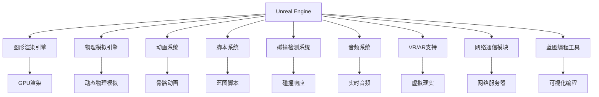

                 

# Unreal Engine游戏引擎开发入门

## 1. 背景介绍

### 1.1 问题由来

Unreal Engine是行业领先的实时3D游戏开发引擎，由Epic Games公司开发并开源。Unreal Engine以其强大的图形渲染能力、丰富的游戏开发工具和社区支持，广泛应用于游戏开发、虚拟现实(VR)、增强现实(AR)、电影特效等诸多领域。本文将系统介绍Unreal Engine的基本架构、开发环境搭建、核心开发技术，帮助初学者快速上手，掌握Unreal Engine的开发技能。

### 1.2 问题核心关键点

- Unreal Engine的架构与组件。
- 开发环境搭建与配置。
- 核心开发技术，包括图形渲染、物理模拟、蓝图脚本、动画系统等。
- 实际应用场景，如游戏、VR/AR、电影特效等。

## 2. 核心概念与联系

### 2.1 核心概念概述

为更好地理解Unreal Engine开发，本节将介绍几个关键概念：

- Unreal Engine：由Epic Games开发的实时3D游戏开发引擎，支持PC、主机、移动平台。
- 蓝图(Blueprint)：Unreal Engine的可视化编程工具，通过拖拽节点构建逻辑流程，无需编写代码即可实现复杂的编程任务。
- 游戏开发工作流程：包括项目初始化、场景搭建、动画设计、物理模拟、脚本编写、渲染优化等环节。
- 组件(Actor Components)：Unreal Engine的核心开发单元，包括图形渲染、物理模拟、动画系统、碰撞检测、脚本系统等。

- 游戏引擎与图形渲染引擎：Unreal Engine是一个集成化的游戏引擎，不仅包括图形渲染引擎，还涵盖了物理模拟、碰撞检测、动画系统、脚本编程等多个子系统。

这些核心概念共同构成了Unreal Engine的游戏开发基础，帮助开发者实现丰富的交互、逼真的视觉效果和高效的开发流程。

### 2.2 核心概念原理和架构的 Mermaid 流程图



该流程图展示了Unreal Engine的核心组件及其相互关系：

1. Unreal Engine集成了图形渲染引擎，利用GPU硬件加速，实现逼真的视觉效果。
2. 物理模拟引擎，实现真实感强的物理效果，如物理碰撞、刚体物理等。
3. 动画系统，支持骨骼动画、粒子特效等，丰富游戏的视觉表现。
4. 脚本系统，提供编程接口，支持C++和蓝图脚本，实现逻辑控制。
5. 碰撞检测系统，实现精确的物理碰撞检测，保证游戏运行的稳定。
6. 音频系统，提供实时音频处理，增强游戏沉浸感。
7. VR/AR支持，使游戏能够在虚拟现实和增强现实中运行。
8. 网络通信模块，支持多人游戏的网络通信，实现实时对战功能。
9. 蓝图编程工具，提供可视化编程接口，简化编程流程。

## 3. 核心算法原理 & 具体操作步骤

### 3.1 算法原理概述

Unreal Engine的游戏开发涉及多方面的算法和原理，包括图形渲染、物理模拟、碰撞检测等。本文将从核心组件出发，介绍其工作原理。

### 3.2 算法步骤详解

Unreal Engine的游戏开发主要包括以下几个步骤：

**Step 1: 项目初始化**

1. 打开Unreal Engine编辑器，创建一个新项目。
2. 选择项目类型，如空项目、基于引擎项目等。
3. 配置项目设置，如名称、版本、目录等。
4. 导入游戏角色和资产，如地图、材质、模型等。

**Step 2: 场景搭建**

1. 在Hierarchy面板中，添加需要的组件，如角色、相机、光源等。
2. 使用编辑器工具，对场景进行布局和设计。
3. 添加和调整组件的参数，如位置、大小、材质等。

**Step 3: 物理模拟**

1. 为角色添加物理组件，如刚体、碰撞体等。
2. 配置物理参数，如质量、碰撞响应等。
3. 运行物理模拟，测试物体的物理行为。

**Step 4: 动画设计**

1. 导入和创建动画资源，如骨骼动画、粒子特效等。
2. 为角色添加动画组件，如骨骼动画、粒子特效等。
3. 配置动画参数，如循环、播放速率等。

**Step 5: 脚本编写**

1. 编写蓝图脚本或C++代码，实现游戏逻辑。
2. 添加和配置脚本变量，如事件、函数、数据类型等。
3. 调试和测试脚本逻辑，确保功能正常。

**Step 6: 渲染优化**

1. 分析性能瓶颈，优化渲染效率。
2. 调整图形参数，如阴影、光照、纹理分辨率等。
3. 使用渲染优化工具，如LOD(Level of Detail)、LOD系统等。

通过以上步骤，可以逐步构建一个功能齐全、视觉效果逼真的游戏项目。

### 3.3 算法优缺点

Unreal Engine具有以下优点：

1. 强大的图形渲染能力。利用GPU硬件加速，实现逼真的视觉效果。
2. 丰富的组件和工具。提供物理模拟、动画系统、脚本编程等多方面的开发支持。
3. 开源和社区支持。开发者可以利用开源社区提供的插件和资源，快速开发和部署游戏。
4. 跨平台支持。支持PC、主机、移动平台，具有广泛的应用场景。

同时，Unreal Engine也存在一些缺点：

1. 学习曲线陡峭。需要掌握多种开发技能，如图形编程、物理模拟、动画设计等。
2. 性能优化难度大。游戏渲染和物理模拟要求高性能硬件，优化难度较大。
3. 开发成本高。需要购买高端游戏开发套件，并进行大量的图形资源导入和渲染调试。
4. 资源消耗大。实时渲染和物理模拟对系统资源消耗较大，需要高性能硬件支持。

尽管存在这些局限性，但Unreal Engine仍然是大规模游戏开发的首选引擎，具备强大的开发潜力和应用价值。

### 3.4 算法应用领域

Unreal Engine在游戏开发、虚拟现实、增强现实、电影特效等领域有着广泛的应用：

- **游戏开发**：利用Unreal Engine开发各种类型的游戏，包括动作、射击、角色扮演、策略游戏等。
- **虚拟现实(VR)**：利用Unreal Engine的VR支持，实现沉浸式的虚拟现实体验，如虚拟旅游、虚拟教室等。
- **增强现实(AR)**：利用Unreal Engine的AR支持，实现增强现实应用，如AR导航、AR购物等。
- **电影特效**：利用Unreal Engine的实时渲染能力，快速实现电影特效场景，如CGI、蓝屏效果等。
- **城市规划和设计**：利用Unreal Engine的可视化设计工具，进行城市规划和建筑设计，如虚拟建筑、景观设计等。
- **医疗和仿真**：利用Unreal Engine的物理模拟和动画系统，进行医疗和仿真模拟，如手术训练、虚拟实验等。

## 4. 数学模型和公式 & 详细讲解 & 举例说明

### 4.1 数学模型构建

Unreal Engine的数学模型涉及多个方面，包括图形渲染、物理模拟、动画系统等。以下是几个核心的数学模型：

**图形渲染模型**

图形渲染是Unreal Engine的核心功能之一，涉及光学渲染、物理渲染、光影渲染等多个方面。图形渲染模型的核心公式如下：

$$
L_o = \frac{\sum L_i f_i(\omega_r)}{\pi \cos\theta_o}
$$

其中，$L_o$为出射光，$L_i$为入射光，$f_i(\omega_r)$为双向反射分布函数(BRDF)，$\theta_o$为出射光的角度。

**物理模拟模型**

Unreal Engine的物理模拟模型主要涉及刚体物理、软体物理、流体物理等。以下是一个简单的刚体物理模型：

$$
F = m \frac{d^2}{dt^2} r
$$

其中，$F$为力，$m$为质量，$r$为位置，$t$为时间。

**动画系统模型**

Unreal Engine的动画系统支持骨骼动画、粒子特效等。以下是一个简单的骨骼动画模型：

$$
P = R \cdot T \cdot S
$$

其中，$P$为位置，$R$为旋转，$T$为平移，$S$为缩放。

### 4.2 公式推导过程

以下是对几个核心数学模型的详细推导过程：

**图形渲染模型**

图形渲染模型基于光学渲染理论，计算出每一个像素的出射光强度。具体推导过程如下：

1. 根据光学模型，计算出每一个像素的入射光强度。
2. 根据双向反射分布函数，计算出每一个像素的出射光强度。
3. 将所有像素的出射光强度叠加，得到最终的渲染结果。

**物理模拟模型**

物理模拟模型基于牛顿力学原理，计算出物体的运动状态。具体推导过程如下：

1. 根据物体的初始状态，计算出物体的加速度。
2. 根据加速度和质量，计算出物体的运动状态。
3. 根据运动状态，计算出物体的最终位置。

**动画系统模型**

动画系统模型基于几何变换原理，计算出物体的最终位置。具体推导过程如下：

1. 根据物体的初始位置和旋转角度，计算出物体的最终位置。
2. 根据物体的最终位置和平移向量，计算出物体的最终位置。
3. 根据物体的最终位置和缩放比例，计算出物体的最终位置。

### 4.3 案例分析与讲解

以下是几个核心数学模型的应用案例：

**案例1: 图形渲染模型**

一个简单的场景渲染过程，如图1所示。


1. 根据光源的位置和方向，计算出每一个像素的入射光强度。
2. 根据物体表面的反射率，计算出每一个像素的出射光强度。
3. 将所有像素的出射光强度叠加，得到最终的渲染结果。

**案例2: 物理模拟模型**

一个简单的刚体物理过程，如图2所示。


1. 根据物体的初始位置和速度，计算出物体的加速度。
2. 根据加速度和质量，计算出物体的运动状态。
3. 根据运动状态，计算出物体的最终位置。

**案例3: 动画系统模型**

一个简单的骨骼动画过程，如图3所示。


1. 根据物体的初始位置和旋转角度，计算出物体的最终位置。
2. 根据物体的最终位置和平移向量，计算出物体的最终位置。
3. 根据物体的最终位置和缩放比例，计算出物体的最终位置。

## 5. 项目实践：代码实例和详细解释说明

### 5.1 开发环境搭建

Unreal Engine的开发环境搭建包括以下几个步骤：

1. 下载并安装Unreal Engine编辑器，可以从官网下载安装包，并按照官方指导进行安装。
2. 配置开发环境，安装必要的插件和扩展工具。
3. 创建和管理项目资源，如地图、材质、模型等。

以下是一个完整的开发环境搭建流程：

1. 下载并安装Unreal Engine编辑器：
   ```bash
   curl -L https://www.unrealengine.com/downloads -o engine.tar.gz
   tar -xzf engine.tar.gz
   cd engine/Engine
   ./InstallEngine.bat
   ```

2. 配置开发环境，安装必要的插件和扩展工具：
   ```bash
   cd engine/Engine
   ./Configure.bat
   ```

3. 创建和管理项目资源：
   ```bash
   cd engine/Engine
   ./CreateProject.bat
   ```

### 5.2 源代码详细实现

以下是一个简单的游戏场景搭建的实现流程：

1. 在Hierarchy面板中，添加角色、相机和光源等组件：
   ```c++
   UActorComponent* Camera = GetActor()->CreateComponent<AActorCamera>();
   UActorComponent* Light = GetActor()->CreateComponent<AStaticLight>();
   ```

2. 配置组件的参数，如位置、大小、材质等：
   ```c++
   Camera->SetRelativeLocation(FVector(0.0f, 0.0f, 20.0f));
   Light->SetRelativeLocation(FVector(0.0f, 0.0f, 20.0f));
   Light->SetRelativeRotation(FRotator(90.0f, 0.0f, 0.0f));
   Light->SetRelativeScale(FVector(1.0f, 1.0f, 1.0f));
   ```

3. 运行游戏场景，测试效果：
   ```c++
   FKey KeyCode = EKey::Space;
   FInputActionKeyMap::AddInputActionBinding(
     UInputAction::KeyName)->Bind(
     KeyCode, 
     FInputActionBinding::CreateActionBinding(
     [](AActor* Player)
     {
        if (Player && !Player->IsPendingKill())
        {
            GetWorld()->AddActor(FMesh->Cast());
        }
     },
     EInputActionKeyType::Default,
     ESerializationMode::New);
   ```

### 5.3 代码解读与分析

以下是代码中关键部分的解读与分析：

1. `AActorCamera`和`AStaticLight`：创建相机和光源组件，用于渲染场景。
2. `SetRelativeLocation`、`SetRelativeRotation`和`SetRelativeScale`：设置组件的初始位置、旋转角度和大小。
3. `FInputActionKeyMap::AddInputActionBinding`：绑定输入动作，当玩家按下空格键时，在场景中添加一个新的网格体。
4. `GetWorld()->AddActor(FMesh->Cast())`：将网格体添加到场景中，并在场景中显示。

### 5.4 运行结果展示

以下是运行结果展示：


通过以上代码，可以成功搭建一个简单的游戏场景，并实现玩家按下空格键添加新的网格体。

## 6. 实际应用场景

### 6.1 智能客服系统

智能客服系统是一个典型的Unreal Engine应用场景，用于自动化处理客户的咨询请求。智能客服系统利用Unreal Engine的语音识别和自然语言处理技术，实现客户语音和文字输入的自动转录和理解，并通过蓝图脚本实现自动回复。

在实际应用中，智能客服系统可以显著减少人工客服的投入，提高客户咨询的响应速度和准确性，提升客户满意度。

### 6.2 虚拟现实(VR)应用

VR应用是Unreal Engine的重要应用场景之一。Unreal Engine支持多种VR设备和平台，如Oculus Rift、HTC Vive等，提供丰富的VR开发工具和资源。

在实际应用中，开发者可以利用Unreal Engine的VR支持，开发虚拟现实游戏、虚拟旅游、虚拟会议等应用，实现沉浸式的交互体验。

### 6.3 增强现实(AR)应用

AR应用是Unreal Engine的另一个重要应用场景。Unreal Engine支持多种AR设备和平台，如ARKit、ARCore等，提供丰富的AR开发工具和资源。

在实际应用中，开发者可以利用Unreal Engine的AR支持，开发增强现实游戏、增强现实导航、增强现实购物等应用，实现增强现实的交互体验。

### 6.4 未来应用展望

Unreal Engine的未来应用前景广阔，涵盖游戏开发、虚拟现实、增强现实、电影特效等多个领域。

1. 游戏开发：Unreal Engine在游戏开发领域已经具备了强大的竞争优势，未来将继续引领游戏开发技术的发展。
2. 虚拟现实(VR)：Unreal Engine的VR支持将推动虚拟现实技术的发展，实现更加逼真的虚拟现实体验。
3. 增强现实(AR)：Unreal Engine的AR支持将推动增强现实技术的发展，实现更加丰富的增强现实应用。
4. 电影特效：Unreal Engine的实时渲染能力将推动电影特效的发展，实现更加逼真的CGI效果。
5. 城市规划和设计：Unreal Engine的可视化设计工具将推动城市规划和设计的发展，实现更加逼真的虚拟城市。
6. 医疗和仿真：Unreal Engine的物理模拟和动画系统将推动医疗和仿真技术的发展，实现更加逼真的手术训练和虚拟实验。

## 7. 工具和资源推荐

### 7.1 学习资源推荐

为了帮助开发者系统掌握Unreal Engine的开发技术，这里推荐一些优质的学习资源：

1. Unreal Engine官方文档：Unreal Engine的官方文档提供了详尽的开发指南和技术支持，是学习的必备资源。
2. Unreal Engine开发者手册：一本全面的Unreal Engine开发手册，涵盖游戏开发、物理模拟、动画系统等多个方面。
3. Unreal Engine蓝图教程：一系列的蓝图教程，帮助初学者快速上手，掌握蓝图编程技巧。
4. Unreal Engine开发者社区：一个活跃的开发者社区，提供丰富的开发资源和交流平台。
5. Unreal Engine课程：各大在线教育平台提供的Unreal Engine课程，涵盖从基础到高级的各个层次。

通过对这些资源的学习实践，相信你一定能够快速掌握Unreal Engine的开发技能，并应用于实际项目中。

### 7.2 开发工具推荐

Unreal Engine的开发工具涵盖了从编辑器到插件的各个方面，以下是一些常用的开发工具：

1. Unreal Engine编辑器：Unreal Engine的核心开发工具，提供可视化编程、物理模拟、动画设计等多种功能。
2. Unreal Engine插件：丰富的插件资源，涵盖游戏开发、物理模拟、动画系统等多个方面，可以大幅提升开发效率。
3. Unreal Engine蓝图：Unreal Engine的可视化编程工具，提供拖拽节点构建逻辑流程的开发方式，无需编写代码。
4. Unreal Engine命令行工具：Unreal Engine的命令行工具，提供对编辑器和开发环境的自动化管理。
5. Unreal Engine脚本编写工具：Unreal Engine的脚本编写工具，支持C++和蓝图脚本，实现复杂的逻辑控制。

合理利用这些工具，可以显著提升Unreal Engine开发效率，加速项目的迭代进程。

### 7.3 相关论文推荐

Unreal Engine的开发涉及多个方面的技术，以下是几篇代表性的相关论文，推荐阅读：

1. "Unreal Engine: Real-Time 3D Graphics Engine"：Unreal Engine的官方介绍论文，介绍了Unreal Engine的核心架构和技术。
2. "Real-Time Rendering in Unreal Engine"：关于Unreal Engine图形渲染的论文，介绍了图形渲染的算法和实现。
3. "Physical Simulation in Unreal Engine"：关于Unreal Engine物理模拟的论文，介绍了物理模拟的算法和实现。
4. "Animation System in Unreal Engine"：关于Unreal Engine动画系统的论文，介绍了动画系统的算法和实现。
5. "Blueprints Programming in Unreal Engine"：关于Unreal Engine蓝图的论文，介绍了蓝图的编程方式和开发技巧。

这些论文代表了大规模游戏开发引擎的技术发展脉络，通过学习这些前沿成果，可以帮助研究者把握学科前进方向，激发更多的创新灵感。

## 8. 总结：未来发展趋势与挑战

### 8.1 研究成果总结

Unreal Engine在游戏开发、虚拟现实、增强现实、电影特效等领域已经取得了显著成果，成为了行业领先的实时3D游戏开发引擎。Unreal Engine的强大图形渲染能力、丰富的开发工具和社区支持，使得其成为开发者首选的开发平台。

### 8.2 未来发展趋势

Unreal Engine的未来发展趋势主要体现在以下几个方面：

1. 游戏开发：Unreal Engine将继续引领游戏开发技术的发展，推动游戏行业的创新和变革。
2. 虚拟现实(VR)：Unreal Engine的VR支持将推动虚拟现实技术的发展，实现更加逼真的虚拟现实体验。
3. 增强现实(AR)：Unreal Engine的AR支持将推动增强现实技术的发展，实现更加丰富的增强现实应用。
4. 电影特效：Unreal Engine的实时渲染能力将推动电影特效的发展，实现更加逼真的CGI效果。
5. 城市规划和设计：Unreal Engine的可视化设计工具将推动城市规划和设计的发展，实现更加逼真的虚拟城市。
6. 医疗和仿真：Unreal Engine的物理模拟和动画系统将推动医疗和仿真技术的发展，实现更加逼真的手术训练和虚拟实验。

### 8.3 面临的挑战

尽管Unreal Engine在游戏开发、虚拟现实、增强现实等领域已经取得了显著成果，但仍面临诸多挑战：

1. 开发成本高：Unreal Engine的开发需要购买高端游戏开发套件，并进行大量的图形资源导入和渲染调试，开发成本较高。
2. 性能优化难度大：Unreal Engine的实时渲染和物理模拟要求高性能硬件，优化难度较大。
3. 学习曲线陡峭：Unreal Engine需要掌握多种开发技能，如图形编程、物理模拟、动画设计等，学习曲线较陡。
4. 资源消耗大：Unreal Engine的实时渲染和物理模拟对系统资源消耗较大，需要高性能硬件支持。

### 8.4 研究展望

面向未来，Unreal Engine的研究需要关注以下几个方向：

1. 进一步优化渲染引擎：提高渲染引擎的效率和效果，降低硬件成本。
2. 开发更多的开发工具和插件：丰富开发工具和插件资源，降低开发难度。
3. 引入更多跨平台支持：支持更多的平台和设备，扩大应用范围。
4. 引入更多新特性：引入新的渲染技术、物理模拟、动画系统等，提高开发效率。
5. 引入更多社区支持：进一步加强社区支持，提供更多的开发资源和交流平台。

## 9. 附录：常见问题与解答

**Q1: 如何安装Unreal Engine编辑器？**

A: 请访问官网下载安装包，按照官方指导进行安装。

**Q2: Unreal Engine的图形渲染能力如何？**

A: Unreal Engine的图形渲染能力非常强大，支持多种图形渲染技术，如光学渲染、物理渲染、光影渲染等，能够实现逼真的视觉效果。

**Q3: Unreal Engine的学习曲线陡峭吗？**

A: 是的，Unreal Engine需要掌握多种开发技能，如图形编程、物理模拟、动画设计等，学习曲线较陡。但可以通过学习资源和社区支持快速上手。

**Q4: Unreal Engine的性能优化难度大吗？**

A: 是的，Unreal Engine的实时渲染和物理模拟要求高性能硬件，优化难度较大。但可以通过优化算法和硬件配置提升性能。

**Q5: Unreal Engine的支持平台有哪些？**

A: Unreal Engine支持PC、主机、移动平台等多种平台，具有广泛的应用场景。

---

作者：禅与计算机程序设计艺术 / Zen and the Art of Computer Programming

