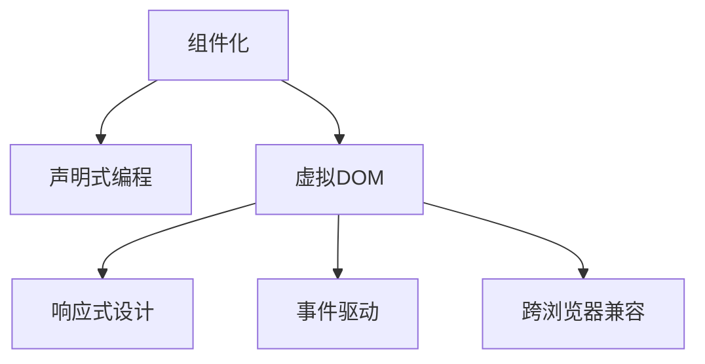

                 

# Web 前端框架高级应用：构建复杂和可扩展的界面

> 关键词：Web前端框架, 复杂界面构建, 可扩展性, 组件复用, 跨浏览器兼容, 性能优化, 实时渲染, 事件驱动, 响应式设计

## 1. 背景介绍

随着互联网的快速发展和Web技术的日新月异，前端开发者们面临着越来越复杂和多变的用户需求。如何在保持高性能的同时，构建出既美观又易用的复杂Web界面，成为了前端工程师们的重要挑战。Web前端框架（如React、Vue、Angular等）应运而生，极大地简化了前端开发的流程，提高了开发效率和代码复用性。

### 1.1 问题由来

在Web前端开发中，一个复杂界面往往需要大量的代码编写和页面渲染，特别是对于大型的单页应用(SPA)，性能和用户体验成为主要瓶颈。传统的前端开发方式虽然灵活，但代码量大、维护成本高，难以复用。同时，浏览器之间的兼容性问题也严重影响了用户体验。这些问题催生了Web前端框架的发展，推动了组件化、声明式编程等先进开发理念的普及。

### 1.2 问题核心关键点

Web前端框架的核心在于其组件化、声明式编程、虚拟DOM等特性，这些特性使得开发者可以构建复杂且可扩展的界面。框架通过封装复杂操作，将界面构建过程从繁琐的DOM操作中解放出来，提高了开发效率和代码复用性。

## 2. 核心概念与联系

### 2.1 核心概念概述

为更好地理解Web前端框架的高级应用，本节将介绍几个密切相关的核心概念：

- **组件化（Componentization）**：将复杂的Web界面分解为独立的、可复用的组件，每个组件都有自己的逻辑和状态，可以通过组合形成复杂的用户界面。

- **声明式编程（Declarative Programming）**：强调对最终结果的描述，而不是操作过程。前端框架通过声明式的API实现组件渲染，减少开发者对DOM操作的依赖。

- **虚拟DOM（Virtual DOM）**：前端框架内置的虚拟DOM对象，用于追踪组件状态变化，减少实际DOM操作的次数，提高渲染效率。

- **响应式设计（Responsive Design）**：根据不同设备屏幕大小和分辨率，自动调整界面布局和内容，提供一致的用户体验。

- **事件驱动（Event-Driven）**：通过事件系统实现组件之间的通信，实现对用户输入的响应和处理。

- **跨浏览器兼容（Cross-Browser Compatibility）**：确保Web应用程序在不同浏览器和设备上表现一致，提升用户体验。

这些核心概念之间的逻辑关系可以通过以下Mermaid流程图来展示：



这个流程图展示了几大核心概念的相互关系：

1. 组件化是Web前端框架的基础，通过组合基本组件构建复杂的用户界面。
2. 声明式编程是框架的核心特性，使得开发者可以声明界面的最终状态，减少对DOM操作的依赖。
3. 虚拟DOM提高了渲染效率，是声明式编程的重要支持。
4. 响应式设计和事件驱动共同构成前端框架的用户交互逻辑，提升用户体验。
5. 跨浏览器兼容确保了框架的通用性，使得应用程序可以在多种设备上稳定运行。

这些概念共同构成了Web前端框架的高级应用框架，使其能够高效、灵活地构建复杂Web界面。

## 3. 核心算法原理 & 具体操作步骤
### 3.1 算法原理概述

Web前端框架的高级应用主要基于以下几个关键算法原理：

- **组件生命周期管理**：框架通过生命周期钩子实现组件的创建、更新和销毁，确保组件状态的一致性和性能优化。
- **数据流管理**：框架通过数据流机制实现组件间状态的同步，确保界面元素的响应性和一致性。
- **性能优化**：框架通过虚拟DOM和差异化渲染技术，减少DOM操作次数，提升渲染效率。
- **跨浏览器兼容**：框架通过统一的API和标准库，实现不同浏览器之间的兼容。

### 3.2 算法步骤详解

Web前端框架高级应用的实现通常包括以下几个关键步骤：

**Step 1: 组件设计和构建**
- 设计复杂界面的组件结构，定义组件的状态和行为。
- 使用框架提供的API实现组件的创建、挂载和更新。
- 定义组件的生命周期钩子，处理组件的创建、更新和销毁。

**Step 2: 数据流管理**
- 定义组件之间的数据流关系，使用状态管理库（如Redux、MobX等）管理组件状态。
- 实现数据流机制，确保组件间的同步更新和状态一致。
- 使用数据绑定技术（如V Binding、Refs等）实现组件状态的同步。

**Step 3: 性能优化**
- 使用虚拟DOM技术，将组件渲染过程抽象为虚拟DOM的创建和更新，减少DOM操作次数。
- 实现差异化渲染，仅更新发生变化的组件，减少渲染开销。
- 使用懒加载和代码分割技术，减少初始加载时间，提高页面加载速度。

**Step 4: 跨浏览器兼容**
- 使用框架提供的跨浏览器兼容工具和库，实现不同浏览器之间的兼容。
- 使用Polyfill或Babel等工具，将现代JavaScript语法转换成兼容代码。
- 进行严格的前端测试，确保应用程序在不同浏览器和设备上表现一致。

### 3.3 算法优缺点

Web前端框架高级应用的优点在于：
1. 提高了开发效率和代码复用性。组件化使得开发者可以重复利用已有的组件，快速构建复杂界面。
2. 提升了性能和用户体验。声明式编程和虚拟DOM技术减少了DOM操作，提高了渲染效率。
3. 增强了应用程序的可扩展性。数据流管理和响应式设计使得界面能够快速适应变化，提升用户体验。
4. 提升了跨浏览器兼容性。框架提供的兼容工具和库，确保应用程序在不同浏览器和设备上表现一致。

同时，框架高级应用也存在一定的局限性：
1. 学习曲线较陡峭。框架提供了大量的概念和API，开发者需要花费一定时间学习。
2. 性能优化难度较大。框架的复杂性也带来了性能优化上的挑战，如虚拟DOM的差异化渲染和代码分割。
3. 兼容性问题难以全面覆盖。框架提供的兼容工具虽然可以减少兼容性问题，但仍可能存在未覆盖的情况。

尽管存在这些局限性，但就目前而言，Web前端框架高级应用是构建复杂和可扩展的Web界面的重要手段。未来相关研究的重点在于如何进一步降低框架的复杂度，提高性能优化效率，同时兼顾可扩展性和兼容性等因素。

### 3.4 算法应用领域

Web前端框架高级应用已经在复杂Web界面的构建中得到了广泛应用，包括但不限于以下几个领域：

- **电商网站**：构建复杂的页面布局、商品展示、购物车等界面。
- **社交媒体**：实现动态新闻流、消息列表、用户评论等界面。
- **在线教育**：设计交互式课程、作业系统、在线讨论等界面。
- **企业应用**：构建HR系统、项目管理、文档管理系统等复杂界面。
- **移动应用**：开发跨平台的原生应用，提供一致的用户体验。

除了上述这些经典应用场景外，Web前端框架高级应用还在更多创新性场景中得到了应用，如可折叠侧边栏、多窗口应用、可视化图表等，为Web应用的创新提供了新的思路。

## 4. 数学模型和公式 & 详细讲解 & 举例说明

### 4.1 数学模型构建

为了更好地理解Web前端框架高级应用，本节将使用数学语言对框架的核心算法进行更加严格的刻画。

假设有一个复杂的Web界面，由多个组件构成。设组件数为 $N$，组件状态向量为 $\mathbf{S}=[S_1, S_2, ..., S_N]^T$，其中 $S_i$ 表示第 $i$ 个组件的状态。

定义组件之间的数据流关系为 $\mathbf{F}=[F_{1,1}, F_{1,2}, ..., F_{1,N}, F_{2,1}, F_{2,2}, ..., F_{2,N}, ..., F_{N,N}]^T$，其中 $F_{i,j}$ 表示从组件 $j$ 到组件 $i$ 的数据流关系。

数据流管理的目标是：
1. 确保组件状态的一致性，即 $\mathbf{S}_{t+1} = \mathbf{S}_t + \Delta\mathbf{S}$，其中 $\Delta\mathbf{S}$ 为状态变化量。
2. 实现组件间的同步更新，即 $\mathbf{S}_i = \mathbf{S}_j$ 当且仅当 $F_{i,j}=1$。
3. 确保数据的正确传递，即 $\mathbf{S}_i = \mathbf{S}_j + \Delta\mathbf{S}$ 当且仅当 $F_{i,j}=1$。

### 4.2 公式推导过程

以下我们以React框架为例，推导其状态管理机制的数学模型。

React使用单向数据流模型，通过组件之间的props传递数据。设组件 $i$ 的状态为 $S_i$，父组件传递的数据为 $P_i$，则组件 $i$ 的更新公式为：

$$
S_i^{t+1} = f(S_i^t, P_i^t)
$$

其中 $f$ 表示组件的更新函数，根据组件的状态和props计算新状态。

组件之间的数据流关系 $F_{i,j}$ 表示从组件 $j$ 到组件 $i$ 的数据传递关系。当组件 $j$ 的状态发生变化时，组件 $i$ 的状态也会随之更新。

React的状态管理机制可以表示为以下差分方程：

$$
\Delta S_i = f_i(S_i^t, P_i^t) - S_i^t
$$

其中 $f_i$ 表示组件 $i$ 的更新函数。

数据流关系 $F_{i,j}$ 可以通过组件之间的props传递关系来定义。例如，在父组件 $j$ 中传递数据给子组件 $i$，则 $F_{i,j}=1$。

通过以上数学模型，我们可以理解React的状态管理机制，以及如何通过props传递实现组件间的同步更新。

### 4.3 案例分析与讲解

以下以一个简单的React组件为例，说明如何使用React进行复杂界面的构建和状态管理。

首先，定义一个简单的组件：

```jsx
import React, { useState } from 'react';

function Counter({ initialValue }) {
    const [count, setCount] = useState(initialValue);
    const handleIncrement = () => {
        setCount(count + 1);
    };
    const handleDecrement = () => {
        setCount(count - 1);
    };
    return (
        <div>
            <h1>Counter: {count}</h1>
            <button onClick={handleIncrement}>+</button>
            <button onClick={handleDecrement}>-</button>
        </div>
    );
}

export default Counter;
```

在组件中使用useState钩子定义状态变量 $count$ 和更新函数 $setCount$。每次状态更新时，通过setCount函数更新状态。

接下来，在父组件中使用该子组件，并传递初始值：

```jsx
import React from 'react';
import Counter from './Counter';

function App() {
    return (
        <div>
            <Counter initialValue={0} />
        </div>
    );
}

export default App;
```

在父组件中使用Counter组件，并传递初始值0。每次点击按钮时，子组件的状态会发生变化，父组件会自动更新。

可以看到，React通过声明式编程和状态管理机制，使得组件间的同步更新变得简单、直观。同时，React的虚拟DOM技术也保证了组件渲染的效率和一致性。

## 5. 项目实践：代码实例和详细解释说明
### 5.1 开发环境搭建

在进行Web前端框架高级应用实践前，我们需要准备好开发环境。以下是使用Node.js进行React开发的环境配置流程：

1. 安装Node.js：从官网下载并安装Node.js，用于运行React。

2. 创建React项目：
```bash
npx create-react-app my-app
```

3. 进入项目目录：
```bash
cd my-app
```

4. 安装依赖库：
```bash
npm install react react-dom
```

完成上述步骤后，即可在项目目录中开始React应用的开发。

### 5.2 源代码详细实现

下面我们以一个复杂的电商网站界面为例，给出使用React框架构建的完整代码实现。

首先，定义一个简单的电商商品列表组件：

```jsx
import React, { useState } from 'react';

function ProductList({ products }) {
    const [selectedProducts, setSelectedProducts] = useState([]);
    const handleSelectProduct = (product) => {
        setSelectedProducts([...selectedProducts, product]);
    };
    return (
        <div>
            <h1>Product List</h1>
            <ul>
                {products.map(product => (
                    <li key={product.id} onClick={() => handleSelectProduct(product)}>
                        {product.name} - {product.price}
                    </li>
                ))}
            </ul>
            <h1>Selected Products</h1>
            <ul>
                {selectedProducts.map(product => (
                    <li key={product.id}>{product.name} - {product.price}</li>
                ))}
            </ul>
        </div>
    );
}

export default ProductList;
```

在组件中使用useState钩子定义状态变量 $selectedProducts$ 和更新函数 $setSelectedProducts$。每次点击商品时，选择商品的状态会发生变化，组件自动更新。

接下来，在父组件中使用该商品列表组件，并传递商品列表数据：

```jsx
import React from 'react';
import ProductList from './ProductList';

function App() {
    const products = [
        { id: 1, name: 'Product 1', price: 100 },
        { id: 2, name: 'Product 2', price: 200 },
        { id: 3, name: 'Product 3', price: 300 },
    ];
    return (
        <div>
            <ProductList products={products} />
        </div>
    );
}

export default App;
```

在父组件中使用ProductList组件，并传递商品列表数据。每次点击商品时，选择商品的状态会发生变化，父组件自动更新。

最后，定义一个简单的按钮组件：

```jsx
import React from 'react';

function Button({ onClick }) {
    return (
        <button onClick={onClick}>
            Click Me
        </button>
    );
}

export default Button;
```

在组件中定义按钮的点击事件处理函数 $onClick$。每次点击按钮时，状态会发生变化。

在父组件中使用该按钮组件：

```jsx
import React from 'react';
import ProductList from './ProductList';
import Button from './Button';

function App() {
    const products = [
        { id: 1, name: 'Product 1', price: 100 },
        { id: 2, name: 'Product 2', price: 200 },
        { id: 3, name: 'Product 3', price: 300 },
    ];
    const [counter, setCounter] = useState(0);
    const handleIncrement = () => {
        setCounter(counter + 1);
    };
    const handleDecrement = () => {
        setCounter(counter - 1);
    };
    return (
        <div>
            <h1>Counter: {counter}</h1>
            <Button onClick={handleIncrement}>+</Button>
            <Button onClick={handleDecrement}>-</Button>
            <ProductList products={products} />
        </div>
    );
}

export default App;
```

在父组件中使用Button组件和ProductList组件，并定义计数器的状态变量 $counter$ 和更新函数 $setCounter$。每次点击按钮时，计数器的状态会发生变化，父组件自动更新。

可以看到，React通过声明式编程和状态管理机制，使得组件间的同步更新变得简单、直观。同时，React的虚拟DOM技术也保证了组件渲染的效率和一致性。

### 5.3 代码解读与分析

让我们再详细解读一下关键代码的实现细节：

**useState钩子**：
- 使用useState钩子定义组件的状态变量和更新函数。useState函数的第一个参数表示初始状态，第二个参数表示状态更新函数。每次状态更新时，React会重新渲染组件，并更新DOM。

**props传递**：
- React通过props机制实现组件之间的数据传递。父组件可以通过props将数据传递给子组件，子组件可以通过props获取父组件传递的数据，并根据props更新自己的状态。

**事件处理函数**：
- 使用onClick事件处理函数实现组件的交互逻辑。当用户点击按钮或选择商品时，React会自动调用事件处理函数，更新组件的状态。

**虚拟DOM**：
- React使用虚拟DOM技术，将组件渲染过程抽象为虚拟DOM的创建和更新，减少DOM操作次数，提高渲染效率。当组件状态发生变化时，React会计算出差异，仅更新发生变化的组件，从而实现高效的渲染优化。

可以看到，React通过声明式编程和状态管理机制，使得组件间的同步更新变得简单、直观。同时，React的虚拟DOM技术也保证了组件渲染的效率和一致性。

## 6. 实际应用场景
### 6.1 智能客服系统

基于React框架的Web前端界面，可以广泛应用于智能客服系统的构建。传统客服往往需要配备大量人力，高峰期响应缓慢，且一致性和专业性难以保证。而使用React构建的智能客服系统，可以7x24小时不间断服务，快速响应客户咨询，用自然流畅的语言解答各类常见问题。

在技术实现上，可以收集企业内部的历史客服对话记录，将问题和最佳答复构建成监督数据，在此基础上对React应用进行微调。微调后的React应用能够自动理解用户意图，匹配最合适的答复模板进行回复。对于客户提出的新问题，还可以接入检索系统实时搜索相关内容，动态组织生成回答。如此构建的智能客服系统，能大幅提升客户咨询体验和问题解决效率。

### 6.2 电商网站

在电商网站中，React框架可以应用于商品展示、购物车、订单管理等复杂界面的构建。通过React的状态管理机制和虚拟DOM技术，可以构建高性能、可扩展的电商网站。例如，在商品展示页面中，可以通过React实现动态商品渲染、实时搜索和筛选等功能。在购物车页面中，可以通过React实现动态商品更新、下单提醒等功能。通过React应用，电商网站可以提供更丰富、更流畅的用户体验。

### 6.3 在线教育平台

在在线教育平台中，React框架可以应用于课程管理、作业系统、在线讨论等复杂界面的构建。通过React的状态管理机制和响应式设计，可以构建高性能、可扩展的在线教育平台。例如，在课程管理页面中，可以通过React实现动态课程渲染、实时更新和推荐等功能。在作业系统中，可以通过React实现动态作业提交、自动评分和反馈等功能。通过React应用，在线教育平台可以提供更高效、更个性化的教学服务。

### 6.4 未来应用展望

随着React框架的不断发展，基于React的Web前端应用将在更多领域得到应用，为传统行业数字化转型升级提供新的技术路径。

在智慧医疗领域，基于React的Web应用可以应用于在线诊疗、电子病历管理等场景，提升医疗服务的智能化水平。

在智能制造领域，基于React的Web应用可以应用于设备监控、生产调度等场景，提高生产效率和质量。

在智慧城市治理中，基于React的Web应用可以应用于城市事件监测、应急指挥等环节，提高城市管理的自动化和智能化水平。

此外，在企业生产、社会治理、文娱传媒等众多领域，基于React的Web应用也将不断涌现，为NLP技术带来全新的突破。

## 7. 工具和资源推荐
### 7.1 学习资源推荐

为了帮助开发者系统掌握React框架的高级应用，这里推荐一些优质的学习资源：

1. React官方文档：React官方提供的详尽文档，覆盖了React的各个方面，包括基础概念、组件生命周期、状态管理等。

2. React教程（MDN Web Docs）：MDN提供的React教程，详细介绍了React的核心概念和API，适合入门学习。

3. React Native官方文档：React Native官方提供的文档，介绍了React Native的开发流程和API，适合构建跨平台移动应用。

4. React Router官方文档：React Router官方提供的文档，介绍了React Router的API和使用方法，适合构建单页应用。

5. Redux官方文档：Redux官方提供的文档，介绍了Redux的状态管理机制和API，适合构建复杂的前端应用。

6. React Source Code：React官方提供的源代码，适合深入理解React的内部实现机制。

通过对这些资源的学习实践，相信你一定能够快速掌握React框架的高级应用，并用于解决实际的Web开发问题。

### 7.2 开发工具推荐

高效的开发离不开优秀的工具支持。以下是几款用于React开发常用的工具：

1. VS Code：Microsoft开发的轻量级代码编辑器，支持React的开发和调试。

2. Webpack：一个流行的模块打包工具，可以将多个React组件打包为一个应用，并实现代码分割和懒加载。

3. Babel：一个JavaScript编译器，可以将现代JavaScript语法转换成兼容代码，支持React的开发。

4. ESLint：一个静态代码检查工具，可以检查代码规范和错误，提高代码质量。

5. Prettier：一个代码格式化工具，可以格式化代码，提升代码可读性。

6. React Developer Tools：一个浏览器插件，可以实时查看React组件的状态和渲染过程，方便调试和优化。

合理利用这些工具，可以显著提升React应用的开发效率和代码质量，加快创新迭代的步伐。

### 7.3 相关论文推荐

React框架的发展源于学界的持续研究。以下是几篇奠基性的相关论文，推荐阅读：

1. "React: A JavaScript Library for Building User Interfaces"：React的原创论文，介绍了React的核心概念和API。

2. "React Native: A Library for Building Native Mobile Apps with React"：React Native的原创论文，介绍了React Native的开发流程和API。

3. "React Router: A Series of React Router Component Libraries for Routing on the Web"：React Router的原创论文，介绍了React Router的API和使用方法。

4. "Redux: A Predictable State Container for JavaScript Apps"：Redux的原创论文，介绍了Redux的状态管理机制和API。

5. "React Fiber: A Reimagined React for Fast and Responsive Web Applications"：React Fiber的原创论文，介绍了React Fiber的内部实现机制。

这些论文代表了React框架的发展脉络。通过学习这些前沿成果，可以帮助研究者把握学科前进方向，激发更多的创新灵感。

## 8. 总结：未来发展趋势与挑战
### 8.1 总结

本文对React框架高级应用的构建方法进行了全面系统的介绍。首先阐述了React框架的背景和核心概念，明确了框架在复杂Web界面构建中的独特价值。其次，从原理到实践，详细讲解了React框架的状态管理机制、虚拟DOM技术等关键特性，给出了React应用的完整代码实现。同时，本文还广泛探讨了React应用在智能客服、电商网站、在线教育等多个行业领域的应用前景，展示了React框架的巨大潜力。

通过本文的系统梳理，可以看到，React框架高级应用已经成为构建复杂Web界面的重要手段。通过React的状态管理机制和虚拟DOM技术，开发者可以高效构建高性能、可扩展的Web应用，提升用户体验。

### 8.2 未来发展趋势

展望未来，React框架高级应用将呈现以下几个发展趋势：

1. 组件化程度更高。随着React生态的不断丰富，更多的组件和库将被开发出来，使得开发者可以更灵活地组合和复用组件。

2. 声明式编程进一步深化。React的核心特性是声明式编程，未来会进一步深化，使得开发者可以更清晰地描述界面的最终状态。

3. 性能优化更加精细。React的虚拟DOM和差异化渲染技术将不断优化，提升渲染效率，减少内存占用。

4. 跨平台能力更强。React Native等跨平台框架将继续发展，使得React应用可以覆盖更多设备和平台。

5. 开发工具更加丰富。更多的开发工具和插件将被开发出来，提升React应用的开发效率和代码质量。

以上趋势凸显了React框架高级应用的广泛应用前景。这些方向的探索发展，必将进一步提升React应用的开发效率和用户体验。

### 8.3 面临的挑战

尽管React框架高级应用已经取得了瞩目成就，但在迈向更加智能化、普适化应用的过程中，它仍面临着诸多挑战：

1. 学习曲线较陡峭。React框架提供了大量的概念和API，开发者需要花费一定时间学习。

2. 性能优化难度较大。React的复杂性也带来了性能优化上的挑战，如虚拟DOM的差异化渲染和代码分割。

3. 兼容性问题难以全面覆盖。React提供的兼容工具虽然可以减少兼容性问题，但仍可能存在未覆盖的情况。

4. 社区生态有待进一步完善。React的社区生态虽然已经非常丰富，但仍需不断发展和完善，以应对不断变化的技术需求。

尽管存在这些挑战，但就目前而言，React框架高级应用是构建复杂和可扩展的Web界面的重要手段。未来相关研究的重点在于如何进一步降低框架的复杂度，提高性能优化效率，同时兼顾可扩展性和兼容性等因素。

### 8.4 研究展望

面向未来，React框架高级应用的研究需要在以下几个方面寻求新的突破：

1. 探索声明式编程的深度和广度。如何进一步深化声明式编程思想，使得开发者可以更清晰地描述界面的最终状态，减少对DOM操作的依赖。

2. 研究更多先进的开发工具和库。如何通过更好的开发工具和库，提升React应用的开发效率和代码质量。

3. 引入更多先验知识。如何将符号化的先验知识，如知识图谱、逻辑规则等，与React应用进行巧妙融合，提升应用的智能化水平。

4. 开发更多跨平台框架。如何开发更多跨平台框架，使得React应用可以覆盖更多设备和平台，实现无缝协作。

这些研究方向的探索，必将引领React框架高级应用的进一步发展，为构建更加智能、普适的Web应用提供新的技术路径。只有勇于创新、敢于突破，才能不断拓展React框架的边界，让前端技术更好地造福人类社会。

## 9. 附录：常见问题与解答

**Q1：React框架如何保证组件渲染的效率？**

A: React框架通过虚拟DOM技术，将组件渲染过程抽象为虚拟DOM的创建和更新，减少DOM操作次数，提高渲染效率。当组件状态发生变化时，React会计算出差异，仅更新发生变化的组件，从而实现高效的渲染优化。

**Q2：React组件的状态如何管理？**

A: React组件的状态管理通过状态钩子实现。useState钩子用于定义组件的状态变量和更新函数，每次状态更新时，React会重新渲染组件，并更新DOM。通过状态管理，React可以动态更新组件的状态，实现复杂的用户交互逻辑。

**Q3：React框架的兼容性问题如何解决？**

A: React框架通过Polyfill或Babel等工具，将现代JavaScript语法转换成兼容代码，确保在不同浏览器和设备上表现一致。同时，React提供的跨浏览器兼容工具和库，可以解决大多数兼容性问题。

**Q4：React框架如何实现响应式设计？**

A: React框架通过响应式设计，根据不同设备屏幕大小和分辨率，自动调整界面布局和内容。React组件可以使用CSS Grid、Flexbox等布局方式，实现响应式设计。

**Q5：React框架如何实现事件驱动？**

A: React框架通过事件系统实现组件之间的通信，实现对用户输入的响应和处理。React组件可以使用onClick、onKeyDown等事件处理函数，实现复杂的事件驱动逻辑。

可以看到，React框架通过声明式编程和状态管理机制，使得组件间的同步更新变得简单、直观。同时，React的虚拟DOM技术也保证了组件渲染的效率和一致性。

---

作者：禅与计算机程序设计艺术 / Zen and the Art of Computer Programming

