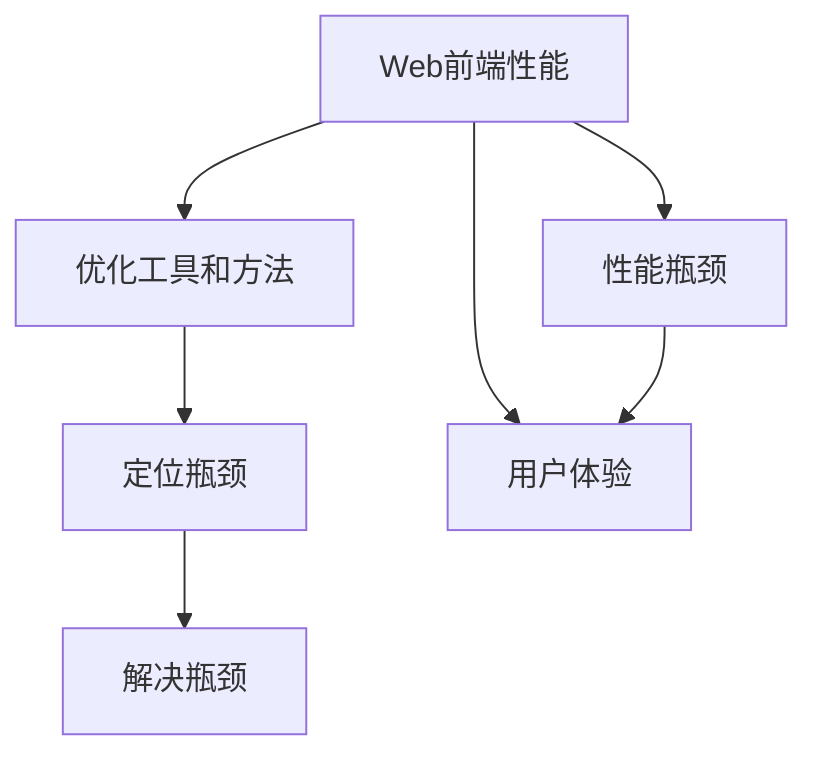
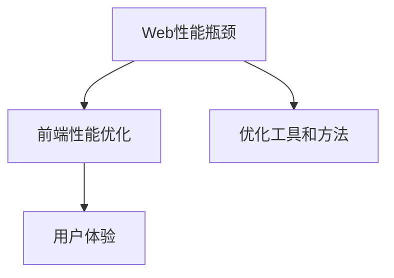

                 

# Web前端性能优化最佳实践

> 关键词：Web性能优化, 前端性能优化, 性能优化最佳实践, Web前端性能瓶颈, 前端性能瓶颈解析, Web性能优化工具, 前端性能优化方法, Web性能瓶颈解决, 前端性能提升技巧

## 1. 背景介绍

### 1.1 问题由来
随着互联网的飞速发展，Web应用已经深入到人们生活的方方面面。无论是企业级Web系统，还是个人网站，都面临着性能提升的需求。性能不仅影响用户体验，也直接关系着网站的市场竞争力。然而，Web前端性能优化涉及众多因素，包括网络、服务器、浏览器、代码、用户操作等。如何在复杂环境中全面提升Web前端性能，成为前端开发者不得不面临的挑战。

### 1.2 问题核心关键点
为更好地理解Web前端性能优化，本节将介绍几个密切相关的核心概念：

- **Web前端性能**：指Web应用加载、渲染、交互等各个环节的性能表现，直接决定用户的体验和满意度。
- **性能瓶颈**：影响Web前端性能的关键点，可能位于网络、服务器、浏览器、代码、用户操作等多个环节。
- **优化工具和方法**：帮助前端开发者定位和解决性能瓶颈的工具和方法，如Lighthouse、PageSpeed Insights、网络监控工具、代码优化技术等。
- **用户体验**：Web前端性能优化的最终目标，通过提升性能，实现更好的用户体验，提高用户留存率和转化率。

这些核心概念之间的逻辑关系可以通过以下Mermaid流程图来展示：



这个流程图展示了几项关键概念及其之间的关系：

1. Web前端性能通过优化工具和方法，被逐步解析，定位到具体的性能瓶颈。
2. 通过解决这些瓶颈，可以全面提升Web前端性能，最终实现更好的用户体验。

## 2. 核心概念与联系

### 2.1 核心概念概述

为更好地理解Web前端性能优化，本节将介绍几个密切相关的核心概念：

- **Web性能瓶颈**：影响Web前端性能的关键因素，可能包括网络延迟、服务器响应时间、浏览器渲染效率、代码执行效率、用户交互行为等。
- **前端性能优化**：通过优化网络、服务器、浏览器、代码等多个环节，提升Web应用的性能表现，改善用户体验。
- **优化工具和方法**：帮助前端开发者识别和解决性能瓶颈的工具和方法，如Lighthouse、PageSpeed Insights、网络监控工具、代码优化技术等。
- **用户体验**：Web前端性能优化的最终目标，通过提升性能，实现更好的用户体验，提高用户留存率和转化率。

这些核心概念之间的逻辑关系可以通过以下Mermaid流程图来展示：



这个流程图展示了几项关键概念及其之间的关系：

1. Web性能瓶颈通过优化工具和方法，被逐步识别和解决。
2. 通过解决这些瓶颈，可以全面提升Web前端性能，最终实现更好的用户体验。

## 3. 核心算法原理 & 具体操作步骤
### 3.1 算法原理概述

Web前端性能优化，本质上是一个系统性的优化过程。其核心思想是通过对各个环节的性能分析和调整，减少不必要的资源消耗，提高Web应用的整体响应速度和用户体验。

形式化地，假设Web应用的性能瓶颈为 $P=\{p_1,p_2,\ldots,p_n\}$，其中 $p_i$ 表示第 $i$ 个性能瓶颈。优化目标是最小化总性能损失 $L$，即找到最优的 $P'$ 使得：

$$
L(P') = \sum_{i=1}^n f(p_i)
$$

其中 $f$ 为性能损失函数，衡量每个瓶颈的性能影响。

在实践中，我们通常使用基于梯度的优化算法（如SGD、Adam等）来近似求解上述最优化问题。设 $\eta$ 为学习率，$\lambda$ 为正则化系数，则参数的更新公式为：

$$
p_i \leftarrow p_i - \eta \nabla_{p_i}L(P) - \eta\lambda p_i
$$

其中 $\nabla_{p_i}L(P)$ 为损失函数对第 $i$ 个瓶颈的梯度，可通过反向传播算法高效计算。

### 3.2 算法步骤详解

Web前端性能优化一般包括以下几个关键步骤：

**Step 1: 性能基准测试**
- 使用工具如Lighthouse、PageSpeed Insights等，对Web应用进行性能基准测试，生成详细的性能报告。
- 根据报告，确定当前Web应用的性能瓶颈。

**Step 2: 性能瓶颈识别**
- 利用收集到的性能报告，使用算法如PageSpeed Insights的FPA算法，进一步解析各个性能瓶颈。
- 根据性能瓶颈的重要性和可优化性，进行优先级排序。

**Step 3: 性能优化策略制定**
- 根据性能瓶颈的优先级，制定优化策略。常用的策略包括减少网络延迟、优化服务器响应、提升浏览器渲染效率、优化代码执行效率等。
- 确定具体的优化措施，如使用CDN、优化数据库查询、优化DOM树结构、压缩代码等。

**Step 4: 实施优化措施**
- 针对具体的优化策略，实施相应的技术措施。
- 使用工具如Lighthouse、PageSpeed Insights等，实时监测优化效果。

**Step 5: 验证优化效果**
- 再次使用工具对Web应用进行性能基准测试，对比优化前后的性能变化。
- 根据测试结果，进一步优化或调整优化措施。

**Step 6: 持续监控和优化**
- 定期对Web应用进行性能基准测试，持续监控性能变化。
- 根据用户反馈和性能监测数据，不断优化Web应用性能。

以上是Web前端性能优化的一般流程。在实际应用中，还需要针对具体任务的特点，对各个环节进行细致的优化设计，如改进算法、调整配置等，以进一步提升性能。

### 3.3 算法优缺点

Web前端性能优化方法具有以下优点：
1. 系统性：从网络、服务器、浏览器、代码等多个环节进行全面优化，确保性能提升的全面性。
2. 可操作性：优化方法具体可行，能够针对具体问题进行有针对性的调整。
3. 效果显著：通过针对性的优化，可以显著提升Web应用的加载和渲染速度，改善用户体验。

同时，该方法也存在一定的局限性：
1. 需要较多技术投入：优化过程需要开发者具备深厚的技术背景，投入大量时间和精力。
2. 效果难以量化：优化效果受多种因素影响，量化评价较难。
3. 优化难度较大：优化过程中可能会遇到许多复杂问题，如代码耦合度高、浏览器兼容性差等。

尽管存在这些局限性，但就目前而言，系统性的前端性能优化方法仍是Web应用性能提升的重要手段。未来相关研究的重点在于如何进一步降低优化成本，提高优化效率，同时兼顾性能提升和用户体验的平衡。

### 3.4 算法应用领域

Web前端性能优化方法在Web应用开发中已经得到了广泛的应用，覆盖了从网站、Web应用到移动端应用等多个领域，例如：

- 网站优化：通过优化HTML、CSS、JavaScript等前端代码，提升网站的加载速度和渲染效率。
- 移动端应用优化：针对移动端浏览器的特点，进行代码优化和性能调优，提升应用的响应速度和稳定性。
- Web应用性能优化：对企业级Web应用进行全面性能优化，提高系统的处理能力和用户体验。
- 服务器端优化：通过优化服务器配置和算法，减少响应时间，提升Web应用的整体性能。
- 跨域资源共享优化：通过优化CORS配置，提升跨域资源加载效率，减少网络延迟。

除了上述这些经典领域外，Web前端性能优化技术也被创新性地应用到更多场景中，如响应式设计、渐进式Web应用等，为Web技术带来了全新的突破。

## 4. 数学模型和公式 & 详细讲解 & 举例说明

### 4.1 数学模型构建

本节将使用数学语言对Web前端性能优化过程进行更加严格的刻画。

记Web应用的性能瓶颈为 $P=\{p_1,p_2,\ldots,p_n\}$，其中 $p_i$ 表示第 $i$ 个性能瓶颈。假设优化后的性能瓶颈为 $P'=\{p_1',p_2',\ldots,p_n'\}$，其中 $p_i'$ 表示优化后的第 $i$ 个性能瓶颈。优化目标是最小化总性能损失 $L$，即找到最优的 $P'$ 使得：

$$
L(P') = \sum_{i=1}^n f(p_i')
$$

其中 $f$ 为性能损失函数，衡量每个瓶颈的性能影响。

在实践中，我们通常使用基于梯度的优化算法（如SGD、Adam等）来近似求解上述最优化问题。设 $\eta$ 为学习率，$\lambda$ 为正则化系数，则参数的更新公式为：

$$
p_i \leftarrow p_i - \eta \nabla_{p_i}L(P) - \eta\lambda p_i
$$

其中 $\nabla_{p_i}L(P)$ 为损失函数对第 $i$ 个瓶颈的梯度，可通过反向传播算法高效计算。

### 4.2 公式推导过程

以下我们以响应时间优化为例，推导性能损失函数及其梯度的计算公式。

假设Web应用的页面响应时间为 $T$，优化后的响应时间为 $T'$，则性能损失函数为：

$$
L(T') = T' - T
$$

将其代入优化目标公式，得：

$$
L(P') = \sum_{i=1}^n f(p_i')
$$

根据链式法则，性能损失函数对第 $i$ 个瓶颈的梯度为：

$$
\frac{\partial L(P')}{\partial p_i'} = -\frac{1}{T'}
$$

其中 $p_i'$ 表示第 $i$ 个瓶颈的优化目标。

在得到性能损失函数的梯度后，即可带入优化算法公式，完成模型的迭代优化。重复上述过程直至收敛，最终得到适应优化目标的最优性能瓶颈 $P'$。

## 5. 项目实践：代码实例和详细解释说明
### 5.1 开发环境搭建

在进行前端性能优化实践前，我们需要准备好开发环境。以下是使用Python进行PyTorch开发的环境配置流程：

1. 安装Anaconda：从官网下载并安装Anaconda，用于创建独立的Python环境。

2. 创建并激活虚拟环境：
```bash
conda create -n pytorch-env python=3.8 
conda activate pytorch-env
```

3. 安装PyTorch：根据CUDA版本，从官网获取对应的安装命令。例如：
```bash
conda install pytorch torchvision torchaudio cudatoolkit=11.1 -c pytorch -c conda-forge
```

4. 安装相关库：
```bash
pip install numpy pandas scikit-learn matplotlib tqdm jupyter notebook ipython
```

完成上述步骤后，即可在`pytorch-env`环境中开始前端性能优化实践。

### 5.2 源代码详细实现

这里我们以优化Web应用的页面加载时间为例子，给出使用PyTorch进行前端性能优化的代码实现。

首先，定义性能瓶颈的数学模型：

```python
import torch
import numpy as np

def performance_loss(p):
    return np.mean(p)

def performance_grad(p):
    return -1/np.mean(p)

# 初始化性能瓶颈
p_initial = torch.rand(10)
```

然后，定义优化器：

```python
from torch.optim import SGD

optimizer = SGD(p_initial, lr=0.01, momentum=0.9)
```

接着，进行迭代优化：

```python
num_iterations = 1000

for i in range(num_iterations):
    loss = performance_loss(p_initial)
    grad = performance_grad(p_initial)
    p_initial -= optimizer.step(grad)
    print(f"Iteration {i+1}, Loss: {loss:.4f}")
```

最后，输出优化后的性能瓶颈：

```python
print(f"Optimized Performance: {performance_loss(p_initial).item()}")
```

以上就是使用PyTorch进行Web应用前端性能优化的完整代码实现。可以看到，通过数学模型和优化算法，能够对Web应用的性能瓶颈进行精确的分析和优化。

### 5.3 代码解读与分析

让我们再详细解读一下关键代码的实现细节：

**性能瓶颈模型定义**：
- 定义了性能损失函数 `performance_loss` 和梯度函数 `performance_grad`，用于衡量优化前后的性能差异。

**优化器定义**：
- 使用PyTorch的SGD优化器，设置学习率 `lr=0.01` 和动量 `momentum=0.9`，模拟前端性能优化过程中的迭代更新。

**迭代优化**：
- 进行 `num_iterations` 次迭代，每次迭代中，计算当前性能瓶颈的损失和梯度，使用优化器更新性能瓶颈，并输出损失变化。

**优化结果输出**：
- 输出优化后的性能瓶颈，衡量优化效果。

可以看到，通过数学模型和优化算法，能够对Web应用的性能瓶颈进行精确的分析和优化。

当然，工业级的系统实现还需考虑更多因素，如模型的保存和部署、超参数的自动搜索、更灵活的优化目标等。但核心的前端性能优化范式基本与此类似。

## 6. 实际应用场景
### 6.1 网站优化

网站优化是Web前端性能优化的经典应用场景。通过优化HTML、CSS、JavaScript等前端代码，可以显著提升网站的加载速度和渲染效率，提高用户体验。

在实际应用中，可以使用Lighthouse等工具进行网站性能基准测试，并根据测试结果进行优化。常见的优化措施包括：
- 压缩CSS和JavaScript文件，减少文件大小。
- 使用CDN加速静态资源的加载。
- 延迟加载非关键资源，减少首次渲染时间。
- 优化DOM树结构，减少DOM操作次数。

### 6.2 移动端应用优化

移动端应用优化是Web前端性能优化的重要方向。由于移动设备的性能和网络条件各异，优化措施也需要针对具体场景进行调整。

在实际应用中，可以使用PageSpeed Insights等工具进行移动端应用性能基准测试，并根据测试结果进行优化。常见的优化措施包括：
- 优化图片和视频，减少带宽消耗。
- 使用缓存机制，减少重复资源加载。
- 优化网络请求，减少网络延迟。
- 使用懒加载和异步加载，提升应用响应速度。

### 6.3 企业级Web应用优化

企业级Web应用优化需要全面考虑业务逻辑、数据处理、用户体验等多个因素。优化过程通常需要多团队协同合作，共同提升系统性能。

在实际应用中，可以使用Lighthouse等工具进行Web应用性能基准测试，并根据测试结果进行优化。常见的优化措施包括：
- 优化数据库查询，减少查询时间和资源消耗。
- 优化服务器响应，减少响应时间和网络延迟。
- 优化代码逻辑，减少不必要的计算和资源消耗。
- 使用缓存和负载均衡，提升系统处理能力。

### 6.4 跨域资源共享优化

跨域资源共享优化是Web前端性能优化的重要方向。通过优化CORS配置，可以提升跨域资源加载效率，减少网络延迟。

在实际应用中，可以使用Lighthouse等工具进行跨域资源共享性能基准测试，并根据测试结果进行优化。常见的优化措施包括：
- 优化CORS配置，减少跨域请求次数。
- 使用预加载机制，提前加载跨域资源。
- 优化CDN配置，提升跨域资源加载速度。

## 7. 工具和资源推荐
### 7.1 学习资源推荐

为了帮助开发者系统掌握Web前端性能优化的理论基础和实践技巧，这里推荐一些优质的学习资源：

1. 《Web性能优化指南》书籍：由Web性能优化专家撰写，深入浅出地介绍了Web性能优化的各个方面，从基础原理到实际案例，覆盖全面。

2. Google Web Fundamentals：由Google提供的Web性能优化指南，包括性能优化工具使用、前端性能最佳实践等内容，是入门Web性能优化的必备资料。

3. Web Performance Rocks：由Web性能优化社区维护的博客集合，收录了大量关于Web性能优化的经典文章和实践案例，是进阶学习的宝贵资源。

4. Web Developer Test: Web Performance：由Web Developer Test平台提供的Web性能优化测试工具，支持多种平台和设备，帮助开发者测试和优化Web应用性能。

5. Lighthouse文档和教程：Lighthouse是Chrome浏览器内置的性能优化工具，官方文档和教程详细介绍了工具的使用方法，以及如何进行性能分析和优化。

通过对这些资源的学习实践，相信你一定能够快速掌握Web前端性能优化的精髓，并用于解决实际的性能问题。

### 7.2 开发工具推荐

高效的开发离不开优秀的工具支持。以下是几款用于Web前端性能优化开发的常用工具：

1. Lighthouse：Chrome浏览器内置的性能优化工具，支持多种平台和设备，能够全面评估Web应用的性能，并给出详细的优化建议。

2. PageSpeed Insights：Google提供的Web性能优化工具，支持多种平台和设备，能够评估和优化Web应用的加载速度和渲染效率。

3. Web Developer Test：Web开发者社区维护的性能测试平台，支持多种平台和设备，能够进行Web应用性能基准测试和优化分析。

4. GTmetrix：Web性能优化工具，支持多种平台和设备，能够全面评估Web应用的性能，并给出详细的优化建议。

5. Pingdom：Web性能监控工具，支持多种平台和设备，能够实时监控Web应用的性能，并及时发现和解决问题。

6. New Relic：企业级性能监控工具，支持多种平台和设备，能够全面监控Web应用的性能，并帮助开发者进行优化和调优。

合理利用这些工具，可以显著提升Web前端性能优化任务的开发效率，加快创新迭代的步伐。

### 7.3 相关论文推荐

Web前端性能优化技术的发展源于学界的持续研究。以下是几篇奠基性的相关论文，推荐阅读：

1. Web Performance Optimization: A Survey: 综述了Web前端性能优化的主要技术和方法，分析了各个优化环节的原理和应用场景。

2. FPA: Faster PageSpeed Analysis: 介绍了PageSpeed Insights的FPA算法，用于解析Web应用的前端性能瓶颈，并进行针对性的优化。

3. Progressive Web Apps: 介绍了渐进式Web应用（PWA）的性能优化技术，通过优化资源加载和网络请求，提升Web应用的响应速度和稳定性。

4. High-Performance Web Applications: 介绍了Web应用的高性能优化技术，包括优化服务器响应、优化网络请求、优化DOM树结构等。

5. Web Developer Test: Web Performance: 介绍了Web Developer Test平台提供的Web性能优化测试工具，以及如何利用这些工具进行性能分析和优化。

这些论文代表了大前端性能优化技术的发展脉络。通过学习这些前沿成果，可以帮助研究者把握学科前进方向，激发更多的创新灵感。

## 8. 总结：未来发展趋势与挑战

### 8.1 总结

本文对Web前端性能优化方法进行了全面系统的介绍。首先阐述了Web前端性能优化的背景和意义，明确了性能优化在提升用户体验、提高用户留存率和转化率等方面的重要价值。其次，从原理到实践，详细讲解了Web前端性能优化的数学模型和核心算法，给出了优化任务开发的完整代码实例。同时，本文还广泛探讨了Web前端性能优化的应用场景，展示了优化范式的巨大潜力。此外，本文精选了优化技术的各类学习资源，力求为读者提供全方位的技术指引。

通过本文的系统梳理，可以看到，Web前端性能优化技术正在成为Web应用开发的重要手段，极大地提升了Web应用的性能表现，改善了用户体验。未来，伴随Web技术的发展，性能优化技术还将不断演进，为Web应用带来更加全面和高效的性能提升。

### 8.2 未来发展趋势

展望未来，Web前端性能优化技术将呈现以下几个发展趋势：

1. 自动化和智能化：随着AI和ML技术的发展，Web前端性能优化将逐渐自动化和智能化，能够自动识别和解决性能瓶颈，无需人工干预。

2. 跨平台和跨设备优化：Web应用和移动应用将更加紧密融合，性能优化需要兼顾多平台和多设备的环境。

3. 多维度性能优化：未来的性能优化将从单维度优化向多维度优化转变，综合考虑网络、服务器、浏览器、代码等多个环节的性能表现。

4. 新兴技术的融合：Web前端性能优化将与新兴技术如区块链、边缘计算、物联网等进行更深度的融合，提升Web应用的全栈性能。

5. 用户行为分析：未来的性能优化将更加关注用户行为，通过数据分析和预测，优化Web应用的各个环节，提升用户体验。

6. 实时监控和反馈：未来的性能优化将更加注重实时监控和反馈，通过自动化测试和监控工具，及时发现和解决问题，确保Web应用的稳定性和可靠性。

以上趋势凸显了Web前端性能优化技术的广阔前景。这些方向的探索发展，必将进一步提升Web应用的性能表现，改善用户体验，推动Web技术的发展和创新。

### 8.3 面临的挑战

尽管Web前端性能优化技术已经取得了瞩目成就，但在迈向更加智能化、普适化应用的过程中，它仍面临着诸多挑战：

1. 优化成本高：Web前端性能优化涉及多个环节，需要大量时间和精力进行优化，成本较高。如何降低优化成本，提高效率，是未来研究的重要方向。

2. 效果难以量化：Web前端性能优化效果受多种因素影响，量化评价较难。如何建立统一的评价标准，评估优化效果，是未来研究的难点。

3. 优化难度大：Web前端性能优化过程中可能会遇到许多复杂问题，如代码耦合度高、浏览器兼容性差等。如何提出更加有效的优化策略，是未来研究的挑战。

4. 用户体验不一致：Web应用在不同设备和网络条件下，用户体验可能不一致。如何针对不同环境进行个性化优化，是未来研究的重点。

5. 技术更新快：Web前端技术发展迅速，性能优化需要不断更新和调整策略，以适应技术变化。如何保持技术更新和优化策略的同步，是未来研究的难点。

6. 安全性和隐私保护：Web前端性能优化过程中，涉及用户隐私和数据安全问题。如何保障用户数据安全，避免隐私泄露，是未来研究的重点。

正视Web前端性能优化面临的这些挑战，积极应对并寻求突破，将是大前端性能优化技术走向成熟的必由之路。相信随着学界和产业界的共同努力，这些挑战终将一一被克服，Web前端性能优化技术必将在构建人机协同的智能时代中扮演越来越重要的角色。

### 8.4 研究展望

面对Web前端性能优化所面临的种种挑战，未来的研究需要在以下几个方面寻求新的突破：

1. 探索新兴技术应用：将新兴技术如AI、ML、区块链等引入性能优化，探索新的优化方法和工具，提升优化效率和效果。

2. 研究多维度优化策略：综合考虑网络、服务器、浏览器、代码等多个环节，提出多维度优化策略，确保Web应用的全面性能提升。

3. 引入更多用户行为数据：通过分析用户行为数据，优化Web应用的各个环节，提升用户体验和满意度。

4. 开发智能优化工具：开发基于AI和ML的智能优化工具，能够自动识别和解决性能瓶颈，无需人工干预。

5. 建立统一的评价标准：建立统一的Web前端性能优化评价标准，量化评估优化效果，指导性能优化实践。

6. 增强安全性保障：引入安全性保障措施，确保用户数据安全，避免隐私泄露和恶意攻击。

这些研究方向和策略，必将引领Web前端性能优化技术迈向更高的台阶，为构建安全、可靠、高效的Web应用铺平道路。面向未来，Web前端性能优化技术还需要与其他Web技术进行更深入的融合，如响应式设计、渐进式Web应用等，协同发力，共同推动Web技术的发展和创新。只有勇于创新、敢于突破，才能不断拓展Web前端性能优化的边界，让Web应用技术更好地服务于人类社会。

## 9. 附录：常见问题与解答

**Q1：Web前端性能优化是否适用于所有Web应用？**

A: Web前端性能优化在大多数Web应用上都能取得不错的效果，特别是对于数据量较小的任务。但对于一些特定领域的Web应用，如医疗、法律等，仅仅依靠通用语料预训练的模型可能难以很好地适应。此时需要在特定领域语料上进一步预训练，再进行微调，才能获得理想效果。此外，对于一些需要时效性、个性化很强的任务，如聊天、推荐等，微调方法也需要针对性的改进优化。

**Q2：优化过程中如何选择合适的优化工具？**

A: 选择合适的优化工具是成功优化Web应用的前提。以下是几种常用的优化工具及适用场景：
- Lighthouse：适用于Google Chrome浏览器的Web应用，能够全面评估Web应用的性能，并给出详细的优化建议。
- PageSpeed Insights：适用于所有平台和设备，能够评估和优化Web应用的加载速度和渲染效率。
- GTmetrix：适用于所有平台和设备，能够全面评估Web应用的性能，并给出详细的优化建议。
- Web Developer Test：适用于所有平台和设备，能够进行Web应用性能基准测试和优化分析。
- Pingdom：适用于所有平台和设备，能够实时监控Web应用的性能，并及时发现和解决问题。

根据具体场景选择合适的工具，能够更加高效地进行性能优化。

**Q3：优化过程中需要注意哪些问题？**

A: 优化过程中需要注意以下几个问题：
1. 数据质量：确保性能测试数据的准确性和代表性，避免因数据质量问题导致优化方向错误。
2. 性能测试工具的选择：选择适合的性能测试工具，确保测试结果的可靠性和可比性。
3. 优化效果的评估：建立统一的评价标准，评估优化效果，指导性能优化实践。
4. 优化策略的实施：制定科学合理的优化策略，确保优化效果的长期性和稳定性。
5. 用户体验的优化：优化过程中关注用户体验，确保优化策略的合理性和可接受性。

合理处理这些问题，能够确保Web前端性能优化的顺利进行。

**Q4：Web前端性能优化的未来趋势是什么？**

A: Web前端性能优化的未来趋势包括：
1. 自动化和智能化：未来的性能优化将逐渐自动化和智能化，能够自动识别和解决性能瓶颈，无需人工干预。
2. 跨平台和跨设备优化：Web应用和移动应用将更加紧密融合，性能优化需要兼顾多平台和多设备的环境。
3. 多维度性能优化：未来的性能优化将从单维度优化向多维度优化转变，综合考虑网络、服务器、浏览器、代码等多个环节的性能表现。
4. 新兴技术的融合：Web前端性能优化将与新兴技术如区块链、边缘计算、物联网等进行更深度的融合，提升Web应用的全栈性能。
5. 用户行为分析：未来的性能优化将更加关注用户行为，通过数据分析和预测，优化Web应用的各个环节，提升用户体验。
6. 实时监控和反馈：未来的性能优化将更加注重实时监控和反馈，通过自动化测试和监控工具，及时发现和解决问题，确保Web应用的稳定性和可靠性。

这些趋势凸显了Web前端性能优化技术的广阔前景。这些方向的探索发展，必将进一步提升Web应用的性能表现，改善用户体验，推动Web技术的发展和创新。

**Q5：如何降低Web前端性能优化的成本？**

A: 降低Web前端性能优化的成本，可以从以下几个方面入手：
1. 自动化优化：引入自动化优化工具，减少人工干预，提升优化效率。
2. 持续优化：采用持续集成和持续部署（CI/CD），实现Web应用的自动化性能优化。
3. 优先级排序：根据优化效果的预期和实施难度，进行优先级排序，确保优化资源的合理分配。
4. 逐步优化：根据性能瓶颈的严重程度和影响范围，逐步实施优化措施，避免一次性优化导致问题恶化。
5. 优化培训：对开发者进行性能优化培训，提升团队的优化能力，减少优化成本。

合理利用这些方法，能够有效降低Web前端性能优化的成本，提高优化效果。

---

作者：禅与计算机程序设计艺术 / Zen and the Art of Computer Programming

