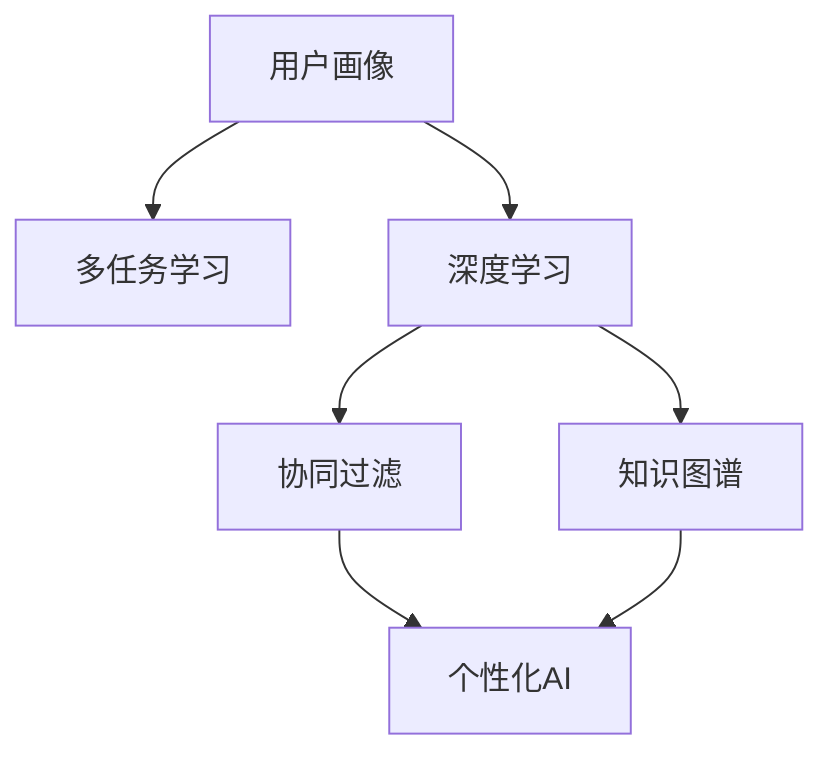

                 

# 个性化AI：适应不同用户需求的智能系统

> 关键词：个性化AI,智能推荐,用户建模,深度学习,多任务学习

## 1. 背景介绍

### 1.1 问题由来
随着互联网和数字技术的迅猛发展，个性化推荐系统已经成为现代信息系统中不可或缺的组成部分。从电商到社交媒体，从内容创作到视频平台，几乎所有平台都采用了个性推荐技术，以提升用户体验、增加用户粘性、优化资源配置。然而，尽管个性化推荐系统在许多应用中取得了显著的成效，但在面临复杂多变、异构多样数据时，往往难以保证推荐的准确性和及时性。如何构建一个能够适应不同用户需求、动态更新且稳定高效的个性化推荐系统，成为了当下数据科学领域的重要挑战。

### 1.2 问题核心关键点
个性化推荐系统旨在通过算法分析用户行为数据，挖掘用户的隐式需求和偏好，实现精准推荐。其核心问题包括：

- 用户需求分析：如何从用户行为数据中提取隐式需求，构建用户画像。
- 推荐算法设计：如何高效处理海量数据，实现多维度特征融合和推荐模型训练。
- 系统评估与优化：如何评估推荐效果，进行模型调整与优化，确保推荐系统的高效性和可靠性。

针对这些问题，个性化AI技术通过深度学习和多任务学习等方法，构建多层次的智能推荐系统，实现了对不同用户需求的灵活适应和精准推荐。

### 1.3 问题研究意义
研究个性化AI技术，对于构建高效、稳定、可靠的推荐系统，提升用户体验和平台运营效率，具有重要意义：

- 提升用户体验：通过个性化推荐，用户可以更快地找到所需内容，增加停留时间和满意度。
- 增加用户粘性：精准推荐能够满足用户多样化需求，增强用户对平台的依赖性和忠诚度。
- 优化资源配置：推荐系统可以优化广告投放、内容创作和资源分配，提高平台收益。
- 助力业务决策：基于个性化推荐的用户行为数据，企业可以洞察用户偏好，优化产品设计和营销策略。
- 推进技术创新：个性化AI技术的探索和发展，将推动深度学习、多任务学习、大数据分析等前沿技术的进步。

## 2. 核心概念与联系

### 2.1 核心概念概述

为了更好地理解个性化AI技术，本节将介绍几个关键概念：

- **个性化AI（Personalized AI）**：指通过深度学习等方法，根据用户的行为数据和特征，动态调整推荐算法和模型，实现对不同用户需求的个性化推荐。
- **用户画像（User Profile）**：通过对用户行为数据的建模，刻画用户的多维特征，包括兴趣、偏好、消费习惯等。
- **多任务学习（Multi-task Learning）**：指在处理多类任务时，共享模型参数以提升泛化能力。
- **深度学习（Deep Learning）**：指利用神经网络等模型，从大量数据中学习高级特征表示，并进行复杂的决策和预测。
- **协同过滤（Collaborative Filtering）**：指通过用户之间的相似性进行推荐，无需显式标注，适用于数据稀疏场景。
- **知识图谱（Knowledge Graph）**：指通过关系图谱化的方式，组织和关联不同领域的数据，提供丰富的语义信息。

这些核心概念之间的联系和相互作用可以通过以下Mermaid流程图来展示：



这个流程图展示了个性化AI技术在用户画像、多任务学习、深度学习、协同过滤和知识图谱的支持下，如何构建一个高效且灵活的推荐系统。用户画像和多任务学习为深度学习模型提供了数据和任务的多样性，协同过滤和知识图谱提供了额外的数据结构和语义信息，共同驱动了个性化AI技术的发展和应用。

## 3. 核心算法原理 & 具体操作步骤

### 3.1 算法原理概述

个性化AI技术的核心原理是利用深度学习模型，对用户行为数据进行建模，并根据不同用户需求调整推荐模型。其核心流程包括：

1. **用户画像构建**：从用户历史行为数据中提取多维度特征，构建用户画像。
2. **推荐模型训练**：利用多任务学习和深度学习等方法，训练推荐模型。
3. **个性化推荐生成**：根据用户画像和推荐模型，生成个性化推荐结果。
4. **推荐效果评估与优化**：通过评估推荐效果，调整模型参数和优化算法。

### 3.2 算法步骤详解

个性化AI技术的实现一般包括以下几个关键步骤：

**Step 1: 数据收集与预处理**
- 收集用户行为数据，包括点击、浏览、评分、评论等。
- 清洗数据，去除噪声和异常值，处理缺失数据。

**Step 2: 用户画像构建**
- 通过统计分析、聚类等方法，从用户行为数据中提取多维度特征，如兴趣标签、消费偏好等。
- 构建用户画像，以多维度特征描述用户需求和偏好。

**Step 3: 推荐模型训练**
- 选择合适的推荐算法，如协同过滤、深度学习等，训练推荐模型。
- 利用多任务学习和深度学习，提升模型的泛化能力。
- 在训练集上评估模型效果，选择最优模型。

**Step 4: 个性化推荐生成**
- 根据用户画像和推荐模型，生成个性化推荐结果。
- 考虑实时性和动态性，根据用户反馈和行为数据更新推荐结果。

**Step 5: 推荐效果评估与优化**
- 在验证集和测试集上评估推荐效果，如精度、召回率、覆盖率等。
- 根据评估结果，调整模型参数，优化推荐算法。
- 使用A/B测试等方法，验证新模型和策略的实际效果。

### 3.3 算法优缺点

个性化AI技术具有以下优点：

- **精准推荐**：通过深度学习和多任务学习，能够构建更加精准的推荐模型，提升推荐效果。
- **用户适应**：能够根据用户行为数据和特征，动态调整推荐策略，适应不同用户需求。
- **多样化推荐**：能够处理多维度特征，提供更加丰富多样的推荐内容。

同时，个性化AI技术也存在一些局限性：

- **数据需求高**：构建高精度的用户画像和推荐模型，需要大量高质量的行为数据。
- **计算成本高**：深度学习模型的训练和优化需要大量计算资源和时间。
- **模型复杂**：模型结构复杂，维护和调试难度较大。
- **泛化能力有限**：对于新用户或冷启动问题，推荐效果可能较差。

### 3.4 算法应用领域

个性化AI技术在多个领域得到了广泛应用，例如：

- **电商推荐**：为用户推荐商品、优惠活动等。
- **内容推荐**：为用户推荐文章、视频、音乐等。
- **广告推荐**：为用户推荐广告和宣传内容。
- **个性化服务**：为用户提供定制化的服务，如推荐餐厅、旅游路线等。
- **智能客服**：根据用户查询，推荐相关问题和解决方案。

此外，个性化AI技术也在社交网络、新闻媒体、金融理财等领域得到应用，为不同场景下的用户提供个性化推荐服务。

## 4. 数学模型和公式 & 详细讲解 & 举例说明

### 4.1 数学模型构建

个性化AI技术的数学模型包括用户画像、推荐算法和模型训练等几个部分。下面分别介绍这些模型的构建方法。

**用户画像构建**
- **用户兴趣建模**：利用协同过滤或深度学习等方法，提取用户对不同物品的兴趣评分。
- **用户画像表示**：将用户的多维度兴趣表示为一个向量，用于后续的推荐计算。

**推荐算法训练**
- **协同过滤算法**：利用用户-物品评分矩阵，计算用户之间的相似度，推荐相似用户的评分物品。
- **深度学习推荐模型**：使用多层神经网络，从用户行为数据中学习高级特征表示，进行推荐。

**模型训练**
- **多任务学习**：将多个相关任务共享模型参数，提升泛化能力。
- **损失函数设计**：利用交叉熵、均方误差等损失函数，训练推荐模型。

### 4.2 公式推导过程

**用户兴趣建模**
设用户 $u$ 对物品 $i$ 的评分向量为 $r_u = (r_{ui1}, r_{ui2}, ..., r_{uin})$，物品 $i$ 的特征向量为 $h_i = (h_{i1}, h_{i2}, ..., h_{im})$。用户 $u$ 对物品 $i$ 的兴趣评分 $p_{ui}$ 可以表示为：

$$
p_{ui} = \mathbf{r_u}^T \mathbf{h_i}
$$

其中 $\mathbf{r_u}$ 和 $\mathbf{h_i}$ 分别表示用户和物品的向量表示，$\mathbf{r_u}^T \mathbf{h_i}$ 表示向量点乘。

**协同过滤算法**
设用户 $u$ 的兴趣向量为 $p_u$，物品 $i$ 的特征向量为 $h_i$，用户 $u$ 对物品 $i$ 的兴趣评分 $p_{ui}$ 可以表示为：

$$
p_{ui} = \mathbf{p_u}^T \mathbf{h_i}
$$

其中 $\mathbf{p_u}$ 表示用户 $u$ 的兴趣向量，$\mathbf{h_i}$ 表示物品 $i$ 的特征向量，$\mathbf{p_u}^T \mathbf{h_i}$ 表示向量点乘。

**深度学习推荐模型**
假设使用一个多层神经网络模型 $f$ 来预测用户 $u$ 对物品 $i$ 的评分 $p_{ui}$，其输入为 $x_u$（用户行为特征）和 $x_i$（物品特征），输出为评分 $p_{ui}$。模型的预测结果可以表示为：

$$
p_{ui} = f(\mathbf{x_u}, \mathbf{x_i})
$$

其中 $f$ 表示神经网络模型，$\mathbf{x_u}$ 和 $\mathbf{x_i}$ 分别表示用户行为特征和物品特征。

### 4.3 案例分析与讲解

以电商推荐为例，介绍个性化AI技术在实际应用中的构建与优化。

**用户画像构建**
- 收集用户历史行为数据，如点击、浏览、购买记录等。
- 对数据进行预处理，去除异常值和噪声。
- 利用协同过滤或深度学习，提取用户对不同商品的兴趣评分。
- 构建用户画像，表示为向量形式。

**推荐模型训练**
- 使用多层神经网络模型，训练推荐模型，预测用户对不同商品的评分。
- 利用多任务学习和深度学习，提升模型的泛化能力。
- 在训练集上评估模型效果，选择最优模型。

**个性化推荐生成**
- 根据用户画像和推荐模型，生成个性化推荐结果。
- 考虑实时性和动态性，根据用户反馈和行为数据更新推荐结果。

**推荐效果评估与优化**
- 在验证集和测试集上评估推荐效果，如精度、召回率、覆盖率等。
- 根据评估结果，调整模型参数，优化推荐算法。
- 使用A/B测试等方法，验证新模型和策略的实际效果。

## 5. 项目实践：代码实例和详细解释说明

### 5.1 开发环境搭建

在进行个性化AI技术实践前，我们需要准备好开发环境。以下是使用Python进行PyTorch开发的环境配置流程：

1. 安装Anaconda：从官网下载并安装Anaconda，用于创建独立的Python环境。

2. 创建并激活虚拟环境：
```bash
conda create -n pytorch-env python=3.8 
conda activate pytorch-env
```

3. 安装PyTorch：根据CUDA版本，从官网获取对应的安装命令。例如：
```bash
conda install pytorch torchvision torchaudio cudatoolkit=11.1 -c pytorch -c conda-forge
```

4. 安装相关库：
```bash
pip install pandas numpy scikit-learn joblib dask
```

5. 安装TensorBoard和Weights & Biases：
```bash
pip install tensorboard wandb
```

完成上述步骤后，即可在`pytorch-env`环境中开始个性化AI技术的开发实践。

### 5.2 源代码详细实现

下面我们以电商推荐为例，给出使用PyTorch进行深度学习推荐模型的代码实现。

首先，定义电商推荐任务的数据处理函数：

```python
import pandas as pd
import numpy as np
import torch
import torch.nn as nn
import torch.nn.functional as F
from torch.utils.data import Dataset, DataLoader

class ClickDataset(Dataset):
    def __init__(self, clicks, items, user_ids, num_items):
        self.clicks = clicks
        self.items = items
        self.user_ids = user_ids
        self.num_items = num_items
        
    def __len__(self):
        return len(self.clicks)
    
    def __getitem__(self, item):
        clicks = self.clicks[item]
        items = self.items[item]
        user_id = self.user_ids[item]
        item_ids = items['id']
        label = clicks['is_clicked']
        return {'user_id': user_id, 'item_ids': item_ids, 'label': label}
```

然后，定义深度学习推荐模型的编码器：

```python
class ClickEncoder(nn.Module):
    def __init__(self, num_users, num_items, embedding_dim=10):
        super(ClickEncoder, self).__init__()
        self.embedding = nn.Embedding(num_users, embedding_dim)
        self.feature_extractor = nn.Sequential(
            nn.Linear(2 * embedding_dim, 128),
            nn.ReLU(),
            nn.Linear(128, 64),
            nn.ReLU(),
            nn.Linear(64, 1)
        )
    
    def forward(self, user_ids, item_ids):
        user_embeddings = self.embedding(user_ids)
        item_embeddings = self.embedding(item_ids)
        concatenated = torch.cat((user_embeddings, item_embeddings), dim=1)
        return self.feature_extractor(concatenated)
```

接着，定义优化器、损失函数和训练函数：

```python
from torch.optim import Adam

def train_epoch(model, optimizer, loss_fn, dataloader):
    model.train()
    epoch_loss = 0
    for batch in dataloader:
        user_id = batch['user_id'].to(device)
        item_ids = batch['item_ids'].to(device)
        label = batch['label'].to(device)
        optimizer.zero_grad()
        output = model(user_id, item_ids)
        loss = loss_fn(output, label)
        epoch_loss += loss.item()
        loss.backward()
        optimizer.step()
    return epoch_loss / len(dataloader)

def evaluate(model, dataloader):
    model.eval()
    predictions, labels = [], []
    with torch.no_grad():
        for batch in dataloader:
            user_id = batch['user_id'].to(device)
            item_ids = batch['item_ids'].to(device)
            batch_labels = batch['label'].to(device)
            output = model(user_id, item_ids)
            batch_predictions = output > 0.5
            predictions.append(batch_predictions)
            labels.append(batch_labels)
    return np.mean(np.array(predictions) == np.array(labels))
```

最后，启动训练流程并在测试集上评估：

```python
from torch.utils.data import DataLoader

# 准备数据集
clicks = pd.read_csv('clicks.csv')
items = pd.read_csv('items.csv')
user_ids = pd.read_csv('user_ids.csv')
num_items = len(items['id'].unique())

# 划分训练集和测试集
train_clicks = clicks[clicks['is_clicked'] == 1]
test_clicks = clicks[clicks['is_clicked'] == 0]
train_dataset = ClickDataset(train_clicks, items, user_ids, num_items)
test_dataset = ClickDataset(test_clicks, items, user_ids, num_items)

# 定义模型和优化器
device = torch.device('cuda') if torch.cuda.is_available() else torch.device('cpu')
model = ClickEncoder(num_users=len(user_ids), num_items=num_items)
optimizer = Adam(model.parameters(), lr=0.001)

# 训练和评估
epochs = 10
batch_size = 64
train_loader = DataLoader(train_dataset, batch_size=batch_size, shuffle=True)
test_loader = DataLoader(test_dataset, batch_size=batch_size, shuffle=False)

for epoch in range(epochs):
    loss = train_epoch(model, optimizer, F.binary_cross_entropy, train_loader)
    print(f'Epoch {epoch+1}, train loss: {loss:.3f}')
    
    print(f'Epoch {epoch+1}, test accuracy: {evaluate(model, test_loader)}')
```

以上就是使用PyTorch对电商推荐进行深度学习推荐模型的代码实现。可以看到，得益于PyTorch的强大封装，我们可以用相对简洁的代码完成模型的定义和训练，进而构建个性化AI技术的应用实例。

### 5.3 代码解读与分析

让我们再详细解读一下关键代码的实现细节：

**ClickDataset类**：
- `__init__`方法：初始化电商数据集的各个字段。
- `__len__`方法：返回数据集的样本数量。
- `__getitem__`方法：对单个样本进行处理，提取用户ID、物品ID和标签，准备输入模型。

**ClickEncoder类**：
- `__init__`方法：定义模型的结构，包括嵌入层和多层神经网络。
- `forward`方法：实现模型的前向传播过程，将用户ID和物品ID转换为向量，并输出预测结果。

**train_epoch函数**：
- 定义训练过程中的损失函数（二元交叉熵），计算每个批次上的损失，更新模型参数。

**evaluate函数**：
- 定义测试过程中的损失函数（准确率），计算每个批次上的准确率，评估模型性能。

**训练流程**：
- 定义总的epoch数和batch size，开始循环迭代
- 每个epoch内，先在训练集上训练，输出平均loss
- 在测试集上评估，输出准确率
- 所有epoch结束后，打印最终测试结果

可以看到，PyTorch配合深度学习模型，使得电商推荐任务的实现变得简洁高效。开发者可以将更多精力放在数据处理、模型改进等高层逻辑上，而不必过多关注底层的实现细节。

当然，工业级的系统实现还需考虑更多因素，如模型的保存和部署、超参数的自动搜索、更灵活的任务适配层等。但核心的个性化AI技术基本与此类似。

## 6. 实际应用场景

### 6.1 智能推荐系统

个性化AI技术在智能推荐系统中的应用最为广泛。通过深度学习和多任务学习，推荐系统能够实时动态地调整推荐策略，满足不同用户的多样化需求。

在电商领域，个性化推荐系统可以根据用户的浏览、购买历史，生成个性化的商品推荐。例如，Amazon和阿里巴巴等电商平台都采用了基于深度学习的推荐系统，为用户推荐相关商品，提升用户满意度和转化率。

在内容推荐领域，个性化AI技术同样大放异彩。Netflix和Spotify等流媒体平台使用推荐系统为用户推荐电影、电视剧、音乐等内容，提高用户粘性和平台收益。

此外，个性化AI技术还在金融、医疗、旅游等多个领域得到应用，为不同场景下的用户提供个性化推荐服务。

### 6.2 个性化广告推荐

个性化AI技术在广告推荐中的应用也十分广泛。通过分析用户的点击、浏览、停留等行为数据，广告推荐系统能够精准定位潜在客户，实现高效投放。

例如，Google Ads和Facebook Ads等平台使用深度学习模型预测用户的广告点击概率，从而优化广告投放策略，提升广告效果和用户满意度。

### 6.3 智能客服系统

智能客服系统通过个性化AI技术，能够根据用户的问题和历史对话记录，提供精准的解答和建议，提升用户服务体验。

例如，客服机器人能够自动解答常见问题，如产品购买、物流跟踪等，减轻人工客服的工作负担，提高响应速度和处理效率。

### 6.4 未来应用展望

随着个性化AI技术的不断发展，未来在更多领域将得到应用，为不同场景下的用户提供更加个性化、高效的服务。

在智慧城市中，个性化AI技术可以为居民提供个性化交通出行方案、推荐餐厅、旅游路线等，提升城市管理水平和居民生活质量。

在智能家居中，个性化AI技术可以根据用户的习惯和偏好，推荐智能设备的使用方案，提升家居智能化水平。

在医疗领域，个性化AI技术可以根据患者的病历、基因信息等数据，推荐个性化的治疗方案和健康管理计划，提高治疗效果和患者满意度。

总之，个性化AI技术的应用前景广阔，有望在多个领域带来革命性变革，提升人类生活质量和工作效率。

## 7. 工具和资源推荐

### 7.1 学习资源推荐

为了帮助开发者系统掌握个性化AI技术，这里推荐一些优质的学习资源：

1. 《深度学习》系列课程：由Coursera和Udacity等平台提供的深度学习课程，深入浅出地介绍了深度学习的基本原理和应用场景。
2. 《多任务学习》系列论文：阅读Google、微软、斯坦福大学等机构的经典论文，了解多任务学习的最新进展和应用实践。
3. 《推荐系统》系列书籍：如《推荐系统实践》、《推荐算法》等，深入介绍推荐系统的理论基础和算法设计。
4. 《个性化推荐》系列博客：由知名AI开发者和科研人员撰写，分享最新的研究成果和实践经验。
5. 《TensorFlow教程》系列文档：TensorFlow官方提供的详细教程，涵盖从基础到高级的深度学习应用。

通过对这些资源的学习实践，相信你一定能够快速掌握个性化AI技术的精髓，并用于解决实际的推荐问题。

### 7.2 开发工具推荐

高效开发个性化AI技术，离不开优秀的工具支持。以下是几款用于个性化AI技术开发的常用工具：

1. PyTorch：基于Python的开源深度学习框架，灵活动态的计算图，适合快速迭代研究。大部分深度学习模型都有PyTorch版本的实现。
2. TensorFlow：由Google主导开发的开源深度学习框架，生产部署方便，适合大规模工程应用。同样有丰富的深度学习模型资源。
3. Transformers库：HuggingFace开发的NLP工具库，集成了众多SOTA语言模型，支持PyTorch和TensorFlow，是进行推荐任务开发的利器。
4. Weights & Biases：模型训练的实验跟踪工具，可以记录和可视化模型训练过程中的各项指标，方便对比和调优。与主流深度学习框架无缝集成。
5. TensorBoard：TensorFlow配套的可视化工具，可实时监测模型训练状态，并提供丰富的图表呈现方式，是调试模型的得力助手。
6. Jupyter Notebook：用于编写和执行Python代码的环境，支持代码片段的保存、共享和版本控制。

合理利用这些工具，可以显著提升个性化AI技术的开发效率，加快创新迭代的步伐。

### 7.3 相关论文推荐

个性化AI技术的发展离不开学界的持续研究。以下是几篇奠基性的相关论文，推荐阅读：

1. "Collaborative Filtering for Implicit Feedback Datasets"（Sofya Jermyn, Daniel Lemire）：提出了协同过滤算法的基本思想和实现方法。
2. "Neural Collaborative Filtering"（Christian Rendle）：展示了神经网络在推荐系统中的应用效果。
3. "Adaptive Multi-Task Learning"（Jianqing Fan, Shuhua Fan, Kenneth L. Ho, H. Henry Bau）：介绍了多任务学习在推荐系统中的应用。
4. "A Framework for Deep Learning Recommendation Systems"（Xu Qing，Liangxiang）：提出了基于深度学习的推荐系统框架。
5. "Knowledge Graph Recommendation"（Siddhartha Ghosh, Brajesh Kumar Singh）：介绍了知识图谱在推荐系统中的应用。

这些论文代表了个性化AI技术的发展脉络。通过学习这些前沿成果，可以帮助研究者把握学科前进方向，激发更多的创新灵感。

## 8. 总结：未来发展趋势与挑战

### 8.1 总结

本文对个性化AI技术的实现原理和方法进行了全面系统的介绍。首先阐述了个性化AI技术的研究背景和意义，明确了个性化推荐系统在提升用户体验、增加用户粘性和优化资源配置等方面的重要价值。其次，从原理到实践，详细讲解了个性化AI技术的数学模型和算法步骤，给出了电商推荐任务的具体代码实现。同时，本文还探讨了个性化AI技术在多个实际应用场景中的应用前景，展示了其在电商、广告、智能客服等领域的影响力。最后，本文提供了丰富的学习资源和开发工具推荐，力求为开发者提供全方位的技术指引。

通过本文的系统梳理，可以看到，个性化AI技术已经成为构建高效、稳定、可靠的推荐系统的重要手段。借助深度学习和多任务学习等技术，个性化AI能够精准分析用户行为，动态调整推荐策略，适应不同用户需求，从而在电商、内容推荐、广告推荐等多个领域发挥重要作用。未来，随着技术的不断演进和应用场景的不断扩展，个性化AI必将在更多领域带来变革性影响，为人类社会的发展和进步贡献力量。

### 8.2 未来发展趋势

展望未来，个性化AI技术的发展趋势如下：

1. **数据驱动**：随着大数据技术的发展，个性化AI将更多地依赖于数据驱动，通过海量数据挖掘用户需求，提升推荐精度和效果。
2. **多模态融合**：个性化AI将突破单一模态的限制，融合视觉、语音、文本等多种模态信息，实现更为全面和精准的推荐。
3. **实时动态**：个性化AI将实现实时动态推荐，能够根据用户行为实时调整推荐策略，适应用户需求的变化。
4. **个性化服务**：个性化AI将提供更加个性化和定制化的服务，提升用户满意度和平台收益。
5. **跨领域应用**：个性化AI技术将在更多领域得到应用，如医疗、金融、旅游等，带来深刻的行业变革。
6. **知识图谱融合**：个性化AI将与知识图谱等外部知识源进行融合，增强推荐模型的语义理解和知识推理能力。
7. **隐私保护**：个性化AI将更加注重用户隐私保护，通过差分隐私、联邦学习等技术，确保用户数据安全。

### 8.3 面临的挑战

尽管个性化AI技术已经取得了显著的进展，但在实际应用中仍面临诸多挑战：

1. **数据质量**：高质量的用户行为数据是实现精准推荐的前提，但数据收集和标注过程往往需要大量人力和时间，成本较高。
2. **模型复杂**：深度学习模型结构复杂，维护和调试难度较大，需要大量的计算资源和时间。
3. **冷启动问题**：对于新用户或稀疏数据，推荐模型难以精准推荐，推荐效果较差。
4. **隐私保护**：个性化AI技术需要收集和分析大量的用户数据，如何保护用户隐私和数据安全成为重要问题。
5. **跨领域迁移**：个性化AI技术在不同领域和任务上的迁移能力有限，难以实现通用的推荐策略。
6. **用户满意度**：如何平衡推荐效果和用户满意度，避免推荐过度，提升用户体验。
7. **推荐多样性**：如何平衡推荐的多样性和个性化，避免推荐同质化。

### 8.4 研究展望

面对个性化AI技术所面临的挑战，未来的研究需要在以下几个方面寻求新的突破：

1. **数据增强**：通过数据增强技术，提升数据多样性和质量，缓解冷启动问题。
2. **跨领域迁移**：开发跨领域迁移学习方法，提升模型的泛化能力，实现通用的推荐策略。
3. **隐私保护**：引入差分隐私、联邦学习等技术，保护用户数据隐私和数据安全。
4. **知识图谱融合**：利用知识图谱增强推荐模型的语义理解和知识推理能力，提升推荐效果。
5. **多模态融合**：融合视觉、语音、文本等多种模态信息，实现更为全面和精准的推荐。
6. **推荐多样性**：引入推荐多样性约束，平衡推荐的多样性和个性化，提升用户满意度。
7. **实时动态**：实现实时动态推荐，能够根据用户行为实时调整推荐策略，适应用户需求的变化。
8. **用户隐私**：引入用户隐私保护机制，确保用户数据安全。

这些研究方向的探索，必将引领个性化AI技术迈向更高的台阶，为构建高效、稳定、可靠的推荐系统提供有力支持。面向未来，个性化AI技术需要与其他人工智能技术进行更深入的融合，如知识表示、因果推理、强化学习等，多路径协同发力，共同推动推荐系统的进步。

## 9. 附录：常见问题与解答

**Q1：个性化AI技术在电商推荐中的应用效果如何？**

A: 个性化AI技术在电商推荐中已经得到了广泛的应用，并取得了显著的效果。例如，Amazon和阿里巴巴等电商平台都采用了基于深度学习的推荐系统，为用户推荐相关商品，显著提升了用户满意度和转化率。推荐系统能够根据用户的浏览、购买历史，生成个性化的商品推荐，提高用户粘性和平台收益。

**Q2：个性化AI技术面临的主要挑战是什么？**

A: 个性化AI技术在实际应用中面临的主要挑战包括：
1. 数据质量：高质量的用户行为数据是实现精准推荐的前提，但数据收集和标注过程往往需要大量人力和时间，成本较高。
2. 模型复杂：深度学习模型结构复杂，维护和调试难度较大，需要大量的计算资源和时间。
3. 冷启动问题：对于新用户或稀疏数据，推荐模型难以精准推荐，推荐效果较差。
4. 隐私保护：个性化AI技术需要收集和分析大量的用户数据，如何保护用户隐私和数据安全成为重要问题。
5. 跨领域迁移：个性化AI技术在不同领域和任务上的迁移能力有限，难以实现通用的推荐策略。
6. 用户满意度：如何平衡推荐效果和用户满意度，避免推荐过度，提升用户体验。
7. 推荐多样性：如何平衡推荐的多样性和个性化，避免推荐同质化。

**Q3：如何提升个性化AI技术的推荐效果？**

A: 提升个性化AI技术的推荐效果可以从以下几个方面入手：
1. 数据增强：通过数据增强技术，提升数据多样性和质量，缓解冷启动问题。
2. 多模态融合：融合视觉、语音、文本等多种模态信息，实现更为全面和精准的推荐。
3. 跨领域迁移：开发跨领域迁移学习方法，提升模型的泛化能力，实现通用的推荐策略。
4. 知识图谱融合：利用知识图谱增强推荐模型的语义理解和知识推理能力，提升推荐效果。
5. 推荐多样性：引入推荐多样性约束，平衡推荐的多样性和个性化，提升用户满意度。
6. 实时动态：实现实时动态推荐，能够根据用户行为实时调整推荐策略，适应用户需求的变化。
7. 用户隐私：引入用户隐私保护机制，确保用户数据安全。

这些方法可以结合具体应用场景，灵活运用，提升个性化AI技术的推荐效果。

**Q4：个性化AI技术的未来发展方向是什么？**

A: 个性化AI技术的未来发展方向包括：
1. 数据驱动：随着大数据技术的发展，个性化AI将更多地依赖于数据驱动，通过海量数据挖掘用户需求，提升推荐精度和效果。
2. 多模态融合：个性化AI将突破单一模态的限制，融合视觉、语音、文本等多种模态信息，实现更为全面和精准的推荐。
3. 实时动态：个性化AI将实现实时动态推荐，能够根据用户行为实时调整推荐策略，适应用户需求的变化。
4. 个性化服务：个性化AI将提供更加个性化和定制化的服务，提升用户满意度和平台收益。
5. 跨领域应用：个性化AI技术将在更多领域得到应用，如医疗、金融、旅游等，带来深刻的行业变革。
6. 知识图谱融合：个性化AI将与知识图谱等外部知识源进行融合，增强推荐模型的语义理解和知识推理能力。
7. 隐私保护：个性化AI技术需要引入差分隐私、联邦学习等技术，保护用户数据隐私和数据安全。

这些方向的研究与应用，将进一步推动个性化AI技术的发展，带来更广泛的应用前景。

**Q5：如何构建高质量的用户画像？**

A: 构建高质量的用户画像需要以下几个步骤：
1. 数据收集：收集用户的历史行为数据，包括点击、浏览、购买记录等。
2. 数据预处理：清洗数据，去除噪声和异常值，处理缺失数据。
3. 特征提取：利用协同过滤或深度学习等方法，提取用户对不同物品的兴趣评分，构建用户画像。
4. 画像表示：将用户的多维度兴趣表示为一个向量，用于后续的推荐计算。

通过以上步骤，可以构建出高质量的用户画像，为个性化推荐系统提供坚实的数据基础。

---

作者：禅与计算机程序设计艺术 / Zen and the Art of Computer Programming

