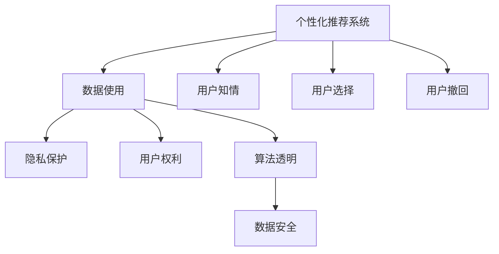

                 

# 个性化推荐的伦理考量与隐私保护

> 关键词：个性化推荐,隐私保护,伦理考量,数据使用,用户权利,算法透明,数据安全

## 1. 背景介绍

在数字化时代，个性化推荐系统已广泛应用于电商、内容媒体、社交网络等多个领域。通过分析用户行为数据，推荐系统能够精准匹配用户需求，提升用户满意度和平台收益。然而，这种基于数据的智能推荐也带来了诸多伦理和隐私问题。

个性化推荐系统通常依赖用户的浏览、购买、评分等行为数据。尽管这些数据能够帮助系统提供更加精准的推荐，但同时也存在被滥用、泄露等风险。如何在使用数据的同时，确保用户的隐私权和数据安全，已成为当前社会关注的焦点。本文将从个性化推荐的伦理考量和隐私保护两个方面，深入探讨这一问题。

## 2. 核心概念与联系

### 2.1 核心概念概述

为更系统地理解个性化推荐系统的伦理和隐私问题，本节将介绍几个关键概念及其相互关系：

- 个性化推荐系统（Personalized Recommendation System）：基于用户的历史行为数据，通过机器学习算法预测用户对某一商品的兴趣，并推荐相关商品的系统。
- 隐私保护（Privacy Protection）：保护用户个人信息，防止未经授权的访问和使用，维护用户隐私权益。
- 数据使用（Data Use）：在个性化推荐中，如何合法、合规、安全地使用用户数据。
- 用户权利（User Rights）：用户对个人信息的控制权，包括知情权、选择权、撤回权等。
- 算法透明（Algorithm Transparency）：推荐系统工作机制的透明度，用户能否理解算法决策过程。
- 数据安全（Data Security）：在存储、传输和处理过程中保护数据不被未授权访问和泄露的技术措施。

这些概念通过以下Mermaid流程图展示它们之间的联系：



这个流程图说明：

1. 个性化推荐系统依赖数据使用，即从用户那里收集和分析数据。
2. 数据使用过程中必须考虑到隐私保护，保护用户的数据不受侵害。
3. 数据使用和隐私保护密切相关，用户享有隐私权，应控制自己的数据使用方式。
4. 推荐系统算法应透明，用户应能理解算法如何基于其数据进行推荐。
5. 算法透明与数据安全同样重要，确保推荐系统的安全性和可信度。
6. 个性化推荐系统应尊重用户知情权、选择权和撤回权，确保用户能够掌握和使用自己的数据。

## 3. 核心算法原理 & 具体操作步骤
### 3.1 算法原理概述

个性化推荐系统的核心算法包括协同过滤、基于内容的推荐、混合推荐等。协同过滤算法根据用户行为相似性，预测用户对某一商品的兴趣；基于内容的推荐算法则根据商品特征，匹配用户偏好；混合推荐算法将多种推荐方法结合，提升推荐精度。

这些算法在处理用户数据时，通常需要收集和存储用户的浏览、购买、评分等行为数据。因此，如何确保这些数据的隐私和安全，是推荐系统面临的主要挑战。

### 3.2 算法步骤详解

#### 3.2.1 数据收集

推荐系统首先收集用户的浏览记录、购买行为、评分数据等，用于训练推荐模型。这一步是推荐系统的基础，数据的收集必须遵循合法合规的原则。

#### 3.2.2 数据预处理

收集到的数据需要进行清洗、去重、归一化等预处理，以便于后续的模型训练。同时，需要对敏感数据进行脱敏处理，如对姓名、身份证号等进行加密，防止信息泄露。

#### 3.2.3 模型训练

在预处理后的数据上训练推荐模型，如协同过滤算法、基于内容的推荐算法等。训练过程中，应使用安全的数据存储和传输机制，防止数据被未授权访问。

#### 3.2.4 推荐生成

模型训练完成后，使用新的用户数据进行推荐生成。推荐生成过程中，应确保算法的透明性，用户应能理解推荐结果的生成逻辑。

#### 3.2.5 结果展示与反馈

将推荐结果展示给用户，并根据用户反馈调整推荐策略。反馈信息也应被收集，用于后续模型的改进。

### 3.3 算法优缺点

个性化推荐系统的优点在于能够提供高度个性化的服务，提升用户体验和平台收益。缺点在于需要处理大量用户数据，存在隐私和数据安全风险。

#### 3.3.1 优点

1. **高度个性化**：根据用户行为数据，推荐系统能够提供量身定制的服务，满足用户的个性化需求。
2. **提升用户体验**：通过精准推荐，提升用户满意度和平台粘性。
3. **提升平台收益**：精准推荐能够有效提升销售额和用户留存率，增加平台收益。

#### 3.3.2 缺点

1. **隐私风险**：收集和处理用户数据存在隐私泄露风险，用户隐私权受到威胁。
2. **数据安全**：存储和传输过程中存在数据被未授权访问的风险，数据安全难以保障。
3. **算法透明性不足**：用户往往难以理解推荐算法的决策过程，缺乏算法透明性。

### 3.4 算法应用领域

个性化推荐系统已在电商、内容媒体、社交网络等多个领域得到广泛应用：

1. **电商推荐**：根据用户的浏览和购买记录，推荐商品，提高购买转化率。
2. **内容推荐**：根据用户的观看历史和评分数据，推荐视频、音乐、文章等内容，提升用户体验。
3. **社交网络推荐**：根据用户的行为数据，推荐新朋友、新闻、帖子等，增加平台粘性。
4. **个性化广告**：根据用户的行为数据，推荐精准广告，提高广告投放效果。

## 4. 数学模型和公式 & 详细讲解 & 举例说明

### 4.1 数学模型构建

个性化推荐系统通常使用协同过滤算法（Collaborative Filtering）。协同过滤算法分为基于用户的协同过滤和基于物品的协同过滤。

- 基于用户的协同过滤（User-Based Collaborative Filtering）：
$$
R_{ui} = \sum_{v=1}^{N}\frac{\text{Similarity}(u,v)\times I_{vi}}{||\text{User Matrix}_u|| \times ||\text{Item Matrix}_v||}
$$

其中，$R_{ui}$ 表示用户 $u$ 对物品 $i$ 的评分，$\text{Similarity}(u,v)$ 表示用户 $u$ 和用户 $v$ 的相似度，$I_{vi}$ 表示物品 $i$ 的评分，$\text{User Matrix}_u$ 和 $\text{Item Matrix}_v$ 分别表示用户和物品的评分矩阵。

- 基于物品的协同过滤（Item-Based Collaborative Filtering）：
$$
R_{ui} = \sum_{j=1}^{M}\frac{\text{Similarity}(i,j)\times I_{uj}}{||\text{Item Matrix}_i|| \times ||\text{User Matrix}_j||}
$$

其中，$R_{ui}$ 表示用户 $u$ 对物品 $i$ 的评分，$\text{Similarity}(i,j)$ 表示物品 $i$ 和物品 $j$ 的相似度，$I_{uj}$ 表示用户 $u$ 对物品 $j$ 的评分，$\text{Item Matrix}_i$ 和 $\text{User Matrix}_j$ 分别表示物品和用户的评分矩阵。

### 4.2 公式推导过程

上述公式中，$\text{Similarity}$ 的计算方式有多种，如余弦相似度、皮尔逊相关系数等。下面以余弦相似度为例进行推导：

设用户 $u$ 和物品 $i$ 的评分向量分别为 $\mathbf{u} = (u_1, u_2, \ldots, u_M)$ 和 $\mathbf{i} = (i_1, i_2, \ldots, i_N)$。则余弦相似度 $\text{Similarity}(u,v)$ 为：
$$
\text{Similarity}(u,v) = \frac{\mathbf{u} \cdot \mathbf{i}}{||\mathbf{u}|| \times ||\mathbf{i}||}
$$

代入协同过滤公式中，得：
$$
R_{ui} = \sum_{j=1}^{M}\frac{(\mathbf{u} \cdot \mathbf{i})\times I_{uj}}{||\mathbf{u}|| \times ||\mathbf{i}|| \times ||\mathbf{j}||}
$$

### 4.3 案例分析与讲解

以电商推荐系统为例，用户 $u$ 对物品 $i$ 的评分向量 $\mathbf{u}$ 和物品 $i$ 的评分向量 $\mathbf{i}$ 已知。设物品 $i$ 和物品 $j$ 的相似度 $\text{Similarity}(i,j)$ 为余弦相似度，则：

- 物品 $i$ 与物品 $j$ 的余弦相似度为 $\text{Similarity}(i,j) = \frac{\mathbf{i} \cdot \mathbf{j}}{||\mathbf{i}|| \times ||\mathbf{j}||}$。
- 用户 $u$ 对物品 $i$ 的预测评分 $R_{ui}$ 为：
$$
R_{ui} = \sum_{j=1}^{M}\frac{(\mathbf{u} \cdot \mathbf{i})\times I_{uj}}{||\mathbf{u}|| \times ||\mathbf{i}|| \times ||\mathbf{j}||}
$$

在推荐生成阶段，根据用户 $u$ 的评分向量 $\mathbf{u}$ 和物品评分向量 $\mathbf{i}$ 计算得到推荐结果。

## 5. 项目实践：代码实例和详细解释说明

### 5.1 开发环境搭建

为方便实验，我们将在Python环境下搭建推荐系统的开发环境。具体步骤如下：

1. 安装Python及依赖库：
```bash
sudo apt-get update
sudo apt-get install python3-pip
pip3 install numpy pandas scikit-learn scipy
```

2. 安装推荐算法库：
```bash
pip3 install fastFM lightfm
```

3. 安装数据处理库：
```bash
pip3 install tqdm fastparquet
```

4. 安装可视化库：
```bash
pip3 install matplotlib seaborn
```

### 5.2 源代码详细实现

以下是基于Python实现的协同过滤推荐系统示例代码：

```python
import numpy as np
from sklearn.metrics.pairwise import cosine_similarity

def collaborative_filtering(train_data, test_data, top_n=10):
    # 数据预处理
    train_ratings = train_data['rating'].values
    train_users = train_data['user_id'].values
    train_items = train_data['item_id'].values
    test_users = test_data['user_id'].values
    test_items = test_data['item_id'].values
    
    # 计算用户和物品的余弦相似度
    user_matrix = cosine_similarity(train_ratings[:, None], train_ratings[None, :])
    item_matrix = cosine_similarity(train_items[:, None], train_items[None, :])
    
    # 计算预测评分
    def predict_ratings(user_id, item_id):
        user_index = np.where(train_users == user_id)[0][0]
        item_index = np.where(train_items == item_id)[0][0]
        return np.dot(user_matrix[user_index], item_matrix[item_index])
    
    # 生成推荐结果
    test_user_ratings = []
    for user_id in test_users:
        for item_id in test_items:
            rating = predict_ratings(user_id, item_id)
            test_user_ratings.append((user_id, item_id, rating))
    
    # 排序推荐结果
    test_user_ratings = sorted(test_user_ratings, key=lambda x: x[2], reverse=True)
    
    # 展示推荐结果
    for user_id, item_id, rating in test_user_ratings[:top_n]:
        print(f"User {user_id}, Item {item_id}, Rating: {rating}")
        
    return test_user_ratings[:top_n]

# 数据加载与预处理
train_data = pd.read_csv('train_data.csv', parse_dates=['timestamp'])
test_data = pd.read_csv('test_data.csv', parse_dates=['timestamp'])

# 数据处理
train_data = train_data.drop(['timestamp', 'user_id'], axis=1)
train_data = train_data.drop_duplicates()
test_data = test_data.drop(['timestamp', 'user_id'], axis=1)

# 运行推荐算法
collaborative_filtering(train_data, test_data, top_n=10)
```

### 5.3 代码解读与分析

在上述代码中，我们使用了Python的NumPy和Scikit-Learn库来计算余弦相似度，并根据余弦相似度计算预测评分。具体步骤如下：

1. 加载并预处理训练和测试数据。
2. 计算用户和物品的余弦相似度矩阵。
3. 定义预测评分函数，根据用户和物品的相似度计算预测评分。
4. 生成推荐结果，并根据评分进行排序。
5. 展示推荐结果。

该示例代码实现了一个简单的协同过滤推荐系统，用于电商推荐。在实际应用中，推荐系统还需要考虑用户隐私保护、数据安全和算法透明等问题。

## 6. 实际应用场景

### 6.1 电商推荐

在电商推荐中，推荐系统会根据用户的浏览和购买历史，推荐用户可能感兴趣的商品。电商推荐系统可以提升用户购买转化率和平台销售额，同时也存在隐私泄露和数据安全问题。

例如，亚马逊的推荐系统会根据用户的浏览历史和购买记录，推荐相关商品。但用户的行为数据会被收集和存储，存在隐私泄露风险。

### 6.2 内容推荐

内容推荐系统如Netflix、Spotify等，会根据用户的观看和收听历史，推荐用户可能感兴趣的视频、音乐等。这些系统需要处理大量用户数据，存在隐私保护和数据安全风险。

### 6.3 社交网络推荐

社交网络推荐系统如Facebook、微信等，会根据用户的行为数据，推荐新朋友、新闻、帖子等内容。用户的行为数据被收集和分析，存在隐私泄露和数据安全问题。

### 6.4 未来应用展望

未来，随着技术的进步和应用的普及，个性化推荐系统将在更多领域得到应用。但同时，也需要更加重视隐私保护和数据安全问题。

1. **隐私保护技术**：如差分隐私、同态加密等技术，可以在数据分析中保护用户隐私。
2. **数据安全措施**：如数据加密、访问控制等措施，可以保障数据安全。
3. **算法透明性**：如算法可解释性技术，可以让用户理解推荐算法的决策过程。
4. **用户控制权**：如数据访问和使用权，让用户能够自主掌握和管理自己的数据。

## 7. 工具和资源推荐

### 7.1 学习资源推荐

为帮助开发者深入理解个性化推荐系统的伦理和隐私问题，以下是一些推荐的学习资源：

1. **《推荐系统实战》**：刘建平老师所著，介绍了推荐系统的基本原理和实际应用，包括隐私保护和伦理考量。
2. **Coursera《Recommender Systems》**：斯坦福大学开设的课程，介绍了推荐系统的理论和实践，包括隐私保护和数据安全。
3. **Kaggle数据竞赛**：通过参与Kaggle的推荐系统竞赛，可以实践隐私保护和数据安全的相关技术。

### 7.2 开发工具推荐

为方便开发者构建个性化推荐系统，以下是一些推荐的工具：

1. **Python**：由于其强大的数据处理和机器学习库，Python是构建推荐系统的主要语言。
2. **Pandas**：用于数据处理和分析。
3. **NumPy**：用于高效数值计算。
4. **Scikit-Learn**：用于机器学习和数据分析。
5. **TensorFlow**：用于深度学习模型训练。

### 7.3 相关论文推荐

个性化推荐系统的研究论文众多，以下是几篇推荐阅读的论文：

1. **《推荐系统》**：Xian Wu和Yan Liu所著，介绍了推荐系统的基本原理和应用。
2. **《推荐系统的隐私保护》**：Li Ming著，介绍了推荐系统的隐私保护技术。
3. **《推荐系统的数据安全》**：Chen Shen和Xiang Sun所著，介绍了推荐系统的数据安全措施。

## 8. 总结：未来发展趋势与挑战

### 8.1 总结

本文从个性化推荐的伦理考量和隐私保护两个方面，系统地介绍了推荐系统的核心问题。具体内容如下：

1. 个性化推荐系统的核心算法包括协同过滤、基于内容的推荐等，但其面临的隐私和数据安全问题不容忽视。
2. 隐私保护和数据安全是推荐系统的重要考量，用户对隐私权的控制权、算法的透明性等均需要重视。
3. 推荐系统的实际应用涉及电商、内容媒体、社交网络等多个领域，需要根据不同场景进行优化。
4. 未来，推荐系统需要更加注重隐私保护和数据安全，提升算法透明性，保障用户控制权。

### 8.2 未来发展趋势

1. **隐私保护技术**：随着技术的进步，隐私保护技术将更加成熟，差分隐私、同态加密等技术将得到广泛应用。
2. **数据安全措施**：数据加密、访问控制等措施将进一步完善，保障数据安全。
3. **算法透明性**：推荐系统的算法透明性将提升，用户将能够更好地理解推荐结果的生成逻辑。
4. **用户控制权**：用户将享有更多的控制权，能够自主决定数据的收集和使用方式。

### 8.3 面临的挑战

尽管推荐系统在技术上取得了重要进展，但在实际应用中仍面临诸多挑战：

1. **隐私泄露风险**：推荐系统需要处理大量用户数据，存在隐私泄露风险。
2. **数据安全问题**：存储和传输过程中存在数据被未授权访问的风险。
3. **算法透明性不足**：用户往往难以理解推荐算法的决策过程。
4. **用户控制权受限**：用户对数据的控制权受限，存在数据滥用的风险。

### 8.4 研究展望

未来，推荐系统的研究将进一步深入，有望在隐私保护、数据安全、算法透明性和用户控制权等方面取得突破。

1. **隐私保护**：研究更加高效的隐私保护技术，如差分隐私、同态加密等。
2. **数据安全**：研究更加可靠的数据安全措施，如数据加密、访问控制等。
3. **算法透明性**：研究算法可解释性技术，提升推荐系统的透明性。
4. **用户控制权**：研究用户对数据的控制权保障措施，提升用户信任度。

总之，个性化推荐系统的伦理和隐私问题是一个复杂而重要的话题。只有在技术、伦理和法规等多个层面进行综合考虑，才能真正实现推荐系统的智能化和人性化。

## 9. 附录：常见问题与解答

**Q1：个性化推荐系统如何确保用户隐私？**

A: 推荐系统可以通过以下方式确保用户隐私：

1. 数据匿名化：在数据收集和处理过程中，去除或模糊化用户的身份信息。
2. 差分隐私：在数据分析和模型训练过程中，引入噪声，保护用户隐私。
3. 访问控制：严格控制数据访问权限，确保只有授权人员能够访问敏感数据。
4. 数据加密：在数据存储和传输过程中，使用加密技术保护数据安全。

**Q2：推荐系统如何提升算法透明性？**

A: 推荐系统可以通过以下方式提升算法透明性：

1. 算法可解释性：使用可解释性技术，如LIME、SHAP等，解释推荐算法的决策过程。
2. 特征重要性：展示推荐系统所使用的关键特征和权重，帮助用户理解推荐结果。
3. 交互式界面：设计交互式界面，让用户能够自主探索和调整推荐结果。

**Q3：推荐系统如何保障数据安全？**

A: 推荐系统可以通过以下方式保障数据安全：

1. 数据加密：使用加密技术保护数据在传输和存储过程中的安全。
2. 访问控制：严格控制数据访问权限，确保只有授权人员能够访问敏感数据。
3. 安全审计：定期进行安全审计，及时发现和修复安全漏洞。
4. 数据脱敏：在数据分析和模型训练过程中，对敏感数据进行脱敏处理，保护用户隐私。

**Q4：推荐系统如何确保用户控制权？**

A: 推荐系统可以通过以下方式确保用户控制权：

1. 数据访问权：让用户能够自主决定是否授权推荐系统使用其数据。
2. 数据删除权：让用户能够自主删除推荐系统中的数据。
3. 数据控制权：让用户能够自主选择哪些数据可以被推荐系统使用，哪些数据不可以。
4. 知情权：向用户明示推荐系统的数据使用方式，保障用户知情权。

本文从个性化推荐的伦理考量和隐私保护两个方面，深入探讨了推荐系统的核心问题。通过深入理解推荐系统的伦理和隐私问题，我们能够更好地构建安全、可靠、智能的推荐系统，提升用户体验和平台收益。未来，随着技术的进步和应用的普及，个性化推荐系统将在更多领域得到应用，为用户带来更加便捷和贴心的服务。

