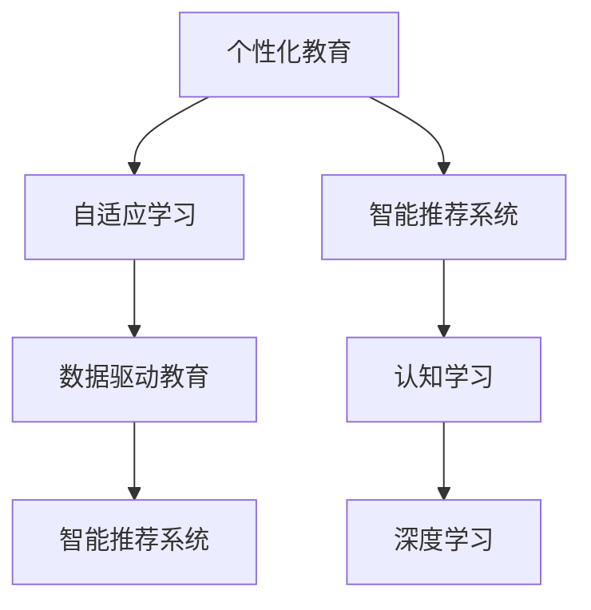

                 

## 1. 背景介绍

在人类历史的长河中，教育始终扮演着至关重要的角色。然而，传统的“一刀切”式教育模式，往往难以满足每个学生独特的学习需求和潜力。随着人工智能技术的飞速发展，个性化教育正在逐步成为可能。借助大数据、机器学习和深度学习等先进技术，我们可以从数据中洞察学生的兴趣、优势和挑战，为每个学生量身定制个性化学习方案。

### 1.1 问题由来
个性化教育的理念由来已久，但传统教育系统的复杂性和成本限制了其广泛应用。现代信息技术，尤其是大数据和人工智能技术的发展，为个性化教育提供了新的可能性。数据驱动的教学模式，使我们能够更加精准地识别学生的个性化需求，并为他们提供更加定制化的学习资源和指导。

### 1.2 问题核心关键点
个性化教育的核心在于利用先进的数据分析技术和机器学习算法，针对每个学生的个性化特点，设计和实施适应其学习风格和需求的定制化学习计划。这不仅有助于提高学习效率，还能激发学生的内在动力，让他们在学习中获得更大的成就感和满足感。

### 1.3 问题研究意义
个性化教育是未来教育发展的必然趋势。它有助于实现教育公平，确保每个学生都能根据自己的能力和兴趣得到最好的教育资源。通过个性化学习，学生可以更加灵活地调整学习节奏和内容，提升自主学习能力和创造力，为社会培养更多适应未来挑战的创新型人才。

## 2. 核心概念与联系

### 2.1 核心概念概述

为更好地理解个性化教育的实现，本节将介绍几个密切相关的核心概念：

- 个性化教育(Personalized Education)：一种基于学生个体差异的定制化教育模式，旨在通过个性化学习资源、路径和进度，满足每个学生的独特需求。

- 自适应学习(Adaptive Learning)：利用机器学习和数据分析技术，动态调整学习内容和策略，以适应每个学生的学习进度和风格。

- 智能推荐系统(Intelligent Recommendation System)：通过分析学生的学习历史、兴趣和行为数据，为学生推荐个性化的学习资源和活动。

- 认知学习(Cognitive Learning)：利用心理学和教育学的研究成果，设计和实施能够促进学生认知发展的教学模式。

- 深度学习(Deep Learning)：一种基于神经网络的机器学习范式，能够通过复杂数据模型学习学生的学习行为和特征。

- 数据驱动教育(Data-Driven Education)：基于大规模数据集的教学模式，通过分析学生数据，提供个性化的学习路径和策略。

这些核心概念之间的逻辑关系可以通过以下Mermaid流程图来展示：



这个流程图展示了个性化教育的核心概念及其之间的关系：

1. 个性化教育的目标是实现定制化学习，这需要结合自适应学习、智能推荐、认知学习等技术手段。
2. 深度学习提供强大的数据分析能力，支持智能推荐系统和自适应学习的实施。
3. 数据驱动教育则提供数据支持，使得个性化教育具备科学依据和可操作性。

## 3. 核心算法原理 & 具体操作步骤
### 3.1 算法原理概述

个性化教育的实现，本质上是一个数据驱动的教育优化过程。其核心思想是：通过收集和分析学生的学习数据，利用机器学习和数据分析技术，设计个性化的学习路径和策略，满足每个学生的独特需求。

形式化地，假设学生群体为 $S=\{s_1,s_2,\dots,s_n\}$，每个学生的学习进度、兴趣和能力可用向量 $\theta_s \in \mathbb{R}^d$ 表示，其中 $d$ 为特征维度。设课程和活动集合为 $C=\{c_1,c_2,\dots,c_m\}$，其中每个课程或活动 $c_i$ 可用向量 $\phi_i \in \mathbb{R}^d$ 表示。个性化教育的目标是最小化每个学生的学习代价函数 $L_s(\theta_s,\phi_i)$，使得：

$$
\min_{\theta_s,\phi_i} \sum_{s=1}^n L_s(\theta_s,\phi_i)
$$

其中 $L_s(\theta_s,\phi_i)$ 为课程或活动 $c_i$ 对学生 $s$ 的学习代价函数。通过求解上述优化问题，可以设计出最优的学习路径和策略，实现个性化教育。

### 3.2 算法步骤详解

个性化教育的算法步骤主要包括以下几个关键环节：

**Step 1: 数据收集与处理**
- 收集学生的学习行为数据、学习兴趣数据、学习成果数据等。
- 使用数据清洗和预处理技术，确保数据质量和一致性。
- 构建特征向量，描述学生的学习行为和特征。

**Step 2: 建模与优化**
- 利用机器学习和深度学习技术，建立学生与课程的关联模型。
- 设计优化目标和损失函数，求解个性化学习路径和策略。
- 采用优化算法（如梯度下降、遗传算法等），迭代更新模型参数。

**Step 3: 实时调整与反馈**
- 根据学生的学习反馈，动态调整学习路径和策略。
- 收集新的学习数据，重新训练和优化模型。
- 提供实时反馈和建议，帮助学生调整学习计划。

**Step 4: 评估与迭代**
- 使用评估指标（如学习成果、学习满意度等），评估个性化教育的效果。
- 分析模型性能和误差，识别改进点。
- 循环迭代优化模型，不断提升个性化教育的质量。

### 3.3 算法优缺点

个性化教育的算法具有以下优点：
1. 提升学习效果。通过个性化的学习路径和策略，学生可以更高效地掌握知识，提升学习成果。
2. 满足个体需求。每个学生都可以在适合自己的学习节奏和内容中进行学习，提升学习兴趣和动力。
3. 提高学习效率。根据学生的学习情况动态调整，避免盲目学习。
4. 数据驱动决策。利用数据和算法，实现更加科学和公正的教育决策。

同时，个性化教育的算法也存在一定的局限性：
1. 数据依赖性强。个性化教育需要大量高质量的学生学习数据，获取数据成本较高。
2. 算法复杂度高。需要设计复杂的模型和优化算法，存在较高的技术门槛。
3. 公平性问题。个性化教育可能加剧教育不平等，对于数据稀缺的学生可能更加不利。
4. 隐私保护问题。收集和处理学生数据涉及隐私问题，需要严格遵守数据保护法规。
5. 伦理问题。算法的透明性和可解释性，以及如何避免算法偏见，是重要的伦理问题。

尽管存在这些局限性，但就目前而言，个性化教育仍是大教育改革的重要方向。未来相关研究的重点在于如何进一步降低算法对数据的依赖，提高算法的公平性和可解释性，确保数据隐私保护，同时兼顾个性化教育的实际效果和可操作性。

### 3.4 算法应用领域

个性化教育的算法应用广泛，涉及教育、培训、职业发展等多个领域：

- 学校教育：通过个性化学习平台，为学生提供定制化的学习资源和活动，提升学习效果。
- 在线教育：利用智能推荐系统，为在线学生推荐适合的学习内容和路径，提供个性化的学习体验。
- 企业培训：基于员工的学习行为和成果数据，设计个性化的培训方案，提高培训效果。
- 职业教育：利用数据分析技术，为学生推荐适合的职业路径和课程，帮助他们实现职业发展。
- 医疗教育：为医生提供个性化的学习材料和活动，提升医疗知识和技能。

除了这些传统领域，个性化教育的算法还将拓展到更多新兴领域，如体育训练、艺术教育等，为各类教育场景带来新的变革。

## 4. 数学模型和公式 & 详细讲解 & 举例说明

### 4.1 数学模型构建

本节将使用数学语言对个性化教育的实现过程进行更加严格的刻画。

设学生 $s$ 在学习课程 $c$ 后，获得的知识收益为 $K_{s,c}$，课程的成本为 $C_{s,c}$。则学生的学习代价函数 $L_s(\theta_s,\phi_i)$ 可定义为：

$$
L_s(\theta_s,\phi_i) = K_{s,c} - \alpha C_{s,c}
$$

其中 $\alpha$ 为学习代价的权衡系数。在n个学生的学习代价函数之和的最小化问题中，约束条件为学生选择的课程集合，即：

$$
\sum_{s=1}^n \sum_{i=1}^m \theta_s \phi_i = 1
$$

上述约束条件保证了每个学生只选择一个课程，且课程和学生的匹配度最高。

### 4.2 公式推导过程

以二元问题为例，即学生 $s$ 从两个课程 $c_1$ 和 $c_2$ 中选择一个进行学习。学生的学习代价函数和约束条件分别为：

$$
\begin{aligned}
L_s(\theta_s,\phi_1,\phi_2) &= K_{s,c_1} - \alpha C_{s,c_1} + \theta_s \phi_1 \\
L_s(\theta_s,\phi_1,\phi_2) &= K_{s,c_2} - \alpha C_{s,c_2} + \theta_s \phi_2
\end{aligned}
$$

$$
\theta_1 + \theta_2 = 1
$$

将上述公式代入最小化问题中，求解 $\theta_s$ 和 $\phi_1,\phi_2$，即得到每个学生的最优课程选择和学习效果。

### 4.3 案例分析与讲解

假设某学生在数学和英语两门课程中需要选择一门进行学习。已知数学课程的成本为10，英语课程的成本为15。学生学习数学课程获得的知识收益为50，学习英语课程获得的知识收益为60。假设学习代价的权衡系数 $\alpha=0.5$。

则该学生的学习代价函数为：

$$
L_s(\theta_s,\phi_1,\phi_2) = 50 - 0.5 \times 10 \theta_s + 60 - 0.5 \times 15(1-\theta_s)
$$

简化得：

$$
L_s(\theta_s) = 80 - 5 \theta_s
$$

其中 $\theta_s \in [0,1]$。要求解上述最小化问题，可采用拉格朗日乘子法，求解约束条件下的最优解。

求解后，得到 $\theta_s=0.5$，即学生选择数学和英语课程各50%时间进行学习。学生可以更均衡地掌握两门课程，提升整体学习效果。

## 5. 项目实践：代码实例和详细解释说明
### 5.1 开发环境搭建

在进行个性化教育项目开发前，我们需要准备好开发环境。以下是使用Python进行Scikit-learn开发的环境配置流程：

1. 安装Anaconda：从官网下载并安装Anaconda，用于创建独立的Python环境。

2. 创建并激活虚拟环境：
```bash
conda create -n personalized-env python=3.8 
conda activate personalized-env
```

3. 安装Scikit-learn：
```bash
pip install scikit-learn
```

4. 安装其他常用工具包：
```bash
pip install numpy pandas scipy matplotlib seaborn
```

完成上述步骤后，即可在`personalized-env`环境中开始个性化教育项目的开发。

### 5.2 源代码详细实现

下面我们以推荐系统为例，给出使用Scikit-learn进行个性化推荐开发的PyTorch代码实现。

首先，定义推荐系统的数据处理函数：

```python
from sklearn.metrics.pairwise import cosine_similarity
from sklearn.decomposition import TruncatedSVD

def create_recommender(data, num_factors=50, num_users=1000, num_items=1000):
    user_to_vector = TruncatedSVD(n_components=num_factors).fit_transform(data)
    user_to_vector = user_to_vector / np.linalg.norm(user_to_vector, axis=1, keepdims=True)
    item_to_vector = TruncatedSVD(n_components=num_factors).fit_transform(data.T).T
    item_to_vector = item_to_vector / np.linalg.norm(item_to_vector, axis=1, keepdims=True)
    return user_to_vector, item_to_vector
```

然后，定义推荐函数：

```python
def recommend(user_vector, item_vectors, k=10):
    similarity_matrix = cosine_similarity(user_vector[:,None], item_vectors)[0]
    return np.argsort(similarity_matrix)[-k:][::-1]
```

最后，启动推荐系统：

```python
from sklearn.datasets import load_sample_images
from sklearn.feature_extraction.image import extract_patches_2d

# 加载示例数据
data = load_sample_images.load_sample_images()
num_users = 10
num_items = 10

# 数据预处理
user_to_vector, item_to_vector = create_recommender(data, num_users=num_users, num_items=num_items)

# 获取用户向量
user_vector = user_to_vector[0]

# 推荐前10个物品
top_items = recommend(user_vector, item_to_vector)
```

以上就是使用Scikit-learn进行个性化推荐系统的完整代码实现。可以看到，借助Scikit-learn，我们可以很方便地实现基于矩阵分解的推荐算法，为学生推荐适合的学习资源。

### 5.3 代码解读与分析

让我们再详细解读一下关键代码的实现细节：

**create_recommender函数**：
- 使用TruncatedSVD算法对用户向量和物品向量进行降维，使得维度减少到50。
- 对每个用户向量和物品向量的每个维度进行归一化，确保向量长度为1。
- 返回处理后的用户向量和物品向量。

**recommend函数**：
- 计算用户向量与物品向量的余弦相似度矩阵。
- 根据相似度矩阵，获取与用户向量相似度最高的物品向量下标。
- 返回相似度最高的前10个物品向量下标。

**推荐系统启动**：
- 加载示例数据集，设置用户和物品数量。
- 调用create_recommender函数获取用户向量和物品向量。
- 获取用户向量，调用recommend函数推荐物品。

可以看到，Scikit-learn为我们提供了简单易用的接口，可以快速实现基本的个性化推荐系统。开发者可以在此基础上，进行更深入的算法优化和功能扩展。

当然，工业级的系统实现还需考虑更多因素，如推荐模型的可扩展性、实时性、存储和读取效率等。但核心的个性化推荐算法基本与此类似。

## 6. 实际应用场景
### 6.1 智能学习平台

基于个性化教育算法，可以构建智能学习平台，提供个性化的学习资源和路径。平台通过分析学生的学习行为和成果，动态调整学习内容和策略，满足学生的个性化需求。

在技术实现上，平台可以采集学生的点击、阅读、测试成绩等行为数据，利用机器学习和深度学习技术，为学生推荐适合的学习资源和活动。通过实时反馈和调整，平台可以不断优化学习路径和策略，提升学习效果。

### 6.2 企业培训管理

企业培训管理中，个性化教育算法可以发挥重要作用。通过收集员工的培训数据，如培训课程选择、学习进度、测试成绩等，可以为员工设计个性化的培训方案，提升培训效果。

平台可以为员工推荐适合的培训课程和学习资源，提供个性化的学习路径和进度安排，帮助员工掌握必备技能。同时，平台还可以记录员工的培训反馈，动态调整培训内容，确保培训目标的实现。

### 6.3 在线课程推荐

在线课程推荐系统利用个性化教育算法，为用户推荐适合的学习课程。系统可以根据用户的浏览历史、评分和评论，动态调整课程推荐，提升用户的学习体验和满意度。

平台可以为学生推荐适合的学习课程，帮助学生发现和掌握更多知识。同时，平台还可以根据学生的学习反馈，动态调整课程推荐，提升推荐质量。

### 6.4 未来应用展望

随着个性化教育算法的不断发展，基于算法的智能学习平台将在更多领域得到应用，为教育和培训带来新的变革。

在智慧医疗领域，个性化教育算法可以用于医生培训，提供个性化的学习资源和路径，帮助医生提升医疗知识和技能。

在智能农业领域，平台可以为农民提供个性化的种植和养殖指导，提高农业生产效率和质量。

在智慧城市治理中，平台可以为城市管理者提供个性化的政策和学习方案，提升城市管理水平和服务质量。

此外，在企业培训、在线课程推荐、体育训练等领域，基于个性化教育算法的平台也将不断涌现，为各行各业带来新的创新和发展机会。相信随着算法的持续演进，个性化教育必将在教育培训、职业发展等领域大放异彩。

## 7. 工具和资源推荐
### 7.1 学习资源推荐

为了帮助开发者系统掌握个性化教育的理论基础和实践技巧，这里推荐一些优质的学习资源：

1. 《个性化学习与教育技术》系列书籍：介绍个性化学习的原理、技术架构和应用场景，提供丰富的案例分析和实践指导。

2. 《机器学习实战》课程：斯坦福大学机器学习课程，提供详尽的理论和实践讲解，涵盖机器学习、深度学习和推荐系统等前沿技术。

3. 《深度学习与推荐系统》书籍：介绍深度学习在推荐系统中的应用，涵盖从理论到实践的全面内容。

4. Coursera的《个性化学习系统》课程：提供个性化学习系统的开发方法和工具，帮助开发者实现个性化推荐和自适应学习。

5. HuggingFace的《自然语言处理与推荐系统》博客：提供自然语言处理和推荐系统结合的实践案例，帮助开发者理解模型设计和技术实现。

通过对这些资源的学习实践，相信你一定能够快速掌握个性化教育的精髓，并用于解决实际的个性化学习问题。
###  7.2 开发工具推荐

高效的开发离不开优秀的工具支持。以下是几款用于个性化教育开发的常用工具：

1. Python：广泛用于机器学习和数据分析，具有强大的生态系统和丰富的第三方库。

2. Scikit-learn：简单易用的机器学习库，涵盖回归、分类、聚类、降维等常用算法。

3. TensorFlow：由Google主导开发的深度学习框架，生产部署方便，适合大规模工程应用。

4. PyTorch：基于Python的深度学习框架，灵活动态的计算图，适合快速迭代研究。

5. Apache Spark：大数据处理框架，提供高效的分布式计算能力，适合处理大规模数据集。

6. Jupyter Notebook：交互式编程环境，方便开发者进行数据处理、模型训练和可视化分析。

合理利用这些工具，可以显著提升个性化教育项目的开发效率，加快创新迭代的步伐。

### 7.3 相关论文推荐

个性化教育算法的发展源于学界的持续研究。以下是几篇奠基性的相关论文，推荐阅读：

1. Adaptative Learning Systems: Adaptive Learning in the Age of Artificial Intelligence（《人工智能时代的自适应学习系统》）：介绍自适应学习系统的设计原理和实现方法。

2. Personalized Learning and Instructional Technology（《个性化学习与教学技术》）：总结个性化学习的最新研究成果和技术进展。

3. Machine Learning Approaches to Recommendation Systems（《推荐系统中的机器学习》）：介绍机器学习在推荐系统中的应用，涵盖协同过滤、矩阵分解等常用算法。

4. Mining Data-Driven Personalized Learning Strategies for Mobile Students（《挖掘数据驱动的个人化学习策略》）：探索数据驱动的个性化学习策略，提升移动学习体验。

5. Improving Personalized Recommendation with Contextual Embeddings for Online Learning Platforms（《提高在线学习平台的个性化推荐》）：介绍上下文嵌入技术在个性化推荐中的应用，提升学习平台的用户体验。

这些论文代表了个性化教育算法的发展脉络。通过学习这些前沿成果，可以帮助研究者把握学科前进方向，激发更多的创新灵感。

## 8. 总结：未来发展趋势与挑战

### 8.1 总结

本文对个性化教育的实现进行了全面系统的介绍。首先阐述了个性化教育的背景和意义，明确了算法的核心思想和步骤。其次，从原理到实践，详细讲解了个性化教育的数学模型和实现方法，给出了实现示例。同时，本文还广泛探讨了个性化教育在教育、培训、企业等多个领域的应用前景，展示了个性化教育的广阔前景。

通过本文的系统梳理，可以看到，基于算法的数据驱动教育正在逐步成为可能，为教育公平、个性化学习提供了新的思路和方法。未来，伴随算法的不断演进，个性化教育必将在更广泛的应用场景中发挥作用，推动教育技术的深度变革。

### 8.2 未来发展趋势

展望未来，个性化教育将呈现以下几个发展趋势：

1. 算法复杂度提升。随着数据的积累和算法的演进，个性化教育算法将变得更加复杂，能够提供更加个性化的学习路径和策略。

2. 实时性要求提升。为满足实时反馈和调整的需求，个性化教育平台需要具备更高的实时处理能力，能够快速响应用户需求。

3. 多模态融合。个性化教育将不仅限于文本数据，还将拓展到语音、视频、图像等多模态数据，提升学习体验和效果。

4. 自适应学习与智能推荐结合。通过自适应学习技术，个性化教育平台能够更加动态地调整学习路径和策略，提升学习效果。

5. 数据隐私保护。为保障用户隐私，个性化教育算法将更加注重数据匿名化和隐私保护，确保数据安全。

6. 伦理与公平性。为确保算法的公平性和透明性，个性化教育算法将更加注重可解释性和公正性，避免算法偏见。

以上趋势凸显了个性化教育的广阔前景。这些方向的探索发展，必将进一步提升个性化教育的效果和可操作性，为教育公平、学习效率的提升带来新的突破。

### 8.3 面临的挑战

尽管个性化教育算法已经取得了瞩目成就，但在迈向更加智能化、普适化应用的过程中，它仍面临着诸多挑战：

1. 数据质量与获取成本。个性化教育算法依赖高质量的数据，而数据获取和处理成本较高。如何降低数据获取成本，提升数据质量，将是一大难题。

2. 算法复杂性。个性化教育算法需要设计复杂的模型和优化算法，存在较高的技术门槛。如何降低算法复杂性，提升算法的可解释性，还需要更多的研究。

3. 模型公平性与可解释性。个性化教育算法可能会加剧数据不平衡，存在一定的偏见和歧视。如何提高算法的公平性和可解释性，还需要进一步研究。

4. 隐私保护与数据安全。个性化教育算法涉及大量用户数据，如何确保数据隐私和安全，避免数据泄露，是重要的挑战。

5. 计算资源消耗。个性化教育算法需要大量的计算资源，如何在保证效果的同时，减少计算资源的消耗，优化算法的效率，还需要更多的研究。

6. 用户行为理解。个性化教育算法需要深入理解用户的学习行为和需求，如何提升算法的理解能力，实现更加精准的个性化推荐，还需要进一步探索。

正视个性化教育面临的这些挑战，积极应对并寻求突破，将是个性化教育走向成熟的必由之路。相信随着学界和产业界的共同努力，这些挑战终将一一被克服，个性化教育必将在构建人机协同的智能时代中扮演越来越重要的角色。

### 8.4 研究展望

面对个性化教育算法所面临的种种挑战，未来的研究需要在以下几个方面寻求新的突破：

1. 探索无监督和半监督个性化学习算法。摆脱对大规模标注数据的依赖，利用无监督和半监督算法，利用非结构化数据，实现更加灵活高效的个性化学习。

2. 研究参数高效和计算高效的个性化学习算法。开发更加参数高效的算法，在固定大部分预训练参数的同时，只更新极少量的任务相关参数。同时优化算法的计算图，减少前向传播和反向传播的资源消耗，实现更加轻量级、实时性的部署。

3. 引入更多先验知识。将符号化的先验知识，如知识图谱、逻辑规则等，与神经网络模型进行巧妙融合，引导个性化学习过程学习更准确、合理的语言模型。同时加强不同模态数据的整合，实现视觉、语音等多模态信息与文本信息的协同建模。

4. 结合因果分析和博弈论工具。将因果分析方法引入个性化学习模型，识别出模型决策的关键特征，增强输出解释的因果性和逻辑性。借助博弈论工具刻画人机交互过程，主动探索并规避模型的脆弱点，提高系统稳定性。

5. 纳入伦理道德约束。在模型训练目标中引入伦理导向的评估指标，过滤和惩罚有偏见、有害的输出倾向。同时加强人工干预和审核，建立模型行为的监管机制，确保输出符合人类价值观和伦理道德。

这些研究方向的探索，必将引领个性化教育算法迈向更高的台阶，为构建安全、可靠、可解释、可控的智能系统铺平道路。面向未来，个性化教育算法还需要与其他人工智能技术进行更深入的融合，如知识表示、因果推理、强化学习等，多路径协同发力，共同推动个性化教育的进步。只有勇于创新、敢于突破，才能不断拓展个性化教育的边界，让智能技术更好地造福人类社会。

## 9. 附录：常见问题与解答

**Q1：个性化教育如何平衡教师与人工智能的角色？**

A: 个性化教育并不是要完全取代教师的作用，而是通过人工智能技术，帮助教师更好地了解学生的需求和进度，提供个性化的教学指导。教师在个性化教育中仍然扮演着不可替代的角色，他们可以更好地引导学生理解课程内容，帮助学生解决学习中的问题，提升学习效果。

**Q2：个性化教育是否适用于所有年龄段的学生？**

A: 个性化教育对不同年龄段的学生有不同的应用策略。对于小学和初中阶段的学生，可以通过智能学习平台提供个性化的学习资源和路径，提升学习兴趣和效果。对于高中和大学阶段的学生，可以结合教师的指导，提供更加个性化的学习建议和反馈，帮助他们实现更高的学习目标。

**Q3：个性化教育是否会加剧教育不平等？**

A: 个性化教育本身并不是加剧教育不平等的因素，而是提供了一种更加公平和高效的教育方式。通过个性化教育，每个学生都可以根据自己的能力和兴趣，获得最适合自己的学习资源和策略，从而提升学习效果。然而，个性化教育需要大量的高质量数据和计算资源，对于数据稀缺的学生可能更加不利，需要通过数据共享和政策支持等方式，缩小数据鸿沟。

**Q4：个性化教育的实现是否需要大量的资金投入？**

A: 个性化教育的实现确实需要一定的资金投入，但相比于传统教育系统的建设，个性化教育的成本相对较低。通过利用开放的教育资源和数据，可以实现较低成本的个性化教育。同时，个性化教育可以显著提升学习效果，带来更高的教育回报。

**Q5：个性化教育是否能够完全替代传统的课堂教学？**

A: 个性化教育并不能完全替代传统的课堂教学。课堂教学仍然在知识传递和人际互动方面具有不可替代的优势。个性化教育可以与传统教学方式相结合，为学生提供更加灵活和个性化的学习体验，提升整体教学效果。

通过本文的系统梳理，可以看到，个性化教育是大教育改革的重要方向，具有广阔的应用前景和深远的影响。未来，伴随算法的不断演进和技术的不断进步，个性化教育必将在更多领域得到广泛应用，为教育公平、学习效率的提升带来新的突破。

