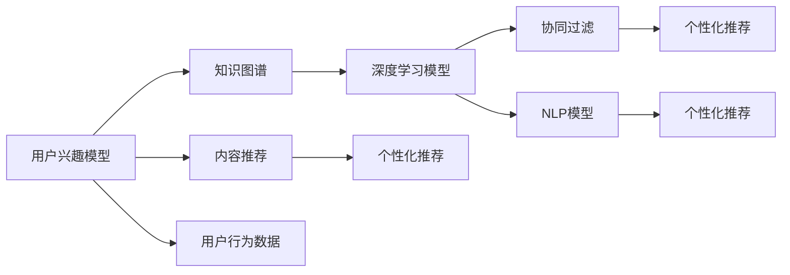

                 

# 个性化知识订阅提高知识获取的针对性

> 关键词：个性化推荐,知识订阅,知识图谱,深度学习,自然语言处理(NLP),协同过滤,内容推荐,用户兴趣

## 1. 背景介绍

在信息爆炸的互联网时代，个人面对海量的知识资源往往感到难以应对。如何精准高效地获取到对自己最有价值的信息，成为了一个重要且迫切的问题。传统的基于关键词搜索的方式，虽然在某些场景下仍能发挥作用，但其针对性和时效性已经难以满足用户日益提升的信息需求。个性化知识订阅技术应运而生，通过结合深度学习和大数据技术，能够更智能地为用户推荐感兴趣的知识点，大大提高了知识获取的针对性和效率。

本文将深入探讨个性化知识订阅技术的原理与应用实践，旨在为有志于改进知识获取方式的研究者、开发者和用户提供参考与指导。

## 2. 核心概念与联系

### 2.1 核心概念概述

为更好地理解个性化知识订阅技术，本节将介绍几个关键概念：

- **个性化推荐**：根据用户的历史行为、兴趣和偏好，智能推荐最符合其需求的产品或信息。个性化推荐技术广泛应用于电商、新闻、视频等多个领域。

- **知识订阅**：用户订阅特定领域或主题的知识点，获取持续更新的知识内容，避免信息过载，提升学习效率。

- **知识图谱**：基于图结构的知识库，记录实体间的关系，支持高效地进行知识推理和查询。

- **深度学习**：一类能够通过多层非线性变换自动提取特征的机器学习技术，包括卷积神经网络(CNN)、循环神经网络(RNN)、变分自编码器(VAE)等。

- **自然语言处理(NLP)**：使用计算机技术处理和分析自然语言，包括文本分类、情感分析、命名实体识别、机器翻译等。

- **协同过滤**：推荐系统中的经典算法，通过分析用户之间的相似性，向目标用户推荐其他用户喜欢的项目。

- **内容推荐**：利用用户与内容的互动数据，推荐用户可能感兴趣的新内容。

- **用户兴趣模型**：综合考虑用户的历史行为、偏好和实时反馈，建立用户兴趣的动态模型，指导推荐系统做出精准推荐。

这些核心概念之间存在密切的联系，共同构成了个性化知识订阅的基础框架。通过这些技术，个性化知识订阅系统能够为用户提供更加精准、个性化和智能化的知识获取体验。

### 2.2 核心概念原理和架构的 Mermaid 流程图



这个流程图展示了个性化知识订阅系统的主要流程：

1. 通过用户行为数据和兴趣模型，构建用户兴趣特征。
2. 结合知识图谱，查询用户感兴趣的主题。
3. 使用深度学习模型和NLP模型，提取内容特征。
4. 结合协同过滤和内容推荐算法，生成推荐列表。
5. 使用用户兴趣模型和推荐算法，输出个性化推荐内容。

## 3. 核心算法原理 & 具体操作步骤

### 3.1 算法原理概述

个性化知识订阅的算法原理基于以下几个核心步骤：

1. **用户行为分析**：收集用户与知识库的互动数据，包括浏览、点击、订阅、搜索等行为，分析用户的兴趣和偏好。

2. **用户兴趣建模**：将用户行为数据转化为兴趣向量，建立用户兴趣的动态模型。

3. **内容表示学习**：对知识库中的内容进行特征提取和表示学习，构建内容特征向量。

4. **推荐算法设计**：选择合适的推荐算法，如协同过滤、内容推荐、深度学习等，结合用户兴趣模型和内容特征，输出个性化推荐。

5. **推荐结果排序**：根据推荐算法的输出，使用用户兴趣模型和业务逻辑，对推荐结果进行排序，确保推荐的针对性和质量。

### 3.2 算法步骤详解

#### 3.2.1 用户行为分析

用户行为分析是构建用户兴趣模型的基础。典型的用户行为数据包括：

- 浏览历史：记录用户浏览过的知识点、文章等。
- 点击行为：统计用户点击的链接、标签等。
- 搜索记录：收集用户的搜索关键词和频率。
- 订阅情况：记录用户订阅的频道、栏目等。
- 互动反馈：记录用户在知识页面上的评论、评分等反馈数据。

对这些数据进行清洗和处理，可以形成用户行为矩阵 $U$，其中 $U_{ui}$ 表示用户 $u$ 对知识内容 $i$ 的兴趣程度，$U$ 的每一行表示一个用户的兴趣特征向量。

#### 3.2.2 用户兴趣建模

用户兴趣建模的核心目标是学习用户对知识内容的兴趣度，通常采用以下几种方式：

1. **隐式反馈矩阵分解**：将用户行为数据表示为隐式反馈矩阵 $R$，通过矩阵分解技术（如SVD、ALS）学习用户兴趣向量 $U$ 和内容特征向量 $V$，公式如下：

   $$
   R = UV^T + E
   $$

   其中，$E$ 为噪声矩阵。

2. **显式反馈向量表示**：对用户点击、评论、评分等显式反馈数据进行编码，得到用户兴趣向量 $u$ 和内容向量 $v$，公式如下：

   $$
   u = \sum_{i=1}^{N} a_i v_i
   $$

   其中，$a_i$ 为权重，通过模型学习得到。

3. **深度学习用户兴趣表示**：利用深度神经网络，对用户行为数据进行编码，学习用户兴趣向量 $u$，公式如下：

   $$
   u = \text{Embedding}(行为数据)
   $$

   其中，$\text{Embedding}$ 表示嵌入层，将输入数据映射到低维向量空间。

#### 3.2.3 内容表示学习

内容表示学习旨在将知识内容转化为特征向量，便于推荐算法进行匹配。通常采用以下几种方式：

1. **词袋模型**：将内容表示为词频向量，通过TF-IDF等方法计算每个词的重要性。

2. **文本表示学习**：使用词嵌入模型（如Word2Vec、GloVe）对内容进行表示，得到一个固定长度的向量。

3. **深度学习文本表示**：使用卷积神经网络(CNN)、循环神经网络(RNN)、Transformer等模型，对内容进行特征提取和表示学习。

4. **图结构嵌入**：将知识图谱中的节点和关系进行表示学习，得到节点嵌入向量，公式如下：

   $$
   e = \text{Embedding}(节点i,关系r,节点j)
   $$

   其中，$\text{Embedding}$ 表示嵌入层，将输入节点和关系映射到低维向量空间。

#### 3.2.4 推荐算法设计

推荐算法设计是个性化知识订阅技术的核心。常用的推荐算法包括：

1. **协同过滤**：根据用户间的相似性，推荐其他用户喜欢的内容。分为基于用户的协同过滤和基于项目的协同过滤。

2. **内容推荐**：根据内容本身的特征，推荐与用户历史行为匹配度高的内容。

3. **深度学习推荐**：使用深度神经网络，对用户行为和内容进行联合建模，学习用户兴趣和内容特征的映射关系。

4. **基于知识图谱的推荐**：利用知识图谱中的结构信息，推荐与用户兴趣相关的知识点。

5. **混合推荐**：结合多种推荐算法，综合利用不同算法的优点，提升推荐效果。

#### 3.2.5 推荐结果排序

推荐结果排序的目的是确保推荐的针对性和质量。常用的排序方法包括：

1. **基于用户兴趣的排序**：根据用户的历史兴趣和实时行为，对推荐结果进行排序。

2. **基于内容质量排序**：根据内容的质量指标（如点击率、评分等）对推荐结果进行排序。

3. **多目标排序**：同时考虑多个排序目标，如覆盖度、多样性、相关性等，使用多目标优化方法进行排序。

### 3.3 算法优缺点

#### 3.3.1 优点

1. **高效精准**：基于深度学习和大数据技术的个性化推荐算法，能够从海量的知识库中精准地筛选出用户感兴趣的内容。

2. **动态更新**：用户兴趣和知识内容是动态变化的，个性化推荐系统可以实时更新，反映最新的用户兴趣和知识更新。

3. **个性化体验**：通过分析用户行为和兴趣，提供个性化的知识订阅服务，满足用户的个性化需求。

4. **降低信息过载**：通过个性化订阅，用户可以只关注自己感兴趣的内容，避免信息过载。

#### 3.3.2 缺点

1. **数据依赖性强**：个性化推荐系统依赖于大量的用户行为数据和知识库数据，数据获取和处理成本较高。

2. **冷启动问题**：新用户或新内容可能没有足够的历史数据，难以进行精准推荐。

3. **推荐多样性不足**：个性化推荐系统可能过度侧重于用户已知的兴趣，导致推荐内容过于单一，缺乏多样性。

4. **算法复杂度高**：深度学习等推荐算法计算复杂度高，需要高性能的硬件支持。

5. **隐私和安全问题**：用户行为数据和知识内容涉及隐私，需要在数据收集和处理过程中保证用户隐私安全。

### 3.4 算法应用领域

基于个性化知识订阅技术的推荐算法，已经在多个领域得到了广泛应用，例如：

1. **在线教育**：根据学生的学习历史和兴趣，推荐适合的学习材料和课程，提升学习效率。

2. **健康医疗**：根据患者的医疗记录和健康数据，推荐适合的医疗知识和健康建议，辅助医生诊断和治疗。

3. **财经金融**：根据用户的投资历史和市场动向，推荐相关的财经文章和投资建议，帮助用户做出更明智的投资决策。

4. **企业培训**：根据员工的学习历史和反馈，推荐适合的培训课程和技能提升内容，提升员工技能水平。

5. **媒体娱乐**：根据用户的浏览历史和偏好，推荐适合的新闻、文章和视频内容，提升用户媒体消费体验。

6. **社交网络**：根据用户的社交行为和兴趣，推荐适合的朋友和内容，增强社交互动。

除了上述这些经典应用外，个性化知识订阅技术还在更多场景中得到创新性应用，如智能广告推荐、个性化阅读、智能搜索等，为各行各业带来了新的突破。

## 4. 数学模型和公式 & 详细讲解

### 4.1 数学模型构建

假设用户兴趣模型为 $U$，内容表示学习模型为 $V$，用户行为矩阵为 $R$。个性化推荐算法可以表示为：

$$
\hat{Y} = f(X, W)
$$

其中，$X$ 为内容特征向量，$W$ 为推荐模型参数。

### 4.2 公式推导过程

以协同过滤算法为例，公式推导如下：

设用户 $u$ 对内容 $i$ 的兴趣为 $u_i$，内容 $i$ 的平均兴趣为 $\bar{u}$，用户 $u$ 对内容 $i$ 的评分 $r_{ui}$，内容 $i$ 的平均评分 $\bar{r}_i$。根据协同过滤算法，用户对内容 $i$ 的预测评分 $\hat{r}_{ui}$ 可以表示为：

$$
\hat{r}_{ui} = \frac{\sum_{j=1}^{N} \alpha_{uj} u_j v_i}{\sqrt{\sum_{j=1}^{N} \alpha_{uj}^2} \sqrt{\sum_{k=1}^{M} v_i^2}}
$$

其中，$\alpha_{uj} = \sqrt{1 - \frac{r_{uj}^2}{\bar{r}_j^2}}$。

### 4.3 案例分析与讲解

以一个在线教育平台为例，用户对课程的评分和课程的平均评分为用户兴趣和内容质量的代表，协同过滤算法可以计算出用户对其他课程的评分预测，作为个性化推荐结果。

## 5. 项目实践：代码实例和详细解释说明

### 5.1 开发环境搭建

在进行个性化知识订阅系统的开发前，我们需要准备好开发环境。以下是使用Python进行TensorFlow开发的环境配置流程：

1. 安装Anaconda：从官网下载并安装Anaconda，用于创建独立的Python环境。

2. 创建并激活虚拟环境：
```bash
conda create -n pytorch-env python=3.8 
conda activate pytorch-env
```

3. 安装TensorFlow：根据CUDA版本，从官网获取对应的安装命令。例如：
```bash
pip install tensorflow
```

4. 安装TensorFlow Addons：
```bash
pip install tensorflow-addons
```

5. 安装PyTorch：
```bash
pip install torch torchvision torchaudio
```

6. 安装其他依赖包：
```bash
pip install numpy pandas scikit-learn pandas-profiling matplotlib
```

完成上述步骤后，即可在`pytorch-env`环境中开始开发。

### 5.2 源代码详细实现

下面我们以一个基于协同过滤的个性化知识订阅系统为例，给出使用TensorFlow的代码实现。

首先，定义用户行为数据和内容数据：

```python
import tensorflow as tf

# 定义用户行为数据
user_behavior = tf.keras.layers.Input(shape=(3,), name='user_behavior')
user_behavior = tf.keras.layers.Dense(100, activation='relu')(user_behavior)
user_behavior = tf.keras.layers.Dense(50, activation='relu')(user_behavior)
user_behavior = tf.keras.layers.Dense(1, activation='sigmoid')(user_behavior)

# 定义内容数据
content_data = tf.keras.layers.Input(shape=(10,), name='content_data')
content_data = tf.keras.layers.Dense(100, activation='relu')(content_data)
content_data = tf.keras.layers.Dense(50, activation='relu')(content_data)
content_data = tf.keras.layers.Dense(1, activation='sigmoid')(content_data)

# 定义协同过滤模型
predictions = tf.keras.layers.Dot(axes=1, normalize=True)([user_behavior, content_data])
predictions = tf.keras.layers.Lambda(lambda x: x * 3, name='predictions')(predictions)

# 定义模型和损失函数
model = tf.keras.Model(inputs=[user_behavior, content_data], outputs=predictions)
model.compile(optimizer='adam', loss='mse')

# 训练模型
model.fit([user_behavior_data, content_data_data], ratings_data, epochs=10, batch_size=32)
```

然后，定义用户行为数据和内容数据的生成器：

```python
# 定义用户行为数据生成器
user_behavior_data = tf.data.Dataset.from_tensor_slices(user_behavior_data)
user_behavior_data = user_behavior_data.shuffle(buffer_size=1000).batch(32)

# 定义内容数据生成器
content_data_data = tf.data.Dataset.from_tensor_slices(content_data_data)
content_data_data = content_data_data.shuffle(buffer_size=1000).batch(32)
```

接着，进行模型训练和评估：

```python
# 训练模型
model.fit([user_behavior_data, content_data_data], ratings_data, epochs=10, batch_size=32)

# 评估模型
test_user_behavior_data = tf.data.Dataset.from_tensor_slices(test_user_behavior_data)
test_user_behavior_data = test_user_behavior_data.shuffle(buffer_size=1000).batch(32)

test_content_data_data = tf.data.Dataset.from_tensor_slices(test_content_data_data)
test_content_data_data = test_content_data_data.shuffle(buffer_size=1000).batch(32)

test_ratings_data = tf.data.Dataset.from_tensor_slices(test_ratings_data)

test_model = tf.keras.Model(inputs=[test_user_behavior_data, test_content_data_data], outputs=predictions)
test_model.compile(optimizer='adam', loss='mse')

test_model.evaluate([test_user_behavior_data, test_content_data_data], test_ratings_data)
```

### 5.3 代码解读与分析

让我们再详细解读一下关键代码的实现细节：

**定义用户行为数据和内容数据**：
- 使用Keras构建用户行为数据和内容数据的编码网络，分别包含输入层、全连接层和输出层。
- 用户行为数据和内容数据的最后一层采用sigmoid激活函数，输出用户对内容的兴趣评分。

**协同过滤模型**：
- 使用Keras的Dot层计算用户行为数据和内容数据的点积，得到预测评分。
- 将预测评分乘以3，增强模型输出的重要性。

**模型和损失函数**：
- 使用Adam优化器，均方误差损失函数，训练模型。
- 使用test_model对模型进行评估，输出预测评分。

**数据生成器**：
- 使用TensorFlow的Dataset API，定义用户行为数据和内容数据生成器。
- 使用shuffle和batch方法，对数据进行打乱和分批处理，提高模型训练效率。

**模型训练和评估**：
- 使用model.fit训练模型，指定训练轮数和批大小。
- 使用test_model对模型进行评估，输出评估结果。

## 6. 实际应用场景

### 6.1 在线教育

在线教育平台利用个性化知识订阅技术，根据学生的学习历史和兴趣，推荐适合的学习材料和课程，提升学习效率。例如，Coursera、Khan Academy等平台，根据学生的历史浏览、点击、评分等数据，生成个性化推荐列表，推荐相关课程和视频。

### 6.2 健康医疗

健康医疗领域利用个性化知识订阅技术，根据患者的医疗记录和健康数据，推荐适合的医疗知识和健康建议。例如，Mayo Clinic、WebMD等平台，通过分析患者的诊断报告、病历等数据，推荐相关治疗方案和健康建议。

### 6.3 财经金融

财经金融领域利用个性化知识订阅技术，根据用户的投资历史和市场动向，推荐相关的财经文章和投资建议。例如，Yahoo Finance、Bloomberg等平台，根据用户的搜索记录和投资行为，推荐相关新闻和分析报告。

### 6.4 企业培训

企业培训领域利用个性化知识订阅技术，根据员工的学习历史和反馈，推荐适合的培训课程和技能提升内容。例如，LinkedIn Learning、Coursera for Business等平台，根据员工的培训记录和反馈，推荐相关课程和技能提升内容。

### 6.5 媒体娱乐

媒体娱乐领域利用个性化知识订阅技术，根据用户的浏览历史和偏好，推荐适合的新闻、文章和视频内容。例如，Netflix、YouTube等平台，根据用户的观看历史和评分，推荐相关视频和新闻。

## 7. 工具和资源推荐

### 7.1 学习资源推荐

为了帮助开发者系统掌握个性化知识订阅技术的理论基础和实践技巧，这里推荐一些优质的学习资源：

1. 《推荐系统实践》：邓柯著，全面介绍了推荐系统的设计与实现，涵盖协同过滤、内容推荐、深度学习等多个方面。

2. 《深度学习与推荐系统》：周志华著，系统讲解了深度学习在推荐系统中的应用，包括词嵌入、神经网络、注意力机制等。

3. 《知识图谱与语义搜索》：周志华著，介绍了知识图谱的基本概念和技术，强调了知识图谱在推荐系统中的应用。

4. 《自然语言处理综论》：黄海广、俞凯著，全面讲解了自然语言处理的基本概念和技术，包括文本分类、情感分析、命名实体识别等。

5. 《TensorFlow实战》：本书由TensorFlow官方编写，系统讲解了TensorFlow的使用和开发，适合TensorFlow初学者的入门。

6. Kaggle平台：Kaggle是一个数据科学竞赛平台，提供了大量推荐系统和个性化算法的竞赛数据和样例代码，适合深入学习。

通过对这些资源的学习实践，相信你一定能够快速掌握个性化知识订阅技术的精髓，并用于解决实际的推荐问题。

### 7.2 开发工具推荐

高效的开发离不开优秀的工具支持。以下是几款用于个性化知识订阅系统开发的常用工具：

1. Python：Python是推荐系统开发中最常用的编程语言，具有简洁易用、丰富库函数等优点。

2. TensorFlow：由Google主导开发的开源深度学习框架，生产部署方便，适合大规模工程应用。

3. PyTorch：由Facebook主导开发的开源深度学习框架，灵活性高，适合研究开发。

4. Jupyter Notebook：开源的交互式编程环境，适合数据分析、模型训练和调试。

5. Keras：Keras是深度学习框架，适合快速搭建和训练推荐模型。

6. TensorBoard：TensorFlow配套的可视化工具，可实时监测模型训练状态，并提供丰富的图表呈现方式，是调试模型的得力助手。

合理利用这些工具，可以显著提升个性化知识订阅系统的开发效率，加快创新迭代的步伐。

### 7.3 相关论文推荐

个性化知识订阅技术的发展源于学界的持续研究。以下是几篇奠基性的相关论文，推荐阅读：

1. "A Framework of Content-Based Filtering Algorithm" by Wei Liu: 介绍了基于内容的推荐算法，讨论了算法的基本思想和实现。

2. "Collaborative Filtering" by Daniel Koren: 详细介绍了协同过滤算法，包括基于用户的协同过滤和基于项目的协同过滤。

3. "An Introduction to Deep Learning" by Ian Goodfellow: 介绍了深度学习的基本概念和应用，为个性化知识订阅技术提供了理论基础。

4. "Neural Collaborative Filtering" by Ping-Yun Chou: 讨论了深度学习在协同过滤中的应用，提出了基于神经网络的协同过滤方法。

5. "Knowledge Graphs for Recommendation Systems" by Chunjie Sun: 介绍了知识图谱在推荐系统中的应用，强调了知识图谱在推荐系统中的重要性。

这些论文代表了个性化知识订阅技术的发展脉络。通过学习这些前沿成果，可以帮助研究者把握学科前进方向，激发更多的创新灵感。

## 8. 总结：未来发展趋势与挑战

### 8.1 研究成果总结

本文对个性化知识订阅技术的原理与应用实践进行了全面系统的介绍。首先阐述了个性化推荐和知识订阅的概念，明确了个性化知识订阅在提高知识获取针对性的重要价值。其次，从原理到实践，详细讲解了个性化知识订阅的数学模型和算法流程，给出了代码实例。同时，本文还广泛探讨了个性化知识订阅技术在在线教育、健康医疗、财经金融等多个领域的应用前景，展示了个性化知识订阅技术的广阔应用空间。此外，本文精选了学习资源、开发工具和相关论文，力求为开发者提供全方位的技术指引。

通过本文的系统梳理，可以看到，个性化知识订阅技术正在成为推荐系统领域的重要范式，极大地提高了知识获取的针对性和效率。个性化知识订阅技术在用户行为分析、用户兴趣建模、内容表示学习、推荐算法设计和结果排序等环节的优化，使得推荐系统能够更智能、精准地为用户提供知识服务。未来，伴随深度学习和大数据技术的不断进步，个性化知识订阅技术必将带来更大的突破，进一步提升知识获取的针对性和效率。

### 8.2 未来发展趋势

展望未来，个性化知识订阅技术将呈现以下几个发展趋势：

1. **深度学习的应用普及**：深度学习算法在推荐系统中的应用将更加广泛，通过神经网络结构优化，实现更高效的推荐。

2. **多模态数据的融合**：个性化知识订阅技术将逐步融合视觉、语音、时间等多模态数据，提升推荐系统的全面性和多样性。

3. **知识图谱的引入**：知识图谱在推荐系统中的应用将更加深入，通过知识推理和实体链接，实现更智能的推荐。

4. **冷启动问题的解决**：通过用户画像构建和推荐算法优化，个性化知识订阅技术将更有效地解决冷启动问题。

5. **推荐算法的多样化**：个性化知识订阅技术将结合多种推荐算法，综合利用不同算法的优点，提升推荐效果。

6. **用户隐私和安全的保护**：在推荐系统设计和数据处理过程中，将更加重视用户隐私和数据安全，确保用户数据不被滥用。

### 8.3 面临的挑战

尽管个性化知识订阅技术已经取得了显著成果，但在迈向更加智能化、普适化应用的过程中，它仍面临诸多挑战：

1. **数据获取和处理成本高**：个性化知识订阅系统需要大量的用户行为数据和知识库数据，数据获取和处理成本较高。

2. **冷启动问题难以解决**：新用户或新内容可能没有足够的历史数据，难以进行精准推荐。

3. **推荐多样性不足**：个性化推荐系统可能过度侧重于用户已知的兴趣，导致推荐内容过于单一。

4. **算法复杂度高**：深度学习等推荐算法计算复杂度高，需要高性能的硬件支持。

5. **用户隐私和数据安全问题**：用户行为数据和知识内容涉及隐私，需要在数据收集和处理过程中保证用户隐私安全。

### 8.4 研究展望

面对个性化知识订阅技术所面临的挑战，未来的研究需要在以下几个方面寻求新的突破：

1. **无监督和半监督推荐**：摆脱对大规模标注数据的依赖，利用自监督学习、主动学习等无监督和半监督范式，最大限度利用非结构化数据。

2. **知识图谱与深度学习结合**：将知识图谱中的结构信息与深度学习算法结合，提升推荐系统的全面性和智能性。

3. **冷启动问题的解决**：通过用户画像构建和推荐算法优化，更有效地解决冷启动问题。

4. **推荐算法的多样化**：结合多种推荐算法，综合利用不同算法的优点，提升推荐效果。

5. **用户隐私和数据安全**：在推荐系统设计和数据处理过程中，重视用户隐私和数据安全，确保用户数据不被滥用。

6. **多模态数据的融合**：将视觉、语音、时间等多模态数据融合到个性化知识订阅技术中，提升推荐系统的全面性和多样性。

这些研究方向的探索，必将引领个性化知识订阅技术迈向更高的台阶，为推荐系统带来新的突破。面向未来，个性化知识订阅技术还需要与其他人工智能技术进行更深入的融合，如知识表示、因果推理、强化学习等，多路径协同发力，共同推动知识获取系统的进步。只有勇于创新、敢于突破，才能不断拓展个性化知识订阅技术的边界，让推荐系统更好地服务于用户。

## 9. 附录：常见问题与解答

**Q1：什么是个性化推荐？**

A: 个性化推荐是根据用户的历史行为、兴趣和偏好，智能推荐最符合其需求的产品或信息。个性化推荐技术广泛应用于电商、新闻、视频等多个领域。

**Q2：个性化知识订阅如何提高知识获取的针对性？**

A: 个性化知识订阅通过分析用户的行为和兴趣，为用户推荐适合的知识点，避免信息过载，提升学习效率。具体实现方式包括用户行为分析、用户兴趣建模、内容表示学习和推荐算法设计。

**Q3：个性化知识订阅的优缺点是什么？**

A: 个性化知识订阅的优点包括高效精准、动态更新、个性化体验和降低信息过载。缺点包括数据依赖性强、冷启动问题、推荐多样性不足、算法复杂度高和隐私和安全问题。

**Q4：个性化知识订阅的应用场景有哪些？**

A: 个性化知识订阅技术已经在在线教育、健康医疗、财经金融、企业培训、媒体娱乐等多个领域得到应用。

**Q5：如何使用TensorFlow实现个性化知识订阅系统？**

A: 可以使用TensorFlow构建用户行为数据和内容数据的编码网络，定义协同过滤模型，编译模型，训练和评估模型。

通过本文的系统梳理，可以看到，个性化知识订阅技术正在成为推荐系统领域的重要范式，极大地提高了知识获取的针对性和效率。个性化知识订阅技术在用户行为分析、用户兴趣建模、内容表示学习、推荐算法设计和结果排序等环节的优化，使得推荐系统能够更智能、精准地为用户提供知识服务。未来，伴随深度学习和大数据技术的不断进步，个性化知识订阅技术必将带来更大的突破，进一步提升知识获取的针对性和效率。

