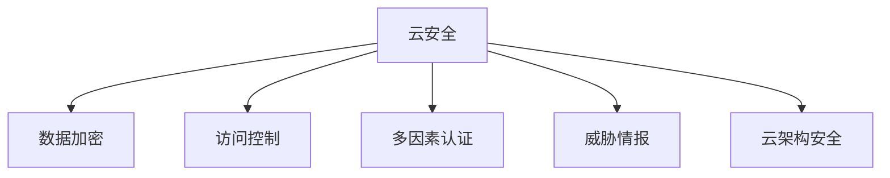

                 

# 云安全策略：保护云端数据和应用程序

> 关键词：云安全, 数据加密, 访问控制, 多因素认证, 威胁情报, 云架构, 云计算, 数据中心

## 1. 背景介绍

### 1.1 问题由来
随着云计算技术的普及和应用，企业业务逐步迁移到云端，以获得更高的灵活性、扩展性和效率。然而，与此同时，云计算也带来了新的安全威胁和挑战。数据泄露、身份盗窃、网络攻击等问题层出不穷，严重威胁企业的业务连续性和数据安全。

云安全已成为企业在云计算环境中不可或缺的重要组成部分，而如何构建完善的云安全策略，则是企业数字化转型过程中亟待解决的核心问题。本文将系统介绍云安全的核心概念与技术，阐述如何在云环境中保护数据和应用程序，提供全面的云安全策略指导。

### 1.2 问题核心关键点
云安全策略的构建需考虑以下几个关键点：

- **数据加密**：确保数据在传输和存储过程中不被窃取和篡改。
- **访问控制**：实现细粒度的用户权限管理，确保只有授权人员能访问敏感数据。
- **多因素认证**：增强用户身份验证的安全性，防止身份盗窃。
- **威胁情报**：实时监控网络威胁，快速响应安全事件。
- **云架构安全**：合理规划云环境架构，防范潜在的安全风险。

## 2. 核心概念与联系

### 2.1 核心概念概述

为更好地理解云安全策略的构建，本节将介绍几个密切相关的核心概念：

- **云安全（Cloud Security）**：在云计算环境中，保护数据、应用程序和用户的安全。
- **数据加密（Data Encryption）**：使用加密算法对数据进行加密处理，确保数据在传输和存储过程中的机密性和完整性。
- **访问控制（Access Control）**：通过身份验证和授权机制，限制对系统资源的访问。
- **多因素认证（Multi-Factor Authentication, MFA）**：要求用户提供两种或以上身份验证方式，增强身份验证的安全性。
- **威胁情报（Threat Intelligence）**：收集和分析网络威胁信息，及时发现和应对安全事件。
- **云架构安全（Cloud Architecture Security）**：设计安全的云环境架构，包括网络、存储、应用等方面的安全设计。

这些核心概念之间的逻辑关系可以通过以下Mermaid流程图来展示：



这个流程图展示了大语言模型的核心概念及其之间的关系：

1. 云安全策略涉及数据加密、访问控制、多因素认证、威胁情报和云架构安全等关键要素。
2. 数据加密和访问控制用于保障数据和应用程序的安全。
3. 多因素认证和威胁情报用于增强身份验证和实时监控网络威胁。
4. 云架构安全用于设计安全的云环境架构。

## 3. 核心算法原理 & 具体操作步骤

### 3.1 算法原理概述

云安全策略的核心算法原理基于以下几个方面：

- **数据加密算法**：包括对称加密（如AES）和非对称加密（如RSA），用于保障数据在传输和存储过程中的机密性和完整性。
- **访问控制策略**：如基于角色的访问控制（RBAC）、强制访问控制（MAC）、基于属性的访问控制（ABAC）等，确保只有授权用户能访问敏感数据。
- **多因素认证算法**：如短信验证、指纹识别、生物特征验证等，增强用户身份验证的安全性。
- **威胁情报分析算法**：如基于机器学习的异常检测、威胁关联分析等，实时监控网络威胁，快速响应安全事件。
- **云架构安全设计**：如多租户架构、弹性伸缩、安全组、网络隔离等，合理规划云环境架构，防范潜在的安全风险。

### 3.2 算法步骤详解

以下是构建云安全策略的核心算法步骤：

**Step 1: 设计云架构**
- 确定云环境需求，选择合适的云服务提供商。
- 规划云网络拓扑，包括公共云和私有云的连接方式。
- 设计云存储架构，确定数据备份和灾难恢复策略。
- 构建云应用架构，确保应用程序的可扩展性和高可用性。

**Step 2: 实施数据加密**
- 选择适当的加密算法，如AES-256。
- 实现数据传输和存储加密，确保数据机密性和完整性。
- 使用密钥管理系统（KMS）管理加密密钥。

**Step 3: 实施访问控制**
- 设计访问控制策略，如RBAC。
- 配置细粒度的权限控制，确保只有授权用户能访问敏感数据。
- 定期审计权限配置，及时调整和修复权限漏洞。

**Step 4: 实施多因素认证**
- 选择适当的MFA方式，如短信验证、指纹识别。
- 配置MFA系统，确保用户登录时必须提供多因素验证。
- 定期更新MFA策略，提高安全性。

**Step 5: 实施威胁情报**
- 部署威胁情报平台，实时监控网络威胁。
- 使用机器学习算法分析网络流量，发现异常行为。
- 快速响应安全事件，及时采取防御措施。

**Step 6: 定期评估和优化**
- 定期评估云安全策略的有效性。
- 根据评估结果，调整和优化安全策略。
- 持续改进，确保云环境的安全性和可靠性。

### 3.3 算法优缺点

云安全策略的构建具有以下优点：

- **灵活性**：云架构可以动态调整，满足业务快速变化的需求。
- **扩展性**：云资源可以按需扩展，应对突发流量和业务增长。
- **成本效益**：云服务按使用量付费，降低了基础设施的投入成本。
- **高可用性**：云平台提供多区域部署，保证业务的连续性和高可用性。

然而，该方法也存在一些局限性：

- **数据隐私**：云服务提供商可能获取和处理用户数据，存在隐私泄露风险。
- **合规性**：不同国家和地区有不同的合规要求，云服务提供商可能难以满足所有法规。
- **依赖性**：云安全策略高度依赖云服务提供商的可靠性和安全性。
- **性能问题**：云平台上的网络延迟和数据传输效率可能影响应用性能。

尽管存在这些局限性，但云安全策略仍然是构建云环境安全和可靠性的重要手段。未来相关研究的重点在于如何进一步提升云安全策略的灵活性和可扩展性，同时解决隐私保护、合规性和性能优化等问题。

### 3.4 算法应用领域

云安全策略在云环境中的应用非常广泛，覆盖了几乎所有常见云应用，例如：

- **云存储安全**：确保云存储中的数据加密和访问控制。
- **云应用安全**：保护云应用不受网络攻击和数据泄露。
- **云网络安全**：保障云平台的网络安全，防范DDoS攻击、入侵等。
- **云身份安全**：实现多因素认证，确保用户身份验证的安全性。
- **云数据备份**：定期备份云数据，防止数据丢失和恢复灾难。

除了上述这些经典应用外，云安全策略也被创新性地应用到更多场景中，如云治理、云合规、云审计等，为云计算的合规性、可靠性和透明度提供了新的保障。

## 4. 数学模型和公式 & 详细讲解 & 举例说明

### 4.1 数学模型构建

本节将使用数学语言对云安全策略的构建过程进行更加严格的刻画。

假设云环境中共有N个用户U，M个资源R，L个日志记录L。用户访问资源时，需要通过身份验证和授权机制，系统记录日志L。目标是设计一种云安全策略，使得用户只能访问授权的资源，且系统能实时监控和响应安全事件。

定义用户访问资源时的身份验证函数为F，资源授权策略为A，系统日志记录为L。定义云安全策略为S，其目标函数为：

$$
\mathcal{L}(S) = \min_{F,A} \sum_{i=1}^N \sum_{j=1}^M (F_i(A_j) - 1)^2 + \sum_{k=1}^L |L_k - F_i(A_j)|^2
$$

其中，$F_i(A_j)$表示用户i访问资源j时的身份验证结果和授权策略的交集，0表示未授权，1表示授权。目标函数最小化用户未授权访问和系统日志记录的误差。

### 4.2 公式推导过程

为了简化问题，我们只考虑单资源访问的情况，即$M=1$。定义用户访问资源时的身份验证结果为$f$，授权策略为$a$。则目标函数变为：

$$
\mathcal{L}(f,a) = (f - a)^2 + |l - f|^2
$$

其中$l$为系统记录的日志结果。假设$f$和$a$均为0/1二值变量，则目标函数进一步简化为：

$$
\mathcal{L}(f,a) = f \times a + |l - f|^2
$$

这个目标函数表示用户未授权访问的概率和系统日志记录错误的概率之和。

在实际应用中，可以通过优化算法（如遗传算法、粒子群优化等）求解最优的身份验证函数和授权策略。优化过程包括：

1. 随机生成一组初始解。
2. 计算每个解的目标函数值。
3. 选择最优解和次优解。
4. 对这两个解进行交叉和变异操作，生成下一代解。
5. 重复步骤2-4，直到满足停止条件（如迭代次数）。

最终得到的解即为最优的身份验证函数和授权策略，用于构建云安全策略。

### 4.3 案例分析与讲解

以某金融公司为例，分析如何构建云安全策略。假设金融公司云平台上有100个用户，每个用户可以访问20个资源。公司需要在保护数据安全和业务连续性的前提下，设计一个高效的云安全策略。

**Step 1: 设计云架构**
- 选择AWS云平台作为基础架构。
- 设计网络拓扑，包括公有云和私有云的连接方式。
- 设计云存储架构，采用S3存储金融数据。

**Step 2: 实施数据加密**
- 选择AES-256作为加密算法。
- 实现数据传输和存储加密，确保数据机密性和完整性。
- 使用AWS KMS管理加密密钥。

**Step 3: 实施访问控制**
- 设计RBAC策略，确保只有授权用户能访问敏感数据。
- 配置细粒度的权限控制，每个用户只能访问其权限内的资源。
- 定期审计权限配置，及时调整和修复权限漏洞。

**Step 4: 实施多因素认证**
- 选择短信验证作为MFA方式。
- 配置短信验证系统，确保用户登录时必须提供短信验证码。
- 定期更新MFA策略，提高安全性。

**Step 5: 实施威胁情报**
- 部署AWS GuardDuty，实时监控网络威胁。
- 使用机器学习算法分析网络流量，发现异常行为。
- 快速响应安全事件，及时采取防御措施。

通过以上步骤，金融公司构建了完善的云安全策略，保障了云平台和数据的安全性，满足了监管合规要求。

## 5. 项目实践：代码实例和详细解释说明

### 5.1 开发环境搭建

在进行云安全策略开发前，我们需要准备好开发环境。以下是使用Python进行AWS SDK开发的环境配置流程：

1. 安装Anaconda：从官网下载并安装Anaconda，用于创建独立的Python环境。

2. 创建并激活虚拟环境：
```bash
conda create -n aws-env python=3.8 
conda activate aws-env
```

3. 安装AWS SDK：从官网获取对应的安装命令。例如：
```bash
pip install boto3
```

4. 安装各类工具包：
```bash
pip install numpy pandas scikit-learn matplotlib tqdm jupyter notebook ipython
```

完成上述步骤后，即可在`aws-env`环境中开始云安全策略的开发。

### 5.2 源代码详细实现

下面我们以云存储安全为例，给出使用AWS SDK进行数据加密和访问控制的PyTorch代码实现。

首先，定义数据加密和访问控制的函数：

```python
import boto3

def encrypt_data(bucket_name, key_id):
    s3 = boto3.resource('s3')
    bucket = s3.Bucket(bucket_name)
    for obj in bucket.objects.all():
        obj.copy_from(
            CopySource={'Bucket': bucket_name, 'Key': obj.key},
            ServerSideEncryption='AES256',
            ServerSideEncryptionKeyId=key_id)
```

```python
def grant_access(bucket_name, role):
    s3 = boto3.resource('s3')
    bucket = s3.Bucket(bucket_name)
    policy = {
        "Version": "2012-10-17",
        "Statement": [
            {
                "Effect": "Allow",
                "Principal": {
                    "Service": "ec2.amazonaws.com"
                },
                "Action": "s3:GetObject",
                "Resource": "arn:aws:s3:::" + bucket_name + "/*"
            }
        ]
    }
    bucket.put_policy(
        Policy=json.dumps(policy),
        PolicyDocument=json.dumps(policy))
```

然后，定义一个云安全策略的函数，整合上述代码：

```python
def cloud_security_strategy(bucket_name, role, key_id):
    encrypt_data(bucket_name, key_id)
    grant_access(bucket_name, role)
```

调用该函数，即可实现对云存储的安全策略配置。

### 5.3 代码解读与分析

让我们再详细解读一下关键代码的实现细节：

**encrypt_data函数**：
- 使用boto3的S3资源对象，遍历指定存储桶中的所有对象，并对每个对象进行加密处理。
- 调用`copy_from`方法，将对象从原位置复制到一个新的位置，并指定加密算法为AES256，同时使用预设的密钥ID进行加密。

**grant_access函数**：
- 定义一个IAM策略，允许指定的角色可以访问存储桶中的所有对象。
- 使用`put_policy`方法将策略应用到存储桶，确保只有授权的角色才能访问数据。

**cloud_security_strategy函数**：
- 调用上述两个函数，实现数据加密和访问控制的整合。
- 通过参数化设计，使得该函数可以适用于不同的云存储和角色。

以上代码实现了基本的云存储安全策略，实际应用中需要根据具体需求进行调整和优化。

## 6. 实际应用场景

### 6.1 智能客服系统

智能客服系统是云安全策略的重要应用场景之一。通过云安全策略，可以确保智能客服系统中的数据和应用程序不受网络攻击和数据泄露的影响，保障客户信息和企业数据的安全性。

在技术实现上，可以部署云存储加密、访问控制和多因素认证等措施，保护客服系统中的用户信息和聊天记录。同时，使用威胁情报平台实时监控和响应系统中的安全事件，确保系统稳定运行。

### 6.2 金融舆情监测

金融舆情监测是云安全策略的另一个重要应用场景。通过云安全策略，可以确保金融舆情监测系统中的数据和应用程序不受网络攻击和数据泄露的影响，保障金融数据的安全性。

在技术实现上，可以部署云存储加密、访问控制和多因素认证等措施，保护舆情监测系统中的数据和应用程序。同时，使用威胁情报平台实时监控和响应系统中的安全事件，确保系统稳定运行。

### 6.3 个性化推荐系统

个性化推荐系统是云安全策略的另一个重要应用场景。通过云安全策略，可以确保个性化推荐系统中的数据和应用程序不受网络攻击和数据泄露的影响，保障用户数据的安全性。

在技术实现上，可以部署云存储加密、访问控制和多因素认证等措施，保护推荐系统中的用户数据和应用程序。同时，使用威胁情报平台实时监控和响应系统中的安全事件，确保系统稳定运行。

### 6.4 未来应用展望

随着云技术的普及和应用，云安全策略将覆盖更多的应用场景，为各个行业的数字化转型提供有力的安全保障。

在智慧医疗领域，通过云安全策略，可以保护医疗数据和应用程序的安全性，保障患者隐私和企业数据的安全性。

在智能教育领域，通过云安全策略，可以保护教育数据和应用程序的安全性，保障学生和教师信息的安全性。

在智慧城市治理中，通过云安全策略，可以保护城市数据和应用程序的安全性，保障市民和企业的安全。

此外，在企业生产、社会治理、文娱传媒等众多领域，云安全策略也将得到广泛应用，为各行各业提供安全可靠的技术保障。相信随着技术的不断进步，云安全策略必将在构建安全、可靠、可控的智能系统中发挥越来越重要的作用。

## 7. 工具和资源推荐

### 7.1 学习资源推荐

为了帮助开发者系统掌握云安全策略的理论基础和实践技巧，这里推荐一些优质的学习资源：

1. AWS官方文档：AWS提供的详细云安全策略文档，涵盖云安全的基本概念、最佳实践和操作步骤。

2. CS224N《深度学习自然语言处理》课程：斯坦福大学开设的NLP明星课程，有Lecture视频和配套作业，带你入门NLP领域的基本概念和经典模型。

3. 《自然语言处理基础》书籍：斯坦福大学李飞飞教授的教材，全面介绍了NLP的基本原理和应用，包括云安全策略的介绍。

4. Coursera云安全课程：由云安全专家授课的系列课程，涵盖云安全的基本概念、最佳实践和操作步骤。

5. Hacker One安全平台：提供丰富的云安全资源和工具，帮助开发者学习云安全策略的实践技巧。

通过对这些资源的学习实践，相信你一定能够快速掌握云安全策略的精髓，并用于解决实际的云安全问题。

### 7.2 开发工具推荐

高效的开发离不开优秀的工具支持。以下是几款用于云安全策略开发的常用工具：

1. AWS SDK：AWS提供的Python SDK，方便开发者使用AWS云服务，实现云安全策略的部署和监控。

2. Terraform：开源的云基础设施即代码工具，支持多种云平台，方便开发者进行云环境的设计和部署。

3. AWS CLI：AWS提供的命令行工具，方便开发者在本地环境进行云安全策略的部署和监控。

4. AWS Trusted Advisor：AWS提供的云安全评估工具，帮助开发者进行云安全策略的优化和改进。

5. AWS CloudTrail：AWS提供的云安全审计工具，帮助开发者监控云安全策略的执行情况。

合理利用这些工具，可以显著提升云安全策略的开发效率，加快创新迭代的步伐。

### 7.3 相关论文推荐

云安全策略的研究源于学界的持续研究。以下是几篇奠基性的相关论文，推荐阅读：

1. "Cloud Security: A Survey and Future Directions"：综述云安全的研究现状和未来发展方向，涵盖了云安全的基本概念、技术和应用。

2. "Designing a Secure Cloud Infrastructure"：介绍如何设计安全的云基础设施，涵盖网络安全、存储安全和应用安全等方面的云安全策略。

3. "A Survey on Multi-Cloud Security Management"：综述多云环境下的云安全管理技术，涵盖身份认证、数据加密和访问控制等方面的云安全策略。

4. "Cloud Security Strategies for Data Privacy and Compliance"：介绍云安全策略在数据隐私和合规方面的应用，涵盖加密技术、访问控制和合规管理等方面的云安全策略。

5. "Cloud Security Threat Detection and Mitigation"：介绍云安全威胁检测和防御技术，涵盖异常检测、入侵检测和威胁关联分析等方面的云安全策略。

这些论文代表了大语言模型微调技术的发展脉络。通过学习这些前沿成果，可以帮助研究者把握学科前进方向，激发更多的创新灵感。

## 8. 总结：未来发展趋势与挑战

### 8.1 总结

本文对云安全策略进行了全面系统的介绍。首先阐述了云安全策略在云环境中的重要性，明确了云安全策略在保护数据和应用程序安全方面的独特价值。其次，从原理到实践，详细讲解了云安全策略的数学原理和关键步骤，给出了云安全策略的完整代码实例。同时，本文还广泛探讨了云安全策略在智能客服、金融舆情、个性化推荐等多个行业领域的应用前景，展示了云安全策略的巨大潜力。此外，本文精选了云安全策略的学习资源，力求为读者提供全方位的技术指引。

通过本文的系统梳理，可以看到，云安全策略是大语言模型微调的重要组成部分，极大地提升了云环境的安全性和可靠性。未来，伴随云技术的持续演进，云安全策略还将进一步发展，成为构建安全、可靠、可控的智能系统的重要保障。

### 8.2 未来发展趋势

展望未来，云安全策略将呈现以下几个发展趋势：

1. **自动化安全管理**：随着自动化技术的发展，云安全策略将越来越多地使用自动化工具，实现安全管理的自动化。

2. **AI辅助安全分析**：引入AI技术，如机器学习和自然语言处理，提高威胁情报分析的准确性和效率。

3. **跨云安全策略**：构建统一的云安全策略，实现多云环境下的安全管理和监控。

4. **安全意识培训**：加强员工的安全意识培训，提高员工的安全防范意识和技能。

5. **零信任架构**：采用零信任架构，实现细粒度的身份验证和授权，确保数据和应用程序的安全。

6. **数据隐私保护**：引入隐私保护技术，如数据脱敏、匿名化和差分隐私等，保护用户数据隐私。

以上趋势凸显了云安全策略的发展方向，这些方向的探索发展，必将进一步提升云环境的安全性和可靠性。

### 8.3 面临的挑战

尽管云安全策略已经取得了一定成果，但在迈向更加智能化、普适化应用的过程中，它仍面临着诸多挑战：

1. **数据隐私保护**：云平台的数据隐私保护机制尚未完善，用户数据存在泄露风险。
2. **合规性问题**：不同国家和地区的法规要求不同，云服务提供商可能难以满足所有法规。
3. **依赖性问题**：云安全策略高度依赖云服务提供商的可靠性和安全性。
4. **性能问题**：云平台上的网络延迟和数据传输效率可能影响应用性能。
5. **安全意识不足**：员工的安全防范意识和技能不足，可能导致安全事件的发生。

尽管存在这些挑战，但云安全策略仍然是构建云环境安全和可靠性的重要手段。未来相关研究的重点在于如何进一步提升云安全策略的自动化程度、准确性和灵活性，同时解决隐私保护、合规性和性能优化等问题。

### 8.4 研究展望

面对云安全策略面临的挑战，未来的研究需要在以下几个方面寻求新的突破：

1. **引入自动化和AI技术**：引入自动化和AI技术，提高云安全策略的自动化程度和分析能力。

2. **加强隐私保护**：引入隐私保护技术，如数据脱敏、匿名化和差分隐私等，保护用户数据隐私。

3. **跨云安全策略**：构建统一的云安全策略，实现多云环境下的安全管理和监控。

4. **零信任架构**：采用零信任架构，实现细粒度的身份验证和授权，确保数据和应用程序的安全。

5. **安全意识培训**：加强员工的安全意识培训，提高员工的安全防范意识和技能。

6. **数据加密和访问控制**：引入加密技术和访问控制策略，保护云平台和数据的安全性。

这些研究方向的探索，必将引领云安全策略技术迈向更高的台阶，为构建安全、可靠、可控的智能系统铺平道路。面向未来，云安全策略还需要与其他人工智能技术进行更深入的融合，如知识表示、因果推理、强化学习等，多路径协同发力，共同推动云安全策略的进步。只有勇于创新、敢于突破，才能不断拓展云安全策略的边界，让智能技术更好地造福人类社会。

## 9. 附录：常见问题与解答

**Q1：云安全策略是否适用于所有云环境？**

A: 云安全策略适用于各种类型的云环境，包括公有云、私有云和混合云。具体策略需要根据云环境的特性进行调整和优化。

**Q2：云安全策略的实施成本是否过高？**

A: 云安全策略的实施成本取决于具体需求和规模，但相较于传统安全解决方案，云安全策略的实施和维护成本较低。云服务按使用量付费，灵活性和扩展性也较高。

**Q3：云安全策略如何应对复杂的威胁情报？**

A: 引入AI技术，如机器学习和自然语言处理，可以显著提高威胁情报分析的准确性和效率。同时，与第三方威胁情报平台合作，获取最新的威胁情报信息，及时发现和应对安全事件。

**Q4：云安全策略如何应对数据隐私保护？**

A: 引入隐私保护技术，如数据脱敏、匿名化和差分隐私等，可以有效保护用户数据隐私。同时，定期进行数据审计和合规检查，确保数据保护措施的有效性。

**Q5：云安全策略如何应对多云环境下的安全管理？**

A: 采用统一的云安全策略，实现多云环境下的安全管理和监控。使用云安全管理平台，统一管理多个云环境的安全策略和监控规则。

这些问题的解答，展示了云安全策略的实用性和灵活性，帮助开发者更好地理解和使用云安全策略。

---

作者：禅与计算机程序设计艺术 / Zen and the Art of Computer Programming

