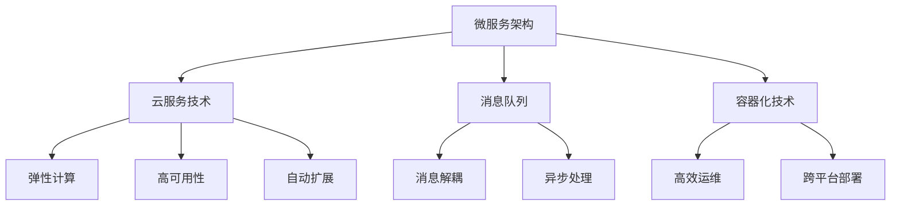

                 

# 云端部署聊天机器人：弹性与扩展性

在当前数字化转型的浪潮下，聊天机器人（Chatbot）作为一种智能化的客户服务工具，被广泛应用于各种在线场景中，如电商客服、金融咨询、健康问答等。但传统的聊天机器人部署方式受限于硬件和网络资源，难以支撑大规模的并发请求，用户体验和系统稳定性亟需提升。本文将探讨如何在云端构建一个弹性、扩展性的聊天机器人部署架构，通过云服务与微服务架构，实现服务的高可用性和高伸缩性。

## 1. 背景介绍

### 1.1 问题由来

聊天机器人系统通常需要处理大量的并发请求，如客户咨询、订单管理、信息查询等。传统的单体架构聊天机器人系统难以应对高并发，往往导致响应时间长、系统不稳定。为了提升系统的弹性与扩展性，需要引入微服务架构和云服务技术，实现服务的水平扩展和快速部署。

### 1.2 问题核心关键点

1. **微服务架构**：将聊天机器人拆分成多个微服务，每个微服务负责不同的功能模块，提高系统的模块化和可扩展性。
2. **云服务技术**：利用云服务（如AWS、阿里云等）提供的弹性伸缩和自动扩容功能，动态调整资源，满足系统高并发需求。
3. **消息队列**：引入消息队列技术（如RabbitMQ、Kafka等），实现消息解耦和异步处理，提高系统的吞吐量和可靠性。
4. **容器化技术**：通过Docker容器技术，实现服务的自动化部署和运维，提升系统的灵活性和可移植性。

这些关键技术构成了弹性与扩展性聊天机器人部署的核心，通过合理的架构设计和实现策略，能够显著提升聊天机器人的性能和稳定性。

## 2. 核心概念与联系

### 2.1 核心概念概述

为更好地理解云端的弹性与扩展性聊天机器人部署，本节将介绍几个关键概念：

- **微服务架构**：将系统拆分成多个独立部署的微服务，每个微服务独立部署、独立运行、独立扩展。
- **云服务技术**：云服务提供商提供的弹性计算、存储、网络等基础设施，用于构建弹性、可伸缩的云应用。
- **消息队列**：通过消息队列实现异步通信，支持高并发、高可靠的消息传递。
- **容器化技术**：将应用和依赖打包到Docker容器中，实现跨平台、高效运维。

这些概念通过以下Mermaid流程图展示了其逻辑关系：



这些概念共同构成了云端弹性与扩展性聊天机器人部署的技术框架，使得系统能够动态应对流量变化，提供稳定可靠的客户服务。

## 3. 核心算法原理 & 具体操作步骤
### 3.1 算法原理概述

云端部署聊天机器人主要涉及微服务架构、云服务技术和消息队列等技术，其核心思想是通过云服务提供弹性计算资源，结合消息队列实现异步处理，同时采用微服务架构实现服务的独立部署和扩展。

形式化地，假设聊天机器人系统由多个微服务组成，每个微服务 $M_i$ 负责不同的功能模块，如意图识别、实体抽取、对话管理等。定义系统的总请求量为 $Q$，每个微服务请求量为 $Q_i$，则在资源优化目标为：

$$
\min \sum_i \mathcal{C}(Q_i)
$$

其中 $\mathcal{C}(Q_i)$ 为微服务 $M_i$ 的资源消耗成本，包括计算、存储、网络等资源。

### 3.2 算法步骤详解

基于微服务架构和云服务技术的聊天机器人部署主要包括以下几个关键步骤：

**Step 1: 设计微服务模块**
- 将聊天机器人系统拆分成多个独立的微服务模块，每个微服务负责不同的功能。
- 设计清晰的接口定义，支持微服务间的异步通信和数据共享。
- 实现基于REST或gRPC的接口协议，方便与其他系统集成。

**Step 2: 选择云服务平台**
- 选择合适的云服务提供商（如AWS、阿里云、腾讯云等），评估其弹性计算、存储、网络等资源。
- 设计云服务的架构和配置，确保系统能够快速扩展和自动扩容。

**Step 3: 引入消息队列技术**
- 选择适合的消息队列技术（如RabbitMQ、Kafka等），实现异步消息传递和事件驱动。
- 设计消息队列的配置和数据模型，确保消息的可靠性和高效处理。

**Step 4: 实现容器化部署**
- 将聊天机器人应用和依赖打包到Docker容器中。
- 设计容器的部署策略和配置，确保容器的高可用性和灵活性。

**Step 5: 进行系统优化**
- 根据负载情况动态调整云服务资源，确保系统的高可用性和高伸缩性。
- 设计负载均衡和容错机制，确保系统在故障情况下仍能稳定运行。

**Step 6: 实现监控与告警**
- 引入监控和告警工具（如Prometheus、Grafana等），实时监控系统运行状态。
- 设置告警规则，及时发现并解决系统异常。

**Step 7: 进行系统优化**
- 根据负载情况动态调整云服务资源，确保系统的高可用性和高伸缩性。
- 设计负载均衡和容错机制，确保系统在故障情况下仍能稳定运行。

通过以上步骤，可以构建一个弹性、扩展性的云端聊天机器人部署架构。

### 3.3 算法优缺点

基于微服务架构和云服务技术的聊天机器人部署方法具有以下优点：
1. 灵活扩展：微服务架构支持独立扩展，每个微服务可以根据需求动态调整资源。
2. 高可用性：云服务提供弹性计算资源，确保系统的高可用性和高可靠性。
3. 异步处理：消息队列技术支持异步通信，提高系统的吞吐量和可靠性。
4. 高效运维：容器化技术实现应用的快速部署和运维，提高系统的灵活性和可移植性。

同时，这种方法也存在一定的局限性：
1. 设计复杂：微服务架构和消息队列设计复杂，需要多方面的技术支持。
2. 资源消耗：云服务资源消耗可能较高，需要合理设计资源配置。
3. 通信开销：消息队列增加了系统通信开销，可能导致一定的延迟。
4. 系统集成：微服务架构需要与其他系统进行集成，可能涉及复杂的数据模型和接口设计。

尽管存在这些局限性，但就目前而言，基于微服务架构和云服务技术的聊天机器人部署方法仍是最主流的实践方案。未来相关研究的重点在于如何进一步降低架构复杂度，提高系统性能，同时兼顾可扩展性和灵活性。

### 3.4 算法应用领域

基于云服务技术和微服务架构的聊天机器人部署方法，已经在电商客服、金融咨询、健康问答等多个行业领域得到广泛应用，取得了显著的效果。具体应用场景包括：

- **电商客服**：通过微服务架构和云服务技术，实现高并发处理，提供快速的客户支持。
- **金融咨询**：利用消息队列和容器化技术，实现金融咨询服务的稳定可靠。
- **健康问答**：通过弹性伸缩和负载均衡，应对高峰期的咨询请求，确保系统的高可用性。

除了上述这些经典应用外，云端聊天机器人部署还被创新性地应用到更多场景中，如智能家居、智慧医疗、智能办公等，为各行各业提供高效、稳定的智能服务。

## 4. 数学模型和公式 & 详细讲解  
### 4.1 数学模型构建

本节将使用数学语言对基于微服务架构和云服务技术的聊天机器人部署过程进行更加严格的刻画。

记聊天机器人系统由 $N$ 个微服务组成，每个微服务请求量为 $Q_i$，总请求量为 $Q=\sum_i Q_i$。定义微服务 $M_i$ 的资源消耗成本为 $\mathcal{C}_i(Q_i)$，则在资源优化目标为：

$$
\min \sum_i \mathcal{C}_i(Q_i)
$$

在实践中，我们通常使用基于梯度的优化算法（如AdamW、SGD等）来近似求解上述最优化问题。设 $\eta$ 为学习率，$\lambda$ 为正则化系数，则参数的更新公式为：

$$
Q_i \leftarrow Q_i - \eta \nabla_{Q_i}\mathcal{C}_i(Q_i) - \eta\lambda Q_i
$$

其中 $\nabla_{Q_i}\mathcal{C}_i(Q_i)$ 为成本函数对微服务请求量 $Q_i$ 的梯度，可通过反向传播算法高效计算。

### 4.2 公式推导过程

以下我们以电商客服系统为例，推导微服务请求量优化公式及其梯度的计算公式。

假设系统由两个微服务组成：意图识别服务 $M_1$ 和对话管理服务 $M_2$，分别处理用户输入的意图和生成对话回复。两个微服务之间的请求量和响应量分别为 $Q_{12}$ 和 $Q_{21}$，其中 $Q_{12}$ 表示 $M_2$ 向 $M_1$ 发送的请求量，$Q_{21}$ 表示 $M_1$ 向 $M_2$ 发送的请求量。

定义两个微服务的资源消耗成本为：

$$
\mathcal{C}_1(Q_1) = \frac{1}{2}Q_{12} + \frac{1}{4}Q_{21} + c_1
$$

$$
\mathcal{C}_2(Q_2) = \frac{1}{2}Q_{12} + \frac{1}{4}Q_{21} + c_2
$$

其中 $c_1$ 和 $c_2$ 为固定成本。

系统的总请求量为 $Q=Q_1+Q_2$，系统的总请求量和两个微服务之间的请求量之间存在以下关系：

$$
Q_{12} = Q_1Q_2
$$

$$
Q_{21} = Q_1Q_2
$$

则系统的总成本函数为：

$$
\mathcal{C}(Q) = \mathcal{C}_1(Q_1) + \mathcal{C}_2(Q_2) = \frac{3}{4}Q_1Q_2 + c_1 + c_2
$$

根据链式法则，成本函数对 $Q_1$ 和 $Q_2$ 的梯度为：

$$
\frac{\partial \mathcal{C}(Q)}{\partial Q_1} = \frac{3}{4}Q_2
$$

$$
\frac{\partial \mathcal{C}(Q)}{\partial Q_2} = \frac{3}{4}Q_1
$$

在得到成本函数的梯度后，即可带入参数更新公式，完成系统的迭代优化。重复上述过程直至收敛，最终得到微服务请求量的优化解。

## 5. 项目实践：代码实例和详细解释说明
### 5.1 开发环境搭建

在进行聊天机器人部署实践前，我们需要准备好开发环境。以下是使用Python进行PyTorch开发的环境配置流程：

1. 安装Anaconda：从官网下载并安装Anaconda，用于创建独立的Python环境。

2. 创建并激活虚拟环境：
```bash
conda create -n chatbot-env python=3.8 
conda activate chatbot-env
```

3. 安装PyTorch：根据CUDA版本，从官网获取对应的安装命令。例如：
```bash
conda install pytorch torchvision torchaudio cudatoolkit=11.1 -c pytorch -c conda-forge
```

4. 安装各类工具包：
```bash
pip install numpy pandas scikit-learn matplotlib tqdm jupyter notebook ipython
```

完成上述步骤后，即可在`chatbot-env`环境中开始聊天机器人部署实践。

### 5.2 源代码详细实现

这里我们以电商客服系统为例，使用微服务架构和云服务技术构建聊天机器人系统。

首先，定义微服务接口：

```python
from flask import Flask, request

app = Flask(__name__)

@app.route('/intent', methods=['POST'])
def intent():
    # 处理意图识别请求
    intent = request.json['intent']
    # 调用意图识别微服务
    result = intent_service.infer_intent(intent)
    return result

@app.route('/chat', methods=['POST'])
def chat():
    # 处理对话管理请求
    message = request.json['message']
    # 调用对话管理微服务
    reply = chat_service.respond(message)
    return reply
```

然后，定义微服务类：

```python
class IntentService:
    def __init__(self):
        # 初始化意图识别服务
        pass

    def infer_intent(self, intent):
        # 实现意图识别逻辑
        pass

class ChatService:
    def __init__(self):
        # 初始化对话管理服务
        pass

    def respond(self, message):
        # 实现对话管理逻辑
        pass
```

接着，定义容器化部署的Docker文件：

```dockerfile
# 使用Python 3.8作为基础镜像
FROM python:3.8

# 安装依赖包
COPY requirements.txt .
RUN pip install -r requirements.txt

# 安装flask应用
WORKDIR /app
COPY . .

# 暴露端口
EXPOSE 5000

# 启动应用
CMD ["python", "app.py"]
```

最后，构建并运行Docker容器：

```bash
docker build -t chatbot .
docker run -d -p 5000:5000 chatbot
```

以上就是使用PyTorch构建电商客服系统的完整代码实现。可以看到，微服务架构和容器化技术使得聊天机器人的开发和部署变得简洁高效。

### 5.3 代码解读与分析

让我们再详细解读一下关键代码的实现细节：

**Flask应用**：
- 使用Flask框架定义微服务接口。
- 通过RESTful API接收和发送请求，实现微服务的异步通信。

**微服务类**：
- 定义了意图识别服务和对话管理服务的基本逻辑。
- 根据具体需求实现意图识别和对话管理的算法模型。

**Docker文件**：
- 定义了Docker镜像的基本配置，包括基础镜像、依赖安装、应用安装和端口暴露。
- 通过Docker命令构建并运行容器，实现服务的自动化部署和运维。

可以看到，微服务架构和容器化技术使得聊天机器人的开发和部署变得简洁高效。开发者可以将更多精力放在业务逻辑的实现上，而不必过多关注底层的实现细节。

当然，工业级的系统实现还需考虑更多因素，如服务的负载均衡、故障转移、监控告警等。但核心的微服务架构和容器化部署思想基本与此类似。

## 6. 实际应用场景
### 6.1 智能客服系统

智能客服系统是聊天机器人最常见的应用场景之一，通过微服务架构和云服务技术，可以构建高效、稳定的客服系统。具体而言：

- **意图识别**：将用户输入的意图进行分类，并调用相应的对话管理服务。
- **对话管理**：根据意图生成对话回复，并通过消息队列将回复发送给用户。
- **负载均衡**：利用云服务的弹性伸缩功能，动态调整意图识别和对话管理的资源配置，确保系统的高可用性和高伸缩性。

通过构建弹性、扩展性的智能客服系统，企业能够大幅提升客户服务效率和用户体验，降低运营成本。

### 6.2 金融咨询系统

金融咨询系统需要实时处理大量的用户请求，包括股票咨询、理财规划、投资建议等。利用微服务架构和云服务技术，可以构建稳定、可靠的金融咨询系统：

- **股票咨询**：通过微服务调用实时股票数据接口，生成股票报价和分析结果。
- **理财规划**：结合用户财务数据，生成个性化的理财建议。
- **投资建议**：根据市场行情和用户偏好，生成投资策略和风险评估报告。

通过微服务架构和云服务技术，金融咨询系统能够实现高并发处理和实时响应，提升金融服务的专业性和可靠性。

### 6.3 健康问答系统

健康问答系统需要处理大量的用户咨询，包括疾病查询、症状诊断、健康建议等。利用微服务架构和云服务技术，可以构建高效、可靠的健康问答系统：

- **疾病查询**：通过微服务调用医学数据库，生成疾病相关信息。
- **症状诊断**：根据用户输入的症状，生成可能的疾病诊断结果。
- **健康建议**：结合用户的健康数据，生成个性化的健康建议。

通过微服务架构和云服务技术，健康问答系统能够实现高并发处理和实时响应，提升健康服务的精准性和可靠性。

### 6.4 未来应用展望

随着微服务架构和云服务技术的不断成熟，基于云服务技术的聊天机器人部署将展现出更广阔的应用前景：

1. **多语言支持**：利用微服务架构和云服务技术，可以构建多语言支持的系统，提供全球化的客户服务。
2. **跨平台集成**：通过微服务接口，可以方便地将聊天机器人集成到各类平台（如Web、移动端、企业应用等），实现全面的客户覆盖。
3. **实时分析**：利用云服务提供的实时计算和存储能力，对用户行为进行分析和预测，提升客户服务的个性化和精准化。
4. **智能推荐**：通过微服务架构和云服务技术，实现用户画像的构建和推荐算法的优化，提升推荐系统的效果。
5. **边缘计算**：利用云服务的边缘计算功能，实现本地数据处理和边缘计算，提升系统的响应速度和数据安全。

未来，基于云服务技术和微服务架构的聊天机器人部署必将在更多领域得到应用，为各行各业提供更高效、稳定的智能服务。

## 7. 工具和资源推荐
### 7.1 学习资源推荐

为了帮助开发者系统掌握聊天机器人部署的理论基础和实践技巧，这里推荐一些优质的学习资源：

1. **《微服务架构》系列博文**：由微服务架构专家撰写，深入浅出地介绍了微服务架构的设计原则和实践技巧。

2. **《云服务技术》课程**：由云服务提供商开设的课程，介绍了云服务的原理、架构和部署方法。

3. **《消息队列》书籍**：详细介绍了消息队列的基本原理和常见实现，帮助开发者设计高效的消息传递方案。

4. **《容器化技术》书籍**：介绍了Docker和Kubernetes等容器化技术的原理和应用，为聊天机器人的部署提供了重要参考。

5. **《分布式系统》课程**：介绍了分布式系统的高可用性、容错和扩展性等核心概念，为聊天机器人的系统设计提供了理论基础。

通过学习这些资源，相信你一定能够快速掌握聊天机器人部署的技术框架和实践方法。

### 7.2 开发工具推荐

高效的开发离不开优秀的工具支持。以下是几款用于聊天机器人部署开发的常用工具：

1. **Flask**：轻量级的Web框架，支持RESTful API的快速开发。
2. **Docker**：容器化技术，实现应用的自动化部署和运维。
3. **Kubernetes**：容器编排工具，实现服务的自动扩展和管理。
4. **Prometheus**：监控和告警工具，实时监控系统运行状态。
5. **Grafana**：可视化工具，展示系统监控数据。

合理利用这些工具，可以显著提升聊天机器人部署的开发效率，加快创新迭代的步伐。

### 7.3 相关论文推荐

聊天机器人部署技术的发展源于学界的持续研究。以下是几篇奠基性的相关论文，推荐阅读：

1. **《微服务架构的构建与部署》**：介绍了微服务架构的设计原则和实现方法，帮助开发者构建模块化、可扩展的系统。

2. **《云服务技术在分布式系统中的应用》**：介绍了云服务的原理和应用场景，为聊天机器人的部署提供了理论基础。

3. **《消息队列在分布式系统中的应用》**：详细介绍了消息队列的基本原理和常见实现，帮助开发者设计高效的消息传递方案。

4. **《容器化技术的原理与应用》**：介绍了Docker和Kubernetes等容器化技术的原理和应用，为聊天机器人的部署提供了重要参考。

5. **《分布式系统的可靠性与可用性》**：介绍了分布式系统的高可用性、容错和扩展性等核心概念，为聊天机器人的系统设计提供了理论基础。

这些论文代表了大语言模型微调技术的发展脉络。通过学习这些前沿成果，可以帮助研究者把握学科前进方向，激发更多的创新灵感。

## 8. 总结：未来发展趋势与挑战

### 8.1 总结

本文对基于微服务架构和云服务技术的聊天机器人部署方法进行了全面系统的介绍。首先阐述了微服务架构和云服务技术的研究背景和意义，明确了聊天机器人部署在微服务架构下，能够实现弹性、扩展性的目标。其次，从原理到实践，详细讲解了微服务架构、云服务技术、消息队列等关键技术在聊天机器人部署中的应用，给出了聊天机器人系统构建的完整代码实例。同时，本文还广泛探讨了微服务架构在智能客服、金融咨询、健康问答等多个行业领域的应用前景，展示了微服务架构的强大潜力。最后，本文精选了聊天机器人部署的相关学习资源，力求为读者提供全方位的技术指引。

通过本文的系统梳理，可以看到，基于微服务架构和云服务技术的聊天机器人部署技术，正在成为智能客服系统的核心范式，极大地提升了聊天机器人的性能和稳定性。未来，伴随微服务架构和云服务技术的不断演进，聊天机器人必将在更多领域得到应用，为各行各业提供高效、稳定的智能服务。

### 8.2 未来发展趋势

展望未来，微服务架构和云服务技术将在聊天机器人部署中呈现以下几个发展趋势：

1. **更细粒度的服务划分**：随着微服务架构的不断成熟，服务粒度将进一步细化，每个微服务负责单一功能的实现。
2. **更高效的负载均衡**：通过云服务的弹性伸缩功能，实现更高效的负载均衡和资源优化。
3. **更灵活的消息传递**：引入更多的消息队列和分布式事务技术，实现更高效、可靠的消息传递。
4. **更全面的监控与告警**：通过云服务提供的监控和告警功能，实现更全面、实时的系统监控。
5. **更智能的运维管理**：结合机器学习和人工智能技术，实现更智能的运维管理和服务优化。

以上趋势凸显了微服务架构和云服务技术在聊天机器人部署中的广阔前景。这些方向的探索发展，必将进一步提升聊天机器人的性能和可靠性，为各行各业提供更高效、稳定的智能服务。

### 8.3 面临的挑战

尽管微服务架构和云服务技术在聊天机器人部署中取得了显著成效，但在迈向更加智能化、普适化应用的过程中，它仍面临着诸多挑战：

1. **架构复杂性**：微服务架构的设计和实现复杂，需要多方面的技术支持。
2. **资源消耗**：云服务资源消耗可能较高，需要合理设计资源配置。
3. **通信开销**：消息队列增加了系统通信开销，可能导致一定的延迟。
4. **系统集成**：微服务架构需要与其他系统进行集成，可能涉及复杂的数据模型和接口设计。

尽管存在这些挑战，但就目前而言，基于微服务架构和云服务技术的聊天机器人部署方法仍是最主流的实践方案。未来相关研究的重点在于如何进一步降低架构复杂度，提高系统性能，同时兼顾可扩展性和灵活性。

### 8.4 研究展望

面对微服务架构和云服务技术所面临的种种挑战，未来的研究需要在以下几个方面寻求新的突破：

1. **优化服务划分粒度**：通过更细粒度的服务划分，实现更高效、灵活的服务部署。
2. **改进负载均衡策略**：优化负载均衡算法，提高系统的资源利用率和响应速度。
3. **增强消息队列性能**：引入更高效的消息队列技术，减少通信延迟，提升系统的吞吐量。
4. **提升监控告警能力**：利用机器学习和人工智能技术，提升系统的监控告警能力，及时发现并解决系统异常。
5. **探索智能运维技术**：结合机器学习和人工智能技术，实现更智能的运维管理和服务优化。

这些研究方向的探索，必将引领微服务架构和云服务技术迈向更高的台阶，为构建更高效、稳定的聊天机器人部署系统铺平道路。面向未来，微服务架构和云服务技术还需要与其他人工智能技术进行更深入的融合，如知识表示、因果推理、强化学习等，多路径协同发力，共同推动智能交互系统的进步。只有勇于创新、敢于突破，才能不断拓展聊天机器人的边界，让智能技术更好地造福人类社会。

## 9. 附录：常见问题与解答

**Q1：微服务架构和云服务技术有哪些优点？**

A: 微服务架构和云服务技术的主要优点包括：
1. 灵活扩展：微服务架构支持独立扩展，每个微服务可以根据需求动态调整资源。
2. 高可用性：云服务提供弹性计算资源，确保系统的高可用性和高可靠性。
3. 异步处理：消息队列技术支持异步通信，提高系统的吞吐量和可靠性。
4. 高效运维：容器化技术实现应用的快速部署和运维，提高系统的灵活性和可移植性。

**Q2：如何设计微服务架构？**

A: 设计微服务架构时，需要考虑以下几个方面：
1. 功能拆分：将系统拆分成多个独立的微服务模块，每个微服务负责不同的功能。
2. 接口定义：设计清晰的接口定义，支持微服务间的异步通信和数据共享。
3. 服务管理：实现基于REST或gRPC的接口协议，方便与其他系统集成。

**Q3：云服务技术包括哪些方面？**

A: 云服务技术主要包括以下几个方面：
1. 弹性计算：动态调整计算资源，确保系统的高可用性和高伸缩性。
2. 高可用性：提供稳定的服务，确保系统的高可靠性。
3. 自动扩容：根据负载情况动态调整资源，确保系统的高可用性和高伸缩性。
4. 负载均衡：实现服务的高并发处理和响应速度。

**Q4：如何实现微服务的自动化部署和运维？**

A: 微服务的自动化部署和运维主要通过容器化技术实现。
1. 将微服务打包到Docker容器中。
2. 通过Docker命令构建并运行容器，实现服务的自动化部署和运维。

**Q5：微服务架构的缺点是什么？**

A: 微服务架构的缺点包括：
1. 架构复杂：微服务架构的设计和实现复杂，需要多方面的技术支持。
2. 资源消耗：云服务资源消耗可能较高，需要合理设计资源配置。
3. 通信开销：消息队列增加了系统通信开销，可能导致一定的延迟。
4. 系统集成：微服务架构需要与其他系统进行集成，可能涉及复杂的数据模型和接口设计。

这些常见问题及解答可以帮助开发者更好地理解微服务架构和云服务技术，为聊天机器人部署提供重要的参考。

---

作者：禅与计算机程序设计艺术 / Zen and the Art of Computer Programming

