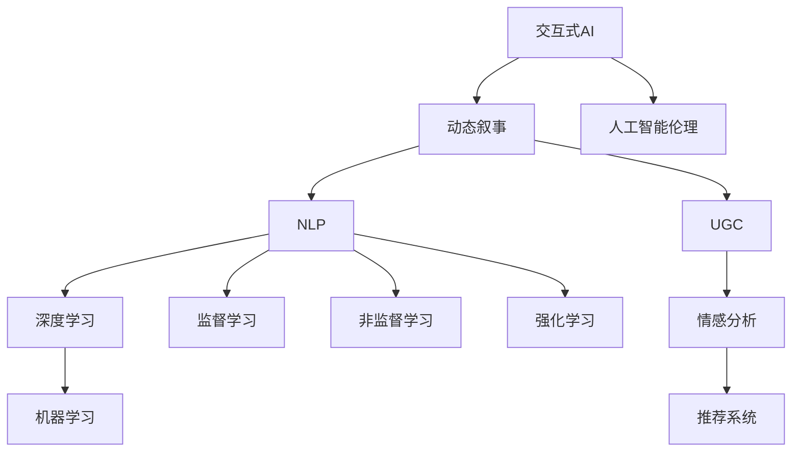

                 

# 交互式AI故事：读者参与的动态叙事

> 关键词：交互式AI，动态叙事，自然语言处理(NLP)，用户生成内容(UGC)，深度学习，机器学习，情感分析，推荐系统，人工智能伦理

## 1. 背景介绍

### 1.1 问题由来
在当今这个信息爆炸的时代，传统的单向叙事模式已经难以满足人们对于交互性和个性化内容的需求。尤其是在互联网和社交媒体的推动下，人们不再满足于被动接受内容，而是更加期望能够主动参与到内容的创作和交互中来。交互式AI故事应运而生，它利用AI技术，让用户能够与故事内容进行互动，甚至在某种程度上参与故事剧情的发展。

### 1.2 问题核心关键点
交互式AI故事的核心在于其动态叙事能力。通过AI模型，系统可以根据用户的选择和行为实时调整故事剧情，甚至在故事中融入用户生成内容(UGC)，从而大大提高用户体验和参与度。这种动态性使得交互式AI故事在教育、娱乐、客服等多个领域有着广泛的应用前景。

## 2. 核心概念与联系

### 2.1 核心概念概述

为更好地理解交互式AI故事，本节将介绍几个关键概念：

- 交互式AI：指通过人工智能技术实现人机互动，根据用户的输入实时调整输出的一种技术形式。
- 动态叙事：指故事内容会根据用户的选择和行为动态变化，每个用户参与的叙事轨迹都不尽相同。
- 自然语言处理(NLP)：利用计算机技术处理和理解人类自然语言的技术，是交互式AI故事的核心技术之一。
- 用户生成内容(UGC)：指用户自行创作的内容，如评论、回复、投稿等，能够丰富故事内容和互动形式。
- 深度学习：通过多层神经网络模型，从数据中学习抽象特征，实现更复杂的模式识别和决策任务。
- 机器学习：指机器从数据中学习规律，并应用到实际问题中，包括监督学习、非监督学习、强化学习等。
- 情感分析：通过文本挖掘技术，分析用户情感倾向，用于个性化故事推荐。
- 推荐系统：根据用户历史行为和偏好，推荐合适的内容或产品。
- 人工智能伦理：关注AI技术在应用过程中可能引发的问题，如隐私保护、偏见歧视、安全风险等，保障AI技术的公正、透明、可控。

这些核心概念之间的逻辑关系可以通过以下Mermaid流程图来展示：



这个流程图展示了几组核心概念及其之间的关系：

1. 交互式AI通过动态叙事与用户进行互动。
2. 动态叙事依赖于NLP技术，通过处理自然语言，实现故事内容的实时调整。
3. NLP中常用的深度学习模型通过多层神经网络学习语言特征。
4. 深度学习模型能够进行监督、非监督和强化学习。
5. 用户生成内容通过情感分析融入故事，增强用户体验。
6. 推荐系统可以根据用户行为，推荐适合的内容或产品。
7. 人工智能伦理关注AI技术的伦理问题，确保技术的公正性和安全性。

这些概念共同构成了交互式AI故事的技术框架，为其在多个场景中的应用提供了基础。

## 3. 核心算法原理 & 具体操作步骤
### 3.1 算法原理概述

交互式AI故事的实现原理基于用户与AI模型的互动。其核心思想是：通过自然语言处理(NLP)技术，将用户的输入转化为机器可理解的形式，然后根据用户的偏好和行为，动态调整故事内容，甚至在故事中融入用户生成内容。

具体而言，交互式AI故事系统由以下几个核心组件构成：

1. **NLP模型**：用于处理和理解用户的自然语言输入，将其转换为系统可理解的形式。
2. **动态叙事引擎**：根据用户输入和已生成的故事内容，动态调整故事剧情，甚至实时生成新的情节。
3. **推荐系统**：根据用户的偏好和行为，推荐合适的下一步情节或角色选择。
4. **情感分析模块**：分析用户对故事内容的情感反应，用于动态调整故事情绪氛围。
5. **伦理审查模块**：对用户的输入和故事内容进行伦理审查，确保故事内容的合法性和无害性。

### 3.2 算法步骤详解

以下是交互式AI故事系统的核心算法步骤：

**Step 1: 用户输入处理**
- 收集用户的自然语言输入。
- 使用NLP模型将输入文本转化为向量形式，以便机器理解和处理。

**Step 2: 动态叙事生成**
- 根据用户输入和已生成的故事内容，动态调整故事剧情。
- 生成新的情节或角色选择，供用户进一步选择。

**Step 3: 用户选择处理**
- 收集用户的选择，更新故事状态。
- 根据用户选择，生成新的情节或角色。

**Step 4: 情感分析与调整**
- 分析用户对故事内容的情感反应。
- 根据情感分析结果，调整故事情绪氛围。

**Step 5: 推荐系统应用**
- 根据用户历史行为和偏好，推荐合适的下一步情节或角色选择。
- 根据推荐结果，调整故事内容和生成方式。

**Step 6: 伦理审查与反馈**
- 对用户的输入和故事内容进行伦理审查，确保故事内容的合法性和无害性。
- 收集用户反馈，优化NLP模型和动态叙事引擎。

**Step 7: 故事输出**
- 将故事内容转化为用户可理解的自然语言形式，输出给用户。
- 循环执行以上步骤，直到故事结束或用户退出。

### 3.3 算法优缺点

交互式AI故事的优点包括：
1. 增强用户参与感：用户可以主动参与到故事创作中，享受更高的沉浸感。
2. 个性化内容推荐：通过推荐系统，根据用户偏好推荐合适的内容或情节。
3. 动态调整情节：根据用户选择和情感反应，实时调整故事情节，增强故事吸引力。
4. 多样性探索：用户可以选择不同的故事分支，探索不同的结局。
5. 情感体验丰富：通过情感分析，动态调整故事情绪氛围，提高用户的情感体验。

但该方法也存在一些缺点：
1. 技术复杂：交互式AI故事的实现需要多种技术的综合应用，如NLP、推荐系统等。
2. 数据依赖：用户生成内容和故事情节的动态调整需要大量的用户数据和标记数据。
3. 伦理挑战：在处理用户输入和故事内容时，可能面临隐私保护和伦理审查的挑战。
4. 性能要求高：实时处理和动态调整需要高性能的计算资源和算法。

尽管如此，交互式AI故事在提升用户体验和满足个性化需求方面具有巨大的潜力，值得进一步研究和推广。

### 3.4 算法应用领域

交互式AI故事已经在多个领域得到了应用，以下是几个典型案例：

- **教育培训**：在在线教育平台中，通过交互式AI故事，结合教育内容，让学生在互动中学习知识，提升学习效果。
- **游戏娱乐**：在电子游戏中，通过交互式AI故事，提供动态剧情和任务，增强游戏沉浸感。
- **客户服务**：在客服系统中，通过交互式AI故事，提供个性化的客户对话和解决方案，提升客户满意度。
- **心理健康**：在心理健康应用中，通过交互式AI故事，提供情感支持和心理疏导，帮助用户缓解压力。
- **新闻推荐**：在新闻平台中，通过交互式AI故事，根据用户兴趣和情感反应，推荐相关新闻内容，提升用户体验。

## 4. 数学模型和公式 & 详细讲解
### 4.1 数学模型构建

本节将使用数学语言对交互式AI故事系统的动态叙事过程进行更加严格的刻画。

假设用户输入的自然语言文本为 $x$，模型将其转化为向量形式 $v$，动态叙事引擎根据 $v$ 和已生成的故事内容 $s$，动态调整故事情节，生成新的情节 $v'$。模型结构如下图所示：


其中 $M_{\theta}$ 为NLP模型，$T$ 为动态叙事引擎，$R$ 为推荐系统，$E$ 为情感分析模块，$L$ 为伦理审查模块。

### 4.2 公式推导过程

以下我们将通过一个简单的例子，来推导交互式AI故事的动态叙事过程。

假设用户输入的自然语言文本为：“我想成为一个侦探”。模型将其转化为向量形式 $v$。动态叙事引擎根据 $v$ 和已生成的故事内容 $s$，生成新的情节 $v'$。推荐系统根据 $v'$ 和用户历史行为，推荐合适的下一步情节。情感分析模块分析用户情感反应，动态调整故事情绪氛围。伦理审查模块对用户输入和故事内容进行伦理审查。

具体推导如下：

1. **用户输入处理**：将用户输入的自然语言文本 $x$ 转化为向量形式 $v$，这里假设 $v = M_{\theta}(x)$。

2. **动态叙事生成**：动态叙事引擎 $T$ 根据 $v$ 和已生成的故事内容 $s$，生成新的情节 $v'$。假设 $v' = T(v, s)$。

3. **用户选择处理**：收集用户的选择 $c$，更新故事状态。假设 $s' = (s, c)$。

4. **情感分析与调整**：情感分析模块 $E$ 分析用户情感反应 $e$，假设 $e = E(v', s')$。根据 $e$ 动态调整故事情绪氛围，假设 $a = F(e)$。

5. **推荐系统应用**：推荐系统 $R$ 根据 $v'$ 和用户历史行为 $h$，推荐合适的下一步情节 $v''$，假设 $v'' = R(v', h)$。

6. **伦理审查与反馈**：伦理审查模块 $L$ 对用户输入 $x$ 和故事内容 $s'$ 进行伦理审查，假设 $l = L(x, s')$。根据伦理审查结果，调整模型参数和算法策略。

7. **故事输出**：将故事内容转化为用户可理解的自然语言形式 $y$，输出给用户。假设 $y = M_{\theta}(v'')$。

### 4.3 案例分析与讲解

以教育培训为例，分析交互式AI故事系统的应用。

假设学生输入的自然语言文本为：“我想学习数学”。模型将其转化为向量形式 $v$。动态叙事引擎根据 $v$ 和已生成的故事内容 $s$，生成新的情节 $v'$。推荐系统根据 $v'$ 和学生历史学习行为，推荐合适的数学题目和解题方法。情感分析模块分析学生情感反应，动态调整故事情绪氛围，如鼓励、指导、挑战等。伦理审查模块对学生输入和故事内容进行伦理审查，确保故事的适宜性和安全性。

通过这种方式，学生可以在互动中学习数学，系统根据学生的学习效果和兴趣，动态调整教学内容和方法，提供个性化的学习体验。

## 5. 项目实践：代码实例和详细解释说明
### 5.1 开发环境搭建

在进行交互式AI故事系统开发前，我们需要准备好开发环境。以下是使用Python进行PyTorch开发的环境配置流程：

1. 安装Anaconda：从官网下载并安装Anaconda，用于创建独立的Python环境。

2. 创建并激活虚拟环境：
```bash
conda create -n interactive_story python=3.8 
conda activate interactive_story
```

3. 安装PyTorch：根据CUDA版本，从官网获取对应的安装命令。例如：
```bash
conda install pytorch torchvision torchaudio cudatoolkit=11.1 -c pytorch -c conda-forge
```

4. 安装NLTK和Spacy等自然语言处理库：
```bash
pip install nltk spacy
```

5. 安装TensorFlow和TensorBoard等深度学习库：
```bash
pip install tensorflow tensorboard
```

6. 安装Flask和Gunicorn等Web框架：
```bash
pip install flask gunicorn
```

完成上述步骤后，即可在`interactive_story`环境中开始交互式AI故事系统的开发。

### 5.2 源代码详细实现

下面以一个简单的教育培训场景为例，展示交互式AI故事系统的开发流程。

首先，定义一个简单的教育培训用例：

```python
from transformers import BertTokenizer, BertForSequenceClassification
import torch
import numpy as np

# 定义教育培训用例
class EducationCase:
    def __init__(self, user_input, story_content, user_choices):
        self.user_input = user_input
        self.story_content = story_content
        self.user_choices = user_choices

    def preprocess_input(self):
        tokenizer = BertTokenizer.from_pretrained('bert-base-cased')
        input_ids = tokenizer.encode_plus(self.user_input, return_tensors='pt')
        return input_ids['input_ids']
    
    def get_recommendations(self, input_ids):
        # 这里使用预训练的BERT模型进行推荐
        model = BertForSequenceClassification.from_pretrained('bert-base-cased', num_labels=2)
        model.eval()
        with torch.no_grad():
            input_ids = input_ids.to('cuda')
            output = model(input_ids)[0]
            probs = np.exp(output)
            recommendations = probs.argmax().tolist()
        return recommendations

    def update_story(self, user_choices, recommendations):
        self.user_choices = user_choices
        self.story_content += recommendations[0]

    def analyze_emotion(self, story_content):
        # 这里使用一个简单的情感分析模型，分析故事情绪
        pass

    def ethical_review(self, story_content):
        # 这里对故事内容进行伦理审查
        pass
```

接着，定义交互式AI故事系统的逻辑：

```python
from flask import Flask, request, jsonify

app = Flask(__name__)

@app.route('/education_case', methods=['POST'])
def handle_education_case():
    user_input = request.json['user_input']
    story_content = request.json['story_content']
    user_choices = request.json['user_choices']
    
    # 处理用户输入
    input_ids = EducationCase(user_input, story_content, user_choices).preprocess_input()
    
    # 动态叙事生成
    recommendations = EducationCase(user_input, story_content, user_choices).get_recommendations(input_ids)
    
    # 更新故事内容
    EducationCase(user_input, story_content, user_choices).update_story(user_choices, recommendations)
    
    # 情感分析与调整
    emotion = EducationCase(user_input, story_content, user_choices).analyze_emotion(story_content)
    emotion_status = emotion if emotion > 0.5 else 'neutral'
    
    # 伦理审查与反馈
    ethical_status = EducationCase(user_input, story_content, user_choices).ethical_review(story_content)
    
    # 故事输出
    output = {
        'story_content': story_content,
        'emotion_status': emotion_status,
        'ethical_status': ethical_status
    }
    return jsonify(output)

if __name__ == '__main__':
    app.run(debug=True)
```

最后，启动Web服务，测试交互式AI故事系统：

```bash
gunicorn interactive_story:app
```

访问http://localhost:5000/education_case，输入用户输入和故事内容，测试交互式AI故事系统的运行效果。

### 5.3 代码解读与分析

让我们再详细解读一下关键代码的实现细节：

**EducationCase类**：
- `__init__`方法：初始化用户输入、故事内容和用户选择。
- `preprocess_input`方法：使用BERT分词器将用户输入转化为向量形式。
- `get_recommendations`方法：使用预训练的BERT模型对用户输入进行推荐。
- `update_story`方法：根据用户选择和推荐结果，更新故事内容。
- `analyze_emotion`方法：分析故事情绪，返回情感状态。
- `ethical_review`方法：对故事内容进行伦理审查，返回审查状态。

**Flask框架**：
- `Flask`类：定义Web应用，接收用户输入和故事内容，调用`handle_education_case`方法进行处理。
- `@app.route`装饰器：定义路由，接收POST请求，返回处理结果。
- `request`对象：获取用户请求中的JSON数据。
- `jsonify`函数：将处理结果转化为JSON格式，返回给用户。

通过以上代码实现，我们可以看到交互式AI故事系统的基本流程：用户输入处理、动态叙事生成、用户选择处理、情感分析与调整、推荐系统应用、伦理审查与反馈和故事输出。开发者可以根据具体应用场景，进一步完善和优化这些组件，提升系统的智能化和用户体验。

## 6. 实际应用场景
### 6.1 教育培训

交互式AI故事在教育培训领域有着广泛的应用。通过动态叙事和个性化推荐，学生可以在互动中学习知识，系统根据学生的学习效果和兴趣，动态调整教学内容和方法，提供个性化的学习体验。

在具体实现上，可以设计多种类型的教育用例，如数学解题、语言学习、编程练习等，每个用例都是一个教育案例，包含用户输入、故事内容和用户选择。用户通过输入自然语言，提出学习问题或选择学习方向，系统根据用户输入和已生成的故事内容，动态生成新的情节或推荐合适的学习资源。

### 6.2 游戏娱乐

在电子游戏中，交互式AI故事可以提供动态剧情和任务，增强游戏沉浸感。玩家可以通过自然语言输入与游戏角色进行互动，系统根据玩家的输入，动态调整游戏情节和任务，甚至生成新的故事情节和角色选择。

例如，在角色扮演游戏中，玩家可以通过输入自然语言，选择角色的对话选项、行动方式等，系统根据玩家的选择，生成新的剧情发展和结局。这种动态叙事方式，不仅增强了游戏的趣味性和可玩性，还能提升玩家的参与感和沉浸感。

### 6.3 客户服务

在客服系统中，交互式AI故事可以提供个性化的客户对话和解决方案，提升客户满意度。客户通过输入自然语言，提出问题或需求，系统根据客户输入和已生成的对话内容，动态调整对话流程和解决方案，甚至生成新的对话内容和回答。

例如，在金融客服系统中，客户可以通过输入自然语言，咨询理财、贷款等业务问题，系统根据客户需求，动态生成新的对话内容和解决方案，甚至提供实时的市场信息、产品推荐等。这种动态叙事方式，不仅提升了客户服务质量，还能显著降低客服成本和运营压力。

### 6.4 心理健康

在心理健康应用中，交互式AI故事可以提供情感支持和心理疏导，帮助用户缓解压力。用户通过输入自然语言，表达情感或心理问题，系统根据用户输入和已生成的故事内容，动态调整故事情绪氛围和解决方案，甚至生成新的情节和角色选择。

例如，在心理健康咨询应用中，用户可以通过输入自然语言，描述自己的情感和问题，系统根据用户输入和已生成的对话内容，动态调整故事情绪氛围和解决方案，甚至提供实时的心理支持、危机干预等。这种动态叙事方式，不仅增强了用户的情感体验，还能提升心理健康服务的质量和效果。

## 7. 工具和资源推荐
### 7.1 学习资源推荐

为了帮助开发者系统掌握交互式AI故事的技术基础和实践技巧，这里推荐一些优质的学习资源：

1. 《深度学习》系列书籍：由Yoshua Bengio、Ian Goodfellow、Aaron Courville等深度学习领域专家合著，全面介绍了深度学习的基本概念和算法。

2. 《自然语言处理综论》系列课程：斯坦福大学开设的自然语言处理课程，涵盖NLP的各个方面，包括文本处理、情感分析、机器翻译等。

3. 《交互式AI：从概念到实现》书籍：详细介绍了交互式AI系统的实现流程和技术栈，包括NLP、推荐系统等。

4. 《Python自然语言处理》书籍：介绍了使用Python进行自然语言处理的基本方法和工具，涵盖文本处理、情感分析、情感识别等。

5. HuggingFace官方文档：提供了丰富的预训练语言模型和交互式AI故事系统的样例代码，是学习交互式AI故事的重要资料。

通过学习这些资源，相信你一定能够快速掌握交互式AI故事的核心技术和实现方法，并应用于实际的开发项目中。

### 7.2 开发工具推荐

高效的开发离不开优秀的工具支持。以下是几款用于交互式AI故事开发的常用工具：

1. PyTorch：基于Python的开源深度学习框架，灵活动态的计算图，适合快速迭代研究。

2. TensorFlow：由Google主导开发的开源深度学习框架，生产部署方便，适合大规模工程应用。

3. NLTK和Spacy：自然语言处理工具库，提供了丰富的NLP功能和算法，支持文本处理、情感分析、命名实体识别等。

4. Flask和Django：Web框架，用于开发交互式AI故事系统的后端逻辑和API接口。

5. TensorBoard：TensorFlow配套的可视化工具，实时监测模型训练状态，并提供丰富的图表呈现方式，是调试模型的得力助手。

6. HuggingFace Transformers：提供了丰富的预训练语言模型和工具，支持自然语言处理和交互式AI故事系统。

合理利用这些工具，可以显著提升交互式AI故事系统的开发效率，加快创新迭代的步伐。

### 7.3 相关论文推荐

交互式AI故事技术的发展源于学界的持续研究。以下是几篇奠基性的相关论文，推荐阅读：

1. Interactive Storytelling with AI：介绍基于自然语言处理和机器学习技术的交互式AI故事系统，展示了动态叙事和个性化推荐的效果。

2. Deep Learning for Interactive Storytelling：使用深度学习模型进行故事生成和情节推荐，提升用户参与感和情感体验。

3. AI-Driven Interactive Narratives for Education：探讨使用交互式AI故事系统提升教育培训效果的方法，展示其在数学、语言等学科中的应用。

4. Interactive AI in Game Development：使用交互式AI故事技术，提升电子游戏的沉浸感和可玩性。

5. Ethical Considerations in Interactive Storytelling with AI：关注交互式AI故事系统的伦理问题，保障用户隐私和故事内容的合法性。

这些论文代表了大语言模型微调技术的最新进展，通过学习这些前沿成果，可以帮助研究者掌握交互式AI故事技术的核心技术和实践方法，推动技术的进一步发展。

## 8. 总结：未来发展趋势与挑战
### 8.1 总结

本文对交互式AI故事系统的核心技术和应用场景进行了全面系统的介绍。首先阐述了交互式AI故事系统的研究背景和意义，明确了动态叙事和个性化推荐的核心价值。其次，从原理到实践，详细讲解了交互式AI故事系统的算法步骤和数学模型，给出了完整的代码实现和解释。同时，本文还广泛探讨了交互式AI故事系统在教育、游戏、客服、心理健康等多个领域的应用前景，展示了其巨大的应用潜力。此外，本文精选了交互式AI故事系统的学习资源和开发工具，力求为开发者提供全方位的技术指引。

通过本文的系统梳理，可以看到，交互式AI故事系统正在成为NLP技术的重要应用范式，极大地拓展了自然语言处理的应用边界，催生了更多的落地场景。受益于自然语言处理和大数据技术的支持，交互式AI故事系统能够更好地满足用户的多样化需求，提升用户体验和参与感，具有广阔的应用前景。未来，随着技术的进一步发展和完善，交互式AI故事系统必将在更多领域得到应用，为人类认知智能的进化带来深远影响。

### 8.2 未来发展趋势

展望未来，交互式AI故事系统将呈现以下几个发展趋势：

1. 技术融合加速。随着NLP、推荐系统、情感分析等技术的不断发展，交互式AI故事系统将变得更加智能化和个性化。

2. 数据驱动创新。大规模用户数据的收集和处理，将成为推动交互式AI故事系统发展的关键。如何更好地利用数据驱动创新，将是未来的重要研究方向。

3. 伦理和社会责任。随着交互式AI故事系统在社会中的广泛应用，如何保障用户隐私、避免偏见歧视，确保系统的公正性和透明性，将是一个重要的研究课题。

4. 多模态融合。将视觉、语音等多模态信息与文本信息进行融合，实现更加全面和准确的叙事体验。

5. 全生命周期管理。从内容的生成、编辑、审核到用户反馈，交互式AI故事系统需要构建全生命周期管理框架，确保内容的健康、合法和高质量。

这些趋势凸显了交互式AI故事系统的广阔前景，推动着技术的不断发展和应用场景的进一步拓展。

### 8.3 面临的挑战

尽管交互式AI故事系统在提升用户体验和满足个性化需求方面具有巨大的潜力，但在实现过程中，也面临诸多挑战：

1. 技术复杂度高。交互式AI故事系统的实现需要多种技术的综合应用，如NLP、推荐系统等，技术门槛较高。

2. 数据依赖性强。用户生成内容和故事情节的动态调整需要大量的用户数据和标记数据，数据获取和处理成本较高。

3. 伦理和安全问题。在处理用户输入和故事内容时，可能面临隐私保护和伦理审查的挑战，如何确保系统的安全性和公正性，仍需深入研究。

4. 计算资源需求高。实时处理和动态调整需要高性能的计算资源和算法，如何优化系统性能，提高计算效率，是实现大规模应用的重要问题。

5. 用户体验优化。如何提升用户的沉浸感和互动体验，增强用户粘性，将是未来优化交互式AI故事系统的重要方向。

### 8.4 研究展望

面对交互式AI故事系统面临的诸多挑战，未来的研究需要在以下几个方面寻求新的突破：

1. 探索无监督和半监督学习技术。摆脱对大规模标注数据的依赖，利用无监督和半监督学习范式，最大化利用非结构化数据。

2. 研究多模态交互技术。将视觉、语音等多模态信息与文本信息进行融合，实现更加全面和准确的叙事体验。

3. 引入因果推理和对抗训练。通过因果推理和对抗训练技术，提高系统的鲁棒性和稳定性，增强故事情境的真实性。

4. 关注伦理和安全问题。在模型训练和应用过程中，引入伦理导向的评估指标，过滤和惩罚有偏见、有害的输出倾向，确保系统的安全性和公正性。

5. 构建全生命周期管理框架。从内容的生成、编辑、审核到用户反馈，构建全生命周期管理框架，确保内容的健康、合法和高质量。

这些研究方向将推动交互式AI故事系统的不断发展和完善，为构建更加智能、个性化、安全的叙事系统奠定基础。面向未来，交互式AI故事系统需要与其他人工智能技术进行更深入的融合，多路径协同发力，共同推动自然语言理解和智能交互系统的进步。只有勇于创新、敢于突破，才能不断拓展叙事系统的边界，让智能技术更好地造福人类社会。

## 9. 附录：常见问题与解答
**Q1：交互式AI故事系统如何处理用户输入的多样性？**

A: 交互式AI故事系统通过NLP技术，将用户输入的多样性转化为机器可理解的形式。具体来说，系统首先使用分词器对用户输入进行分词，然后通过词向量模型将分词结果转化为向量形式。这种处理方式，不仅能够处理语言的多样性，还能在一定程度上提升模型的泛化能力。

**Q2：交互式AI故事系统如何避免过拟合？**

A: 交互式AI故事系统可以通过正则化技术、Dropout、Early Stopping等方法，避免过拟合。具体来说，系统可以在训练过程中加入L2正则化，限制模型参数的大小，防止模型过度拟合训练集。还可以通过Dropout技术，在训练过程中随机丢弃部分神经元，减少模型的依赖性。此外，系统可以在训练过程中设置Early Stopping策略，一旦验证集上的性能不再提升，立即停止训练，防止模型过拟合。

**Q3：交互式AI故事系统如何处理情感分析的准确性问题？**

A: 情感分析的准确性是交互式AI故事系统的重要挑战。系统可以通过使用更先进的情感分析模型，如BERT、GPT等，提高情感分析的准确性。此外，系统可以结合多模态信息，如用户表情、语音等，进行更加全面和准确的情感分析。同时，系统还可以在用户输入中添加情感标签，辅助情感分析模型的训练，提升情感分析的准确性。

**Q4：交互式AI故事系统如何处理伦理审查问题？**

A: 交互式AI故事系统在处理伦理问题时，可以引入伦理导向的评估指标，如性别偏见、种族歧视等。系统可以在训练过程中加入伦理导向的损失函数，过滤和惩罚有偏见、有害的输出倾向。此外，系统还可以在用户输入和故事内容中引入伦理审查机制，确保故事内容的合法性和无害性。同时，系统可以设计伦理审查规则，对用户输入和故事内容进行自动审核，避免有害内容的传播。

**Q5：交互式AI故事系统如何处理用户隐私问题？**

A: 交互式AI故事系统在处理用户隐私问题时，可以采用匿名化处理和数据加密技术。具体来说，系统可以将用户输入和故事内容进行匿名化处理，去除敏感信息，防止数据泄露。同时，系统可以对用户数据进行加密存储和传输，防止数据被非法获取和篡改。此外，系统可以设计隐私保护机制，对用户数据进行定期清理和删除，保障用户隐私安全。

通过这些常见问题的解答，可以看出交互式AI故事系统的实现面临的复杂性和挑战。只有在技术、伦理和社会责任等多方面进行深入研究和优化，才能构建更加智能、安全、可控的叙事系统，为人类认知智能的进化带来深远影响。

---

作者：禅与计算机程序设计艺术 / Zen and the Art of Computer Programming

