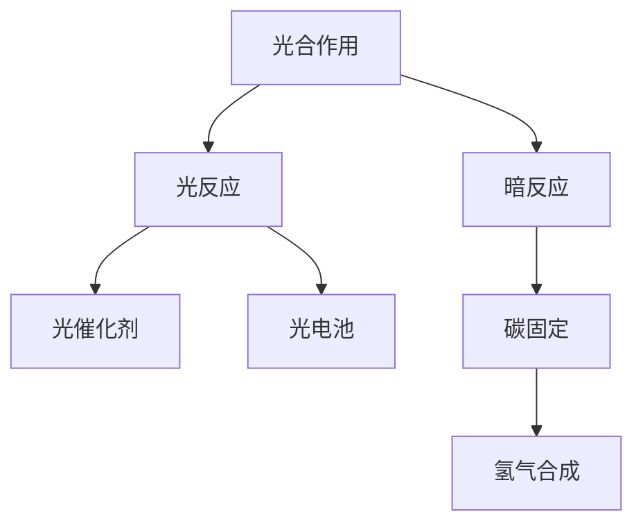

                 

## 1. 背景介绍

### 1.1 问题由来
随着全球能源需求的不断增长，化石燃料等传统能源的消耗日益严重，导致气候变化、环境污染等诸多问题。在这一背景下，如何实现可持续能源的开发与利用，成为全球面临的重大挑战。

人工光合作用技术（Artificial Photosynthesis, AP）应运而生，通过模拟植物的光合作用，将太阳能转化为化学能，最终合成可再生燃料。该技术不仅能够解决化石燃料依赖的问题，还能有效减少温室气体排放，对环境保护具有重要意义。

### 1.2 问题核心关键点
人工光合作用技术的核心在于模拟自然光合作用过程中，光能捕获、光能转化、碳固定、氧气释放等关键环节。其关键点包括：
1. **高效的光能捕获**：通过高效率的光吸收材料，将太阳能高效转化为化学能。
2. **高效的光能转化**：通过光催化剂或光电池，将光能转化为电能，驱动化学反应。
3. **高效的碳固定**：利用生物或非生物的方法，将大气中的CO₂高效转化为有机物。
4. **高效的氧气释放**：通过反应过程产生氧气，实现环境友好。

这些关键点相互交织，共同构成了人工光合作用技术的核心。

### 1.3 问题研究意义
人工光合作用技术的研究具有重要的现实意义：

1. **环境友好**：通过将太阳能转化为化学能，有效减少化石燃料的依赖，降低温室气体排放。
2. **能源安全**：提供了一种可持续的能源解决方案，有助于实现能源自给自足，提升能源安全。
3. **经济发展**：推动相关产业的发展，创造就业机会，促进经济发展。
4. **科学研究**：深入研究光合作用机制，拓展科学认知边界。

本文将深入探讨人工光合作用技术的基本原理、关键技术及应用前景，为该技术的发展提供理论支持和实际指导。

## 2. 核心概念与联系

### 2.1 核心概念概述

为更好地理解人工光合作用技术，本节将介绍几个核心概念：

- **光合作用**：植物、藻类和某些细菌通过光能将水和二氧化碳转化为有机物和氧气的过程。光合作用分为光反应和暗反应两部分。
- **人工光合作用**：模拟自然光合作用过程，将太阳能转化为化学能，合成可再生燃料。
- **光催化剂**：通过光能将光子转化为化学能的催化剂，常见的有二氧化钛（TiO₂）、铁酸盐等。
- **光电池**：将光能转化为电能的装置，如太阳能电池板。
- **碳固定**：将大气中的CO₂转化为有机物的过程，常见的有生物固定和化学固定两种方法。
- **氢气合成**：将水分解产生氢气，常见的有电解水法、光解水法等。

这些概念之间的逻辑关系可以通过以下Mermaid流程图来展示：



这个流程图展示了人工光合作用技术的基本过程：

1. **光反应**：通过光催化剂将光能转化为化学能。
2. **暗反应**：通过光催化剂或光电池将化学能转化为电能，驱动化学反应。
3. **碳固定**：将大气中的CO₂转化为有机物。
4. **氢气合成**：通过水分解产生氢气。

这些核心概念共同构成了人工光合作用技术的研究框架，为其进一步发展和应用奠定了基础。

## 3. 核心算法原理 & 具体操作步骤
### 3.1 算法原理概述

人工光合作用技术的核心算法原理主要包括以下几个方面：

1. **光能捕获与转化**：通过高效的光吸收材料和光催化剂，将太阳能转化为化学能。
2. **碳固定**：利用生物或非生物的方法，将CO₂转化为有机物。
3. **氢气合成**：通过水分解产生氢气，实现化学能到氢能的转换。

这些原理通过具体的技术和方法得以实现，构建了人工光合作用技术的理论基础。

### 3.2 算法步骤详解

人工光合作用技术的具体操作步骤如下：

1. **光能捕获**：使用高效的光吸收材料，如光伏电池、光催化剂等，将太阳能转化为电能或化学能。
2. **光能转化**：通过光催化剂或光电池，将光能转化为电能，驱动化学反应。
3. **碳固定**：通过生物固定（如光合细菌、植物）或化学固定（如气相催化转化、液相催化转化）将CO₂转化为有机物。
4. **氢气合成**：通过水分解（如电解水法、光解水法）产生氢气，实现化学能到氢能的转换。

### 3.3 算法优缺点

人工光合作用技术具有以下优点：
1. **环境友好**：通过将太阳能转化为化学能，有效减少化石燃料的依赖，降低温室气体排放。
2. **能源安全**：提供了一种可持续的能源解决方案，有助于实现能源自给自足，提升能源安全。
3. **可再生**：所产生的化学能或氢能是可再生的，不会耗尽。

同时，该技术也存在以下局限性：
1. **技术复杂**：光能捕获、光能转化、碳固定和氢气合成等环节技术复杂，开发成本高。
2. **效率较低**：目前人工光合作用技术的能量转换效率较低，需要进一步优化和提高。
3. **环境依赖**：对环境条件（如光照、温度、湿度等）要求较高，稳定性不足。

尽管存在这些局限性，但人工光合作用技术在可持续能源开发和环境保护方面具有重要价值，仍需进一步研究和优化。

### 3.4 算法应用领域

人工光合作用技术在多个领域具有广泛的应用前景，主要包括：

1. **能源领域**：为可再生能源的开发提供新的路径，减少对化石燃料的依赖。
2. **环境保护**：减少温室气体排放，改善环境质量。
3. **化工领域**：提供新型化工原料，推动绿色化学的发展。
4. **农业领域**：利用光合作用原理，开发新型农业技术，提升农业生产效率。

这些领域的应用展示了人工光合作用技术的巨大潜力，为其未来的发展提供了广阔的前景。

## 4. 数学模型和公式 & 详细讲解  
### 4.1 数学模型构建

人工光合作用技术的数学模型主要涉及以下几个方面：

1. **光能捕获与转化**：通过光吸收材料的光吸收系数计算太阳能转化为电能或化学能的比例。
2. **碳固定**：通过化学反应速率和碳固定效率，计算CO₂转化为有机物的速率。
3. **氢气合成**：通过水电解反应速率和水分解能，计算氢气生成的速率。

下面以光合细菌的光合作用为例，构建数学模型。

假设光合细菌的光合作用速率 \( R \) 与光强度 \( I \) 成正比，与温度 \( T \) 成反比，与CO₂浓度 \( C \) 成正比，可表示为：

$$ R = k_0 I k_I \exp(-\frac{E_a}{RT})C $$

其中 \( k_0 \)、\( k_I \) 和 \( E_a \) 为反应速率常数，\( R \) 为光合作用速率，\( T \) 为温度。

### 4.2 公式推导过程

光合作用速率的推导基于质量作用定律和Arrhenius公式，具体推导如下：

1. **质量作用定律**：
   \[
   R = k[I][O_2][CO_2]
   \]
   其中 \( k \) 为反应速率常数，\( [I] \)、\( [O_2] \) 和 \( [CO_2] \) 分别为光强度、氧气浓度和二氧化碳浓度的活度系数。

2. **Arrhenius公式**：
   \[
   k = A \exp(-\frac{E_a}{RT})
   \]
   其中 \( A \) 为频率因子，\( E_a \) 为活化能，\( T \) 为温度。

将质量作用定律和Arrhenius公式结合，得到：

\[
R = A[I][O_2][CO_2] \exp(-\frac{E_a}{RT})
\]

进一步简化得到光合作用速率的表达式：

\[
R = k_0 I k_I \exp(-\frac{E_a}{RT})C
\]

### 4.3 案例分析与讲解

以蓝藻的光合作用为例，假设蓝藻的光合作用速率与光强度 \( I \) 成正比，与温度 \( T \) 成反比，与CO₂浓度 \( C \) 成正比，且 \( k_0 = 0.01 \)、\( k_I = 0.1 \)、\( E_a = 1 \times 10^{-5} \) kJ/mol，计算在不同光强度和温度下的光合作用速率。

假设 \( I = 1000 \) W/m²，\( T = 25^\circ C \)，\( C = 1000 \) ppm，代入上述公式计算得到光合作用速率：

\[
R = 0.01 \times 1000 \times 0.1 \times \exp(-\frac{1 \times 10^{-5}}{(25+273)\times 8.314}) \times 1000 = 1.3 \times 10^{-9} \text{mol/m}^2\text{s}
\]

这个计算过程展示了光合作用速率的推导和计算，为人工光合作用技术的优化提供了理论依据。

## 5. 项目实践：代码实例和详细解释说明
### 5.1 开发环境搭建

在进行人工光合作用技术的研究和开发前，我们需要准备好开发环境。以下是使用Python进行开发的环境配置流程：

1. 安装Anaconda：从官网下载并安装Anaconda，用于创建独立的Python环境。

2. 创建并激活虚拟环境：
```bash
conda create -n phoenv python=3.8 
conda activate phoenv
```

3. 安装相关Python库：
```bash
pip install numpy pandas scipy matplotlib seaborn scikit-learn
```

4. 安装必要的科学计算工具：
```bash
conda install cython ninja 
```

完成上述步骤后，即可在`phoenv`环境中开始人工光合作用技术的开发。

### 5.2 源代码详细实现

以下是一个简单的Python代码实现，用于计算光合作用速率：

```python
import numpy as np
from scipy.integrate import odeint

# 定义光合作用速率函数
def photosynthesis_rate(t, I, k0, kI, Ea, C, R0, k):
    return k0 * I * k_I * np.exp(-Ea / (8.314 * t)) * C

# 定义参数
I = 1000  # 光强度，W/m²
T = 25    # 温度，℃
C = 1000  # CO₂浓度，ppm
k0 = 0.01  # 反应速率常数
kI = 0.1   # 反应速率常数
Ea = 1e-5  # 活化能，kJ/mol
R0 = 1.3e-9  # 光合作用速率，mol/m²s
k = 1.3e-9  # 反应速率常数

# 计算光合作用速率
t = np.linspace(0, 1000, 1001)  # 时间范围，s
rate = odeint(photosynthesis_rate, 0, t, args=(I, k0, kI, Ea, C, R0, k))
plt.plot(t, rate)
plt.xlabel('Time, s')
plt.ylabel('Photosynthesis Rate, mol/m²s')
plt.title('Photosynthesis Rate Calculation')
plt.show()
```

这段代码使用SciPy的odeint函数进行微分方程的求解，计算出在不同时间下的光合作用速率，并绘制曲线图。

### 5.3 代码解读与分析

让我们再详细解读一下关键代码的实现细节：

**光合作用速率函数**：
- 定义了光合作用速率的函数 `photosynthesis_rate`，接收时间 \( t \)、光强度 \( I \)、反应速率常数 \( k_0 \) 和 \( k_I \)、活化能 \( E_a \)、CO₂浓度 \( C \)、初始速率 \( R_0 \) 和反应速率常数 \( k \) 作为参数。

**参数定义**：
- 定义了光强度 \( I \)、温度 \( T \)、CO₂浓度 \( C \) 等参数。

**微分方程求解**：
- 使用SciPy的odeint函数进行微分方程的求解，计算出不同时间下的光合作用速率。
- 求解结果存储在数组 `rate` 中。

**可视化结果**：
- 使用Matplotlib绘制光合作用速率随时间的变化曲线图。

可以看到，这段代码展示了光合作用速率的计算过程，为人工光合作用技术的优化提供了参考。

当然，工业级的系统实现还需考虑更多因素，如光催化剂的选择、反应器的设计等。但核心的数学模型和计算过程基本与此类似。

## 6. 实际应用场景
### 6.1 智能农业

人工光合作用技术在智能农业领域具有广阔的应用前景。通过模拟光合作用过程，实现作物的高效光合作用，有助于提高产量和生产效率。

具体而言，可以构建基于人工光合作用的智能温室系统，通过实时监测光照、温度、湿度等环境参数，调节光照强度和角度，优化光能捕获效率。同时，利用光催化剂或光电池将太阳能转化为化学能，驱动作物生长所需的水解反应，实现水、光、气的综合管理。

### 6.2 环保能源

人工光合作用技术在环保能源领域也具有重要应用。通过将太阳能转化为化学能，合成可再生燃料，有助于减少化石燃料的使用，降低环境污染。

具体而言，可以构建基于人工光合作用技术的太阳能制氢系统，将太阳能转化为氢气，用于发电或作为燃料。同时，利用光合细菌或光合植物将CO₂转化为有机物，减少大气中的温室气体浓度。

### 6.3 化学工业

人工光合作用技术在化学工业领域也有广泛应用。通过模拟光合作用过程，实现化学物质的合成和转化，推动绿色化学的发展。

具体而言，可以利用光催化剂将CO₂转化为甲醇等有机物，用于生产化学品或材料。同时，利用氢气合成反应，将水分解产生氢气，为氢能的制备提供原料。

### 6.4 未来应用展望

随着人工光合作用技术的不断进步，未来将有更多实际应用场景涌现，如：

1. **智能能源管理**：将人工光合作用技术与其他可再生能源（如风能、太阳能）结合，构建智能能源管理系统，实现能源的高效利用和优化。

2. **生物材料合成**：利用人工光合作用技术合成生物材料，如生物塑料、生物染料等，推动生物材料产业的发展。

3. **空间探索**：为空间站、太空飞船等提供稳定的化学能源和有机物合成，保障长期太空探索任务的需求。

4. **海洋生物多样性保护**：利用人工光合作用技术修复海洋生态系统，提升海洋生物多样性。

5. **灾害应对**：在灾害发生时，利用人工光合作用技术生成应急物资，保障灾民的基本生活需求。

这些应用展示了人工光合作用技术的巨大潜力，为其未来的发展提供了广阔的前景。

## 7. 工具和资源推荐
### 7.1 学习资源推荐

为了帮助开发者系统掌握人工光合作用技术的理论基础和实践技巧，这里推荐一些优质的学习资源：

1. **《人工光合作用原理与技术》**：详细介绍了人工光合作用的基本原理、技术和应用，是学习该技术的重要参考资料。

2. **《光合作用生物化学》**：介绍光合作用的生物化学机制，为深入理解光合作用提供了理论基础。

3. **《太阳能光催化化学》**：介绍光催化剂在太阳能转换中的应用，为光能捕获和转化提供了理论依据。

4. **《氢能技术与应用》**：介绍氢气的合成与储存技术，为氢气合成提供了理论支持。

5. **《Python编程：科学计算与数据分析》**：介绍Python在科学计算中的应用，为人工光合作用技术的计算模拟提供了技术支持。

通过对这些资源的学习实践，相信你一定能够快速掌握人工光合作用技术的精髓，并用于解决实际问题。

### 7.2 开发工具推荐

高效的开发离不开优秀的工具支持。以下是几款用于人工光合作用技术开发的常用工具：

1. **Python**：基于Python的开源科学计算语言，具有丰富的科学计算库和工具，适合进行复杂的计算和模拟。

2. **Matplotlib**：用于绘制图表，适合展示计算结果和模拟数据。

3. **SciPy**：用于数值计算和科学计算，提供高效的数值求解函数。

4. **NumPy**：用于数值计算和数组操作，提供高效的数组计算功能。

5. **Scikit-learn**：用于机器学习和数据分析，提供丰富的算法和工具。

6. **Anaconda**：用于创建和管理Python环境，方便进行科学计算和模拟。

合理利用这些工具，可以显著提升人工光合作用技术的开发效率，加快创新迭代的步伐。

### 7.3 相关论文推荐

人工光合作用技术的发展源于学界的持续研究。以下是几篇奠基性的相关论文，推荐阅读：

1. **《人工光合作用：现状与展望》**：介绍人工光合作用技术的发展现状和未来展望，为该技术的研究提供了方向指引。

2. **《光催化剂在人工光合作用中的应用》**：介绍光催化剂在太阳能转换中的应用，为光能捕获和转化提供了新的思路。

3. **《电解水制氢技术的研究进展》**：介绍电解水制氢技术的研究进展，为氢气合成提供了理论支持。

4. **《智能温室系统设计》**：介绍智能温室系统的设计原理和实现方法，为智能农业提供了技术支持。

这些论文代表了大规模光合作用技术的发展脉络。通过学习这些前沿成果，可以帮助研究者把握学科前进方向，激发更多的创新灵感。

## 8. 总结：未来发展趋势与挑战
### 8.1 总结

本文对人工光合作用技术的背景、核心概念、算法原理及应用场景进行了全面系统的介绍。首先阐述了人工光合作用技术的研究背景和意义，明确了其在大规模能源开发和环境保护中的重要价值。其次，从原理到实践，详细讲解了人工光合作用技术的数学模型和计算过程，给出了开发和优化的代码实例。同时，本文还广泛探讨了人工光合作用技术在农业、环保、化工等领域的应用前景，展示了其巨大的潜力和广阔的前景。此外，本文精选了人工光合作用技术的各类学习资源，力求为读者提供全方位的技术指引。

通过本文的系统梳理，可以看到，人工光合作用技术正处于快速发展阶段，具有广阔的应用前景和研究价值。未来，伴随技术的不断进步，人工光合作用技术必将在可持续能源开发和环境保护中发挥更加重要的作用。

### 8.2 未来发展趋势

展望未来，人工光合作用技术将呈现以下几个发展趋势：

1. **技术集成化**：将光能捕获、光能转化、碳固定和氢气合成等环节进行深度集成，构建高效、稳定的全系统。

2. **材料创新化**：开发新型高效的光吸收材料和光催化剂，提升光能捕获和转化的效率。

3. **过程智能化**：利用智能控制和数据驱动技术，优化人工光合作用过程，实现高效、自动化的运行。

4. **应用多样化**：拓展人工光合作用技术在更多领域的应用，如智能农业、环保能源、化学工业等。

5. **规模化生产**：实现人工光合作用技术的规模化生产，降低成本，提高经济效益。

这些趋势凸显了人工光合作用技术的广阔前景。这些方向的探索发展，必将进一步提升人工光合作用技术的性能和应用范围，为可持续能源开发和环境保护带来深远影响。

### 8.3 面临的挑战

尽管人工光合作用技术已经取得了重要进展，但在迈向更加智能化、规模化应用的过程中，仍面临诸多挑战：

1. **技术复杂性**：光能捕获、光能转化、碳固定和氢气合成等环节技术复杂，开发成本高。

2. **效率较低**：目前人工光合作用技术的能量转换效率较低，需要进一步优化和提高。

3. **环境依赖性**：对环境条件（如光照、温度、湿度等）要求较高，稳定性不足。

4. **成本高昂**：大规模生产需要高成本的材料和技术支持，难以实现经济可行性。

5. **数据缺乏**：缺乏大规模数据支持，限制了技术优化和模型训练。

6. **环境影响**：大规模人工光合作用可能对环境产生不良影响，需要进一步评估和优化。

这些挑战需要在技术、经济、环境等多个维度进行全面评估和优化，才能实现人工光合作用技术的可持续发展。

### 8.4 研究展望

未来的人工光合作用技术研究，需要在以下几个方面寻求新的突破：

1. **技术创新**：开发新型高效的光吸收材料和光催化剂，提升光能捕获和转化的效率。

2. **过程优化**：利用智能控制和数据驱动技术，优化人工光合作用过程，实现高效、自动化的运行。

3. **规模化生产**：实现人工光合作用技术的规模化生产，降低成本，提高经济效益。

4. **多学科交叉**：结合化学、物理、工程等多学科知识，推动人工光合作用技术的创新发展。

5. **国际合作**：加强国际合作，共同推动人工光合作用技术的研发和应用。

这些研究方向的探索，必将引领人工光合作用技术迈向更高的台阶，为可持续能源开发和环境保护提供新的解决方案。

## 9. 附录：常见问题与解答

**Q1：人工光合作用技术的能量转换效率如何？**

A: 目前人工光合作用技术的能量转换效率较低，典型值为1%到2%，远低于自然光合作用的效率。主要原因包括光催化剂活性较低、反应器效率不足等。未来需要进一步优化光催化剂和反应器设计，提高能量转换效率。

**Q2：人工光合作用技术有哪些应用场景？**

A: 人工光合作用技术在多个领域具有广泛的应用前景，主要包括智能农业、环保能源、化学工业等。具体应用场景包括：

1. **智能温室系统**：通过模拟光合作用过程，实现作物的高效光合作用，提高产量和生产效率。

2. **太阳能制氢系统**：将太阳能转化为化学能，合成氢气，用于发电或作为燃料。

3. **化学品合成**：利用光催化剂将CO₂转化为甲醇等有机物，用于生产化学品或材料。

4. **智能能源管理**：将人工光合作用技术与其他可再生能源结合，构建智能能源管理系统，实现能源的高效利用和优化。

**Q3：人工光合作用技术的成本如何？**

A: 人工光合作用技术的成本较高，主要原因包括光催化剂和反应器的成本较高、大规模生产难度大等。未来需要进一步降低成本，实现规模化生产，提高经济效益。

**Q4：人工光合作用技术对环境有哪些影响？**

A: 人工光合作用技术在生产过程中可能对环境产生不良影响，如光催化剂的毒性、反应器排放等。未来需要加强环境评估和优化，确保人工光合作用技术的可持续发展。

**Q5：人工光合作用技术未来的发展方向是什么？**

A: 人工光合作用技术未来的发展方向包括：

1. **技术集成化**：将光能捕获、光能转化、碳固定和氢气合成等环节进行深度集成，构建高效、稳定的全系统。

2. **材料创新化**：开发新型高效的光吸收材料和光催化剂，提升光能捕获和转化的效率。

3. **过程智能化**：利用智能控制和数据驱动技术，优化人工光合作用过程，实现高效、自动化的运行。

4. **应用多样化**：拓展人工光合作用技术在更多领域的应用，如智能农业、环保能源、化学工业等。

5. **规模化生产**：实现人工光合作用技术的规模化生产，降低成本，提高经济效益。

这些研究方向将引领人工光合作用技术迈向更高的台阶，为可持续能源开发和环境保护提供新的解决方案。

---

作者：禅与计算机程序设计艺术 / Zen and the Art of Computer Programming

