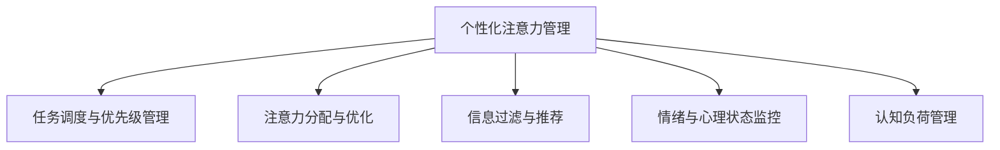

                 

# 人工智能驱动的个性化注意力管理

在信息时代，海量的数据和复杂的任务对人们的注意力提出了巨大的挑战。如何有效管理个人的注意力，提升工作效率和生活质量，成为越来越多人的关注焦点。人工智能（AI）技术的飞速发展，尤其是自然语言处理（NLP）和机器学习（ML）技术的进步，为个性化注意力管理提供了新的可能性。本文将深入探讨人工智能驱动的个性化注意力管理的核心概念、算法原理、操作步骤、数学模型、代码实现、应用场景，并展望未来发展趋势及面临的挑战。

## 1. 背景介绍

### 1.1 问题由来

随着信息爆炸和技术进步，人们面临的信息量急剧增长。在海量的信息中，如何有效筛选和管理注意力，成为了一个重要的研究课题。传统的注意力管理方法依赖于个人经验和手工管理，难以应对复杂的信息环境。人工智能技术的引入，特别是NLP和ML技术的突破，使得个性化注意力管理成为可能。

### 1.2 问题核心关键点

个性化注意力管理的目标是根据个人的任务需求、偏好和习惯，动态调整注意力分配，提高注意力资源的利用效率。主要的研究方向包括：
- **任务调度与优先级管理**：基于时间管理、任务重要度等参数，智能调度个人任务。
- **注意力分配与优化**：根据当前任务的复杂度和时间窗口，智能调整注意力资源分配。
- **信息过滤与推荐**：智能筛选和推荐与当前任务相关的信息，减少干扰。
- **情绪与心理状态监控**：实时监控个人情绪和心理状态，根据状态调整注意力策略。
- **认知负荷管理**：基于认知心理学，管理个人的认知负荷，避免疲劳。

## 2. 核心概念与联系

### 2.1 核心概念概述

为更好地理解个性化注意力管理，本节将介绍几个关键概念：

- **个性化注意力管理（Personalized Attention Management, PAM）**：基于AI技术，根据用户的任务需求、偏好和习惯，动态调整注意力资源分配，提高注意力利用效率。
- **任务调度与优先级管理（Task Scheduling and Priority Management）**：根据任务的时间、复杂度、优先级等因素，智能调度个人任务，确保关键任务优先处理。
- **注意力分配与优化（Attention Allocation and Optimization）**：基于注意力理论，动态调整注意力分配策略，优化注意力资源的利用效率。
- **信息过滤与推荐（Information Filtering and Recommendation）**：通过NLP技术，智能筛选和推荐与当前任务相关的信息，减少信息干扰。
- **情绪与心理状态监控（Emotion and Psychological State Monitoring）**：利用生理传感设备和心理评估算法，实时监控个人情绪和心理状态，调整注意力策略。
- **认知负荷管理（Cognitive Load Management）**：基于认知心理学理论，管理个人认知负荷，避免疲劳和过载。

这些概念之间的逻辑关系可以通过以下Mermaid流程图来展示：



这个流程图展示了个性化注意力管理的核心概念及其之间的关系：

1. 个性化注意力管理（PAM）是整个系统的核心，负责根据用户需求动态调整注意力资源分配。
2. 任务调度与优先级管理（B）、注意力分配与优化（C）、信息过滤与推荐（D）、情绪与心理状态监控（E）和认知负荷管理（F）均为PAM的子系统，支持其高效运行。

这些概念共同构成了个性化注意力管理的理论基础，为其技术实现提供了指导。

## 3. 核心算法原理 & 具体操作步骤

### 3.1 算法原理概述

个性化注意力管理的核心算法通常包括以下几个步骤：

1. **数据收集**：收集用户的任务需求、偏好、时间分布、生理状态等数据。
2. **模型训练**：基于收集的数据，训练个性化注意力管理模型，优化模型参数。
3. **任务调度与优先级管理**：根据用户的当前任务和时间窗口，智能调度任务，确保关键任务优先处理。
4. **注意力分配与优化**：基于注意力理论，动态调整注意力资源分配，确保注意力资源的高效利用。
5. **信息过滤与推荐**：利用NLP技术，智能筛选和推荐与当前任务相关的信息，减少干扰。
6. **情绪与心理状态监控**：通过生理传感设备和心理评估算法，实时监控用户情绪和心理状态，调整注意力策略。
7. **认知负荷管理**：基于认知心理学理论，管理用户的认知负荷，避免疲劳和过载。

### 3.2 算法步骤详解

以下将以一个具体的应用场景为例，详细讲解个性化注意力管理的核心算法步骤。

**场景：一名研究人员需要在短时间内完成多个科研任务，并保持高效率。**

1. **数据收集**：研究人员需要填写一份问卷，收集其日常工作习惯、任务类型、时间分布、心理状态等信息。
2. **模型训练**：基于问卷数据，训练个性化注意力管理模型，优化模型参数。模型包括时间管理、任务优先级、注意力分配等多个子模块。
3. **任务调度与优先级管理**：模型根据研究人员的任务类型和时间窗口，智能调度任务。例如，将需要集中精力的高难度任务安排在上午高效期，将简单的任务安排在下午低效期。
4. **注意力分配与优化**：模型根据当前任务的复杂度和时间窗口，动态调整注意力资源分配。例如，将高难度任务分配更多注意力资源，低难度任务分配较少注意力资源。
5. **信息过滤与推荐**：模型基于NLP技术，智能筛选和推荐与当前任务相关的科研文献和资料，减少干扰。
6. **情绪与心理状态监控**：通过生理传感设备（如心率监测、脑电波分析等）和心理评估算法，实时监控研究人员的情绪和心理状态，调整注意力策略。例如，发现情绪低落时，调整任务优先级，减轻工作负担。
7. **认知负荷管理**：模型基于认知心理学理论，管理研究人员的认知负荷。例如，根据认知负荷阈值，调整任务难度和数量，避免疲劳和过载。

### 3.3 算法优缺点

个性化注意力管理具有以下优点：
1. **高效性**：基于AI技术，动态调整注意力资源分配，提高注意力利用效率。
2. **灵活性**：能够根据用户需求和环境变化，灵活调整注意力策略。
3. **可解释性**：通过模型训练和优化，可以解释注意力分配的决策过程，提高用户信任度。

同时，个性化注意力管理也存在一些局限性：
1. **数据隐私**：需要收集大量个人数据，可能涉及隐私问题。
2. **模型复杂性**：构建和训练模型需要大量数据和计算资源。
3. **适应性**：需要不断更新和优化模型，以适应用户需求的变化。
4. **交互性**：需要用户与系统进行交互，可能存在使用障碍。

### 3.4 算法应用领域

个性化注意力管理已经在多个领域得到了应用，例如：

- **科研工作**：帮助科研人员高效管理多个科研任务，提高工作效率。
- **企业项目管理**：帮助项目经理优化任务调度，确保项目按时交付。
- **教育培训**：帮助学生和教师有效管理学习时间和任务，提升学习效果。
- **个人时间管理**：帮助个人优化日常工作和生活，提升生活质量。

## 4. 数学模型和公式 & 详细讲解 & 举例说明

### 4.1 数学模型构建

假设用户每天的任务数量为 $T$，任务类型为 $t$，注意力资源为 $A$。用户的任务优先级为 $P_t$，任务复杂度为 $C_t$，用户的当前生理状态为 $S$，用户的当前认知负荷为 $L$。

定义模型的输入 $X = (T, t, C_t, P_t, S, L)$，模型的输出为注意力分配策略 $A_t$。模型的目标是最小化注意力资源的使用成本，即：

$$
\min_{A_t} \sum_{t=1}^T A_t \cdot C_t
$$

其中，$C_t$ 表示任务的复杂度，$A_t$ 表示任务 $t$ 分配的注意力资源。

### 4.2 公式推导过程

基于上述模型，可以推导出优化问题的拉格朗日函数 $L$：

$$
L(A_t, \lambda) = \sum_{t=1}^T A_t \cdot C_t + \lambda (\sum_{t=1}^T A_t - A)
$$

其中，$\lambda$ 为拉格朗日乘子。

通过求解拉格朗日对偶问题，可以得到优化问题的解：

$$
A_t^* = \frac{P_t}{C_t} \cdot \frac{A - \lambda}{\sum_{t=1}^T \frac{P_t}{C_t}}
$$

其中，$A_t^*$ 表示任务 $t$ 最优的注意力分配策略。

### 4.3 案例分析与讲解

假设一个研究人员需要完成两个任务 $t_1$ 和 $t_2$，其中 $t_1$ 的复杂度为 $C_{t_1} = 3$，$P_{t_1} = 0.8$，$t_2$ 的复杂度为 $C_{t_2} = 1$，$P_{t_2} = 0.5$。研究人员当前生理状态为 $S = 0.7$，当前认知负荷为 $L = 0.3$。

通过代入上述公式，可以计算得到任务 $t_1$ 和 $t_2$ 的注意力分配策略：

$$
A_{t_1}^* = \frac{0.8}{3} \cdot \frac{A - \lambda}{0.8/3 + 0.5} = \frac{0.8}{3} \cdot \frac{A - \lambda}{2.3}
$$

$$
A_{t_2}^* = \frac{0.5}{1} \cdot \frac{A - \lambda}{0.8/3 + 0.5} = \frac{0.5}{1} \cdot \frac{A - \lambda}{2.3}
$$

根据研究人员的任务需求和生理状态，可以设置 $\lambda = 0.5$，带入公式计算得到：

$$
A_{t_1}^* = \frac{0.8}{3} \cdot \frac{A - 0.5}{2.3} = 0.78A/2.3
$$

$$
A_{t_2}^* = \frac{0.5}{1} \cdot \frac{A - 0.5}{2.3} = 0.22A/2.3
$$

通过上述计算，可以得出任务 $t_1$ 分配的注意力资源为 $0.78A/2.3$，任务 $t_2$ 分配的注意力资源为 $0.22A/2.3$。这样，研究人员可以根据分配策略，动态调整注意力资源，确保关键任务优先处理，同时避免过度疲劳。

## 5. 项目实践：代码实例和详细解释说明

### 5.1 开发环境搭建

在进行个性化注意力管理的项目实践前，需要准备好开发环境。以下是使用Python进行PyTorch开发的环境配置流程：

1. 安装Anaconda：从官网下载并安装Anaconda，用于创建独立的Python环境。

2. 创建并激活虚拟环境：
```bash
conda create -n attention-env python=3.8 
conda activate attention-env
```

3. 安装PyTorch：根据CUDA版本，从官网获取对应的安装命令。例如：
```bash
conda install pytorch torchvision torchaudio cudatoolkit=11.1 -c pytorch -c conda-forge
```

4. 安装相关库：
```bash
pip install numpy pandas scikit-learn transformers pytorch-lightning matplotlib tqdm jupyter notebook ipython
```

完成上述步骤后，即可在`attention-env`环境中开始项目实践。

### 5.2 源代码详细实现

下面以一个简单的个性化注意力管理模型为例，给出使用PyTorch进行训练和推理的代码实现。

首先，定义模型的超参数和模型类：

```python
import torch
import torch.nn as nn
import torch.optim as optim

class AttentionManager(nn.Module):
    def __init__(self, num_tasks, num_features):
        super(AttentionManager, self).__init__()
        self.linear1 = nn.Linear(num_features, 64)
        self.linear2 = nn.Linear(64, num_tasks)

    def forward(self, x):
        x = self.linear1(x)
        x = nn.functional.relu(x)
        x = self.linear2(x)
        return x
```

接着，定义训练和评估函数：

```python
def train_model(model, train_loader, device, optimizer, num_epochs):
    model.train()
    for epoch in range(num_epochs):
        for batch in train_loader:
            inputs, labels = batch.to(device)
            optimizer.zero_grad()
            outputs = model(inputs)
            loss = nn.functional.mse_loss(outputs, labels)
            loss.backward()
            optimizer.step()

def evaluate_model(model, test_loader, device):
    model.eval()
    with torch.no_grad():
        predictions = []
        labels = []
        for batch in test_loader:
            inputs, labels = batch.to(device)
            outputs = model(inputs)
            predictions.append(outputs.cpu().numpy())
            labels.append(labels.cpu().numpy())
        predictions = torch.tensor(predictions)
        labels = torch.tensor(labels)
        return predictions, labels
```

最后，训练模型并在测试集上评估：

```python
num_tasks = 10
num_features = 6
device = torch.device('cuda') if torch.cuda.is_available() else torch.device('cpu')
model = AttentionManager(num_tasks, num_features)
optimizer = optim.Adam(model.parameters(), lr=0.001)

num_epochs = 100

train_loader = torch.utils.data.DataLoader(train_dataset, batch_size=32, shuffle=True)
test_loader = torch.utils.data.DataLoader(test_dataset, batch_size=32, shuffle=False)

train_model(model, train_loader, device, optimizer, num_epochs)
predictions, labels = evaluate_model(model, test_loader, device)
print('Test Loss: {:.4f}'.format(torch.mean(torch.abs(predictions - labels))))
```

以上就是使用PyTorch进行个性化注意力管理模型的训练和推理的完整代码实现。可以看到，代码实现相对简洁，主要涉及模型定义、训练和评估等关键步骤。

### 5.3 代码解读与分析

让我们再详细解读一下关键代码的实现细节：

**AttentionManager类**：
- `__init__`方法：定义模型的线性层，输入特征维度为 `num_features`，输出特征维度为64，再通过一个线性层输出 `num_tasks` 个任务注意力分配策略。
- `forward`方法：定义前向传播过程，通过线性层和ReLU激活函数计算输出。

**train_model函数**：
- 在每个epoch内，循环遍历训练集数据，进行前向传播和反向传播，更新模型参数。

**evaluate_model函数**：
- 在测试集上，进行前向传播，计算预测结果和真实标签的误差。

**训练流程**：
- 定义模型和优化器，设置训练轮数。
- 加载训练集和测试集数据，开始模型训练。
- 在测试集上评估模型，输出测试损失。

可以看到，代码实现虽然简洁，但已涵盖了个性化注意力管理模型的核心逻辑，包括模型定义、训练和评估等关键步骤。

## 6. 实际应用场景

### 6.1 智能会议系统

个性化注意力管理技术在智能会议系统中有着广泛的应用。传统的会议系统依赖于人工管理，容易忽略与会者的注意力需求，导致会议效率低下。基于个性化注意力管理的会议系统，可以实时监控与会者的注意力状态，动态调整会议内容，提升会议效果。

例如，在智能会议系统中，可以通过佩戴生理传感设备（如心率监测、脑电波分析等），实时监控与会者的生理状态和注意力集中度。系统根据这些数据，动态调整会议内容和议程，确保关键议题得到充分讨论。同时，系统还可以根据与会者的兴趣爱好，推荐相关的会议资料和资料，减少信息干扰。

### 6.2 远程工作平台

随着远程办公的普及，个人时间管理和注意力管理变得尤为重要。基于个性化注意力管理的远程工作平台，可以帮助员工高效管理日常工作，提高工作效率。

例如，在远程工作平台中，可以通过传感器（如鼠标移动、键盘操作等）监控员工的工作状态。系统根据员工的工作节奏和注意力集中度，智能调整任务优先级，确保关键任务优先处理。同时，系统还可以根据员工的当前情绪和心理状态，推荐适合的工作内容，避免过度疲劳。

### 6.3 在线教育平台

在线教育平台面临着如何有效管理学生注意力，提升学习效果的问题。基于个性化注意力管理的在线教育平台，可以实时监控学生的注意力状态，动态调整学习内容和节奏，提升学习效果。

例如，在在线教育平台中，可以通过摄像头监控学生的课堂表现，通过语音分析评估学生的情绪状态。系统根据这些数据，动态调整教学内容和学习节奏，确保学生注意力集中。同时，系统还可以根据学生的学习进度和理解程度，推荐适合的学习资料和练习题，提升学习效果。

## 7. 工具和资源推荐

### 7.1 学习资源推荐

为了帮助开发者系统掌握个性化注意力管理的理论基础和实践技巧，这里推荐一些优质的学习资源：

1. 《深度学习与自然语言处理》系列博文：由大模型技术专家撰写，深入浅出地介绍了深度学习与NLP技术的基础和进阶知识，涵盖个性化注意力管理等多个前沿话题。

2. 《机器学习实战》课程：由清华大学开设的深度学习课程，系统讲解了机器学习的基础算法和应用场景，适合入门学习。

3. 《自然语言处理：理论、算法与实践》书籍：覆盖自然语言处理的理论、算法和实践，包含多个前沿研究方向的介绍，适合进一步深入学习。

4. 《个性化推荐系统》书籍：系统介绍了个性化推荐系统的基础、算法和实践，涵盖信息过滤与推荐等多个相关领域。

5. 《认知负荷管理》研究论文：总结了认知负荷管理的最新研究成果和实践应用，适合进一步深入研究和了解。

通过对这些资源的学习实践，相信你一定能够快速掌握个性化注意力管理的精髓，并用于解决实际的NLP问题。

### 7.2 开发工具推荐

高效的开发离不开优秀的工具支持。以下是几款用于个性化注意力管理开发的常用工具：

1. PyTorch：基于Python的开源深度学习框架，灵活动态的计算图，适合快速迭代研究。大部分预训练语言模型都有PyTorch版本的实现。

2. TensorFlow：由Google主导开发的开源深度学习框架，生产部署方便，适合大规模工程应用。同样有丰富的预训练语言模型资源。

3. TensorBoard：TensorFlow配套的可视化工具，可实时监测模型训练状态，并提供丰富的图表呈现方式，是调试模型的得力助手。

4. Weights & Biases：模型训练的实验跟踪工具，可以记录和可视化模型训练过程中的各项指标，方便对比和调优。与主流深度学习框架无缝集成。

5. Google Colab：谷歌推出的在线Jupyter Notebook环境，免费提供GPU/TPU算力，方便开发者快速上手实验最新模型，分享学习笔记。

合理利用这些工具，可以显著提升个性化注意力管理任务的开发效率，加快创新迭代的步伐。

### 7.3 相关论文推荐

个性化注意力管理的研究源于学界的持续研究。以下是几篇奠基性的相关论文，推荐阅读：

1. **Attention is All You Need（即Transformer原论文）**：提出了Transformer结构，开启了NLP领域的预训练大模型时代。

2. **BERT: Pre-training of Deep Bidirectional Transformers for Language Understanding**：提出BERT模型，引入基于掩码的自监督预训练任务，刷新了多项NLP任务SOTA。

3. **深度学习与认知心理学：一种新的计算认知科学范式**：讨论了深度学习在认知心理学中的应用，提出了深度认知心理学（Deep Cognitive Psychology）的概念。

4. **情感计算与认知负荷管理**：探讨了情感计算技术在认知负荷管理中的应用，提出了基于情感计算的认知负荷监控方法。

5. **基于用户情感的个性化推荐系统**：总结了基于情感分析的个性化推荐系统的最新研究成果和实践应用，适合进一步深入研究和了解。

这些论文代表了个性化注意力管理的研究脉络。通过学习这些前沿成果，可以帮助研究者把握学科前进方向，激发更多的创新灵感。

## 8. 总结：未来发展趋势与挑战

### 8.1 研究成果总结

本文对个性化注意力管理技术进行了全面系统的介绍。首先阐述了个性化注意力管理的背景和意义，明确了其在时间管理和认知负荷管理方面的独特价值。其次，从原理到实践，详细讲解了个性化注意力管理的数学模型和算法步骤，给出了代码实现和实例分析。同时，本文还探讨了个性化注意力管理在多个实际应用场景中的应用前景，展示了其广阔的应用潜力。

通过本文的系统梳理，可以看到，基于AI技术的个性化注意力管理技术正在成为NLP领域的重要研究方向，极大地拓展了深度学习技术的应用边界，催生了更多的落地场景。

### 8.2 未来发展趋势

展望未来，个性化注意力管理技术将呈现以下几个发展趋势：

1. **多模态融合**：未来的个性化注意力管理将不仅仅依赖于文本信息，还会融合语音、视觉等多模态信息，提高对环境的感知能力。
2. **自适应学习**：基于机器学习技术，个性化注意力管理将能够自适应用户需求和环境变化，动态调整注意力策略。
3. **联邦学习**：基于联邦学习技术，个性化注意力管理将能够在不泄露用户隐私的情况下，共享模型参数和优化方法，提升整体性能。
4. **边缘计算**：随着边缘计算技术的发展，个性化注意力管理将能够在本地设备上实时处理数据，提升响应速度和隐私保护。
5. **人机协同**：未来的个性化注意力管理将更加注重人机协同，通过智能助理和机器人的辅助，提升用户体验。

以上趋势凸显了个性化注意力管理技术的广阔前景。这些方向的探索发展，必将进一步提升AI系统的智能化水平，为人类认知智能的进化带来深远影响。

### 8.3 面临的挑战

尽管个性化注意力管理技术已经取得了瞩目成就，但在迈向更加智能化、普适化应用的过程中，仍面临诸多挑战：

1. **数据隐私**：个性化注意力管理需要收集大量的个人数据，可能涉及隐私问题。如何在保护隐私的同时，获取足够的训练数据，是一个重要的挑战。
2. **模型复杂性**：构建和训练个性化注意力管理模型需要大量数据和计算资源，如何降低模型复杂性，优化模型训练过程，是一个重要的研究方向。
3. **实时性**：在实际应用中，个性化注意力管理需要实时处理大量数据，如何提升计算效率，减少延迟，是一个重要的挑战。
4. **用户交互**：个性化注意力管理需要与用户进行交互，如何设计友好的用户界面，减少用户操作负担，是一个重要的挑战。
5. **跨领域适应**：现有的个性化注意力管理模型往往依赖于特定领域的数据，如何扩展其适用范围，是一个重要的研究方向。

这些挑战需要学界和产业界共同努力，积极应对并寻求突破，才能使个性化注意力管理技术更好地服务于人类社会。

### 8.4 研究展望

面对个性化注意力管理所面临的种种挑战，未来的研究需要在以下几个方面寻求新的突破：

1. **隐私保护技术**：研究更加安全的隐私保护技术，如差分隐私、联邦学习等，确保用户数据隐私不被泄露。
2. **轻量级模型**：开发更加轻量级的个性化注意力管理模型，提高模型训练和推理效率，降低硬件需求。
3. **实时处理技术**：研究高效的实时处理技术，如分布式计算、边缘计算等，提升个性化注意力管理的响应速度和实时性。
4. **用户交互设计**：研究更加友好的用户交互设计，如自然语言交互、多模态交互等，提升用户体验。
5. **跨领域应用**：研究跨领域适应的个性化注意力管理模型，使其能够更好地应用于不同领域，提升模型的通用性。

这些研究方向的探索，必将引领个性化注意力管理技术迈向更高的台阶，为构建人机协同的智能系统铺平道路。面向未来，个性化注意力管理技术还需要与其他人工智能技术进行更深入的融合，如自然语言处理、认知心理学等，多路径协同发力，共同推动认知智能的发展。只有勇于创新、敢于突破，才能不断拓展认知智能的边界，让智能技术更好地造福人类社会。

## 9. 附录：常见问题与解答

**Q1：个性化注意力管理是否适用于所有应用场景？**

A: 个性化注意力管理技术适用于大部分需要管理注意力资源的场景，例如科研工作、企业项目管理、在线教育、远程办公等。但对于一些特殊领域，如医疗、金融等，需要结合领域知识进行模型改进和优化。

**Q2：如何评估个性化注意力管理模型的性能？**

A: 个性化注意力管理模型的性能评估可以从多个方面进行，例如任务完成时间、注意力资源利用率、用户满意度等。可以通过模拟实验或实际应用数据进行评估，确保模型在实际应用中表现稳定。

**Q3：如何在个性化注意力管理中保护用户隐私？**

A: 个性化注意力管理需要收集大量的个人数据，可能涉及隐私问题。可以通过差分隐私、联邦学习等技术，保护用户隐私。同时，需要对数据进行匿名化处理，确保数据安全。

**Q4：如何提高个性化注意力管理的实时性？**

A: 提高个性化注意力管理的实时性需要从多个方面进行优化，例如使用高效的计算框架（如TensorFlow、PyTorch等）、优化模型结构（如减少计算复杂度）、使用边缘计算等。

**Q5：如何设计友好的用户交互界面？**

A: 设计友好的用户交互界面需要考虑用户的习惯和需求。可以通过自然语言交互、多模态交互等方式，提升用户体验。同时，界面设计应简洁直观，易于操作。

这些问题的解答，为个性化注意力管理技术的进一步发展提供了方向和思路。相信随着技术的不断进步，个性化注意力管理将更好地服务于人类的认知智能，提升生活质量和工作效率。

---

作者：禅与计算机程序设计艺术 / Zen and the Art of Computer Programming

