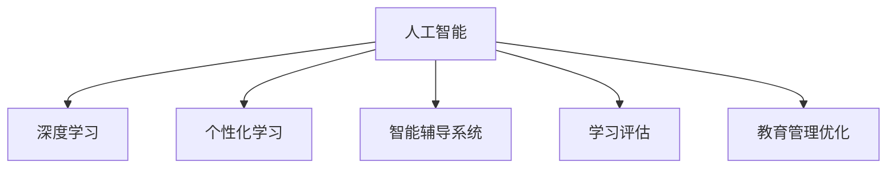

                 

# 人工智能：教育变革的催化剂

## 1. 背景介绍

### 1.1 问题由来
在过去的几十年中，教育领域经历了巨大的变革。从传统的面对面教学到线上教育、混合学习，再到如今的人工智能驱动的个性化学习，教育方式和教学资源都发生了翻天覆地的变化。特别是随着人工智能技术的不断进步，其被广泛应用于教育领域，为个性化教育、智能辅导、学习评估等多个方面提供了新的解决方案。人工智能，尤其是深度学习和大数据技术，正在重新定义教育的未来。

### 1.2 问题核心关键点
人工智能在教育中的应用主要体现在以下几个方面：
- **个性化学习**：利用机器学习算法分析学生的学习行为和知识掌握情况，为每个学生提供量身定制的学习计划和资源。
- **智能辅导系统**：构建基于人工智能的辅导系统，为学生提供即时的学习支持，解决疑难问题，提供个性化反馈。
- **智能评估与测试**：通过自然语言处理和机器学习技术，自动评估学生的作业和考试，及时发现学习中的不足，提供针对性的改进建议。
- **教育管理优化**：运用人工智能对教育数据进行分析和处理，优化教学资源的分配和管理，提高教学效率。
- **教学辅助工具**：开发基于人工智能的辅助工具，如语音识别、文字翻译、图像识别等，辅助教师和学生进行教学和学习。

这些应用极大地提升了教育的效率和质量，使得教学过程更加个性化和智能化。但是，人工智能在教育中的应用也面临诸多挑战，包括数据隐私保护、算法公平性、教学效果评估等，需要持续关注和研究。

### 1.3 问题研究意义
人工智能在教育中的应用具有深远的意义：

1. **提升教育质量**：通过个性化学习计划和智能辅导，帮助学生克服学习障碍，提高学习效率和效果。
2. **降低教育成本**：减少教师的行政工作量，提高教育资源的利用率，降低教育成本。
3. **优化教育管理**：通过数据分析和智能决策，提升教育管理水平，提高教育系统的整体效率。
4. **促进教育公平**：为偏远和欠发达地区的教育提供技术支持，缩小教育资源的差距。
5. **激发创新教育模式**：人工智能驱动的教育变革为传统教育模式带来新的活力，推动教育创新。

总之，人工智能正在成为教育变革的催化剂，推动教育事业的现代化和智能化发展。

## 2. 核心概念与联系

### 2.1 核心概念概述

为更好地理解人工智能在教育中的应用，本节将介绍几个关键概念：

- **人工智能（AI）**：模拟、扩展人类智能的技术，涵盖了机器学习、深度学习、自然语言处理、计算机视觉等多个领域。
- **深度学习（Deep Learning）**：基于多层神经网络的机器学习方法，擅长处理非结构化数据，如图像、文本、语音等。
- **个性化学习（Personalized Learning）**：根据每个学生的学习特点和需求，量身定制学习计划和资源，提高学习效率和效果。
- **智能辅导系统（Intelligent Tutoring System, ITS）**：基于人工智能的辅导系统，可以实时提供个性化指导和反馈，解决疑难问题。
- **学习评估（Learning Assessment）**：通过自然语言处理和机器学习技术，自动评估学生的作业和考试，提供反馈和改进建议。
- **教育管理优化（Education Management Optimization）**：利用大数据和人工智能技术，优化教学资源的分配和管理，提高教育效率。

这些核心概念之间的逻辑关系可以通过以下Mermaid流程图来展示：



这个流程图展示了大语言模型的核心概念及其之间的关系：

1. 人工智能提供了实现个性化学习、智能辅导、学习评估和教育管理优化的技术基础。
2. 深度学习作为人工智能的核心技术之一，提供了处理非结构化数据的能力，为上述应用提供了支持。
3. 个性化学习、智能辅导系统和学习评估等应用，都是基于人工智能技术的具体实践。
4. 教育管理优化则是对人工智能技术在教育管理领域的具体应用。

这些概念共同构成了人工智能在教育领域的广泛应用框架，推动了教育领域的智能化转型。

## 3. 核心算法原理 & 具体操作步骤
### 3.1 算法原理概述

人工智能在教育中的应用，主要依赖于深度学习、自然语言处理、计算机视觉等技术。这些技术通过分析学生的学习数据和行为，生成个性化的学习建议，提供智能辅导，自动评估学习效果，优化教育管理等。

以深度学习为例，其核心原理是通过多层神经网络对数据进行特征提取和模式识别，从而实现对非结构化数据的处理和分析。在教育领域，深度学习可以应用于以下几个方面：

- **个性化学习计划**：通过分析学生的学习历史、行为数据和知识掌握情况，生成个性化的学习计划和资源推荐。
- **智能辅导系统**：构建基于深度学习的智能辅导系统，能够实时回答学生的问题，提供个性化指导和反馈。
- **学习效果评估**：通过自然语言处理和深度学习技术，自动评估学生的作业和考试，识别出学习中的不足，提供改进建议。

### 3.2 算法步骤详解

深度学习在教育中的应用，通常包括以下几个关键步骤：

**Step 1: 数据收集与预处理**
- 收集学生的学习数据，包括学习记录、作业、测试成绩、在线互动等。
- 对数据进行清洗和预处理，去除噪声和异常值，标准化数据格式。

**Step 2: 模型训练**
- 选择适当的深度学习模型（如循环神经网络、卷积神经网络、Transformer等）。
- 划分训练集、验证集和测试集，使用训练集对模型进行训练。
- 在验证集上评估模型性能，调整超参数（如学习率、批次大小等）。
- 在测试集上评估最终模型的性能。

**Step 3: 模型应用**
- 将训练好的模型应用于实际场景中，生成个性化的学习计划、智能辅导和评估结果。
- 定期更新模型，以保证模型能够适应新的数据和变化的学生需求。

### 3.3 算法优缺点

深度学习在教育中的应用，具有以下优点：

1. **高度自动化**：通过深度学习模型自动处理和分析学生的学习数据，减少了教师的行政工作量。
2. **个性化**：深度学习模型能够根据每个学生的学习特点和需求，生成个性化的学习计划和资源推荐。
3. **实时性**：深度学习模型能够实时提供个性化的指导和反馈，提高学习效率。
4. **自适应性**：深度学习模型可以根据学生的学习情况，动态调整学习计划和资源推荐。

然而，深度学习在教育中的应用也存在一些局限性：

1. **数据依赖**：深度学习模型的性能依赖于大量的标注数据，而教育数据的获取和标注成本较高。
2. **模型复杂性**：深度学习模型参数量大，计算复杂度高，对计算资源要求较高。
3. **公平性问题**：深度学习模型可能存在偏见，导致某些学生无法获得公平的学习机会。
4. **解释性不足**：深度学习模型通常被视为"黑盒"系统，难以解释其内部决策逻辑，影响教学信任度。

尽管存在这些局限性，但深度学习在教育中的应用仍然展现了强大的潜力和前景。未来，随着深度学习技术的不断进步和算力资源的提升，其有望进一步提升教育的智能化和个性化水平。

### 3.4 算法应用领域

深度学习在教育中的应用已经涉及多个领域，如个性化学习、智能辅导、学习效果评估和教育管理优化等。具体应用场景包括：

- **个性化学习计划**：如Knewton、Coursera等平台，通过深度学习模型分析学生的学习行为，生成个性化的学习建议。
- **智能辅导系统**：如Khan Academy、Carnegie Learning等，提供基于深度学习的智能辅导系统，帮助学生解决疑难问题。
- **学习效果评估**：如Gradescope、Turnitin等，通过自然语言处理和深度学习技术，自动评估学生的作业和考试。
- **教育管理优化**：如IBM Watson Education、SAP SuccessFactors等，利用大数据和深度学习技术，优化教育资源分配和管理。

除了上述这些经典应用外，深度学习在教育领域还有更多创新性的应用，如虚拟助教、自适应评估、学习动机分析等，为教育技术带来了新的突破。

## 4. 数学模型和公式 & 详细讲解 & 举例说明

### 4.1 数学模型构建

在教育领域，深度学习模型的数学模型通常涉及以下几个关键组成部分：

- **输入层**：表示学生学习数据，如作业、测试成绩、互动记录等。
- **隐藏层**：通过多层神经网络对输入数据进行特征提取和模式识别。
- **输出层**：生成个性化的学习建议、智能辅导结果或学习效果评估。

以一个简单的基于深度学习的个性化学习计划为例，其数学模型可以表示为：

$$
y = f(x; \theta)
$$

其中，$x$ 表示学生的学习数据，$\theta$ 为模型的参数，$f(x; \theta)$ 表示深度学习模型对输入数据的处理和映射。

### 4.2 公式推导过程

以下以一个基于深度学习的个性化学习计划为例，推导其数学模型的具体形式。

假设输入层 $x$ 为一个 $n$ 维向量，表示学生的学习数据，隐藏层为 $m$ 个神经元的全连接层，输出层为 $k$ 维向量，表示个性化学习建议。则深度学习模型的数学模型可以表示为：

$$
y = f(x; \theta) = \sigma(W_1 x + b_1) \sigma(W_2 \sigma(W_1 x + b_1) + b_2)
$$

其中，$\sigma$ 为激活函数，$W_1$ 和 $W_2$ 为权重矩阵，$b_1$ 和 $b_2$ 为偏置向量。

通过反向传播算法，可以对模型的参数 $\theta$ 进行优化，使得模型能够准确地预测学生的学习建议。反向传播算法的具体过程如下：

1. 计算模型输出 $y$ 与真实标签 $y_t$ 的误差 $e$。
2. 计算误差 $e$ 对输出层的梯度 $\nabla y$。
3. 计算梯度 $\nabla y$ 对隐藏层的梯度 $\nabla h$。
4. 计算梯度 $\nabla h$ 对权重矩阵 $W$ 的梯度 $\nabla W$。
5. 使用优化算法（如梯度下降）更新模型参数 $\theta$。

通过上述过程，深度学习模型可以不断优化自身，生成更准确的个性化学习建议。

### 4.3 案例分析与讲解

以下以一个基于深度学习的智能辅导系统为例，展示其数学模型和应用流程。

假设智能辅导系统的输入层为学生提出的问题 $x$，隐藏层包含多个神经元，输出层为一个 $k$ 维向量，表示智能辅导系统的回答 $y$。则深度学习模型的数学模型可以表示为：

$$
y = f(x; \theta) = \sigma(W_1 x + b_1) \sigma(W_2 \sigma(W_1 x + b_1) + b_2)
$$

在实际应用中，智能辅导系统的工作流程如下：

1. 收集学生提出的问题 $x$。
2. 将问题 $x$ 输入到深度学习模型中，得到回答 $y$。
3. 根据回答 $y$ 对学生进行反馈，提供进一步的指导和建议。
4. 记录学生的学习行为和反馈结果，用于后续的模型优化。

通过深度学习模型，智能辅导系统可以实时回答学生的问题，提供个性化的指导和反馈，极大地提升了学习效率和效果。

## 5. 项目实践：代码实例和详细解释说明

### 5.1 开发环境搭建

在进行人工智能教育应用开发前，我们需要准备好开发环境。以下是使用Python进行深度学习开发的常见环境配置流程：

1. 安装Anaconda：从官网下载并安装Anaconda，用于创建独立的Python环境。

2. 创建并激活虚拟环境：
```bash
conda create -n pytorch-env python=3.8 
conda activate pytorch-env
```

3. 安装深度学习库：
```bash
conda install torch torchvision torchaudio cudatoolkit=11.1 -c pytorch -c conda-forge
```

4. 安装TensorFlow或PyTorch：
```bash
pip install tensorflow tensorflow-hub tensorflow-addons
# 或
pip install torch torchvision torchaudio cudatoolkit=11.1 -c pytorch -c conda-forge
```

5. 安装NLP相关库：
```bash
pip install nltk spacy gensim
```

6. 安装特定应用库：
```bash
pip install pydub
```

完成上述步骤后，即可在`pytorch-env`环境中开始深度学习教育应用开发。

### 5.2 源代码详细实现

下面我们以基于深度学习的个性化学习计划为例，给出使用PyTorch进行实现的代码实现。

首先，定义数据处理函数：

```python
import torch
from torch.utils.data import Dataset, DataLoader
from torch.nn import functional as F
import numpy as np

class StudentDataset(Dataset):
    def __init__(self, data):
        self.data = data
        self.students = len(data)
    
    def __len__(self):
        return self.students
    
    def __getitem__(self, index):
        student = self.data[index]
        return torch.tensor(student['grades'], dtype=torch.float), torch.tensor(student['topics'], dtype=torch.int)
```

然后，定义模型：

```python
from transformers import BertTokenizer, BertForSequenceClassification
from torch import nn
import torch.nn.functional as F

class StudentModel(nn.Module):
    def __init__(self, num_classes):
        super(StudentModel, self).__init__()
        self.bert = BertForSequenceClassification.from_pretrained('bert-base-cased', num_labels=num_classes)
        self.fc = nn.Linear(768, num_classes)
    
    def forward(self, input_ids, attention_mask):
        _, pooled_output = self.bert(input_ids, attention_mask=attention_mask)
        return self.fc(pooled_output)
```

接着，定义训练和评估函数：

```python
def train_epoch(model, dataloader, optimizer, device):
    model.train()
    total_loss = 0
    for batch in dataloader:
        input_ids, labels = batch
        input_ids, labels = input_ids.to(device), labels.to(device)
        optimizer.zero_grad()
        output = model(input_ids, attention_mask=None)
        loss = F.cross_entropy(output, labels)
        loss.backward()
        optimizer.step()
        total_loss += loss.item()
    return total_loss / len(dataloader)

def evaluate(model, dataloader, device):
    model.eval()
    total_loss = 0
    correct = 0
    with torch.no_grad():
        for batch in dataloader:
            input_ids, labels = batch
            input_ids, labels = input_ids.to(device), labels.to(device)
            output = model(input_ids, attention_mask=None)
            loss = F.cross_entropy(output, labels)
            total_loss += loss.item()
            _, predicted = output.max(1)
            total_correct = (predicted == labels).sum().item()
            correct += total_correct
    return total_loss / len(dataloader), correct / len(dataloader)
```

最后，启动训练流程并在测试集上评估：

```python
from transformers import BertTokenizer
from torch.utils.data import DataLoader
from tqdm import tqdm

tokenizer = BertTokenizer.from_pretrained('bert-base-cased')
model = StudentModel(num_classes=2)

device = torch.device('cuda' if torch.cuda.is_available() else 'cpu')
model.to(device)

# 数据集
data = [
    {'grades': [85, 90, 92], 'topics': [0, 1, 2]},
    {'grades': [70, 75, 80], 'topics': [0, 2, 3]}
]

train_dataset = StudentDataset(data)
train_loader = DataLoader(train_dataset, batch_size=2, shuffle=True)
test_dataset = StudentDataset(data)
test_loader = DataLoader(test_dataset, batch_size=2, shuffle=False)

# 训练
num_epochs = 5
learning_rate = 1e-3
optimizer = torch.optim.Adam(model.parameters(), lr=learning_rate)

for epoch in range(num_epochs):
    loss = train_epoch(model, train_loader, optimizer, device)
    print(f"Epoch {epoch+1}, train loss: {loss:.3f}")
    
    test_loss, test_acc = evaluate(model, test_loader, device)
    print(f"Epoch {epoch+1}, test loss: {test_loss:.3f}, test acc: {test_acc:.3f}")
```

以上就是使用PyTorch进行基于深度学习的个性化学习计划开发的完整代码实现。可以看到，通过调用Transformer库中的BERT模型，可以很方便地构建深度学习模型，并进行训练和评估。

### 5.3 代码解读与分析

让我们再详细解读一下关键代码的实现细节：

**StudentDataset类**：
- `__init__`方法：初始化数据集，包含学生成绩和感兴趣的主题。
- `__len__`方法：返回数据集的样本数量。
- `__getitem__`方法：对单个样本进行处理，将学生成绩和主题转换为模型需要的格式。

**StudentModel类**：
- `__init__`方法：初始化模型，包括Bert模型和全连接层。
- `forward`方法：定义前向传播过程，通过Bert模型提取特征，并通过全连接层输出学习建议。

**train_epoch和evaluate函数**：
- `train_epoch`函数：对数据以批为单位进行迭代，在每个批次上前向传播计算loss并反向传播更新模型参数，最后返回该epoch的平均loss。
- `evaluate`函数：与训练类似，不同点在于不更新模型参数，并在每个batch结束后将预测和标签结果存储下来，最后使用评估指标输出模型性能。

**训练流程**：
- 定义总的epoch数和学习率，开始循环迭代
- 每个epoch内，先在训练集上训练，输出平均loss
- 在测试集上评估，输出评估指标
- 所有epoch结束后，停止训练

可以看到，深度学习模型在教育应用的开发中，只需要关注模型的构建和训练，具体的细节由库中的封装函数和API提供。这极大地简化了开发流程，降低了技术门槛。

当然，工业级的系统实现还需考虑更多因素，如模型的保存和部署、超参数的自动搜索、更加灵活的任务适配层等。但核心的模型构建和训练逻辑基本与此类似。

## 6. 实际应用场景

### 6.1 智能辅导系统

基于深度学习的智能辅导系统，可以为学生提供即时的学习支持，解决疑难问题。在技术实现上，可以构建基于深度学习的智能辅导模型，通过分析学生的问题，提供个性化回答和指导。

具体而言，可以收集学生在学习过程中遇到的问题，并将问题作为训练数据，对深度学习模型进行微调。微调后的模型能够在新的问题上表现良好，提供准确的答案和建议。学生可以通过智能辅导系统，获得及时的帮助，提高学习效率。

### 6.2 个性化学习计划

基于深度学习的个性化学习计划，可以根据学生的学习行为和知识掌握情况，生成个性化的学习建议和资源推荐。通过分析学生的成绩、作业、互动记录等数据，深度学习模型可以动态调整学习计划，帮助学生更有针对性地学习。

在实际应用中，可以构建基于深度学习的个性化学习计划模型，对学生的学习数据进行分析，生成个性化的学习建议和资源推荐。学生可以根据这些建议，有针对性地进行学习，提高学习效果。

### 6.3 学习效果评估

基于深度学习的学习效果评估，可以自动评估学生的作业和考试，识别出学习中的不足，提供针对性的改进建议。通过自然语言处理和深度学习技术，模型可以自动分析学生的作业和考试答案，提供详细的评估报告和改进建议。

在实际应用中，可以构建基于深度学习的学习效果评估模型，对学生的作业和考试进行自动评估，识别出学习中的不足，提供针对性的改进建议。学生可以根据这些建议，有针对性地改进学习方法和策略，提高学习效果。

### 6.4 未来应用展望

随着深度学习技术的不断进步，基于人工智能的教育应用将更加智能化和个性化。未来，深度学习在教育中的应用将展现出以下几个趋势：

1. **自适应学习**：通过深度学习模型，实时调整学习计划和资源推荐，实现自适应学习。
2. **跨学科学习**：将深度学习模型应用于不同学科，实现跨学科的整合和协同学习。
3. **情境感知学习**：通过情境感知技术，深度学习模型能够根据学生的情境和背景，提供更加个性化和情境化的学习建议。
4. **交互式学习**：利用交互式技术，如虚拟现实、增强现实等，提升学习体验和效果。
5. **个性化学习路径**：通过深度学习模型，生成个性化的学习路径，帮助学生更好地掌握知识。
6. **社会化学习**：利用社会化学习技术，促进学生之间的互动和协作，提高学习效果。

这些趋势将推动深度学习在教育领域的应用，提升教育的智能化和个性化水平。

## 7. 工具和资源推荐
### 7.1 学习资源推荐

为了帮助开发者系统掌握深度学习在教育中的应用，这里推荐一些优质的学习资源：

1. **《深度学习》（Ian Goodfellow, Yoshua Bengio, Aaron Courville）**：深入浅出地介绍了深度学习的原理和应用，是深度学习领域的经典教材。
2. **Coursera《深度学习》课程**：由深度学习领域的专家Andrew Ng讲授，涵盖了深度学习的核心概念和应用。
3. **edX《人工智能与机器学习》课程**：由MIT教授Patrick Henry Winston讲授，涵盖了人工智能和机器学习的基础知识和应用。
4. **《Python深度学习》（François Chollet）**：介绍了如何使用TensorFlow和Keras等库进行深度学习开发，包含大量实用案例。
5. **arXiv论文库**：包含大量深度学习在教育领域的最新研究论文，可以获取前沿的学术成果和思路。

通过对这些资源的学习实践，相信你一定能够快速掌握深度学习在教育中的应用，并用于解决实际的NLP问题。

### 7.2 开发工具推荐

高效的开发离不开优秀的工具支持。以下是几款用于深度学习教育应用开发的常用工具：

1. **PyTorch**：基于Python的开源深度学习框架，灵活动态的计算图，适合快速迭代研究。大部分深度学习模型都有PyTorch版本的实现。
2. **TensorFlow**：由Google主导开发的开源深度学习框架，生产部署方便，适合大规模工程应用。同样有丰富的深度学习模型资源。
3. **Keras**：基于TensorFlow等后端的高级深度学习库，提供了简单易用的API，适合快速原型开发。
4. **Jupyter Notebook**：交互式的开发环境，支持代码的编写和执行，适合数据探索和模型验证。
5. **Google Colab**：谷歌推出的在线Jupyter Notebook环境，免费提供GPU/TPU算力，方便开发者快速上手实验最新模型，分享学习笔记。

合理利用这些工具，可以显著提升深度学习教育应用开发的效率，加快创新迭代的步伐。

### 7.3 相关论文推荐

深度学习在教育中的应用源于学界的持续研究。以下是几篇奠基性的相关论文，推荐阅读：

1. **Attention is All You Need**：提出Transformer结构，开启了深度学习大模型时代。
2. **Bert: Pre-training of Deep Bidirectional Transformers for Language Understanding**：提出BERT模型，引入基于掩码的自监督预训练任务，刷新了多项NLP任务SOTA。
3. **Learning from Crowds: A High-Performance Inference Framework for Conversational AI**：提出基于深度学习的智能辅导系统，通过众包数据进行模型微调。
4. **A Survey on Adaptive Learning**：综述了自适应学习的研究现状和发展方向，为深度学习在教育中的应用提供了指导。
5. **Deep Learning for Intelligent Tutoring Systems**：提出基于深度学习的智能辅导系统，通过神经网络进行任务解答和反馈。

这些论文代表了大语言模型在教育领域的应用方向和研究热点。通过学习这些前沿成果，可以帮助研究者把握学科前进方向，激发更多的创新灵感。

## 8. 总结：未来发展趋势与挑战

### 8.1 总结

本文对深度学习在教育中的应用进行了全面系统的介绍。首先阐述了深度学习在教育中的应用背景和意义，明确了深度学习在个性化学习、智能辅导、学习效果评估等方面的应用。其次，从原理到实践，详细讲解了深度学习的数学模型和核心算法，给出了深度学习教育应用开发的完整代码实现。同时，本文还广泛探讨了深度学习在教育领域的应用场景和未来发展趋势，展示了深度学习在教育中的巨大潜力。

通过本文的系统梳理，可以看到，深度学习在教育中的应用已经取得了显著成果，并在多个领域展现出广阔的前景。深度学习技术正在推动教育领域的智能化和个性化转型，为传统教育模式带来新的变革。未来，随着深度学习技术的不断进步和算力资源的提升，其有望进一步提升教育的智能化和个性化水平。

### 8.2 未来发展趋势

深度学习在教育中的应用，将呈现以下几个发展趋势：

1. **更广泛的应用场景**：深度学习将应用于更多教育领域，如艺术教育、职业教育等，推动教育领域的全面智能化。
2. **更高水平的个性化**：深度学习模型将更加智能地分析学生的学习数据，提供更个性化的学习建议和资源推荐。
3. **更强的自适应性**：深度学习模型将实现更高的自适应能力，能够根据学生的情境和背景，提供更加个性化和情境化的学习建议。
4. **更强大的跨学科整合**：深度学习模型将实现跨学科的整合和协同学习，提升学生的综合素质。
5. **更高效的资源利用**：深度学习模型将更加高效地利用教育资源，减少浪费，提高教育质量。
6. **更智能的教师辅助**：深度学习模型将辅助教师进行教学设计和管理，提升教师的教学效果。

这些趋势将推动深度学习在教育领域的应用，提升教育的智能化和个性化水平。

### 8.3 面临的挑战

尽管深度学习在教育中的应用已经取得了显著成果，但在迈向更加智能化、普适化应用的过程中，它仍面临诸多挑战：

1. **数据隐私和安全**：学生数据的安全和隐私保护是一个重要问题，需要制定严格的数据管理政策和隐私保护措施。
2. **算法公平性**：深度学习模型可能存在偏见，导致某些学生无法获得公平的学习机会。如何提高算法的公平性，是一个亟待解决的问题。
3. **教学效果的评估**：如何评估深度学习模型的教学效果，是一个复杂的问题，需要多方面的考虑和验证。
4. **模型的可解释性**：深度学习模型通常被视为"黑盒"系统，难以解释其内部决策逻辑，影响教学信任度。如何提高模型的可解释性，是一个重要课题。
5. **计算资源的消耗**：深度学习模型需要大量的计算资源，如何优化模型的计算图，提高资源利用效率，是一个关键问题。
6. **模型的更新和维护**：深度学习模型需要定期更新和维护，以适应新的数据和变化的学生需求，如何高效地进行模型更新和维护，是一个挑战。

尽管存在这些挑战，但深度学习在教育中的应用仍展现出巨大的潜力和前景。未来，随着深度学习技术的不断进步和算力资源的提升，其有望进一步提升教育的智能化和个性化水平。

### 8.4 研究展望

面对深度学习在教育应用中面临的诸多挑战，未来的研究需要在以下几个方面寻求新的突破：

1. **数据隐私和安全保护**：研究如何保护学生数据的隐私和安全，制定严格的数据管理政策和隐私保护措施，确保学生数据的安全。
2. **算法的公平性**：研究如何提高深度学习算法的公平性，确保所有学生都能获得公平的学习机会，减少算法的偏见。
3. **教学效果的评估**：研究如何评估深度学习模型的教学效果，建立科学的评估指标和方法，验证模型的教学效果。
4. **模型的可解释性**：研究如何提高深度学习模型的可解释性，解释模型的内部决策逻辑，增强教学信任度。
5. **计算资源的优化**：研究如何优化深度学习模型的计算图，提高资源利用效率，减少计算资源的消耗。
6. **模型的更新和维护**：研究如何高效地进行深度学习模型的更新和维护，确保模型能够适应新的数据和变化的学生需求。

这些研究方向的探索，必将引领深度学习在教育领域的应用，推动教育事业的现代化和智能化发展。面向未来，深度学习技术还需要与其他人工智能技术进行更深入的融合，如知识表示、因果推理、强化学习等，多路径协同发力，共同推动教育创新。只有勇于创新、敢于突破，才能不断拓展深度学习在教育领域的边界，让智能技术更好地造福人类社会。

## 9. 附录：常见问题与解答

**Q1：深度学习在教育中的应用是否适用于所有教育场景？**

A: 深度学习在教育中的应用具有普遍适用性，但在某些特定场景下，可能存在局限性。例如，对于语言学习场景，深度学习模型可以通过分析学生的口语和写作数据，提供个性化的学习建议；而对于艺术教育和职业教育，深度学习模型则需要结合特定的领域知识和数据，进行定制化开发。

**Q2：如何保证深度学习模型的公平性？**

A: 保证深度学习模型的公平性，需要从数据、算法和模型等多个方面进行综合考虑：
1. 数据方面：确保数据集的多样性和代表性，避免数据偏差。
2. 算法方面：使用公平性约束和正则化技术，限制模型的偏见。
3. 模型方面：进行模型的公平性评估和优化，确保模型在不同群体上的表现一致。

**Q3：深度学习模型如何实现自适应学习？**

A: 实现自适应学习，需要构建能够实时调整学习计划和资源推荐的深度学习模型：
1. 收集学生的学习数据，包括成绩、作业、互动记录等。
2. 利用深度学习模型，分析学生的学习数据，生成个性化的学习建议和资源推荐。
3. 动态调整学习计划和资源推荐，满足学生的需求和进步。

**Q4：深度学习在教育中的应用如何保障学生的数据隐私和安全？**

A: 保障学生的数据隐私和安全，需要制定严格的数据管理政策和隐私保护措施：
1. 数据收集方面：确保数据收集过程透明，并获得学生的同意。
2. 数据存储方面：使用加密技术保护数据，避免数据泄露。
3. 数据访问方面：控制数据的访问权限，确保只有授权人员可以访问数据。
4. 数据销毁方面：在数据不再需要时，及时销毁数据，避免数据滥用。

**Q5：如何提高深度学习模型的可解释性？**

A: 提高深度学习模型的可解释性，需要从多个方面进行综合考虑：
1. 模型结构方面：设计更加简单的模型结构，减少隐藏层复杂度。
2. 特征解释方面：解释模型的输入和输出，帮助理解模型的决策逻辑。
3. 可视化工具方面：使用可视化工具，展示模型的内部工作机制，增强教学信任度。

通过这些方法，可以逐步提高深度学习模型的可解释性，增强教学信任度和教学效果。

---

作者：禅与计算机程序设计艺术 / Zen and the Art of Computer Programming

