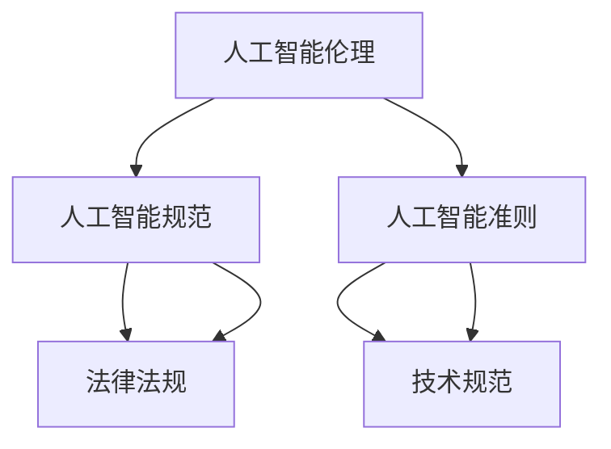

                 

# 人机协作：伦理 规范与准则

> 关键词：人机协作, 人工智能伦理, 人工智能规范, 人工智能准则, 智能决策, 算法透明性, 数据隐私, 算法可解释性, 责任归属

## 1. 背景介绍

随着人工智能技术的迅猛发展，人机协作已经成为现代社会的重要组成部分。然而，在这一过程中，伴随着一系列的伦理、规范和准则问题，这些问题不仅关系到技术的应用前景，更关乎社会的公平正义与人的尊严。本文将从人机协作的角度，探讨人工智能伦理、规范与准则的现状、挑战及未来方向。

## 2. 核心概念与联系

### 2.1 核心概念概述

人机协作是指人类与人工智能系统通过共同工作来实现目标的一种合作模式。在理想情况下，人机协作应该能够提升工作效率、增强决策质量、改善用户体验，同时保证数据隐私、伦理安全等。

人工智能伦理、规范与准则是人机协作中的重要组成部分，旨在引导和规范人工智能技术的应用和发展。伦理问题主要关注人工智能系统是否符合人类的道德和价值观；规范问题则涉及人工智能在法律、政策层面的限制和指导；准则问题更多地关注于技术层面，如算法透明性、可解释性、公平性等。

通过以下Mermaid流程图，我们可以更直观地理解这些概念之间的联系：



## 3. 核心算法原理 & 具体操作步骤

### 3.1 算法原理概述

人机协作中的人工智能系统，通常依赖于机器学习模型，特别是深度学习模型。这些模型通过大量的数据进行训练，学习数据中的规律和特征，然后对新数据进行预测和推理。在这个过程中，算法的透明性、公平性和可解释性是核心原则。

### 3.2 算法步骤详解

人机协作中的算法步骤通常包括以下几个关键环节：

1. **数据收集与预处理**：收集与任务相关的数据，并对数据进行清洗、标注等预处理。
2. **模型训练**：利用预处理后的数据，训练机器学习模型。
3. **模型评估**：在验证集上评估模型性能，选择合适的超参数。
4. **模型应用**：将训练好的模型应用到实际任务中，进行推理和预测。

### 3.3 算法优缺点

- **优点**：
  - **高效性**：深度学习模型能够在处理大规模数据时展示出显著的优势。
  - **普适性**：人工智能技术可以在各种场景下应用，提升工作效率和决策质量。
  - **可扩展性**：基于深度学习的模型可以方便地进行迁移学习，应用到不同领域。

- **缺点**：
  - **不透明性**：深度学习模型常常被视为"黑箱"，难以解释其内部决策过程。
  - **公平性问题**：模型可能存在偏见，导致某些群体的公平性受损。
  - **隐私问题**：数据隐私和安全成为一大挑战，特别是敏感数据的保护。

### 3.4 算法应用领域

人机协作的算法在多个领域得到了广泛应用，包括但不限于：

- **医疗**：利用人工智能进行疾病诊断、治疗方案推荐等。
- **金融**：应用于风险评估、欺诈检测、投资分析等。
- **教育**：提供个性化学习推荐、智能辅导等。
- **制造**：优化生产流程、预测设备故障等。
- **交通**：交通流量预测、自动驾驶等。

## 4. 数学模型和公式 & 详细讲解 & 举例说明

### 4.1 数学模型构建

在人机协作中，常用的数学模型包括线性回归、决策树、支持向量机、神经网络等。这里以线性回归模型为例，进行详细讲解。

假设有一个线性回归模型：
$$
y = w_1x_1 + w_2x_2 + ... + w_nx_n + b
$$
其中 $x_1, x_2, ..., x_n$ 是输入特征，$w_1, w_2, ..., w_n$ 是权重，$b$ 是偏置，$y$ 是输出。

### 4.2 公式推导过程

在线性回归中，模型的目标是最小化损失函数 $L$：
$$
L = \frac{1}{2N}\sum_{i=1}^{N}(y_i - \hat{y}_i)^2
$$
其中 $\hat{y}_i$ 是模型预测的值。

通过梯度下降算法，我们可以求解最优的权重和偏置，即：
$$
w_j = w_j - \frac{\alpha}{N}\sum_{i=1}^{N}(x_{ij} - \overline{x_j})(y_i - \hat{y}_i), j=1,2,...,n
$$
$$
b = b - \frac{\alpha}{N}\sum_{i=1}^{N}(y_i - \hat{y}_i)
$$
其中 $\alpha$ 是学习率。

### 4.3 案例分析与讲解

以医疗诊断为例，我们可以使用线性回归模型预测患者的患病概率。将患者的年龄、性别、家族病史等特征作为输入，使用逻辑回归（一种特殊形式的线性回归）进行建模。模型通过大量的患者数据进行训练，学习到各特征与患病概率之间的关系，然后对新患者的数据进行预测，输出患病概率。

## 5. 项目实践：代码实例和详细解释说明

### 5.1 开发环境搭建

为了快速进行线性回归模型的开发和验证，我们可以使用Python的Scikit-learn库。首先需要安装Scikit-learn库，可以通过以下命令进行安装：

```bash
pip install scikit-learn
```

然后，可以创建一个Python脚本，用于数据处理、模型训练和评估。

### 5.2 源代码详细实现

以下是一个简单的Python脚本，用于加载数据、训练线性回归模型并进行评估：

```python
from sklearn.linear_model import LinearRegression
from sklearn.datasets import load_boston
from sklearn.model_selection import train_test_split
from sklearn.metrics import mean_squared_error
import numpy as np

# 加载数据
boston = load_boston()
X = boston.data
y = boston.target

# 数据集划分
X_train, X_test, y_train, y_test = train_test_split(X, y, test_size=0.3, random_state=42)

# 训练模型
model = LinearRegression()
model.fit(X_train, y_train)

# 预测并评估
y_pred = model.predict(X_test)
mse = mean_squared_error(y_test, y_pred)
print(f"MSE: {mse}")
```

### 5.3 代码解读与分析

在这个简单的脚本中，我们首先导入了必要的库，包括线性回归模型、波士顿房价数据集、模型评估工具等。然后，我们加载了波士顿房价数据集，并将其划分为训练集和测试集。接着，我们使用线性回归模型进行训练，并在测试集上进行了评估。

## 6. 实际应用场景

### 6.1 医疗诊断

在医疗诊断中，人工智能系统可以通过分析患者的症状、体检数据等，预测患者是否患有某种疾病。通过大量的病例数据进行训练，模型可以学习到疾病的特征和规律，帮助医生进行更准确的诊断。

### 6.2 金融风险评估

金融机构可以利用人工智能系统对客户的信用风险进行评估，通过分析客户的财务记录、社交媒体行为等数据，预测客户的还款能力和违约风险。

### 6.3 智能推荐系统

电商和流媒体平台可以利用人工智能系统进行个性化推荐，通过分析用户的浏览、购买、观看行为等数据，推荐用户可能感兴趣的商品或内容。

### 6.4 未来应用展望

未来，人机协作的应用场景将更加广泛，人工智能系统将在更多的领域发挥作用。随着技术的进步，人工智能系统的透明性、公平性和可解释性也将得到提升，能够更好地服务于人类社会。

## 7. 工具和资源推荐

### 7.1 学习资源推荐

- 《深度学习》（Ian Goodfellow、Yoshua Bengio 和 Aaron Courville著）：全面介绍了深度学习的基本概念和算法。
- Coursera上的《机器学习》课程（由Andrew Ng主讲）：系统讲解了机器学习的基本原理和应用。
- Kaggle网站：提供大量数据集和竞赛，实践数据科学和机器学习的技能。

### 7.2 开发工具推荐

- Python编程语言：具有丰富的库和工具，适合机器学习开发。
- Jupyter Notebook：用于编写和分享数据科学和机器学习代码。
- PyTorch和TensorFlow：常用的深度学习框架，支持分布式训练和模型部署。

### 7.3 相关论文推荐

- 《深度学习》（Ian Goodfellow、Yoshua Bengio 和 Aaron Courville著）：系统介绍了深度学习的基本概念和算法。
- 《人工智能伦理》（Ian Goodfellow、Yoshua Bengio 和 Aaron Courville著）：探讨了人工智能的伦理问题。
- 《人工智能规范》（Ian Goodfellow、Yoshua Bengio 和 Aaron Courville著）：探讨了人工智能在法律、政策层面的规范问题。

## 8. 总结：未来发展趋势与挑战

### 8.1 研究成果总结

人工智能技术的快速发展，为人机协作带来了新的机遇和挑战。通过深入研究和实践，我们有望实现更加透明、公平和可解释的人工智能系统，服务于社会的发展和进步。

### 8.2 未来发展趋势

未来，人工智能技术将在更多的领域得到应用，人机协作模式将变得更加多样化和复杂化。人工智能系统的透明性、公平性和可解释性将成为技术发展的重点，同时也将需要更多的法律法规和伦理规范进行指导。

### 8.3 面临的挑战

人机协作面临的挑战包括数据隐私、算法偏见、责任归属等问题。为了应对这些挑战，需要在技术、政策、伦理等多个层面进行全面考虑和改进。

### 8.4 研究展望

未来，人机协作的研究将更加注重伦理、规范与准则的探讨，以确保技术的发展能够造福人类。同时，也将更多地关注人工智能系统的透明性、公平性和可解释性，推动技术的可持续发展和广泛应用。

## 9. 附录：常见问题与解答

### Q1：人工智能系统是否会取代人类？

A：人工智能系统可以在某些任务上超越人类，但在创造性、情感、道德判断等人类独有的领域，人工智能系统仍然无法替代人类。因此，人机协作将是未来发展的最佳模式。

### Q2：人工智能系统的决策是否透明？

A：目前，深度学习模型的决策过程通常是不透明的，被称为"黑箱"。为了提升模型的透明性，研究人员正在开发可解释性强的模型，如LIME、SHAP等。

### Q3：人工智能系统的公平性如何保障？

A：人工智能系统的公平性可以通过数据清洗、算法优化、结果解释等手段进行保障。同时，需要引入伦理审查机制，确保系统的公平性符合人类价值观。

### Q4：人工智能系统的责任归属问题如何解决？

A：人工智能系统的责任归属问题需要通过法律法规和伦理规范进行明确。在出现事故或纠纷时，应根据系统的设计、使用情况等进行合理的责任认定。

### Q5：人工智能系统如何应对数据隐私问题？

A：人工智能系统可以通过数据匿名化、加密等技术手段保护用户隐私。同时，需要制定相关的法律法规，确保数据使用的合规性和透明性。

---

作者：禅与计算机程序设计艺术 / Zen and the Art of Computer Programming

