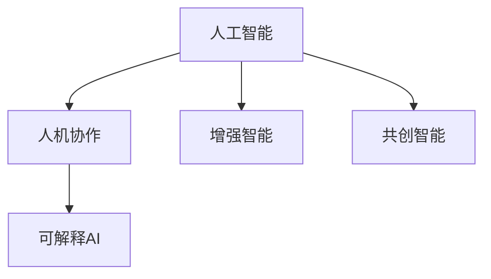

                 

# 人机协作：通向未来的智能之路

## 1. 背景介绍

在快速发展的科技时代，人类正迎来人机协作的黄金时期。这一时期，人工智能（AI）技术的飞速发展为各行各业带来了前所未有的变革与机遇。然而，在追求人工智能技术高度的同时，我们也不应忽视其对人类的深远影响。人机协作不仅关乎技术突破，更关乎伦理、道德与可持续发展。

### 1.1 问题由来

随着人工智能技术的迅猛发展，我们发现越来越多的领域开始运用AI来解决复杂的现实问题。无论是智能医疗、自动驾驶、金融风险预测，还是自动化生产，AI的引入正在逐步改变我们工作与生活的方方面面。然而，与这些技术突破相伴随的是对人类社会深层次影响的担忧。例如，自动化可能会导致部分工作岗位消失，算法决策的透明度与可解释性问题引发伦理争议，AI在医疗、法律等领域的应用也引起了数据隐私与安全性的担忧。

面对这些挑战，如何让人工智能与人类社会和谐共存，实现技术与伦理的平衡，成为全社会关注的焦点。人机协作，即通过优化人与AI的互动方式，充分挖掘AI的潜力，同时避免其潜在的风险，为实现未来的智能之路提供了新的方向。

### 1.2 问题核心关键点

人机协作的核心在于如何构建智能系统，使其既能发挥AI的优势，又能弥补人类智慧的不足。这包括但不限于以下几个关键点：

- **智能系统的设计原则**：如何设计智能系统，使其既具备高效处理数据的能力，又能够理解并尊重人类的伦理价值观。
- **人机交互方式**：通过何种方式实现人机高效沟通，例如自然语言处理、交互式界面、情境感知等。
- **AI的透明度与可解释性**：如何构建AI系统的透明度，使其决策过程可以被理解、审查和解释。
- **数据隐私与安全**：如何在保障数据隐私的前提下，安全地利用数据进行AI训练与决策。
- **伦理与道德考量**：如何在设计AI系统时，充分考虑其对社会的潜在影响，避免歧视、偏见等伦理问题。

## 2. 核心概念与联系

### 2.1 核心概念概述

为了更好地理解人机协作的原理，我们将介绍几个核心概念：

- **人工智能（AI）**：旨在使计算机系统具备人类智能的一种技术，包括学习、推理、感知、自然语言处理等。
- **人机协作（Human-AI Collaboration）**：通过优化人与AI的互动方式，使AI发挥其长处，同时弥补人类智慧的不足。
- **增强智能（Augmented Intelligence）**：利用AI技术增强人类智慧，使人能更好地处理复杂任务。
- **共创智能（Co-Creation Intelligence）**：AI与人共同参与任务创建，利用各自优势协同工作。
- **可解释AI（Explainable AI, XAI）**：使得AI系统的决策过程可被理解和解释，增强其透明度与信任度。

这些概念共同构成了人机协作的理论基础，指导我们设计和优化智能系统。

### 2.2 核心概念原理和架构的 Mermaid 流程图



该流程图展示了人工智能与人机协作之间的关系，以及增强智能与共创智能在人机协作中的作用。同时，可解释AI作为确保智能系统透明度的关键环节，对人机协作的信任与普及至关重要。

## 3. 核心算法原理 & 具体操作步骤

### 3.1 算法原理概述

人机协作的核心算法原理主要围绕如何设计高效、透明的智能系统，以及如何实现人机互动的优化。以下是几个关键点：

- **强化学习（Reinforcement Learning, RL）**：通过试错，智能系统逐步学习最优决策策略。
- **迁移学习（Transfer Learning）**：将一个领域学习到的知识迁移到另一个领域，以降低新领域的学习成本。
- **对抗学习（Adversarial Learning）**：通过设计对抗样本，提升系统的鲁棒性和泛化能力。
- **生成对抗网络（Generative Adversarial Networks, GANs）**：通过两个网络的竞争，生成高质量的数据样本。
- **协同过滤（Collaborative Filtering）**：通过分析用户行为，推荐系统为用户推荐个性化的内容。

### 3.2 算法步骤详解

人机协作的具体操作步骤通常包括以下几个步骤：

1. **数据准备**：收集相关领域的标注数据，包括文本、图像、音频等，用于训练AI模型。

2. **模型选择与训练**：选择适合的AI模型，如深度学习、强化学习、迁移学习等，在收集的数据上进行训练，优化模型参数，使其具备特定的智能任务能力。

3. **人机交互设计**：设计人机交互界面，使用自然语言处理（NLP）、语音识别、图像识别等技术，使人类能与AI系统高效互动。

4. **系统集成与优化**：将训练好的AI模型集成到实际应用中，进行性能测试与优化。

5. **透明性与解释性增强**：通过增加日志记录、可视化界面等方式，提升系统的透明度，使其决策过程可解释。

6. **伦理与社会考量**：在设计系统时充分考虑伦理与社会影响，确保系统行为的公正、透明和责任明确。

### 3.3 算法优缺点

人机协作的算法具有以下优点：

- **高效处理复杂任务**：AI在处理大规模、高复杂性任务时，往往比人类更高效。
- **快速迭代与优化**：通过自动化学习与优化，AI系统可以快速适应新情况，实现快速迭代。
- **广泛应用场景**：人机协作可在医疗、金融、教育、制造等多个领域中广泛应用。

同时，也存在以下缺点：

- **数据依赖性**：AI系统的性能很大程度上依赖于数据的质量与数量，数据缺失或不平衡可能导致模型性能下降。
- **可解释性不足**：许多AI模型，特别是深度学习模型，其决策过程缺乏透明度，难以被理解和解释。
- **伦理风险**：AI系统的决策可能存在偏见、歧视等问题，引发伦理争议。
- **系统依赖性**：高度依赖技术设备，一旦出现故障，可能对系统运行造成严重影响。

### 3.4 算法应用领域

人机协作技术已在多个领域得到应用，以下是几个典型例子：

- **医疗领域**：AI辅助诊断、智能问诊、药物研发等。
- **金融领域**：风险评估、欺诈检测、投资建议等。
- **制造领域**：质量控制、工艺优化、供应链管理等。
- **教育领域**：个性化学习推荐、智能辅导、作业批改等。
- **公共安全**：智能监控、异常检测、舆情分析等。

## 4. 数学模型和公式 & 详细讲解 & 举例说明

### 4.1 数学模型构建

人机协作的数学模型通常基于统计学、优化理论与机器学习。以下是一个简单的线性回归模型，用于描述AI与人类在协作过程中的关系：

$$
y = \theta_0 + \theta_1 x_1 + \theta_2 x_2 + \epsilon
$$

其中 $y$ 表示预测结果，$\theta_0$ 是截距，$\theta_1$ 和 $\theta_2$ 是模型的系数，$x_1$ 和 $x_2$ 是输入特征，$\epsilon$ 是误差项。该模型表示AI系统通过学习输入特征，预测输出结果，与人类协作共同完成任务。

### 4.2 公式推导过程

我们以线性回归为例，推导其公式推导过程。

- **最小二乘法**：通过最小化误差平方和，求解最优参数 $\theta$。
- **正则化**：为避免过拟合，引入L2正则项 $\frac{\lambda}{2} \sum \theta_i^2$。
- **随机梯度下降（SGD）**：通过梯度下降算法更新参数 $\theta$，最小化损失函数 $J(\theta)$。

$$
\hat{\theta} = \arg\min_{\theta} \frac{1}{2n} \sum_{i=1}^{n} (y_i - (\theta_0 + \theta_1 x_{i1} + \theta_2 x_{i2}))^2 + \frac{\lambda}{2} \sum_{j=1}^{p} \theta_j^2
$$

其中 $n$ 是样本数量，$p$ 是模型参数数量。

### 4.3 案例分析与讲解

在医疗领域，智能辅助诊断系统利用机器学习算法，分析患者的症状、检查结果等数据，辅助医生做出诊断。例如，使用决策树、支持向量机（SVM）等模型，通过学习历史病例，预测当前病人的疾病类型。同时，通过自然语言处理（NLP）技术，系统可以理解医生的问诊记录，提出可能的诊断建议。

## 5. 项目实践：代码实例和详细解释说明

### 5.1 开发环境搭建

在实践中，开发人机协作系统需要搭建一个包含AI模型、数据集、应用界面的开发环境。以下是基本的开发环境搭建步骤：

1. **环境安装**：安装Python、PyTorch、TensorFlow、Flask等开发工具，配置好编译器和依赖包。
2. **数据集准备**：收集并预处理相关领域的标注数据，存储在本地或云端。
3. **模型训练**：使用Python编写训练脚本，调用训练函数，如`torch.nn.Linear`、`tensorflow.keras.Model`等，训练AI模型。
4. **接口设计**：设计人机交互界面，使用Flask、Django等Web框架，开发API接口，实现数据的输入输出。
5. **系统测试**：编写测试用例，使用unittest、pytest等测试框架，对系统进行性能测试。

### 5.2 源代码详细实现

以下是一个简单的医疗辅助诊断系统的代码实现，使用PyTorch进行模型训练，使用Flask实现API接口，使用NLP技术处理医生问诊记录：

```python
import torch
import torch.nn as nn
from flask import Flask, request

# 定义模型
class DiagnosisModel(nn.Module):
    def __init__(self, input_size, hidden_size, output_size):
        super(DiagnosisModel, self).__init__()
        self.linear1 = nn.Linear(input_size, hidden_size)
        self.relu = nn.ReLU()
        self.linear2 = nn.Linear(hidden_size, output_size)
    
    def forward(self, x):
        x = self.linear1(x)
        x = self.relu(x)
        x = self.linear2(x)
        return x

# 训练模型
model = DiagnosisModel(input_size, hidden_size, output_size)
criterion = nn.CrossEntropyLoss()
optimizer = torch.optim.Adam(model.parameters(), lr=0.001)

# 准备数据集
# ...

# 训练函数
def train(model, criterion, optimizer, train_loader, device, epochs):
    model.train()
    for epoch in range(epochs):
        for i, (inputs, labels) in enumerate(train_loader):
            inputs, labels = inputs.to(device), labels.to(device)
            optimizer.zero_grad()
            outputs = model(inputs)
            loss = criterion(outputs, labels)
            loss.backward()
            optimizer.step()

# 预测函数
def predict(model, test_loader, device):
    model.eval()
    predictions = []
    with torch.no_grad():
        for inputs, labels in test_loader:
            inputs, labels = inputs.to(device), labels.to(device)
            outputs = model(inputs)
            predictions.append(outputs.argmax(dim=1))
    return predictions

# 创建Flask应用
app = Flask(__name__)

# 预测接口
@app.route('/predict', methods=['POST'])
def predict_api():
    data = request.get_json()
    # 处理输入数据
    # ...
    # 调用预测函数
    predictions = predict(model, test_loader, device)
    # 返回结果
    # ...
```

### 5.3 代码解读与分析

在上述代码中，我们首先定义了一个简单的神经网络模型`DiagnosisModel`，用于对病人的症状进行分类诊断。模型包括两个线性层和一个ReLU激活函数，通过交叉熵损失函数和Adam优化器进行训练。在训练函数`train`中，我们通过迭代训练数据集，更新模型参数，最小化损失函数。在预测函数`predict`中，我们通过调用训练好的模型对测试集数据进行预测，并返回预测结果。

在Flask应用中，我们创建了一个`/predict`接口，接收医生问诊记录作为输入，调用预测函数获取诊断结果，并返回JSON格式的结果。这样可以方便医生和系统进行交互，实时获取诊断建议。

### 5.4 运行结果展示

通过实际运行上述代码，我们可以看到系统能够根据输入的问诊记录，输出相应的疾病诊断建议。这展示了人机协作系统在医疗领域的应用潜力。

## 6. 实际应用场景

### 6.4 未来应用展望

人机协作的未来应用前景广阔，以下是几个主要方向：

- **智能机器人**：结合AI与机器人技术，实现智能制造、服务机器人等。
- **智能城市**：通过AI与物联网技术，实现智慧交通、智慧环保、智慧医疗等。
- **教育创新**：使用AI进行个性化学习推荐、智能辅导、作业批改等，提高教育质量。
- **农业自动化**：结合AI与农业技术，实现智能农业、精准农业等。
- **环保监测**：使用AI进行环境数据分析，实现智能监测、污染预警等。

## 7. 工具和资源推荐

### 7.1 学习资源推荐

- **《人工智能基础》（Michael Nielsen）**：系统介绍了人工智能的基本概念、算法和应用，适合初学者入门。
- **Coursera《AI For Everyone》课程**：由斯坦福大学教授Andrew Ng主讲，涵盖AI基础知识与前沿技术。
- **DeepLearning.AI《AI Series》课程**：由深度学习领域的专家Andrew Ng、Yoshua Bengio、Yann LeCun等主讲，系统讲解深度学习原理与应用。
- **《Python深度学习》（Francois Chollet）**：深度学习框架Keras的作者撰写，详细介绍了如何使用Keras进行深度学习项目开发。

### 7.2 开发工具推荐

- **PyTorch**：Python语言开发的深度学习框架，功能强大，易于使用。
- **TensorFlow**：由Google开发的深度学习框架，支持分布式计算，适用于大规模项目。
- **Flask**：轻量级的Web框架，用于构建API接口，易于上手。
- **Django**：全功能的Web框架，适用于构建复杂的Web应用。
- **Jupyter Notebook**：用于数据处理、模型训练和可视化，支持多种编程语言。

### 7.3 相关论文推荐

- **"Deep Reinforcement Learning for Human-Robot Interaction"**：探讨深度强化学习在机器人人机协作中的应用。
- **"Explainable Artificial Intelligence: Understanding Opaque AI Models for Regulatory and Ethical Compliance"**：研究如何构建可解释的AI模型，提升其透明度与可信度。
- **"A Survey on Human-AI Collaboration in Intelligent Systems"**：综述了人机协作在智能系统中的应用，探讨未来发展方向。

## 8. 总结：未来发展趋势与挑战

### 8.1 研究成果总结

人机协作技术的发展，极大地推动了人工智能技术在各领域的应用。然而，人机协作也面临着诸多挑战，如数据依赖性、可解释性不足、伦理风险等。为应对这些挑战，研究者们正在不断探索新的技术方法和理论，如可解释AI、强化学习、共创智能等，为人机协作的未来发展提供新的思路和方向。

### 8.2 未来发展趋势

未来人机协作技术将呈现以下几个发展趋势：

- **智能化与自动化**：AI系统将更加智能化，能够自主学习与优化，提升决策能力。
- **多样化与个性化**：人机协作系统将更加多样化，满足不同用户的需求与场景。
- **透明性与可信度**：通过提升AI的可解释性，增强系统的透明性与可信度，赢得用户的信任。
- **跨领域融合**：AI与人机协作将在更多领域实现跨领域融合，推动各行业的数字化转型。
- **伦理与社会责任**：在AI系统设计中，将更加重视伦理与社会责任，确保AI系统的公正、透明与可控。

### 8.3 面临的挑战

尽管人机协作技术取得了一定的进展，但仍面临以下挑战：

- **数据隐私与安全**：如何在保障数据隐私的前提下，利用数据进行AI训练与决策。
- **模型透明性与可解释性**：如何构建透明、可解释的AI模型，提升其可信度。
- **系统鲁棒性与泛化能力**：如何在面对复杂多变的数据分布时，保持系统的鲁棒性与泛化能力。
- **人机协作的协同效果**：如何在人与AI的协同过程中，充分发挥各自优势，避免系统故障与风险。
- **伦理与道德**：如何在AI设计中，充分考虑伦理与社会影响，确保系统的公正性与可信度。

### 8.4 研究展望

为应对上述挑战，未来的研究需要在以下几个方面继续努力：

- **隐私保护技术**：研究如何保护数据隐私，确保数据安全。
- **可解释AI方法**：研究如何提升AI的可解释性，增强模型的透明度。
- **系统鲁棒性与泛化**：研究如何提升系统的鲁棒性与泛化能力，增强其应对复杂数据的能力。
- **人机协同优化**：研究如何优化人机协作的协同效果，提升系统的整体性能。
- **伦理与社会责任**：研究如何构建伦理与社会责任导向的AI系统，确保系统的公正性与可信度。

人机协作技术正处于快速发展期，未来的应用场景与潜力将不可限量。然而，如何在技术创新与社会责任之间找到平衡，为人机协作技术的长远发展提供保障，将是全社会共同面临的重要课题。通过不断地技术探索与伦理实践，相信人机协作技术将在未来的智能时代中发挥更大的作用，为人类社会带来更美好的未来。

## 9. 附录：常见问题与解答

**Q1：人机协作系统如何处理不确定性？**

A: 在实际应用中，不确定性是不可避免的。人机协作系统通常通过模型融合、对抗学习等方法来处理不确定性。例如，在医疗领域，医生与AI系统可以共同进行诊断，通过讨论与修正，减少误诊风险。在金融领域，可以通过对不同模型预测结果的平均与权重调整，降低单模型预测的误差。

**Q2：如何保证人机协作系统的鲁棒性？**

A: 人机协作系统的鲁棒性主要通过以下几个措施保证：

- **多样性与冗余性**：使用多种模型进行预测，并引入冗余机制，提高系统的容错能力。
- **数据增强**：通过数据增强技术，丰富训练集，提高模型的泛化能力。
- **对抗训练**：通过对抗样本训练，提高模型的鲁棒性与抗干扰能力。
- **模型融合**：通过模型融合技术，综合不同模型的预测结果，降低单一模型的风险。

**Q3：如何确保人机协作系统的可解释性？**

A: 人机协作系统的可解释性主要通过以下几个方法保障：

- **可解释模型**：选择可解释性强的模型，如决策树、线性回归等，降低模型的复杂度。
- **透明性设计**：在系统设计中引入透明性机制，如日志记录、可视化界面等，提高系统的透明度。
- **知识图谱**：构建知识图谱，帮助用户理解系统的决策逻辑。
- **用户教育**：通过培训与教育，提高用户对系统决策过程的理解。

**Q4：如何处理人机协作系统中的伦理问题？**

A: 处理人机协作系统中的伦理问题，主要从以下几个方面入手：

- **伦理审查机制**：在系统设计中引入伦理审查机制，确保系统的公正性与透明性。
- **用户知情同意**：在使用系统前，向用户明确告知系统的工作原理与风险，并获得用户的知情同意。
- **隐私保护措施**：在系统设计中引入隐私保护措施，如数据匿名化、加密传输等，保护用户隐私。
- **伦理培训**：对系统开发者进行伦理培训，提高其伦理意识与社会责任感。

**Q5：人机协作系统如何实现高效协作？**

A: 人机协作系统实现高效协作，主要通过以下几个方法：

- **数据共享与协同**：通过数据共享与协同，提高系统的信息处理能力。
- **自然语言处理**：使用自然语言处理技术，实现高效的人机交互。
- **协同算法**：引入协同算法，提高系统在复杂环境下的决策能力。
- **智能优化**：通过智能优化算法，实时调整系统参数，优化系统性能。

通过持续的技术创新与伦理实践，人机协作技术将在未来的智能时代中发挥更大的作用，为人类社会带来更美好的未来。相信在全社会的共同努力下，人机协作技术将实现技术与伦理的完美结合，推动人类社会迈向更高的发展阶段。

