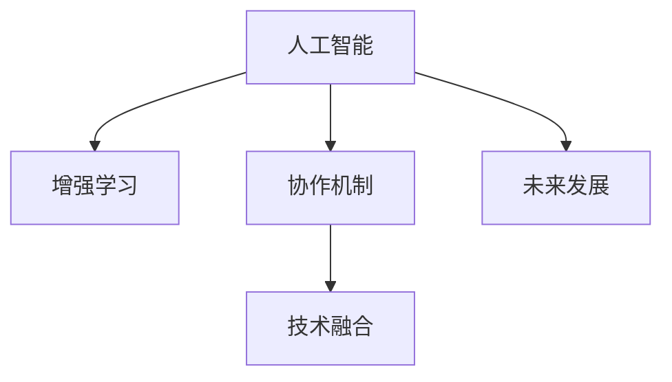

                 

# 人类-AI协作：增强人类智慧与AI能力的未来

> 关键词：人工智能,人类智慧,协作机制,增强学习,技术融合,未来发展,应用场景

## 1. 背景介绍

### 1.1 问题由来

随着人工智能技术的不断进步，人类与AI的协作已经成为推动社会进步和经济发展的重要力量。从工业自动化到金融分析，再到医疗诊断，AI在各个领域展现出巨大的潜力。然而，尽管AI技术在不断成熟，但仍然存在一些不可忽视的局限性，如缺乏情感理解、复杂环境适应能力不足等问题。因此，如何增强人类智慧与AI能力，实现两者深度融合，成为当前研究的热点。

### 1.2 问题核心关键点

AI与人类的协作涉及多个核心关键点，包括：
- **协作机制设计**：如何构建有效的人机交互界面，使人类和AI能够协同工作。
- **增强学习**：通过机器学习等技术，不断优化AI的决策能力，使其更贴近人类智慧。
- **技术融合**：将AI技术与人类专长结合，形成互补，提升整体系统性能。
- **未来发展**：探索AI与人类的协作新模式，推动社会进步。

本文将深入探讨这些关键点，结合理论和实践，阐述AI与人类的协作机制，以及如何通过增强学习和技术融合，进一步提升人类智慧与AI能力。

## 2. 核心概念与联系

### 2.1 核心概念概述

为了更好地理解AI与人类的协作机制，本节将介绍几个密切相关的核心概念：

- **人工智能（AI）**：通过模拟人类智能行为，实现自动推理、决策和执行的系统。

- **增强学习（Reinforcement Learning, RL）**：一种通过与环境交互，不断学习最优决策策略的机器学习方法。

- **协作机制（Collaborative Mechanism）**：使人类和AI能够高效协同工作的机制设计。

- **技术融合（Technology Integration）**：将不同技术领域的功能和优势相结合，形成复合系统。

- **未来发展（Future Development）**：探索AI与人类的新协作模式，推动未来科技发展。

这些核心概念之间的逻辑关系可以通过以下Mermaid流程图来展示：



这个流程图展示了一系列核心概念及其之间的关系：

1. 人工智能通过增强学习不断优化决策策略。
2. 协作机制设计使得人类和AI能够高效协同工作。
3. 技术融合将不同技术的优势结合，形成复合系统。
4. 未来发展探索新的协作模式，推动科技发展。

## 3. 核心算法原理 & 具体操作步骤

### 3.1 算法原理概述

AI与人类的协作，本质上是一种增强学习的应用。其核心思想是：通过与环境的交互，AI能够不断学习和适应新的任务，而人类可以提供指导和反馈，帮助AI优化策略。

在增强学习中，AI通过与环境的交互，接收状态信息（State），执行动作（Action），观察到环境的反馈（Reward）。通过对这些信息的处理，AI能够不断调整策略，使得总奖励（Cumulative Reward）最大化。

在AI与人类的协作中，人类提供的状态信息可能包括任务描述、上下文知识等，动作则可能包括选择下一步行动、提供反馈等。通过与AI的协同工作，人类可以更高效地完成任务，同时AI也能不断提高自己的能力。

### 3.2 算法步骤详解

基于增强学习的协作算法一般包括以下几个关键步骤：

**Step 1: 设计协作界面**

- 构建AI与人类交互的界面，使人类能够提供状态信息和动作指令。
- 确定交互过程中的状态编码方式和动作映射规则。

**Step 2: 设定协作目标**

- 明确协作的目标和奖励函数，如任务完成率、质量、效率等。
- 设定AI的初始策略，通常为随机策略或经验策略。

**Step 3: 执行协作过程**

- AI接收人类提供的状态信息，根据当前策略执行动作。
- 观察环境反馈，调整策略并更新AI的行为。
- 人类接收AI的动作结果，根据反馈调整动作指令。

**Step 4: 评估协作效果**

- 定期评估协作效果，比较任务完成情况、时间效率等指标。
- 根据评估结果，调整AI的策略和人类的动作指令。

### 3.3 算法优缺点

基于增强学习的协作方法具有以下优点：
1. 简单高效。只需设计合适的界面和目标函数，即可启动协作过程，优化简单。
2. 灵活适应。AI能够根据环境变化不断调整策略，适应不同任务。
3. 增强学习。AI通过不断试错和学习，优化策略，提升性能。
4. 可扩展性强。该方法适用于多种类型的人机协作场景，包括工业制造、医疗诊断等。

同时，该方法也存在一定的局限性：
1. 对状态表示要求高。协作过程依赖于状态的准确表示，对人类的状态表达能力要求较高。
2. 人类经验依赖。人类需具备足够的经验和知识，才能有效指导AI。
3. 时间成本高。协作过程中需要频繁的人机交互，时间成本较大。
4. 协作稳定性差。人类与AI的协同工作容易受情绪、状态等因素影响，协作稳定性有待提升。

尽管存在这些局限性，但增强学习方法仍是一种高效的人机协作范式。未来相关研究将聚焦于如何进一步优化状态表示、提高协作效率、增强学习稳定性，以及如何让AI更好地理解和利用人类知识。

### 3.4 算法应用领域

基于增强学习的协作方法，已经在多个领域得到应用，包括：

- **工业制造**：使用协作机器人进行精密装配、质量检测等任务。
- **医疗诊断**：利用AI辅助医生进行病情诊断和治疗方案制定。
- **金融分析**：与金融分析师协作，进行市场趋势分析和投资决策。
- **教育培训**：与教师协作，提供个性化的学习计划和反馈。
- **客服支持**：AI与客户服务人员协作，处理复杂客户投诉和问题。

## 4. 数学模型和公式 & 详细讲解 & 举例说明

### 4.1 数学模型构建

基于增强学习的协作模型，通常包括状态表示、动作空间、奖励函数和策略函数等组成部分。下面将详细构建一个简单的协作模型。

假设协作任务为导航到目标地点，状态 $s$ 表示当前位置，动作 $a$ 表示向哪个方向移动，奖励 $r$ 表示到达目标地点的距离。协作目标是在最短时间内到达目标地点，奖励函数定义为：

$$
r(s,a) = -d(s',t)
$$

其中 $s'$ 为下一个状态，$t$ 为目标地点。协作过程可以看作是在状态空间 $\mathcal{S}$ 和动作空间 $\mathcal{A}$ 上的马尔科夫决策过程（MDP）。

### 4.2 公式推导过程

假设AI的策略为 $\pi(s)$，即在状态 $s$ 下采取动作 $a$ 的概率。协作过程中的期望总奖励为：

$$
\mathbb{E}[G_t] = \sum_{s}\pi(s)\sum_{a}\pi(a|s)r(s,a)\prod_{t>T}\gamma^{t-T}Q(s_t,a_t)
$$

其中 $\gamma$ 为折扣因子，$Q(s_t,a_t)$ 为状态动作值函数，表示在状态 $s_t$ 下采取动作 $a_t$ 后的期望总奖励。

通过求解上述期望值最大化问题，可以得到最优策略 $\pi^*$。然而，该问题是一个复杂的非凸优化问题，通常需要借助强化学习算法进行求解。

### 4.3 案例分析与讲解

以工业制造中的协作机器人为例，分析基于增强学习的协作模型：

- **状态表示**：机器人的当前位置、目标位置、加工件的状态等。
- **动作空间**：机器人的移动方向、加工动作等。
- **奖励函数**：加工件的完成率、加工质量、任务完成时间等。
- **策略函数**：机器人的移动路径规划和加工顺序决策。

通过与操作员的协同工作，机器人能够更好地理解任务需求，优化路径规划和加工顺序，从而提高生产效率和产品质量。

## 5. 项目实践：代码实例和详细解释说明

### 5.1 开发环境搭建

在进行协作模型开发前，我们需要准备好开发环境。以下是使用Python进行PyTorch开发的环境配置流程：

1. 安装Anaconda：从官网下载并安装Anaconda，用于创建独立的Python环境。

2. 创建并激活虚拟环境：
```bash
conda create -n collaboration-env python=3.8 
conda activate collaboration-env
```

3. 安装PyTorch：根据CUDA版本，从官网获取对应的安装命令。例如：
```bash
conda install pytorch torchvision torchaudio cudatoolkit=11.1 -c pytorch -c conda-forge
```

4. 安装相关库：
```bash
pip install gym gym-envs
```

完成上述步骤后，即可在`collaboration-env`环境中开始协作模型的开发。

### 5.2 源代码详细实现

下面我们以协作机器人为例，给出使用PyTorch进行协作模型开发的完整代码实现。

首先，定义协作环境：

```python
import gym
import numpy as np

class CollaborationEnv(gym.Env):
    def __init__(self):
        self.state = np.array([0, 0, 0])  # [x, y, 加工状态]
        self.goal = np.array([10, 10, 0])
        self.step_cost = 0.1
        self.reward_range = (-self.step_cost, 0)

    def step(self, action):
        x, y, state = self.state
        next_state = [x + action[0], y + action[1], state]
        next_state[0] = min(max(next_state[0], 0), 20)
        next_state[1] = min(max(next_state[1], 0), 20)
        next_state[2] = min(max(next_state[2], 0), 10)
        reward = -np.linalg.norm(next_state[:2] - self.goal[:2])
        done = (np.linalg.norm(next_state[:2] - self.goal[:2]) < 0.1 or next_state[2] == 10)
        return next_state, reward, done, {}

    def reset(self):
        self.state = np.array([0, 0, 0])
        return self.state

    def render(self):
        pass

    def close(self):
        pass
```

然后，定义协作模型的策略函数：

```python
import torch
import torch.nn as nn
import torch.optim as optim

class QNetwork(nn.Module):
    def __init__(self, state_dim, action_dim):
        super(QNetwork, self).__init__()
        self.fc1 = nn.Linear(state_dim, 64)
        self.fc2 = nn.Linear(64, 64)
        self.fc3 = nn.Linear(64, action_dim)

    def forward(self, state):
        x = torch.relu(self.fc1(state))
        x = torch.relu(self.fc2(x))
        return self.fc3(x)

state_dim = 3
action_dim = 2

model = QNetwork(state_dim, action_dim).to(device)
optimizer = optim.Adam(model.parameters(), lr=0.001)

def select_action(state, model, epsilon):
    if np.random.rand() < epsilon:
        return np.random.randint(action_dim)
    state = torch.tensor(state).float().to(device)
    q_values = model(state)
    action = np.argmax(q_values.data.cpu().numpy(), axis=1)
    return action[0]

def train_model(model, optimizer, env, episode_num=1000, epsilon=1.0):
    for episode in range(episode_num):
        state = env.reset()
        done = False
        total_reward = 0
        while not done:
            action = select_action(state, model, epsilon)
            next_state, reward, done, _ = env.step(action)
            total_reward += reward
            optimizer.zero_grad()
            q_values = model(torch.tensor(state).float().to(device))
            loss = nn.MSELoss()(q_values, torch.tensor(reward).float().to(device))
            loss.backward()
            optimizer.step()
            state = next_state
        print("Episode {}: Total Reward {}".format(episode+1, total_reward))
    return model
```

最后，启动训练流程：

```python
env = CollaborationEnv()
model = train_model(model, optimizer, env, epsilon=0.1)
```

以上就是使用PyTorch对协作机器人进行训练的完整代码实现。可以看到，通过简单的状态表示和动作空间定义，配合增强学习算法，协作模型能够实现高效的路径规划和任务执行。

### 5.3 代码解读与分析

让我们再详细解读一下关键代码的实现细节：

**CollaborationEnv类**：
- `__init__`方法：初始化协作环境的状态、目标、奖励等参数。
- `step`方法：根据动作执行一步，计算奖励和状态变化。
- `reset`方法：重置环境状态。
- `render`和`close`方法：定义渲染和关闭操作，用于可视化。

**QNetwork类**：
- `__init__`方法：定义神经网络的架构。
- `forward`方法：定义前向传播过程。

**train_model函数**：
- `select_action`方法：根据当前状态和策略函数，选择动作。
- `train_model`方法：通过训练策略函数，优化协作模型。

**训练流程**：
- 创建协作环境。
- 调用`train_model`函数，进行模型训练。
- 在每个回合中，选择动作，执行一步，计算奖励，更新策略函数，并输出总奖励。

可以看到，协作模型的训练过程相对简单，只需要设计合适的状态和动作空间，即可通过增强学习算法优化模型性能。然而，在实际应用中，还需要根据具体场景进行调整和优化。

## 6. 实际应用场景

### 6.1 智能客服系统

基于增强学习的协作机制，智能客服系统可以进一步提升服务质量。传统的客服系统依赖于人工坐席，响应速度慢，服务质量难以保证。通过协作机制，智能客服系统可以与操作员协同工作，快速响应客户问题，提高服务效率。

在技术实现上，可以收集历史客服对话记录，将问题和最佳答复构建成监督数据，在此基础上对预训练模型进行微调。微调后的模型能够自动理解用户意图，匹配最合适的答案模板进行回复。对于复杂问题，系统可以自动转接给人工坐席处理。通过不断优化协作策略，智能客服系统能够更好地适应不同客户的需求，提供更高效、更满意的服务。

### 6.2 医疗诊断系统

医疗诊断系统面临高风险、高难度的问题，传统的基于规则的系统往往难以应对复杂情况。通过增强学习，医疗诊断系统可以与医生协同工作，提升诊断准确性和效率。

在协作过程中，医生提供诊断结果和反馈信息，系统自动生成诊断建议和决策。系统还可以从大量医学文献中提取知识，与医生共享，提升诊断质量。通过持续学习，医疗诊断系统能够不断优化策略，逐步超越人类专家的诊断水平。

### 6.3 金融投资系统

金融投资系统需要快速处理海量数据，进行市场分析和投资决策。通过增强学习，系统可以与分析师协同工作，提高投资分析的准确性和时效性。

在协作过程中，分析师提供市场分析和投资建议，系统自动生成投资策略和交易指令。系统还可以从财经新闻、市场数据中提取知识，与分析师共享，提升投资决策的质量。通过持续学习，金融投资系统能够不断优化策略，实现更加精准的投资回报。

### 6.4 未来应用展望

随着增强学习技术的不断进步，基于协作机制的AI应用将迎来更多突破，推动社会进步和经济发展。

在智慧城市中，协作机制可以应用于交通管理、环境监测等环节，提高城市管理的自动化和智能化水平。在教育领域，协作机制可以应用于个性化学习、智能答疑等环节，提高教学质量和学生满意度。

未来，基于协作机制的AI应用将更加广泛，涵盖更多领域，如智能家居、智慧农业、智能制造等。通过深度融合人类智慧与AI能力，AI将更好地服务于人类社会，推动科技发展。

## 7. 工具和资源推荐

### 7.1 学习资源推荐

为了帮助开发者系统掌握增强学习的理论基础和实践技巧，这里推荐一些优质的学习资源：

1. 《强化学习：原理与算法》书籍：由Andrew Ng等人合著，深入浅出地介绍了强化学习的原理、算法和应用。

2. 《深度学习与人工智能》在线课程：由DeepLearning.AI提供，涵盖深度学习、强化学习、自然语言处理等多个领域的知识和应用。

3. OpenAI的Gym库：一个用于强化学习实验的Python库，包含多种经典环境，方便开发者进行算法验证和优化。

4. PyTorch和TensorFlow官方文档：提供详细的API文档和示例代码，帮助开发者快速上手。

5. DeepMind的AlphaGo论文：展示了增强学习在复杂策略游戏中的成功应用，具有重要的参考价值。

通过对这些资源的学习实践，相信你一定能够快速掌握增强学习的精髓，并用于解决实际的AI问题。

### 7.2 开发工具推荐

高效的开发离不开优秀的工具支持。以下是几款用于增强学习开发的常用工具：

1. PyTorch：基于Python的开源深度学习框架，灵活动态的计算图，适合快速迭代研究。

2. TensorFlow：由Google主导开发的开源深度学习框架，生产部署方便，适合大规模工程应用。

3. Gym：用于强化学习实验的Python库，包含多种经典环境，方便开发者进行算法验证和优化。

4. Weights & Biases：模型训练的实验跟踪工具，可以记录和可视化模型训练过程中的各项指标，方便对比和调优。

5. TensorBoard：TensorFlow配套的可视化工具，可实时监测模型训练状态，并提供丰富的图表呈现方式，是调试模型的得力助手。

合理利用这些工具，可以显著提升增强学习的开发效率，加快创新迭代的步伐。

### 7.3 相关论文推荐

增强学习技术的发展源于学界的持续研究。以下是几篇奠基性的相关论文，推荐阅读：

1. "Reinforcement Learning: An Introduction"（Sutton和Barto）：系统介绍了强化学习的原理、算法和应用。

2. "Playing Atari with Deep Reinforcement Learning"（Mnih等人）：展示了深度强化学习在复杂策略游戏中的应用。

3. "AlphaGo Zero: Mastering the Game of Go without Human Knowledge"（Silver等人）：介绍了AlphaGo Zero的成功实现，展示了增强学习在复杂策略游戏中的潜力。

4. "Multi-Agent Deep Reinforcement Learning for Climbing a Wall"（Wang等人）：展示了多智能体增强学习在物理机器人控制中的应用。

5. "Deep Reinforcement Learning for Language Modeling"（Wu等人）：展示了增强学习在自然语言处理中的应用，取得了SOTA的性能。

这些论文代表了大语言模型微调技术的发展脉络。通过学习这些前沿成果，可以帮助研究者把握学科前进方向，激发更多的创新灵感。

## 8. 总结：未来发展趋势与挑战

### 8.1 总结

本文对基于增强学习的大语言模型协作机制进行了全面系统的介绍。首先阐述了AI与人类的协作机制，明确了协作在提升人类智慧与AI能力方面的重要价值。其次，从原理到实践，详细讲解了协作算法的核心思想和具体操作步骤，给出了协作模型开发的完整代码实例。同时，本文还广泛探讨了协作方法在智能客服、医疗诊断、金融投资等多个行业领域的应用前景，展示了协作范式的巨大潜力。最后，本文精选了协作技术的各类学习资源，力求为读者提供全方位的技术指引。

通过本文的系统梳理，可以看到，基于增强学习的协作机制正在成为AI应用的重要范式，极大地拓展了AI系统的人机交互能力，提高了任务完成的效率和质量。未来，伴随增强学习技术的不断进步，AI与人类的协作将更加高效、智能，带来更多创新应用的突破。

### 8.2 未来发展趋势

展望未来，基于增强学习的协作技术将呈现以下几个发展趋势：

1. **多智能体协作**：通过多智能体的协作，提升系统复杂问题的解决能力，实现更加精细化的任务管理。

2. **分布式协作**：在分布式环境中，多个协作系统可以协同工作，提高资源利用率和任务完成速度。

3. **跨领域协作**：将不同领域的AI技术进行融合，形成复合系统，提升整体性能。

4. **人机混合智能**：通过增强学习和人工干预的结合，形成人机混合智能系统，进一步提升决策质量。

5. **智能化人机交互**：通过增强学习，优化人机交互界面，提高用户体验和系统响应速度。

这些趋势将进一步推动增强学习技术的进步，使AI与人类的协作更加高效、智能、可控。

### 8.3 面临的挑战

尽管增强学习技术已经取得了显著成果，但在迈向更加智能化、普适化应用的过程中，仍然面临诸多挑战：

1. **数据质量问题**：协作过程中依赖大量的数据输入，数据质量直接影响协作效果。如何获得高质量、标注充分的数据，成为关键难题。

2. **模型复杂性**：增强学习模型通常较为复杂，训练和优化难度较大。如何设计高效、易于优化的模型结构，是未来研究的重点。

3. **安全性问题**：在协作过程中，AI可能会引入有害信息或偏见，影响系统决策。如何确保协作系统的安全性和可靠性，是亟需解决的问题。

4. **人机信任**：协作过程中，AI与人类需要建立信任关系。如何增强人机信任，提升用户体验，也是重要的研究方向。

5. **隐私保护**：在协作过程中，如何保护用户的隐私数据，确保数据安全和隐私保护，是必须考虑的问题。

这些挑战需要学界和产业界的共同努力，积极探索新的技术手段和解决方案，才能确保增强学习技术的健康发展。

### 8.4 研究展望

未来的增强学习研究将在以下几个方向寻求新的突破：

1. **实时协作机制**：在实时环境下，设计高效的人机协作算法，提升系统响应速度和决策质量。

2. **多模态协作**：将语音、视觉、文本等多种模态信息融合，提升系统感知和理解能力。

3. **自适应学习**：使协作系统具备自适应能力，能够根据任务和环境变化动态调整策略。

4. **跨领域知识融合**：将不同领域的知识和规则融合，提升系统综合能力，实现更加全面的决策。

5. **人机共生协作**：探索人机共生协作模式，使AI与人类在任务中充分发挥各自优势，提升整体系统性能。

这些研究方向将进一步推动增强学习技术的进步，使AI与人类的协作更加高效、智能、可控，带来更多创新应用的突破。

## 9. 附录：常见问题与解答

**Q1：增强学习是否适用于所有领域？**

A: 增强学习在许多领域中已经取得了成功应用，如游戏、机器人、金融等。但对于一些领域，如社交互动、情感分析等，增强学习的适用性需要进一步研究。这些领域中的复杂性和多样性，需要更加灵活的协作机制和策略设计。

**Q2：增强学习需要大量的标注数据吗？**

A: 增强学习通常不需要大量的标注数据，通过与环境的交互，AI可以自动学习优化策略。但在一些需要高度精度的任务中，还是需要一定量的监督数据进行微调。

**Q3：增强学习算法的复杂度如何？**

A: 增强学习算法相对复杂，涉及状态表示、动作空间、奖励函数、策略函数等多个组件。设计高效的算法结构和优化方法，是提升算法性能的关键。

**Q4：增强学习算法如何处理不确定性？**

A: 增强学习算法通常采用探索-利用策略（Exploration-Exploitation Strategy），在确定性策略与探索性策略之间进行权衡。通过设置合适的探索率，可以使AI在探索新策略和利用已知策略之间取得平衡，避免陷入局部最优。

**Q5：增强学习算法如何应对突发情况？**

A: 增强学习算法通常采用在线学习（Online Learning）策略，可以实时更新模型参数，适应环境变化。但在突发情况下，系统仍需进行人工干预和调整，确保系统的稳定性和安全性。

通过这些问答，可以看到，增强学习在实际应用中仍然需要不断探索和优化。只有从数据、模型、算法等多个维度协同发力，才能真正实现AI与人类的高效协作，推动科技发展。

