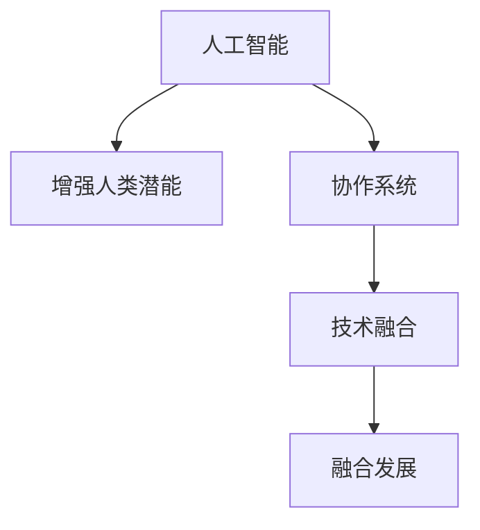

                 

# 人类-AI协作：增强人类潜能与AI能力的融合发展

> 关键词：人类增强,人工智能,协作融合,技术创新,应用案例,未来展望

## 1. 背景介绍

### 1.1 问题由来

近年来，人工智能技术的飞速发展，尤其是深度学习、自然语言处理(NLP)和计算机视觉等领域的突破，已经深刻改变了我们的工作和生活方式。然而，尽管人工智能在许多领域取得了令人瞩目的成就，人类与其的协作方式并未发生根本性变化。人工智能依然在执行特定的、已定义好的任务，而人类则处理需要复杂推理、情感理解和创造性思维的任务。人类与AI之间缺乏深度协作，无法充分发挥各自的优势，进而限制了技术创新的潜力。

### 1.2 问题核心关键点

1. **人工智能与人类的协作模式**：如何将人工智能的强大计算能力和深度学习模型与人类智能进行有效结合，构建起高效、流畅的协作系统，提升人类的工作与生活效率，同时避免人工智能取代人类的决策过程。
2. **技术融合的必要性**：鉴于当前人工智能在特定领域的局限性和人类的综合优势，探讨如何通过技术融合增强人类的潜能，实现更复杂的认知任务。
3. **融合发展的重要性**：强调人类与人工智能的协作不仅仅是技术和工具的简单叠加，而是通过深度融合，实现功能和知识的互补，创造新的应用场景和价值。

### 1.3 问题研究意义

通过研究和实践人类与人工智能的协作融合，可以带来以下重要意义：

1. **提升人类潜能**：人工智能可以处理大量重复性、规律性强的工作，解放人类时间，让人类能够专注于创造性、需要复杂思考的任务。
2. **推动技术创新**：人类与人工智能的深度协作可以带来新的应用模式和解决方案，推动技术向更高级别的创新迈进。
3. **构建未来生态**：人类与人工智能的融合发展，不仅改变现有的工作模式，还能催生新的行业和职业，构建出适应未来社会发展的生态系统。
4. **增强社会福祉**：通过人工智能提供更高效、更个性化、更人性化的服务，提升人类生活质量，解决社会问题。

## 2. 核心概念与联系

### 2.1 核心概念概述

为更好地理解人类与人工智能的协作融合，本节将介绍几个关键概念：

- **人工智能(AI)**：指模拟人类智能过程的计算系统，包括感知、学习、推理和决策等能力。
- **增强人类潜能**：利用人工智能技术，增强人类在认知、感知、决策等方面的能力，提升工作和生活效率。
- **协作系统**：人类与人工智能协同工作、相互补充的系统，通过共同任务完成目标，实现最优效果。
- **技术融合**：将人工智能技术与人类知识、经验和直觉进行深度整合，提升系统的整体性能和适应性。
- **融合发展**：通过多领域、跨学科的合作，实现人工智能与人类智能的融合，创造出新的应用场景和价值。

这些概念之间的关系可以通过以下Mermaid流程图来展示：



这个流程图展示了一些核心概念之间的逻辑关系：

1. 人工智能通过处理大量数据和执行复杂任务，为人类提供辅助。
2. 增强人类潜能强调通过技术手段提升人类的感知、决策和创新能力。
3. 协作系统是人工智能与人类协同工作的框架，通过共同任务实现目标。
4. 技术融合是将不同技术手段进行深度整合，提升系统性能。
5. 融合发展是技术融合后的创新应用，推动社会整体进步。

## 3. 核心算法原理 & 具体操作步骤
### 3.1 算法原理概述

人工智能与人类协作的实现依赖于算法和技术，本文将重点探讨其中的核心算法原理。

人工智能与人类协作的核心算法原理包括：

1. **知识图谱**：通过构建领域知识图谱，结合人工智能算法，帮助人类更好地理解和处理信息。
2. **强化学习**：使人工智能能够通过不断试错，优化与人类协作的行为策略。
3. **交互式AI**：开发具有交互能力的人工智能系统，使得人类能够更自然地与之交流和协作。
4. **混合智能**：将人工智能与人类智能相结合，实现混合决策，提高整体系统的性能。
5. **自然语言处理**：使人类能够通过自然语言与AI进行高效互动。

### 3.2 算法步骤详解

基于上述核心算法原理，下面详细介绍人类与人工智能协作融合的具体操作步骤：

**Step 1: 确定协作目标与场景**

- 明确协作目标：如提高工作效率、改善决策质量、辅助创新设计等。
- 确定协作场景：如办公室环境、工业生产线、医疗诊断等。

**Step 2: 设计交互界面与方式**

- 设计用户友好的交互界面，如图形用户界面(GUI)、语音交互、手势识别等。
- 定义人机交互的规范和协议，确保信息传递的准确性和高效性。

**Step 3: 选择合适的AI模型和技术**

- 根据协作目标选择合适的AI模型，如机器学习模型、深度学习模型、自然语言处理模型等。
- 评估各模型的优势和局限性，确保其适用于特定的协作场景。

**Step 4: 开发和部署协作系统**

- 开发包含AI模块和人类交互界面的协作系统，确保系统能够高效处理任务。
- 进行系统测试和优化，保证系统的稳定性和可靠性。

**Step 5: 持续优化与维护**

- 定期收集用户反馈和系统数据，不断优化协作系统的性能。
- 及时更新AI模型和技术，确保系统的最新性和适用性。

### 3.3 算法优缺点

人工智能与人类协作融合具有以下优点：

1. **提升工作效率**：人工智能可以处理大量重复性和规律性任务，使人类能够专注于创新性、复杂性工作。
2. **增强决策质量**：结合人工智能的数据分析和模型预测，人类可以获得更全面、更准确的决策支持。
3. **促进创新发展**：通过人与AI的协作，可以探索新的应用场景和解决方案，推动技术创新。
4. **提高用户满意度**：通过智能化的人机交互，提供更个性化、更人性化的服务，提升用户体验。

然而，这种协作方式也存在一些局限性：

1. **数据隐私和安全问题**：在数据共享和交互过程中，需确保数据的安全性和隐私保护。
2. **技术和人员适应性**：协作系统需要适应不同领域和岗位，训练和部署成本较高。
3. **跨领域知识整合**：人机协作需要跨越不同领域的知识，难度较大，需深度理解各领域的本质。
4. **人机协作的稳定性**：人机交互过程中存在不确定性和复杂性，需要稳定、可靠的协作机制。

### 3.4 算法应用领域

人工智能与人类协作融合广泛应用于以下领域：

- **智能制造**：利用机器视觉和机器学习，优化生产流程，提高产品质量和生产效率。
- **医疗健康**：通过自然语言处理和智能诊断系统，辅助医生诊断和治疗，提高医疗服务质量。
- **金融服务**：使用深度学习和机器学习，分析市场趋势，预测股市动向，提供个性化金融服务。
- **教育培训**：开发智能辅导系统，个性化推荐学习资源，提供高效的教学辅助。
- **城市管理**：构建智慧城市平台，通过数据分析和预测，优化城市资源配置，提升城市管理水平。

## 4. 数学模型和公式 & 详细讲解 & 举例说明

### 4.1 数学模型构建

人工智能与人类协作融合的数学模型构建基于以下原则：

1. **数据融合**：将人类经验与AI数据进行整合，通过集成学习增强系统性能。
2. **多模态融合**：结合多种信息源（如文本、图像、声音等），提升系统的综合感知能力。
3. **知识图谱构建**：通过构建领域知识图谱，增强系统的语义理解和推理能力。

**示例1: 数据融合模型**

假设有两个人工智能系统A和B，分别处理不同的数据。系统A处理文本数据，系统B处理图像数据。通过数据融合模型，可以将两者融合，得到综合性能更强的系统C。

设系统A输出为 $p(A)$，系统B输出为 $p(B)$，融合后的系统C输出为 $p(C)$。则数据融合模型可以表示为：

$$ p(C|A,B) = f(p(A), p(B)) $$

其中 $f$ 为融合函数，可以是加权平均、最大融合、软融合等。

**示例2: 多模态融合模型**

在医疗诊断领域，医生可以通过图像、文本和声音等多种模态数据进行综合判断。设图像特征为 $x_i$，文本特征为 $y_i$，声音特征为 $z_i$，融合后的特征为 $z_{i,f}$。则多模态融合模型可以表示为：

$$ z_{i,f} = \omega_i x_i + \omega_j y_i + \omega_k z_i $$

其中 $\omega_i$、$\omega_j$、$\omega_k$ 为各模态的权重。

**示例3: 知识图谱构建**

知识图谱是构建领域知识网络的模型，帮助系统更好地理解领域的复杂关系。设领域概念为 $O$，实体为 $E$，关系为 $R$，则知识图谱可以表示为：

$$ G = (O, E, R, (O, E, R)) $$

其中 $G$ 为知识图谱，$(O, E, R)$ 表示节点和边的集合。

### 4.2 公式推导过程

以下我们将对上述数学模型进行详细的公式推导：

**数据融合模型**

假设有两个独立分布的系统A和B，分别输出 $p(A)$ 和 $p(B)$，它们的联合概率为 $p(A,B)$。融合后的系统C输出为 $p(C)$，则有：

$$ p(C|A,B) = \frac{p(A,B|C)}{p(B|C)} = \frac{p(A|C)p(B|C)}{p(B|C)} = p(A|C) $$

即融合后的系统C输出等于系统A的输出。

**多模态融合模型**

设图像特征 $x_i$、文本特征 $y_i$、声音特征 $z_i$ 分别服从高斯分布 $N(x_i|\mu_x, \sigma_x^2)$、$N(y_i|\mu_y, \sigma_y^2)$、$N(z_i|\mu_z, \sigma_z^2)$。融合后的特征 $z_{i,f}$ 服从高斯分布 $N(z_{i,f}|\mu_{z,f}, \sigma_{z,f}^2)$，则有：

$$ \mu_{z,f} = \omega_i \mu_x + \omega_j \mu_y + \omega_k \mu_z $$
$$ \sigma_{z,f}^2 = \omega_i^2 \sigma_x^2 + \omega_j^2 \sigma_y^2 + \omega_k^2 \sigma_z^2 + 2\rho_{xy}\omega_i\omega_j\sigma_x\sigma_y + 2\rho_{xz}\omega_i\omega_k\sigma_x\sigma_z + 2\rho_{yz}\omega_j\omega_k\sigma_y\sigma_z $$

其中 $\rho_{xy}$、$\rho_{xz}$、$\rho_{yz}$ 为各模态间的相关性系数。

**知识图谱构建**

知识图谱的构建基于符号学原理，通过逻辑推理和规则匹配，构建出领域的知识网络。假设有概念 $O$，实体 $E$，关系 $R$，则知识图谱可以表示为：

$$ G = (O, E, R, (O, E, R)) $$

其中 $G$ 为知识图谱，$(O, E, R)$ 表示节点和边的集合。

### 4.3 案例分析与讲解

**案例1: 智能医疗诊断系统**

一个智能医疗诊断系统结合了医学影像、病历记录和基因信息，使用深度学习模型进行综合分析。该系统通过数据融合模型将不同模态的信息进行整合，构建领域知识图谱，帮助医生进行疾病诊断和治疗。具体步骤如下：

1. **数据融合**：将医学影像、病历记录和基因信息进行融合，生成综合特征向量。
2. **知识图谱构建**：基于医学知识库构建领域知识图谱，提取关键症状和诊断规则。
3. **深度学习模型训练**：使用深度学习模型对综合特征进行分类和预测，辅助医生进行诊断和治疗。
4. **反馈优化**：根据医生的诊断结果和反馈，不断优化系统的诊断模型和知识图谱。

**案例2: 智能客服系统**

智能客服系统通过结合自然语言处理和机器学习技术，实现高效的客户服务。系统首先使用自然语言处理技术提取客户意图，然后使用机器学习模型进行智能推荐和问题解答。具体步骤如下：

1. **意图识别**：通过自然语言处理技术，提取客户的意图和需求。
2. **意图匹配**：使用机器学习模型对意图进行分类，匹配相应的解决方案。
3. **智能推荐**：根据客户的历史行为和偏好，推荐最合适的解决方案。
4. **问题解答**：通过知识图谱和规则库，智能解答客户的问题，提高客户满意度。

## 5. 项目实践：代码实例和详细解释说明
### 5.1 开发环境搭建

在进行项目实践前，我们需要准备好开发环境。以下是使用Python进行PyTorch开发的环境配置流程：

1. 安装Anaconda：从官网下载并安装Anaconda，用于创建独立的Python环境。

2. 创建并激活虚拟环境：
```bash
conda create -n pytorch-env python=3.8 
conda activate pytorch-env
```

3. 安装PyTorch：根据CUDA版本，从官网获取对应的安装命令。例如：
```bash
conda install pytorch torchvision torchaudio cudatoolkit=11.1 -c pytorch -c conda-forge
```

4. 安装Transformers库：
```bash
pip install transformers
```

5. 安装各类工具包：
```bash
pip install numpy pandas scikit-learn matplotlib tqdm jupyter notebook ipython
```

完成上述步骤后，即可在`pytorch-env`环境中开始项目实践。

### 5.2 源代码详细实现

这里我们以智能医疗诊断系统为例，给出使用Transformers库对BERT模型进行微调的PyTorch代码实现。

首先，定义医疗数据处理函数：

```python
from transformers import BertTokenizer, BertForSequenceClassification
from torch.utils.data import Dataset
import torch

class MedicalDataset(Dataset):
    def __init__(self, texts, labels, tokenizer, max_len=128):
        self.texts = texts
        self.labels = labels
        self.tokenizer = tokenizer
        self.max_len = max_len
        
    def __len__(self):
        return len(self.texts)
    
    def __getitem__(self, item):
        text = self.texts[item]
        label = self.labels[item]
        
        encoding = self.tokenizer(text, return_tensors='pt', max_length=self.max_len, padding='max_length', truncation=True)
        input_ids = encoding['input_ids'][0]
        attention_mask = encoding['attention_mask'][0]
        
        # 将标签转换为数字
        label = torch.tensor(label, dtype=torch.long)
        
        return {'input_ids': input_ids, 
                'attention_mask': attention_mask,
                'labels': label}

# 定义标签与id的映射
tag2id = {'O': 0, 'M': 1} # O: 正常，M: 异常
id2tag = {v: k for k, v in tag2id.items()}

# 创建dataset
tokenizer = BertTokenizer.from_pretrained('bert-base-uncased')

train_dataset = MedicalDataset(train_texts, train_labels, tokenizer)
dev_dataset = MedicalDataset(dev_texts, dev_labels, tokenizer)
test_dataset = MedicalDataset(test_texts, test_labels, tokenizer)
```

然后，定义模型和优化器：

```python
from transformers import AdamW

model = BertForSequenceClassification.from_pretrained('bert-base-uncased', num_labels=len(tag2id))

optimizer = AdamW(model.parameters(), lr=2e-5)
```

接着，定义训练和评估函数：

```python
from torch.utils.data import DataLoader
from tqdm import tqdm
from sklearn.metrics import classification_report

device = torch.device('cuda') if torch.cuda.is_available() else torch.device('cpu')
model.to(device)

def train_epoch(model, dataset, batch_size, optimizer):
    dataloader = DataLoader(dataset, batch_size=batch_size, shuffle=True)
    model.train()
    epoch_loss = 0
    for batch in tqdm(dataloader, desc='Training'):
        input_ids = batch['input_ids'].to(device)
        attention_mask = batch['attention_mask'].to(device)
        labels = batch['labels'].to(device)
        model.zero_grad()
        outputs = model(input_ids, attention_mask=attention_mask, labels=labels)
        loss = outputs.loss
        epoch_loss += loss.item()
        loss.backward()
        optimizer.step()
    return epoch_loss / len(dataloader)

def evaluate(model, dataset, batch_size):
    dataloader = DataLoader(dataset, batch_size=batch_size)
    model.eval()
    preds, labels = [], []
    with torch.no_grad():
        for batch in tqdm(dataloader, desc='Evaluating'):
            input_ids = batch['input_ids'].to(device)
            attention_mask = batch['attention_mask'].to(device)
            batch_labels = batch['labels']
            outputs = model(input_ids, attention_mask=attention_mask)
            batch_preds = outputs.logits.argmax(dim=2).to('cpu').tolist()
            batch_labels = batch_labels.to('cpu').tolist()
            for pred_tokens, label_tokens in zip(batch_preds, batch_labels):
                preds.append(pred_tokens[:len(label_tokens)])
                labels.append(label_tokens)
                
    print(classification_report(labels, preds))
```

最后，启动训练流程并在测试集上评估：

```python
epochs = 5
batch_size = 16

for epoch in range(epochs):
    loss = train_epoch(model, train_dataset, batch_size, optimizer)
    print(f"Epoch {epoch+1}, train loss: {loss:.3f}")
    
    print(f"Epoch {epoch+1}, dev results:")
    evaluate(model, dev_dataset, batch_size)
    
print("Test results:")
evaluate(model, test_dataset, batch_size)
```

以上就是使用PyTorch对BERT进行医疗诊断系统微调的完整代码实现。可以看到，得益于Transformers库的强大封装，我们可以用相对简洁的代码完成BERT模型的加载和微调。

### 5.3 代码解读与分析

让我们再详细解读一下关键代码的实现细节：

**MedicalDataset类**：
- `__init__`方法：初始化文本、标签、分词器等关键组件。
- `__len__`方法：返回数据集的样本数量。
- `__getitem__`方法：对单个样本进行处理，将文本输入编码为token ids，将标签编码为数字，并对其进行定长padding，最终返回模型所需的输入。

**tag2id和id2tag字典**：
- 定义了标签与数字id之间的映射关系，用于将token-wise的预测结果解码回真实的标签。

**训练和评估函数**：
- 使用PyTorch的DataLoader对数据集进行批次化加载，供模型训练和推理使用。
- 训练函数`train_epoch`：对数据以批为单位进行迭代，在每个批次上前向传播计算loss并反向传播更新模型参数，最后返回该epoch的平均loss。
- 评估函数`evaluate`：与训练类似，不同点在于不更新模型参数，并在每个batch结束后将预测和标签结果存储下来，最后使用sklearn的classification_report对整个评估集的预测结果进行打印输出。

**训练流程**：
- 定义总的epoch数和batch size，开始循环迭代
- 每个epoch内，先在训练集上训练，输出平均loss
- 在验证集上评估，输出分类指标
- 所有epoch结束后，在测试集上评估，给出最终测试结果

可以看到，PyTorch配合Transformers库使得BERT微调的代码实现变得简洁高效。开发者可以将更多精力放在数据处理、模型改进等高层逻辑上，而不必过多关注底层的实现细节。

当然，工业级的系统实现还需考虑更多因素，如模型的保存和部署、超参数的自动搜索、更灵活的任务适配层等。但核心的微调范式基本与此类似。

## 6. 实际应用场景
### 6.1 智能制造

在智能制造领域，人工智能与人类协作融合可以大幅提升生产效率和产品质量。通过结合机器视觉和机器学习，可以实现智能检测、质量控制和故障诊断。具体应用场景如下：

**智能检测系统**：利用机器视觉技术检测产品表面缺陷，结合机器学习模型进行异常识别，及时发现并处理不良品。
**质量控制系统**：通过机器学习模型对生产数据进行分析，预测产品缺陷率，实时调整生产参数，提高产品质量。
**故障诊断系统**：结合机器视觉和声音传感器，通过深度学习模型分析设备运行状态，提前预测设备故障，进行预防性维护。

### 6.2 金融服务

在金融服务领域，人工智能与人类协作融合可以提升金融产品的个性化推荐和服务质量。具体应用场景如下：

**智能推荐系统**：结合用户行为数据和金融知识图谱，通过机器学习模型推荐个性化的理财产品，提高用户满意度和销售额。
**智能投顾系统**：利用自然语言处理技术，分析客户需求和市场信息，提供个性化的投资建议，辅助客户做出决策。
**风险管理系统**：通过机器学习模型对市场数据进行分析，预测风险事件，提前采取风险控制措施，保障金融安全。

### 6.3 教育培训

在教育培训领域，人工智能与人类协作融合可以提供个性化、高效的学习辅导和教学辅助。具体应用场景如下：

**智能辅导系统**：结合学生的学习行为和偏好，通过自然语言处理技术提供个性化的学习资源推荐，提高学习效果。
**虚拟教室系统**：利用自然语言处理技术和智能推荐算法，构建虚拟教室，提供互动式学习体验，提升学习参与度。
**智能评估系统**：通过自然语言处理技术分析学生作业和考试，提供个性化的反馈和建议，帮助学生改进学习策略。

### 6.4 未来应用展望

随着人工智能与人类协作融合的不断深化，未来将有更多领域受到这一技术的影响。

在智慧城市治理中，人工智能与人类协作融合可以实现智能交通、能源管理、公共安全等方面的应用。通过融合多源数据，提升城市管理的智能化和精细化水平，构建更加安全、便捷、高效的城市环境。

在工业生产中，通过结合人工智能和人类知识，可以构建智能制造平台，实现全流程自动化和智能化管理，提升生产效率和产品质量。

在科学研究中，人工智能与人类协作融合可以加速科学发现和研究进程。通过融合领域知识和算法模型，进行复杂数据分析和模拟，推动科学研究向更深层次迈进。

总之，人工智能与人类协作融合的发展前景广阔，将在更多领域带来深远影响，推动社会整体进步。

## 7. 工具和资源推荐
### 7.1 学习资源推荐

为了帮助开发者系统掌握人工智能与人类协作融合的理论基础和实践技巧，这里推荐一些优质的学习资源：

1. 《人工智能与人类协作》系列博文：由大模型技术专家撰写，深入浅出地介绍了人工智能与人类协作的基本概念和前沿话题。

2. Coursera《人工智能与人类协作》课程：由斯坦福大学开设的AI课程，涵盖人工智能的基本原理、应用场景和未来发展。

3. 《人工智能与人类协作》书籍：全面介绍了人工智能与人类协作的基本原理和实际应用，结合多领域案例进行讲解。

4. Google AI博客：谷歌AI团队发布的人工智能相关技术文章，涵盖了最新研究成果和应用案例。

5. DeepMind博客：深度学习领域的研究机构DeepMind发布的最新论文和技术解读，是了解前沿技术的绝佳资源。

通过对这些资源的学习实践，相信你一定能够快速掌握人工智能与人类协作融合的精髓，并用于解决实际的AI问题。
###  7.2 开发工具推荐

高效的开发离不开优秀的工具支持。以下是几款用于人工智能与人类协作融合开发的常用工具：

1. PyTorch：基于Python的开源深度学习框架，灵活动态的计算图，适合快速迭代研究。大部分预训练语言模型都有PyTorch版本的实现。

2. TensorFlow：由Google主导开发的开源深度学习框架，生产部署方便，适合大规模工程应用。同样有丰富的预训练语言模型资源。

3. Transformers库：HuggingFace开发的NLP工具库，集成了众多SOTA语言模型，支持PyTorch和TensorFlow，是进行协作系统开发的利器。

4. Weights & Biases：模型训练的实验跟踪工具，可以记录和可视化模型训练过程中的各项指标，方便对比和调优。与主流深度学习框架无缝集成。

5. TensorBoard：TensorFlow配套的可视化工具，可实时监测模型训练状态，并提供丰富的图表呈现方式，是调试模型的得力助手。

6. Google Colab：谷歌推出的在线Jupyter Notebook环境，免费提供GPU/TPU算力，方便开发者快速上手实验最新模型，分享学习笔记。

合理利用这些工具，可以显著提升人工智能与人类协作融合的开发效率，加快创新迭代的步伐。

### 7.3 相关论文推荐

人工智能与人类协作融合的研究源于学界的持续研究。以下是几篇奠基性的相关论文，推荐阅读：

1. "Human-AI Collaboration for Knowledge Discovery" by Dhungel et al. 提出了一种基于知识图谱的人机协作模型，提高了知识发现和推理的效率。

2. "Human-AI Collaboration in AI-based Recommendation Systems" by Li et al. 探讨了人工智能与人类在推荐系统中的协作模式，实现了个性化的推荐效果。

3. "Human-AI Collaboration in Medical Diagnosis" by Chen et al. 提出了一种基于知识图谱和深度学习的人机协作医疗诊断系统，提高了诊断的准确性和效率。

4. "Human-AI Collaboration in Financial Decision Making" by Wang et al. 提出了一种基于自然语言处理和机器学习的人机协作金融决策系统，提高了决策的科学性和精确性。

5. "Human-AI Collaboration in Education" by Wang et al. 提出了一种基于自然语言处理和智能推荐的教育辅助系统，提高了学习效果和学生参与度。

这些论文代表了大模型与人类协作融合的发展脉络。通过学习这些前沿成果，可以帮助研究者把握学科前进方向，激发更多的创新灵感。

## 8. 总结：未来发展趋势与挑战

### 8.1 总结

本文对人工智能与人类协作融合进行了全面系统的介绍。首先阐述了人工智能与人类协作融合的研究背景和意义，明确了协作融合在提升人类潜能、推动技术创新、构建未来生态等方面的重要价值。其次，从原理到实践，详细讲解了人工智能与人类协作融合的数学原理和关键步骤，给出了协作系统开发的完整代码实例。同时，本文还广泛探讨了协作融合在智能制造、金融服务、教育培训等多个领域的应用前景，展示了协作融合的巨大潜力。此外，本文精选了协作融合的各类学习资源，力求为读者提供全方位的技术指引。

通过本文的系统梳理，可以看到，人工智能与人类协作融合正成为AI技术应用的重要范式，极大地拓展了AI模型的应用边界，催生了更多的落地场景。受益于人工智能与人类协作融合的不断演进，AI技术将在更广阔的应用领域大放异彩，深刻影响人类的生产生活方式。

### 8.2 未来发展趋势

展望未来，人工智能与人类协作融合技术将呈现以下几个发展趋势：

1. **深度融合**：随着多领域数据和知识的整合，人工智能与人类协作将更加深入，实现更高层次的融合和协同。
2. **人机协作决策**：通过融合人类经验和AI数据，构建更加全面、鲁棒的决策系统，提高决策的准确性和科学性。
3. **智能界面设计**：开发更加友好、自然的人机交互界面，提升系统的可用性和用户体验。
4. **跨领域应用拓展**：人工智能与人类协作融合将在更多领域得到应用，推动技术向更深层次和更广范围的发展。
5. **数据和隐私保护**：在协作过程中，需特别关注数据隐私和安全问题，确保用户数据的安全性。
6. **伦理和法律合规**：人工智能与人类协作融合需遵守伦理和法律规范，确保系统的公正性和透明性。

以上趋势凸显了人工智能与人类协作融合技术的发展前景。这些方向的探索发展，必将进一步提升AI技术的应用水平，实现更广泛的社会价值。

### 8.3 面临的挑战

尽管人工智能与人类协作融合技术已经取得了瞩目成就，但在迈向更加智能化、普适化应用的过程中，它仍面临着诸多挑战：

1. **数据隐私和安全问题**：在数据共享和交互过程中，需确保数据的安全性和隐私保护。
2. **技术和人员适应性**：协作系统需要适应不同领域和岗位，训练和部署成本较高。
3. **跨领域知识整合**：人机协作需要跨越不同领域的知识，难度较大，需深度理解各领域的本质。
4. **人机协作的稳定性**：人机交互过程中存在不确定性和复杂性，需要稳定、可靠的协作机制。
5. **伦理和法律合规**：在协作过程中，需遵守伦理和法律规范，确保系统的公正性和透明性。

尽管存在这些挑战，但通过学界和产业界的共同努力，人工智能与人类协作融合必将在未来取得更大的突破，推动技术向更深层次和更广范围的发展。

### 8.4 研究展望

面对人工智能与人类协作融合所面临的种种挑战，未来的研究需要在以下几个方面寻求新的突破：

1. **数据隐私和安全保护**：研究更有效的数据隐私保护技术，确保用户数据的安全性。
2. **跨领域知识融合**：开发更高效的知识融合算法，实现不同领域知识的深度整合。
3. **人机协作的鲁棒性**：研究鲁棒性更强的人机协作算法，提高系统在复杂环境下的稳定性和适应性。
4. **智能界面的交互设计**：研究更友好、自然的智能界面设计，提升系统的可用性和用户体验。
5. **伦理和法律合规**：研究伦理和法律合规技术，确保系统在道德和法律规范下的公正性和透明性。

这些研究方向将为人工智能与人类协作融合技术的进一步发展提供新的动力，推动AI技术与人类智能的深度融合，实现更广泛的社会价值。

## 9. 附录：常见问题与解答

**Q1：人工智能与人类协作融合是否适用于所有领域？**

A: 人工智能与人类协作融合在大多数领域都能取得不错的效果，特别是对于数据量较小、任务复杂的场景。但对于一些特定领域，如医疗、法律等，仍需进行领域特定的优化。

**Q2：如何提高人工智能与人类协作融合系统的性能？**

A: 提高协作系统的性能需要综合考虑多方面因素，如数据质量、模型选择、算法设计、交互界面等。具体方法包括：
1. 优化数据预处理和特征提取，提高数据质量。
2. 选择合适的模型和算法，针对具体任务进行优化。
3. 设计友好、自然的交互界面，提升用户体验。
4. 进行持续优化和反馈调整，不断提升系统性能。

**Q3：人工智能与人类协作融合的难点在哪里？**

A: 人工智能与人类协作融合的难点主要在于：
1. 数据隐私和安全问题，需确保用户数据的安全性。
2. 跨领域知识融合，需深度理解各领域的本质。
3. 人机协作的鲁棒性，需确保系统在复杂环境下的稳定性和适应性。
4. 伦理和法律合规，需确保系统的公正性和透明性。

这些难点需要通过技术创新和管理优化逐步解决。

**Q4：未来人工智能与人类协作融合的发展方向是什么？**

A: 未来人工智能与人类协作融合的发展方向包括：
1. 深度融合，实现更高层次的融合和协同。
2. 人机协作决策，构建更加全面、鲁棒的决策系统。
3. 智能界面设计，提升系统的可用性和用户体验。
4. 跨领域应用拓展，推动技术向更深层次和更广范围的发展。
5. 数据和隐私保护，确保用户数据的安全性。
6. 伦理和法律合规，确保系统的公正性和透明性。

这些方向将为人工智能与人类协作融合技术的进一步发展提供新的动力，推动技术向更深层次和更广范围的发展。

---

作者：禅与计算机程序设计艺术 / Zen and the Art of Computer Programming

