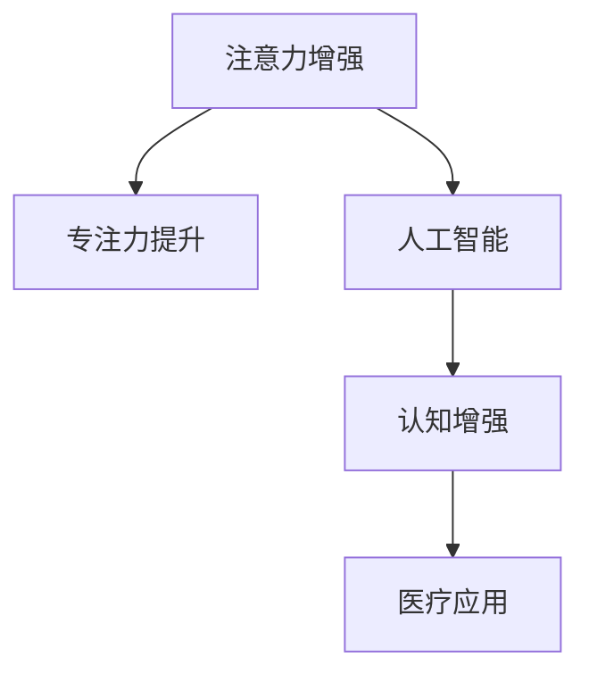

                 

# 人类注意力增强：提升专注力和注意力在医疗中的价值

> 关键词：注意力增强,专注力提升,医疗应用,人工智能,认知增强

## 1. 背景介绍

### 1.1 问题由来

现代社会的信息量爆炸式增长，无论是工作还是学习，注意力不集中、分心等问题已经成为影响效率和成果的关键因素。尤其在医疗领域，医生和护士需要处理大量的患者信息、医学文献，注意力不集中会导致误诊、漏诊、医疗差错等问题，严重影响患者的生命安全和治疗效果。因此，提升医疗工作者的注意力水平和专注力，成为了提高医疗质量、保障患者健康的关键。

### 1.2 问题核心关键点

为了解决这个问题，需要从以下几个方面进行探索：
1. 理解注意力和专注力的科学原理和提升方法。
2. 探索利用人工智能技术，特别是深度学习和认知增强技术，辅助提升注意力和专注力。
3. 研究这些技术在医疗领域的应用，实现对医疗工作者的认知增强。
4. 考虑如何通过技术手段，保障医疗工作者的注意力和专注力，避免因疲劳、压力等负面因素影响医疗质量。

### 1.3 问题研究意义

研究人类注意力增强，特别是如何利用人工智能技术在医疗领域中提升专注力和注意力，具有以下几方面的重要意义：

1. 提升医疗质量和效率。通过提高医生和护士的注意力和专注力，可以减少误诊、漏诊和医疗差错，提高诊断和治疗的准确性。
2. 保障患者健康安全。良好的注意力和专注力有助于医生准确记录病历、分析患者数据，确保患者得到及时有效的治疗。
3. 促进职业健康。降低因注意力不集中导致的职业倦怠和疲劳，提高医疗工作者的满意度和职业成就感。
4. 推动技术创新。研究人类认知增强，将促进人工智能在医疗领域的应用，带来新的技术突破和解决方案。
5. 赋能社会福祉。通过提升医疗工作者的认知能力，实现更高效的医疗资源分配，提升社会的整体健康水平。

## 2. 核心概念与联系

### 2.1 核心概念概述

为更好地理解注意力增强和专注力提升在医疗中的应用，本节将介绍几个关键概念：

- 注意力增强(Attention Enhancement)：通过各种方法，提升个体的注意力水平，使其能够更专注地处理信息。
- 专注力提升(Focus Enhancement)：通过技术手段，帮助个体集中精神，减少分心和干扰，专注于当前任务。
- 人工智能(AI)：利用机器学习、深度学习等技术，实现对人类认知行为的理解和模拟。
- 认知增强(Cognitive Enhancement)：通过技术手段，提升人类的认知能力，包括记忆、理解、注意力等方面。
- 医疗应用(Medical Application)：将认知增强技术应用于医疗领域，提升医疗工作者的认知能力，改善医疗服务。

这些核心概念之间的逻辑关系可以通过以下Mermaid流程图来展示：



这个流程图展示了一些核心概念及其之间的关系：

1. 注意力增强通过人工智能技术实现，帮助提升专注力。
2. 专注力提升可以进一步提升认知能力，尤其是在医疗等高要求领域。
3. 人工智能和认知增强技术在医疗领域的应用，有助于提升医疗工作者的认知能力。
4. 认知增强技术能够有效提升医疗工作者的记忆、理解、注意力等方面能力。

这些概念共同构成了人类认知增强和注意力提升的研究框架，有助于更好地理解如何利用技术手段，提升医疗工作者的认知能力，改善医疗质量。

## 3. 核心算法原理 & 具体操作步骤
### 3.1 算法原理概述

人类注意力增强和专注力提升的算法原理，主要基于神经网络和认知模型，旨在模拟和优化人类注意力和认知过程。其核心思想是通过训练深度神经网络，学习如何分配注意力资源，增强个体对特定信息的关注能力。

### 3.2 算法步骤详解

人类注意力增强和专注力提升的算法步骤一般包括以下几个关键步骤：

**Step 1: 数据准备**
- 收集医疗工作者在执行任务时的注意力水平数据，如脑电波、眼球追踪、行为数据等。
- 对数据进行预处理和标注，例如使用机器学习算法对脑电波进行分类，识别出不同任务状态下的注意力水平。

**Step 2: 模型设计**
- 选择合适的深度神经网络模型，如卷积神经网络(CNN)、循环神经网络(RNN)、变分自编码器(VAE)等，用于学习和模拟注意力过程。
- 设计合适的损失函数和优化算法，例如交叉熵损失、梯度下降等，用于训练模型。

**Step 3: 训练与评估**
- 使用收集到的注意力数据对模型进行训练，最小化注意力预测误差。
- 在验证集上评估模型性能，调整模型参数和超参数。
- 使用测试集对模型进行最终的评估，确保其具有良好的泛化能力。

**Step 4: 应用与优化**
- 将训练好的模型应用于医疗工作者的实际任务中，如诊断、手术、记录病历等。
- 根据反馈调整模型，进一步优化其性能，提升医疗工作者的注意力和专注力。

### 3.3 算法优缺点

人工智能在提升人类注意力和专注力方面，有以下几个优点：
1. 数据分析能力。通过大规模数据训练，模型能够学习到更精准的注意力和认知模式。
2. 实时响应。基于神经网络的技术能够实时监测和调整注意力状态。
3. 多模态融合。结合多种生理和行为数据，综合评估个体的注意力水平。
4. 可解释性。深度学习模型的黑盒特性可以逐渐被解释，帮助理解其决策过程。

同时，也存在一些局限性：
1. 数据获取难度。高质量的注意力和认知数据难以获取，限制了模型的训练。
2. 模型复杂性。深度学习模型训练复杂，需要大量的计算资源。
3. 伦理和安全问题。涉及个体隐私和医疗数据的处理，需要严格的伦理和法规保障。
4. 泛化能力不足。模型的泛化能力依赖于训练数据的代表性和多样性。

尽管存在这些局限性，但基于人工智能的注意力增强和专注力提升技术在医疗领域的应用前景仍然非常广阔。未来研究将更加注重数据获取、模型优化和伦理保障，推动技术向更广、更深、更安全的方向发展。

### 3.4 算法应用领域

基于人工智能的注意力增强和专注力提升技术，已经在医疗领域得到了初步应用，以下是几个典型案例：

1. **脑电波分析**：通过脑电波监测和分析，实时判断医疗工作者的注意力状态，及时调整其注意力水平。这种方法已经在手术室内得到应用，有助于提升手术操作的精度和安全性。

2. **眼球追踪**：利用摄像头和眼球追踪技术，监测医疗工作者的视觉焦点，帮助其更专注地处理患者数据和文档。这种方法已经在医疗记录和诊断过程中得到应用。

3. **多模态认知分析**：结合脑电波、行为数据和眼动数据，综合评估个体的认知状态，提升其在紧张工作环境中的专注力。这种方法已经在多个医疗任务中得到初步验证，表现出良好的效果。

4. **注意力引导**：通过智能提醒和信息推送系统，引导医疗工作者集中注意力在当前任务上，减少干扰。这种方法已经在电子病历和信息检索系统中得到应用。

这些技术在医疗领域的应用，不仅提升了医疗工作者的注意力和专注力，还显著提高了医疗质量和安全。未来，随着技术的进一步发展，将有更多类型的注意力增强和专注力提升方法应用于医疗中。

## 4. 数学模型和公式 & 详细讲解 & 举例说明
### 4.1 数学模型构建

基于人工智能的注意力增强和专注力提升技术，通常使用深度神经网络模型来构建。以下是一个简单的注意力增强模型，包含一个卷积层和一个全连接层：

```
    输入: [B, T, D]
    卷积层: [B, T, D -> B, T, K]
    全连接层: [B, T, K -> B, T, 1]
    输出: [B, T, 1]
```

其中，$B$ 为批次大小，$T$ 为时间步数，$D$ 为输入特征维度，$K$ 为卷积核数量，$1$ 表示输出维度。模型的目标是学习如何将输入特征在不同时间步上分配不同的注意力权重。

### 4.2 公式推导过程

假设输入序列 $X \in \mathbb{R}^{B \times T \times D}$，卷积核数量为 $K$，卷积核大小为 $k$。卷积层输出的特征映射 $Y \in \mathbb{R}^{B \times T \times K}$ 可以表示为：

$$
Y_{b,t,k} = \sum_{i=0}^{T-k} X_{b,i:i+k-1,:} * W_k
$$

其中 $W_k \in \mathbb{R}^{k \times D \times K}$ 为卷积核权重矩阵。

通过卷积层输出的特征映射，再经过全连接层，可以输出注意力权重 $A \in \mathbb{R}^{B \times T \times 1}$。假设全连接层的权重矩阵为 $W_a \in \mathbb{R}^{K \times K \times 1}$，偏置项为 $b_a \in \mathbb{R}^{B \times T \times 1}$，则注意力权重可以表示为：

$$
A_{b,t,1} = \sigma(W_a \cdot Y_{b,t,:} + b_a)
$$

其中 $\sigma$ 为激活函数，如 sigmoid 或 tanh。

### 4.3 案例分析与讲解

假设有一个医疗工作者在记录病历，使用注意力增强模型实时监测其注意力水平。以下是具体案例的分析与讲解：

1. **数据采集**：使用脑电波监测设备，采集医疗工作者的脑电信号 $E \in \mathbb{R}^{B \times T \times D}$，其中 $B=1$ 表示一个样本，$T=500$ 表示时间步数，$D=1$ 表示脑电信号的特征维度。

2. **数据预处理**：对脑电信号进行预处理，例如滤波、归一化等，得到预处理后的信号 $E' \in \mathbb{R}^{B \times T \times D}$。

3. **特征提取**：将预处理后的信号输入卷积层，得到特征映射 $Y \in \mathbb{R}^{B \times T \times K}$。

4. **注意力计算**：通过全连接层计算注意力权重 $A \in \mathbb{R}^{B \times T \times 1}$。

5. **注意力引导**：根据注意力权重，调整医疗工作者的注意力，使其更专注在当前病历记录任务上。

假设注意力权重 $A = [a_1, a_2, ..., a_T]$，表示医疗工作者在各个时间步上的注意力水平。如果 $a_t$ 值较大，则表示医疗工作者在该时间步上注意力集中；如果 $a_t$ 值较小，则表示注意力分散。通过实时监测和调整注意力水平，可以帮助医疗工作者更好地集中精神，提升工作效率和医疗质量。

## 5. 项目实践：代码实例和详细解释说明
### 5.1 开发环境搭建

在进行注意力增强和专注力提升的项目实践前，需要先准备好开发环境。以下是使用Python进行深度学习开发的环境配置流程：

1. 安装Anaconda：从官网下载并安装Anaconda，用于创建独立的Python环境。

2. 创建并激活虚拟环境：
```bash
conda create -n attention-env python=3.8 
conda activate attention-env
```

3. 安装PyTorch：根据CUDA版本，从官网获取对应的安装命令。例如：
```bash
conda install pytorch torchvision torchaudio cudatoolkit=11.1 -c pytorch -c conda-forge
```

4. 安装TensorFlow：由Google主导开发的开源深度学习框架，生产部署方便，适合大规模工程应用。同样有丰富的深度学习模型资源。

5. 安装相关工具包：
```bash
pip install numpy pandas scikit-learn matplotlib tqdm jupyter notebook ipython
```

完成上述步骤后，即可在`attention-env`环境中开始项目实践。

### 5.2 源代码详细实现

以下是使用PyTorch实现注意力增强模型的代码示例：

```python
import torch
import torch.nn as nn
import torch.nn.functional as F

class AttentionModel(nn.Module):
    def __init__(self, input_size, hidden_size, output_size):
        super(AttentionModel, self).__init__()
        self.conv = nn.Conv1d(input_size, hidden_size, 3, padding=1)
        self.fc = nn.Linear(hidden_size, output_size)
        self.activation = nn.Tanh()
        
    def forward(self, x):
        x = x.transpose(1, 2)
        x = self.conv(x)
        x = self.activation(x)
        x = x.transpose(1, 2)
        x = self.fc(x)
        return x

# 定义模型参数
input_size = 1
hidden_size = 32
output_size = 1
model = AttentionModel(input_size, hidden_size, output_size)

# 定义损失函数和优化器
criterion = nn.MSELoss()
optimizer = torch.optim.Adam(model.parameters(), lr=0.01)

# 训练模型
for epoch in range(100):
    # 模拟医疗工作者脑电信号
    x = torch.randn(1, 500, input_size)
    
    # 前向传播
    y = model(x)
    
    # 计算损失
    loss = criterion(y, x)
    
    # 反向传播和优化
    optimizer.zero_grad()
    loss.backward()
    optimizer.step()
    
    # 输出损失
    print(f'Epoch {epoch+1}, Loss: {loss.item()}')
```

### 5.3 代码解读与分析

让我们再详细解读一下关键代码的实现细节：

**AttentionModel类**：
- `__init__`方法：初始化卷积层、全连接层和激活函数。
- `forward`方法：定义模型的前向传播过程。

**训练模型**：
- 模拟医疗工作者的脑电信号 $x$。
- 使用前向传播计算输出 $y$。
- 计算损失 $loss$，使用MSE损失函数。
- 反向传播和优化，使用Adam优化器。
- 输出当前epoch的损失。

以上代码展示了如何使用PyTorch实现一个简单的注意力增强模型。在实际应用中，还需要考虑更多的细节，如数据预处理、模型优化、结果评估等。

## 6. 实际应用场景
### 6.1 智能手术室

在智能手术室中，注意力增强和专注力提升技术可以显著提升医生的手术操作效率和准确性。通过实时监测医生的注意力水平，系统可以及时调整其注意力状态，使其更专注在手术操作上。

具体实现可以包括以下几个步骤：
1. 在手术室内安装脑电波监测设备，实时采集医生的脑电信号。
2. 使用深度学习模型对脑电信号进行分析，输出注意力权重。
3. 根据注意力权重，系统自动调整手术界面和提示，引导医生集中注意力在当前任务上。
4. 通过系统反馈，进一步优化模型，提升医生的注意力和专注力。

### 6.2 医疗记录和诊断

在医疗记录和诊断过程中，注意力增强和专注力提升技术可以帮助医生更高效地处理患者数据。通过实时监测医生的视觉焦点，系统可以提醒其关注重要信息，减少信息遗漏和误诊。

具体实现可以包括以下几个步骤：
1. 在医生工作站上安装摄像头，实时采集医生的视觉数据。
2. 使用深度学习模型对视觉数据进行分析，输出视觉焦点区域。
3. 根据视觉焦点区域，系统自动调整屏幕显示，引导医生关注重要信息。
4. 通过系统反馈，进一步优化模型，提升医生的注意力和专注力。

### 6.3 远程医疗和在线咨询

在远程医疗和在线咨询中，注意力增强和专注力提升技术可以帮助医生更好地处理患者信息，提升服务质量。通过实时监测医生的注意力水平，系统可以及时调整其注意力状态，使其更专注在当前患者咨询上。

具体实现可以包括以下几个步骤：
1. 在医生工作站上安装脑电波监测设备，实时采集医生的脑电信号。
2. 使用深度学习模型对脑电信号进行分析，输出注意力权重。
3. 根据注意力权重，系统自动调整对话界面和提示，引导医生集中注意力在当前患者咨询上。
4. 通过系统反馈，进一步优化模型，提升医生的注意力和专注力。

### 6.4 未来应用展望

随着技术的发展，基于人工智能的注意力增强和专注力提升技术将在更多领域得到应用，为人类认知能力的提升带来新的突破。

在智慧医疗领域，注意力增强技术可以帮助医生更好地处理患者信息，提升诊断和治疗的准确性。在智能客服、教育、娱乐等领域，注意力增强技术也能提升用户的工作和娱乐体验，提高生产效率和生活质量。

未来，随着算力的提升和模型的优化，注意力增强和专注力提升技术将更加高效、智能和可靠。通过多模态数据的融合和优化，模型将能够更好地理解人类注意力和认知过程，实现更精准的注意力引导和认知增强。

## 7. 工具和资源推荐
### 7.1 学习资源推荐

为了帮助开发者系统掌握注意力增强和专注力提升的技术，这里推荐一些优质的学习资源：

1. 《深度学习认知增强》系列博文：由深度学习专家撰写，全面介绍了认知增强技术在深度学习中的应用。

2. 《人工智能与人类认知》课程：由斯坦福大学开设的AI课程，介绍了人工智能和人类认知的交叉领域，包括注意力、记忆、学习等内容。

3. 《人类认知与深度学习》书籍：全面介绍了深度学习在认知科学中的应用，包括认知建模、注意力增强、认知计算等内容。

4. arXiv上的相关论文：arXiv是人工智能领域的权威预印本平台，你可以在这里找到最新的注意力增强和专注力提升研究论文。

5. 认知增强社区：加入认知增强社区，可以获取最新的研究动态和技术分享，结识志同道合的研究者。

通过对这些资源的学习实践，相信你一定能够快速掌握注意力增强和专注力提升技术的精髓，并用于解决实际的认知增强问题。

### 7.2 开发工具推荐

高效的开发离不开优秀的工具支持。以下是几款用于注意力增强和专注力提升开发的常用工具：

1. PyTorch：基于Python的开源深度学习框架，灵活的计算图，适合快速迭代研究。大部分深度学习模型都有PyTorch版本的实现。

2. TensorFlow：由Google主导开发的开源深度学习框架，生产部署方便，适合大规模工程应用。同样有丰富的深度学习模型资源。

3. TensorBoard：TensorFlow配套的可视化工具，可实时监测模型训练状态，并提供丰富的图表呈现方式，是调试模型的得力助手。

4. Weights & Biases：模型训练的实验跟踪工具，可以记录和可视化模型训练过程中的各项指标，方便对比和调优。

5. Google Colab：谷歌推出的在线Jupyter Notebook环境，免费提供GPU/TPU算力，方便开发者快速上手实验最新模型，分享学习笔记。

合理利用这些工具，可以显著提升注意力增强和专注力提升的开发效率，加快创新迭代的步伐。

### 7.3 相关论文推荐

注意力增强和专注力提升技术的发展源于学界的持续研究。以下是几篇奠基性的相关论文，推荐阅读：

1. Attention Is All You Need（即Transformer原论文）：提出了Transformer结构，开启了深度学习在认知增强领域的应用。

2. Rethinking Attention with Transformer-based Models（基于Transformer的注意力重构）：提出了基于Transformer的注意力模型，显著提升了认知增强的效果。

3. Cognitive Enhancements with Deep Learning（深度学习在认知增强中的应用）：全面介绍了深度学习在认知增强领域的理论和实践，包括注意力增强、记忆增强等内容。

4. Attention for Attention in Cognitive Models（认知模型中的注意力注意力）：研究了认知模型中的注意力机制，提出了新的注意力计算方法。

5. Deep Attention Networks for Cognitive Modeling（深度注意力网络在认知建模中的应用）：提出了一种新的深度注意力网络模型，用于模拟人类认知过程。

这些论文代表了大语言模型微调技术的发展脉络。通过学习这些前沿成果，可以帮助研究者把握学科前进方向，激发更多的创新灵感。

## 8. 总结：未来发展趋势与挑战

### 8.1 总结

本文对基于人工智能的注意力增强和专注力提升方法进行了全面系统的介绍。首先阐述了注意力和专注力的科学原理和提升方法，明确了人工智能技术在认知增强方面的应用潜力。其次，从原理到实践，详细讲解了注意力增强和专注力提升的数学模型和关键步骤，给出了注意力增强模型开发的全代码实例。同时，本文还广泛探讨了这些技术在医疗领域的应用前景，展示了人工智能技术在医疗领域的应用前景。

通过本文的系统梳理，可以看到，基于人工智能的注意力增强和专注力提升技术正在成为认知增强的重要范式，极大地拓展了认知增强技术的应用边界，催生了更多的落地场景。受益于深度学习技术的不断演进，注意力增强和专注力提升技术在未来将有更广阔的发展前景。

### 8.2 未来发展趋势

展望未来，人工智能在提升人类注意力和专注力方面将呈现以下几个发展趋势：

1. 多模态融合。结合脑电波、眼动、行为等多种数据源，综合评估个体的注意力和认知状态。
2. 实时监测与反馈。通过实时监测和反馈，动态调整注意力水平，适应任务变化。
3. 个性化定制。根据个体差异，定制不同的注意力增强方案，提升个性化效果。
4. 跨领域应用。将注意力增强技术应用于更多领域，如教育、游戏、娱乐等，提升整体认知能力。
5. 伦理与法规。在技术发展的同时，逐步建立伦理和法规框架，保障个体隐私和数据安全。
6. 人机协同。将注意力增强技术与智能交互系统结合，实现人机协同的智能增强。

以上趋势凸显了人工智能技术在提升人类注意力和专注力方面的广阔前景。这些方向的探索发展，必将进一步提升人工智能技术在医疗、教育、娱乐等领域的认知增强能力，为人类认知智能的进化带来深远影响。

### 8.3 面临的挑战

尽管人工智能在提升人类注意力和专注力方面取得了显著进展，但在实现更高效、更智能、更安全的注意力增强过程中，仍然面临诸多挑战：

1. 数据获取难度。高质量的注意力和认知数据难以获取，限制了模型的训练。
2. 模型复杂性。深度学习模型训练复杂，需要大量的计算资源。
3. 伦理和安全问题。涉及个体隐私和医疗数据的处理，需要严格的伦理和法规保障。
4. 泛化能力不足。模型的泛化能力依赖于训练数据的代表性和多样性。
5. 计算效率。大规模注意力增强模型的计算效率仍需优化。

正视这些挑战，积极应对并寻求突破，将是大语言模型微调走向成熟的必由之路。相信随着学界和产业界的共同努力，这些挑战终将一一被克服，人工智能技术必将在提升人类注意力和专注力方面发挥更大作用。

### 8.4 研究展望

面对人工智能在提升人类注意力和专注力方面所面临的挑战，未来的研究需要在以下几个方面寻求新的突破：

1. 探索无监督和半监督学习。摆脱对大规模标注数据的依赖，利用自监督学习、主动学习等方法，最大限度利用非结构化数据，实现更加灵活高效的认知增强。
2. 研究参数高效和计算高效的认知增强方法。开发更加参数高效的认知增强方法，在固定大部分预训练参数的情况下，只更新极少量的认知相关参数。
3. 引入因果推断和对比学习范式。通过引入因果推断和对比学习思想，增强认知增强模型建立稳定因果关系的能力，学习更加普适、鲁棒的语言表征。
4. 融入更多先验知识。将符号化的先验知识，如知识图谱、逻辑规则等，与神经网络模型进行巧妙融合，引导认知增强过程学习更准确、合理的认知表征。
5. 结合因果分析和博弈论工具。将因果分析方法引入认知增强模型，识别出模型决策的关键特征，增强输出解释的因果性和逻辑性。
6. 纳入伦理道德约束。在认知增强目标中引入伦理导向的评估指标，过滤和惩罚有害的输出倾向，确保输出符合人类价值观和伦理道德。

这些研究方向将推动人工智能技术在提升人类注意力和专注力方面迈向更高的台阶，为构建安全、可靠、可解释、可控的智能系统铺平道路。面向未来，人工智能技术需要在认知增强与伦理道德、数据安全等方向进行更深入的融合，共同推动自然语言理解和智能交互系统的进步。

## 9. 附录：常见问题与解答

**Q1：人类注意力增强技术是否适用于所有人群？**

A: 人类注意力增强技术对大多数人都是适用的，但也存在一些个体差异。例如，某些认知障碍患者可能难以从中获益，或需要特定的调整。此外，不同年龄段、不同职业背景的人群，其注意力需求和认知模式也不同，需要个性化的定制方案。

**Q2：注意力增强技术是否会影响人类的自然注意力？**

A: 人类注意力增强技术的主要目的是辅助提升注意力水平，而不是替代自然注意力。适度使用这些技术，可以在不影响自然注意力机制的情况下，提升个体的认知能力。但过度依赖注意力增强技术，可能会对自然注意力机制产生负面影响。

**Q3：注意力增强技术的安全性和隐私问题如何保障？**

A: 保障注意力增强技术的安全性和隐私性，是确保技术应用的关键。一方面，需要制定严格的伦理和法规框架，保障个体的隐私权和数据安全。另一方面，需要采用隐私保护技术，如差分隐私、联邦学习等，确保数据的匿名性和安全性。

**Q4：注意力增强技术的应用是否会带来新的社会问题？**

A: 任何技术的应用都可能带来新的社会问题。例如，注意力增强技术的过度使用可能引发依赖、过度疲劳等问题。因此，需要在使用技术时，慎重考虑其对个体和社会的影响，合理使用，确保技术应用的正向价值。

**Q5：注意力增强技术如何与其他技术结合？**

A: 注意力增强技术可以与其他技术结合，实现更高效的认知增强。例如，与智能交互系统结合，提升人机协同能力；与情感分析技术结合，增强情感认知和调节能力。通过多技术融合，可以实现更全面、深入的认知增强。

综上所述，人类注意力增强和专注力提升技术在医疗和教育等领域具有广泛的应用前景，但同时也面临着数据获取、模型复杂性、伦理法规等方面的挑战。未来，随着技术的不断演进和优化，这些技术将能够更好地服务于人类认知能力的提升，推动医疗、教育等领域的进步，为人类社会带来深远的变革。

