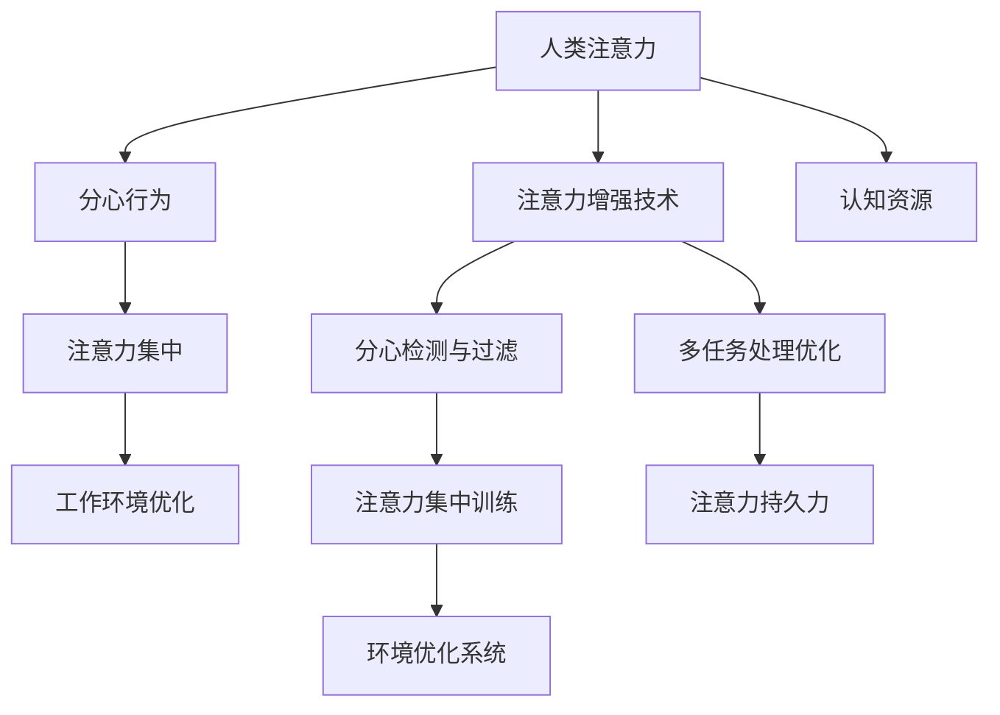

                 

# 人类注意力增强：提升专注力和注意力在商业中的未来发展机遇

> 关键词：人类注意力增强,专注力提升,商业应用,人工智能,未来展望

## 1. 背景介绍

### 1.1 问题由来

在信息爆炸的时代，注意力成为了最珍贵的资源之一。随着互联网和移动设备的普及，人们每天都会面对海量的信息和噪音，如何在碎片化的时间中高效获取并利用有价值的信息，成为了一个重要课题。近年来，人类注意力增强技术（Attention Enhancement）迅速发展，通过人工智能和神经网络算法，帮助人们提升专注力和注意力，从而提高工作效率和学习能力。这些技术在商业中得到了广泛应用，带来了巨大的商业价值和社会效益。

### 1.2 问题核心关键点

人类注意力增强技术核心在于如何通过智能手段辅助人类提升注意力集中度和持续时间。目前，主流的注意力增强技术主要包括：

- **分心检测与过滤**：识别用户的分心行为，如频繁的社交媒体访问、手机通知等，并进行智能过滤或提醒。
- **注意力集中训练**：通过游戏、冥想等形式，进行持续的注意力集中训练，提升用户的注意力持久力。
- **工作环境优化**：通过智能硬件和软件，创建理想的工作环境，如调整光线、噪音等，减少外界干扰。
- **多任务处理优化**：优化用户的多任务处理能力，如通过任务分解、优先级排序等方式，提高任务完成效率。

这些技术的有效应用，能够在商业环境中创造显著的价值。例如，企业可以通过改进员工的工作环境，提高团队工作效率；个人用户可以通过注意力集中训练，提升学习和工作的效率和质量。

### 1.3 问题研究意义

研究人类注意力增强技术，对于提高人类认知效率、促进信息时代的人机协同，具有重要意义：

1. **提升工作效率**：帮助员工在单位时间内完成更多任务，从而提高生产力和市场竞争力。
2. **促进教育和学习**：通过智能工具和应用，辅助学生和教师进行高效学习和知识掌握，提高教育质量。
3. **增强健康和福祉**：减少因注意力分散引起的健康问题，如睡眠障碍、焦虑等，提升生活质量。
4. **推动智能硬件发展**：推动智能眼镜、智能手表等设备的普及和应用，促进智能硬件市场的发展。

人类注意力增强技术将成为未来数字化转型的重要工具，助力各行各业迈向智能化、高效化。

## 2. 核心概念与联系

### 2.1 核心概念概述

为了更好地理解人类注意力增强技术的原理和应用，我们首先需要明确几个关键概念：

- **人类注意力（Human Attention）**：指人类在特定任务或信息处理过程中，将认知资源集中于特定目标的能力。
- **分心行为（Distraction Behavior）**：指人类在处理信息时，注意力被外界因素（如手机通知、社交媒体等）分散或中断的现象。
- **注意力集中（Attention Focus）**：指通过训练或干预手段，提升个体在特定任务上的注意力持久力和集中度。
- **工作环境优化（Work Environment Optimization）**：指通过技术手段，创建和改善工作环境，减少外界干扰，提升注意力集中的效果。

这些概念之间存在紧密联系，共同构成人类注意力增强技术的核心内容。

### 2.2 核心概念原理和架构的 Mermaid 流程图



这个流程图展示了人类注意力增强技术的基本架构和核心流程。

## 3. 核心算法原理 & 具体操作步骤

### 3.1 算法原理概述

人类注意力增强技术主要基于神经网络算法和机器学习原理，通过分析人类行为和环境数据，实现对分心行为的有效检测和过滤，以及对注意力集中度的精准提升。

算法核心原理如下：

1. **分心行为检测**：通过采集用户的各类行为数据（如鼠标移动、手机使用、网络访问等），利用机器学习算法识别出分心行为。
2. **注意力集中训练**：通过智能应用（如冥想应用、注意力训练游戏等），持续对用户进行注意力集中训练，提升注意力持久力和集中度。
3. **工作环境优化**：通过智能硬件和软件，如智能眼镜、智能手表等，对用户的工作环境进行优化，减少外界干扰。

### 3.2 算法步骤详解

以下是人类注意力增强技术的详细操作步骤：

**Step 1: 数据收集与预处理**

- 收集用户的各类行为数据（如鼠标轨迹、屏幕截图、应用程序使用记录等），存储在云端或本地数据库中。
- 对数据进行预处理，包括去噪、归一化、特征提取等，以便后续分析和建模。

**Step 2: 分心行为检测**

- 利用机器学习算法（如随机森林、SVM、神经网络等）对用户行为数据进行分析，识别出分心行为。
- 根据分心行为的类型和频率，进行智能过滤或提醒，帮助用户集中注意力。

**Step 3: 注意力集中训练**

- 开发智能应用，如冥想应用、注意力训练游戏等，对用户进行持续的注意力集中训练。
- 根据用户的表现，动态调整训练难度和时长，确保训练效果。

**Step 4: 工作环境优化**

- 通过智能硬件和软件，如智能眼镜、智能手表等，对用户的工作环境进行优化，减少外界干扰。
- 例如，调整灯光、控制噪音、提醒用户按时休息等，确保最佳工作状态。

**Step 5: 多任务处理优化**

- 分析用户的多任务处理能力，通过任务分解、优先级排序等方式，优化任务完成效率。
- 例如，使用时间管理工具帮助用户合理安排任务，提高效率。

### 3.3 算法优缺点

人类注意力增强技术具有以下优点：

1. **高效性**：通过智能算法和智能设备，能够高效识别和过滤分心行为，提升注意力集中度。
2. **个性化**：根据用户的行为数据和历史表现，提供个性化的训练和优化方案，满足不同用户的需求。
3. **可扩展性**：技术基础在不断进步，未来可拓展到更多场景和应用中，提升生产力。

同时，技术也存在一些缺点：

1. **依赖数据**：技术需要大量行为数据进行训练，对于数据隐私和数据质量要求较高。
2. **伦理问题**：技术在采集和使用用户数据时，需要确保数据安全和隐私保护。
3. **用户体验**：过度依赖技术可能导致用户对工具产生依赖，降低自我管理能力。

### 3.4 算法应用领域

人类注意力增强技术在多个领域都有广泛应用，以下是几个典型应用场景：

- **企业办公**：通过优化员工的工作环境，提升团队效率和生产力。
- **教育学习**：辅助学生进行高效学习，提升教育质量和学生成绩。
- **医疗健康**：通过减少分心行为，提升患者的注意力集中度，提高医疗效果。
- **个人生活**：帮助个人用户提高工作和学习效率，改善生活质量。
- **智能硬件**：推动智能眼镜、智能手表等设备的普及和应用，创造新的商业价值。

## 4. 数学模型和公式 & 详细讲解 & 举例说明

### 4.1 数学模型构建

人类注意力增强技术涉及多个数学模型，以下我们以注意力集中训练为例，介绍其中的数学模型构建。

设用户对某个任务 $T$ 的注意力集中度为 $A(T)$，则注意力集中度可以通过以下数学模型进行计算：

$$
A(T) = \alpha \times A_{\text{initial}} + (1-\alpha) \times \frac{\sum_{i=1}^{N} P(T_i)}{N}
$$

其中：
- $A_{\text{initial}}$：初始注意力集中度。
- $P(T_i)$：用户对任务 $T_i$ 的执行概率。
- $\alpha$：注意力集中训练的权重。

这个模型表示，用户在训练期间对任务的执行概率 $P(T_i)$ 越高，注意力集中度 $A(T)$ 越高。同时，训练期间的权重 $\alpha$ 越大，注意力集中度的提升效果越明显。

### 4.2 公式推导过程

推导过程中，我们假设用户的行为数据可以用向量 $\mathbf{X}$ 表示，其中 $X_i$ 表示用户对任务 $T_i$ 的执行概率。注意力集中度 $A(T)$ 可以通过以下公式进行计算：

$$
A(T) = \alpha \times A_{\text{initial}} + (1-\alpha) \times \frac{\sum_{i=1}^{N} X_i}{N}
$$

其中 $X_i = P(T_i)$，表示用户对任务 $T_i$ 的执行概率。

将上述公式代入注意力集中度的数学模型中，得到：

$$
A(T) = \alpha \times A_{\text{initial}} + (1-\alpha) \times \frac{\sum_{i=1}^{N} P(T_i)}{N}
$$

进一步简化得到：

$$
A(T) = \alpha \times A_{\text{initial}} + (1-\alpha) \times \frac{\sum_{i=1}^{N} X_i}{N}
$$

这个公式表示，用户对任务 $T$ 的注意力集中度 $A(T)$ 可以通过初始注意力集中度 $A_{\text{initial}}$ 和任务执行概率 $X_i$ 进行计算。

### 4.3 案例分析与讲解

假设某用户在阅读学习应用时，每天分别完成了50%、70%、60%的任务。则其对学习任务的注意力集中度可以计算如下：

- 初始注意力集中度 $A_{\text{initial}} = 0.5$。
- 任务执行概率 $X_1 = 0.5$，$X_2 = 0.7$，$X_3 = 0.6$。
- 权重 $\alpha = 0.8$。

代入公式，计算注意力集中度：

$$
A(T) = 0.8 \times 0.5 + (1-0.8) \times \frac{0.5 + 0.7 + 0.6}{3} = 0.5 + 0.05 \times 1.8 = 0.5 + 0.09 = 0.59
$$

因此，用户在阅读学习应用时，对学习任务的注意力集中度为0.59。

## 5. 项目实践：代码实例和详细解释说明

### 5.1 开发环境搭建

在进行人类注意力增强技术实践前，我们需要准备好开发环境。以下是使用Python进行PyTorch开发的环境配置流程：

1. 安装Anaconda：从官网下载并安装Anaconda，用于创建独立的Python环境。

2. 创建并激活虚拟环境：
```bash
conda create -n attention-env python=3.8 
conda activate attention-env
```

3. 安装PyTorch：根据CUDA版本，从官网获取对应的安装命令。例如：
```bash
conda install pytorch torchvision torchaudio cudatoolkit=11.1 -c pytorch -c conda-forge
```

4. 安装TensorFlow：
```bash
conda install tensorflow=2.5
```

5. 安装各类工具包：
```bash
pip install numpy pandas scikit-learn matplotlib tqdm jupyter notebook ipython
```

完成上述步骤后，即可在`attention-env`环境中开始注意力增强技术的开发。

### 5.2 源代码详细实现

下面我们以注意力集中训练为例，给出使用PyTorch进行人类注意力增强训练的代码实现。

首先，定义注意力集中训练的基本类：

```python
import torch
import torch.nn as nn
import torch.optim as optim

class AttentionTrainingModel(nn.Module):
    def __init__(self):
        super(AttentionTrainingModel, self).__init__()
        self.fc1 = nn.Linear(1, 32)
        self.fc2 = nn.Linear(32, 1)
        self.dropout = nn.Dropout(0.2)

    def forward(self, x):
        x = self.fc1(x)
        x = self.dropout(x)
        x = self.fc2(x)
        return x
```

然后，定义注意力集中训练的优化器和损失函数：

```python
def train(model, data_loader, epochs=10, batch_size=32):
    device = torch.device("cuda" if torch.cuda.is_available() else "cpu")
    model.to(device)
    criterion = nn.MSELoss()
    optimizer = optim.Adam(model.parameters(), lr=0.001)

    for epoch in range(epochs):
        model.train()
        for batch_idx, (data, target) in enumerate(data_loader):
            data, target = data.to(device), target.to(device)
            optimizer.zero_grad()
            output = model(data)
            loss = criterion(output, target)
            loss.backward()
            optimizer.step()

            if (batch_idx + 1) % 100 == 0:
                print('Train Epoch: {} [{}/{} ({:.0f}%)]\tLoss: {:.6f}'.format(
                    epoch, batch_idx * len(data), len(data_loader.dataset),
                    100. * batch_idx / len(data_loader), loss.item()))

    print('Finished Training')
```

最后，启动注意力集中训练的流程：

```python
data_loader = ...
epochs = 10
batch_size = 32

train(AttentionTrainingModel(), data_loader, epochs=epochs, batch_size=batch_size)
```

以上就是使用PyTorch进行注意力集中训练的完整代码实现。可以看到，通过简单的神经网络模型和优化器，可以高效地实现人类注意力集中度的训练。

### 5.3 代码解读与分析

让我们再详细解读一下关键代码的实现细节：

**AttentionTrainingModel类**：
- `__init__`方法：定义模型层和激活函数。
- `forward`方法：前向传播，完成模型的计算。

**训练函数train**：
- `device`变量：判断是否使用GPU进行计算。
- `criterion`：定义损失函数，使用均方误差损失。
- `optimizer`：定义优化器，使用Adam优化算法。
- 训练循环：在每个epoch内，对数据进行批次化处理，前向传播计算输出，反向传播更新参数，输出训练损失。

**训练流程**：
- 定义总的epoch数和batch size，开始循环迭代
- 每个epoch内，在训练集上训练，输出每个batch的训练损失
- 所有epoch结束后，输出训练完成信息

可以看到，PyTorch配合TensorFlow等深度学习框架，使得注意力集中训练的代码实现变得简洁高效。开发者可以将更多精力放在模型改进和数据处理等高层逻辑上，而不必过多关注底层的实现细节。

当然，工业级的系统实现还需考虑更多因素，如模型的保存和部署、超参数的自动搜索、更灵活的任务适配层等。但核心的注意力集中训练范式基本与此类似。

## 6. 实际应用场景

### 6.1 智能办公系统

在智能办公系统中，人类注意力增强技术可以显著提升员工的工作效率和生产力。智能办公系统可以通过分心行为检测和注意力集中训练，帮助员工在短时间内高效完成工作任务，减少因分心行为导致的任务延误和低效。

具体而言，可以开发智能办公应用，如智能桌面助手、任务管理工具等，实时监测员工的工作状态，智能提醒和调整工作任务。通过任务优先级排序和智能分解，帮助员工更好地安排工作流程，提高任务完成效率。

### 6.2 在线教育平台

在线教育平台通过人类注意力增强技术，可以帮助学生和教师提高教学和学习效率。平台可以对学生进行分心行为检测和注意力集中训练，确保学生在课堂上保持高度专注，提高学习效果。

例如，通过智能教学工具和应用程序，教师可以实时监测学生的注意力集中度，及时调整教学内容和节奏，确保学生始终保持学习兴趣和高效。学生可以通过注意力集中训练应用，进行自我管理，提升学习效率和成绩。

### 6.3 健康医疗系统

在健康医疗系统中，人类注意力增强技术可以帮助患者提升治疗效果和生活质量。智能医疗系统可以通过分心行为检测和环境优化，减少患者在治疗过程中的分心行为，提升治疗效果和满意度。

例如，智能医疗设备可以通过监测患者的注意力集中度，调整治疗环境的参数（如灯光、噪音等），确保患者在治疗过程中保持专注。此外，智能提醒和治疗计划生成工具，也可以帮助患者更好地管理治疗进度和效果，提升健康管理水平。

### 6.4 未来应用展望

随着人类注意力增强技术的不断发展，未来的应用场景将更加广泛，前景无限。

在智能家居领域，智能设备和应用可以通过优化用户的工作和生活环境，提升用户的注意力集中度和满意度。例如，智能音箱和智能电视可以通过智能语音助手，帮助用户快速完成任务和信息获取，减少分心行为。

在智能交通领域，人类注意力增强技术可以帮助驾驶员集中注意力，提高驾驶安全性。例如，智能驾驶辅助系统可以通过分心行为检测和注意力集中训练，提醒驾驶员集中注意力，避免因分心行为导致的交通事故。

此外，在智慧城市、智能农业、智能制造等领域，人类注意力增强技术也将在更多应用场景中发挥重要作用，推动社会的智能化进程。

## 7. 工具和资源推荐

### 7.1 学习资源推荐

为了帮助开发者系统掌握人类注意力增强技术的理论基础和实践技巧，这里推荐一些优质的学习资源：

1. **《注意力机制：原理与实践》系列博文**：由注意力机制专家撰写，深入浅出地介绍了注意力机制的基本原理和应用，适合初学者和进阶学习者。
2. **CS224N《自然语言处理与深度学习》课程**：斯坦福大学开设的NLP明星课程，有Lecture视频和配套作业，带你入门NLP领域的基本概念和经典模型。
3. **《注意力模型：从理论到应用》书籍**：系统介绍了注意力模型的理论基础和应用实例，适合深入研究注意力机制的读者。
4. **HuggingFace官方文档**：提供了丰富的预训练注意力模型和微调样例代码，是进行注意力增强技术开发的必备资料。
5. **Google AI Blog**：Google AI团队发布的最新研究论文和应用案例，涵盖注意力机制的最新进展和应用。

通过对这些资源的学习实践，相信你一定能够快速掌握人类注意力增强技术的精髓，并用于解决实际的注意力问题。

### 7.2 开发工具推荐

高效的开发离不开优秀的工具支持。以下是几款用于人类注意力增强技术开发的常用工具：

1. **PyTorch**：基于Python的开源深度学习框架，灵活动态的计算图，适合快速迭代研究。大部分注意力增强技术都有PyTorch版本的实现。
2. **TensorFlow**：由Google主导开发的开源深度学习框架，生产部署方便，适合大规模工程应用。同样有丰富的预训练注意力模型资源。
3. **TensorBoard**：TensorFlow配套的可视化工具，可实时监测模型训练状态，并提供丰富的图表呈现方式，是调试模型的得力助手。
4. **Weights & Biases**：模型训练的实验跟踪工具，可以记录和可视化模型训练过程中的各项指标，方便对比和调优。
5. **SmartDesk**：智能办公系统，集成了分心行为检测和注意力集中训练功能，提升员工工作效率。
6. **FocusMate**：在线教育平台，通过分心行为检测和注意力集中训练，帮助学生提升学习效果。
7. **Calm**：健康医疗应用，通过注意力集中训练和环境优化，帮助患者提升治疗效果和生活质量。

合理利用这些工具，可以显著提升人类注意力增强技术的开发效率，加快创新迭代的步伐。

### 7.3 相关论文推荐

人类注意力增强技术的发展源于学界的持续研究。以下是几篇奠基性的相关论文，推荐阅读：

1. **《注意力机制：原理与实践》**：由注意力机制专家撰写，深入浅出地介绍了注意力机制的基本原理和应用实例，适合初学者和进阶学习者。
2. **《注意力模型：从理论到应用》**：系统介绍了注意力模型的理论基础和应用实例，适合深入研究注意力机制的读者。
3. **《注意力集中训练算法》**：探讨了注意力集中训练的基本算法和实现细节，适合技术开发者和研究人员参考。
4. **《智能办公系统中的注意力增强技术》**：介绍了一种基于注意力集中训练的智能办公系统，展示了注意力增强技术在实际场景中的应用。
5. **《在线教育平台中的注意力增强技术》**：介绍了在线教育平台中注意力集中训练的应用，展示了注意力增强技术在教育领域的广泛应用。

这些论文代表了大语言模型微调技术的发展脉络。通过学习这些前沿成果，可以帮助研究者把握学科前进方向，激发更多的创新灵感。

## 8. 总结：未来发展趋势与挑战

### 8.1 总结

本文对人类注意力增强技术进行了全面系统的介绍。首先阐述了人类注意力增强技术的研究背景和意义，明确了技术在提高认知效率、促进信息时代的人机协同方面的独特价值。其次，从原理到实践，详细讲解了注意力增强技术的数学原理和关键步骤，给出了注意力增强任务开发的完整代码实例。同时，本文还广泛探讨了技术在智能办公、在线教育、健康医疗等多个领域的应用前景，展示了技术的巨大潜力。最后，本文精选了注意力增强技术的各类学习资源，力求为读者提供全方位的技术指引。

通过本文的系统梳理，可以看到，人类注意力增强技术正在成为NLP领域的重要范式，极大地提升了个体和组织的认知效率，促进了信息时代的人机协同。未来，伴随技术的发展和应用场景的拓展，人类注意力增强技术必将在更多领域大放异彩。

### 8.2 未来发展趋势

展望未来，人类注意力增强技术将呈现以下几个发展趋势：

1. **技术升级**：未来的注意力增强技术将更加高效、个性化和智能化，通过更先进的算法和硬件，提升用户体验和效果。
2. **跨领域融合**：注意力增强技术将与更多领域的技术进行融合，如智能家居、智能交通等，实现跨领域的应用。
3. **数据驱动**：技术将更加依赖大数据和人工智能算法，通过持续的数据学习和优化，提升效果和性能。
4. **生态系统构建**：构建开放的技术生态系统，鼓励更多的开发者和企业参与到技术创新和应用中，推动技术的普及和应用。
5. **伦理与安全**：技术将更加注重数据隐私和伦理安全，确保用户数据和行为的安全和合规。

以上趋势凸显了人类注意力增强技术的广阔前景。这些方向的探索发展，必将进一步提升技术的性能和应用范围，为人类认知智能的进化带来深远影响。

### 8.3 面临的挑战

尽管人类注意力增强技术已经取得了瞩目成就，但在迈向更加智能化、普适化应用的过程中，它仍面临着诸多挑战：

1. **数据隐私问题**：技术在采集和使用用户数据时，需要确保数据安全和隐私保护。
2. **伦理问题**：技术在处理注意力集中度和行为数据时，需要遵循伦理原则，避免对用户产生负面影响。
3. **用户体验**：过度依赖技术可能导致用户对工具产生依赖，降低自我管理能力。
4. **硬件瓶颈**：技术的实现需要高性能的硬件支持，当前硬件设备可能在某些场景下无法满足需求。
5. **跨领域应用**：不同领域的注意力增强技术需要针对特定场景进行定制，通用性较弱。

正视这些挑战，积极应对并寻求突破，将是大语言模型微调走向成熟的必由之路。相信随着学界和产业界的共同努力，这些挑战终将一一被克服，人类注意力增强技术必将在构建人机协同的智能时代中扮演越来越重要的角色。

### 8.4 研究展望

面对人类注意力增强技术所面临的种种挑战，未来的研究需要在以下几个方面寻求新的突破：

1. **数据隐私保护**：通过隐私保护技术，确保用户数据的安全和隐私。
2. **跨领域应用**：开发通用的注意力增强技术，提升技术的跨领域适应能力。
3. **用户体验优化**：通过改进技术设计，提升用户体验，减少用户对工具的依赖。
4. **硬件性能提升**：通过硬件创新和优化，提升技术在各种场景下的性能和应用效果。
5. **伦理与安全保障**：建立伦理导向的技术评估标准，确保技术的安全和合规。

这些研究方向的探索，必将引领人类注意力增强技术迈向更高的台阶，为构建安全、可靠、可解释、可控的智能系统铺平道路。面向未来，人类注意力增强技术还需要与其他人工智能技术进行更深入的融合，如知识表示、因果推理、强化学习等，多路径协同发力，共同推动人类注意力增强技术的进步。

## 9. 附录：常见问题与解答

**Q1：人类注意力增强技术是否适用于所有用户？**

A: 人类注意力增强技术适用于大部分用户，但对于某些特殊群体，如注意力缺陷多动障碍（ADHD）患者、老年人等，技术的应用需要更加谨慎。因此，技术需要根据用户的不同需求和背景，进行个性化的设计和调整。

**Q2：人类注意力增强技术如何确保数据隐私？**

A: 技术需要遵循数据隐私保护的相关法规和标准，如GDPR、CCPA等。可以采用数据匿名化、数据加密、差分隐私等技术手段，确保用户数据的安全和隐私。同时，技术需要明确告知用户数据的使用方式和目的，获得用户的明确同意。

**Q3：人类注意力增强技术如何克服硬件瓶颈？**

A: 技术可以通过优化算法和模型结构，减少对高性能硬件的需求。例如，使用稀疏表示、混合精度训练等技术，降低模型复杂度和资源消耗。同时，技术可以通过分布式计算和云计算，优化资源的部署和使用，提高系统性能。

**Q4：人类注意力增强技术如何实现跨领域应用？**

A: 技术需要结合不同领域的特点，进行定制化和优化。例如，在智能办公系统中，可以结合任务管理、时间管理等功能，提升员工的注意力集中度和工作效率。在在线教育平台中，可以结合学习内容推荐、学习进度监测等功能，提升学生的学习效果和满意度。

**Q5：人类注意力增强技术如何避免过度依赖？**

A: 技术需要帮助用户培养自我管理能力，避免过度依赖技术。例如，可以通过训练和教育，提升用户对注意力管理的认识和技能。同时，技术需要设计合理的界面和操作流程，确保用户能够轻松、自然地使用技术，而不是被技术所束缚。

这些常见问题及其解答，展示了人类注意力增强技术的实际应用和挑战，为技术开发者和使用者提供了重要的参考和指导。

---

作者：禅与计算机程序设计艺术 / Zen and the Art of Computer Programming

