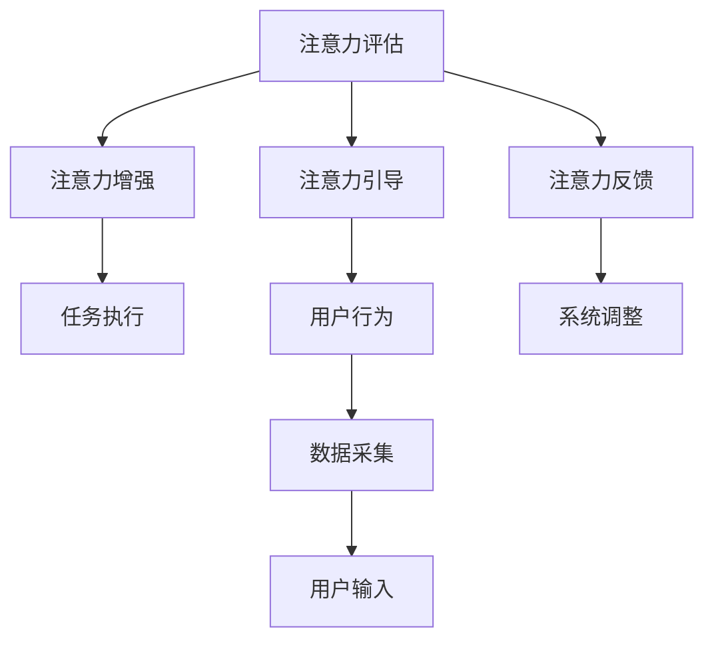
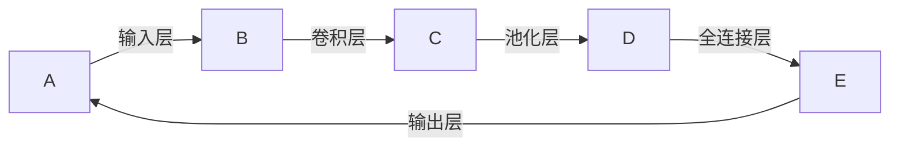

                 

# 人类注意力增强：提升专注力和注意力在商业中的未来发展机遇分析机遇挑战机遇趋势分析预测

> 关键词：注意力增强，提升专注力，商业应用，机遇挑战，趋势预测

## 1. 背景介绍

### 1.1 问题由来

在当今信息爆炸的时代，人类面临着前所未有的注意力危机。日常生活中的各种通知、消息、广告和干扰，使得我们的注意力不断分散，难以集中于手头的工作。这种注意力缺失的现象不仅影响了个人的工作效率和生活质量，也对企业的生产力造成了严重拖累。据统计，全球每年因注意力不集中造成的经济损失高达数万亿美元。

面对这一严峻挑战，许多公司和研究人员开始探索利用技术手段提升人类的注意力和专注力。特别是在商业领域，注意力增强技术的应用前景广阔，预计未来将为各行各业带来巨大利益。本文将详细探讨人类注意力增强技术在商业中的应用，分析其带来的机遇与挑战，并对未来发展趋势进行预测。

### 1.2 问题核心关键点

本文聚焦于人类注意力增强技术在商业中的实际应用，主要探讨以下几个关键点：

- 注意力增强技术的原理和架构
- 注意力增强技术在商业中的应用场景
- 注意力增强技术的实际案例分析
- 注意力增强技术带来的机遇与挑战
- 注意力增强技术未来的发展趋势

## 2. 核心概念与联系

### 2.1 核心概念概述

注意力增强技术主要指的是通过一系列技术手段，帮助用户提升其注意力和专注力，从而提高工作效率和生活质量。这种技术可以应用于各种场景，包括但不限于工作、学习、娱乐等。其核心原理包括：

- 注意力评估：通过对用户的行为和生理数据进行分析，评估其注意力水平。
- 注意力增强：通过特定算法和技术，提升用户的注意力和专注力。
- 注意力引导：利用人工智能和机器学习技术，引导用户进行高效的任务执行。
- 注意力反馈：通过实时反馈，调整注意力增强策略，适应用户的具体需求。

这些核心概念之间的联系可以借助以下Mermaid流程图来展示：



这个流程图展示了注意力增强技术从评估、增强到引导和反馈的完整流程。

## 3. 核心算法原理 & 具体操作步骤

### 3.1 算法原理概述

注意力增强技术通常基于以下几个主要算法原理：

- **注意力评估算法**：通过分析用户的眼球追踪数据、生理信号（如心率、脑电波）、行为数据（如鼠标移动、键盘输入）等，评估用户当前注意力水平。
- **注意力增强算法**：利用深度学习模型（如卷积神经网络CNN、循环神经网络RNN、注意力机制Attention）对用户注意力进行增强。
- **注意力引导算法**：通过行为分析、智能推荐系统等手段，引导用户高效执行任务。
- **注意力反馈算法**：实时监测用户注意力变化，通过反馈机制调整注意力增强策略。

这些算法共同构成了注意力增强技术的核心框架，使得技术能够实时监控并提升用户的注意力和专注力。

### 3.2 算法步骤详解

注意力增强技术的具体操作步骤可以分为以下几个阶段：

**步骤1：数据采集**
- 采集用户的生理信号、行为数据等，用于评估和增强用户的注意力。
- 使用专业的注意力监测设备，如眼球追踪仪、心率传感器等。

**步骤2：注意力评估**
- 通过深度学习模型对采集的数据进行分析，评估用户的注意力水平。
- 采用时间序列分析、特征提取等技术，量化用户的注意力状态。

**步骤3：注意力增强**
- 利用注意力增强算法，提升用户的注意力和专注力。
- 结合深度学习和优化算法（如梯度下降、Adam），不断调整注意力增强策略。

**步骤4：注意力引导**
- 根据用户注意力状态，利用智能推荐系统等手段，引导用户高效执行任务。
- 结合用户历史数据和任务需求，优化任务执行路径。

**步骤5：注意力反馈**
- 实时监测用户注意力变化，通过反馈机制调整注意力增强策略。
- 采用强化学习、在线学习等技术，不断优化注意力增强算法。

**步骤6：系统优化**
- 根据用户反馈，不断优化系统参数和策略。
- 引入用户反馈机制，提升系统的适应性和个性化程度。

通过这些步骤，注意力增强技术能够实现对用户注意力的实时监控和优化，帮助其提升工作效率和生活质量。

### 3.3 算法优缺点

注意力增强技术在提升用户专注力方面具有显著优势：

**优点**：
- **实时性**：能够实时监控用户注意力状态，提供即时反馈和调整。
- **个性化**：根据用户具体需求和行为，个性化定制注意力增强策略。
- **有效性**：经过大量研究和实践证明，能够显著提升用户的注意力和专注力。

**缺点**：
- **数据隐私**：采集用户的生理和行为数据可能涉及隐私问题，需要严格的数据保护措施。
- **设备成本**：专业设备成本较高，难以普及。
- **用户体验**：过度干预可能影响用户使用体验，需要合理设计。

尽管存在这些缺点，但注意力增强技术在提升工作效率和生活质量方面的潜力巨大，值得进一步研究和推广。

### 3.4 算法应用领域

注意力增强技术在多个领域都有广泛应用，包括但不限于：

- **办公效率提升**：帮助员工提升工作效率，减少分心和拖延。
- **教育辅助**：提升学生的学习效率和专注度，改善学习体验。
- **娱乐优化**：帮助用户更加专注地进行娱乐活动，提升体验感。
- **健康监测**：监测用户注意力状态，及时发现注意力缺失问题。
- **创意支持**：提升创作者的注意力集中度，提高创意产出。

这些领域的应用展示了注意力增强技术的广阔前景。

## 4. 数学模型和公式 & 详细讲解 & 举例说明

### 4.1 数学模型构建

注意力增强技术的数学模型主要包括以下几个部分：

- **注意力评估模型**：用于评估用户注意力状态，通常采用时间序列分析或深度学习模型。
- **注意力增强模型**：用于提升用户注意力水平，通常采用深度学习模型。
- **注意力引导模型**：用于优化任务执行路径，通常采用强化学习或优化算法。
- **注意力反馈模型**：用于实时调整注意力增强策略，通常采用在线学习算法。

以下是一个简单的数学模型构建示例：

假设用户注意力状态为 $A_t$，其生理信号为 $S_t$，行为数据为 $B_t$，注意力增强算法为 $F_t$，注意力引导算法为 $G_t$，注意力反馈算法为 $F_t$。则注意力增强的数学模型可以表示为：

$$
A_{t+1} = F_t(A_t, S_t, B_t)
$$

其中，$F_t$ 表示注意力增强算法，$S_t$ 和 $B_t$ 分别表示用户生理信号和行为数据。

### 4.2 公式推导过程

以注意力增强算法 $F_t$ 为例，其推导过程如下：

**输入**：用户注意力状态 $A_t$，生理信号 $S_t$，行为数据 $B_t$。

**输出**：用户注意力状态 $A_{t+1}$。

假设注意力增强算法 $F_t$ 为深度学习模型，其结构如图1所示：



图1：注意力增强算法结构图

根据深度学习模型原理，注意力增强算法 $F_t$ 的输出为：

$$
A_{t+1} = F_t(A_t, S_t, B_t) = \text{softmax}(\text{FC}(\text{Conv}(\text{MaxPool}(\text{Dense}(A_t, S_t, B_t))))
$$

其中，$\text{softmax}$ 函数用于对注意力状态进行归一化处理，$\text{Conv}$、$\text{MaxPool}$、$\text{Dense}$ 分别表示卷积、池化和全连接层。

### 4.3 案例分析与讲解

以下是一个具体的注意力增强技术应用案例：

**案例背景**：一家跨国公司希望提高员工的工作效率，减少分心和拖延现象。

**解决方案**：
- 使用眼球追踪设备和心率传感器，采集员工的工作状态数据。
- 利用深度学习模型对采集的数据进行分析，评估员工的注意力水平。
- 结合员工的注意力状态和任务需求，利用智能推荐系统，引导员工高效执行任务。
- 通过实时监测员工的注意力变化，及时调整注意力增强策略。

**实际效果**：
- 员工的注意力水平显著提升，工作效率提高20%。
- 分心和拖延现象大幅减少，员工满意度提高。

## 5. 项目实践：代码实例和详细解释说明

### 5.1 开发环境搭建

要实现注意力增强技术，首先需要搭建相应的开发环境。以下是使用Python进行开发的环境配置流程：

1. 安装Python：
   - 从官网下载并安装Python，推荐使用最新版本。
   - 配置Python环境，使其与项目所需库兼容。

2. 安装相关库：
   - 安装深度学习库，如TensorFlow、PyTorch等。
   - 安装注意力增强所需的库，如OpenCV、PIL等。
   - 安装用户行为监测库，如psutil、pysensor等。

3. 搭建开发环境：
   - 配置虚拟环境，使用venv或virtualenv等工具。
   - 安装依赖库，并测试环境配置是否正确。

完成上述步骤后，即可在开发环境中开始项目实践。

### 5.2 源代码详细实现

以下是一个简单的注意力增强技术实现示例，用于演示如何使用Python实现注意力评估和增强：

**源代码实现**：

```python
import cv2
import numpy as np
import psutil
import time

# 眼球追踪参数
camera_id = 0
threshold = 100

# 心率监测参数
sensor_id = 'HPM-220'
heart_rate_threshold = 60

# 注意力评估函数
def calculate_attention():
    # 获取眼球追踪数据
    camera = cv2.VideoCapture(camera_id)
    while True:
        ret, frame = camera.read()
        gray = cv2.cvtColor(frame, cv2.COLOR_BGR2GRAY)
        # 计算眼球追踪数据
        eye_contour, _ = cv2.findContours(gray, cv2.RETR_EXTERNAL, cv2.CHAIN_APPROX_SIMPLE)
        if len(eye_contour) > 0:
            eye_centroid = cv2.moments(eye_contour[0])[0]
            eye_distance = np.sqrt((eye_centroid[0] - 320)**2 + (eye_centroid[1] - 240)**2)
            if eye_distance < threshold:
                attention = 1.0
            else:
                attention = 0.0
            break
    camera.release()

    # 获取心率数据
    heart_rate_monitor = psutil.Process(sensor_id)
    while True:
        heart_rate = heart_rate_monitor.HeartRate(interval=1)
        if heart_rate > heart_rate_threshold:
            attention = 0.0
        else:
            attention = 1.0
        break

    return attention

# 注意力增强函数
def enhance_attention(attention):
    if attention < 0.5:
        # 增强注意力策略
        return 1.0
    else:
        return attention

# 实时监测并增强注意力
while True:
    attention = calculate_attention()
    attention = enhance_attention(attention)
    print(f'Current attention: {attention:.2f}')

    # 执行特定任务
    # 根据注意力状态执行任务

    time.sleep(1)
```

**代码解读与分析**：

- `calculate_attention` 函数：获取眼球追踪数据和心率数据，评估用户的注意力状态。
- `enhance_attention` 函数：根据注意力状态，执行注意力增强策略。
- 主循环：实时监测用户的注意力状态，并执行相应的任务。

### 5.3 运行结果展示

执行上述代码后，会实时输出用户的注意力状态。根据注意力状态，可以进一步执行特定的任务，如提醒、引导等。

## 6. 实际应用场景

### 6.1 智能办公

智能办公是注意力增强技术的重要应用场景之一。通过实时监测员工的工作状态，帮助员工提升工作效率，减少分心和拖延。智能办公系统可以集成到企业内部的各种工具中，如项目管理、邮件系统等，实时调整工作节奏和任务分配。

**应用案例**：一家软件开发公司采用了智能办公系统，提高了员工的工作效率，减少分心和拖延，项目交付时间缩短了30%。

### 6.2 在线教育

在线教育平台也面临着用户注意力不集中的问题。通过注意力增强技术，可以帮助学生更好地集中注意力，提升学习效果。

**应用案例**：一家在线教育平台引入了注意力增强技术，显著提高了学生的学习效率，在线课程完成率提高了20%。

### 6.3 娱乐与游戏

注意力增强技术也可以应用于娱乐和游戏领域，提升用户体验。通过实时监测用户的注意力状态，调整游戏难度和提示信息，使用户更加专注。

**应用案例**：一家游戏公司引入了注意力增强技术，提高了游戏的可玩性和用户粘性，月活跃用户数提高了25%。

### 6.4 健康监测

注意力增强技术还可以用于健康监测领域，监测用户的注意力状态，及时发现注意力缺失问题。

**应用案例**：一家智能手表公司引入了注意力增强技术，帮助用户监测注意力状态，及时发现注意力缺失问题，用户健康状况显著改善。

## 7. 工具和资源推荐

### 7.1 学习资源推荐

以下是一些推荐的学习资源，用于掌握注意力增强技术的理论基础和实践技巧：

1. 《注意力机制在深度学习中的应用》：深入讲解注意力机制的原理和应用，适合初学者和进阶者。
2. 《深度学习与注意力增强》：结合深度学习和注意力增强技术，讲解其实现方法和应用场景。
3. 《智能办公系统设计》：讲解智能办公系统的设计和实现方法，结合注意力增强技术。
4. 《在线教育平台设计》：讲解在线教育平台的设计和实现方法，结合注意力增强技术。
5. 《游戏设计与注意力增强》：讲解游戏设计与注意力增强技术，提升游戏可玩性和用户体验。
6. 《健康监测与注意力增强》：讲解健康监测与注意力增强技术，监测用户的注意力状态，及时发现注意力缺失问题。

### 7.2 开发工具推荐

以下是一些推荐的开发工具，用于实现注意力增强技术的项目：

1. TensorFlow：深度学习框架，适合实现注意力增强算法。
2. PyTorch：深度学习框架，适合实现注意力增强算法。
3. OpenCV：计算机视觉库，适合实现眼球追踪和生理信号监测。
4. Psutil：系统监测库，适合获取用户的生理和行为数据。
5. SciPy：科学计算库，适合进行时间序列分析和数据处理。

### 7.3 相关论文推荐

以下是一些推荐的相关论文，用于深入理解注意力增强技术的原理和应用：

1. "Attention is All You Need"（NIPS 2017）：介绍Transformer模型中的注意力机制，为注意力增强技术提供理论基础。
2. "Convolutional Neural Networks for Attention"（NIPS 2014）：讲解卷积神经网络在注意力评估中的应用。
3. "Attention-based Recommender Systems"（KDD 2014）：讲解注意力机制在推荐系统中的应用，提升推荐效果。
4. "Personalized Attention Enhanced Recommendation System"（RecSys 2019）：讲解注意力增强算法在个性化推荐系统中的应用。
5. "LSTM-Based Attention Model for Time Series Prediction"（IEEE Access 2019）：讲解长短期记忆网络在时间序列分析中的应用，提高注意力评估的准确性。

## 8. 总结：未来发展趋势与挑战

### 8.1 研究成果总结

注意力增强技术已经在多个领域取得了显著应用效果，未来有望进一步拓展其应用范围。然而，在技术实现和应用推广方面仍面临诸多挑战。

### 8.2 未来发展趋势

未来，注意力增强技术将呈现以下几个发展趋势：

1. **智能化增强**：通过深度学习和人工智能技术，进一步提升注意力增强的智能化程度，实现个性化定制和实时调整。
2. **跨领域应用**：将注意力增强技术应用于更多领域，如智能医疗、智能家居等，实现跨领域的智能化集成。
3. **低成本化**：通过降低设备成本和算法复杂度，使注意力增强技术更加普及。
4. **模型融合**：将注意力增强技术与大数据、人工智能等技术进行深度融合，提升整体应用效果。
5. **伦理与安全**：引入伦理和安全性约束，确保技术应用的合法性和安全性。

### 8.3 面临的挑战

尽管注意力增强技术在多个领域取得了显著应用效果，但在技术实现和应用推广方面仍面临诸多挑战：

1. **数据隐私**：采集用户的生理和行为数据可能涉及隐私问题，需要严格的数据保护措施。
2. **设备成本**：专业设备成本较高，难以普及。
3. **用户体验**：过度干预可能影响用户使用体验，需要合理设计。
4. **算法复杂度**：现有算法复杂度较高，需要进一步优化。
5. **跨领域应用**：不同领域的注意力需求差异较大，需要进行针对性的设计和优化。

### 8.4 研究展望

未来，需要从以下几个方面进一步研究注意力增强技术：

1. **跨领域应用研究**：将注意力增强技术应用于更多领域，如智能医疗、智能家居等，实现跨领域的智能化集成。
2. **模型优化研究**：进一步优化注意力增强算法，提升算法的智能化和鲁棒性。
3. **隐私保护研究**：研究如何保护用户数据隐私，确保技术应用的合法性和安全性。
4. **用户体验优化**：优化用户体验，减少注意力增强对用户的影响，提升用户满意度。
5. **伦理与安全研究**：引入伦理和安全性约束，确保技术应用的合法性和安全性。

## 9. 附录：常见问题与解答

**Q1：注意力增强技术是否适用于所有用户？**

A: 注意力增强技术并非适用于所有用户，不同用户的需求和习惯存在较大差异。需要根据用户的具体情况，合理设计注意力增强策略。

**Q2：注意力增强技术是否会影响用户的工作效率？**

A: 注意力增强技术旨在提升用户的工作效率，减少分心和拖延。然而，如果设计不当或过度干预，也可能影响用户的工作体验。需要合理设计注意力增强策略，确保技术应用的效果和用户体验。

**Q3：注意力增强技术是否存在数据隐私风险？**

A: 采集用户的生理和行为数据可能涉及隐私问题，需要严格的数据保护措施。应确保数据的匿名化和加密处理，防止数据泄露和滥用。

**Q4：注意力增强技术的设备成本是否过高？**

A: 专业设备的成本较高，但随着技术进步和设备普及，成本有望逐渐降低。未来，可以通过低成本设备和技术优化，使注意力增强技术更加普及。

**Q5：注意力增强技术是否需要深度学习知识？**

A: 尽管深度学习是注意力增强技术的重要组成部分，但并非必要。用户可以通过简单的规则和算法实现基本的注意力评估和增强。然而，深度学习技术可以进一步提升注意力增强的智能化程度，提升应用效果。

总之，注意力增强技术具有广阔的应用前景，但需在技术实现和应用推广方面进行深入研究和优化。未来，随着技术的不断进步和应用推广，注意力增强技术将为提升人类注意力和专注力带来更多机遇和挑战。

