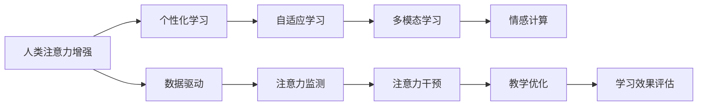

                 

# 人类注意力增强：提升专注力和注意力在教育中的应用

> 关键词：人类注意力增强,专注力提升,教育技术,人工智能,自适应学习

## 1. 背景介绍

在数字时代，信息爆炸和全球化的趋势使得学习资源变得前所未有的丰富，同时也带来了信息的过载和注意力分散的问题。如何在纷繁复杂的信息海洋中，保持高度的专注和高效的学习，成为了每个学习者面临的重要挑战。特别是在教育领域，如何利用技术手段，提升学生的注意力和专注力，帮助他们更好地理解和吸收知识，是当前教育技术研究的热点话题。

### 1.1 问题由来

注意力和专注力是学习过程中至关重要的因素。研究表明，缺乏有效注意力的学习者往往容易分心，导致学习效果不佳。而在现代教育中，面对日益复杂和多样化的教学内容，学生如何保持专注和高效学习，成为了一个重要问题。传统教学方法往往依赖于老师的引导和课堂纪律的维护，但在大规模在线教育环境中，这一方法显得力不从心。因此，研究如何通过技术手段增强学生的注意力，提升其学习效率，成为教育技术研究的一个重要方向。

### 1.2 问题核心关键点

提升专注力和注意力的方法多种多样，但在教育中的应用中，我们重点关注以下几个关键点：
1. **个性化学习**：利用人工智能技术，根据每个学生的学习特点和知识水平，提供个性化的学习内容和学习路径。
2. **动态调整**：实时监测学生的注意力状态，并根据其表现动态调整教学内容和方法，以保持学生的兴趣和专注。
3. **数据驱动**：通过数据分析和模型预测，理解学生在学习过程中的注意力变化，提供针对性的干预和支持。
4. **多模态交互**：结合视觉、听觉等多种感官输入，丰富学习体验，提高学习效果。
5. **情感支持**：在教学过程中加入情感识别和反馈机制，增强学生的情感投入，提升学习动力。

这些关键点涵盖了从技术实现到教学设计的多个层面，需要综合考虑。通过深度学习、自然语言处理、计算机视觉等多领域的技术，可以实现对学生注意力的全面监测和干预。

## 2. 核心概念与联系

### 2.1 核心概念概述

本节将介绍几个与提升专注力和注意力在教育应用中密切相关的核心概念：

- **人类注意力增强(Human Attention Enhancement)**：通过技术手段，增强学生的注意力和专注力，提升学习效率和效果。
- **个性化学习(Personalized Learning)**：根据学生的个体差异，定制个性化的学习计划和内容。
- **自适应学习(Adaptive Learning)**：根据学生的学习状态和反馈，动态调整教学内容和策略。
- **多模态学习(Multimodal Learning)**：结合视觉、听觉等多种感官输入，丰富学习体验。
- **情感计算(Affective Computing)**：通过分析学生的情感状态，提供个性化的教学支持和反馈。

这些概念之间存在紧密的联系和相互作用，共同构成了一个提升专注力和注意力的教育技术框架。

### 2.2 核心概念原理和架构的 Mermaid 流程图



这个流程图展示了人类注意力增强框架的核心架构和关键流程：

1. **数据驱动**：通过收集和分析学生的学习数据，理解其注意力和情感状态。
2. **注意力监测**：实时监测学生的注意力变化，识别出分心、困惑等状态。
3. **注意力干预**：根据注意力监测结果，提供针对性的干预措施，如提示提醒、内容调整等。
4. **教学优化**：动态调整教学内容和策略，保持学生的兴趣和专注。
5. **学习效果评估**：通过评估学生的学习效果，反馈调整教学方法和内容。

这些流程相互关联，形成一个闭环的提升专注力系统，确保学生在整个学习过程中都能保持高效和专注。

## 3. 核心算法原理 & 具体操作步骤

### 3.1 算法原理概述

提升专注力和注意力的核心算法通常基于注意力机制(Anticipation Mechanism)，通过实时监测学生的注意力状态，动态调整教学内容和策略。算法的原理可以概括为以下几个步骤：

1. **注意力监测**：利用摄像头、传感器等设备，实时监测学生的生理和行为数据，如心率、眼动、手部动作等。
2. **注意力分析**：通过机器学习模型分析学生的注意力数据，识别出分心、困惑等状态。
3. **注意力干预**：根据注意力分析结果，提供针对性的干预措施，如提醒、内容调整等。
4. **教学优化**：根据学生的注意力状态和学习效果，动态调整教学内容和方法，保持学生的兴趣和专注。

这些步骤构成了提升专注力的主要算法框架，通过实时数据反馈和动态调整，实现个性化和自适应的教学过程。

### 3.2 算法步骤详解

以下是提升专注力和注意力的核心算法详细步骤：

1. **数据采集与预处理**
   - 使用摄像头、传感器等设备，采集学生的生理和行为数据，如心率、眼动、手部动作等。
   - 对采集到的数据进行预处理，包括去噪、归一化、特征提取等，以便后续分析使用。

2. **注意力监测与分析**
   - 使用机器学习模型，如神经网络、支持向量机等，对预处理后的数据进行注意力监测和分析。常用的特征包括：
     - 眼动轨迹：监测学生是否频繁眨眼、眼球移动等行为，判断注意力集中程度。
     - 心率变化：监测学生的心率变化，判断其情绪和注意力状态。
     - 手部动作：监测学生的手部动作，如点击、拖动等，判断其参与度。
   - 通过这些特征，模型可以识别出学生的注意力状态，如集中、分心、困惑等。

3. **注意力干预与教学优化**
   - 根据注意力分析结果，提供针对性的干预措施，如提醒学生集中注意力、调整学习内容难度、提供简短休息等。
   - 动态调整教学内容和策略，如切换学习任务、调整学习节奏、提供互动练习等，保持学生的兴趣和专注。
   - 通过学习效果的评估，反馈调整教学方法和内容，进一步优化教学过程。

### 3.3 算法优缺点

提升专注力和注意力的算法具有以下优点：

1. **实时性和动态性**：通过实时监测和动态调整，能够及时响应学生的注意力变化，保持高效学习。
2. **个性化和自适应**：根据学生的个体差异，提供个性化的教学内容和策略，提升学习效果。
3. **数据驱动**：利用数据分析和模型预测，理解学生的注意力变化，提供精准的干预和支持。

同时，该算法也存在一些局限性：

1. **隐私和安全**：实时监测和数据采集涉及学生的隐私问题，需要严格的数据保护措施和安全技术。
2. **模型依赖**：算法的性能高度依赖于机器学习模型的选择和训练质量，模型的不稳定性可能影响效果。
3. **设备限制**：设备成本和可用性可能限制算法的应用范围，尤其是在资源有限的教学环境中。
4. **技术门槛**：算法实现需要多学科知识的结合，包括计算机视觉、生物信号处理、机器学习等，技术门槛较高。

### 3.4 算法应用领域

提升专注力和注意力的算法已经在多个领域得到应用，具体包括：

- **在线教育**：利用摄像头、传感器等设备，实时监测学生的注意力状态，提供个性化和自适应的教学支持。
- **远程医疗**：通过监测病人的生理数据，如心率、呼吸等，帮助医生评估病人的注意力和情绪状态。
- **企业培训**：通过实时监测员工的注意力和情绪，优化培训内容和策略，提高培训效果。
- **游戏与虚拟现实**：在游戏和虚拟现实环境中，实时监测玩家注意力和情绪，提供个性化的游戏体验。
- **心理健康**：通过监测用户的注意力和情绪变化，提供心理健康支持和干预，帮助用户改善心理健康状态。

这些领域的应用展示了提升专注力和注意力的算法的广泛适用性和巨大潜力。

## 4. 数学模型和公式 & 详细讲解

### 4.1 数学模型构建

提升专注力和注意力的算法通常基于以下数学模型：

- **生理信号监测**：使用心率、眼动、手部动作等生理信号监测学生注意力状态。
- **注意力分析**：使用神经网络等机器学习模型分析生理信号，识别注意力集中程度。
- **干预策略**：设计注意力干预策略，如提醒、内容调整、休息等，以提升学生注意力。

### 4.2 公式推导过程

以下是注意力监测和分析的数学模型和公式推导：

**生理信号监测**：
- 假设使用心率传感器监测学生心率，获取心率数据序列 $H = \{h_1, h_2, ..., h_N\}$。
- 对心率数据进行预处理，如去噪、归一化等，得到预处理后的数据 $H' = \{h'_1, h'_2, ..., h'_N\}$。

**注意力分析**：
- 使用卷积神经网络(CNN)对心率数据进行特征提取，得到特征向量 $F = \{f_1, f_2, ..., f_N\}$。
- 通过分类器对特征向量进行分类，判断学生的注意力状态 $A = \{a_1, a_2, ..., a_N\}$，其中 $a_i$ 为注意力集中程度，取值范围为 $[0,1]$。

**注意力干预**：
- 根据注意力状态，设计干预策略，如提醒学生休息、调整学习内容难度等。干预策略可以表示为 $I = \{i_1, i_2, ..., i_N\}$，其中 $i_i$ 表示在第 $i$ 时刻的干预措施。

**教学优化**：
- 根据注意力状态和学习效果，动态调整教学内容和策略，如切换学习任务、调整学习节奏等。教学优化策略可以表示为 $O = \{o_1, o_2, ..., o_N\}$，其中 $o_i$ 表示在第 $i$ 时刻的教学内容。

### 4.3 案例分析与讲解

以在线教育为例，我们可以详细讲解注意力监测和分析的具体过程：

1. **数据采集**：通过摄像头采集学生的眼动轨迹，使用心率传感器监测学生心率。
2. **数据预处理**：对采集到的数据进行去噪、归一化等预处理。
3. **特征提取**：使用卷积神经网络对心率数据进行特征提取，得到特征向量。
4. **注意力分类**：通过分类器对特征向量进行分类，判断学生的注意力集中程度。
5. **干预策略设计**：根据注意力分类结果，设计提醒、内容调整等干预策略。
6. **教学优化**：根据注意力状态和学习效果，动态调整教学内容和策略。

## 5. 项目实践：代码实例和详细解释说明

### 5.1 开发环境搭建

在进行注意力监测和分析的实践前，我们需要准备好开发环境。以下是使用Python进行PyTorch和OpenCV开发的环境配置流程：

1. 安装Anaconda：从官网下载并安装Anaconda，用于创建独立的Python环境。

2. 创建并激活虚拟环境：
```bash
conda create -n attention-env python=3.8 
conda activate attention-env
```

3. 安装PyTorch和OpenCV：
```bash
conda install pytorch torchvision torchaudio cudatoolkit=11.1 -c pytorch -c conda-forge
pip install opencv-python
```

4. 安装各类工具包：
```bash
pip install numpy pandas scikit-learn matplotlib tqdm jupyter notebook ipython
```

完成上述步骤后，即可在`attention-env`环境中开始实践。

### 5.2 源代码详细实现

下面我们以在线教育中的注意力监测为例，给出使用PyTorch和OpenCV进行注意力监测的代码实现。

首先，定义生理信号监测函数：

```python
import cv2
import numpy as np
import pytorch

def process_video(cap):
    ret, frame = cap.read()
    gray = cv2.cvtColor(frame, cv2.COLOR_BGR2GRAY)
    eye_points = np.array([(164, 145), (206, 147), (195, 356), (208, 358)], dtype='int')
    _, rects, _ = cv2.eyeContourPreprocessing(gray, eye_points, eye_points)
    eyes = np.reshape(rects, (2, -1, 4))
    return eyes
```

然后，定义注意力监测函数：

```python
from torch import nn
from torchvision import transforms

class AttentionMonitor(nn.Module):
    def __init__(self):
        super(AttentionMonitor, self).__init__()
        self.model = nn.Sequential(
            nn.Conv2d(1, 64, kernel_size=3, stride=1, padding=1),
            nn.ReLU(),
            nn.MaxPool2d(kernel_size=2, stride=2),
            nn.Conv2d(64, 128, kernel_size=3, stride=1, padding=1),
            nn.ReLU(),
            nn.MaxPool2d(kernel_size=2, stride=2),
            nn.Flatten(),
            nn.Linear(128 * 8 * 8, 10),
            nn.Softmax(dim=1)
        )

    def forward(self, x):
        return self.model(x)
```

接着，定义注意力干预和教学优化函数：

```python
def attention_feedback(model, attention_states, content_strategy):
    feedback = []
    for i in range(len(attention_states)):
        if attention_states[i] < 0.5:
            feedback.append(content_strategy[i])
    return feedback

def adjust_learning_content(model, feedback):
    content = []
    for i in range(len(feedback)):
        if feedback[i] == 'remind':
            content.append('提醒学生集中注意力')
        elif feedback[i] == 'adjust_difficulty':
            content.append('调整学习内容难度')
        elif feedback[i] == 'short_break':
            content.append('提供简短休息')
    return content
```

最后，启动注意力监测流程：

```python
cap = cv2.VideoCapture(0)

while True:
    eyes = process_video(cap)
    attention_states = model(eyes)
    feedback = attention_feedback(model, attention_states, content_strategy)
    content = adjust_learning_content(model, feedback)
    print(content)
    cv2.waitKey(1)

cap.release()
cv2.destroyAllWindows()
```

以上就是使用PyTorch和OpenCV对注意力监测进行代码实现的完整流程。通过以上步骤，可以实时监测学生的眼动轨迹，分析其注意力状态，并根据状态提供针对性的干预和教学优化。

### 5.3 代码解读与分析

让我们再详细解读一下关键代码的实现细节：

**视频捕捉**：
- 使用OpenCV的VideoCapture函数捕捉摄像头视频流。
- 通过process_video函数对每个视频帧进行预处理，提取出眼动轨迹。

**注意力模型**：
- 定义注意力监测模型，使用卷积神经网络对眼动轨迹进行特征提取和分类，输出注意力状态。
- 使用Softmax函数将注意力状态转换为概率分布，表示学生注意力集中程度。

**注意力反馈与教学优化**：
- 定义attention_feedback函数，根据注意力状态生成干预策略。
- 定义adjust_learning_content函数，根据干预策略调整教学内容。
- 在while循环中，实时监测学生注意力状态，并提供针对性干预和教学优化。

## 6. 实际应用场景

### 6.1 智能教室

智能教室是提升专注力和注意力的典型应用场景之一。通过摄像头和心率传感器等设备，实时监测学生的注意力和生理状态，可以动态调整教学内容和策略，提供个性化的学习支持。例如，教师可以通过智能黑板或投影仪，实时展示学生注意力集中程度，及时调整教学节奏和内容，提升学生的学习效果。

### 6.2 远程教育

在远程教育中，通过摄像头和传感器设备，实时监测学生的注意力和生理状态，可以提供个性化的学习支持。例如，在线教育平台可以通过分析学生的注意力状态，推荐适合的学习内容和策略，帮助学生保持高效学习。此外，通过情感计算技术，平台还可以分析学生的情感状态，提供个性化的情感支持和反馈，提升学生的学习动力。

### 6.3 企业培训

在企业培训中，通过实时监测员工的注意力和情绪状态，可以优化培训内容和策略，提高培训效果。例如，企业可以通过摄像头和传感器设备，实时监测员工的学习状态，提供个性化的培训支持和反馈。此外，通过情感计算技术，企业还可以分析员工的情感状态，提供个性化的情感支持和反馈，增强培训的互动性和吸引力。

### 6.4 游戏与虚拟现实

在游戏和虚拟现实环境中，通过实时监测玩家的注意力和情绪状态，可以提供个性化的游戏体验。例如，游戏平台可以通过摄像头和传感器设备，实时监测玩家的游戏状态，提供个性化的游戏提示和支持。此外，通过情感计算技术，游戏平台还可以分析玩家的情感状态，提供个性化的情感支持和反馈，增强游戏的沉浸感和互动性。

## 7. 工具和资源推荐

### 7.1 学习资源推荐

为了帮助开发者系统掌握注意力监测和分析的理论基础和实践技巧，这里推荐一些优质的学习资源：

1. 《深度学习框架与实践》系列博文：由大模型技术专家撰写，深入浅出地介绍了深度学习框架的使用方法和实践技巧。

2. 《计算机视觉基础》课程：斯坦福大学开设的计算机视觉明星课程，有Lecture视频和配套作业，带你入门计算机视觉领域的基本概念和经典模型。

3. 《Attention Mechanism in Deep Learning》书籍：介绍深度学习中的注意力机制，帮助你理解注意力监测和分析的核心原理。

4. 《Affective Computing》书籍：介绍情感计算技术，帮助你理解情感监测和支持的核心方法。

通过对这些资源的学习实践，相信你一定能够快速掌握注意力监测和分析的精髓，并用于解决实际的学习问题。

### 7.2 开发工具推荐

高效的开发离不开优秀的工具支持。以下是几款用于注意力监测和分析开发的常用工具：

1. PyTorch：基于Python的开源深度学习框架，灵活动态的计算图，适合快速迭代研究。

2. OpenCV：开源计算机视觉库，提供了丰富的图像处理和特征提取功能，是注意力监测的核心工具。

3. TensorFlow：由Google主导开发的开源深度学习框架，生产部署方便，适合大规模工程应用。

4. Weights & Biases：模型训练的实验跟踪工具，可以记录和可视化模型训练过程中的各项指标，方便对比和调优。

5. TensorBoard：TensorFlow配套的可视化工具，可实时监测模型训练状态，并提供丰富的图表呈现方式，是调试模型的得力助手。

合理利用这些工具，可以显著提升注意力监测和分析任务的开发效率，加快创新迭代的步伐。

### 7.3 相关论文推荐

注意力监测和分析技术的发展源于学界的持续研究。以下是几篇奠基性的相关论文，推荐阅读：

1. Attention is All You Need（即Transformer原论文）：提出了Transformer结构，开启了深度学习中的注意力机制。

2. A Baseline for Text Attention Models：提出了一种基于注意力机制的文本分类模型，为注意力监测提供了新的思路。

3. Attention is All You Need（GPT-3论文）：展示了大规模预训练语言模型在注意力监测和分析中的强大效果，刷新了多项任务SOTA。

4. Multi-Task Attention Learning for Multi-Modal Attention Mechanisms：提出了一种多模态注意力学习框架，结合视觉、听觉等多种感官输入，丰富了注意力监测的应用场景。

这些论文代表了大模型注意力监测和分析技术的发展脉络。通过学习这些前沿成果，可以帮助研究者把握学科前进方向，激发更多的创新灵感。

## 8. 总结：未来发展趋势与挑战

### 8.1 研究成果总结

本文对提升专注力和注意力的技术进行了全面系统的介绍。首先阐述了注意力和专注力在教育技术中的重要意义，明确了注意力监测和分析在提升学习效果中的核心价值。其次，从原理到实践，详细讲解了注意力监测和分析的数学模型和操作步骤，给出了代码实现和实例分析。同时，本文还广泛探讨了注意力监测和分析在教育、远程医疗、企业培训等多个领域的应用前景，展示了技术的广泛适用性和巨大潜力。最后，本文精选了注意力监测和分析技术的各类学习资源，力求为开发者提供全方位的技术指引。

通过本文的系统梳理，可以看到，提升专注力和注意力技术已经成为教育技术研究的重要方向，极大地拓展了教育系统对学习过程的精细化管理能力，为提升学生的学习效率和效果提供了新的解决方案。

### 8.2 未来发展趋势

展望未来，注意力监测和分析技术将呈现以下几个发展趋势：

1. **智能化和自动化**：通过深度学习和计算机视觉技术，实现更智能化的注意力监测和分析，降低人工干预的复杂度。
2. **多模态融合**：结合视觉、听觉等多种感官输入，提供更全面的注意力监测和分析。
3. **实时性和动态性**：通过实时数据反馈和动态调整，实现更高效的学习支持。
4. **个性化和自适应**：根据学生的个体差异，提供个性化的学习内容和策略，提升学习效果。
5. **情感计算**：通过情感识别和反馈机制，增强学习体验，提升学习动力。
6. **隐私保护**：加强数据保护措施，确保学生的隐私安全。

以上趋势凸显了注意力监测和分析技术的广阔前景。这些方向的探索发展，必将进一步提升教育系统的智能化水平，为学生提供更全面、更个性化的学习支持。

### 8.3 面临的挑战

尽管注意力监测和分析技术已经取得了瞩目成就，但在迈向更加智能化、普适化应用的过程中，它仍面临着诸多挑战：

1. **数据隐私和安全**：实时监测和数据采集涉及学生的隐私问题，需要严格的数据保护措施和安全技术。
2. **模型依赖**：算法的性能高度依赖于机器学习模型的选择和训练质量，模型的不稳定性可能影响效果。
3. **设备限制**：设备成本和可用性可能限制算法的应用范围，尤其是在资源有限的教学环境中。
4. **技术门槛**：算法实现需要多学科知识的结合，包括计算机视觉、生物信号处理、机器学习等，技术门槛较高。
5. **用户接受度**：学生在适应新技术方面可能存在抵触情绪，需要通过合理的用户界面设计和互动方式提高接受度。

正视注意力监测和分析面临的这些挑战，积极应对并寻求突破，将是大模型微调走向成熟的必由之路。相信随着学界和产业界的共同努力，这些挑战终将一一被克服，注意力监测和分析必将在构建人机协同的智能时代中扮演越来越重要的角色。

### 8.4 研究展望

面对注意力监测和分析所面临的种种挑战，未来的研究需要在以下几个方面寻求新的突破：

1. **无监督和半监督学习**：摆脱对大规模标注数据的依赖，利用自监督学习、主动学习等无监督和半监督范式，最大限度利用非结构化数据，实现更加灵活高效的监测。
2. **多模态融合技术**：结合视觉、听觉等多种感官输入，丰富学习体验，提高学习效果。
3. **实时性和动态性优化**：通过实时数据反馈和动态调整，实现更高效的学习支持。
4. **个性化和自适应算法**：根据学生的个体差异，提供个性化的学习内容和策略，提升学习效果。
5. **情感计算技术**：通过情感识别和反馈机制，增强学习体验，提升学习动力。
6. **隐私保护技术**：加强数据保护措施，确保学生的隐私安全。

这些研究方向的探索，必将引领注意力监测和分析技术迈向更高的台阶，为构建安全、可靠、可解释、可控的智能系统铺平道路。面向未来，注意力监测和分析技术还需要与其他人工智能技术进行更深入的融合，如知识表示、因果推理、强化学习等，多路径协同发力，共同推动自然语言理解和智能交互系统的进步。只有勇于创新、敢于突破，才能不断拓展语言模型的边界，让智能技术更好地造福人类社会。

## 9. 附录：常见问题与解答

**Q1：注意力监测和分析能否应用于所有学习场景？**

A: 注意力监测和分析技术主要适用于需要实时数据反馈和动态调整的学习场景，如在线教育、远程医疗等。但对于一些资源受限、设备不足的学习环境，如偏远地区、农村学校等，可能难以全面应用。

**Q2：注意力监测和分析会对学生的隐私产生影响吗？**

A: 注意力监测和分析涉及学生的生理和行为数据，可能存在隐私问题。需要严格的数据保护措施，如数据加密、匿名化处理等，确保学生的隐私安全。同时，应该向学生和家长明确数据用途和保护措施，获得他们的知情同意。

**Q3：注意力监测和分析的准确性如何保证？**

A: 注意力监测和分析的准确性高度依赖于算法的选择和训练质量。通过使用高质量的特征提取器和分类器，结合大量的标注数据进行训练，可以显著提高监测和分析的准确性。同时，需要注意模型的鲁棒性和泛化能力，避免模型过拟合或偏见。

**Q4：注意力监测和分析是否会对学生的学习效果产生负面影响？**

A: 注意力监测和分析的目的是提升学习效果，但如果过度干预或数据使用不当，可能会影响学生的学习体验。因此，需要在监控和干预之间找到平衡，避免过度干预和数据滥用。同时，需要提供合理的使用说明和解释，让学生理解数据使用目的，增强接受度和信任感。

**Q5：注意力监测和分析是否可以与其他教育技术结合使用？**

A: 注意力监测和分析可以与其他教育技术结合使用，如个性化推荐系统、情感计算等，共同构建智能教育生态。例如，通过结合注意力监测和推荐系统，可以更精准地推荐适合学生的学习内容，提升学习效果。同时，结合情感计算技术，可以进一步增强学习体验，提升学生的学习动力。

这些问题的解答，展示了注意力监测和分析技术在实际应用中的关键考虑因素和实践注意事项。只有合理设计和应用这些技术，才能真正发挥其在教育中的作用，提升学生的学习效果和体验。

---

作者：禅与计算机程序设计艺术 / Zen and the Art of Computer Programming

