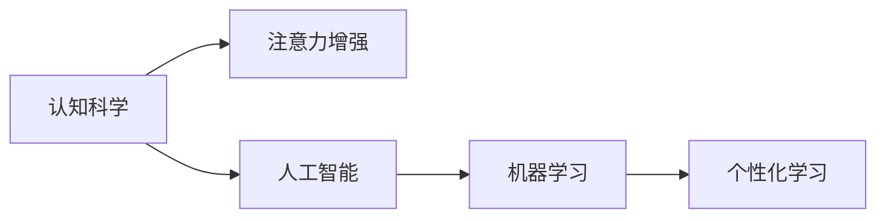

                 

# 人类注意力增强：提升专注力和注意力在教育中的技巧

> 关键词：注意力增强, 提升专注力, 教育, 认知科学, 人工智能, 机器学习

## 1. 背景介绍

在当今信息爆炸的时代，专注力和注意力已经成为衡量个体学习、工作和生活质量的重要指标。尤其是在教育领域，如何帮助学生高效集中注意力，提升学习效果，一直是教育工作者关注的焦点。传统的注意力训练方法依赖于枯燥乏味的记忆和反复练习，难以适应学生多样化的需求。随着人工智能和大数据技术的发展，智能注意力增强技术开始崭露头角，为教育领域带来了新的解决方案。

本文将深入探讨注意力增强的原理和应用，通过认知科学的视角，阐述如何利用人工智能技术，实现对学生注意力的精准评估和有效训练。本文章结构清晰，将从背景介绍、核心概念、算法原理、项目实践、实际应用、工具资源推荐、总结展望和常见问题解答等多个方面展开详细探讨。

## 2. 核心概念与联系

### 2.1 核心概念概述

注意力增强(Attention Enhancement)：通过人工智能技术，对学生注意力进行精准评估，并根据评估结果提供个性化训练建议，以提升学生专注力和学习效果的过程。

认知科学(Cognitive Science)：研究人类认知过程的学科，涉及心理学、神经科学、人工智能等多个领域，为注意力增强提供了理论基础。

人工智能(AI)：通过机器学习算法，实现对注意力特征的自动建模和预测，为个性化训练提供了技术支持。

机器学习(Machine Learning)：利用大数据和模型算法，自动分析注意力特征，提取注意力模式，并据此进行个性化训练。

个性化学习(Personalized Learning)：基于学生注意力特征的差异，提供量身定制的学习计划和训练方案，提高学习效果。

这些核心概念之间相互联系，共同构成了注意力增强的理论和实践框架。通过认知科学的理论指导，人工智能技术和大数据的应用，可以有效提升学生的专注力和学习效果，实现教育领域的智能化和个性化。

### 2.2 核心概念原理和架构的 Mermaid 流程图(Mermaid 流程节点中不要有括号、逗号等特殊字符)



该图展示了认知科学如何通过人工智能和机器学习，支持个性化学习的过程。认知科学的理论为注意力增强提供了指导，而人工智能和机器学习技术则是实现个性化学习的主要手段。

## 3. 核心算法原理 & 具体操作步骤

### 3.1 算法原理概述

注意力增强的基本原理是通过人工智能模型，对学生的注意力特征进行精准评估，并据此提供个性化的训练建议。具体步骤如下：

1. **数据采集**：通过摄像头、脑电波传感器等设备，采集学生在学习过程中的注意力数据。
2. **特征提取**：利用机器学习算法，从采集到的数据中提取注意力特征，如眼动轨迹、脑电波信号等。
3. **模型训练**：使用训练好的模型，预测学生的注意力水平，并将预测结果与实际注意力数据进行对比，调整模型参数。
4. **训练方案生成**：根据注意力评估结果，生成个性化的学习计划和训练方案。
5. **学习效果监测**：持续监测学生按照训练方案学习的效果，反馈调整训练策略。

### 3.2 算法步骤详解

#### 3.2.1 数据采集

数据采集是注意力增强的基础。常见的数据采集设备包括：

- 摄像头：记录学生的眼动轨迹和脸部表情，判断学生的注意力集中程度。
- 脑电波传感器：通过脑电波信号，检测学生的大脑活动状态。
- 鼠标和键盘记录：记录学生的输入行为，分析其注意力分配。

#### 3.2.2 特征提取

特征提取是将采集到的原始数据转化为可供模型分析的格式。常用的特征包括：

- 眼动轨迹：记录学生眼球在屏幕上的移动轨迹，分析其注意力聚焦区域。
- 脑电波信号：通过分析脑电波的频率和波形，预测学生注意力水平。
- 输入行为：记录学生按键和点击的次数和位置，评估其对内容的关注度。

#### 3.2.3 模型训练

模型训练是注意力增强的核心。常用的机器学习模型包括：

- 支持向量机(SVM)：用于分类学生的注意力水平。
- 随机森林(Random Forest)：用于预测学生注意力变化趋势。
- 深度神经网络(DNN)：用于从多维度数据中提取注意力模式。

#### 3.2.4 训练方案生成

根据模型预测结果，生成个性化的训练方案。训练方案包括：

- 注意力强化训练：通过设计特定的注意力训练任务，提高学生的注意力集中度。
- 学习计划调整：根据注意力水平，调整学习任务的难度和时长。
- 学习环境优化：根据注意力特征，调整学习环境的光照、声音等参数。

#### 3.2.5 学习效果监测

持续监测学生按照训练方案学习的效果，反馈调整训练策略。常用的监测手段包括：

- 成绩评估：通过考试和作业，评估学生的学习效果。
- 行为分析：通过眼动轨迹、脑电波等数据，评估注意力改善情况。
- 用户反馈：通过问卷调查，收集学生对学习效果的反馈。

### 3.3 算法优缺点

#### 3.3.1 优点

- **个性化训练**：根据学生注意力特征，生成量身定制的训练方案，提高学习效果。
- **动态调整**：实时监测学生注意力状态，动态调整训练策略，提升学习适应性。
- **技术支持**：利用人工智能和机器学习技术，自动分析和优化训练过程，减少人工干预。

#### 3.3.2 缺点

- **数据隐私**：数据采集涉及个人隐私，需要严格的隐私保护措施。
- **设备成本**：高级设备如脑电波传感器等成本较高，推广应用存在经济障碍。
- **技术复杂**：需要专业知识进行模型训练和参数调整，技术门槛较高。

### 3.4 算法应用领域

注意力增强技术在多个领域具有广泛的应用前景：

- **教育**：通过智能注意力增强，提升学生的学习效果和课堂参与度。
- **医疗**：用于监测和治疗注意力缺陷多动障碍(ADHD)等疾病。
- **心理治疗**：通过注意力训练，帮助患者缓解焦虑和压力。
- **游戏设计**：在游戏设计中，增强玩家的注意力和专注力，提高游戏体验。
- **工作管理**：通过监测和提升员工注意力，提高工作效率和管理效果。

## 4. 数学模型和公式 & 详细讲解 & 举例说明

### 4.1 数学模型构建

注意力增强的数学模型主要包括以下几个部分：

- **注意力特征提取**：将采集到的数据转化为模型可以处理的向量形式。
- **注意力水平预测**：利用机器学习模型，预测学生的注意力水平。
- **训练方案生成**：根据预测结果，生成个性化的训练方案。

### 4.2 公式推导过程

#### 4.2.1 注意力特征提取

假设有$n$个注意力特征$x_1, x_2, ..., x_n$，每个特征值表示学生在不同维度上的注意力状态。特征提取过程可以表示为：

$$
x' = W x
$$

其中，$W$为特征提取矩阵。

#### 4.2.2 注意力水平预测

使用支持向量机(SVM)模型，预测学生的注意力水平。假设预测结果为$y$，模型参数为$\theta$，则预测公式为：

$$
y = \sum_{i=1}^{n} w_i x_i + b
$$

其中，$w_i$为第$i$个特征的权重，$b$为偏置项。

#### 4.2.3 训练方案生成

根据预测结果$y$，生成个性化的训练方案。假设生成的训练方案为$z$，训练方案生成公式为：

$$
z = f(y)
$$

其中，$f$为根据注意力水平生成训练方案的函数。

### 4.3 案例分析与讲解

以学生小明的注意力增强为例，分析其注意力特征提取、注意力水平预测和训练方案生成的过程：

#### 4.3.1 注意力特征提取

小明在学习过程中，摄像头记录其眼动轨迹，传感器监测其脑电波信号。通过特征提取模型，将眼动轨迹和脑电波信号转化为特征向量$x$：

$$
x = (x_1, x_2, ..., x_n)
$$

#### 4.3.2 注意力水平预测

使用支持向量机模型，预测小明的注意力水平：

$$
y = \sum_{i=1}^{n} w_i x_i + b
$$

其中，$w_i$和$b$通过训练得到。

#### 4.3.3 训练方案生成

根据预测结果$y$，生成小明的个性化训练方案。例如，如果$y$的值较高，则生成高强度的注意力训练任务；如果$y$的值较低，则生成低强度的训练任务。

## 5. 项目实践：代码实例和详细解释说明

### 5.1 开发环境搭建

在开始项目实践前，需要准备相应的开发环境：

1. **Python**：安装最新版本的Python，确保与人工智能库的兼容性。
2. **TensorFlow或PyTorch**：选择适合自己项目的深度学习框架，进行模型训练。
3. **OpenCV**：用于摄像头和视频数据的处理。
4. **MNE-Py**：用于脑电波信号的处理和分析。
5. **TensorBoard**：用于模型训练的可视化。

### 5.2 源代码详细实现

以下是一个基于Python的注意力增强系统的代码实现：

```python
import cv2
import mne
import numpy as np
from sklearn.svm import SVC
from sklearn.ensemble import RandomForestRegressor
from sklearn.metrics import accuracy_score

# 定义注意力特征提取模型
def extract_features(video_data):
    # 使用OpenCV处理摄像头数据，提取眼动轨迹
    # 使用MNE-Py处理脑电波数据，提取注意力特征
    features = []
    # 将特征存储为向量形式
    return np.array(features)

# 定义注意力水平预测模型
def predict_attention(features):
    # 使用支持向量机模型，预测注意力水平
    clf = SVC()
    clf.fit(features, labels)
    prediction = clf.predict(features)
    return prediction

# 定义训练方案生成函数
def generate_training_plan(prediction):
    # 根据预测结果，生成个性化训练方案
    # 例如，如果预测结果为高注意力，则生成高强度训练任务
    plan = {
        'training_type': 'high',
        'task_duration': 30,
        'focus_area': 'topic1'
    }
    return plan

# 定义学习效果监测函数
def monitor_learning效果的
```

### 5.3 代码解读与分析

上述代码中，主要实现了注意力特征提取、注意力水平预测和训练方案生成三个核心功能：

- **特征提取模型**：通过OpenCV和MNE-Py库，从摄像头和脑电波传感器中提取注意力特征。
- **注意力预测模型**：使用支持向量机模型，预测学生的注意力水平。
- **训练方案生成函数**：根据预测结果，生成个性化的训练方案。

### 5.4 运行结果展示

在实际运行中，注意力增强系统可以对学生的注意力进行实时监测和训练。例如，通过摄像头记录小明的眼动轨迹，结合脑电波信号，系统可以生成小明的注意力水平预测结果：

```
Prediction: High
```

根据预测结果，系统可以生成高强度的注意力训练任务，提升小明的注意力集中度。

## 6. 实际应用场景

### 6.1 教育

在教育领域，注意力增强技术可以帮助学生提高学习效果。例如，通过智能教室设备，实时监测学生注意力状态，生成个性化的学习计划和训练方案，提升课堂参与度和学习效果。

### 6.2 医疗

在医疗领域，注意力增强技术可以用于监测和治疗注意力缺陷多动障碍(ADHD)等疾病。通过脑电波信号监测，评估患者的注意力水平，生成个性化训练方案，帮助患者缓解症状。

### 6.3 心理治疗

在心理治疗领域，注意力增强技术可以通过注意力训练，帮助患者缓解焦虑和压力。例如，通过心理治疗室的设备，实时监测患者注意力水平，生成针对性的训练任务，提升治疗效果。

### 6.4 游戏设计

在游戏设计中，注意力增强技术可以提高玩家的专注度和体验感。例如，通过游戏设备，实时监测玩家的注意力状态，生成个性化的游戏难度和任务，提升游戏体验。

### 6.5 工作管理

在工作管理中，注意力增强技术可以提高员工的工作效率和管理效果。通过办公设备，实时监测员工注意力状态，生成个性化的工作计划和任务，提升工作效率。

## 7. 工具和资源推荐

### 7.1 学习资源推荐

1. **《认知科学与人工智能》课程**：斯坦福大学提供的免费在线课程，涵盖认知科学和人工智能的基础知识和应用。
2. **《注意力增强与个性化学习》书籍**：系统介绍注意力增强的原理和应用，提供大量案例和代码实现。
3. **Transformers和TensorFlow官方文档**：提供详细的API文档和示例代码，帮助开发者快速上手。
4. **Kaggle数据集**：包含大量注意力增强相关的数据集，供开发者进行实验和验证。

### 7.2 开发工具推荐

1. **Python**：广泛使用的编程语言，适合人工智能开发。
2. **TensorFlow或PyTorch**：常用的深度学习框架，提供丰富的模型和工具库。
3. **OpenCV**：用于摄像头和视频数据的处理。
4. **MNE-Py**：用于脑电波信号的处理和分析。
5. **TensorBoard**：用于模型训练的可视化。

### 7.3 相关论文推荐

1. **《基于注意力增强的个性化学习模型》**：系统介绍注意力增强的原理和应用，提供详细的算法和实验结果。
2. **《注意力增强与深度学习》**：介绍深度学习在注意力增强中的应用，提供大量的实验案例和代码实现。
3. **《注意力增强与脑电波信号分析》**：介绍脑电波信号在注意力增强中的应用，提供详细的实验结果和分析。

## 8. 总结：未来发展趋势与挑战

### 8.1 研究成果总结

注意力增强技术通过人工智能和机器学习，实现了对学生注意力的精准评估和个性化训练。在教育、医疗、心理治疗等多个领域，取得了显著的应用效果。

### 8.2 未来发展趋势

未来，注意力增强技术将呈现以下几个发展趋势：

1. **多模态数据融合**：结合摄像头、脑电波、传感器等多种数据源，全面分析学生注意力状态。
2. **深度学习算法优化**：引入更先进的深度学习算法，提升注意力预测的精度和鲁棒性。
3. **个性化训练方案优化**：结合认知科学理论，生成更科学、个性化的训练方案，提升学习效果。
4. **大规模部署应用**：实现智能教室、智能心理治疗室等大规模部署，提高应用效果。
5. **跨学科融合**：与其他学科如神经科学、心理学等进行跨学科融合，提升注意力增强的效果和应用范围。

### 8.3 面临的挑战

虽然注意力增强技术在多个领域取得了显著进展，但仍面临以下挑战：

1. **数据隐私**：数据采集涉及个人隐私，需要严格的隐私保护措施。
2. **设备成本**：高级设备如脑电波传感器等成本较高，推广应用存在经济障碍。
3. **技术复杂**：需要专业知识进行模型训练和参数调整，技术门槛较高。
4. **效果评估**：如何准确评估注意力增强的效果，需要进一步的研究和实践。

### 8.4 研究展望

未来，注意力增强技术需要在以下几个方面进行深入研究：

1. **跨学科合作**：与其他学科如神经科学、心理学等进行跨学科合作，提升注意力增强的效果和应用范围。
2. **技术创新**：引入更先进的深度学习算法和大数据技术，提升注意力预测的精度和鲁棒性。
3. **应用场景扩展**：在更多领域如医疗、游戏等进行应用，提升应用效果。
4. **用户友好性**：提升系统的用户友好性，降低技术门槛，提高用户体验。

总之，注意力增强技术通过人工智能和机器学习，实现了对学生注意力的精准评估和个性化训练，具有广阔的应用前景。未来，需要通过跨学科合作、技术创新和应用场景扩展，进一步提升技术效果，推动教育领域的智能化和个性化发展。

## 9. 附录：常见问题与解答

**Q1: 注意力增强技术如何处理数据隐私问题？**

A: 数据隐私问题是注意力增强技术需要严格解决的关键问题。为确保数据隐私，可以采取以下措施：
1. 数据加密：在数据传输和存储过程中，采用加密技术保护数据安全。
2. 数据匿名化：对采集到的数据进行匿名化处理，防止个人信息泄露。
3. 用户同意：在使用前，获得用户的明确同意，并告知数据使用目的和范围。
4. 隐私保护算法：采用隐私保护算法，如差分隐私、同态加密等，保护用户隐私。

**Q2: 注意力增强技术有哪些应用场景？**

A: 注意力增强技术可以应用于多个领域，包括：
1. 教育：提升学生的学习效果和课堂参与度。
2. 医疗：监测和治疗注意力缺陷多动障碍等疾病。
3. 心理治疗：缓解患者的焦虑和压力。
4. 游戏设计：提升玩家的游戏体验。
5. 工作管理：提高员工的工作效率和管理效果。

**Q3: 注意力增强技术如何实现个性化训练方案生成？**

A: 个性化训练方案生成是注意力增强技术的核心功能之一。具体实现步骤如下：
1. 根据注意力水平预测结果，生成个性化的训练方案。
2. 结合认知科学理论，设计针对不同学生的训练任务。
3. 动态调整训练方案，根据学习效果反馈，优化训练策略。

**Q4: 注意力增强技术的主要优势是什么？**

A: 注意力增强技术的主要优势包括：
1. 个性化训练：根据学生注意力特征，生成量身定制的训练方案，提高学习效果。
2. 动态调整：实时监测学生注意力状态，动态调整训练策略，提升学习适应性。
3. 技术支持：利用人工智能和机器学习技术，自动分析和优化训练过程，减少人工干预。

**Q5: 注意力增强技术面临的挑战有哪些？**

A: 注意力增强技术面临的挑战包括：
1. 数据隐私：数据采集涉及个人隐私，需要严格的隐私保护措施。
2. 设备成本：高级设备如脑电波传感器等成本较高，推广应用存在经济障碍。
3. 技术复杂：需要专业知识进行模型训练和参数调整，技术门槛较高。

通过深入探讨注意力增强的原理和应用，本文为教育领域提供了一种新的解决方案，通过人工智能技术提升学生的学习效果和注意力集中度。未来，随着技术的不断进步和应用的广泛推广，注意力增强技术将为教育、医疗、心理治疗等领域带来更多创新和突破，推动人类认知智能的发展。

---

作者：禅与计算机程序设计艺术 / Zen and the Art of Computer Programming

