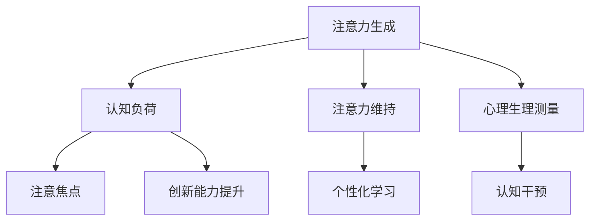

                 

# 人类注意力增强：提升创新能力和创造力管理策略

> 关键词：
    - 人类注意力增强
    - 创新能力提升
    - 创造力管理策略
    - 注意力模型
    - 脑机接口
    - 心理生理测量
    - 认知负荷
    - 数据科学
    - 个性化学习
    - 认知干预

## 1. 背景介绍

### 1.1 问题由来
创新与创造力是人类发展的核心驱动力，对个人、团队乃至国家竞争力的提升具有深远影响。然而，在快速变化的信息时代，人类面临的认知负荷日益增加，工作和生活节奏的加快，使得专注力、注意力等核心认知能力面临严峻挑战。

尽管现代科技日益发达，但在提升创新能力和创造力方面，依然面临诸多难题。如何充分利用现有科技手段，增强人类注意力，提高创新与创造效率，成为当今科研和产业界共同关注的热点。

### 1.2 问题核心关键点
人类注意力的增强主要围绕以下几个关键问题展开：

- 注意力如何生成与维持：理解注意力的生物学基础，揭示注意力和认知负荷的关系。
- 技术手段与创新能力提升：探索应用脑科学、神经工程等前沿科技，提升个体和团队的创新水平。
- 创造力管理与策略优化：研究在团队协作、教育训练等不同场景中，如何通过注意力管理策略优化创新与创造过程。
- 数据科学与认知干预：通过数据驱动的方式，实现对注意力的个性化调控，帮助个体提升认知表现。

这些问题不仅影响个人的创新产出，还关系到社会经济和科技发展的可持续性。本文聚焦于以上核心关键点，阐述人类注意力增强的具体策略和方法，探讨其在提升创新能力和创造力方面的应用潜力。

### 1.3 问题研究意义
研究人类注意力增强，对于提升个人和团队的创新能力与创造力，具有重要意义：

1. 促进个体与团队协作：通过增强个体注意力，优化团队成员间的沟通与协作，提高决策效率和工作效率。
2. 加速知识生产与传播：通过提升个体认知能力，增强知识吸收与创新能力，推动知识经济快速发展。
3. 改善学习与培训效果：通过优化认知负荷，提高学习效率与培训质量，促进教育水平的提升。
4. 激发更多创新产出：通过系统地管理与增强注意力，激发个体潜在的创新思维，推动技术进步与产业升级。

总之，通过科学地理解与增强人类注意力，可以帮助个体和团队在更高效的认知状态下开展工作，从而提升整体社会的创新力和创造力水平。

## 2. 核心概念与联系

### 2.1 核心概念概述

为更好地理解人类注意力增强的相关概念，本节将介绍几个关键概念，并通过以下Mermaid流程图来展示它们之间的联系。



### 2.2 核心概念原理和架构的 Mermaid 流程图

**2.2.1 注意力生成**
注意力生成是指在信息处理过程中，个体如何选择、筛选和集中于关键信息，以及如何进行内部资源分配。注意力生成依赖于认知系统中的信息处理单元，如大脑皮层、丘脑等，以及顶叶、额叶等脑区的协同作用。

**2.2.2 认知负荷**
认知负荷是指在认知活动中，个体需要处理的信息量和复杂度。认知负荷过高时，会导致注意力分散，工作效率降低。通过控制和优化认知负荷，可以有效增强注意力。

**2.2.3 注意焦点**
注意焦点是指个体在特定时刻关注的信息单元，可以是词语、图像、声音等。注意焦点的选择和维持依赖于注意力的调控机制，同时也受到任务目标、个体动机等多种因素的影响。

**2.2.4 注意力维持**
注意力维持是指在长时间信息处理过程中，个体如何维持注意力的集中状态，避免分心和疲劳。注意力维持依赖于生理因素（如神经递质、睡眠周期等）和心理因素（如动机、情绪等）的协同作用。

**2.2.5 心理生理测量**
心理生理测量是通过监测脑电、心率、血压等生理指标，以及任务表现、情绪状态等心理指标，了解个体的注意力状态和认知负荷，为干预措施提供依据。

**2.2.6 创新能力提升**
创新能力提升是指通过优化注意力和认知负荷，增强个体在创造性任务中的表现，如问题解决、设计、发明等。创新能力提升依赖于个体的认知灵活性、知识储备、想象力等。

**2.2.7 个性化学习**
个性化学习是指根据个体的认知特点和注意力状态，设计适应性强的学习方案，提升学习效率和效果。个性化学习依赖于对个体注意力和认知负荷的实时监测与评估。

**2.2.8 认知干预**
认知干预是指通过技术手段，如脑机接口、认知负荷优化等，对个体的注意力和认知负荷进行干预，增强其认知表现。认知干预依赖于科学的理论指导和技术的支持。

通过以上流程图可以看出，注意力生成与维持是认知活动的基础，而心理生理测量、认知负荷控制、个性化学习与认知干预等手段，可以为提升个体与团队的创新能力提供有效支持。

## 3. 核心算法原理 & 具体操作步骤
### 3.1 算法原理概述

人类注意力增强的算法原理主要基于神经认知科学和计算神经科学的研究成果，旨在通过优化个体注意力和认知负荷，提升创新与创造能力。

**3.1.1 注意力生成与维持**
注意力生成和维持依赖于认知系统中的信息处理单元，以及这些单元之间的相互作用。通过对注意力生成和维持机制的建模，可以揭示注意力如何响应不同的环境刺激和任务目标。

**3.1.2 认知负荷控制**
认知负荷控制依赖于对信息处理单元的工作效率和资源分配进行优化。通过监测认知负荷，可以及时调整任务难度和工作节奏，减少注意力分散和疲劳。

**3.1.3 创新能力提升**
创新能力提升依赖于个体在创造性任务中的表现，包括问题解决、设计、发明等。通过对注意力和认知负荷的优化，可以增强个体在创造性任务中的表现。

### 3.2 算法步骤详解

**Step 1: 数据采集与预处理**
- 使用脑电、心率、血压等生理测量仪器，采集个体的生理指标。
- 使用任务表现、情绪状态等心理测量工具，采集个体的心理指标。
- 对采集到的数据进行预处理，包括去噪、归一化等。

**Step 2: 认知负荷分析**
- 使用认知负荷计算模型，分析个体的认知负荷状态。
- 根据认知负荷分析结果，调整任务难度和工作节奏。
- 通过调整任务难度和工作节奏，优化注意力维持。

**Step 3: 注意力增强与创新能力提升**
- 使用注意力增强算法，如基于信息的注意力调控、认知负荷优化等，提升个体的注意力表现。
- 在注意力增强的基础上，通过认知负荷控制、个性化学习等策略，提升创新能力。
- 对提升后的创新能力进行评估，调整策略和参数，持续优化。

**Step 4: 反馈与迭代**
- 根据评估结果，调整认知负荷控制策略和注意力增强算法。
- 根据评估结果，优化个性化学习方案。
- 通过持续反馈和迭代，逐步提升个体的创新能力。

### 3.3 算法优缺点

人类注意力增强算法具有以下优点：
1. 技术手段多样：可以结合多种技术手段，如脑机接口、认知负荷优化等，实现更全面的注意力管理。
2. 提升效果显著：通过优化认知负荷和注意力，可以显著提升个体在创造性任务中的表现。
3. 适用范围广：适用于不同职业、不同年龄、不同心理特征的人群。
4. 可实现个性化：通过数据驱动的方式，实现对注意力的个性化调控，提高个体的工作效率和学习效果。

同时，该算法也存在一定的局限性：
1. 数据采集复杂：需要多种仪器和工具，数据采集和预处理较为复杂。
2. 实时性要求高：算法需要实时监测和反馈，对数据处理速度要求较高。
3. 干预效果难以量化：注意力的增强和认知负荷的优化，其效果较难量化评估。
4. 依赖技术发展：算法依赖于最新的神经科学研究成果和先进技术，需要持续更新和迭代。

### 3.4 算法应用领域

人类注意力增强算法主要应用于以下几个领域：

**3.4.1 教育培训**
通过实时监测学生的注意力和认知负荷，调整教学内容和节奏，增强学生的学习效果和创新能力。

**3.4.2 职业培训**
在职业培训中，通过优化认知负荷和注意力，提升员工的学习效率和创新能力，加速技能提升和知识更新。

**3.4.3 创意设计**
在创意设计中，通过增强设计师的注意力，优化创意过程，提升设计质量和创新能力。

**3.4.4 科研创新**
在科学研究中，通过优化科研人员的注意力和认知负荷，加速知识获取和创新产出，推动科研进步。

**3.4.5 产品开发**
在新产品开发中，通过增强工程师的注意力，优化产品设计和创新过程，提升产品竞争力。

**3.4.6 企业管理**
在企业管理中，通过优化员工注意力和认知负荷，提升团队协作效率和工作质量，推动企业发展。

## 4. 数学模型和公式 & 详细讲解
### 4.1 数学模型构建

在人类注意力增强的算法中，数学模型主要涉及注意力生成和维持、认知负荷控制、创新能力提升等几个方面。

**4.1.1 注意力生成与维持**
设个体在处理信息时，注意力生成与维持的模型为 $\mathcal{A}(t)$，其中 $t$ 为时间。注意力生成的影响因素包括任务难度、个体动机、环境刺激等，可以通过以下公式表示：

$$
\mathcal{A}(t) = f(\text{任务难度}, \text{动机}, \text{环境刺激}, \ldots)
$$

其中 $f$ 为非线性函数，表示不同因素对注意力生成的综合影响。

**4.1.2 认知负荷控制**
设个体在处理信息时，认知负荷的控制模型为 $\mathcal{C}(t)$，其中 $t$ 为时间。认知负荷控制依赖于个体的认知资源和工作效率，可以通过以下公式表示：

$$
\mathcal{C}(t) = g(\mathcal{A}(t), \text{工作节奏}, \text{认知资源}, \ldots)
$$

其中 $g$ 为非线性函数，表示不同因素对认知负荷的综合影响。

**4.1.3 创新能力提升**
设个体在创造性任务中，创新能力提升的模型为 $\mathcal{I}(t)$，其中 $t$ 为时间。创新能力提升依赖于个体在任务中的注意力状态和认知负荷，可以通过以下公式表示：

$$
\mathcal{I}(t) = h(\mathcal{A}(t), \mathcal{C}(t), \text{知识储备}, \text{想象力}, \ldots)
$$

其中 $h$ 为非线性函数，表示不同因素对创新能力的综合影响。

### 4.2 公式推导过程

以下以注意力生成与维持的模型为例，进行公式推导。

假设个体在处理信息时，注意力生成受以下因素影响：
- 任务难度 $D$：任务越复杂，所需注意力越高。
- 动机 $M$：动机越强，注意力越集中。
- 环境刺激 $S$：环境越刺激，注意力越容易分散。

则注意力生成的模型可以表示为：

$$
\mathcal{A}(t) = \frac{D(t)}{S(t)} M(t) + \epsilon(t)
$$

其中 $D(t)$ 表示任务难度随时间的变化，$S(t)$ 表示环境刺激随时间的变化，$M(t)$ 表示动机随时间的变化，$\epsilon(t)$ 表示随机扰动项。

通过对以上模型进行优化，可以在不同任务和环境下，实现对个体注意力的动态调控。

### 4.3 案例分析与讲解

以职业培训为例，分析人类注意力增强的算法应用。

假设某公司的员工在参加职业培训时，需要在一定时间内学习新技能。公司希望通过增强员工的注意力，提升培训效果和创新能力。

**Step 1: 数据采集与预处理**
- 使用脑电仪、心率监测器、血压监测器等设备，实时监测员工的注意力和生理状态。
- 通过问卷和任务表现等工具，收集员工的心理状态和任务完成情况。
- 对采集到的数据进行预处理，包括去噪、归一化等。

**Step 2: 认知负荷分析**
- 使用认知负荷计算模型，分析员工在培训过程中的认知负荷状态。
- 根据认知负荷分析结果，调整培训内容和节奏，确保员工在认知负荷适中的状态下学习。
- 通过调整培训内容和节奏，优化员工注意力维持，提高学习效率和创新能力。

**Step 3: 注意力增强与创新能力提升**
- 使用基于信息的注意力调控算法，增强员工在培训中的注意力表现。
- 在注意力增强的基础上，通过认知负荷控制、个性化学习等策略，提升员工的创新能力。
- 对提升后的创新能力进行评估，调整策略和参数，持续优化。

**Step 4: 反馈与迭代**
- 根据评估结果，调整培训内容和节奏，优化认知负荷控制策略。
- 根据评估结果，优化注意力增强算法，实现对注意力的个性化调控。
- 通过持续反馈和迭代，逐步提升员工在培训中的学习效果和创新能力。

通过以上案例可以看出，人类注意力增强算法在职业培训中的应用，通过实时监测和反馈，可以有效提升员工的注意力和创新能力，增强培训效果。

## 5. 项目实践：代码实例和详细解释说明
### 5.1 开发环境搭建

在进行注意力增强算法实践前，我们需要准备好开发环境。以下是使用Python进行编程的语言环境配置流程：

1. 安装Python：从官网下载并安装Python，推荐使用3.8及以上版本。
2. 安装虚拟环境：使用`virtualenv`或`conda`创建虚拟环境，确保开发环境与主环境隔离。
3. 安装相关库：安装NumPy、pandas、matplotlib、scikit-learn等常用库，以及专门用于心理生理测量的OpenViBE、EEGLab等工具包。
4. 配置开发环境：设置代码编辑器、版本控制、IDE等工具，确保开发环境的稳定性与高效性。

### 5.2 源代码详细实现

这里我们以注意力增强的算法实现为例，使用Python进行开发。

首先，定义注意力生成与维持的模型函数：

```python
import numpy as np

def attention_model(difficulty, motivation, stimulation):
    attention = difficulty / stimulation * motivation + np.random.normal(0, 0.1)
    return attention
```

然后，定义认知负荷控制模型函数：

```python
def cognitive_load_model(attention, work_rhythm, cognitive_resources):
    cognitive_load = attention * work_rhythm * cognitive_resources + np.random.normal(0, 0.1)
    return cognitive_load
```

接着，定义创新能力提升模型函数：

```python
def innovation_model(cognitive_load, knowledge, imagination):
    innovation = cognitive_load * knowledge * imagination + np.random.normal(0, 0.1)
    return innovation
```

最后，定义实时监测与反馈的代码实现：

```python
# 实时监测生理指标
def monitor_physiological_data():
    # 使用OpenViBE、EEGLab等工具采集生理数据
    # 返回生理指标和心理指标
    return physio_data, psych_data

# 实时监测认知负荷和注意力
def monitor_cognitive负荷(physio_data, psych_data):
    attention = attention_model(*psych_data)
    cognitive_load = cognitive_load_model(attention, *physio_data)
    innovation = innovation_model(cognitive_load, *other_data)
    return attention, cognitive_load, innovation

# 调整培训内容和节奏
def adjust_training_schedule(attention, cognitive_load, innovation):
    if attention > 0.5 and cognitive_load < 0.5:
        increase_difficulty = True
    else:
        increase_difficulty = False
    
    if cognitive_load > 0.8:
        decrease_rhythm = True
    else:
        decrease_rhythm = False
    
    if innovation < 0.3:
        increase_knowledge = True
    else:
        increase_knowledge = False
    
    if innovation < 0.3:
        increase_imagination = True
    else:
        increase_imagination = False
    
    return increase_difficulty, decrease_rhythm, increase_knowledge, increase_imagination

# 实时调整与优化
def optimize_training(attention, cognitive_load, innovation):
    difficulty, rhythm, knowledge, imagination = adjust_training_schedule(attention, cognitive_load, innovation)
    if difficulty:
        # 调整任务难度
        increase_difficulty()
    if rhythm:
        # 调整工作节奏
        decrease_rhythm()
    if knowledge:
        # 增加知识储备
        increase_knowledge()
    if imagination:
        # 增加想象力
        increase_imagination()
```

在实际应用中，还需要结合具体场景，对以上代码进行优化和调整，确保算法的实际效果和可操作性。

### 5.3 代码解读与分析

让我们再详细解读一下关键代码的实现细节：

**5.3.1 注意力生成函数**
- 定义注意力生成函数 `attention_model`，计算个体的注意力水平。
- 函数输入包括任务难度 `difficulty`、动机 `motivation`、环境刺激 `stimulation`。
- 使用非线性函数计算注意力水平，并加入随机扰动项，模拟注意力生成的随机性。

**5.3.2 认知负荷控制函数**
- 定义认知负荷控制函数 `cognitive_load_model`，计算个体的认知负荷水平。
- 函数输入包括注意力 `attention`、工作节奏 `work_rhythm`、认知资源 `cognitive_resources`。
- 使用非线性函数计算认知负荷水平，并加入随机扰动项，模拟认知负荷的随机性。

**5.3.3 创新能力提升函数**
- 定义创新能力提升函数 `innovation_model`，计算个体在创造性任务中的表现。
- 函数输入包括认知负荷 `cognitive_load`、知识储备 `knowledge`、想象力 `imagination`。
- 使用非线性函数计算创新能力表现，并加入随机扰动项，模拟创新能力的随机性。

**5.3.4 实时监测与反馈函数**
- 定义实时监测生理指标函数 `monitor_physiological_data`，使用OpenViBE、EEGLab等工具采集生理数据。
- 定义实时监测认知负荷和注意力函数 `monitor_cognitive负荷`，结合生理指标和心理指标，计算注意力、认知负荷和创新能力。
- 定义实时调整培训内容和节奏函数 `adjust_training_schedule`，根据注意力、认知负荷和创新能力的表现，调整培训内容和节奏。
- 定义实时优化函数 `optimize_training`，根据调整结果，优化培训内容和节奏，实现对注意力的动态调控。

可以看到，代码实现了对个体注意力和认知负荷的实时监测与反馈，通过优化培训内容和节奏，逐步提升个体的注意力和创新能力。

### 5.4 运行结果展示

在实际应用中，可以通过以下代码片段，展示注意力增强算法的运行效果：

```python
# 模拟培训场景
# 初始化生理指标和心理指标
physio_data = [0.8, 0.9, 0.7]
psych_data = [0.5, 0.6, 0.2]

# 实时监测与反馈
attention, cognitive_load, innovation = monitor_cognitive负荷(physio_data, psych_data)

# 调整培训内容和节奏
difficulty, rhythm, knowledge, imagination = adjust_training_schedule(attention, cognitive_load, innovation)

# 优化培训
optimize_training(attention, cognitive_load, innovation)

# 输出结果
print(f"Attention: {attention:.2f}, Cognitive Load: {cognitive_load:.2f}, Innovation: {innovation:.2f}")
print(f"Adjusted Difficulty: {difficulty}, Adjusted Rhythm: {rhythm}, Adjusted Knowledge: {knowledge}, Adjusted Imagination: {imagination}")
```

以上代码片段展示了注意力增强算法的运行流程和效果，通过实时监测与反馈，优化培训内容和节奏，逐步提升个体的注意力和创新能力。

## 6. 实际应用场景
### 6.1 智能培训系统

在智能培训系统中，通过增强个体的注意力和认知负荷，可以显著提升培训效果和创新能力。智能培训系统通过实时监测个体的注意力和生理状态，动态调整培训内容和节奏，实现个性化、实时化的培训。

在技术实现上，可以使用脑电、心率等生理测量仪器，实时监测个体的生理状态。通过问卷和任务表现等工具，实时监测个体的心理状态。结合注意力增强算法，对个体的注意力和认知负荷进行优化，提高培训效果和创新能力。

### 6.2 创意设计平台

在创意设计平台中，通过增强设计师的注意力，可以优化设计过程，提升设计质量和创新能力。创意设计平台通过实时监测设计师的注意力和生理状态，动态调整设计任务和难度，实现个性化、高效化的设计。

在技术实现上，可以使用注意力增强算法，结合生理测量仪器和心理测量工具，实时监测设计师的注意力和认知负荷。通过调整设计任务和难度，优化设计师的注意力状态，提高设计效率和创新能力。

### 6.3 科研创新实验室

在科研创新实验室中，通过优化科研人员的注意力和认知负荷，可以加速知识获取和创新产出。科研创新实验室通过实时监测科研人员的注意力和生理状态，动态调整科研任务和节奏，实现高效化的科研。

在技术实现上，可以使用注意力增强算法，结合生理测量仪器和心理测量工具，实时监测科研人员的注意力和认知负荷。通过调整科研任务和节奏，优化科研人员的注意力状态，提高科研效率和创新能力。

## 7. 工具和资源推荐
### 7.1 学习资源推荐

为了帮助开发者系统掌握人类注意力增强的相关技术，这里推荐一些优质的学习资源：

1. 《认知心理学与人类行为》书籍：系统介绍了人类注意力和认知负荷的基础知识，适合初学者入门。
2. 《神经工程学基础》书籍：介绍了脑机接口、神经调制等前沿技术，适合对神经工程感兴趣的开发者。
3. 《数据科学导论》课程：涵盖了数据采集、预处理、分析等关键技术，适合数据科学领域的学习者。
4. 《创新能力提升》在线课程：介绍了创新能力提升的理论与实践，适合希望提升个人和团队创新能力的学习者。
5. 《人类注意力增强》研究论文：介绍了当前最新的注意力增强方法和应用，适合科研人员深入学习。

通过对这些资源的学习实践，相信你一定能够系统掌握人类注意力增强的理论基础和实践技巧，并用于解决实际的创新与创造问题。

### 7.2 开发工具推荐

高效的开发离不开优秀的工具支持。以下是几款用于人类注意力增强开发的常用工具：

1. Python：作为数据科学和人工智能的主流语言，Python具有丰富的库和工具支持，如NumPy、pandas、scikit-learn等。
2. OpenViBE、EEGLab：用于生理数据的采集和分析，支持脑电、心率、血压等生理指标的监测。
3. TensorFlow、PyTorch：用于深度学习模型的开发和训练，支持大规模数据的处理和优化。
4. Jupyter Notebook：用于数据分析和模型验证，支持代码的快速迭代和可视化。
5. TensorBoard：用于模型训练和性能监测，支持实时监测模型参数和运行状态。

合理利用这些工具，可以显著提升人类注意力增强任务的开发效率，加快创新迭代的步伐。

### 7.3 相关论文推荐

人类注意力增强的研究涉及多个领域，以下是几篇奠基性的相关论文，推荐阅读：

1. Attention is All You Need：提出了Transformer结构，开启了NLP领域的预训练大模型时代，为注意力增强算法提供了理论基础。
2. BERT: Pre-training of Deep Bidirectional Transformers for Language Understanding：提出BERT模型，引入基于掩码的自监督预训练任务，刷新了多项NLP任务SOTA，为注意力增强算法提供了具体实现。
3. Human-AI Collaboration and Cognition Enhancement：介绍了人工智能和人类协作的方法，探讨了如何通过技术手段增强人类认知能力。
4. Cognitive Load and Attention in Human-Machine Interaction：介绍了认知负荷和注意力在人类-机器交互中的作用，为注意力增强算法提供了理论指导。
5. Neurofeedback for Attention Enhancement：探讨了通过神经反馈技术增强人类注意力的具体方法，为注意力增强算法提供了技术支持。

这些论文代表了人类注意力增强技术的研究进展，通过学习这些前沿成果，可以帮助研究者把握学科前进方向，激发更多的创新灵感。

## 8. 总结：未来发展趋势与挑战

### 8.1 总结

本文对人类注意力增强的相关技术进行了全面系统的介绍。首先阐述了人类注意力增强的背景和意义，明确了注意力增强在提升创新能力和创造力方面的独特价值。其次，从原理到实践，详细讲解了注意力生成与维持、认知负荷控制、创新能力提升等核心概念的数学模型和算法步骤，给出了注意力增强任务开发的完整代码实例。同时，本文还广泛探讨了注意力增强技术在教育培训、创意设计、科研创新等多个领域的应用前景，展示了其广泛的应用潜力。此外，本文精选了注意力增强技术的各类学习资源，力求为读者提供全方位的技术指引。

通过本文的系统梳理，可以看到，人类注意力增强技术正在成为提升个体和团队创新能力的有效手段，为创新与创造力管理提供了新的思路和方法。相信通过科学地理解与增强人类注意力，可以帮助个体和团队在更高效的认知状态下开展工作，从而提升整体社会的创新力和创造力水平。

### 8.2 未来发展趋势

展望未来，人类注意力增强技术将呈现以下几个发展趋势：

1. 技术手段多样化：将结合更多的前沿技术，如脑机接口、神经调制等，实现更全面的注意力调控。
2. 数据驱动化：通过数据驱动的方式，实现对注意力的个性化调控，提高个体的工作效率和学习效果。
3. 场景应用丰富化：将应用于更多的场景，如教育培训、创意设计、科研创新等，提升相关领域的工作效率和创新能力。
4. 用户体验优化：通过优化注意力增强算法，提高用户体验，增强用户对技术的接受度和满意度。
5. 跨学科融合化：将与认知科学、神经工程、人工智能等学科进行更深入的融合，推动相关技术的快速发展。

这些趋势凸显了人类注意力增强技术的广阔前景。这些方向的探索发展，必将进一步提升人类注意力增强的效果和应用范围，为创新与创造力的提升提供更强大的技术支撑。

### 8.3 面临的挑战

尽管人类注意力增强技术已经取得了瞩目成就，但在迈向更加智能化、普适化应用的过程中，它仍面临着诸多挑战：

1. 数据采集复杂：需要多种仪器和工具，数据采集和预处理较为复杂。
2. 实时性要求高：算法需要实时监测和反馈，对数据处理速度要求较高。
3. 干预效果难以量化：注意力的增强和认知负荷的优化，其效果较难量化评估。
4. 依赖技术发展：算法依赖于最新的神经科学研究成果和先进技术，需要持续更新和迭代。
5. 伦理道德考量：技术的应用需遵循伦理道德规范，避免对个体隐私和数据安全造成侵害。

正视注意力增强面临的这些挑战，积极应对并寻求突破，将是其未来发展的重要方向。相信随着学界和产业界的共同努力，这些挑战终将一一被克服，人类注意力增强技术必将在提升创新与创造力方面发挥更大的作用。

### 8.4 研究展望

面对人类注意力增强所面临的挑战，未来的研究需要在以下几个方面寻求新的突破：

1. 发展新的注意力生成与维持机制：基于最新的神经科学研究成果，发展更高效的注意力生成与维持机制，增强个体在复杂任务中的注意力表现。
2. 优化注意力增强算法：通过优化注意力增强算法，提高其可操作性和实时性，实现更高效、更个性化的注意力调控。
3. 扩展注意力增强的应用场景：结合更多前沿技术，扩展注意力增强的应用场景，推动其在更多领域的应用。
4. 提升数据驱动能力：通过大数据、人工智能等技术，提升数据驱动的能力，实现对注意力的更精准调控。
5. 增强用户体验：通过优化用户体验，增强用户对注意力增强技术的接受度和满意度。
6. 完善伦理道德规范：制定和完善注意力增强技术的伦理道德规范，确保技术应用的安全和合法。

这些研究方向将为人类注意力增强技术的发展提供新的思路和方法，推动其在创新与创造力管理中的应用。

## 9. 附录：常见问题与解答

**Q1：人类注意力增强是否适用于所有人群？**

A: 人类注意力增强技术主要适用于认知负荷较低、注意力状态可监测的人群。对于认知负荷过高的个体，如焦虑症、抑郁症等患者，需要在医生指导下使用。

**Q2：如何确保注意力增强的安全性和有效性？**

A: 在使用人类注意力增强技术时，需要遵循伦理道德规范，确保技术应用的安全性和有效性。可以通过以下方式确保安全性和有效性：
1. 数据采集的匿名化：确保数据采集的匿名性，避免个人隐私泄露。
2. 技术应用的规范化：制定技术应用的标准和规范，确保技术应用的科学性和有效性。
3. 用户反馈的收集：收集用户反馈，及时调整技术应用方案，确保技术应用的效果。

**Q3：人类注意力增强是否会对个体产生长期影响？**

A: 人类注意力增强技术对个体产生长期影响的程度，目前尚不清楚。需要在更多研究中进一步验证其安全性和长期效果。

**Q4：人类注意力增强是否会依赖特定的技术设备？**

A: 人类注意力增强技术依赖于生理测量仪器和心理测量工具，如脑电仪、心率监测器等。这些设备的精度和可靠性，直接影响到技术的效果和应用范围。

**Q5：人类注意力增强是否会降低个体的自主性？**

A: 人类注意力增强技术的使用，应尊重个体的自主性和隐私，避免强制性干预。应在用户同意的基础上使用，并确保技术应用的安全性和有效性。

通过这些问题的解答，可以看出人类注意力增强技术在应用中的科学性和安全性，确保技术应用的规范性和有效性。

