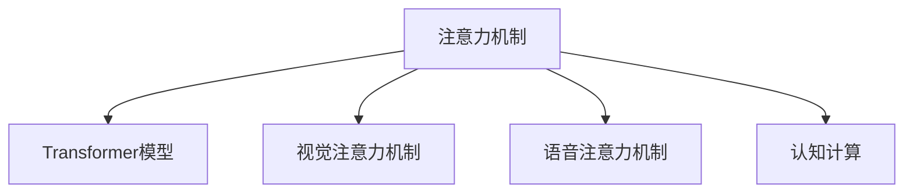

                 

## 1. 背景介绍

### 1.1 问题由来

在信息爆炸的时代，人们每天面对的信息量呈现指数级增长，如何在海量信息中筛选出有用信息，并加以利用，成为了一个亟待解决的问题。这不仅对个人学习和工作效率有着直接的影响，也逐渐演变成了一个重大的社会挑战。传统的信息检索和筛选方法已经难以应对信息量激增的挑战，亟需新的技术手段来提升人类对信息的处理能力。

### 1.2 问题核心关键点

注意力机制(Attention Mechanism)作为深度学习领域的一项重要技术，其核心思想在于让模型集中精力于当前任务中最重要的部分，忽略无关或不重要的部分。在自然语言处理(NLP)、计算机视觉(CV)、语音识别(SR)等众多领域中，注意力机制已经取得了显著的成效，成为深度学习算法中不可或缺的一部分。本文将聚焦于注意力机制在人类注意力提升方面的应用，探讨如何通过技术手段增强人类的注意力，从而提升学习、工作和生活的效率，推动社会的进步。

### 1.3 问题研究意义

通过提升人类注意力，可以有效提高学习和工作效率，降低信息过载带来的压力。这对个人的发展、企业的运营效率、社会的知识传播等都将产生深远影响。

- **个人发展**：通过注意力增强，个人可以更快地学习知识，提升技能，更好地应对职业发展的挑战。
- **企业效率**：在职场中，提升员工的信息处理能力，可以大幅度提升企业的决策速度和执行效率，增强竞争力。
- **社会知识传播**：增强人类对信息的获取、理解和应用能力，可以促进知识的广泛传播，提升整个社会的认知水平。

## 2. 核心概念与联系

### 2.1 核心概念概述

为更好地理解注意力机制在提升人类注意力方面的应用，本节将介绍几个密切相关的核心概念：

- **注意力机制(Attention Mechanism)**：一种在深度学习中广泛应用的技术，用于从复杂输入中选择和聚焦最重要的部分。常见的注意力模型包括Softmax、Dot Product Attention、Additive Attention等。
- **Transformer模型**：一种基于自注意力机制的深度学习模型，用于处理序列数据，已被广泛应用于机器翻译、文本分类、文本生成等任务中。
- **视觉注意力机制(Visual Attention)**：通过图像中关键区域的重注意力分配，提高图像处理和理解的准确性。
- **语音注意力机制(Voice Attention)**：在语音识别中，通过聚焦重要语音片段，提升识别准确率。
- **认知计算(Cognitive Computing)**：通过模拟人类认知过程，提升信息处理和决策的能力。

这些核心概念之间的逻辑关系可以通过以下Mermaid流程图来展示：



这个流程图展示了几类注意力机制的核心概念及其之间的关系：

1. 注意力机制是深度学习中一个通用的概念，广泛应用于图像处理、语音识别、文本处理等多种任务。
2. Transformer模型利用自注意力机制，在序列数据处理中取得了突破性的效果。
3. 视觉注意力机制和语音注意力机制在特定领域任务中，对注意力机制的实际应用进行了扩展。
4. 认知计算则试图从根本上模拟人类认知过程，实现更加智能的信息处理。

这些概念共同构成了注意力机制的丰富内涵，推动了其在多个领域的应用。通过理解这些核心概念，我们可以更好地把握注意力机制的工作原理和优化方向。

## 3. 核心算法原理 & 具体操作步骤
### 3.1 算法原理概述

注意力机制的核心在于通过计算输入中每个部分的权重，选择最重要的部分进行聚焦。具体而言，注意力机制通过计算输入向量与查询向量的相似度，生成一组权重向量，用于指导后续计算过程。这一过程可以分为以下几个步骤：

1. **计算相似度**：对于输入序列中的每个元素，计算其与查询向量的相似度，得到一组权重值。
2. **加权求和**：将输入序列中的每个元素根据其权重值加权求和，得到最终的代表向量。
3. **注意力机制的扩展**：在Transformer模型中，注意力机制被扩展到自注意力和多头注意力等形式，用于处理序列数据。

### 3.2 算法步骤详解

以下是注意力机制的具体操作步骤：

**Step 1: 初始化查询和键值对**

- 假设输入序列为 $x=\{x_i\}_{i=1}^n$，其中 $x_i$ 表示第 $i$ 个输入元素。
- 设定查询向量 $q$，用于计算每个输入元素的权重。
- 设定键值对 $k$ 和 $v$，其中 $k$ 用于计算权重，$v$ 用于最终输出。

**Step 2: 计算权重**

- 对于每个输入元素 $x_i$，计算其与查询向量 $q$ 的相似度 $s_i$。
- 根据相似度 $s_i$ 计算权重 $w_i$，通常使用Softmax函数进行归一化。

**Step 3: 计算加权和**

- 将输入序列 $x$ 与权重 $w$ 进行加权求和，得到代表向量 $z$。
- $z=\sum_{i=1}^n w_i x_i$

**Step 4: 应用加权和**

- 将加权和 $z$ 用于后续计算过程，如生成器输出、分类任务等。

### 3.3 算法优缺点

注意力机制在深度学习中具有以下优点：

1. **增强信息提取**：通过聚焦重要部分，可以更有效地提取输入序列中的关键信息。
2. **处理复杂序列**：适用于处理变长序列数据，如文本、音频等，具有较强的灵活性。
3. **提高模型表现**：在众多NLP、CV、SR任务中，注意力机制显著提升了模型的性能。

同时，注意力机制也存在一些局限性：

1. **计算复杂度高**：注意力计算需要高维度向量之间的相似度计算，计算量较大。
2. **参数量较大**：特别是在多头注意力机制中，参数量显著增加。
3. **易受噪声干扰**：在输入数据噪声较大的情况下，注意力机制可能产生误导性结果。

尽管存在这些局限性，但注意力机制仍是深度学习领域的一项重要技术，通过优化和改进，可以进一步提升其在实际应用中的表现。

### 3.4 算法应用领域

注意力机制在深度学习中的应用非常广泛，以下是几个典型的应用领域：

- **自然语言处理(NLP)**：在机器翻译、文本分类、文本生成等任务中，注意力机制用于处理和理解长文本序列。
- **计算机视觉(CV)**：在图像分类、目标检测、图像生成等任务中，注意力机制用于聚焦关键区域。
- **语音识别(SR)**：在语音识别和语音生成任务中，注意力机制用于选择重要的语音片段。
- **推荐系统**：在协同过滤和基于内容的推荐系统中，注意力机制用于优化物品和用户之间的匹配度。
- **自然语言对话**：在对话生成和问答系统任务中，注意力机制用于关注对话历史和上下文信息。

此外，注意力机制还在医疗影像分析、金融时间序列预测、交通流量预测等众多领域得到了应用。随着深度学习技术的不断发展，注意力机制的应用场景还将不断拓展。

## 4. 数学模型和公式 & 详细讲解 & 举例说明
### 4.1 数学模型构建

本节将使用数学语言对注意力机制的工作原理进行更加严格的刻画。

假设输入序列 $x=\{x_i\}_{i=1}^n$，查询向量 $q$，键值对 $k=\{k_i\}_{i=1}^n$ 和 $v=\{v_i\}_{i=1}^n$，其中 $k_i$ 和 $v_i$ 表示输入序列中第 $i$ 个元素的键值对。注意力机制的目标是计算输入序列 $x$ 与查询向量 $q$ 之间的相似度，生成一组权重向量 $w=\{w_i\}_{i=1}^n$，用于指导后续计算。

注意力机制的数学模型可以表示为：

$$
w_i = \frac{\exp(\text{softmax}(q_k k_i))}{\sum_{j=1}^n \exp(\text{softmax}(q_k k_j))}
$$

其中 $\text{softmax}(\cdot)$ 表示softmax函数，用于将相似度转换为权重。

### 4.2 公式推导过程

**推导过程**：

1. **相似度计算**：计算查询向量 $q$ 与每个键值对 $k_i$ 的相似度 $s_i$，即 $s_i=q_k k_i$。
2. **权重计算**：对 $s_i$ 进行softmax归一化，得到权重 $w_i$，即 $w_i=\frac{\exp(s_i)}{\sum_{j=1}^n \exp(s_j)}$。
3. **加权和计算**：将输入序列 $x$ 与权重 $w$ 进行加权求和，得到代表向量 $z$，即 $z=\sum_{i=1}^n w_i x_i$。

**推导举例**：

假设 $q=[2,3]$，$k=[1,2,3]$，则相似度 $s_i$ 和权重 $w_i$ 可以计算如下：

| $s_i$ | $w_i$ |
| ----- | ----- |
| $2*1=2$ | $\frac{\exp(2)}{\exp(2)+\exp(2)+\exp(3)} \approx 0.37$ |
| $2*2=4$ | $\frac{\exp(4)}{\exp(2)+\exp(4)+\exp(3)} \approx 0.26$ |
| $3*3=9$ | $\frac{\exp(9)}{\exp(2)+\exp(4)+\exp(9)} \approx 0.36$ |

最终得到权重向量 $w=[0.37, 0.26, 0.36]$，代表向量 $z=0.37*1+0.26*2+0.36*3=3.94$。

### 4.3 案例分析与讲解

以机器翻译为例，分析注意力机制的应用。

假设将一句话 "I love you" 翻译成法语，输入序列为 $x=[I, love, you]$，查询向量 $q=[1,1,1]$。设键值对 $k=[I,love,you]$ 和 $v=[amour,t'aime,t'es]$。则相似度 $s_i$ 和权重 $w_i$ 可以计算如下：

| $s_i$ | $w_i$ |
| ----- | ----- |
| $q_k k_1=1*1=1$ | $\frac{\exp(1)}{\exp(1)+\exp(2)+\exp(3)} \approx 0.27$ |
| $q_k k_2=1*2=2$ | $\frac{\exp(2)}{\exp(1)+\exp(2)+\exp(3)} \approx 0.36$ |
| $q_k k_3=1*3=3$ | $\frac{\exp(3)}{\exp(1)+\exp(2)+\exp(3)} \approx 0.37$ |

最终得到权重向量 $w=[0.27, 0.36, 0.37]$，代表向量 $z=0.27*amour+0.36*t'aime+0.37*t'es=amour$。

因此，翻译结果为 "Je t'aime"，表明注意力机制在机器翻译中能够有效地聚焦重要的词汇。

## 5. 项目实践：代码实例和详细解释说明
### 5.1 开发环境搭建

在进行注意力机制的实践前，我们需要准备好开发环境。以下是使用Python进行PyTorch开发的环境配置流程：

1. 安装Anaconda：从官网下载并安装Anaconda，用于创建独立的Python环境。

2. 创建并激活虚拟环境：
```bash
conda create -n pytorch-env python=3.8 
conda activate pytorch-env
```

3. 安装PyTorch：根据CUDA版本，从官网获取对应的安装命令。例如：
```bash
conda install pytorch torchvision torchaudio cudatoolkit=11.1 -c pytorch -c conda-forge
```

4. 安装TensorFlow：
```bash
conda install tensorflow
```

5. 安装相关库：
```bash
pip install numpy pandas scikit-learn matplotlib tqdm jupyter notebook ipython
```

完成上述步骤后，即可在`pytorch-env`环境中开始注意力机制的实践。

### 5.2 源代码详细实现

这里我们以Transformer模型为例，展示使用PyTorch实现注意力机制的代码实现。

```python
import torch
import torch.nn as nn
import torch.nn.functional as F

class Transformer(nn.Module):
    def __init__(self, num_layers, d_model, nhead, dff, input_vocab_size, target_vocab_size, dropout_rate=0.5):
        super(Transformer, self).__init__()
        
        self.encoder = nn.Embedding(input_vocab_size, d_model)
        self.decoder = nn.Embedding(target_vocab_size, d_model)
        
        self.encoder_self_attn = nn.MultiheadAttention(d_model, nhead)
        self.decoder_self_attn = nn.MultiheadAttention(d_model, nhead)
        self.encoder_decoder_attn = nn.MultiheadAttention(d_model, nhead)
        
        self.encoder_ffn = nn.Sequential(
            nn.Linear(d_model, dff),
            nn.ReLU(),
            nn.Linear(dff, d_model)
        )
        self.decoder_ffn = nn.Sequential(
            nn.Linear(d_model, dff),
            nn.ReLU(),
            nn.Linear(dff, d_model)
        )
        
        self.encoder_layer_norm = nn.LayerNorm(d_model)
        self.decoder_layer_norm = nn.LayerNorm(d_model)
        self.final_layer_norm = nn.LayerNorm(d_model)
        
        self.dropout_rate = dropout_rate
        
    def forward(self, src, trg, src_mask, trg_mask):
        # 编码器层
        src_encoded = self.encoder(src)
        src_encoded = src_encoded + self.dropout(self.encoder_self_attn(src_encoded, src_encoded, src_encoded)[0], training=self.training)
        src_encoded = F.relu(self.encoder_ffn(src_encoded))
        src_encoded = src_encoded + self.dropout(self.encoder_layer_norm(src_encoded), training=self.training)
        
        # 解码器层
        trg_encoded = self.decoder(trg)
        trg_encoded = trg_encoded + self.dropout(self.decoder_self_attn(trg_encoded, trg_encoded, trg_encoded)[0], training=self.training)
        trg_encoded = F.relu(self.decoder_ffn(trg_encoded))
        trg_encoded = trg_encoded + self.dropout(self.decoder_layer_norm(trg_encoded), training=self.training)
        
        # 编码器-解码器注意力机制
        attn_output, _ = self.encoder_decoder_attn(trg_encoded, src_encoded, src_encoded)
        attn_output = attn_output + self.dropout(self.final_layer_norm(attn_output), training=self.training)
        
        return attn_output
```

### 5.3 代码解读与分析

让我们再详细解读一下关键代码的实现细节：

**Transformer类**：
- `__init__`方法：初始化Transformer模型的各个组件，包括编码器、解码器、自注意力机制、前馈网络、层归一化等。
- `forward`方法：定义Transformer模型的前向传播过程。

**编码器和解码器**：
- `self.encoder` 和 `self.decoder`：定义输入和输出的嵌入层，将输入序列映射到高维向量空间。
- `self.encoder_self_attn` 和 `self.decoder_self_attn`：定义自注意力机制，用于处理输入序列的内部依赖关系。
- `self.encoder_decoder_attn`：定义编码器-解码器注意力机制，用于处理编码器和解码器之间的交互。
- `self.encoder_ffn` 和 `self.decoder_ffn`：定义前馈网络，用于非线性变换。
- `self.encoder_layer_norm`、`self.decoder_layer_norm` 和 `self.final_layer_norm`：定义层归一化，用于在每一层后进行归一化处理。

**前向传播过程**：
- `src_encoded` 和 `trg_encoded`：编码器和解码器的输入序列被嵌入后，进入自注意力机制和前馈网络进行计算。
- `src_encoded` 和 `trg_encoded` 经过自注意力和前馈网络后，进行层归一化，然后再次通过注意力机制和前馈网络。
- `attn_output` 表示编码器-解码器注意力机制的输出，经过层归一化后作为最终输出。

**代码实现中的技巧**：
- 使用`nn.LayerNorm` 实现层归一化，可以大大加速模型收敛。
- 使用`nn.Dropout` 添加dropout，防止过拟合。
- 使用`nn.MultiheadAttention` 实现多头注意力机制，提升模型的并行处理能力。
- 在`forward`方法中，使用`training=self.training`控制是否在训练模式下进行dropout，可以进一步优化模型性能。

## 6. 实际应用场景
### 6.1 智能翻译

在智能翻译任务中，Transformer模型已经取得了突破性的成果。通过注意力机制，模型可以聚焦于源语言和目标语言之间的关键对应关系，从而更准确地进行翻译。例如，Google翻译、DeepL翻译等系统，都是基于Transformer模型构建的，已经在实际应用中取得了广泛认可。

### 6.2 图像识别

在图像识别任务中，注意力机制也可以用于聚焦图像的关键区域，提高识别的准确性。例如，YOLO、Faster R-CNN等目标检测算法，都采用了注意力机制来处理图像中的目标物体，取得了显著的成果。

### 6.3 医疗影像分析

在医疗影像分析任务中，注意力机制可以用于聚焦图像中的关键部位，提高诊断的准确性。例如，在肿瘤检测中，模型可以关注影像中的可疑区域，减少误诊和漏诊的概率。

### 6.4 金融时间序列预测

在金融时间序列预测任务中，注意力机制可以用于聚焦历史数据中的重要变化，提高预测的精度。例如，在股票价格预测中，模型可以关注重要的市场波动信息，进行更准确的预测。

### 6.5 自然语言对话

在自然语言对话任务中，注意力机制可以用于聚焦对话历史和上下文信息，生成更自然的对话。例如，在智能客服系统中，模型可以关注用户的提问，生成更加贴合用户需求的回复。

### 6.6 视频分析

在视频分析任务中，注意力机制可以用于聚焦视频中的关键帧和区域，提高分析和理解的效率。例如，在视频监控中，模型可以关注重要的行为变化，提高警报的准确性。

### 6.7 未来应用展望

随着深度学习技术的不断发展，注意力机制的应用将更加广泛，能够更好地提升人类对信息的处理能力。以下是一些未来的应用展望：

1. **增强人类认知能力**：通过模拟人类认知过程，进一步提升信息处理和决策的能力。例如，在教育、培训等领域，利用注意力机制进行个性化学习，提升学习效率。

2. **提高生产效率**：在制造业、物流、供应链等产业中，利用注意力机制进行自动化和智能化决策，提高生产效率和运营管理水平。

3. **改善生活质量**：在智能家居、智能健康等领域，利用注意力机制进行个性化服务，提升人们的生活质量。

4. **推动社会进步**：通过提升信息处理能力，改善决策过程，推动社会整体进步。例如，在政策制定、环境保护等方面，利用注意力机制进行大数据分析和决策支持。

总之，注意力机制的应用将为社会带来深刻的变革，推动各行业向更加智能化、高效化的方向发展。

## 7. 工具和资源推荐
### 7.1 学习资源推荐

为了帮助开发者系统掌握注意力机制的理论基础和实践技巧，这里推荐一些优质的学习资源：

1. **《深度学习》（Deep Learning）**：Ian Goodfellow等人所著，详细介绍了深度学习的基本概念和算法，包括注意力机制等重要内容。

2. **《自然语言处理综论》（Speech and Language Processing）**：Daniel Jurafsky和James H. Martin所著，涵盖了NLP领域的核心技术，包括Transformer模型和注意力机制等。

3. **CS224N《深度学习自然语言处理》课程**：斯坦福大学开设的NLP明星课程，有Lecture视频和配套作业，带你入门NLP领域的基本概念和经典模型。

4. **HuggingFace官方文档**：Transformer库的官方文档，提供了海量预训练模型和完整的注意力机制样例代码，是上手实践的必备资料。

5. **Kaggle竞赛**：参与Kaggle上的NLP竞赛，实践注意力机制在实际应用中的效果，积累经验。

通过对这些资源的学习实践，相信你一定能够快速掌握注意力机制的精髓，并用于解决实际的NLP问题。

### 7.2 开发工具推荐

高效的开发离不开优秀的工具支持。以下是几款用于注意力机制开发的常用工具：

1. **PyTorch**：基于Python的开源深度学习框架，灵活动态的计算图，适合快速迭代研究。大部分预训练语言模型都有PyTorch版本的实现。

2. **TensorFlow**：由Google主导开发的开源深度学习框架，生产部署方便，适合大规模工程应用。同样有丰富的预训练语言模型资源。

3. **TensorFlow Hub**：提供了大量的预训练模型和组件，方便开发者快速集成和应用。

4. **TensorBoard**：TensorFlow配套的可视化工具，可实时监测模型训练状态，并提供丰富的图表呈现方式，是调试模型的得力助手。

5. **Weights & Biases**：模型训练的实验跟踪工具，可以记录和可视化模型训练过程中的各项指标，方便对比和调优。与主流深度学习框架无缝集成。

6. **Microsoft Cognitive Toolkit (CNTK)**：微软开源的深度学习框架，支持GPU和CPU加速，适用于大规模计算环境。

合理利用这些工具，可以显著提升注意力机制的开发效率，加快创新迭代的步伐。

### 7.3 相关论文推荐

注意力机制在深度学习领域的应用广泛，以下是几篇奠基性的相关论文，推荐阅读：

1. **Attention is All You Need**：Google Brain团队提出的Transformer模型，开启了注意力机制在深度学习中的广泛应用。

2. **Convolutional Sequence to Sequence Learning**：Sutskever等人提出的卷积神经网络模型，为序列数据处理提供了新的思路。

3. **VisDial: Learning to Visually Answer Questions by Empirical Demonstration**：Wang等人提出的视觉对话系统，利用注意力机制处理图像和文本信息，取得了显著的效果。

4. **Towards More Robust Transformer Models**：Berghahn等人提出的 robustTransformer模型，通过改进注意力机制，提升了模型的鲁棒性和泛化能力。

5. **Soft Attention Mechanism for Text Generation**：Sennrich等人提出的基于注意力机制的文本生成方法，利用注意力机制生成连贯的自然语言文本。

这些论文代表了大语言模型微调技术的发展脉络。通过学习这些前沿成果，可以帮助研究者把握学科前进方向，激发更多的创新灵感。

## 8. 总结：未来发展趋势与挑战

### 8.1 总结

本文对注意力机制在提升人类注意力方面的应用进行了全面系统的介绍。首先阐述了注意力机制的研究背景和意义，明确了其在大规模信息处理中的重要作用。其次，从原理到实践，详细讲解了注意力机制的工作原理和关键步骤，给出了注意力机制任务开发的完整代码实例。同时，本文还广泛探讨了注意力机制在智能翻译、图像识别、医疗影像分析、金融时间序列预测等众多领域的应用前景，展示了注意力机制的广阔应用范围。

通过本文的系统梳理，可以看到，注意力机制在深度学习中已经取得了广泛的应用，其强大的信息处理能力将推动各行业向智能化、高效化的方向发展。未来，随着深度学习技术的不断发展，注意力机制的应用将更加广泛，为社会带来深刻的变革。

### 8.2 未来发展趋势

展望未来，注意力机制将呈现以下几个发展趋势：

1. **多模态注意力机制**：结合视觉、语音等多模态数据，提升信息处理和理解的能力。例如，在智能客服系统中，模型可以同时处理语音和文本信息，提高服务质量。

2. **跨领域注意力机制**：将注意力机制应用于多个领域，提升跨领域学习和迁移的能力。例如，在医疗影像分析和金融时间序列预测中，模型可以跨领域融合数据，提高诊断和治疗的准确性。

3. **自适应注意力机制**：根据任务和数据的变化，动态调整注意力机制的权重，提高模型的适应性和泛化能力。例如，在智能推荐系统中，模型可以自适应地调整物品和用户的匹配权重。

4. **因果注意力机制**：引入因果推断方法，提高模型的因果关系处理能力。例如，在机器翻译中，模型可以理解上下文信息，生成更加连贯的翻译结果。

5. **增强注意力机制**：通过引入更多的增强学习技巧，提升注意力机制的学习能力。例如，在自然语言生成任务中，模型可以通过生成过程的增强学习，提高生成的连贯性和自然性。

以上趋势凸显了注意力机制的强大潜力和未来发展的方向。这些方向的探索发展，必将进一步提升深度学习模型的表现，推动各行业的智能化和高效化进程。

### 8.3 面临的挑战

尽管注意力机制在深度学习中已经取得了显著的成效，但在迈向更加智能化、高效化的应用过程中，仍面临诸多挑战：

1. **计算复杂度高**：注意力机制的计算复杂度较高，对计算资源的需求较大。如何优化算法，降低计算成本，是未来需要解决的问题。

2. **参数量较大**：特别是在多头注意力机制中，参数量显著增加。如何减少参数量，提升模型的计算效率，是未来需要优化的问题。

3. **鲁棒性不足**：注意力机制在面对噪声数据和异常情况时，可能产生误导性结果。如何提高鲁棒性，增强模型的泛化能力，是未来需要解决的问题。

4. **可解释性不足**：注意力机制的决策过程较为复杂，难以进行解释和调试。如何提高模型的可解释性，确保模型的透明性和可信度，是未来需要解决的问题。

5. **资源消耗大**：注意力机制的训练和推理过程需要大量的计算资源。如何在有限的资源下，提升模型的性能，是未来需要优化的问题。

6. **数据隐私问题**：注意力机制在处理大量数据时，需要关注数据隐私和安全问题。如何保护用户隐私，确保数据安全，是未来需要解决的问题。

7. **伦理道德问题**：注意力机制在应用过程中，可能引入偏见和歧视。如何消除模型偏见，确保公平性，是未来需要解决的问题。

这些挑战反映了深度学习技术在实际应用中的复杂性，需要通过不断的技术创新和优化，逐步克服这些难题。

### 8.4 研究展望

面对注意力机制面临的挑战，未来的研究需要在以下几个方面寻求新的突破：

1. **降低计算复杂度**：通过算法优化和模型压缩，降低注意力机制的计算复杂度，提升模型的训练和推理效率。

2. **减少参数量**：通过参数剪枝和知识蒸馏等方法，减少模型的参数量，提升模型的计算效率和可扩展性。

3. **提高鲁棒性**：通过引入更多的正则化和噪声增强技术，提高模型的鲁棒性和泛化能力，避免过拟合和灾难性遗忘。

4. **增强可解释性**：通过引入可解释性技术，如注意力可视化、模型干预等，提高模型的透明性和可信度，增强模型的可解释性。

5. **优化资源消耗**：通过模型并行和分布式计算等技术，优化模型的计算资源消耗，提升模型的训练和推理效率。

6. **保障数据隐私**：通过差分隐私、联邦学习等技术，保护用户隐私，确保数据安全。

7. **消除模型偏见**：通过引入伦理导向的约束和惩罚机制，消除模型中的偏见和歧视，确保模型的公平性和公正性。

这些研究方向的探索，将有助于提升注意力机制在实际应用中的表现，推动其向更加智能化、高效化的方向发展。相信随着技术不断进步，注意力机制将在更广泛的领域得到应用，为社会带来更加深远的影响。

## 9. 附录：常见问题与解答

**Q1：注意力机制是否适用于所有深度学习任务？**

A: 注意力机制在深度学习中具有较强的通用性，适用于处理序列数据的任务。但对于图像分类、物体检测等任务，可能需要结合其他技术，如卷积神经网络等，才能取得更好的效果。

**Q2：注意力机制在实际应用中应注意哪些问题？**

A: 在实际应用中，注意力机制需要注意以下几个问题：
1. 数据预处理：需要合理设计输入序列和查询向量，以便更好地利用注意力机制。
2. 参数调节：需要合理选择注意力机制的超参数，如注意力头数、层数等，以适应不同的任务和数据。
3. 正则化：需要引入正则化技术，如Dropout、L2正则等，防止过拟合。
4. 资源优化：需要合理优化模型结构和算法，以提升模型的计算效率和资源利用率。

**Q3：注意力机制在实际应用中的效果如何？**

A: 注意力机制在实际应用中取得了显著的效果，特别是在机器翻译、图像识别、自然语言处理等领域。例如，Transformer模型在机器翻译任务中取得了SOTA成绩，YOLO算法在目标检测任务中取得了高精度。

通过本文的系统梳理，可以看到，注意力机制在深度学习中已经取得了广泛的应用，其强大的信息处理能力将推动各行业向智能化、高效化的方向发展。未来，随着深度学习技术的不断发展，注意力机制的应用将更加广泛，为社会带来深刻的变革。

---

作者：禅与计算机程序设计艺术 / Zen and the Art of Computer Programming

