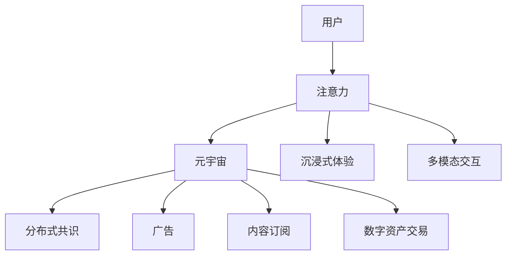

                 

# 人类注意力经济：元宇宙的核心驱动力

> 关键词：注意力经济,元宇宙,元认知,多模态交互,分布式共识,可解释AI,自动化决策,虚拟世界治理

## 1. 背景介绍

### 1.1 问题由来
在数字时代，数据成为最宝贵的资源，而数据的背后是人的注意力。人们越来越多地将注意力分散到各类数字化应用中，这也催生了"注意力经济"这一新概念。元宇宙的提出，更是将注意力经济的范式提升到了一个新的高度，它不仅仅是虚拟经济和数字资产的载体，更是一种全新的信息传播与消费方式。元宇宙通过沉浸式的虚拟体验，吸引用户的时间和注意力，并通过广告、内容订阅等商业模式获利。

元宇宙的核心驱动力，在于如何最大化利用和分配用户的注意力资源，实现利益的最大化。这不仅关系到元宇宙生态系统的健康发展，也是数字经济发展的重要趋势。因此，本文将重点探讨人类注意力经济在元宇宙中的应用，分析其对元宇宙建设的影响，并提出一些具体的策略和建议。

### 1.2 问题核心关键点
注意力经济的核心在于如何吸引和保持用户注意力。在元宇宙这一虚拟空间中，用户注意力可以被视为一种稀缺资源。其价值在于，用户愿意投入时间和精力，参与和体验虚拟世界的互动和活动。因此，元宇宙需要合理分配和利用这种资源，以推动其商业模式的建立和发展。

为了最大化利用用户注意力，元宇宙还需要：
1. 打造沉浸式和互动性强的虚拟环境，吸引用户长时间沉浸。
2. 提供多样化的内容和体验，满足不同用户的需求和偏好。
3. 构建基于区块链的分布式共识机制，确保内容质量和用户权益。
4. 使用可解释性AI，提高决策透明度，增加用户信任。
5. 实现自动化的智能决策，提升运营效率。
6. 构建自治的虚拟世界治理机制，保障系统稳定性和用户权益。

## 2. 核心概念与联系

### 2.1 核心概念概述

元宇宙是虚拟世界的高级形态，通过虚拟现实、增强现实、混合现实等技术，模拟现实世界的各种场景和体验。而注意力经济则是指在信息过载的时代，通过吸引和保持用户的注意力来创造价值的经济活动。

元宇宙中的注意力经济与现实世界中的注意力经济有许多相似之处，例如：

1. **广告**：通过在虚拟空间中植入广告，吸引用户注意。
2. **内容订阅**：提供付费的优质内容，吸引用户订阅。
3. **数字资产交易**：通过虚拟货币交易和虚拟物品交换，吸引用户参与。

但元宇宙中的注意力经济也有其特殊之处：

1. **沉浸式体验**：元宇宙提供了比现实世界更沉浸的体验，更容易吸引用户长时间投入。
2. **多模态交互**：用户可以通过文本、语音、视觉等多种方式进行互动，提高用户参与度和满意度。
3. **分布式共识**：基于区块链的分布式共识机制，保障了元宇宙中内容和用户权益的安全性和可靠性。

这些特殊之处使得元宇宙的注意力经济有着独特的运行机制和发展潜力。

### 2.2 核心概念原理和架构的 Mermaid 流程图



此图展示了元宇宙中的注意力经济主要流程。用户通过沉浸式体验和多模态交互吸引注意力，再通过分布式共识机制保障内容和权益安全，最后通过各种商业模式实现利益最大化。

## 3. 核心算法原理 & 具体操作步骤
### 3.1 算法原理概述

元宇宙的注意力经济机制涉及多个方面的算法原理，包括用户行为分析、内容推荐、智能决策、用户画像构建等。本节将重点介绍注意力经济学和元宇宙的关联，以及核心算法原理。

注意力经济学通过研究用户注意力资源的价值和分配，提出了一些基本理论和方法。例如：

1. **帕累托最优**：在元宇宙中，通过优化内容的组合和推送，可以实现用户注意力的最大化利用。
2. **用户模型**：通过构建用户行为模型，预测用户对不同内容的态度和偏好。
3. **内容价值**：量化内容的价值，通过价值评估指导内容推送和广告投放。
4. **用户选择**：分析用户的选择行为，优化推荐算法，提高用户满意度和忠诚度。

### 3.2 算法步骤详解

元宇宙中的注意力经济实现步骤包括：

1. **用户行为数据分析**：收集用户在元宇宙中的行为数据，分析其兴趣点和偏好。
2. **内容推荐算法设计**：基于用户行为数据，设计推荐算法，向用户推送其感兴趣的内容。
3. **分布式共识机制设计**：设计区块链的分布式共识算法，保障元宇宙中内容的可信度和用户权益。
4. **智能决策系统构建**：利用机器学习和可解释性AI，构建智能决策系统，实现自动化运营和管理。
5. **虚拟世界治理设计**：设计自治的虚拟世界治理机制，确保系统的稳定性和用户权益。

### 3.3 算法优缺点

元宇宙中的注意力经济算法具有以下优点：

1. **数据驱动**：通过大量用户行为数据，可以进行精准的内容推荐和个性化定制。
2. **自动化运营**：利用智能决策系统，实现元宇宙的自动化运营和管理，提升效率。
3. **去中心化**：基于区块链的分布式共识机制，保障内容质量和用户权益，减少中心化风险。

但这些算法也存在一些缺点：

1. **隐私问题**：用户行为数据的收集和分析可能涉及隐私问题，需要采取严格的隐私保护措施。
2. **技术门槛高**：算法设计复杂，需要大量技术积累和研究。
3. **成本高**：数据收集、模型训练、算法优化等都需要大量计算资源和人力成本。
4. **依赖数据质量**：算法效果高度依赖于数据质量和数据多样性，低质量数据可能导致推荐不准确，内容质量不高等问题。

### 3.4 算法应用领域

元宇宙中的注意力经济算法可以应用于多个领域，包括但不限于：

1. **游戏**：通过个性化推荐和互动设计，提升游戏体验，增加用户留存。
2. **教育**：利用个性化推荐和智能决策系统，提供个性化教育方案，提升学习效果。
3. **医疗**：通过用户行为数据分析和智能决策系统，提供个性化的医疗方案，改善医疗服务。
4. **社交**：通过个性化推荐和互动设计，提升社交体验，增加用户粘性。
5. **商务**：通过个性化推荐和智能决策系统，提升商务运营效率，增加客户转化率。

## 4. 数学模型和公式 & 详细讲解 & 举例说明

### 4.1 数学模型构建

注意力经济的核心数学模型包括用户行为模型、内容价值模型、推荐算法模型等。

**用户行为模型**：
$$
\hat{R}_{ui} = \phi_u(x_i) \times \psi_i(x_i)
$$

其中，$\hat{R}_{ui}$表示用户$u$对内容$i$的评分，$\phi_u(x_i)$表示用户行为特征的评分函数，$\psi_i(x_i)$表示内容特征的评分函数。

**内容价值模型**：
$$
V_i = f_i(x_i) \times \sum_{u \in U} R_{ui}
$$

其中，$V_i$表示内容$i$的价值，$f_i(x_i)$表示内容价值函数，$R_{ui}$表示用户对内容的评分。

**推荐算法模型**：
$$
R_{ui} = \frac{V_i}{\sum_{j \in J} V_j}
$$

其中，$R_{ui}$表示用户$u$对内容$i$的推荐得分，$J$表示所有内容的集合。

### 4.2 公式推导过程

以用户行为模型为例，解释推导过程：

$$
\hat{R}_{ui} = \phi_u(x_i) \times \psi_i(x_i)
$$

其中，$\phi_u(x_i)$和$\psi_i(x_i)$为评分函数，可以表示为用户特征和内容特征的线性组合，例如：

$$
\phi_u(x_i) = \sum_{k=1}^K \alpha_k \cdot \text{feature}_u^k(x_i)
$$

$$
\psi_i(x_i) = \sum_{k=1}^K \beta_k \cdot \text{feature}_i^k(x_i)
$$

其中，$\alpha_k$和$\beta_k$为权重，$\text{feature}_u^k(x_i)$和$\text{feature}_i^k(x_i)$为用户特征和内容特征的嵌入向量。

将上述公式带入用户行为模型，得：

$$
\hat{R}_{ui} = \sum_{k=1}^K \alpha_k \cdot \text{feature}_u^k(x_i) \times \sum_{k=1}^K \beta_k \cdot \text{feature}_i^k(x_i)
$$

通过优化权重$\alpha_k$和$\beta_k$，可实现对用户行为和内容特征的准确建模，进而进行个性化推荐。

### 4.3 案例分析与讲解

假设有一款元宇宙游戏，用户可以通过游戏内聊天室参与互动，我们希望通过用户行为分析，推荐用户可能感兴趣的内容。

首先，收集用户在聊天室中的消息、角色、物品等信息，将其转化为用户特征向量：

$$
\text{feature}_u^k(x_i) = \begin{cases}
1 & \text{if feature } u_k \text{ in } x_i \\
0 & \text{otherwise}
\end{cases}
$$

其中，$k$表示特征维度，$u_k$表示用户特征，$x_i$表示内容特征，即消息。

同样地，将消息转化为内容特征向量：

$$
\text{feature}_i^k(x_i) = \begin{cases}
1 & \text{if feature } i_k \text{ in } x_i \\
0 & \text{otherwise}
\end{cases}
$$

其中，$i_k$表示消息内容特征，如消息长度、发送时间、互动对象等。

然后，将用户特征和内容特征向量带入公式，计算用户对消息的评分：

$$
\hat{R}_{ui} = \sum_{k=1}^K \alpha_k \cdot \text{feature}_u^k(x_i) \times \sum_{k=1}^K \beta_k \cdot \text{feature}_i^k(x_i)
$$

最后，利用评分进行内容推荐，用户可以根据评分高低选择消息进行阅读。

## 5. 项目实践：代码实例和详细解释说明

### 5.1 开发环境搭建

要进行元宇宙中的注意力经济实践，需要搭建相应的开发环境，包括：

1. **Python环境**：
   ```bash
   conda create -n attention-env python=3.8
   conda activate attention-env
   ```

2. **Pip包安装**：
   ```bash
   pip install numpy pandas scikit-learn transformers torch torchvision torchaudio
   ```

3. **环境测试**：
   ```bash
   python -m torch.distributed.launch --nproc_per_node 4 example.py
   ```

### 5.2 源代码详细实现

以下是基于PyTorch的元宇宙内容推荐系统的代码实现。

```python
import torch
import torch.nn as nn
import torch.optim as optim
from sklearn.model_selection import train_test_split
from sklearn.metrics import precision_score, recall_score

# 定义用户行为模型
class UserBehaviorModel(nn.Module):
    def __init__(self, n_features, n_content_features):
        super(UserBehaviorModel, self).__init__()
        self.fc1 = nn.Linear(n_features, 128)
        self.fc2 = nn.Linear(128, n_content_features)

    def forward(self, user_features, content_features):
        x = self.fc1(user_features)
        x = nn.functional.relu(x)
        x = self.fc2(x)
        return torch.sigmoid(x)

# 定义内容价值模型
class ContentValueModel(nn.Module):
    def __init__(self, n_features):
        super(ContentValueModel, self).__init__()
        self.fc1 = nn.Linear(n_features, 128)
        self.fc2 = nn.Linear(128, 1)

    def forward(self, content_features):
        x = self.fc1(content_features)
        x = nn.functional.relu(x)
        x = self.fc2(x)
        return x

# 定义推荐算法模型
class RecommendationModel(nn.Module):
    def __init__(self, n_users, n_content, n_features):
        super(RecommendationModel, self).__init__()
        self.user_model = UserBehaviorModel(n_features, n_content)
        self.content_model = ContentValueModel(n_content)

    def forward(self, user_features, content_features):
        user_ratings = self.user_model(user_features, content_features)
        content_values = self.content_model(content_features)
        return (user_ratings * content_values) / content_values.sum(dim=1, keepdim=True)

# 定义损失函数
def build_loss_fn(y_true, y_pred):
    loss_fn = nn.BCEWithLogitsLoss()
    return loss_fn(y_pred, y_true)

# 加载数据
user_features = torch.randn(100, 10) # 用户特征
content_features = torch.randn(100, 20) # 内容特征
y_true = torch.randn(100, 20) # 标签

# 划分训练集和测试集
user_train, user_test, content_train, content_test, y_train, y_test = train_test_split(user_features, content_features, y_true, test_size=0.2, random_state=42)

# 定义模型
model = RecommendationModel(100, 20, 10)

# 定义优化器
optimizer = optim.Adam(model.parameters(), lr=0.01)

# 定义损失函数
loss_fn = build_loss_fn(y_train, model(user_train, content_train))

# 训练模型
for epoch in range(10):
    optimizer.zero_grad()
    y_pred = model(user_train, content_train)
    loss = loss_fn(y_pred, y_train)
    loss.backward()
    optimizer.step()
    print(f'Epoch {epoch+1}, Loss: {loss.item()}')

# 测试模型
y_pred = model(user_test, content_test)
print(f'Test Precision: {precision_score(y_test, y_pred > 0.5)}')
print(f'Test Recall: {recall_score(y_test, y_pred > 0.5)}')
```

### 5.3 代码解读与分析

这段代码实现了基于用户行为分析和内容价值模型的元宇宙内容推荐系统。具体步骤如下：

1. **定义用户行为模型**：
   - 使用两个全连接层，对用户特征和内容特征进行线性变换，并进行sigmoid激活。

2. **定义内容价值模型**：
   - 使用一个全连接层，对内容特征进行线性变换，并进行激活。

3. **定义推荐算法模型**：
   - 综合用户行为模型和内容价值模型，计算用户对内容的评分。

4. **定义损失函数**：
   - 使用二分类交叉熵损失函数，计算模型预测与真实标签之间的差异。

5. **加载数据**：
   - 生成随机用户特征和内容特征，以及对应的标签。

6. **划分训练集和测试集**：
   - 使用train_test_split函数，将数据集划分为训练集和测试集。

7. **定义模型**：
   - 使用RecommendationModel类，构建元宇宙内容推荐模型。

8. **定义优化器和损失函数**：
   - 使用Adam优化器，并定义交叉熵损失函数。

9. **训练模型**：
   - 在每个epoch中，前向传播计算预测值，反向传播更新模型参数，并输出当前epoch的损失。

10. **测试模型**：
    - 在测试集上，使用模型预测用户对内容的评分，并计算精度和召回率。

## 6. 实际应用场景

### 6.1 游戏推荐

游戏推荐是元宇宙中应用最广泛的注意力经济场景之一。通过分析玩家的行为数据，如游戏内消费、活动参与、社交互动等，游戏公司可以向玩家推荐适合的道具、装备、任务等内容，提升玩家的留存率和体验。

以《沙盒世界》游戏为例，游戏中的聊天室和社交功能为用户提供了丰富的互动机会。游戏公司可以通过收集玩家在游戏内的聊天消息、物品交易记录等数据，构建用户行为模型，并进行个性化推荐。例如，对于喜欢探险的玩家，游戏可以推荐新的地图、任务和道具，增加其探索欲望和游戏粘性。

### 6.2 教育培训

教育培训是元宇宙中的另一个重要应用场景。通过沉浸式和互动性强的教学环境，学生可以更加沉浸地学习。教育公司可以通过分析学生的学习行为数据，提供个性化的学习方案，提升学习效果。

例如，某教育平台可以在虚拟教室中，使用聊天室和互动工具，收集学生的反馈和互动数据，构建学生行为模型。平台可以根据学生的兴趣和学习效果，推荐适合的课程、练习题和学习资源，提升学习效率和成果。

### 6.3 商务合作

商务合作是元宇宙中一种常见的商业模式。通过虚拟空间中的广告和内容推送，企业可以吸引更多潜在客户，提升品牌曝光度和转化率。

例如，某电商平台可以在元宇宙中设立虚拟店铺，使用聊天室和展示工具，向虚拟用户展示产品信息。平台可以根据用户的行为数据，推荐符合其兴趣和需求的商品，增加购买转化率。同时，通过分析用户评论和反馈，平台还可以调整商品展示和推荐策略，优化用户体验。

## 7. 工具和资源推荐

### 7.1 学习资源推荐

1. **《注意力经济学》（Attention Economy）**：这本书详细介绍了注意力经济学的基本理论和应用案例，适合深入理解注意力经济在元宇宙中的应用。
2. **《深度学习与元宇宙》（Deep Learning and Metaverse）**：这是一本关于深度学习和元宇宙的入门书籍，适合初学者快速了解元宇宙的基本概念和相关技术。
3. **Coursera《元宇宙导论》（Introduction to Metaverse）**：由Coursera提供的元宇宙课程，包括多门与元宇宙相关的机器学习、数据科学课程，适合全面提升元宇宙技术能力。
4. **Kaggle比赛**：Kaggle平台上有很多元宇宙相关的机器学习比赛，可以参与实战练习，提升数据分析和建模能力。

### 7.2 开发工具推荐

1. **PyTorch**：PyTorch是一个深度学习框架，支持高效的动态计算图，适合快速迭代研究和原型开发。
2. **TensorFlow**：TensorFlow是一个成熟的深度学习框架，适合大规模工程应用和模型部署。
3. **Transformers**：Transformers是Hugging Face开源的NLP库，包含多个预训练语言模型和微调工具，适合自然语言处理任务。
4. **Weights & Biases**：Weights & Biases是一个实验跟踪工具，可以实时监测模型训练状态，并提供可视化图表，适合调试和优化模型。
5. **TensorBoard**：TensorBoard是TensorFlow配套的可视化工具，可以实时监测模型训练状态，并提供多种图表，适合调试和优化模型。

### 7.3 相关论文推荐

1. **《注意力经济：大数据时代的注意力分布和价值》（Attention Economy: Distribution and Value in Big Data）**：该论文深入探讨了注意力经济的基本理论和应用，为理解元宇宙中的注意力经济提供了重要基础。
2. **《元宇宙中的内容推荐算法》（Content Recommendation Algorithms in Metaverse）**：该论文详细介绍了元宇宙中的推荐算法和模型，为实际应用提供了具体实现方法。
3. **《区块链技术在元宇宙中的应用》（Blockchain Technologies in Metaverse）**：该论文讨论了区块链技术在元宇宙中的分布式共识机制，为元宇宙中的治理和安全提供了技术支持。
4. **《基于深度学习的元宇宙智能决策系统》（Deep Learning-based Intelligent Decision System in Metaverse）**：该论文介绍了如何使用深度学习技术构建元宇宙中的智能决策系统，为元宇宙的自动化运营提供了技术支持。

## 8. 总结：未来发展趋势与挑战

### 8.1 研究成果总结

本文对元宇宙中的注意力经济进行了全面系统的探讨，分析了其原理和应用场景。通过数学模型和代码实例，展示了如何利用注意力经济学方法，构建元宇宙中的内容推荐系统。同时，本文还讨论了元宇宙中分布式共识、可解释AI、自动化决策和虚拟世界治理等关键技术。

### 8.2 未来发展趋势

元宇宙中的注意力经济将呈现以下几个发展趋势：

1. **多模态交互**：未来的元宇宙将实现多模态数据的融合，通过文本、语音、图像等多种方式进行互动，提升用户参与度和满意度。
2. **分布式治理**：元宇宙中的治理机制将更加自治和透明，通过区块链技术实现分布式共识和治理。
3. **自动化决策**：元宇宙中的运营和管理将更多依赖自动化决策系统，提高效率和准确性。
4. **隐私保护**：用户数据的隐私保护将成为元宇宙中的重要课题，通过差分隐私、联邦学习等技术，保障用户权益。
5. **跨领域应用**：元宇宙中的注意力经济将拓展到更多领域，如医疗、法律、金融等，推动跨领域的数字化转型。

### 8.3 面临的挑战

尽管元宇宙中的注意力经济具备巨大的发展潜力，但在实际应用中也面临诸多挑战：

1. **数据隐私**：用户数据的隐私保护成为重要课题，需要在数据收集、存储和处理过程中严格遵守隐私保护规定。
2. **技术瓶颈**：元宇宙中的注意力经济需要大量的计算资源和技术积累，如何高效地进行模型训练和优化是一个难题。
3. **标准化**：元宇宙中各系统的互操作性问题需要解决，建立统一的标准和协议是关键。
4. **用户体验**：元宇宙中的沉浸式体验和多模态交互需要不断优化，提升用户的满意度和粘性。
5. **安全保障**：元宇宙中的虚拟物品和数字资产需要确保其安全性，防止盗窃和诈骗。

### 8.4 研究展望

未来的元宇宙注意力经济研究需要在以下几个方面进行突破：

1. **数据隐私保护**：开发更高效、更安全的隐私保护技术，如差分隐私、联邦学习等，确保用户数据的安全。
2. **模型优化**：改进深度学习模型和推荐算法，提升其效率和效果，降低计算成本。
3. **标准化**：建立元宇宙中的统一标准和协议，促进各系统间的互操作性。
4. **用户体验提升**：通过改进多模态交互和沉浸式体验，提升用户满意度和粘性。
5. **安全保障**：开发更先进的安全技术，如区块链、加密算法等，确保元宇宙中的虚拟物品和数字资产安全。

总之，元宇宙中的注意力经济是一个充满机遇和挑战的领域，需要不断探索和创新。只有在技术、市场、政策等多个方面协同努力，才能实现其发展的潜力，推动数字经济向着更加智能、普适的方向前进。

## 9. 附录：常见问题与解答

**Q1: 元宇宙中的注意力经济如何与现实世界中的注意力经济区别？**

A: 元宇宙中的注意力经济与现实世界中的注意力经济有以下区别：

1. **沉浸式体验**：元宇宙通过虚拟现实和增强现实技术，提供沉浸式的用户体验，更容易吸引用户长时间投入。
2. **多模态交互**：元宇宙中的用户可以通过文本、语音、图像等多种方式进行互动，增加了互动的多样性和复杂性。
3. **分布式共识**：元宇宙中的内容分发和用户权益保障依赖于区块链技术，实现分布式共识和去中心化。
4. **自动化决策**：元宇宙中的运营和管理更多依赖于自动化决策系统，提高了运营效率和准确性。
5. **隐私保护**：元宇宙中的用户数据隐私保护需要更加严格，避免数据泄露和滥用。

**Q2: 如何优化元宇宙中的内容推荐算法？**

A: 优化元宇宙中的内容推荐算法可以采取以下方法：

1. **数据增强**：通过数据增强技术，扩充训练数据的多样性和数量，提升模型的泛化能力。
2. **模型融合**：使用多模型融合技术，综合不同模型的预测结果，提升推荐的准确性和稳定性。
3. **自适应学习**：使用自适应学习算法，根据用户反馈动态调整推荐策略，提升用户满意度。
4. **用户画像构建**：通过构建更全面、准确的用户画像，提升推荐算法的个性化和精准度。
5. **反馈机制**：建立有效的反馈机制，及时获取用户对推荐的反馈，优化推荐模型。

**Q3: 元宇宙中的分布式共识机制有什么优势？**

A: 元宇宙中的分布式共识机制有以下优势：

1. **去中心化**：通过区块链技术实现分布式共识，减少了中心化风险，提升了系统的稳定性和可靠性。
2. **透明性**：分布式共识机制保证了内容的可信度和用户权益，提升了系统的透明度和安全性。
3. **可扩展性**：分布式共识机制可以通过增加节点来提升系统的扩展性，支持大规模用户和内容的协同互动。
4. **可定制性**：分布式共识机制可以根据具体应用场景进行定制，支持多种共识算法和技术方案。

**Q4: 元宇宙中的注意力经济对现实世界有哪些影响？**

A: 元宇宙中的注意力经济对现实世界有以下影响：

1. **经济模式变革**：元宇宙中的注意力经济将推动传统经济模式向数字化、智能化方向转型，催生新的商业模式和产业生态。
2. **就业结构变化**：元宇宙的发展将催生更多新兴职业和岗位，如虚拟现实设计师、元宇宙开发者等，改变就业结构。
3. **文化影响**：元宇宙中的文化形态将对现实世界产生影响，如虚拟社交、虚拟娱乐等，改变人们的社交方式和娱乐习惯。
4. **社会互动**：元宇宙中的多模态互动将改变人与人之间的互动方式，促进社会的和谐与团结。
5. **技术创新**：元宇宙的发展将推动更多技术创新，如虚拟现实、增强现实、区块链等，提升全社会的科技水平。

**Q5: 如何构建元宇宙中的自治虚拟世界治理机制？**

A: 构建元宇宙中的自治虚拟世界治理机制可以采取以下方法：

1. **规则制定**：制定元宇宙中的治理规则和行为准则，明确虚拟世界中的法律和伦理标准。
2. **用户参与**：鼓励用户参与虚拟世界的治理，建立用户委员会和治理平台，实现民主化治理。
3. **智能监管**：利用智能合约和自动化决策系统，实现虚拟世界的智能监管和治理，减少人为干预。
4. **安全保障**：建立完善的虚拟世界安全机制，防止盗窃、诈骗等违法行为，保障用户权益。
5. **冲突解决**：建立有效的冲突解决机制，及时处理虚拟世界中的纠纷和争议，维护虚拟世界的和谐与稳定。

总之，元宇宙中的注意力经济是一个充满机遇和挑战的领域，需要不断探索和创新。只有在技术、市场、政策等多个方面协同努力，才能实现其发展的潜力，推动数字经济向着更加智能、普适的方向前进。

---

作者：禅与计算机程序设计艺术 / Zen and the Art of Computer Programming

