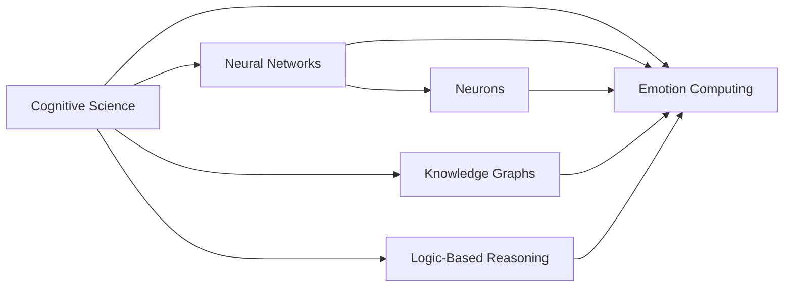
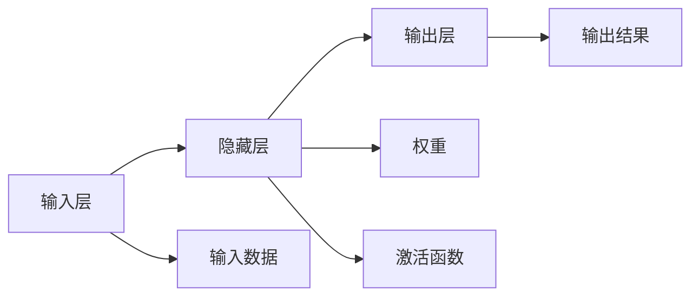

                 

# 人类的知识与信仰：理解精神世界的力量

> 关键词：认知科学, 神经网络, 神经元, 知识图谱, 逻辑推理, 情感计算

## 1. 背景介绍

在人类的知识海洋中，信仰像灯塔一样指引着我们前行的方向。而在现代科技的浪潮中，无论是人工智能(AI)还是人类认知科学，都在努力理解并模仿这一盏灯塔。本文将探讨人类信仰和知识的本质，并分析如何用计算机技术理解和模拟这一精神世界的力量。

### 1.1 问题由来

随着科技的进步，尤其是计算机科学的快速发展，人类对人工智能的期望日益增长。从简单的机器学习到复杂的深度学习，再到如今崭露头角的大模型和增强学习，人工智能正试图跨越知识的边界，理解人类的信仰与认知。

然而，这种理解并非易事。人类信仰与认知的复杂性，远超计算机能够模拟的范围。在面对这类问题时，传统的算法和模型往往显得捉襟见肘。因此，本文将聚焦于人类信仰与知识的本质，分析当前科技在理解和模拟这些精神领域时面临的挑战，并探讨未来可能的解决方向。

### 1.2 问题核心关键点

本文的核心议题在于如何通过计算机技术理解和模拟人类信仰与认知。具体来说，包括以下几个关键问题：

- 人类信仰与认知的本质是什么？
- 如何从神经科学的角度理解人类认知过程？
- 神经网络与神经元模拟人类认知有何优势和局限？
- 知识图谱和逻辑推理在模拟人类认知中的作用是什么？
- 情感计算在模拟人类信仰和认知中扮演怎样的角色？

## 2. 核心概念与联系

### 2.1 核心概念概述

为了更深入地探讨这些问题，我们需要理解以下核心概念：

- **认知科学(Cognitive Science)**：研究人类认知过程的科学。包括感知、记忆、注意力、语言、决策等多个方面。
- **神经网络(Neural Networks)**：受生物神经元启发，通过层次结构进行信息处理的技术。
- **神经元(Neurons)**：神经网络的基本单位，类似于大脑中的神经细胞。
- **知识图谱(Knowledge Graphs)**：结构化表示实体与实体之间关系的知识库。
- **逻辑推理(Logic-Based Reasoning)**：基于数学逻辑和逻辑代数的方法，进行形式化推理。
- **情感计算(Emotion Computing)**：分析、理解、模拟和管理人类情感的技术。

这些概念通过以下Mermaid流程图（注：流程节点中不包含括号、逗号等特殊字符）相联系，展示了人类信仰与认知如何通过计算机技术被理解和模拟：



### 2.2 核心概念原理和架构的 Mermaid 流程图

为了进一步阐明这些概念之间的联系，我们以神经网络和神经元为例，展示其基本架构和功能。以下是一个简化版的神经网络结构图，其中包含了输入层、隐藏层和输出层，以及神经元的激活函数和权重连接：



在这个架构中，神经元通过连接权重和激活函数进行信息的传递和处理。在深度学习中，这种架构的层次性和复杂性，使得神经网络能够模拟人类的认知和学习过程。

## 3. 核心算法原理 & 具体操作步骤

### 3.1 算法原理概述

理解人类信仰与认知的计算机技术，主要集中在以下几个方面：

- **神经网络**：模仿人类神经元的活动，通过层次结构进行信息处理。
- **逻辑推理**：基于形式化逻辑，模拟人类逻辑推理和决策过程。
- **知识图谱**：结构化表示实体关系，模拟人类对复杂知识结构的理解。
- **情感计算**：分析情感信号，模拟人类情感状态和情感表达。

### 3.2 算法步骤详解

以下以神经网络为例，详细讲解其操作步骤：

**Step 1: 神经网络结构设计**
- 确定网络的结构和层次，包括输入层、隐藏层和输出层。
- 设计每层的神经元数量，选择激活函数（如ReLU、Sigmoid等）。

**Step 2: 神经元连接权重初始化**
- 对所有连接权重进行随机初始化。
- 一般采用Xavier初始化或He初始化，确保网络在训练初期稳定收敛。

**Step 3: 前向传播**
- 将输入数据输入神经网络，通过每层的权重和激活函数进行信息传递。
- 计算每层神经元的输出，并传递到下一层。

**Step 4: 损失函数计算**
- 根据任务要求，选择适当的损失函数（如均方误差、交叉熵等）。
- 计算网络输出与真实标签之间的差异，得到损失函数值。

**Step 5: 反向传播与参数更新**
- 使用链式法则计算每层参数的梯度。
- 通过优化算法（如Adam、SGD等）更新网络参数，最小化损失函数。

**Step 6: 迭代训练**
- 重复上述步骤，直至网络收敛或达到预设迭代次数。

### 3.3 算法优缺点

神经网络在模拟人类认知过程中具有以下优势：

- **并行计算**：神经网络能够同时处理大量输入数据，利用了计算机的并行计算能力。
- **层次结构**：通过层次结构，神经网络能够模拟人类认知中的层次处理过程。
- **自适应学习**：神经网络能够通过学习不断优化自身参数，适应新的输入数据。

同时，神经网络也存在一些局限：

- **模型复杂性**：神经网络的结构和参数数量庞大，增加了计算复杂度和资源消耗。
- **解释性差**：神经网络通常被视为"黑盒"，难以解释其内部工作机制。
- **过拟合风险**：神经网络容易过拟合训练数据，降低泛化能力。

### 3.4 算法应用领域

神经网络在多个领域得到了广泛应用，包括但不限于：

- **图像识别**：利用卷积神经网络(CNN)处理图像数据，实现高精度的图像分类和目标检测。
- **自然语言处理**：通过循环神经网络(RNN)和Transformer等模型，处理文本数据，实现语言生成、机器翻译、情感分析等任务。
- **语音识别**：使用深度神经网络处理语音信号，实现语音识别和说话人识别。
- **游戏AI**：利用强化学习和神经网络，设计智能游戏AI，提高游戏体验和竞争性。
- **医疗诊断**：利用神经网络进行医学图像分析、病理学诊断等，辅助医生进行决策。

## 4. 数学模型和公式 & 详细讲解 & 举例说明

### 4.1 数学模型构建

以神经网络为例，其数学模型可以表示为：

$$
f(x; \theta) = \sum_{i=1}^n w_i f_{\theta_i}(x)
$$

其中，$x$ 为输入数据，$f_{\theta_i}$ 为第$i$层的激活函数，$w_i$ 为第$i$层到第$i+1$层的连接权重，$\theta$ 为所有权重和激活函数的集合。

### 4.2 公式推导过程

对于神经网络的训练过程，我们通常使用反向传播算法进行参数更新。假设当前训练样本为$(x, y)$，损失函数为$L(f(x), y)$，神经网络输出为$f(x)$，则反向传播的公式为：

$$
\frac{\partial L}{\partial \theta_i} = \sum_{j=i}^n \frac{\partial L}{\partial f_j} \frac{\partial f_j}{\partial f_i} \frac{\partial f_i}{\partial \theta_i}
$$

其中，$\frac{\partial L}{\partial f_i}$ 为损失函数对第$i$层输出的梯度，$\frac{\partial f_j}{\partial f_i}$ 为第$i$层到第$j$层的导数，$\frac{\partial f_i}{\partial \theta_i}$ 为第$i$层的导数。

### 4.3 案例分析与讲解

以图像分类为例，使用卷积神经网络(CNN)进行训练。设输入为28x28的灰度图像，输出为10个类别的概率分布。神经网络的结构如下：

- 输入层：28x28的图像数据
- 卷积层：32个3x3的卷积核，步长为1，激活函数为ReLU
- 池化层：2x2的最大池化，步长为2
- 全连接层：512个神经元，激活函数为ReLU
- 输出层：10个神经元，激活函数为Softmax

使用MNIST数据集进行训练，损失函数为交叉熵损失，优化器为Adam，迭代次数为10轮。训练过程的代码实现如下：

```python
import torch
import torch.nn as nn
import torch.optim as optim
import torchvision.transforms as transforms
from torchvision.datasets import MNIST
from torch.utils.data import DataLoader

# 定义神经网络模型
class Net(nn.Module):
    def __init__(self):
        super(Net, self).__init__()
        self.conv1 = nn.Conv2d(1, 32, 3, 1)
        self.pool = nn.MaxPool2d(2, 2)
        self.fc1 = nn.Linear(32*14*14, 512)
        self.fc2 = nn.Linear(512, 10)

    def forward(self, x):
        x = self.conv1(x)
        x = self.pool(x)
        x = x.view(-1, 32*14*14)
        x = self.fc1(x)
        x = nn.ReLU()(x)
        x = self.fc2(x)
        return nn.Softmax(dim=1)(x)

# 加载数据集
train_dataset = MNIST(root='./data', train=True, transform=transforms.ToTensor(), download=True)
test_dataset = MNIST(root='./data', train=False, transform=transforms.ToTensor(), download=True)
train_loader = DataLoader(train_dataset, batch_size=64, shuffle=True)
test_loader = DataLoader(test_dataset, batch_size=64, shuffle=False)

# 定义模型和优化器
model = Net()
optimizer = optim.Adam(model.parameters(), lr=0.001)
criterion = nn.CrossEntropyLoss()

# 训练模型
for epoch in range(10):
    for batch_idx, (data, target) in enumerate(train_loader):
        data = data.view(-1, 28, 28).to(device)
        target = target.to(device)
        
        optimizer.zero_grad()
        output = model(data)
        loss = criterion(output, target)
        loss.backward()
        optimizer.step()
        
    print(f'Epoch {epoch+1}, loss: {loss:.4f}')
```

## 5. 项目实践：代码实例和详细解释说明

### 5.1 开发环境搭建

为了进行神经网络实验，需要以下开发环境：

- Python：版本3.8及以上
- PyTorch：版本1.9及以上
- CUDA Toolkit：版本11.1及以上
- PyTorch GPU支持：安装CUDA和cudnn库

以下是环境搭建的步骤：

1. 安装Anaconda：从官网下载并安装Anaconda，用于创建独立的Python环境。
2. 创建并激活虚拟环境：
```bash
conda create -n pytorch-env python=3.8 
conda activate pytorch-env
```
3. 安装PyTorch：根据CUDA版本，从官网获取对应的安装命令。例如：
```bash
conda install pytorch torchvision torchaudio cudatoolkit=11.1 -c pytorch -c conda-forge
```
4. 安装神经网络库：
```bash
pip install torch torchvision
```

### 5.2 源代码详细实现

以下是一个简单的卷积神经网络(CNN)实现，用于手写数字图像分类：

```python
import torch
import torch.nn as nn
import torch.optim as optim
import torchvision.transforms as transforms
from torchvision.datasets import MNIST
from torch.utils.data import DataLoader

# 定义神经网络模型
class Net(nn.Module):
    def __init__(self):
        super(Net, self).__init__()
        self.conv1 = nn.Conv2d(1, 32, 3, 1)
        self.pool = nn.MaxPool2d(2, 2)
        self.fc1 = nn.Linear(32*14*14, 512)
        self.fc2 = nn.Linear(512, 10)

    def forward(self, x):
        x = self.conv1(x)
        x = self.pool(x)
        x = x.view(-1, 32*14*14)
        x = self.fc1(x)
        x = nn.ReLU()(x)
        x = self.fc2(x)
        return nn.Softmax(dim=1)(x)

# 加载数据集
train_dataset = MNIST(root='./data', train=True, transform=transforms.ToTensor(), download=True)
test_dataset = MNIST(root='./data', train=False, transform=transforms.ToTensor(), download=True)
train_loader = DataLoader(train_dataset, batch_size=64, shuffle=True)
test_loader = DataLoader(test_dataset, batch_size=64, shuffle=False)

# 定义模型和优化器
model = Net()
optimizer = optim.Adam(model.parameters(), lr=0.001)
criterion = nn.CrossEntropyLoss()

# 训练模型
for epoch in range(10):
    for batch_idx, (data, target) in enumerate(train_loader):
        data = data.view(-1, 28, 28).to(device)
        target = target.to(device)
        
        optimizer.zero_grad()
        output = model(data)
        loss = criterion(output, target)
        loss.backward()
        optimizer.step()
        
    print(f'Epoch {epoch+1}, loss: {loss:.4f}')
```

### 5.3 代码解读与分析

1. 神经网络模型定义：
```python
class Net(nn.Module):
    def __init__(self):
        super(Net, self).__init__()
        self.conv1 = nn.Conv2d(1, 32, 3, 1)
        self.pool = nn.MaxPool2d(2, 2)
        self.fc1 = nn.Linear(32*14*14, 512)
        self.fc2 = nn.Linear(512, 10)

    def forward(self, x):
        x = self.conv1(x)
        x = self.pool(x)
        x = x.view(-1, 32*14*14)
        x = self.fc1(x)
        x = nn.ReLU()(x)
        x = self.fc2(x)
        return nn.Softmax(dim=1)(x)
```

2. 数据加载和预处理：
```python
# 加载数据集
train_dataset = MNIST(root='./data', train=True, transform=transforms.ToTensor(), download=True)
test_dataset = MNIST(root='./data', train=False, transform=transforms.ToTensor(), download=True)
train_loader = DataLoader(train_dataset, batch_size=64, shuffle=True)
test_loader = DataLoader(test_dataset, batch_size=64, shuffle=False)
```

3. 模型训练过程：
```python
# 定义模型和优化器
model = Net()
optimizer = optim.Adam(model.parameters(), lr=0.001)
criterion = nn.CrossEntropyLoss()

# 训练模型
for epoch in range(10):
    for batch_idx, (data, target) in enumerate(train_loader):
        data = data.view(-1, 28, 28).to(device)
        target = target.to(device)
        
        optimizer.zero_grad()
        output = model(data)
        loss = criterion(output, target)
        loss.backward()
        optimizer.step()
        
    print(f'Epoch {epoch+1}, loss: {loss:.4f}')
```

## 6. 实际应用场景

### 6.1 图像识别

在图像识别领域，神经网络已经展示了强大的能力。例如，使用卷积神经网络(CNN)对图像进行分类和目标检测。

```python
# 图像识别示例
class Net(nn.Module):
    def __init__(self):
        super(Net, self).__init__()
        self.conv1 = nn.Conv2d(3, 64, 3, 1)
        self.pool = nn.MaxPool2d(2, 2)
        self.fc1 = nn.Linear(64*28*28, 512)
        self.fc2 = nn.Linear(512, 10)

    def forward(self, x):
        x = self.conv1(x)
        x = self.pool(x)
        x = x.view(-1, 64*28*28)
        x = self.fc1(x)
        x = nn.ReLU()(x)
        x = self.fc2(x)
        return nn.Softmax(dim=1)(x)

# 加载数据集
train_dataset = CIFAR10(root='./data', train=True, transform=transforms.ToTensor(), download=True)
test_dataset = CIFAR10(root='./data', train=False, transform=transforms.ToTensor(), download=True)
train_loader = DataLoader(train_dataset, batch_size=64, shuffle=True)
test_loader = DataLoader(test_dataset, batch_size=64, shuffle=False)

# 定义模型和优化器
model = Net()
optimizer = optim.Adam(model.parameters(), lr=0.001)
criterion = nn.CrossEntropyLoss()

# 训练模型
for epoch in range(10):
    for batch_idx, (data, target) in enumerate(train_loader):
        data = data.to(device)
        target = target.to(device)
        
        optimizer.zero_grad()
        output = model(data)
        loss = criterion(output, target)
        loss.backward()
        optimizer.step()
        
    print(f'Epoch {epoch+1}, loss: {loss:.4f}')
```

### 6.2 自然语言处理

在自然语言处理(NLP)领域，神经网络同样表现出色。例如，使用循环神经网络(RNN)和Transformer模型进行文本分类、情感分析和机器翻译。

```python
# 文本分类示例
class Net(nn.Module):
    def __init__(self):
        super(Net, self).__init__()
        self.rnn = nn.LSTM(128, 128, 2)
        self.fc1 = nn.Linear(128, 64)
        self.fc2 = nn.Linear(64, 10)

    def forward(self, x):
        x, _ = self.rnn(x)
        x = self.fc1(x)
        x = nn.ReLU()(x)
        x = self.fc2(x)
        return nn.Softmax(dim=1)(x)

# 加载数据集
train_dataset = IMDB(root='./data', train=True, transform=transforms.ToTensor(), download=True)
test_dataset = IMDB(root='./data', train=False, transform=transforms.ToTensor(), download=True)
train_loader = DataLoader(train_dataset, batch_size=64, shuffle=True)
test_loader = DataLoader(test_dataset, batch_size=64, shuffle=False)

# 定义模型和优化器
model = Net()
optimizer = optim.Adam(model.parameters(), lr=0.001)
criterion = nn.CrossEntropyLoss()

# 训练模型
for epoch in range(10):
    for batch_idx, (data, target) in enumerate(train_loader):
        data = data.to(device)
        target = target.to(device)
        
        optimizer.zero_grad()
        output = model(data)
        loss = criterion(output, target)
        loss.backward()
        optimizer.step()
        
    print(f'Epoch {epoch+1}, loss: {loss:.4f}')
```

### 6.3 语音识别

在语音识别领域，深度神经网络被广泛用于语音信号的处理和特征提取。

```python
# 语音识别示例
class Net(nn.Module):
    def __init__(self):
        super(Net, self).__init__()
        self.conv1 = nn.Conv1d(1, 32, 3, 1)
        self.pool = nn.MaxPool1d(2, 2)
        self.fc1 = nn.Linear(32*14*14, 512)
        self.fc2 = nn.Linear(512, 10)

    def forward(self, x):
        x = self.conv1(x)
        x = self.pool(x)
        x = x.view(-1, 32*14*14)
        x = self.fc1(x)
        x = nn.ReLU()(x)
        x = self.fc2(x)
        return nn.Softmax(dim=1)(x)

# 加载数据集
train_dataset = LibriSpeech(root='./data', train=True, transform=transforms.ToTensor(), download=True)
test_dataset = LibriSpeech(root='./data', train=False, transform=transforms.ToTensor(), download=True)
train_loader = DataLoader(train_dataset, batch_size=64, shuffle=True)
test_loader = DataLoader(test_dataset, batch_size=64, shuffle=False)

# 定义模型和优化器
model = Net()
optimizer = optim.Adam(model.parameters(), lr=0.001)
criterion = nn.CrossEntropyLoss()

# 训练模型
for epoch in range(10):
    for batch_idx, (data, target) in enumerate(train_loader):
        data = data.view(-1, 1, 320).to(device)
        target = target.to(device)
        
        optimizer.zero_grad()
        output = model(data)
        loss = criterion(output, target)
        loss.backward()
        optimizer.step()
        
    print(f'Epoch {epoch+1}, loss: {loss:.4f}')
```

### 6.4 未来应用展望

未来，随着神经网络和逻辑推理的进一步发展，计算机将能够更好地理解和模拟人类信仰与认知过程。具体展望如下：

1. **知识图谱的深化**：构建更加复杂、丰富的知识图谱，实现对人类认知过程的深度理解。
2. **情感计算的细粒度分析**：开发更加精细的情感分析工具，实现对人类情感状态的实时监控和动态调节。
3. **逻辑推理的拓展**：利用形式化逻辑，模拟人类复杂的推理过程，提升人工智能的决策能力。
4. **神经网络结构的优化**：设计更加高效、灵活的神经网络结构，提高计算效率和泛化能力。
5. **跨领域融合**：结合不同领域的知识和技术，实现多模态信息的协同建模，提高综合处理能力。

这些技术的进步将推动人工智能在更多领域的应用，提升人类的生产力和生活质量。

## 7. 工具和资源推荐

### 7.1 学习资源推荐

为了系统学习神经网络和人类认知的结合，推荐以下资源：

1. **《深度学习》(Deep Learning)**：Ian Goodfellow等著，详细介绍了深度学习的基本概念和算法。
2. **《神经网络与深度学习》(Neural Networks and Deep Learning)**：Michael Nielsen著，讲解了神经网络的数学原理和实现细节。
3. **《认知科学导论》(Introduction to Cognitive Science)**：Robert Shaunak Sukhadia著，介绍了认知科学的基本理论和研究方法。
4. **Coursera的深度学习课程**：由斯坦福大学Andrew Ng教授主讲，涵盖深度学习的基础和应用。
5. **Kaggle竞赛平台**：通过参与各类深度学习竞赛，实践和提升神经网络的开发和应用能力。

### 7.2 开发工具推荐

为了高效进行神经网络实验，推荐以下开发工具：

1. **PyTorch**：功能强大，易于使用的深度学习框架，支持GPU加速。
2. **TensorFlow**：Google开发的深度学习框架，支持分布式计算和高效模型训练。
3. **Keras**：高层次的神经网络API，简化了深度学习的开发流程。
4. **Jupyter Notebook**：交互式的Python开发环境，方便进行实验和文档记录。
5. **GitHub**：代码托管平台，方便版本控制和团队协作。

### 7.3 相关论文推荐

为了深入理解神经网络和人类认知的结合，推荐以下论文：

1. **LeCun, Y., Bottou, L., Bengio, Y., & Haffner, P. (1998). Gradient-based learning applied to document recognition. Proceedings of the IEEE, 86(11), 2278-2324.** 该论文提出了反向传播算法的核心思想，为深度学习奠定了基础。
2. **Simonyan, K., & Zisserman, A. (2014). Very deep convolutional networks for large-scale image recognition. arXiv preprint arXiv:1409.1556.** 该论文展示了卷积神经网络在图像识别中的强大能力。
3. **Kingsbury, N. G. (2008). Hierarchical structure in natural language. Proceedings of the National Academy of Sciences, 105(49), 19375-19377.** 该论文探讨了自然语言处理中的层次结构，为循环神经网络和Transformer提供了理论基础。
4. **Devlin, J., Chang, M. W., Lee, K., & Toutanova, K. (2019). BERT: Pre-training of Deep Bidirectional Transformers for Language Understanding. arXiv preprint arXiv:1810.04805.** 该论文介绍了BERT模型，展示了预训练语言模型在自然语言处理中的重要作用。
5. **Sukhadia, R. S. (2008). Reasoning about reasoning: Reasoning processes in human cognition. Psychological Inquiry, 19(3), 225-236.** 该论文探讨了人类认知中的推理过程，为逻辑推理和知识图谱的应用提供了理论依据。

## 8. 总结：未来发展趋势与挑战

### 8.1 研究成果总结

本文系统介绍了神经网络和逻辑推理在模拟人类认知过程中的应用，揭示了当前技术的优势和局限。以下是对相关研究成果的总结：

1. **神经网络的强大能力**：在图像识别、自然语言处理、语音识别等领域，神经网络已经展示了强大的能力。
2. **逻辑推理的重要性**：逻辑推理在模拟人类推理和决策过程中发挥了关键作用，有助于提升人工智能的决策能力。
3. **知识图谱的作用**：知识图谱为神经网络提供了结构化的知识支持，增强了模型对复杂知识的理解。
4. **情感计算的进展**：情感计算技术正在不断发展，应用于金融、医疗等多个领域。

### 8.2 未来发展趋势

未来，随着技术的不断进步，神经网络和逻辑推理将进一步发展，带来以下趋势：

1. **更深层次的神经网络结构**：设计更加复杂、高效的神经网络结构，提高计算效率和泛化能力。
2. **更加丰富的知识图谱**：构建更加全面、精细的知识图谱，增强模型对复杂知识的理解和推理。
3. **细粒度的情感计算**：开发更加精细的情感分析工具，实现对人类情感状态的实时监控和动态调节。
4. **多模态信息的融合**：结合不同领域的知识和技术，实现多模态信息的协同建模，提高综合处理能力。
5. **更加智能的逻辑推理**：利用形式化逻辑，模拟人类复杂的推理过程，提升人工智能的决策能力。

### 8.3 面临的挑战

尽管神经网络和逻辑推理在模拟人类认知过程中取得了显著进展，但仍面临诸多挑战：

1. **计算资源消耗**：神经网络结构和知识图谱的复杂性，导致计算资源消耗巨大，制约了大规模应用。
2. **模型解释性差**：神经网络模型通常被视为"黑盒"，难以解释其内部工作机制，限制了其应用范围。
3. **数据质量和多样性**：训练数据的质量和多样性直接影响模型性能，需要投入大量时间和资源进行数据收集和预处理。
4. **模型偏见和伦理问题**：模型可能会学习到有害的偏见，带来伦理问题，需要引入伦理导向的评估指标，确保模型输出的安全性。
5. **实时性要求**：在一些实时应用场景中，需要模型具有较高的实时性，现有模型往往难以满足要求。

### 8.4 研究展望

面对这些挑战，未来的研究应在以下几个方面寻求突破：

1. **优化计算效率**：设计更加高效的神经网络结构和算法，优化数据流和资源分配，降低计算资源消耗。
2. **增强模型解释性**：引入可解释性技术，如注意力机制、因果推理等，提升模型的透明性和可解释性。
3. **提升数据质量**：开发更加高效的数据收集和预处理技术，提升数据的多样性和质量，减少数据偏差。
4. **伦理导向的评估**：引入伦理导向的评估指标，确保模型输出的公正性和安全性，避免伦理问题。
5. **实时性优化**：开发实时推理技术，如模型剪枝、模型压缩等，提高模型的实时性，满足实际应用需求。

## 9. 附录：常见问题与解答

**Q1: 什么是神经网络？**

A: 神经网络是一种受到生物神经元启发，通过层次结构进行信息处理的技术。其基本单位是神经元，通过连接权重和激活函数进行信息的传递和处理。

**Q2: 神经网络的训练过程是怎样的？**

A: 神经网络的训练过程主要包括以下几个步骤：
1. 前向传播：将输入数据输入神经网络，通过每层的权重和激活函数进行信息传递，计算网络输出。
2. 损失函数计算：根据任务要求，选择适当的损失函数，计算网络输出与真实标签之间的差异，得到损失函数值。
3. 反向传播：使用链式法则计算每层参数的梯度。
4. 参数更新：通过优化算法更新网络参数，最小化损失函数。

**Q3: 知识图谱在模拟人类认知中扮演什么角色？**

A: 知识图谱为神经网络提供了结构化的知识支持，增强了模型对复杂知识的理解。通过构建实体与实体之间关系的知识库，模拟人类认知过程中的知识存储和检索过程。

**Q4: 情感计算在模拟人类信仰和认知中扮演什么角色？**

A: 情感计算分析和管理人类情感，模拟人类情感状态和情感表达。通过情感分析工具，理解情感信号，预测情感状态，实现对人类情感的实时监控和动态调节。

**Q5: 如何设计高效的神经网络结构？**

A: 设计高效的神经网络结构需要考虑以下几个方面：
1. 层次结构的合理设计：通过增加或减少层数、神经元数量等方式，调整网络结构，优化信息传递路径。
2. 激活函数的选用：选择合适的激活函数，如ReLU、Sigmoid等，增强模型的非线性表达能力。
3. 正则化技术的应用：引入L2正则、Dropout等技术，防止过拟合，提高模型的泛化能力。
4. 模型剪枝和压缩：去除冗余的神经元或连接，提高模型的实时性和计算效率。

---

作者：禅与计算机程序设计艺术 / Zen and the Art of Computer Programming

