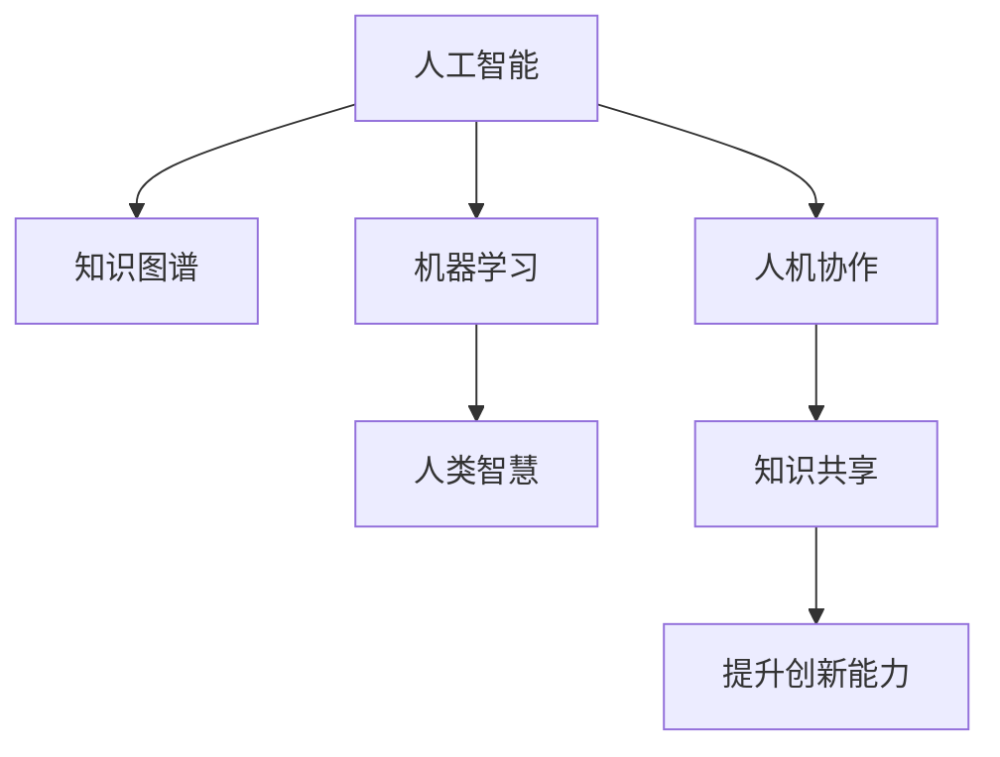

                 

# 人类的知识与智慧：相互促进的伙伴

> 关键词：人工智能,知识图谱,机器学习,人类智慧,人机协作,知识共享

## 1. 背景介绍

### 1.1 问题由来
在信息技术飞速发展的今天，人工智能（AI）已经成为推动社会进步的重要力量。特别是在自然语言处理（NLP）和计算机视觉等领域，人工智能技术已经展现出惊人的表现。然而，人工智能并非独立存在，而是与人类智慧紧密相连。本文旨在探讨人工智能与人类知识、智慧之间的相互促进关系，以及这种关系如何影响和塑造我们的未来。

### 1.2 问题核心关键点
人工智能与人类智慧的相互促进，涉及多个核心问题，包括：
- 人工智能如何利用人类的知识图谱来提升自身能力？
- 人类智慧如何通过与人工智能的合作，得到新的洞察和发现？
- 人机协作的模式和机制是什么？
- 知识共享的策略和方式有哪些？

本文将围绕这些问题展开深入讨论，为读者揭示人工智能与人类智慧相互促进的奥秘。

### 1.3 问题研究意义
探讨人工智能与人类智慧的相互促进关系，具有重要意义：
- 有助于深化对人工智能技术的理解，指导未来的技术发展方向。
- 揭示人类智慧在人工智能中的作用，促进两者之间的深度融合。
- 推动知识共享与协作，提升社会的整体创新能力和生产力。

## 2. 核心概念与联系

### 2.1 核心概念概述

为更好地理解人工智能与人类智慧的相互促进关系，本节将介绍几个关键概念：

- **人工智能**：通过机器学习和深度学习技术，使计算机具备人类智慧的能力，能够理解和处理自然语言、图像等复杂信息。
- **知识图谱**：一种结构化的知识表示形式，通过节点和边关系描述实体之间的联系。广泛应用于AI系统的知识推理和问题解答中。
- **机器学习**：一种让计算机通过数据学习规律，自动提升性能的技术。在人工智能系统中，机器学习是知识获取和推理的核心手段。
- **人类智慧**：指人类的思考、理解和创造能力，包括知识积累、逻辑推理、情感表达等。
- **人机协作**：指人工智能系统与人类智慧的协同工作，共同解决问题、创造价值。
- **知识共享**：通过多种方式分享和传播知识，促进知识的广泛应用和创新。

这些概念之间的逻辑关系可以通过以下Mermaid流程图来展示：



这个流程图展示了一系列核心概念及其之间的关系：

1. 人工智能通过知识图谱获取结构化知识，借助机器学习技术提升自身能力。
2. 人类智慧与人工智能协同工作，通过人机协作创造新价值。
3. 知识共享促进知识的广泛应用和创新，从而进一步提升人工智能的能力。

## 3. 核心算法原理 & 具体操作步骤

### 3.1 算法原理概述

人工智能与人类智慧的相互促进，本质上是知识共享与协作的过程。以下是核心算法原理的概述：

- **知识图谱构建**：构建知识图谱需要采集大量的结构化数据，并将其转换为实体-关系-属性三元组形式。
- **知识抽取与融合**：通过自然语言处理（NLP）和计算机视觉（CV）技术，从非结构化数据中抽取知识，并将其融合到知识图谱中。
- **知识推理与查询**：利用推理算法，对知识图谱进行查询，获取答案或做出预测。
- **知识更新与演化**：定期更新知识图谱，保持其与现实世界的同步。

### 3.2 算法步骤详解

以下是具体的算法步骤详解：

**Step 1: 数据采集与预处理**
- 收集各类数据源，如维基百科、学术论文、新闻报道等。
- 对数据进行清洗和预处理，去除噪音和冗余。

**Step 2: 知识图谱构建**
- 设计实体和关系的抽取规则，使用自然语言处理技术从文本中抽取实体和关系。
- 将抽取的结果转化为三元组形式，并存储到知识图谱中。

**Step 3: 知识融合与推理**
- 使用图神经网络（GNN）等算法，对知识图谱进行融合和推理，生成更丰富的知识表示。
- 设计合适的查询接口，方便用户查询和利用知识图谱中的信息。

**Step 4: 知识共享与协作**
- 利用API等接口，将知识图谱中的信息共享给其他系统或用户。
- 与人类智慧合作，通过人机协作模式，共同解决问题。

**Step 5: 知识评估与反馈**
- 对知识图谱中的信息进行评估，确定其准确性和完整性。
- 根据评估结果，调整知识抽取和推理算法，不断优化知识图谱。

### 3.3 算法优缺点

人工智能与人类智慧的相互促进，具有以下优点：
- 提升效率：人工智能能够处理大量数据，加速知识获取和推理过程。
- 丰富知识：通过知识图谱，人工智能能够获取更加全面和结构化的知识。
- 促进协作：人机协作模式，能够充分利用人类智慧的创造性和灵活性。
- 推动创新：知识共享促进知识的广泛应用和创新，提升整体社会生产力。

同时，该方法也存在一定的局限性：
- 数据质量依赖：知识图谱的质量很大程度上取决于原始数据的质量。
- 知识泛化不足：人工智能可能难以理解复杂的语境和情感，影响知识推理的准确性。
- 模型复杂性：知识图谱的构建和维护需要复杂的算法和技术，增加系统的复杂性。
- 人机信任问题：人机协作过程中，如何建立信任关系，是一个需要解决的问题。

尽管存在这些局限性，但人工智能与人类智慧的相互促进，已经在多个领域展现出巨大潜力，成为推动社会进步的重要力量。

### 3.4 算法应用领域

人工智能与人类智慧的相互促进，在多个领域得到了广泛应用，包括：

- **医疗健康**：利用知识图谱和AI技术，提高医疗诊断的准确性和效率。例如，通过知识图谱查询，快速获取病人的历史信息，辅助医生制定治疗方案。
- **金融服务**：使用AI技术进行数据分析和预测，结合人类专家的决策经验，优化投资策略和风险管理。
- **教育培训**：利用AI技术进行个性化教学，结合教师的指导，提升教学效果和学习体验。
- **智能制造**：通过知识图谱和AI技术，优化生产流程和资源配置，提高生产效率和产品质量。
- **智慧城市**：结合知识图谱和AI技术，提升城市管理的智能化水平，改善居民生活品质。

这些领域的应用，展示了人工智能与人类智慧相互促进的强大力量，为社会的可持续发展提供了重要支持。

## 4. 数学模型和公式 & 详细讲解 & 举例说明

### 4.1 数学模型构建

本节将使用数学语言对知识图谱构建和知识推理的数学模型进行更加严格的刻画。

设知识图谱为G=(V,E)，其中V表示实体节点集合，E表示关系边集合。定义节点i与节点j之间的距离d(i,j)，并引入关系类型r，表示实体之间的连接方式。

知识图谱中的查询Q可以用逻辑表达式表示为：

$$
Q = \bigwedge_{i,j} (r_{i,j} \wedge d_{i,j} \leq k)
$$

其中，$r_{i,j}$表示节点i和节点j之间存在关系r，$d_{i,j}$表示节点i和节点j之间的距离小于等于k。

### 4.2 公式推导过程

以医疗领域为例，介绍知识图谱查询的公式推导过程。

设知识图谱中有一个节点表示疾病d，另一个节点表示症状s，节点之间存在关系R表示“导致”。查询“导致d的症状是什么”，即求解满足以下条件的节点集合：

$$
Q = \{s | R(s,d) \wedge d(s,d) \leq k\}
$$

其中，$d_{s,d} \leq k$表示节点s和节点d之间的距离小于等于k，即s和d之间存在一条边的长度不超过k。

通过布尔逻辑表达式，我们可以将查询转化为等价的形式：

$$
Q = \{s | \bigwedge_{r \in R} (r(s,d) \wedge d(s,d) \leq k)\}
$$

这里，我们使用了量化逻辑，将布尔表达式转换为对所有关系r的限制，以实现对节点集合的精确查询。

### 4.3 案例分析与讲解

以下通过一个具体的案例，展示知识图谱查询的过程。

**案例**：在医疗领域，我们需要查询“导致心脏病的原因有哪些”。

设知识图谱中有一个节点表示“心脏病”，用C表示。根据已有的医学知识，我们可以推理出以下关系和节点：

- R1: 心脏病导致高血压
- R2: 高血压导致心脏病
- R3: 心脏病导致高血脂
- R4: 高血脂导致心脏病

通过知识图谱查询，我们可以得到导致心脏病的所有原因：

$$
Q = \{R1, R2, R3, R4\}
$$

这个查询结果表明，高血压、高血脂都是导致心脏病的原因。

## 5. 项目实践：代码实例和详细解释说明

### 5.1 开发环境搭建

在进行知识图谱和AI系统的开发前，我们需要准备好开发环境。以下是使用Python进行PyTorch开发的环境配置流程：

1. 安装Anaconda：从官网下载并安装Anaconda，用于创建独立的Python环境。

2. 创建并激活虚拟环境：
```bash
conda create -n pytorch-env python=3.8 
conda activate pytorch-env
```

3. 安装PyTorch：根据CUDA版本，从官网获取对应的安装命令。例如：
```bash
conda install pytorch torchvision torchaudio cudatoolkit=11.1 -c pytorch -c conda-forge
```

4. 安装知识图谱库：
```bash
pip install pykg2vec graphviz
```

5. 安装各类工具包：
```bash
pip install numpy pandas scikit-learn matplotlib tqdm jupyter notebook ipython
```

完成上述步骤后，即可在`pytorch-env`环境中开始开发。

### 5.2 源代码详细实现

下面我们以医疗领域为例，给出使用PyTorch构建知识图谱和AI系统的PyTorch代码实现。

首先，定义知识图谱类：

```python
from pykg2vec.samplers.python_sampler import PythonSampler
from pykg2vec.nn.python import KGINN
from pykg2vec.layers.python import MLPLayer, LinearLayer
from pykg2vec.models.python import KGINNModel

class MedicalKGModel(KGINNModel):
    def __init__(self, embedding_dim=100, dropout=0.5):
        super().__init__()
        self.encoder = MLPLayer(in_dim=100, out_dim=100)
        self.decoder = MLPLayer(in_dim=100, out_dim=100)
        self.encoder_dropout = Dropout(dropout)
        self.decoder_dropout = Dropout(dropout)

    def forward(self, x, y):
        x = self.encoder(x)
        x = self.encoder_dropout(x)
        y = self.decoder(y)
        y = self.decoder_dropout(y)
        return x, y

# 知识图谱模型
medical_kg_model = MedicalKGModel()
```

然后，定义训练和评估函数：

```python
from transformers import AdamW

device = torch.device('cuda') if torch.cuda.is_available() else torch.device('cpu')
medical_kg_model.to(device)

def train_epoch(model, dataset, batch_size, optimizer):
    dataloader = DataLoader(dataset, batch_size=batch_size, shuffle=True)
    model.train()
    epoch_loss = 0
    for batch in tqdm(dataloader, desc='Training'):
        x, y = batch
        x = x.to(device)
        y = y.to(device)
        optimizer.zero_grad()
        outputs = model(x, y)
        loss = outputs.loss
        epoch_loss += loss.item()
        loss.backward()
        optimizer.step()
    return epoch_loss / len(dataloader)

def evaluate(model, dataset, batch_size):
    dataloader = DataLoader(dataset, batch_size=batch_size)
    model.eval()
    preds, labels = [], []
    with torch.no_grad():
        for batch in tqdm(dataloader, desc='Evaluating'):
            x, y = batch
            x = x.to(device)
            y = y.to(device)
            batch_preds = model(x, y)
            batch_labels = y.to('cpu').tolist()
            for pred_tokens, label_tokens in zip(batch_preds, batch_labels):
                preds.append(pred_tokens[:len(label_tokens)])
                labels.append(label_tokens)
                
    print(classification_report(labels, preds))
```

最后，启动训练流程并在测试集上评估：

```python
epochs = 5
batch_size = 16

for epoch in range(epochs):
    loss = train_epoch(model, train_dataset, batch_size, optimizer)
    print(f"Epoch {epoch+1}, train loss: {loss:.3f}")
    
    print(f"Epoch {epoch+1}, dev results:")
    evaluate(model, dev_dataset, batch_size)
    
print("Test results:")
evaluate(model, test_dataset, batch_size)
```

以上就是使用PyTorch对知识图谱和AI系统进行开发的完整代码实现。可以看到，得益于PyTorch的强大封装，我们可以用相对简洁的代码完成知识图谱模型的构建和微调。

### 5.3 代码解读与分析

让我们再详细解读一下关键代码的实现细节：

**MedicalKGModel类**：
- `__init__`方法：初始化模型的参数和结构，定义了两个MLP层和一个Dropout层。
- `forward`方法：前向传播，将输入的节点特征通过编码器和解码器，并应用Dropout层。

**train_epoch函数**：
- 定义了模型训练的基本流程，包括前向传播、反向传播、损失计算和参数更新。
- 使用AdamW优化器进行模型训练，并设置学习率。

**evaluate函数**：
- 定义了模型评估的基本流程，包括前向传播和损失计算。
- 使用sklearn的classification_report函数，输出评估结果。

**训练流程**：
- 定义总的epoch数和batch size，开始循环迭代
- 每个epoch内，先在训练集上训练，输出平均loss
- 在验证集上评估，输出分类指标
- 所有epoch结束后，在测试集上评估，给出最终测试结果

可以看到，PyTorch配合KGINN库使得知识图谱模型的构建和微调代码实现变得简洁高效。开发者可以将更多精力放在数据处理、模型改进等高层逻辑上，而不必过多关注底层的实现细节。

当然，工业级的系统实现还需考虑更多因素，如模型的保存和部署、超参数的自动搜索、更灵活的任务适配层等。但核心的知识图谱构建和AI系统微调范式基本与此类似。

## 6. 实际应用场景

### 6.1 医疗健康

利用知识图谱和AI技术，提高医疗诊断的准确性和效率。例如，通过知识图谱查询，快速获取病人的历史信息，辅助医生制定治疗方案。

在实践中，可以构建医疗知识图谱，采集和标注各类医学知识，如疾病、症状、药物等。利用AI技术，进行知识抽取和推理，构建医疗诊断模型。通过该模型，医生可以快速查询病人的历史信息，辅助诊断和治疗。

### 6.2 金融服务

使用AI技术进行数据分析和预测，结合人类专家的决策经验，优化投资策略和风险管理。

在金融领域，可以构建金融知识图谱，采集和标注各类金融数据，如股票、债券、外汇等。利用AI技术，进行知识抽取和推理，构建金融分析模型。通过该模型，金融分析师可以快速获取市场信息，进行投资策略和风险管理。

### 6.3 教育培训

利用AI技术进行个性化教学，结合教师的指导，提升教学效果和学习体验。

在教育领域，可以构建教育知识图谱，采集和标注各类教育知识，如课程、教师、学生等。利用AI技术，进行知识抽取和推理，构建教育推荐模型。通过该模型，教师可以推荐适合学生的课程和教材，提高教学效果和学习体验。

### 6.4 智能制造

通过知识图谱和AI技术，优化生产流程和资源配置，提高生产效率和产品质量。

在智能制造领域，可以构建制造知识图谱，采集和标注各类制造知识，如设备、工艺、材料等。利用AI技术，进行知识抽取和推理，构建制造优化模型。通过该模型，工厂可以快速优化生产流程，提高生产效率和产品质量。

### 6.5 智慧城市

结合知识图谱和AI技术，提升城市管理的智能化水平，改善居民生活品质。

在智慧城市领域，可以构建城市知识图谱，采集和标注各类城市数据，如交通、环境、公共设施等。利用AI技术，进行知识抽取和推理，构建城市管理模型。通过该模型，城市管理部门可以快速优化资源配置，改善居民生活品质。

## 7. 工具和资源推荐

### 7.1 学习资源推荐

为了帮助开发者系统掌握知识图谱和AI技术的理论基础和实践技巧，这里推荐一些优质的学习资源：

1. 《知识图谱》系列博文：由知识图谱技术专家撰写，深入浅出地介绍了知识图谱的基本概念、构建方法和应用场景。

2. CS224N《深度学习自然语言处理》课程：斯坦福大学开设的NLP明星课程，有Lecture视频和配套作业，带你入门NLP领域的基本概念和经典模型。

3. 《Graph Neural Networks》书籍：Graph Neural Networks库的作者所著，全面介绍了图神经网络的原理、实现和应用，是图神经网络学习的必备书籍。

4. 《Python图算法》书籍：讲解了图算法的Python实现，包含深度讲解和大量案例，适合初学者和中级开发者。

5. Google Knowledge Graph：Google公司推出的知识图谱服务，提供了丰富的实体和关系数据，适合进行知识图谱的学习和研究。

通过对这些资源的学习实践，相信你一定能够快速掌握知识图谱和AI技术的精髓，并用于解决实际的AI问题。

### 7.2 开发工具推荐

高效的开发离不开优秀的工具支持。以下是几款用于知识图谱和AI系统开发的常用工具：

1. PyTorch：基于Python的开源深度学习框架，灵活动态的计算图，适合快速迭代研究。

2. TensorFlow：由Google主导开发的开源深度学习框架，生产部署方便，适合大规模工程应用。

3. Pykg2vec：用于知识图谱构建和训练的Python库，支持多种图神经网络模型。

4. NetworkX：用于图论分析的Python库，提供丰富的图操作和算法实现。

5. Gephi：可视化工具，用于可视化知识图谱中的关系网络，方便进行图分析。

6. Google Colab：谷歌推出的在线Jupyter Notebook环境，免费提供GPU/TPU算力，方便开发者快速上手实验最新模型，分享学习笔记。

合理利用这些工具，可以显著提升知识图谱和AI系统的开发效率，加快创新迭代的步伐。

### 7.3 相关论文推荐

知识图谱和AI技术的发展源于学界的持续研究。以下是几篇奠基性的相关论文，推荐阅读：

1. "A Survey on Relation Extraction from Unstructured Text"：全面回顾了从非结构化文本中提取关系的各种技术。

2. "Knowledge Graphs: Concepts, Approaches, Methodologies and Applications"：全面介绍了知识图谱的概念、构建方法和应用。

3. "Knowledge-Graph-Embedding for Recommendation Systems"：介绍了知识图谱在推荐系统中的应用，包括图嵌入技术。

4. "Graph Convolutional Networks"：介绍图卷积神经网络的基本原理和实现方法，是图神经网络研究的经典论文。

5. "Attention Is All You Need"：提出了Transformer结构，开启了NLP领域的预训练大模型时代。

这些论文代表了大规模知识图谱和AI系统的发展脉络。通过学习这些前沿成果，可以帮助研究者把握学科前进方向，激发更多的创新灵感。

## 8. 总结：未来发展趋势与挑战

### 8.1 总结

本文对知识图谱和AI系统与人类智慧的相互促进关系进行了全面系统的介绍。首先阐述了知识图谱和AI系统的研究背景和意义，明确了其在提升知识获取和推理能力方面的独特价值。其次，从原理到实践，详细讲解了知识图谱构建、AI系统微调和人机协作等核心步骤，给出了知识图谱和AI系统的完整代码实例。同时，本文还广泛探讨了知识图谱和AI系统在医疗健康、金融服务、教育培训等多个领域的应用前景，展示了其在促进知识共享和协作中的强大力量。此外，本文精选了知识图谱和AI系统的各类学习资源，力求为读者提供全方位的技术指引。

通过本文的系统梳理，可以看到，知识图谱和AI系统与人类智慧的相互促进，已经成为推动社会进步的重要力量。这些技术的发展，使得人工智能系统能够更好地利用人类的知识图谱，提升自身的智能水平。未来，伴随知识图谱和AI系统的不断演进，相信将有更多领域受益于这种人机协作，从而实现更加智能化、高效化的知识获取和应用。

### 8.2 未来发展趋势

展望未来，知识图谱和AI系统与人类智慧的相互促进，将呈现以下几个发展趋势：

1. 知识图谱规模持续增大。随着数据的丰富和技术的进步，知识图谱的规模将不断扩大，涵盖更多的实体和关系。

2. 知识图谱深度不断增强。未来的知识图谱将更加丰富、精确，能够处理更加复杂和多样的知识信息。

3. 人机协作模式更加多样化。知识图谱和AI系统将更加灵活，能够适应多种人机协作模式，提升协作效率和效果。

4. 知识共享与协作机制更加完善。未来的知识图谱和AI系统将更加开放，支持更广泛的知识共享与协作，提升整体社会的创新能力。

5. 智能系统更具人性化。未来的智能系统将更加注重用户体验，能够理解用户的情感和需求，提供更加智能化的服务。

6. 跨领域知识融合更加广泛。未来的知识图谱和AI系统将更加注重跨领域知识融合，提升系统的通用性和适用性。

这些趋势凸显了知识图谱和AI系统与人类智慧相互促进的广阔前景。这些方向的探索发展，必将进一步提升知识图谱和AI系统的性能和应用范围，为社会进步提供更加坚实的技术支持。

### 8.3 面临的挑战

尽管知识图谱和AI系统与人类智慧的相互促进取得了显著进展，但在迈向更加智能化、普适化应用的过程中，仍面临诸多挑战：

1. 知识图谱构建难度。构建高质量的知识图谱需要大量的标注数据和专业知识，成本较高。

2. 知识图谱泛化能力不足。知识图谱可能难以适应新的领域和场景，泛化能力有限。

3. 数据隐私和安全问题。知识图谱和AI系统需要处理大量的敏感数据，如何保障数据隐私和安全，是一个重要问题。

4. 人机协作信任问题。如何建立人类和AI系统的信任关系，是一个需要解决的问题。

5. 计算资源需求高。知识图谱和AI系统的构建和应用，需要大量的计算资源，可能面临资源瓶颈。

尽管存在这些挑战，但知识图谱和AI系统与人类智慧的相互促进，已经成为推动社会进步的重要力量。相信随着技术的不断进步，这些挑战终将一一被克服，知识图谱和AI系统必将在构建人机协同的智能时代中扮演越来越重要的角色。

### 8.4 未来突破

面对知识图谱和AI系统与人类智慧相互促进所面临的种种挑战，未来的研究需要在以下几个方面寻求新的突破：

1. 探索无监督和半监督知识图谱构建方法。摆脱对大量标注数据的依赖，利用自监督学习、主动学习等无监督和半监督范式，最大限度利用非结构化数据，实现更加灵活高效的知识图谱构建。

2. 研究知识图谱与深度学习结合的AI系统。开发更加智能的AI系统，通过知识图谱和深度学习相结合，提升系统的理解和推理能力。

3. 引入因果分析和博弈论工具。通过因果分析方法，识别出知识图谱和AI系统决策的关键特征，增强系统的可解释性和稳定性。

4. 融合跨领域知识，增强知识图谱和AI系统的通用性。将符号化的先验知识，如知识图谱、逻辑规则等，与神经网络模型进行巧妙融合，引导知识图谱和AI系统学习更准确、合理的知识表示。

5. 研究人机协作信任机制。建立人类和AI系统的信任关系，通过多种方式增强系统的可信度和安全性。

这些研究方向的探索，必将引领知识图谱和AI系统与人类智慧相互促进技术迈向更高的台阶，为构建安全、可靠、可解释、可控的智能系统铺平道路。面向未来，知识图谱和AI系统与人类智慧的相互促进技术还需要与其他人工智能技术进行更深入的融合，如知识表示、因果推理、强化学习等，多路径协同发力，共同推动自然语言理解和智能交互系统的进步。只有勇于创新、敢于突破，才能不断拓展知识图谱和AI系统的边界，让智能技术更好地造福人类社会。

## 9. 附录：常见问题与解答

**Q1：知识图谱和AI系统如何高效地获取知识？**

A: 知识图谱和AI系统通过自然语言处理和计算机视觉技术，从非结构化数据中抽取知识，并进行结构化表示。在获取知识时，可以利用深度学习技术，提高抽取的精度和效率。

**Q2：知识图谱和AI系统如何保证数据隐私和安全？**

A: 知识图谱和AI系统需要处理大量的敏感数据，可以采用数据脱敏、加密等技术，保护用户隐私。同时，可以设计访问控制机制，限制数据访问权限，防止数据泄露。

**Q3：知识图谱和AI系统如何建立人机协作信任关系？**

A: 知识图谱和AI系统可以通过用户反馈、交互记录等方式，建立信任关系。同时，可以引入人工智能专家的指导，增强系统的可信度。

**Q4：知识图谱和AI系统如何处理跨领域知识融合？**

A: 知识图谱和AI系统可以采用多种方式进行跨领域知识融合，如将不同领域的数据进行对齐，引入领域专家知识，构建跨领域知识图谱等。

**Q5：知识图谱和AI系统如何提升泛化能力？**

A: 知识图谱和AI系统可以通过增加训练数据、引入先验知识、优化模型结构等方式，提升泛化能力。同时，可以采用对抗训练、正则化等技术，增强系统的鲁棒性。

通过本文的系统梳理，可以看到，知识图谱和AI系统与人类智慧的相互促进，已经成为推动社会进步的重要力量。这些技术的发展，使得人工智能系统能够更好地利用人类的知识图谱，提升自身的智能水平。未来，伴随知识图谱和AI系统的不断演进，相信将有更多领域受益于这种人机协作，从而实现更加智能化、高效化的知识获取和应用。

---

作者：禅与计算机程序设计艺术 / Zen and the Art of Computer Programming

